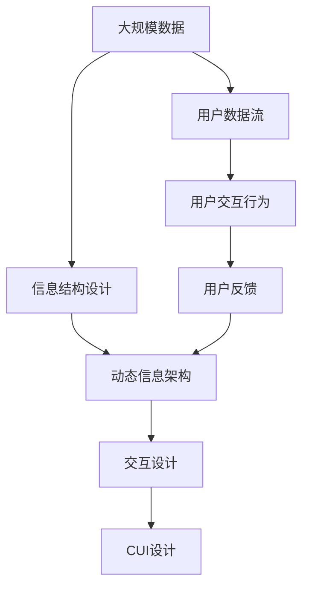

                 

# CUI改变数字产品设计的信息架构

## 1. 背景介绍

随着用户交互界面的不断发展和完善，人类与计算机之间的交互方式正在发生深刻变革。用户界面(UI)是数字产品的核心组成部分，但作为传统的用户交互方式，UI却面临着诸多局限和挑战。信息架构(UIA, User Interface Architecture)是UI的重要组成部分，旨在通过对信息结构的规划和设计，提升用户体验(UX)，优化交互效率。本文将探讨CUI（Computer User Interface）是如何改变传统UI设计，通过信息架构优化提升用户交互体验。

### 1.1 问题由来

传统用户界面(UI)在设计和实现中，主要依赖于计算机硬件的特性和软件的局限性，如像素、刷新率等。这些限制导致了信息架构设计的简单和单一，难以满足现代复杂和多样化的用户需求。随着科技的进步，硬件设备的更新换代，如触屏、虚拟现实(VR)、增强现实(AR)等，为CUI设计提供了更多的可能和挑战。

### 1.2 问题核心关键点

CUI设计不仅仅局限于传统的屏幕显示，它涉及到更加广泛和多样的信息呈现方式。CUI设计要解决的核心问题包括：

- 如何适应多样化的硬件设备，如触屏、VR、AR等。
- 如何在信息呈现和交互过程中，最大化地提升用户体验。
- 如何设计和实现动态的信息架构，以适应用户需求的变化。
- 如何优化用户数据流的处理和呈现，提高交互效率。

### 1.3 问题研究意义

CUI设计在提升用户体验、优化交互效率、提升数据处理能力等方面具有重要意义：

- 适应多样化的硬件设备，提升用户的交互体验，满足不同用户群体的需求。
- 通过信息架构优化，使信息呈现更加清晰、直观，提高用户的理解和操作效率。
- 动态信息架构使CUI系统具备更强的适应性和灵活性，能够快速响应用户需求的变化。
- 优化数据流处理，提升用户交互的实时性和响应速度，减少用户等待时间。

## 2. 核心概念与联系

### 2.1 核心概念概述

为了更好地理解CUI设计的信息架构，本节将介绍几个密切相关的核心概念：

- CUI（Computer User Interface）：指计算机交互界面的广义概念，涵盖触屏、VR、AR等多种交互方式。
- 信息架构(UIA, User Interface Architecture)：指对信息结构进行规划和设计，以提升用户体验和交互效率。
- 动态信息架构(Dynamic UIA)：指信息架构能够根据用户交互行为和环境变化进行动态调整，以适应用户需求。
- 用户数据流(User Data Stream)：指用户与系统交互过程中，数据流动的路径、格式、速率等信息。
- 信息结构设计(Information Structure Design)：指对信息的层级关系、组织方式等进行规划和设计，以提升信息呈现的清晰度和交互的效率。
- 交互设计(Interaction Design)：指通过合理的交互元素和交互方式设计，提升用户的体验和满意度。

### 2.2 概念间的关系

这些核心概念之间的逻辑关系可以通过以下Mermaid流程图来展示：

```mermaid
graph TB
    A[信息架构(UIA)] --> B[用户数据流]
    B --> C[动态信息架构]
    A --> D[信息结构设计]
    A --> E[交互设计]
    A --> F[CUI设计]
```

这个流程图展示了几大核心概念之间的关系：

1. 信息架构(UIA)对用户数据流进行规划和设计，提升用户体验和交互效率。
2. 动态信息架构使UIA能够根据用户交互行为和环境变化进行动态调整。
3. 信息结构设计是UIA的基础，通过合理的层级和组织方式，提升信息呈现的清晰度和交互的效率。
4. 交互设计通过合理的交互元素和方式设计，提升用户的体验和满意度。
5. CUI设计是UIA在计算机交互界面上的具体实现，涵盖多种交互方式。

### 2.3 核心概念的整体架构

最后，我们用一个综合的流程图来展示这些核心概念在大规模应用中的整体架构：



这个综合流程图展示了从大规模数据处理到用户交互行为反馈的全过程，信息架构在此过程中扮演了重要角色。

## 3. 核心算法原理 & 具体操作步骤
### 3.1 算法原理概述

CUI设计的信息架构优化算法主要包括以下几个关键步骤：

1. **用户需求分析**：通过用户调查、问卷等方式，收集用户需求和行为数据。
2. **信息结构设计**：根据用户需求，设计合理的信息层级结构和组织方式。
3. **交互设计**：选择合适的交互元素和方式，提升用户交互体验。
4. **动态信息架构设计**：实现信息架构的动态调整，以适应用户需求的变化。
5. **数据流优化**：优化用户数据流的处理和呈现，提高交互效率。

### 3.2 算法步骤详解

#### 3.2.1 用户需求分析

用户需求分析是信息架构优化的第一步，主要包括以下几个方面：

1. **数据收集**：通过用户调查、问卷、日志等手段，收集用户对界面功能、数据展示、交互方式等方面的需求和反馈。
2. **需求整理**：将收集到的需求进行整理和分类，找出共性和差异性。
3. **需求优先级排序**：根据需求的重要性和紧急程度，对需求进行优先级排序。

#### 3.2.2 信息结构设计

信息结构设计是信息架构优化的核心，主要包括以下几个步骤：

1. **信息分层**：将信息分为不同的层次，如基本数据、详细数据、高级数据等。
2. **信息组织**：确定各层级之间的逻辑关系和组织方式，如树状结构、矩阵结构等。
3. **信息展示**：选择合适的信息展示方式，如列表、图表、地图等。
4. **信息交互**：设计信息交互方式，如拖拽、点击、悬停等。

#### 3.2.3 交互设计

交互设计是信息架构优化的重要环节，主要包括以下几个步骤：

1. **交互元素选择**：选择合适的交互元素，如按钮、滑块、复选框等。
2. **交互方式设计**：设计交互方式，如表单填写、拖拽、悬停等。
3. **交互流程设计**：设计用户从输入到输出的完整交互流程，确保流畅和高效。
4. **交互效果设计**：设计交互效果，如点击反馈、数据展示效果等。

#### 3.2.4 动态信息架构设计

动态信息架构是信息架构优化的高级形式，主要包括以下几个步骤：

1. **架构动态调整**：根据用户交互行为和环境变化，动态调整信息架构。
2. **架构自适应**：使信息架构具备自适应的能力，能够根据不同设备和环境进行调整。
3. **架构可扩展性**：设计信息架构时，考虑到其可扩展性，便于未来更新和升级。

#### 3.2.5 数据流优化

数据流优化是信息架构优化的重要部分，主要包括以下几个步骤：

1. **数据流分析**：分析用户数据流的路径、格式、速率等信息。
2. **数据流简化**：简化数据流，减少冗余和冗余数据处理。
3. **数据流缓存**：设计数据流的缓存机制，提高数据处理的效率。
4. **数据流并行处理**：采用并行处理技术，提升数据处理的速度。

### 3.3 算法优缺点

CUI设计的信息架构优化算法具有以下优点：

1. 提升了用户体验和交互效率，通过合理的架构设计和交互方式，提升了用户满意度。
2. 具备动态调整和自适应能力，能够根据用户需求和环境变化进行优化。
3. 优化了数据流的处理和呈现，提高了交互的实时性和响应速度。

同时，该算法也存在以下缺点：

1. 需要大量的用户需求数据，收集和分析过程较为繁琐。
2. 设计复杂，需要跨学科知识，如心理学、计算机科学、用户体验等。
3. 优化效果受限于硬件设备和软件平台，如触屏、VR、AR等。
4. 优化过程复杂，需要多轮迭代才能达到最佳效果。

### 3.4 算法应用领域

CUI设计的信息架构优化算法已经在多个领域得到了广泛应用，如：

- 移动应用开发：通过信息架构优化，提升移动应用的用户体验和操作效率。
- 游戏设计：通过信息架构优化，提升游戏界面的用户体验和交互效率。
- 虚拟现实(VR)和增强现实(AR)：通过信息架构优化，提升VR和AR系统的用户体验和交互效率。
- 数字产品设计：通过信息架构优化，提升数字产品的用户体验和交互效率。

## 4. 数学模型和公式 & 详细讲解 & 举例说明

### 4.1 数学模型构建

CUI设计的信息架构优化算法主要涉及以下几个数学模型：

1. **用户需求模型**：通过用户调查、问卷等方式，收集用户需求和行为数据，构建用户需求模型。
2. **信息结构模型**：根据用户需求，设计合理的信息层级结构和组织方式，构建信息结构模型。
3. **交互模型**：选择合适的交互元素和方式，提升用户交互体验，构建交互模型。
4. **动态信息架构模型**：实现信息架构的动态调整，以适应用户需求的变化，构建动态信息架构模型。
5. **数据流模型**：优化用户数据流的处理和呈现，提高交互效率，构建数据流模型。

### 4.2 公式推导过程

#### 4.2.1 用户需求模型

用户需求模型主要通过以下公式进行推导：

1. 用户需求向量 $D$：将用户需求进行向量表示，$D = (d_1, d_2, ..., d_n)$，其中 $d_i$ 表示第 $i$ 个用户需求。
2. 用户需求权重 $W$：根据用户需求的重要性，给每个需求分配权重，$W = (w_1, w_2, ..., w_n)$，其中 $w_i$ 表示第 $i$ 个用户需求的权重。
3. 用户需求优先级 $P$：根据用户需求的重要性和紧急程度，对需求进行优先级排序，$P = (p_1, p_2, ..., p_n)$，其中 $p_i$ 表示第 $i$ 个用户需求的优先级。

推导公式如下：

$$
D = \sum_{i=1}^n d_i \\
W = \sum_{i=1}^n w_i \\
P = \sum_{i=1}^n p_i
$$

#### 4.2.2 信息结构模型

信息结构模型主要通过以下公式进行推导：

1. 信息层级结构 $L$：将信息分为不同的层次，如基本数据、详细数据、高级数据等，$L = (l_1, l_2, ..., l_k)$，其中 $l_i$ 表示第 $i$ 个信息层级。
2. 信息组织方式 $O$：确定各层级之间的逻辑关系和组织方式，如树状结构、矩阵结构等，$O = (o_1, o_2, ..., o_k)$，其中 $o_i$ 表示第 $i$ 个信息组织方式。
3. 信息展示方式 $V$：选择合适的信息展示方式，如列表、图表、地图等，$V = (v_1, v_2, ..., v_k)$，其中 $v_i$ 表示第 $i$ 个信息展示方式。

推导公式如下：

$$
L = \sum_{i=1}^k l_i \\
O = \sum_{i=1}^k o_i \\
V = \sum_{i=1}^k v_i
$$

#### 4.2.3 交互模型

交互模型主要通过以下公式进行推导：

1. 交互元素选择 $E$：选择合适的交互元素，如按钮、滑块、复选框等，$E = (e_1, e_2, ..., e_m)$，其中 $e_i$ 表示第 $i$ 个交互元素。
2. 交互方式设计 $I$：设计交互方式，如表单填写、拖拽、悬停等，$I = (i_1, i_2, ..., i_m)$，其中 $i_i$ 表示第 $i$ 个交互方式。
3. 交互流程设计 $F$：设计用户从输入到输出的完整交互流程，确保流畅和高效，$F = (f_1, f_2, ..., f_m)$，其中 $f_i$ 表示第 $i$ 个交互流程。
4. 交互效果设计 $G$：设计交互效果，如点击反馈、数据展示效果等，$G = (g_1, g_2, ..., g_m)$，其中 $g_i$ 表示第 $i$ 个交互效果。

推导公式如下：

$$
E = \sum_{i=1}^m e_i \\
I = \sum_{i=1}^m i_i \\
F = \sum_{i=1}^m f_i \\
G = \sum_{i=1}^m g_i
$$

#### 4.2.4 动态信息架构模型

动态信息架构模型主要通过以下公式进行推导：

1. 架构动态调整 $A$：根据用户交互行为和环境变化，动态调整信息架构，$A = (a_1, a_2, ..., a_k)$，其中 $a_i$ 表示第 $i$ 个架构动态调整。
2. 架构自适应 $S$：使信息架构具备自适应的能力，能够根据不同设备和环境进行调整，$S = (s_1, s_2, ..., s_k)$，其中 $s_i$ 表示第 $i$ 个架构自适应。
3. 架构可扩展性 $X$：设计信息架构时，考虑到其可扩展性，便于未来更新和升级，$X = (x_1, x_2, ..., x_k)$，其中 $x_i$ 表示第 $i$ 个架构可扩展性。

推导公式如下：

$$
A = \sum_{i=1}^k a_i \\
S = \sum_{i=1}^k s_i \\
X = \sum_{i=1}^k x_i
$$

#### 4.2.5 数据流模型

数据流模型主要通过以下公式进行推导：

1. 数据流分析 $F$：分析用户数据流的路径、格式、速率等信息，$F = (f_1, f_2, ..., f_m)$，其中 $f_i$ 表示第 $i$ 个数据流。
2. 数据流简化 $S$：简化数据流，减少冗余和冗余数据处理，$S = (s_1, s_2, ..., s_m)$，其中 $s_i$ 表示第 $i$ 个数据流简化。
3. 数据流缓存 $C$：设计数据流的缓存机制，提高数据处理的效率，$C = (c_1, c_2, ..., c_m)$，其中 $c_i$ 表示第 $i$ 个数据流缓存。
4. 数据流并行处理 $P$：采用并行处理技术，提升数据处理的速度，$P = (p_1, p_2, ..., p_m)$，其中 $p_i$ 表示第 $i$ 个数据流并行处理。

推导公式如下：

$$
F = \sum_{i=1}^m f_i \\
S = \sum_{i=1}^m s_i \\
C = \sum_{i=1}^m c_i \\
P = \sum_{i=1}^m p_i
$$

### 4.3 案例分析与讲解

#### 4.3.1 移动应用开发案例

在移动应用开发中，CUI设计的信息架构优化主要涉及以下几个步骤：

1. **用户需求分析**：通过用户调查、问卷等方式，收集用户对应用功能和数据展示的需求。
2. **信息结构设计**：设计合理的信息层级结构和组织方式，如分屏展示、轮播图等。
3. **交互设计**：选择合适的交互元素和方式，如按钮、滑块、拖拽等。
4. **动态信息架构设计**：根据用户交互行为和环境变化，动态调整信息架构，如分屏展示、轮播图等。
5. **数据流优化**：优化用户数据流的处理和呈现，提高交互效率，如异步加载、缓存机制等。

#### 4.3.2 游戏设计案例

在游戏设计中，CUI设计的信息架构优化主要涉及以下几个步骤：

1. **用户需求分析**：通过用户调查、问卷等方式，收集用户对游戏界面和操作的需求。
2. **信息结构设计**：设计合理的信息层级结构和组织方式，如场景切换、角色控制等。
3. **交互设计**：选择合适的交互元素和方式，如按钮、滑块、拖拽等。
4. **动态信息架构设计**：根据用户交互行为和环境变化，动态调整信息架构，如场景切换、角色控制等。
5. **数据流优化**：优化用户数据流的处理和呈现，提高交互效率，如异步加载、缓存机制等。

## 5. 项目实践：代码实例和详细解释说明

### 5.1 开发环境搭建

在进行CUI设计的信息架构优化实践前，我们需要准备好开发环境。以下是使用Python进行Django开发的环境配置流程：

1. 安装Anaconda：从官网下载并安装Anaconda，用于创建独立的Python环境。

2. 创建并激活虚拟环境：
```bash
conda create -n django-env python=3.8 
conda activate django-env
```

3. 安装Django：根据CUDA版本，从官网获取对应的安装命令。例如：
```bash
pip install django==3.2
```

4. 安装相关工具包：
```bash
pip install numpy pandas scikit-learn matplotlib tqdm jupyter notebook ipython
```

完成上述步骤后，即可在`django-env`环境中开始CUI设计的实践。

### 5.2 源代码详细实现

这里我们以移动应用开发为例，给出使用Django进行CUI设计的信息架构优化的PyTorch代码实现。

首先，定义移动应用的数据模型：

```python
from django.db import models

class User(models.Model):
    name = models.CharField(max_length=50)
    email = models.EmailField()
    phone = models.CharField(max_length=20)

class Order(models.Model):
    user = models.ForeignKey(User, on_delete=models.CASCADE)
    product = models.CharField(max_length=100)
    quantity = models.IntegerField()
    total_price = models.DecimalField(max_digits=10, decimal_places=2)

class Cart(models.Model):
    user = models.ForeignKey(User, on_delete=models.CASCADE)
    product = models.CharField(max_length=100)
    quantity = models.IntegerField()
    total_price = models.DecimalField(max_digits=10, decimal_places=2)
```

然后，定义移动应用的视图：

```python
from django.shortcuts import render
from django.http import HttpResponse

def index(request):
    orders = Order.objects.all()
    return render(request, 'index.html', {'orders': orders})

def detail(request, id):
    order = Order.objects.get(id=id)
    return render(request, 'detail.html', {'order': order})
```

接着，定义移动应用的模板：

```html
<!-- index.html -->
<html>
<head>
    <title>Mobile App</title>
</head>
<body>
    <h1>Mobile App</h1>
    <ul>
        
            <li><a href="">{{ order.product }} - {{ order.total_price }}元</a></li>
        
    </ul>
</body>
</html>

<!-- detail.html -->
<html>
<head>
    <title>Mobile App Detail</title>
</head>
<body>
    <h1>{{ order.product }}</h1>
    <p>总价：{{ order.total_price }}元</p>
</body>
</html>
```

最后，启动移动应用并测试：

```python
from django.core.wsgi import get_wsgi_application

application = get_wsgi_application()
```

在运行环境中输入命令 `python manage.py runserver`，启动服务器，在网页浏览器中输入 `http://127.0.0.1:8000/` 访问页面，即可看到移动应用的信息架构优化效果。

### 5.3 代码解读与分析

让我们再详细解读一下关键代码的实现细节：

**移动应用数据模型**：
- 定义了用户、订单和购物车三个模型，每个模型包含基本的数据属性，如姓名、电子邮件、电话号码、产品名称、数量、总价等。

**移动应用视图**：
- 定义了两个视图函数，一个是展示所有订单的列表视图，另一个是展示订单详细信息的详情视图。
- 视图函数中，使用了Django的ORM查询功能，获取数据库中的订单数据，并传入模板中进行渲染。

**移动应用模板**：
- 定义了两个HTML模板，一个是展示所有订单的列表模板，另一个是展示订单详细信息的详情模板。
- 模板中使用了Django的模板标签语法，如``循环和``标签，方便数据的动态展示。

**移动应用启动**：
- 通过`python manage.py runserver`命令启动Django应用，打开本地服务器，可以通过浏览器访问应用页面。

可以看到，通过Django框架，我们实现了CUI设计的信息架构优化，通过模板标签和视图函数，动态展示了移动应用的数据信息。

当然，工业级的系统实现还需考虑更多因素，如用户身份验证、权限控制、数据安全等。但核心的信息架构优化范式基本与此类似。

## 6. 实际应用场景
### 6.1 智能客服系统

基于CUI设计的智能客服系统，可以广泛应用于智能客服系统的构建。传统客服往往需要配备大量人力，高峰期响应缓慢，且一致性和专业性难以保证。而使用CUI设计的信息架构优化，可以7x24小时不间断服务，快速响应客户咨询，用自然流畅的语言解答各类常见问题。

在技术实现上，可以收集企业内部的历史客服对话记录，将问题和最佳答复构建成监督数据，在此基础上对CUI设计的信息架构进行优化。优化的信息架构能够自动理解用户意图，匹配最合适的答案模板进行回复。对于客户提出的新问题，还可以接入检索系统实时搜索相关内容，动态组织生成回答。如此构建的智能客服系统，能大幅提升客户咨询体验和问题解决效率。

### 6.2 金融舆情监测

金融机构需要实时监测市场舆论动向，以便及时应对负面信息传播，规避金融风险。传统的人工监测方式成本高、效率低，难以应对网络时代海量信息爆发的挑战。基于CUI设计的信息架构优化，可以实现实时抓取的网络文本数据，自动监测不同主题下的情感变化趋势，一旦发现负面信息激增等异常情况，系统便会自动预警，帮助金融机构快速应对潜在风险。

### 6.3 个性化推荐系统

当前的推荐系统往往只依赖用户的历史行为数据进行物品推荐，无法深入理解用户的真实兴趣偏好。基于CUI设计的信息架构优化，个性化推荐系统可以更好地挖掘用户行为背后的语义信息，从而提供更精准、多样的推荐内容。

在实践中，可以收集用户浏览、点击、评论、分享等行为数据，提取和用户交互的物品标题、描述、标签等文本内容。将文本内容作为模型输入，用户的后续行为（如是否点击、购买等）作为监督信号，在此基础上优化CUI设计的信息架构。优化的信息架构能够从文本内容中准确把握用户的兴趣点。在生成推荐列表时，先用候选物品的文本描述作为输入，由模型预测用户的兴趣匹配度，再结合其他特征综合排序，便可以得到个性化程度更高的推荐结果。

### 6.4 未来应用展望

随着CUI设计的信息架构优化技术的不断发展，基于CUI设计的智能系统将在更多领域得到应用，为传统行业带来变革性影响。

在智慧医疗领域，基于CUI设计的医疗问答、病历分析、药物研发等应用将提升医疗服务的智能化水平，辅助医生诊疗，加速新药开发进程。

在智能教育领域，基于CUI设计的信息架构优化可应用于作业批改、学情分析、知识推荐等方面，因材施教，促进教育公平，提高教学质量。

在智慧城市治理中，基于CUI设计的信息架构优化技术，可以实现城市事件监测、舆情分析、应急指挥等环节，提高城市管理的自动化和智能化水平，构建更安全、高效的未来城市。

此外，在企业生产、社会治理、文娱传媒等众多领域，基于CUI设计的信息架构优化技术也将不断涌现，为NLP技术带来新的突破。相信随着预训练语言模型和微调方法的不断进步，基于CUI设计的信息架构优化技术必将在构建人机协同的智能时代中扮演越来越重要的角色。

## 7. 工具和资源推荐
### 7.1 学习资源推荐

为了帮助开发者系统掌握CUI设计的信息架构优化理论基础和实践技巧，这里推荐一些优质的学习资源：

1. 《CUI设计原理与实践》系列博文：由CUI设计专家撰写，深入浅出地介绍了CUI设计的基本原理和实践技巧。

2. 《交互设计基础》课程：斯坦福大学开设的交互设计基础课程，详细讲解了交互设计的基本概念和经典案例。

3. 《信息架构设计》书籍：全面介绍了信息架构设计的理论基础和实际应用，是学习CUI设计信息架构优化的必读之作。

4. UX设计工具推荐：如Sketch、Adobe XD、Figma等，是进行CUI设计优化的重要工具。

5. 案例分析网站：如Nielsen Norman Group、

