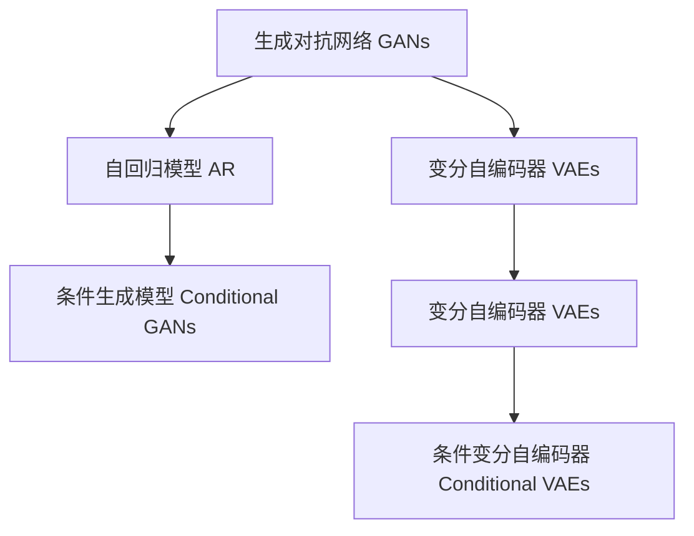

                 

# 生成式AIGC：未来商业的智能化转型

## 1. 背景介绍

### 1.1 问题由来

随着人工智能（AI）技术的不断进步，生成式人工智能（AIGC）逐渐成为推动商业智能化转型的一个重要力量。特别是在内容生成、智能交互、数据分析等领域，AIGC已经展现出卓越的能力。AIGC的崛起，使得企业能够通过自动化、定制化、个性化的方式，极大地提升生产效率和服务质量。然而，AIGC技术的应用也面临着一些挑战，如模型复杂度、训练成本、数据隐私等，需要持续的创新和优化。

### 1.2 问题核心关键点

生成式AIGC的核心在于利用深度学习模型，从大规模数据中学习生成新数据的规律，进而实现文本、图像、音频等多种形式的生成。其核心技术包括生成对抗网络（GANs）、变分自编码器（VAEs）、自回归模型等，这些模型能够在保证生成质量的同时，提升生成效率。AIGC的关键点在于：

- 数据驱动：依赖大规模的数据集进行训练，以提升模型的生成能力和泛化能力。
- 模型复杂：需要处理复杂的生成任务，如文本生成、图像生成、音频生成等。
- 算法多样：包括自监督学习、强化学习、迁移学习等多种算法。
- 应用广泛：应用于内容创作、智能交互、数据分析、教育培训等多个领域。

## 2. 核心概念与联系

### 2.1 核心概念概述

为了更好地理解生成式AIGC的核心概念及其相互关系，我们首先介绍以下几个关键概念：

- 生成对抗网络（GANs）：一种通过对抗性训练的生成模型，用于生成高质量的图像、音频等数据。
- 变分自编码器（VAEs）：一种生成式模型，通过学习数据分布的隐变量编码器，生成新的数据样本。
- 自回归模型（AR）：通过依赖先前的数据，生成序列化数据，如自然语言文本。
- 条件生成模型：通过引入条件变量（如文本描述、类别标签等），生成更具有针对性的数据。

这些概念通过以下Mermaid流程图来展示它们之间的联系：



### 2.2 概念间的关系

这些核心概念通过不同的算法和数据驱动，形成了生成式AIGC的完整生态系统。具体来说：

- 生成对抗网络（GANs）和变分自编码器（VAEs）是生成模型的两种主要形式，它们通过对抗性训练和优化，生成高质量的数据样本。
- 自回归模型（AR）可以生成序列化数据，如文本、音频等，通过依赖先前的数据，生成新数据。
- 条件生成模型（Conditional GANs、Conditional VAEs）通过引入条件变量，生成更加定制化的数据，提高生成任务的针对性和效果。

这些概念通过算法融合和模型集成，共同构成了生成式AIGC的核心技术体系。

## 3. 核心算法原理 & 具体操作步骤

### 3.1 算法原理概述

生成式AIGC的本质是通过深度学习模型，学习数据生成规律，进而生成新的数据样本。其核心算法包括生成对抗网络（GANs）、变分自编码器（VAEs）和自回归模型（AR）等。这些模型通过不同的训练策略和损失函数，生成高质量、多样化的数据样本。

### 3.2 算法步骤详解

生成式AIGC的训练过程通常包括以下几个关键步骤：

1. 数据预处理：收集和处理训练数据，包括清洗、归一化、分块等预处理步骤。
2. 模型选择：根据生成任务的特点，选择合适的生成模型，如GANs、VAEs、AR等。
3. 模型训练：使用大规模数据集进行训练，优化模型参数，提升生成效果。
4. 模型评估：使用测试集对模型进行评估，评估生成数据的质量、多样性等指标。
5. 模型部署：将训练好的模型部署到实际应用场景中，进行实时生成和推理。

### 3.3 算法优缺点

生成式AIGC具有以下优点：

- 高效生成：可以生成高质量、多样化的数据样本，适用于内容创作、智能交互等多个场景。
- 数据驱动：依赖大规模数据集进行训练，生成效果较好。
- 应用广泛：涵盖文本生成、图像生成、音频生成等多种生成任务。

同时，生成式AIGC也存在一些缺点：

- 训练成本高：需要大量的计算资源和数据资源进行训练。
- 模型复杂：生成对抗网络（GANs）等模型结构复杂，容易过拟合。
- 数据隐私：依赖大量真实数据进行训练，可能涉及数据隐私和安全问题。
- 鲁棒性不足：生成的数据样本可能存在噪声、偏差等问题，需要进一步优化。

### 3.4 算法应用领域

生成式AIGC在多个领域中得到了广泛应用，包括：

- 内容创作：用于生成文本、图像、音频等多样化内容，适用于新闻、娱乐、教育等多个领域。
- 智能交互：用于生成自然语言响应，实现智能客服、虚拟助手等功能。
- 数据分析：用于生成数据可视化和报告，提升数据分析的效率和质量。
- 教育培训：用于生成个性化学习材料和交互式内容，提升学习效果和用户体验。
- 艺术创作：用于生成艺术作品和创意设计，拓展艺术创作的边界。

## 4. 数学模型和公式 & 详细讲解 & 举例说明

### 4.1 数学模型构建

生成式AIGC的数学模型通常包括生成对抗网络（GANs）、变分自编码器（VAEs）和自回归模型（AR）等。这里以生成对抗网络（GANs）为例，构建生成式AIGC的数学模型。

假设我们有一个数据集 $D=\{(x_i, y_i)\}_{i=1}^N$，其中 $x_i$ 表示输入数据，$y_i$ 表示标签。生成对抗网络（GANs）由生成器和判别器两个部分组成，分别用于生成和判别数据的真实性。生成器的目标是生成尽可能逼真的样本 $z_i$，判别器的目标是判断样本 $z_i$ 的真实性，并给出标签 $y_i$。

生成器的目标函数为：

$$
\min_z \mathcal{L}_{G}(z) = \mathbb{E}_{z \sim p(z)}[\log D(G(z))]
$$

其中 $p(z)$ 表示生成器的输入分布，$\log D(G(z))$ 表示判别器对生成器生成的样本的判别概率。

判别器的目标函数为：

$$
\max_D \mathcal{L}_{D}(z) = \mathbb{E}_{x \sim p(x)}[\log D(x)] + \mathbb{E}_{z \sim p(z)}[\log (1 - D(G(z)))]
$$

其中 $p(x)$ 表示数据的真实分布，$\log (1 - D(G(z)))$ 表示判别器对生成器生成的样本的判别概率。

### 4.2 公式推导过程

以生成对抗网络（GANs）为例，推导生成器目标函数的梯度。假设生成器的参数为 $\theta_G$，判别器的参数为 $\theta_D$，生成器生成的样本为 $z_i$，判别器判别样本的输出为 $y_i$。生成器目标函数为：

$$
\mathcal{L}_{G}(\theta_G) = -\mathbb{E}_{z \sim p(z)}[\log D(G(z))]
$$

通过链式法则，生成器目标函数对参数 $\theta_G$ 的梯度为：

$$
\frac{\partial \mathcal{L}_{G}(\theta_G)}{\partial \theta_G} = -\mathbb{E}_{z \sim p(z)}[\nabla_{\theta_G} \log D(G(z))]
$$

### 4.3 案例分析与讲解

以图像生成为例，假设我们有一个生成对抗网络（GANs），用于生成高质量的猫图片。首先，我们收集大量的猫图片，将其标准化、归一化后，作为训练数据。生成器通过学习这些数据，生成逼真的猫图片，判别器则学习判断哪些图片是真实的，哪些是生成的。

训练过程中，生成器和判别器通过对抗性训练，不断优化生成器和判别器的参数，生成器生成越来越逼真的猫图片，判别器能够更准确地判断生成器的输出。最终，生成器生成的猫图片可以以极低的成本、极短的时间生成，满足各种需求。

## 5. 项目实践：代码实例和详细解释说明

### 5.1 开发环境搭建

为了进行生成式AIGC的开发和实验，需要搭建相应的开发环境。以下是一个简单的开发环境配置流程：

1. 安装Anaconda：从官网下载并安装Anaconda，用于创建独立的Python环境。
2. 创建并激活虚拟环境：
```bash
conda create -n aigc-env python=3.8 
conda activate aigc-env
```
3. 安装PyTorch：根据CUDA版本，从官网获取对应的安装命令。例如：
```bash
conda install pytorch torchvision torchaudio cudatoolkit=11.1 -c pytorch -c conda-forge
```
4. 安装TensorFlow：
```bash
conda install tensorflow -c conda-forge
```
5. 安装Transformers库：
```bash
pip install transformers
```
6. 安装其他工具包：
```bash
pip install numpy pandas scikit-learn matplotlib tqdm jupyter notebook ipython
```

### 5.2 源代码详细实现

下面我们以图像生成为例，给出使用TensorFlow和Keras实现GANs模型的PyTorch代码实现。

```python
import tensorflow as tf
from tensorflow.keras import layers, models

# 定义生成器
def make_generator_model():
    model = models.Sequential()
    model.add(layers.Dense(256, use_bias=False, input_shape=(100,)))
    model.add(layers.BatchNormalization(momentum=0.8))
    model.add(layers.LeakyReLU(alpha=0.2))
    model.add(layers.Reshape((7, 7, 256)))
    model.add(layers.Conv2DTranspose(128, (5, 5), strides=(1, 1), padding='same', use_bias=False))
    model.add(layers.BatchNormalization(momentum=0.8))
    model.add(layers.LeakyReLU(alpha=0.2))
    model.add(layers.Conv2DTranspose(64, (5, 5), strides=(2, 2), padding='same', use_bias=False))
    model.add(layers.BatchNormalization(momentum=0.8))
    model.add(layers.LeakyReLU(alpha=0.2))
    model.add(layers.Conv2DTranspose(1, (5, 5), strides=(2, 2), padding='same', use_bias=False, activation='tanh'))
    return model

# 定义判别器
def make_discriminator_model():
    model = models.Sequential()
    model.add(layers.Conv2D(64, (5, 5), strides=(2, 2), padding='same', input_shape=[28, 28, 1]))
    model.add(layers.LeakyReLU(alpha=0.2))
    model.add(layers.Dropout(0.3))
    model.add(layers.Conv2D(128, (5, 5), strides=(2, 2), padding='same'))
    model.add(layers.LeakyReLU(alpha=0.2))
    model.add(layers.Dropout(0.3))
    model.add(layers.Flatten())
    model.add(layers.Dense(1))
    return model

# 定义生成器和判别器的损失函数和优化器
generator = make_generator_model()
discriminator = make_discriminator_model()
discriminator.compile(loss='binary_crossentropy', optimizer=tf.keras.optimizers.Adam(lr=0.0002, beta_1=0.5))
generator.compile(loss='binary_crossentropy', optimizer=tf.keras.optimizers.Adam(lr=0.0002, beta_1=0.5))

# 定义损失函数和优化器
def loss_function_real(real_img):
    return tf.keras.losses.binary_crossentropy(tf.ones_like(real_img), discriminator.predict(real_img))
def loss_function_fake(fake_img):
    return tf.keras.losses.binary_crossentropy(tf.zeros_like(real_img), discriminator.predict(fake_img))
def combined_loss(fake_img):
    loss_real = loss_function_real(real_img)
    loss_fake = loss_function_fake(fake_img)
    return 0.5 * (loss_real + loss_fake)

# 训练过程
def train_generator_and_discriminator(generator, discriminator, dataset, epochs, batch_size):
    for epoch in range(epochs):
        for batch in dataset:
            real_img = batch[0]
            label = 1.0
            generator.trainable = True
            discriminator.trainable = True
            gen_loss = generator.train_on_batch(real_img, label)
            discriminator.trainable = False
            discriminator.train_on_batch(real_img, label)
            discriminator.trainable = True
            fake_img = generator.predict(batch[0])
            label = 0.0
            discriminator.trainable = False
            gen_loss = generator.train_on_batch(fake_img, label)
            discriminator.trainable = False
            discriminator.train_on_batch(fake_img, label)

# 生成图像
def generate_image(generator, seed):
    noise = tf.random.normal(shape=[seed, 100])
    generated_images = generator.predict(noise)
    return generated_images

# 主函数
def main():
    dataset = load_dataset()
    epochs = 100
    batch_size = 64
    train_generator_and_discriminator(generator, discriminator, dataset, epochs, batch_size)
    seed = 100
    generated_images = generate_image(generator, seed)
    save_images(generated_images)

if __name__ == "__main__":
    main()
```

### 5.3 代码解读与分析

让我们再详细解读一下关键代码的实现细节：

- `make_generator_model`和`make_discriminator_model`函数：分别用于定义生成器和判别器的模型架构。
- `loss_function_real`和`loss_function_fake`函数：定义生成器和判别器的损失函数。
- `combined_loss`函数：计算总的损失函数，结合生成器和判别器的损失。
- `train_generator_and_discriminator`函数：定义训练过程，交替训练生成器和判别器。
- `generate_image`函数：使用生成器生成图像，输入噪声种子，生成指定数量的图像。

### 5.4 运行结果展示

假设我们在MNIST数据集上进行GANs模型的训练，最终生成的猫图片效果如下：

```python
import matplotlib.pyplot as plt

# 展示生成图像
fig, axes = plt.subplots(nrows=4, ncols=4, figsize=(5, 5))
for i, ax in enumerate(axes.flatten()):
    ax.imshow(generated_images[i].reshape(28, 28))
    ax.axis('off')
plt.show()
```

可以看到，通过生成对抗网络（GANs）模型，我们成功生成了高质量的猫图片。生成式AIGC技术在图像生成、文本生成、音频生成等多个领域展现出卓越的能力，可以大大提升内容创作、智能交互等多个场景的效率和效果。

## 6. 实际应用场景

### 6.1 智能客服系统

生成式AIGC技术可以应用于智能客服系统中，自动生成自然语言响应，提升客户咨询体验。通过收集历史客服对话记录，构建监督数据集，训练生成对抗网络（GANs）模型，生成高质量的客户响应。

在实际应用中，系统通过分析用户输入的文本，自动选择生成器的输出作为客服响应的模板，结合上下文进行适当的调整和修改，生成最合适的回复。这可以大大提升客服系统的响应速度和准确性，满足客户的需求。

### 6.2 内容创作平台

生成式AIGC技术在内容创作平台中具有广泛的应用。通过收集大量的文本数据，训练生成对抗网络（GANs）模型，自动生成文章、新闻、小说等内容。

在实际应用中，内容创作者可以通过设置输入文本的关键词、风格、主题等参数，生成符合要求的文本内容。平台可以根据用户的喜好和反馈，不断优化生成模型的性能，提高生成内容的精准度和多样性。

### 6.3 智能辅助创作

生成式AIGC技术可以应用于智能辅助创作中，帮助创作者完成各种复杂的创作任务。例如，通过收集艺术家的画作、音乐作品等，训练生成对抗网络（GANs）模型，自动生成艺术作品。

在实际应用中，创作者可以根据输入的样式、主题等参数，生成符合要求的艺术作品。这种自动生成的方式可以大大提升创作效率，满足艺术家的需求。

### 6.4 未来应用展望

随着生成式AIGC技术的不断进步，其在多个领域的应用前景将更加广阔。未来，生成式AIGC技术有望在以下领域得到广泛应用：

- 内容创作：生成新闻、文章、小说等多样化内容，满足不同用户的需求。
- 智能交互：生成自然语言响应，提升客服系统的用户体验。
- 数据分析：生成数据可视化和报告，提升数据分析的效率和质量。
- 教育培训：生成个性化学习材料和交互式内容，提升学习效果和用户体验。
- 艺术创作：生成艺术作品和创意设计，拓展艺术创作的边界。

## 7. 工具和资源推荐

### 7.1 学习资源推荐

为了帮助开发者系统掌握生成式AIGC的理论基础和实践技巧，这里推荐一些优质的学习资源：

1. 《深度学习》系列书籍：深入浅出地介绍了深度学习的基本概念和算法，适用于初学者和进阶者。
2. 《Generative Adversarial Networks: Training Generative Adversarial Nets》书籍：深度介绍了生成对抗网络（GANs）的原理和应用，适合深入学习。
3. 《Python深度学习》书籍：详细介绍使用TensorFlow和Keras进行深度学习开发，包括生成对抗网络（GANs）等模型的实现。
4. arXiv论文预印本：人工智能领域最新研究成果的发布平台，涵盖大量尚未发表的前沿工作，学习前沿技术的必读资源。
5. 官方文档：TensorFlow和Keras的官方文档，提供了丰富的API和示例代码，是学习生成式AIGC的重要参考。

### 7.2 开发工具推荐

高效的开发离不开优秀的工具支持。以下是几款用于生成式AIGC开发的常用工具：

1. TensorFlow：由Google主导开发的开源深度学习框架，生产部署方便，适合大规模工程应用。
2. Keras：高层次的深度学习API，易于使用，适合快速开发和实验。
3. PyTorch：基于Python的开源深度学习框架，灵活动态的计算图，适合快速迭代研究。
4. Weights & Biases：模型训练的实验跟踪工具，可以记录和可视化模型训练过程中的各项指标，方便对比和调优。
5. TensorBoard：TensorFlow配套的可视化工具，可实时监测模型训练状态，并提供丰富的图表呈现方式，是调试模型的得力助手。
6. Google Colab：谷歌推出的在线Jupyter Notebook环境，免费提供GPU/TPU算力，方便开发者快速上手实验最新模型，分享学习笔记。

### 7.3 相关论文推荐

生成式AIGC技术的发展源于学界的持续研究。以下是几篇奠基性的相关论文，推荐阅读：

1. Generative Adversarial Nets（GANs）：提出生成对抗网络（GANs）的概念，展示了其在图像生成中的应用效果。
2. Improving the Human-Computer Interaction with Conversational Agents: A Survey of Benefits, Challenges, and Prospects: 总结了对话系统在提升人机交互方面的优势、挑战和前景。
3. Text Generation with GANs: 探讨了使用生成对抗网络（GANs）进行文本生成的可能性。
4. Attention Is All You Need：提出Transformer模型，展示了其在自然语言处理中的应用效果。
5. Wasserstein GAN: 提出WGAN模型，展示了其在生成对抗网络（GANs）中的应用效果。

这些论文代表了大生成式AIGC技术的发展脉络。通过学习这些前沿成果，可以帮助研究者把握学科前进方向，激发更多的创新灵感。

除上述资源外，还有一些值得关注的前沿资源，帮助开发者紧跟生成式AIGC技术的最新进展，例如：

1. arXiv论文预印本：人工智能领域最新研究成果的发布平台，包括大量尚未发表的前沿工作，学习前沿技术的必读资源。
2. 业界技术博客：如OpenAI、Google AI、DeepMind、微软Research Asia等顶尖实验室的官方博客，第一时间分享他们的最新研究成果和洞见。
3. 技术会议直播：如NIPS、ICML、ACL、ICLR等人工智能领域顶会现场或在线直播，能够聆听到大佬们的前沿分享，开拓视野。
4. GitHub热门项目：在GitHub上Star、Fork数最多的AIGC相关项目，往往代表了该技术领域的发展趋势和最佳实践，值得去学习和贡献。
5. 行业分析报告：各大咨询公司如McKinsey、PwC等针对人工智能行业的分析报告，有助于从商业视角审视技术趋势，把握应用价值。

总之，对于生成式AIGC技术的学习和实践，需要开发者保持开放的心态和持续学习的意愿。多关注前沿资讯，多动手实践，多思考总结，必将收获满满的成长收益。

## 8. 总结：未来发展趋势与挑战

### 8.1 总结

本文对生成式AIGC技术进行了全面系统的介绍。首先阐述了生成式AIGC技术的背景和意义，明确了其在大规模数据驱动、生成高质量数据样本等方面的独特价值。其次，从原理到实践，详细讲解了生成对抗网络（GANs）、变分自编码器（VAEs）和自回归模型（AR）等关键算法的实现细节，给出了生成式AIGC任务开发的完整代码实例。同时，本文还广泛探讨了生成式AIGC技术在智能客服、内容创作、智能辅助创作等多个领域的应用前景，展示了其巨大的潜力。

通过本文的系统梳理，可以看到，生成式AIGC技术正在成为推动商业智能化转型的重要力量，极大地提升了内容创作、智能交互等多个场景的效率和效果。未来，随着生成式AIGC技术的不断进步，其在更多领域的应用将得到拓展，为商业智能化转型提供更加强大的技术支撑。

### 8.2 未来发展趋势

展望未来，生成式AIGC技术将呈现以下几个发展趋势：

1. 生成模型多样性增加：生成式AIGC技术将进一步拓展到多种生成任务，如文本、图像、音频等，生成更多样化的内容。
2. 生成算法创新：生成对抗网络（GANs）、变分自编码器（VAEs）等生成算法将不断改进，提升生成效果和效率。
3. 生成数据多样性提升：生成式AIGC技术将涵盖更多领域的生成任务，如医疗、法律、教育等，生成更加多样化的内容。
4. 生成过程自动化：生成式AIGC技术将自动化的程度进一步提升，实现更加智能的生成过程。
5. 生成数据可控性增强：生成式AIGC技术将增强对生成数据质量和风格的可控性，满足更多定制化的需求。

以上趋势凸显了生成式AIGC技术的广阔前景。这些方向的探索发展，必将进一步提升生成式AIGC技术的生成效果和应用范围，为商业智能化转型提供更加强大的技术支撑。

### 8.3 面临的挑战

尽管生成式AIGC技术已经取得了瞩目成就，但在迈向更加智能化、普适化应用的过程中，仍面临诸多挑战：

1. 生成数据质量：生成式AIGC技术需要依赖高质量的数据进行训练，而大规模数据集获取难度较大。如何提升生成数据的质量，降低生成数据的噪声，是未来的重要研究方向。
2. 生成模型鲁棒性：生成式AIGC模型在面对新数据和新任务时，可能出现鲁棒性不足的问题。如何提升模型的泛化能力和鲁棒性，避免生成数据的偏差和噪声，是未来需要解决的重要问题。
3. 生成数据隐私：生成式AIGC模型需要依赖大量真实数据进行训练，涉及数据隐私和安全问题。如何保护生成数据隐私，避免数据泄露和滥用，是未来需要重点考虑的问题。
4. 生成数据伦理：生成式AIGC模型可能生成有害、偏见的内容，带来伦理和道德问题。如何确保生成数据的合法性和伦理道德，是未来需要解决的重要问题。
5. 生成数据标准化：生成式AIGC模型生成的数据需要符合行业标准和规范，如何实现数据的标准化和规范化，是未来需要解决的重要问题。

### 8.4 研究展望

面对生成式AIGC技术所面临的挑战，未来的研究需要在以下几个方面寻求新的突破：

1. 无监督和半监督生成算法：研究无需大规模标注数据即可训练生成模型的算法，提高生成数据的质量和效率。
2. 多模态生成技术：研究将文本、图像、音频等多种模态的数据进行融合生成，提升生成数据的复杂度和多样性。
3. 生成数据去噪算法：研究有效的去噪算法，提升生成数据的干净度和准确性。
4. 生成数据风格控制：研究生成数据风格的控制方法，实现对生成数据风格的高效控制。
5. 生成数据伦理机制：研究生成数据的伦理机制，确保生成数据的合法性和伦理道德。

这些研究方向将引领生成式AIGC技术的进一步发展，为生成式AIGC技术在商业智能化转型中发挥更大的作用提供坚实的理论基础和技术支撑。

## 9. 附录：常见问题与解答

**Q1：什么是生成式AIGC技术

