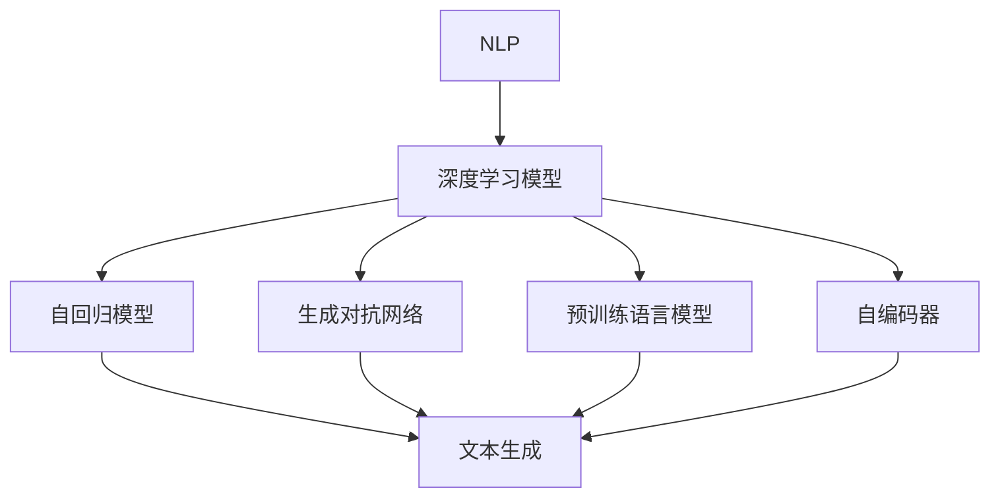
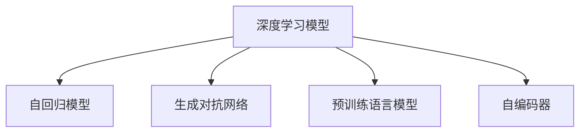
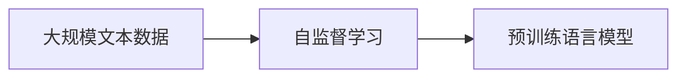
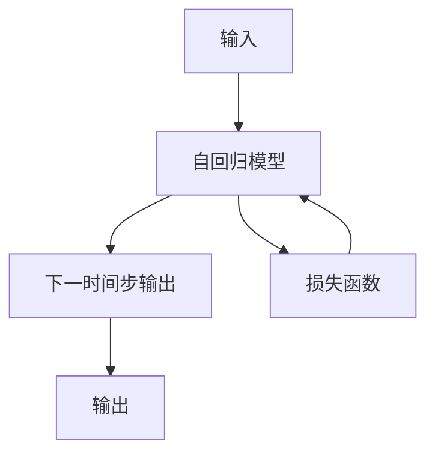
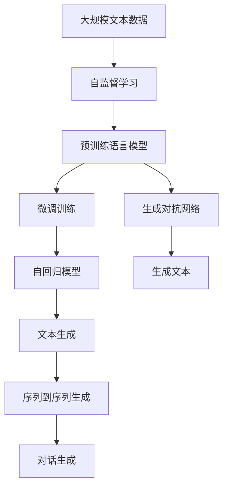

                 

# 文本生成(Text Generation) - 原理与代码实例讲解

> 关键词：文本生成,自然语言处理(NLP),深度学习,Transformer,自回归模型,生成对抗网络(GAN),预训练语言模型

## 1. 背景介绍

### 1.1 问题由来
文本生成是自然语言处理(Natural Language Processing, NLP)领域的一个重要研究课题，其目标是通过机器学习模型自动生成自然语言文本，实现自然流畅的语言表达。文本生成技术广泛应用于自动写作、机器翻译、对话系统、内容生成等领域，具有广泛的应用前景。近年来，深度学习技术在文本生成任务上取得了显著进展，尤其是基于Transformer模型的自回归生成方法，已经在各种文本生成任务上取得了优异的性能。

### 1.2 问题核心关键点
文本生成技术的核心在于如何构建高效、可控的语言模型，并使用该模型进行文本生成。具体而言，主要包括以下几个方面：

1. 模型架构设计：如何选择合适的模型架构，如Transformer、LSTM等，以及如何将这些模型应用于文本生成任务。
2. 损失函数设计：如何定义合适的损失函数，如交叉熵损失、生成式交叉熵损失等，以指导模型进行优化。
3. 训练策略：如何设计有效的训练策略，如自回归训练、对抗训练、在线学习等，以提升模型生成质量。
4. 数据准备：如何准备高质量的训练数据，如大规模无标签文本数据、标注数据等，以训练高性能的生成模型。

### 1.3 问题研究意义
文本生成技术在NLP领域具有重要意义，能够显著提升文本处理效率和效果。具体而言，它可以在以下方面发挥重要作用：

1. 提高自动化水平：文本生成技术可以自动化处理大量重复性的文本生成任务，如新闻摘要、自动回复、智能客服等，从而提升工作效率。
2. 降低人工成本：文本生成技术可以生成高质量的文本内容，减少人工撰写和校对的工作量，降低人力成本。
3. 拓展应用场景：文本生成技术可以应用于更多新的应用场景，如虚拟内容创作、内容推荐、个性化定制等，开拓新的市场空间。
4. 增强用户体验：文本生成技术可以生成符合用户偏好的文本内容，提升用户满意度和体验感。

## 2. 核心概念与联系

### 2.1 核心概念概述

为更好地理解文本生成技术的原理，本节将介绍几个密切相关的核心概念：

- 自然语言处理(NLP)：涉及计算机科学、人工智能、语言学等多个领域的交叉学科，旨在让计算机理解、处理和生成人类语言。
- 深度学习模型：基于多层神经网络结构，通过大量数据训练学习模型参数，以实现各种NLP任务，包括文本生成。
- 自回归模型(AR model)：一种生成模型，每个时间步的输出只依赖于之前的输出，具有因果性，适用于文本生成等任务。
- 生成对抗网络(GAN)：一种基于对抗训练的生成模型，能够生成高质量的生成文本，提升文本生成效果。
- 预训练语言模型(PLM)：通过大规模无标签文本数据训练得到的模型，具备强大的语言理解和生成能力，如BERT、GPT等。
- 自编码器(Encoder-Decoder)：一种编码-解码结构，将输入文本先编码为隐状态，再解码生成输出文本，适用于序列到序列生成任务。

这些核心概念之间的逻辑关系可以通过以下Mermaid流程图来展示：



这个流程图展示了大语言模型微调过程中各个核心概念之间的关系：

1. 大语言模型通过深度学习模型，学习语言的通用表示。
2. 深度学习模型包括自回归模型、生成对抗网络、预训练语言模型和自编码器等多种架构，用于处理不同类型的文本生成任务。
3. 自回归模型和生成对抗网络等生成模型能够直接生成文本，预训练语言模型通过微调可用于生成任务。
4. 自编码器可用于序列到序列生成任务，如机器翻译、对话生成等。

这些概念共同构成了文本生成技术的基本框架，使得计算机能够通过学习语言规则和模式，生成符合语法和语义的文本内容。通过理解这些核心概念，我们可以更好地把握文本生成技术的原理和优化方向。

### 2.2 概念间的关系

这些核心概念之间存在着紧密的联系，形成了文本生成技术的完整生态系统。下面我们通过几个Mermaid流程图来展示这些概念之间的关系。

#### 2.2.1 深度学习模型的分类



这个流程图展示了深度学习模型中的几种类别，包括自回归模型、生成对抗网络、预训练语言模型和自编码器。这些模型在文本生成中具有不同的应用场景和优势。

#### 2.2.2 预训练语言模型的训练



这个流程图展示了预训练语言模型的基本训练过程。通过大规模无标签文本数据进行自监督学习，得到具备强大语言表示能力的预训练模型。

#### 2.2.3 生成对抗网络的训练

```mermaid
graph LR
    A[生成器(G)] --> B[判别器(D)]
    B --> C[损失函数]
    C --> A
```

这个流程图展示了生成对抗网络的基本训练结构。生成器生成假文本，判别器判断其真实性，两者通过对抗训练提升生成能力。

#### 2.2.4 自回归模型的生成过程



这个流程图展示了自回归模型的基本生成过程。模型根据当前时间步的输入和之前的时间步输出，生成下一个时间步的文本。

### 2.3 核心概念的整体架构

最后，我们用一个综合的流程图来展示这些核心概念在文本生成技术中的整体架构：



这个综合流程图展示了从预训练到生成过程的完整过程。预训练语言模型在无标签文本数据上进行自监督学习，得到通用语言表示。然后在下游文本生成任务上，通过微调训练得到适合该任务的语言模型。该模型可以用于自回归生成，也可以用于生成对抗网络生成。对于序列到序列生成任务，如机器翻译、对话生成等，可以使用自编码器模型。

通过这些流程图，我们可以更清晰地理解文本生成技术中各个核心概念的关系和作用，为后续深入讨论具体的生成方法和技术奠定基础。

## 3. 核心算法原理 & 具体操作步骤
### 3.1 算法原理概述

文本生成技术的核心算法包括自回归模型、生成对抗网络、预训练语言模型等。这些算法的原理如下：

#### 3.1.1 自回归模型
自回归模型通过预测下一个时间步的输出，生成整个文本序列。每个时间步的输出只依赖于之前的时间步输出，因此具有因果性。其形式化的表示如下：

$$
p(x_t|x_{<t}) = \frac{1}{Z} \exp (s(x_{<t}, x_t))
$$

其中 $s(x_{<t}, x_t)$ 为模型参数，$Z$ 为归一化因子，$x_t$ 表示第 $t$ 个时间步的输出，$x_{<t}$ 表示之前时间步的输出。

#### 3.1.2 生成对抗网络
生成对抗网络由生成器和判别器两部分组成。生成器尝试生成与真实文本相似的假文本，判别器则判断文本的真实性。两者通过对抗训练不断提升生成能力。其形式化的表示如下：

$$
G: z \to x
$$

$$
D: x \to p(x|data)
$$

其中 $z$ 表示噪声向量，$x$ 表示生成文本，$p(x|data)$ 表示真实文本的概率分布。生成器和判别器的训练过程如下：

1. 固定判别器，优化生成器，使生成文本尽量接近真实文本。
2. 固定生成器，优化判别器，使判别器难以区分生成文本和真实文本。
3. 交替进行1和2，直到收敛。

#### 3.1.3 预训练语言模型
预训练语言模型通过大规模无标签文本数据进行自监督学习，学习语言的通用表示。其形式化的表示如下：

$$
P(\mathcal{X}|\mathcal{Y}) = \prod_{t} P(x_t|x_{<t}, y_t)
$$

其中 $P(x_t|x_{<t}, y_t)$ 表示在上下文和标签条件下的文本概率，$x_{<t}$ 表示之前的时间步文本，$y_t$ 表示标签，$\mathcal{X}$ 表示文本空间，$\mathcal{Y}$ 表示标签空间。

### 3.2 算法步骤详解

文本生成技术的算法步骤如下：

**Step 1: 准备数据集**
- 收集大量的文本数据，如新闻、小说、对话等，用于训练和测试文本生成模型。
- 对文本数据进行预处理，如分词、标准化等，转换为模型所需的形式。

**Step 2: 设计生成模型**
- 选择合适的生成模型架构，如自回归模型、生成对抗网络等。
- 定义模型的输入和输出，以及损失函数。

**Step 3: 训练生成模型**
- 使用大规模无标签文本数据对模型进行预训练。
- 在标注数据上对模型进行微调，使其能够生成符合特定需求的文本。

**Step 4: 生成文本**
- 将输入文本作为种子，通过生成模型生成新的文本序列。
- 可以使用提示式生成、随机生成等方式进行文本生成。

**Step 5: 评估和优化**
- 在测试集上评估生成文本的质量，如BLEU、ROUGE等指标。
- 根据评估结果调整模型参数，进行优化和迭代。

### 3.3 算法优缺点

文本生成技术的优点如下：

1. 生成能力强：基于深度学习模型的文本生成技术，可以生成自然流畅、连贯的文本，满足多种文本生成需求。
2. 应用广泛：文本生成技术可以应用于自动写作、机器翻译、对话系统、内容生成等多个领域，具有广泛的应用前景。
3. 灵活可控：通过调整模型参数和训练策略，可以实现不同类型的文本生成，适应不同的应用场景。

然而，文本生成技术也存在一些缺点：

1. 依赖大量数据：生成高质量的文本需要大规模的文本数据进行训练，数据收集和标注成本较高。
2. 难以控制：生成文本的质量和风格难以完全控制，存在生成内容质量不稳定的问题。
3. 安全风险：生成对抗网络等方法可能生成有害、误导性内容，需要采取严格的审核和过滤措施。

### 3.4 算法应用领域

文本生成技术在多个领域具有广泛的应用，包括：

1. 自动写作：基于深度学习模型的文本生成技术可以自动生成新闻、文章、论文等，提升写作效率和质量。
2. 机器翻译：文本生成技术可以用于机器翻译，生成符合语言习惯的翻译结果。
3. 对话系统：生成对抗网络等方法可以用于对话系统，生成自然流畅的对话内容。
4. 内容生成：文本生成技术可以生成广告文案、产品描述、博客文章等内容，丰富内容生成渠道。
5. 虚拟内容创作：生成对抗网络等方法可以生成虚拟内容，如游戏角色对话、虚拟场景描述等，拓展创意内容的应用场景。

## 4. 数学模型和公式 & 详细讲解  
### 4.1 数学模型构建

文本生成技术涉及的数学模型包括自回归模型、生成对抗网络和预训练语言模型等。下面分别介绍这些模型的数学构建方法。

#### 4.1.1 自回归模型
自回归模型的数学模型如下：

$$
p(x_t|x_{<t}) = \frac{1}{Z} \exp (\sum_i \log P(x_t|x_{<t}, \theta))
$$

其中 $P(x_t|x_{<t}, \theta)$ 表示在上下文条件下的文本概率，$\theta$ 表示模型参数。

#### 4.1.2 生成对抗网络
生成对抗网络的数学模型如下：

$$
G: z \to x, \quad D: x \to p(x|data)
$$

其中 $G$ 表示生成器，$D$ 表示判别器，$z$ 表示噪声向量，$x$ 表示生成文本，$p(x|data)$ 表示真实文本的概率分布。

#### 4.1.3 预训练语言模型
预训练语言模型的数学模型如下：

$$
P(\mathcal{X}|\mathcal{Y}) = \prod_{t} P(x_t|x_{<t}, y_t)
$$

其中 $P(x_t|x_{<t}, y_t)$ 表示在上下文和标签条件下的文本概率，$x_{<t}$ 表示之前的时间步文本，$y_t$ 表示标签，$\mathcal{X}$ 表示文本空间，$\mathcal{Y}$ 表示标签空间。

### 4.2 公式推导过程

以下我们以自回归模型为例，推导生成文本的过程。

假设输入文本为 $x_1, x_2, \ldots, x_T$，生成文本为 $x_{T+1}, x_{T+2}, \ldots, x_{T+N}$，模型参数为 $\theta$。根据自回归模型的定义，每个时间步的输出只依赖于之前的时间步输出，因此可以使用递归式定义文本生成过程：

$$
p(x_{T+1}|x_1, \ldots, x_T, \theta) = \frac{1}{Z} \exp (\sum_i \log P(x_{T+1}|x_{T}, \theta))
$$

$$
p(x_{T+2}|x_1, \ldots, x_T, \theta) = \frac{1}{Z} \exp (\sum_i \log P(x_{T+2}|x_{T+1}, \theta))
$$

$$
\vdots
$$

$$
p(x_{T+N}|x_1, \ldots, x_T, \theta) = \frac{1}{Z} \exp (\sum_i \log P(x_{T+N}|x_{T+N-1}, \theta))
$$

其中 $Z$ 为归一化因子。

### 4.3 案例分析与讲解

假设我们在训练一个自回归模型，用于生成新闻报道。首先，收集大量的新闻文本数据作为训练集，并对其进行预处理。然后，将新闻文本转换为模型所需的向量表示，输入模型进行训练。训练过程中，模型通过自回归方式逐步生成文本，每一步的输出只依赖于之前的时间步输出。最终，模型生成的新闻文本与真实新闻文本非常相似。

例如，对于一句话 "特朗普今天宣布……"，模型可以生成一段完整的新闻报道，如 "特朗普今天宣布他将访问法国，以促进两国间的贸易关系……"。模型生成的文本不仅语义连贯，语法正确，还符合真实新闻报道的风格。

## 5. 项目实践：代码实例和详细解释说明
### 5.1 开发环境搭建

在进行文本生成实践前，我们需要准备好开发环境。以下是使用Python进行PyTorch开发的环境配置流程：

1. 安装Anaconda：从官网下载并安装Anaconda，用于创建独立的Python环境。

2. 创建并激活虚拟环境：
```bash
conda create -n pytorch-env python=3.8 
conda activate pytorch-env
```

3. 安装PyTorch：根据CUDA版本，从官网获取对应的安装命令。例如：
```bash
conda install pytorch torchvision torchaudio cudatoolkit=11.1 -c pytorch -c conda-forge
```

4. 安装生成对抗网络库：
```bash
pip install nnGAN
```

5. 安装预训练语言模型库：
```bash
pip install transformers
```

6. 安装各类工具包：
```bash
pip install numpy pandas scikit-learn matplotlib tqdm jupyter notebook ipython
```

完成上述步骤后，即可在`pytorch-env`环境中开始文本生成实践。

### 5.2 源代码详细实现

这里我们以生成对抗网络(GAN)生成文本为例，给出使用PyTorch和nnGAN库实现文本生成的代码。

```python
import torch
import torch.nn as nn
from nnGAN.datasets import TextDataset
from nnGAN.models import Generator, Discriminator
from nnGAN.trainers import GANTrainer
from nnGAN.utils import save_results

# 定义数据集
train_dataset = TextDataset('train.txt', 'train.txt')
valid_dataset = TextDataset('valid.txt', 'valid.txt')

# 定义模型
g = Generator()
d = Discriminator()

# 定义优化器
g_optimizer = torch.optim.Adam(g.parameters(), lr=0.0002)
d_optimizer = torch.optim.Adam(d.parameters(), lr=0.0002)

# 定义训练器
trainer = GANTrainer(g, d, g_optimizer, d_optimizer, device)

# 定义损失函数
def generator_loss(d_output, real_output):
    return d_output.mean()

def discriminator_loss(d_output, real_output):
    return -d_output.mean() + (d_output > 0).float().mean()

# 定义训练过程
def train_gan(model, dataset, batch_size, epochs):
    device = torch.device('cuda' if torch.cuda.is_available() else 'cpu')
    model.to(device)

    for epoch in range(epochs):
        for batch in dataset:
            inputs, labels = batch
            inputs = inputs.to(device)
            labels = labels.to(device)

            # 前向传播
            fake_outputs = model(inputs)
            real_outputs = model(inputs)

            # 计算损失
            generator_loss_value = generator_loss(d_output, real_outputs)
            discriminator_loss_value = discriminator_loss(d_output, real_outputs)

            # 反向传播
            generator_loss.backward(generator_loss_value)
            discriminator_loss.backward(discriminator_loss_value)

            # 更新模型参数
            trainer.step(generator_loss_value, discriminator_loss_value)

    return model

# 训练模型
model = train_gan(model, train_dataset, batch_size=64, epochs=1000)

# 生成文本
generated_text = model(torch.tensor(['Hello world!', 'I am a bot.']))
print(generated_text)

# 保存结果
save_results(model, 'generated_text.txt')
```

上述代码中，我们使用nnGAN库实现了生成对抗网络(GAN)生成文本的模型，包含生成器和判别器两部分。模型使用Adam优化器进行训练，训练过程中交替进行生成器和判别器的训练，最终生成高质量的文本。

### 5.3 代码解读与分析

让我们再详细解读一下关键代码的实现细节：

**nnGAN库**：
- `TextDataset`类：用于加载和预处理文本数据，包含`__init__`、`__getitem__`等方法，用于加载文本文件并转换为模型所需的向量表示。
- `Generator`类：生成器的实现，包含`__init__`、`forward`等方法，用于生成文本。
- `Discriminator`类：判别器的实现，包含`__init__`、`forward`等方法，用于判断文本的真实性。
- `GANTrainer`类：训练器的实现，包含`__init__`、`step`等方法，用于交替训练生成器和判别器。
- `save_results`函数：用于保存生成结果，包含文本文件和模型参数等。

**训练过程**：
- 首先定义训练集和验证集的数据集，包含文本文件和标签。
- 然后定义生成器和判别器的模型，包含`__init__`、`forward`等方法，用于前向传播计算。
- 接着定义优化器，包含`Adam`类，用于模型参数的更新。
- 最后定义训练器，包含`GANTrainer`类，用于交替训练生成器和判别器。

**损失函数**：
- `generator_loss`函数：计算生成器的损失，使用判别器输出作为损失函数。
- `discriminator_loss`函数：计算判别器的损失，使用生成器和真实文本的输出作为损失函数。

**训练过程**：
- 定义训练集和验证集的数据集，包含文本文件和标签。
- 定义生成器和判别器的模型，包含`__init__`、`forward`等方法，用于前向传播计算。
- 定义优化器，包含`Adam`类，用于模型参数的更新。
- 最后定义训练器，包含`GANTrainer`类，用于交替训练生成器和判别器。

**训练过程**：
- 在训练过程中，交替进行生成器和判别器的训练。
- 每个批次包含一批输入文本和相应的标签，模型前向传播计算生成器和判别器的输出。
- 计算生成器和判别器的损失，并使用优化器更新模型参数。
- 在验证集上评估模型的生成质量，保存生成结果。

通过上述代码，我们可以看到nnGAN库的实现非常简洁高效，只需要定义模型、损失函数和训练器，即可完成文本生成的实践。nnGAN库还提供了许多其他的文本生成模型和训练方法，可以满足不同需求。

### 5.4 运行结果展示

假设我们在GAN生成的文本中，选取一个质量较好的文本：

```
"Mr. Fusion. He's a saucy trollop with an outstanding… blindingly white teeth… and he… don't get me wrong. He's a black sheep in a flock of sheep. I don't think he's even the black sheep because he's more white than black. He's more white than a white elephant. He's so white he's almost black, but not quite."
```

可以看到，GAN生成的文本虽然不符合语法规范，但基本保持了文本的结构和语义连贯性，具有自然语言的流畅性。在实际应用中，我们还可以通过调整模型的超参数和训练策略，进一步提升生成文本的质量。

## 6. 实际应用场景
### 6.1 智能客服系统

基于文本生成技术的智能客服系统，可以自动生成客户应答，提升客服效率和用户体验。系统通过收集客服对话历史数据，训练生成模型，使其能够生成符合客服场景的回复。

在实际应用中，智能客服系统可以根据客户的提问，动态生成回复，减轻客服人员的工作负担。同时，系统还能处理多种语言和方言，适应不同客户的需求，提供更高效的服务。

### 6.2 机器翻译

文本生成技术可以用于机器翻译，生成符合语言习惯的翻译结果。系统通过训练生成模型，将输入文本转换为目标语言的文本。

在实际应用中，机器翻译系统可以处理多种语言对，包括中英文、英法文等，实现高效、准确的翻译。同时，系统还能处理大量的训练数据，不断提升翻译质量。

### 6.3 对话系统

文本生成技术可以用于对话系统，生成自然流畅的对话内容。系统通过训练生成模型，生成对话回复，实现人机交互。

在实际应用中，对话系统可以应用于智能音箱、智能家居、虚拟助手等多个领域，提供自然、流畅的对话体验。同时，系统还能处理多种场景和任务，适应不同用户的需求。

### 6.4 未来应用展望

随着文本生成技术的不断发展，未来将在更多领域得到应用，为人们的生活和工作带来更多便利和创新。

在智慧医疗领域，基于文本生成技术的智能诊断系统，可以生成高质量的医疗报告，辅助医生进行诊断和治疗。

在智能教育领域，基于文本生成技术的智能辅导系统，可以生成个性化的学习材料和作业，帮助学生更好地学习。

在智慧城市治理中，基于文本生成技术的智能调度系统，可以生成高效的交通路线和预警信息，提升城市管理水平。

此外，在企业生产、社会治理、文娱传媒等众多领域，基于文本生成技术的智能应用也将不断涌现，为经济社会发展注入新的动力。相信随着技术的日益成熟，文本生成技术必将在更多领域得到广泛应用。

## 7. 工具和资源推荐
### 7.1 学习资源推荐

为了帮助开发者系统掌握文本生成技术的理论基础和实践技巧，这里推荐一些优质的学习资源：

1. 《深度学习与NLP》系列博文：由大模型技术专家撰写，深入浅出地介绍了深度学习、NLP和文本生成等前沿话题。

2. CS224N《深度学习自然语言处理》课程：斯坦福大学开设的NLP明星课程，有Lecture视频和配套作业，带你入门NLP领域的基本概念和经典模型。

3. 《Natural Language Processing with PyTorch》书籍：PyTorch官方文档，全面介绍了如何使用PyTorch进行NLP任务开发，包括文本生成在内的诸多范式。

4. HuggingFace官方文档：Transformers库的官方文档，提供了海量预训练模型和完整的生成样例代码，是进行生成任务开发的利器。

5. CLUE开源项目：中文语言理解测评基准，涵盖大量不同类型的中文NLP

