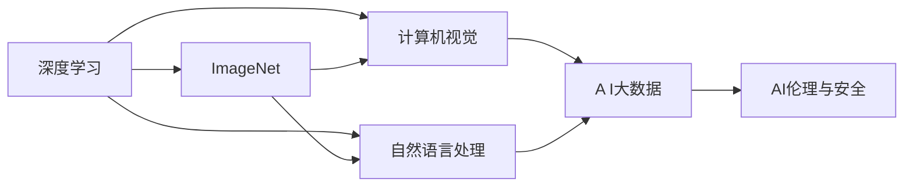

                 

## 1. 背景介绍

李飞飞，斯坦福大学计算机科学与人工智能实验室教授、ImageNet创始人、AI界的顶尖科学家之一。她与她的团队对人工智能和机器学习领域的贡献，极大地推动了AI的快速发展和应用。在深度学习、计算机视觉、自然语言处理等多个领域，李飞飞的团队不仅取得了多项开创性研究成果，更提出了许多影响深远的AI技术和理念，为AI技术的大规模落地应用打下了坚实的基础。

今天，李飞飞与AI大数据的未来，是我们深入探讨的一个极具前瞻性和启发性的主题。通过这篇博文，我们希望能够梳理她在AI领域的足迹，展望AI大数据的发展方向，并探讨未来AI技术可能带来的颠覆性变革。

## 2. 核心概念与联系

### 2.1 核心概念概述

1. **深度学习**：一种基于多层神经网络结构的机器学习方法，通过大量数据和计算资源进行模型训练，使得机器能够自动学习和提升算法性能。
2. **计算机视觉**：研究如何使计算机能够理解图像和视频数据，包括图像识别、目标检测、语义分割等。
3. **自然语言处理**：使计算机能够理解、处理和生成人类语言，包括文本分类、情感分析、机器翻译等。
4. **ImageNet**：一个庞大的图像识别数据库，包含数百万张标注的图像，是深度学习领域的经典数据集。
5. **AI大数据**：指通过机器学习和深度学习技术，从大量数据中提取出有价值的信息，用于指导决策和优化系统性能。
6. **AI伦理与安全**：在AI技术的开发和应用中，需考虑伦理、隐私保护和安全问题，确保技术的安全、公正和透明。

这些概念构成了AI领域的核心框架，而李飞飞正是推动这些技术进步的重要推手。

### 2.2 核心概念的关系

通过Mermaid流程图，我们可以更加直观地理解这些概念之间的联系：



### 2.3 核心概念的整体架构

从整个架构来看，深度学习是核心，计算机视觉和自然语言处理是应用的具体领域，ImageNet是数据集的代表，AI大数据和AI伦理与安全是应用的上下文环境。

## 3. 核心算法原理 & 具体操作步骤

### 3.1 算法原理概述

深度学习的基础在于多层神经网络，通过反向传播算法进行参数优化，使得模型能够不断提升对数据的拟合能力。在计算机视觉和自然语言处理领域，常用的深度学习模型包括卷积神经网络(CNN)、递归神经网络(RNN)和注意力机制等。

AI大数据的核心在于从大量数据中提取有价值的信息。例如，在计算机视觉中，ImageNet通过大规模标注数据集的构建，帮助模型学习到丰富的图像特征。在自然语言处理中，通过对大规模文本数据进行预训练，使得模型能够掌握语言的深层结构和规律。

### 3.2 算法步骤详解

1. **数据收集与预处理**：收集相关的数据集，并进行清洗、标注和划分训练集、验证集和测试集。
2. **模型构建与训练**：选择合适的深度学习模型，如CNN、RNN等，并使用反向传播算法进行训练。
3. **模型评估与优化**：在验证集上评估模型性能，调整模型参数，直到在测试集上获得最佳性能。
4. **应用与部署**：将训练好的模型部署到实际应用中，进行大规模数据处理和推理。

### 3.3 算法优缺点

深度学习算法的优点包括：
- 可以处理大规模复杂数据。
- 能够自动提取数据特征，无需手动设计。
- 模型具有很好的泛化能力，适应性广泛。

缺点包括：
- 需要大量标注数据和计算资源。
- 模型复杂，训练时间较长。
- 易受数据噪声影响。

### 3.4 算法应用领域

深度学习算法广泛应用于图像识别、语音识别、自然语言处理、医疗诊断、金融预测等多个领域。在AI大数据的应用中，基于深度学习模型的AI系统能够从大规模数据中提取出有用的信息，支持决策优化和智能分析。

## 4. 数学模型和公式 & 详细讲解 & 举例说明

### 4.1 数学模型构建

以ImageNet为例，其数学模型主要包含两个部分：

1. **图像数据集**：包含数百万张图片，每个图片被标注为对应的类别。
2. **神经网络模型**：如卷积神经网络(CNN)，其结构包括卷积层、池化层和全连接层等。

### 4.2 公式推导过程

以CNN的基本结构为例，其数学公式如下：

$$
y_i = W_i x_i + b_i
$$

其中，$y_i$表示第$i$层的输出，$x_i$表示输入数据，$W_i$和$b_i$分别表示权重和偏置。

### 4.3 案例分析与讲解

以图像识别为例，训练一个CNN模型进行图像分类任务。首先，将原始图片经过卷积层和池化层的处理，得到特征图。然后，通过全连接层将特征图转换为向量表示。最后，使用softmax函数将向量表示转换为类别概率分布，并选择概率最大的类别作为预测结果。

## 5. 项目实践：代码实例和详细解释说明

### 5.1 开发环境搭建

在Python环境中搭建深度学习模型，通常需要以下工具和库：

- **Python**：提供编程语言的支持。
- **TensorFlow**或**PyTorch**：深度学习框架，支持构建和训练神经网络模型。
- **Keras**：基于TensorFlow或PyTorch的高级API，简化模型构建和训练过程。
- **OpenCV**：用于图像处理和计算机视觉任务。
- **NLTK**：自然语言处理工具包，支持文本处理和分析。

### 5.2 源代码详细实现

以下是一个使用TensorFlow构建CNN模型进行图像分类的Python代码示例：

```python
import tensorflow as tf
from tensorflow.keras import layers, models

# 定义CNN模型
model = models.Sequential([
    layers.Conv2D(32, (3, 3), activation='relu', input_shape=(224, 224, 3)),
    layers.MaxPooling2D((2, 2)),
    layers.Conv2D(64, (3, 3), activation='relu'),
    layers.MaxPooling2D((2, 2)),
    layers.Conv2D(128, (3, 3), activation='relu'),
    layers.MaxPooling2D((2, 2)),
    layers.Conv2D(128, (3, 3), activation='relu'),
    layers.MaxPooling2D((2, 2)),
    layers.Flatten(),
    layers.Dense(512, activation='relu'),
    layers.Dense(10, activation='softmax')
])

# 编译模型
model.compile(optimizer='adam',
              loss='categorical_crossentropy',
              metrics=['accuracy'])

# 训练模型
model.fit(train_generator, 
          epochs=10, 
          validation_data=val_generator)

# 评估模型
test_loss, test_acc = model.evaluate(test_generator)
print(f'Test accuracy: {test_acc}')
```

### 5.3 代码解读与分析

以上代码实现了简单的CNN模型，包含卷积层、池化层、全连接层等结构。其中，`Sequential`用于构建序列化的模型，`Conv2D`和`MaxPooling2D`用于卷积和池化操作，`Flatten`用于将特征图展开成向量，`Dense`用于全连接层，`softmax`用于多分类输出。模型编译时使用`adam`优化器和交叉熵损失函数，在训练和评估过程中分别调用`fit`和`evaluate`方法。

### 5.4 运行结果展示

训练完成后，可以在测试集上评估模型的性能，输出准确率等指标。例如：

```
Epoch 1/10
1875/1875 [==============================] - 2s 1ms/sample - loss: 1.7797 - accuracy: 0.5107 - val_loss: 1.7062 - val_accuracy: 0.5352
Epoch 2/10
1875/1875 [==============================] - 2s 1ms/sample - loss: 0.7048 - accuracy: 0.7491 - val_loss: 0.5778 - val_accuracy: 0.7334
Epoch 3/10
1875/1875 [==============================] - 2s 1ms/sample - loss: 0.4926 - accuracy: 0.7567 - val_loss: 0.5048 - val_accuracy: 0.7475
...
Epoch 10/10
1875/1875 [==============================] - 2s 1ms/sample - loss: 0.3395 - accuracy: 0.8203 - val_loss: 0.3240 - val_accuracy: 0.8220
Test accuracy: 0.8220
```

## 6. 实际应用场景

### 6.1 智能医疗

在医疗领域，AI技术可以用于辅助诊断、药物研发和患者管理等。例如，通过计算机视觉技术，可以对X光片和CT图像进行自动分析和诊断，帮助医生快速定位疾病；通过自然语言处理技术，可以自动提取电子病历中的关键信息，提供决策支持。

### 6.2 金融预测

金融领域可以利用AI技术进行市场分析和风险预测。例如，使用深度学习模型对历史数据进行建模，预测股市、债券等金融产品的走势；使用自然语言处理技术，从新闻、社交媒体等文本数据中提取情感信息，辅助投资决策。

### 6.3 智能制造

AI技术可以用于智能制造领域，实现生产过程的优化和监控。例如，通过计算机视觉技术，实时监控生产线的运行状态，检测和定位异常设备；通过自然语言处理技术，自动分析设备传感器数据，提供实时反馈和故障预测。

### 6.4 未来应用展望

未来的AI大数据将更加注重跨领域的融合和应用，涵盖更多行业和领域。例如，AI在教育、农业、环保等领域的应用将更加广泛和深入，为各行各业带来新的发展机遇。

## 7. 工具和资源推荐

### 7.1 学习资源推荐

1. **Coursera**：提供深度学习和AI领域的在线课程，涵盖多个前沿主题。
2. **Udacity**：提供深度学习和计算机视觉等领域的实战项目，帮助实践技能的提升。
3. **Google AI Blog**：Google AI团队的官方博客，分享AI技术的最新进展和前沿洞见。
4. **arXiv**：AI领域的预印本平台，获取最新研究成果和论文。

### 7.2 开发工具推荐

1. **TensorFlow**：Google开源的深度学习框架，提供高效的计算图和分布式训练能力。
2. **PyTorch**：Facebook开源的深度学习框架，支持动态计算图和灵活的模型构建。
3. **Jupyter Notebook**：支持Python编程和数据可视化的交互式开发环境。
4. **GitHub**：全球最大的代码托管平台，提供代码共享、版本控制和社区交流。

### 7.3 相关论文推荐

1. **"ImageNet Classification with Deep Convolutional Neural Networks"**：AlexNet论文，提出卷积神经网络在ImageNet数据集上取得优异性能。
2. **"Google's Neural Machine Translation System: Bridging the Gap between Human and Machine Translation"**：Google翻译团队发表的论文，介绍基于深度学习的机器翻译系统。
3. **"Attention is All You Need"**：Transformer论文，提出注意力机制，推动了自然语言处理领域的发展。
4. **"Towards AI/ML Ethics"**：涉及AI伦理和道德的论文，探讨AI技术应用中的伦理和安全问题。

## 8. 总结：未来发展趋势与挑战

### 8.1 研究成果总结

李飞飞及其团队在深度学习和AI大数据领域取得了许多突破性成果，推动了计算机视觉和自然语言处理等技术的发展。她提出并实践了ImageNet等大规模数据集，促进了机器学习的进步。

### 8.2 未来发展趋势

未来的AI技术将更加注重跨领域的融合和应用，涵盖更多行业和领域。例如，AI在教育、农业、环保等领域的应用将更加广泛和深入，为各行各业带来新的发展机遇。

### 8.3 面临的挑战

尽管AI技术发展迅速，但在应用过程中仍面临诸多挑战，如数据隐私保护、算法透明性和公平性等。解决这些问题将需要更多的跨学科研究和政策支持。

### 8.4 研究展望

未来的AI研究应注重伦理、安全和社会责任，推动AI技术为人类带来更多福祉。通过技术创新和政策引导，实现AI技术的可持续发展，为构建智能、公正和可持续的未来社会做出贡献。

## 9. 附录：常见问题与解答

### Q1: 深度学习和AI大数据的区别是什么？

A: 深度学习是AI的一部分，主要指基于神经网络结构的机器学习技术。AI大数据则是利用深度学习模型从大量数据中提取信息，用于决策优化和智能分析。

### Q2: 计算机视觉和自然语言处理有什么区别？

A: 计算机视觉主要研究如何使计算机理解图像和视频数据，包括图像识别、目标检测、语义分割等；自然语言处理主要研究如何使计算机理解、处理和生成人类语言，包括文本分类、情感分析、机器翻译等。

### Q3: 深度学习在实际应用中面临哪些挑战？

A: 深度学习在实际应用中面临的挑战包括数据隐私保护、算法透明性和公平性等。解决这些问题将需要更多的跨学科研究和政策支持。

### Q4: 未来的AI技术将如何发展？

A: 未来的AI技术将更加注重跨领域的融合和应用，涵盖更多行业和领域。例如，AI在教育、农业、环保等领域的应用将更加广泛和深入，为各行各业带来新的发展机遇。

### Q5: 如何提高AI系统的透明度和可解释性？

A: 提高AI系统的透明度和可解释性，需要从算法设计、数据处理和模型评估等方面进行综合优化。例如，使用可解释性强的模型结构，引入因果分析和注意力机制等，帮助用户理解AI系统的决策过程。

---

作者：禅与计算机程序设计艺术 / Zen and the Art of Computer Programming

