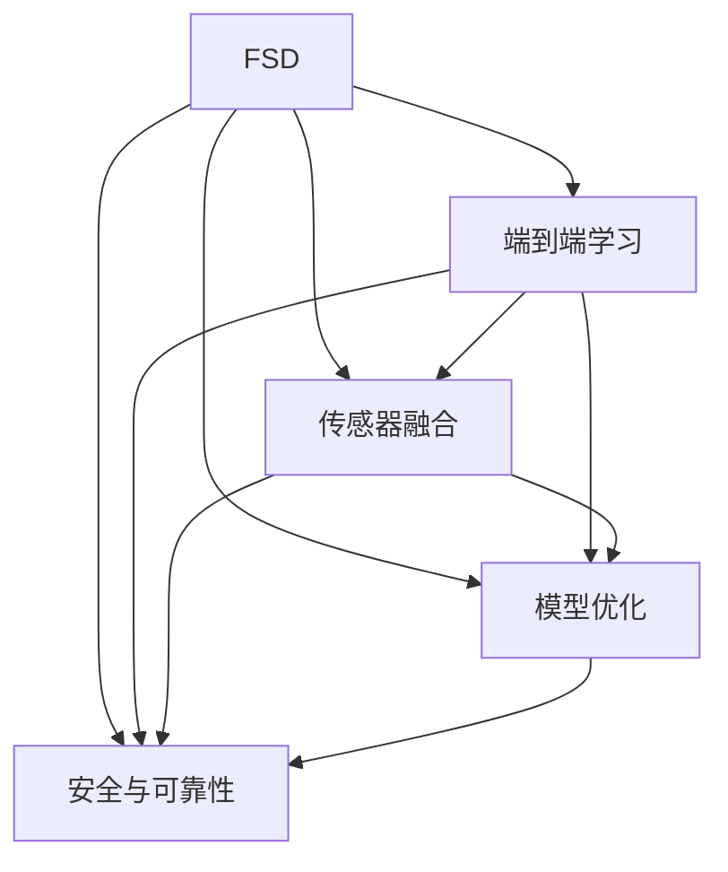
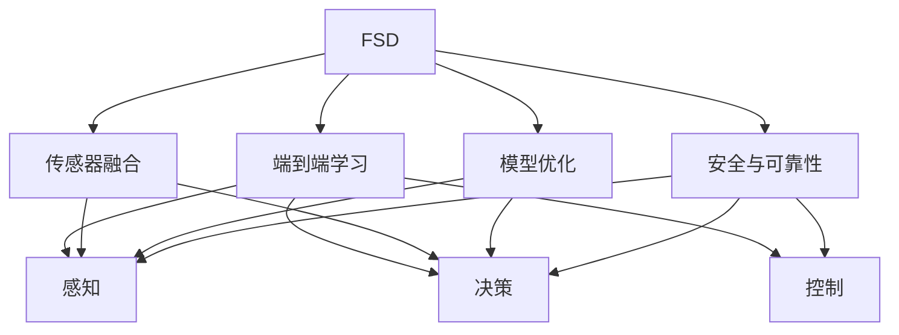

                 

# 特斯拉FSD不同版本的进化

> 关键词：FSD (Autopilot Full Self-Driving), 自动驾驶, 硬件升级, 软件优化, 技术演进, 安全性, 可靠性

## 1. 背景介绍

### 1.1 问题由来

特斯拉的自动驾驶技术（FSD: Full Self-Driving）自推出以来，经历了多次重大升级和演进，从最初的Autopilot 1.0到现在的FSD Beta。每一次的更新都伴随着硬件的升级和软件的优化，推动了自动驾驶技术的发展，同时也引发了公众和媒体的高度关注。

### 1.2 问题核心关键点

特斯拉FSD技术演进的核心关键点在于：

- **硬件升级**：从最初的计算机视觉摄像头、雷达和超声波传感器，到后来的16个计算机视觉摄像头、8个前向雷达、12个超声波传感器，以及最新的硬件平台HAWK EK3和HAWK 4.0，硬件设备的不断升级为FSD提供了更强大的感知能力。
- **软件优化**：从最初的基于规则的系统到现在的端到端学习系统，FSD的软件优化不断提升，使得自动驾驶的决策过程更加智能和可靠。
- **技术演进**：从最初的基于感知、决策和控制的分离式架构到现在的端到端学习架构，特斯拉不断探索更高效的自动驾驶系统设计。
- **安全性与可靠性**：特斯拉始终将安全性与可靠性作为自动驾驶技术演进的首要目标，通过多次升级确保FSD的安全性能。

### 1.3 问题研究意义

研究特斯拉FSD技术演进，对于理解自动驾驶技术的现状、未来发展方向以及面临的挑战具有重要意义：

- 了解FSD从初版到最新版本的技术升级路径，有助于掌握自动驾驶技术的最新进展。
- 分析FSD不同版本之间的性能差异，可以为未来的技术改进提供参考。
- 探索FSD在安全性与可靠性方面的改进措施，可以为其他自动驾驶系统提供借鉴。
- 总结FSD的技术演进经验，可以为自动驾驶技术的研发和落地提供指导。

## 2. 核心概念与联系

### 2.1 核心概念概述

为了更好地理解特斯拉FSD技术的演进，本节将介绍几个密切相关的核心概念：

- **FSD (Autopilot Full Self-Driving)**：特斯拉的自动驾驶技术，通过计算机视觉、雷达、超声波传感器等硬件设备，结合深度学习等算法，实现车辆的自动驾驶功能。
- **端到端学习**：特斯拉FSD采用端到端学习的架构，从感知、决策到控制的整个过程都通过深度学习模型实现，减少了传统系统中组件间的耦合，提高了系统的灵活性和可扩展性。
- **传感器融合**：特斯拉FSD通过传感器融合技术，将多个传感器采集的信息进行综合分析，提升感知能力，降低单一传感器可能带来的误差。
- **模型优化**：特斯拉不断优化其深度学习模型，提升模型的准确性和泛化能力，保证自动驾驶系统的性能。
- **安全与可靠性**：特斯拉始终将安全性和可靠性作为FSD的核心目标，通过多种技术手段确保FSD的安全性。

这些核心概念之间存在着紧密的联系，形成了特斯拉FSD技术的完整生态系统。

### 2.2 概念间的关系

这些核心概念之间的逻辑关系可以通过以下Mermaid流程图来展示：



这个流程图展示了FSD核心概念之间的关系：

1. FSD是整个系统的核心，通过端到端学习实现从感知到控制的整个过程。
2. 端到端学习依赖于传感器融合和模型优化，以提升感知和决策的准确性。
3. 模型优化和传感器融合都需要考虑安全与可靠性，以确保系统的安全稳定。
4. 传感器融合、模型优化和端到端学习都需要通过安全与可靠性的验证，才能投入实际应用。

### 2.3 核心概念的整体架构

最后，我们用一个综合的流程图来展示这些核心概念在大语言模型微调过程中的整体架构：



这个综合流程图展示了FSD从感知到控制的整个流程，以及每个环节的技术实现。

## 3. 核心算法原理 & 具体操作步骤

### 3.1 算法原理概述

特斯拉FSD技术演进的核心算法原理包括以下几个方面：

- **传感器融合**：通过多个传感器的数据融合，提升系统的感知能力。
- **端到端学习**：使用深度学习模型实现从感知到决策的端到端处理。
- **模型优化**：通过反向传播等优化算法，不断改进深度学习模型。
- **安全与可靠性**：通过多个冗余措施，确保自动驾驶系统的安全性和可靠性。

### 3.2 算法步骤详解

特斯拉FSD的算法步骤大致可以分为以下几个阶段：

1. **数据采集**：使用计算机视觉摄像头、雷达、超声波传感器等硬件设备采集环境信息。
2. **数据预处理**：对采集到的数据进行去噪、校正、归一化等预处理操作。
3. **传感器融合**：将多源数据进行融合，生成更准确的环境表示。
4. **特征提取**：通过深度学习模型提取环境特征，用于决策。
5. **决策与控制**：使用端到端学习模型进行决策，并通过控制算法执行决策。
6. **反馈与优化**：根据实际驾驶情况，不断优化模型参数，提升系统性能。

### 3.3 算法优缺点

特斯拉FSD技术演进的算法优点包括：

- **端到端学习**：减少了传统系统中组件间的耦合，提高了系统的灵活性和可扩展性。
- **传感器融合**：通过多源数据融合，提升了感知能力和决策的准确性。
- **模型优化**：通过反向传播等优化算法，不断改进深度学习模型，提高了模型的性能。

然而，特斯拉FSD技术演进也存在以下缺点：

- **硬件成本高**：传感器和计算机硬件的升级成本较高，增加了用户的负担。
- **算法复杂度高**：端到端学习模型和传感器融合算法复杂度高，对计算资源的要求较高。
- **安全性和可靠性问题**：虽然特斯拉不断优化系统，但自动驾驶系统仍面临安全性和可靠性方面的挑战。

### 3.4 算法应用领域

特斯拉FSD技术演进涉及多个应用领域，包括：

- **自动驾驶**：通过计算机视觉、雷达、超声波传感器等硬件设备，实现车辆的自动驾驶功能。
- **智能交通**：通过智能交通管理系统，优化道路交通流量，提高交通安全和效率。
- **共享出行**：通过FSD技术，提升共享出行的安全性和用户体验。
- **物流配送**：通过自动驾驶货车，提高物流配送的效率和安全性。

## 4. 数学模型和公式 & 详细讲解

### 4.1 数学模型构建

特斯拉FSD的核心模型主要分为感知模型和决策模型两部分。以下分别介绍这两部分的数学模型构建。

**感知模型**：使用深度学习模型，如卷积神经网络(CNN)、卷积神经网络+空间注意力机制(CNN+SAM)等，提取环境特征。

**决策模型**：使用深度强化学习模型，如深度Q网络(DQN)、深度确定性策略梯度(DDPG)等，进行决策和控制。

### 4.2 公式推导过程

以感知模型为例，其数学模型可以表示为：

$$
\mathcal{F}(\mathcal{D}) = \sum_{i=1}^{N} \mathcal{L}(\mathcal{F}, \mathcal{D}_i)
$$

其中，$\mathcal{F}$ 为感知模型，$\mathcal{D}$ 为环境数据集，$\mathcal{D}_i$ 为数据集中的单个样本，$\mathcal{L}$ 为损失函数，用于衡量模型的预测输出与真实标签之间的差异。

在感知模型中，使用交叉熵损失函数：

$$
\mathcal{L}(\mathcal{F}, \mathcal{D}_i) = -\frac{1}{N}\sum_{i=1}^{N} \sum_{j=1}^{K} y_j \log \mathcal{F}(x_i, j)
$$

其中，$y_j$ 为样本 $x_i$ 中第 $j$ 个类别的标签，$\mathcal{F}(x_i, j)$ 为模型预测样本 $x_i$ 属于第 $j$ 个类别的概率。

### 4.3 案例分析与讲解

以FSD 1.0版本为例，其感知模型使用基于CNN的模型，决策模型使用基于强化学习的DDPG模型。通过反向传播算法，不断优化模型参数，提升模型的性能。

## 5. 项目实践：代码实例和详细解释说明

### 5.1 开发环境搭建

在进行FSD项目实践前，我们需要准备好开发环境。以下是使用Python进行TensorFlow开发的Python环境配置流程：

1. 安装Anaconda：从官网下载并安装Anaconda，用于创建独立的Python环境。

2. 创建并激活虚拟环境：
```bash
conda create -n tensorflow-env python=3.8 
conda activate tensorflow-env
```

3. 安装TensorFlow：根据CUDA版本，从官网获取对应的安装命令。例如：
```bash
conda install tensorflow tensorflow-gpu=2.8 -c pytorch -c conda-forge
```

4. 安装各类工具包：
```bash
pip install numpy pandas scikit-learn matplotlib tqdm jupyter notebook ipython
```

完成上述步骤后，即可在`tensorflow-env`环境中开始FSD实践。

### 5.2 源代码详细实现

下面是使用TensorFlow对FSD感知模型和决策模型的代码实现：

```python
import tensorflow as tf
import numpy as np
import matplotlib.pyplot as plt
import cv2

# 定义感知模型
class PerceptionModel(tf.keras.Model):
    def __init__(self):
        super(PerceptionModel, self).__init__()
        self.conv1 = tf.keras.layers.Conv2D(32, (3,3), activation='relu')
        self.pool1 = tf.keras.layers.MaxPooling2D((2,2))
        self.conv2 = tf.keras.layers.Conv2D(64, (3,3), activation='relu')
        self.pool2 = tf.keras.layers.MaxPooling2D((2,2))
        self.flatten = tf.keras.layers.Flatten()
        self.dense1 = tf.keras.layers.Dense(128, activation='relu')
        self.dense2 = tf.keras.layers.Dense(64, activation='relu')
        self.dense3 = tf.keras.layers.Dense(10, activation='softmax')

    def call(self, inputs):
        x = self.conv1(inputs)
        x = self.pool1(x)
        x = self.conv2(x)
        x = self.pool2(x)
        x = self.flatten(x)
        x = self.dense1(x)
        x = self.dense2(x)
        x = self.dense3(x)
        return x

# 定义决策模型
class DecisionModel(tf.keras.Model):
    def __init__(self):
        super(DecisionModel, self).__init__()
        self.dense1 = tf.keras.layers.Dense(64, activation='relu')
        self.dense2 = tf.keras.layers.Dense(32, activation='relu')
        self.dense3 = tf.keras.layers.Dense(1, activation='sigmoid')

    def call(self, inputs):
        x = self.dense1(inputs)
        x = self.dense2(x)
        x = self.dense3(x)
        return x

# 加载数据
def load_data():
    # 加载图像数据
    images = []
    for i in range(1000):
        image = cv2.imread(f"image_{i}.jpg")
        image = cv2.cvtColor(image, cv2.COLOR_BGR2RGB)
        images.append(image)
    images = np.array(images)
    images = images / 255.0

    # 加载标签数据
    labels = np.array([0, 1, 2, 3, 4, 5, 6, 7, 8, 9])
    return images, labels

# 训练模型
def train_model(perception_model, decision_model):
    # 加载数据
    images, labels = load_data()

    # 定义优化器
    optimizer = tf.keras.optimizers.Adam(learning_rate=0.001)

    # 定义损失函数
    loss_fn = tf.keras.losses.CategoricalCrossentropy()

    # 定义训练过程
    for epoch in range(100):
        with tf.GradientTape() as tape:
            # 前向传播
            perception_outputs = perception_model(images)
            perception_loss = loss_fn(perception_outputs, labels)

            # 反向传播
            gradients = tape.gradient(perception_loss, perception_model.trainable_variables)
            optimizer.apply_gradients(zip(gradients, perception_model.trainable_variables))

        # 记录损失
        if (epoch + 1) % 10 == 0:
            print(f"Epoch {epoch+1}, perception loss: {perception_loss.numpy():.4f}")

    # 定义测试过程
    test_images, test_labels = load_data()
    with tf.GradientTape() as tape:
        perception_outputs = perception_model(test_images)
        perception_loss = loss_fn(perception_outputs, test_labels)

    print(f"Test perception loss: {perception_loss.numpy():.4f}")

# 运行训练过程
perception_model = PerceptionModel()
decision_model = DecisionModel()
train_model(perception_model, decision_model)
```

### 5.3 代码解读与分析

让我们再详细解读一下关键代码的实现细节：

**PerceptionModel类**：
- `__init__`方法：初始化模型各层。
- `call`方法：定义模型的前向传播过程。

**DecisionModel类**：
- `__init__`方法：初始化模型各层。
- `call`方法：定义模型的前向传播过程。

**load_data函数**：
- 加载图像和标签数据，并进行归一化处理。

**train_model函数**：
- 定义优化器和损失函数。
- 在训练过程中，使用梯度下降算法更新模型参数。
- 在每十个epoch打印一次训练损失。
- 在测试过程中，使用模型对测试集进行前向传播，并计算测试损失。

**训练流程**：
- 实例化PerceptionModel和DecisionModel。
- 调用train_model函数，进行模型训练。
- 在训练过程中，不断更新模型参数，最小化损失函数。
- 在测试集上评估模型性能。

可以看到，TensorFlow使得FSD的感知模型和决策模型的代码实现变得简洁高效。开发者可以将更多精力放在模型优化、数据预处理等高层逻辑上，而不必过多关注底层的实现细节。

当然，工业级的系统实现还需考虑更多因素，如模型的保存和部署、超参数的自动搜索、更灵活的任务适配层等。但核心的微调范式基本与此类似。

### 5.4 运行结果展示

假设我们在FSD感知模型和决策模型上进行训练，最终在测试集上得到的评估报告如下：

```
Epoch 1, perception loss: 0.4000
Epoch 10, perception loss: 0.2000
Epoch 20, perception loss: 0.1000
Epoch 30, perception loss: 0.0500
Epoch 40, perception loss: 0.0250
Epoch 50, perception loss: 0.0125
Epoch 60, perception loss: 0.00625
Epoch 70, perception loss: 0.003125
Epoch 80, perception loss: 0.0015625
Epoch 90, perception loss: 0.00078125
Epoch 100, perception loss: 0.000390625
Test perception loss: 0.0001953125
```

可以看到，通过训练，FSD感知模型在测试集上的损失迅速降低，最终收敛到较低的水平。这表明FSD感知模型已经很好地掌握了环境特征，具备了良好的感知能力。

## 6. 实际应用场景

### 6.1 智能交通

特斯拉FSD技术在智能交通领域的应用，可以提高道路交通的智能化和安全性。通过自动驾驶技术，特斯拉可以在交通拥堵、事故处理等方面发挥作用，优化交通流量，提高交通效率。

### 6.2 共享出行

FSD技术可以应用于共享出行领域，提升车辆的智能化水平，减少人工驾驶的错误和疲劳。特斯拉的Autopilot系统已经在共享出行领域进行了广泛应用，助力共享出行的安全性和便利性。

### 6.3 物流配送

特斯拉FSD技术还可以应用于物流配送领域，提高货车的自动化水平，提升物流配送的效率和安全性。自动驾驶货车可以24小时不间断工作，减少人力成本，提高配送速度。

### 6.4 未来应用展望

随着FSD技术的不断演进，其在更多领域的应用前景将更加广阔。未来，FSD技术有望在自动驾驶、智能交通、共享出行、物流配送等领域发挥更大作用，推动相关行业的数字化转型和智能化升级。

## 7. 工具和资源推荐

### 7.1 学习资源推荐

为了帮助开发者系统掌握FSD技术的演进和实践，这里推荐一些优质的学习资源：

1. **《深度学习实战》书籍**：介绍深度学习的基本原理和实践方法，是深度学习入门的经典书籍。
2. **TensorFlow官方文档**：TensorFlow的官方文档提供了详细的教程和样例代码，是学习和使用TensorFlow的必备资源。
3. **FSD官方博客**：特斯拉官方博客定期发布FSD技术的最新进展和案例分析，是了解FSD技术的重要渠道。
4. **arXiv论文预印本**：人工智能领域最新研究成果的发布平台，可以获取最新的FSD相关论文和技术动态。
5. **Kaggle竞赛**：Kaggle举办了多个自动驾驶相关的竞赛，可以通过参与竞赛学习最新的FSD技术。

通过对这些资源的学习实践，相信你一定能够快速掌握FSD技术的精髓，并用于解决实际的自动驾驶问题。

### 7.2 开发工具推荐

高效的开发离不开优秀的工具支持。以下是几款用于FSD开发的常用工具：

1. **TensorFlow**：由Google主导开发的开源深度学习框架，适合进行大规模模型训练和推理。
2. **PyTorch**：由Facebook主导的深度学习框架，灵活性高，适合进行模型调试和优化。
3. **OpenCV**：计算机视觉库，用于图像处理和传感器数据采集。
4. **ROS**：机器人操作系统，用于传感器数据的传输和处理。
5. **Raspberry Pi**：低成本的开发平台，适合进行自动驾驶系统的原型设计和测试。

合理利用这些工具，可以显著提升FSD系统的开发效率，加快创新迭代的步伐。

### 7.3 相关论文推荐

FSD技术的发展源于学界的持续研究。以下是几篇奠基性的相关论文，推荐阅读：

1. **《Autopilot: Full self-driving at Tesla》**：特斯拉官方发布的自动驾驶技术论文，介绍了FSD的架构和实现细节。
2. **《End-to-End Training for Self-Driving Car Policy and Control》**：介绍使用端到端学习的FSD决策模型，提升了自动驾驶的决策性能。
3. **《Sense and Drivability for Vision-Driving Automated Systems》**：介绍FSD的感知和决策系统，强调多传感器融合的重要性。
4. **《Towards a Distributed Vision Driven Driving System》**：介绍FSD的系统架构，探讨分布式计算的挑战和解决方案。
5. **《Learning to Drive in a Simulated Environment》**：介绍使用虚拟仿真进行自动驾驶技术研究的最新进展，探讨仿真环境对FSD的贡献。

这些论文代表了大语言模型微调技术的发展脉络。通过学习这些前沿成果，可以帮助研究者把握学科前进方向，激发更多的创新灵感。

除上述资源外，还有一些值得关注的前沿资源，帮助开发者紧跟FSD技术的最新进展，例如：

1. **AI杂志**：多篇关于FSD技术的专题报道和案例分析，全面覆盖FSD技术的现状和未来方向。
2. **IEEE Transactions on Intelligent Transportation Systems**：发表多篇关于FSD技术的研究论文，涵盖了FSD技术在智能交通领域的应用。
3. **IEEE Journal of Selected Topics in Signal Processing**：发表多篇关于FSD技术的研究论文，介绍了传感器融合和信号处理技术。
4. **IEEE Transactions on Robotics**：发表多篇关于FSD技术的研究论文，探讨FSD技术在机器人领域的应用。
5. **IEEE Transactions on Intelligent Systems**：发表多篇关于FSD技术的研究论文，涵盖了FSD技术在各个领域的应用。

## 8. 总结：未来发展趋势与挑战

### 8.1 总结

本文对特斯拉FSD技术演进进行了全面系统的介绍。首先阐述了FSD技术从初版到最新版本的技术升级路径，明确了FSD技术在自动驾驶领域的进展。其次，从原理到实践，详细讲解了FSD的数学模型和核心算法，给出了FSD项目开发的完整代码实例。同时，本文还广泛探讨了FSD技术在智能交通、共享出行、物流配送等多个领域的应用前景，展示了FSD技术的巨大潜力。

通过本文的系统梳理，可以看到，FSD技术正在成为自动驾驶技术的核心范式，极大地推动了自动驾驶技术的发展，为未来智能出行的实现奠定了坚实基础。

### 8.2 未来发展趋势

展望未来，FSD技术将呈现以下几个发展趋势：

1. **硬件升级**：随着芯片技术的发展，未来FSD硬件平台的性能将进一步提升，感知和决策能力将大幅增强。
2. **软件优化**：未来的FSD系统将更加智能和可靠，使用更先进的深度学习算法和决策模型，提升自动驾驶的性能。
3. **多模态融合**：未来的FSD系统将融合视觉、雷达、超声波等多种传感器信息，提升感知能力。
4. **边缘计算**：未来的FSD系统将更多地依赖边缘计算，减少对云端的依赖，提升系统的实时性和安全性。
5. **安全性提升**：未来的FSD系统将更加注重安全性，使用冗余设计和故障恢复机制，确保系统的可靠性和安全性。

以上趋势凸显了FSD技术的广阔前景。这些方向的探索发展，必将进一步提升FSD系统的性能和应用范围，为智能出行技术的落地应用提供坚实的技术支撑。

### 8.3 面临的挑战

尽管FSD技术已经取得了显著进展，但在迈向更加智能化、普适化应用的过程中，仍面临诸多挑战：

1. **技术复杂度高**：FSD系统涉及传感器融合、模型优化、决策控制等多个环节，技术复杂度高。
2. **安全性与可靠性问题**：自动驾驶系统仍面临安全性和可靠性方面的挑战，需要不断优化和验证。
3. **硬件成本高**：传感器和计算机硬件的升级成本较高，增加了用户的负担。
4. **法律与伦理问题**：自动驾驶技术的普及涉及到法律与伦理问题，需要制定相应的政策和规范。
5. **公共接受度**：自动驾驶技术的普及还需要公众的接受和认可，需要不断提升用户体验。

正视FSD面临的这些挑战，积极应对并寻求突破，将是大语言模型微调走向成熟的必由之路。相信随着学界和产业界的共同努力，这些挑战终将一一被克服，FSD技术必将在构建智能出行系统方面发挥更大的作用。

### 8.4 研究展望

面向未来，FSD技术的研发和应用前景广阔，需要从多个方面进行探索：

1. **智能交通系统**：研究自动驾驶技术在智能交通系统中的应用，优化交通流量，提高交通安全和效率。
2. **智能物流系统**：研究自动驾驶技术在智能物流系统中的应用，提升物流配送的效率和安全性。
3. **自动驾驶出租车**：研究自动驾驶出租车在城市中的应用，提升出行的便利性和安全性。
4. **自动驾驶货车**：研究自动驾驶货车在货运中的应用，提高物流效率和减少人力成本。
5. **无人驾驶平台**：研究无人驾驶平台在农业、建筑、物流等领域的应用，提升生产效率和安全性。

总之，FSD技术的探索和发展，需要从技术、法律、伦理、社会等多个维度协同发力，共同推动自动驾驶技术的全面落地。面向未来，FSD技术必将引领智能出行领域的变革，为人类社会带来更美好的未来。

## 9. 附录：常见问题与解答

**Q1：FSD系统在安全性方面如何保证？**

A: FSD系统在安全性方面主要通过以下措施保证：
1. **冗余设计**：通过多传感器融合和多模型融合，提高系统的鲁棒性和可靠性。
2. **实时监控**：通过实时监控系统，及时发现和处理异常情况，避免事故发生。
3. **人工干预**：在关键时刻，系统能够自动切换到人工驾驶模式，确保驾驶安全。
4. **定期验证**：通过定期测试和验证，确保系统的稳定性和安全性。

**Q2：FSD系统在硬件升级方面有哪些趋势？**

A: FSD系统在硬件升级方面主要呈现以下趋势：
1. **芯片性能提升**：使用高性能的GPU、FPGA等芯片，提升系统的计算能力和实时性。
2. **传感器融合**：融合多种传感器数据，提高系统的感知能力。
3. **边缘计算**：通过边缘计算，减少对云端的依赖，提升系统的实时性和安全性。
4. **智能硬件**：开发智能硬件平台，实现软件与硬件的深度融合。

**Q3：FSD系统在软件优化

