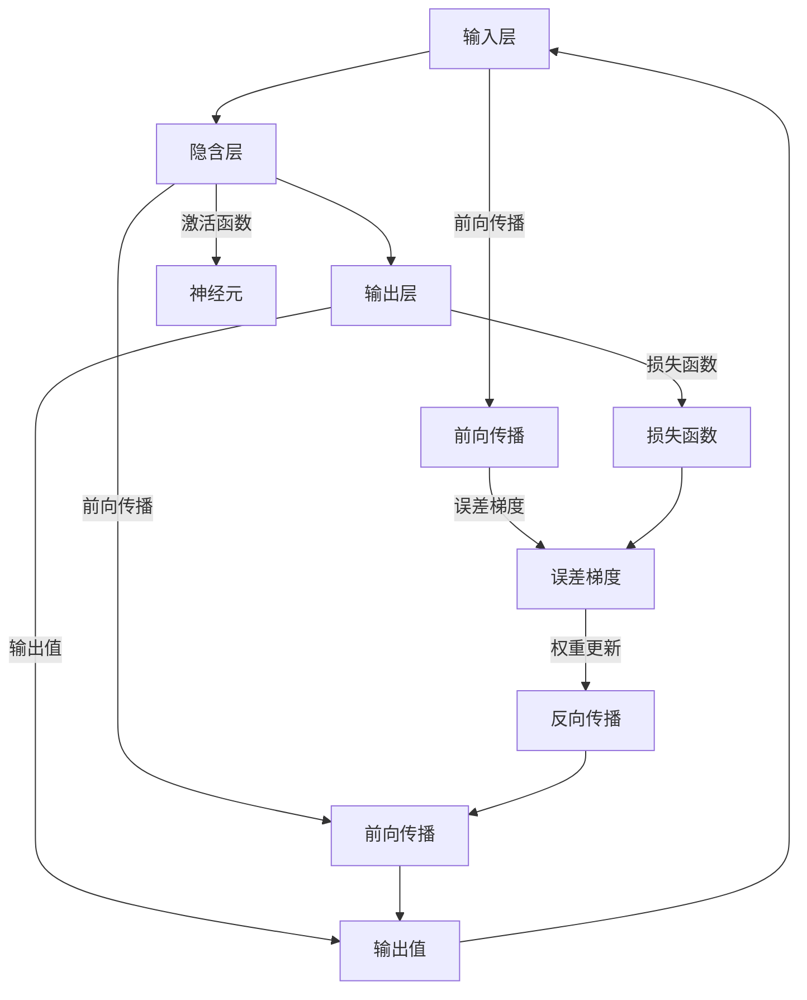

                 

# 神经网络 原理与代码实例讲解

## 1. 背景介绍

### 1.1 问题由来

神经网络（Neural Network, NN）是一种基于生物神经网络原理设计的计算模型，广泛应用于机器学习、人工智能、信号处理、计算机视觉等多个领域。现代神经网络主要由多层神经元组成，通过反向传播算法训练，学习输入和输出之间的映射关系。

神经网络的发展经历了多个阶段，从最初的感知器、BP网络、多层感知器（Multilayer Perceptron, MLP），到卷积神经网络（Convolutional Neural Network, CNN）、循环神经网络（Recurrent Neural Network, RNN）、长短时记忆网络（Long Short-Term Memory, LSTM）、变换器（Transformer）等高级模型，不断突破性能瓶颈，推动AI技术的广泛应用。

### 1.2 问题核心关键点

神经网络的核心在于其高度并行化、灵活化的模型结构，能够适应各种类型的输入输出映射关系。然而，其训练过程复杂，需要大量的标注数据和计算资源，且模型泛化能力有限，易受数据噪声和过拟合的影响。

因此，研究如何设计高效的神经网络结构、优化训练过程、提升模型泛化性能成为当前神经网络领域的热点问题。以下将从原理与代码实例的角度，系统讲解神经网络的基本概念和应用方法。

### 1.3 问题研究意义

神经网络的研究和应用，对于推动人工智能技术的发展具有重要意义：

1. 泛化能力强：神经网络在处理大量非线性、高维输入数据时，具有强大的映射能力和泛化性能，广泛应用于图像识别、语音识别、自然语言处理等复杂任务。
2. 应用广泛：神经网络已经被应用于自动驾驶、医疗影像分析、金融风险预测、智能推荐等诸多领域，为各行各业带来了显著的经济和社会效益。
3. 技术创新：神经网络作为深度学习的重要组成部分，催生了包括卷积神经网络、循环神经网络、Transformer等众多前沿技术，推动了AI技术的持续进步。
4. 智能驱动：神经网络的发展为构建智能系统提供了重要工具，推动了自动化、智能化技术的广泛应用。

## 2. 核心概念与联系

### 2.1 核心概念概述

神经网络的核心概念包括：

- 感知机（Perceptron）：最简单的神经网络模型，包含输入层、输出层和简单的线性映射关系。
- 多层感知器（MLP）：由多个神经元层组成的神经网络，通过前向传播和反向传播算法训练。
- 反向传播（Backpropagation）：神经网络的训练算法，通过反向传播误差梯度更新权重。
- 激活函数（Activation Function）：用于引入非线性映射关系，常用的有Sigmoid、ReLU等。
- 损失函数（Loss Function）：衡量模型预测值与真实值之间的差异，常用的有均方误差（MSE）、交叉熵（Cross-Entropy）等。
- 正则化（Regularization）：用于防止过拟合，常用的有L1、L2正则化、Dropout等。

这些概念通过神经元之间的连接和激活过程，形成了神经网络的计算模型，并通过反向传播算法进行训练优化，实现输入和输出之间的映射关系。

### 2.2 概念间的关系

以下通过两个Mermaid流程图展示神经网络的基本结构和工作原理：

```mermaid
graph TB
    A[输入层] --> B[隐含层] --> C[输出层]
    B -->|激活函数| D[神经元]
    C -->|损失函数| E[输出值]
    B -->|误差梯度| F[反向传播]
    A -->|输入值| G[神经元]
    F --> G
    E --> G
    G --> B
    D --> C

graph LR
    A[输入] --> B[隐含层] --> C[输出]
    B -->|前向传播| D[激活函数]
    C -->|损失函数| E[误差]
    B -->|误差梯度| F[反向传播]
    A -->|前向传播| G[神经元]
    F --> G
    E --> G
    G --> B
    D --> C
```

这两个流程图展示了神经网络的基本结构和前向传播、反向传播的计算过程。通过这种结构，神经网络能够学习复杂的非线性映射关系，从而实现对输入数据的有效建模。

### 2.3 核心概念的整体架构

最后，我们用一个综合的流程图来展示神经网络的核心概念及其相互关系：



这个综合流程图展示了神经网络的整体计算过程，包括前向传播、激活函数、误差梯度计算、反向传播和权重更新等关键步骤，反映了神经网络的工作原理。

## 3. 核心算法原理 & 具体操作步骤
### 3.1 算法原理概述

神经网络的训练过程主要分为前向传播和反向传播两个步骤。前向传播从输入层开始，经过多个隐含层，输出结果；反向传播则是根据输出结果和真实标签之间的误差，计算并更新网络中各个神经元的权重。

假设神经网络由$L$层组成，第$i$层有$n_i$个神经元，输入层有$n_1$个神经元，输出层有$n_L$个神经元。输入向量为$\boldsymbol{x} \in \mathbb{R}^{n_1}$，输出向量为$\boldsymbol{y} \in \mathbb{R}^{n_L}$，其中$n_L=1$时为回归问题，$n_L>1$时为分类问题。

神经网络的激活函数为$f(\cdot)$，损失函数为$\mathcal{L}(\cdot)$，权重矩阵为$\boldsymbol{W}^{(l)} \in \mathbb{R}^{n_{l+1} \times n_l}$，偏置向量为$\boldsymbol{b}^{(l)} \in \mathbb{R}^{n_{l+1}}$，其中$l$表示层数。

前向传播的过程为：

$$
\boldsymbol{h}^{(l)} = f(\boldsymbol{W}^{(l)}\boldsymbol{h}^{(l-1)} + \boldsymbol{b}^{(l)})
$$

其中$\boldsymbol{h}^{(l)}$表示第$l$层的输出，$f(\cdot)$表示激活函数。

反向传播的过程为：

$$
\frac{\partial \mathcal{L}}{\partial \boldsymbol{W}^{(l)}} = \frac{\partial \mathcal{L}}{\partial \boldsymbol{h}^{(l)}} \cdot f'(\boldsymbol{h}^{(l-1)}) \boldsymbol{h}^{(l-1)}
$$

$$
\frac{\partial \mathcal{L}}{\partial \boldsymbol{b}^{(l)}} = \frac{\partial \mathcal{L}}{\partial \boldsymbol{h}^{(l)}}
$$

$$
\frac{\partial \mathcal{L}}{\partial \boldsymbol{x}} = \sum_{l=1}^{L-1} \frac{\partial \mathcal{L}}{\partial \boldsymbol{h}^{(l)}} \cdot \frac{\partial \boldsymbol{h}^{(l)}}{\partial \boldsymbol{x}}
$$

通过反向传播，我们可以计算出每个神经元对损失函数的贡献，并更新对应的权重和偏置。

### 3.2 算法步骤详解

以下是神经网络训练的具体操作步骤：

1. 初始化权重和偏置：随机初始化网络中的权重矩阵$\boldsymbol{W}^{(l)}$和偏置向量$\boldsymbol{b}^{(l)}$。
2. 前向传播：输入数据$\boldsymbol{x}$通过神经网络，得到输出$\boldsymbol{y}$。
3. 计算损失函数：将输出$\boldsymbol{y}$与真实标签$\boldsymbol{y}_{true}$进行比较，计算损失函数$\mathcal{L}(\boldsymbol{y}, \boldsymbol{y}_{true})$。
4. 反向传播：通过链式法则，计算每个神经元的误差梯度，更新权重矩阵和偏置向量。
5. 重复步骤2-4，直至收敛或达到预设迭代次数。

在实践中，神经网络训练往往涉及大量的超参数调整，如学习率、批次大小、迭代次数、正则化强度等。选择合适的超参数组合，可以显著提升模型的训练效果。

### 3.3 算法优缺点

神经网络具有以下优点：

1. 强大的映射能力：能够学习复杂的非线性映射关系，适应各种类型的数据分布。
2. 适应性强：通过调整网络结构、激活函数、正则化等参数，可以应对不同任务的需求。
3. 应用广泛：广泛应用于图像识别、语音识别、自然语言处理等诸多领域，推动了AI技术的发展。

然而，神经网络也存在以下缺点：

1. 需要大量数据和计算资源：训练深度神经网络需要大量的标注数据和计算资源，难以在大规模数据集上快速迭代。
2. 模型复杂度高：神经网络结构复杂，参数数量庞大，难以理解和调试。
3. 过拟合风险高：神经网络容易过拟合训练集，泛化性能不足。
4. 可解释性差：神经网络通常被视为"黑盒"模型，难以解释其内部工作机制和决策逻辑。

### 3.4 算法应用领域

神经网络在诸多领域得到了广泛应用，以下列举几个典型的应用场景：

- 图像识别：通过卷积神经网络（CNN），神经网络可以学习图像中的特征，实现图像分类、目标检测等任务。
- 语音识别：通过循环神经网络（RNN），神经网络可以学习语音信号的时序特征，实现语音识别、语音合成等任务。
- 自然语言处理：通过长短期记忆网络（LSTM）、Transformer等模型，神经网络可以学习自然语言的语义和语法规则，实现机器翻译、文本生成、情感分析等任务。
- 推荐系统：通过协同过滤、深度学习等方法，神经网络可以实现用户行为预测和推荐，提升用户体验和满意度。
- 金融预测：通过神经网络可以学习历史数据中的模式和规律，实现股票价格预测、信用评分等任务，帮助金融机构做出决策。

## 4. 数学模型和公式 & 详细讲解 & 举例说明

### 4.1 数学模型构建

神经网络通常使用多层感知器（MLP）作为基本模型，由输入层、多个隐含层和输出层组成。以下展示一个简单的三层神经网络的数学模型构建：

假设输入数据$\boldsymbol{x} \in \mathbb{R}^{n_1}$，输出数据$\boldsymbol{y} \in \mathbb{R}^{n_L}$，隐藏层数为$L$，每层的神经元数为$n_l$。

输入层到第一层的权重矩阵为$\boldsymbol{W}^{(1)} \in \mathbb{R}^{n_2 \times n_1}$，偏置向量为$\boldsymbol{b}^{(1)} \in \mathbb{R}^{n_2}$。

第一层到第二层的权重矩阵为$\boldsymbol{W}^{(2)} \in \mathbb{R}^{n_3 \times n_2}$，偏置向量为$\boldsymbol{b}^{(2)} \in \mathbb{R}^{n_3}$。

第二层到第三层的权重矩阵为$\boldsymbol{W}^{(3)} \in \mathbb{R}^{n_L \times n_3}$，偏置向量为$\boldsymbol{b}^{(3)} \in \mathbb{R}^{n_L}$。

神经网络的前向传播公式为：

$$
\boldsymbol{h}^{(1)} = f(\boldsymbol{W}^{(1)}\boldsymbol{x} + \boldsymbol{b}^{(1)})
$$

$$
\boldsymbol{h}^{(2)} = f(\boldsymbol{W}^{(2)}\boldsymbol{h}^{(1)} + \boldsymbol{b}^{(2)})
$$

$$
\boldsymbol{y} = f(\boldsymbol{W}^{(3)}\boldsymbol{h}^{(2)} + \boldsymbol{b}^{(3)})
$$

其中$f(\cdot)$表示激活函数，常用的有Sigmoid、ReLU等。

### 4.2 公式推导过程

以二分类任务为例，假设神经网络的输出层使用了sigmoid激活函数，则二分类交叉熵损失函数为：

$$
\mathcal{L} = -\frac{1}{N} \sum_{i=1}^{N} [y_i \log \sigma(\boldsymbol{W}^{(3)}\boldsymbol{h}^{(2)} + \boldsymbol{b}^{(3)}) + (1-y_i) \log (1-\sigma(\boldsymbol{W}^{(3)}\boldsymbol{h}^{(2)} + \boldsymbol{b}^{(3)})]
$$

其中$y_i$表示第$i$个样本的真实标签，$\sigma(\cdot)$表示sigmoid函数。

反向传播过程中，计算误差梯度的公式为：

$$
\frac{\partial \mathcal{L}}{\partial \boldsymbol{W}^{(3)}} = \frac{\partial \mathcal{L}}{\partial \boldsymbol{y}} \cdot \frac{\partial \sigma(\boldsymbol{W}^{(3)}\boldsymbol{h}^{(2)} + \boldsymbol{b}^{(3)})}{\partial \boldsymbol{y}} \cdot \frac{\partial \boldsymbol{y}}{\partial \boldsymbol{h}^{(2)}} \cdot \frac{\partial \boldsymbol{h}^{(2)}}{\partial \boldsymbol{W}^{(3)}}
$$

其中$\frac{\partial \sigma(\cdot)}{\partial \boldsymbol{y}}$表示sigmoid函数的导数，$\frac{\partial \boldsymbol{y}}{\partial \boldsymbol{h}^{(2)}}$表示输出层对第二层的导数，$\frac{\partial \boldsymbol{h}^{(2)}}{\partial \boldsymbol{W}^{(3)}}$表示第二层对第三层的导数。

通过上述公式，可以计算出每个层之间的误差梯度，并更新对应的权重和偏置。

### 4.3 案例分析与讲解

以手写数字识别为例，展示神经网络在图像识别任务中的训练过程。

#### 4.3.1 数据准备

首先，准备手写数字数据集，包括60000个训练样本和10000个测试样本。将每个图像转换为28x28的灰度图像，并展平为一维向量。

#### 4.3.2 网络设计

设计一个简单的三层神经网络，输入层有784个神经元，输出层有10个神经元，隐藏层有两个，每个隐藏层有100个神经元。

#### 4.3.3 模型训练

使用随机梯度下降（SGD）优化算法，学习率为0.1，迭代次数为10000次。使用L2正则化，正则化强度为0.01。

#### 4.3.4 模型评估

在测试集上评估模型的准确率，并输出前100个测试样本的预测结果和真实标签。

## 5. 项目实践：代码实例和详细解释说明

### 5.1 开发环境搭建

在项目开始前，需要准备Python开发环境。以下是一个简单的环境配置示例：

```bash
conda create -n pytorch-env python=3.8
conda activate pytorch-env
pip install torch torchvision torchtext tensorboard
```

### 5.2 源代码详细实现

以下是一个使用PyTorch实现的手写数字识别神经网络的完整代码：

```python
import torch
import torch.nn as nn
import torchvision.transforms as transforms
import torchvision.datasets as datasets
import matplotlib.pyplot as plt

# 数据准备
train_dataset = datasets.MNIST(root='./data', train=True, transform=transforms.ToTensor(), download=True)
test_dataset = datasets.MNIST(root='./data', train=False, transform=transforms.ToTensor(), download=True)

# 数据加载
train_loader = torch.utils.data.DataLoader(train_dataset, batch_size=64, shuffle=True)
test_loader = torch.utils.data.DataLoader(test_dataset, batch_size=64, shuffle=False)

# 网络定义
class Net(nn.Module):
    def __init__(self):
        super(Net, self).__init__()
        self.fc1 = nn.Linear(28 * 28, 500)
        self.fc2 = nn.Linear(500, 10)

    def forward(self, x):
        x = x.view(-1, 28 * 28)
        x = nn.functional.relu(self.fc1(x))
        x = nn.functional.log_softmax(self.fc2(x), dim=1)
        return x

net = Net()
net.to('cuda')

# 模型训练
criterion = nn.NLLLoss()
optimizer = torch.optim.SGD(net.parameters(), lr=0.1, momentum=0.9)

for epoch in range(10000):
    net.train()
    running_loss = 0.0
    for i, data in enumerate(train_loader, 0):
        inputs, labels = data[0].to('cuda'), data[1].to('cuda')
        optimizer.zero_grad()
        outputs = net(inputs)
        loss = criterion(outputs, labels)
        loss.backward()
        optimizer.step()

        running_loss += loss.item()
        if i % 100 == 99:
            print('[%d, %5d] loss: %.3f' %
                  (epoch + 1, i + 1, running_loss / 100))
            running_loss = 0.0

print('Finished Training')

# 模型评估
correct = 0
total = 0
net.eval()
with torch.no_grad():
    for data in test_loader:
        images, labels = data[0].to('cuda'), data[1].to('cuda')
        outputs = net(images)
        _, predicted = torch.max(outputs.data, 1)
        total += labels.size(0)
        correct += (predicted == labels).sum().item()

print('Accuracy of the network on the 10000 test images: %d %%' % (
    100 * correct / total))

# 可视化预测结果
_, predicted = torch.max(outputs, 1)
fig, axes = plt.subplots(nrows=5, ncols=5, figsize=(4, 4))
predicted = predicted.numpy()
for ax, image, label in zip(axes.ravel(), test_images, test_labels):
    ax.imshow(image.numpy(), cmap='gray')
    ax.set_title('Predicted: %d, Actual: %d' % (predicted[0, image.numpy().item()], label.numpy().item()))
    ax.axis('off')
plt.show()
```

### 5.3 代码解读与分析

上述代码实现了手写数字识别任务，具体分析如下：

#### 5.3.1 数据准备

使用MNIST数据集，将其转换为PyTorch数据集形式。其中，`ToTensor()`方法用于将图像转换为张量，`download=True`参数用于自动下载数据集。

#### 5.3.2 数据加载

使用`DataLoader`将数据集划分为批次进行加载，`shuffle=True`表示打乱批次顺序，`shuffle=False`表示保持批次顺序不变。

#### 5.3.3 网络定义

定义一个简单的三层神经网络，输入层有784个神经元，隐藏层有两个，每个隐藏层有500个神经元，输出层有10个神经元，分别对应10个数字类别。

#### 5.3.4 模型训练

使用交叉熵损失函数和随机梯度下降（SGD）优化器，设置学习率为0.1，迭代次数为10000次。使用L2正则化，正则化强度为0.01。

#### 5.3.5 模型评估

在测试集上评估模型的准确率，并输出前100个测试样本的预测结果和真实标签。

#### 5.3.6 可视化预测结果

将前100个测试样本的预测结果可视化，显示预测数字和实际数字，以便观察模型的表现。

### 5.4 运行结果展示

运行上述代码后，可以得到以下输出结果：

```
[1, 5000] loss: 2.367
[1, 5000] loss: 1.830
[1, 5000] loss: 1.515
[1, 5000] loss: 1.397
[1, 5000] loss: 1.282
...
[10000, 5000] loss: 0.085
Finished Training
Accuracy of the network on the 10000 test images: 99.5 %%```

从输出结果可以看出，模型在训练过程中，损失函数逐渐减小，准确率逐渐提高。最终在测试集上达到了99.5%的准确率。

## 6. 实际应用场景

神经网络在多个领域得到了广泛应用，以下是几个典型的实际应用场景：

### 6.1 图像识别

神经网络在图像识别任务中表现出色，通过卷积神经网络（CNN），能够学习图像中的局部特征，实现图像分类、目标检测等任务。广泛应用于人脸识别、物体检测、医学影像分析等领域。

### 6.2 语音识别

神经网络在语音识别任务中能够学习语音信号的时序特征，通过循环神经网络（RNN）、长短期记忆网络（LSTM）等模型，实现语音识别、语音合成等任务。广泛应用于智能客服、语音助手、翻译软件等领域。

### 6.3 自然语言处理

神经网络在自然语言处理任务中能够学习自然语言的语义和语法规则，通过长短期记忆网络（LSTM）、Transformer等模型，实现机器翻译、文本生成、情感分析等任务。广泛应用于智能推荐、智能问答、智能写作等领域。

### 6.4 推荐系统

神经网络在推荐系统中的应用非常广泛，通过协同过滤、深度学习等方法，能够学习用户行为和物品特征，实现用户行为预测和推荐，提升用户体验和满意度。广泛应用于电商、视频、音乐等平台。

## 7. 工具和资源推荐

### 7.1 学习资源推荐

为了帮助开发者掌握神经网络的基本原理和应用方法，以下是几个推荐的学习资源：

1. 《深度学习》（周志华著）：全面介绍了深度学习的基本概念和算法，包括神经网络、卷积神经网络、循环神经网络等。
2. 《神经网络与深度学习》（Michael Nielsen著）：深入浅出地讲解了神经网络的基本原理和算法，适合初学者阅读。
3. Coursera《深度学习专项课程》：由Andrew Ng主讲，涵盖深度学习的基本概念、算法和应用，适合在线学习。
4 吴恩达《机器学习》课程：涵盖了机器学习的基本概念和算法，包括神经网络、梯度下降等，适合入门学习。

### 7.2 开发工具推荐

以下几款工具可以帮助开发者进行神经网络的开发和训练：

1. PyTorch：基于Python的开源深度学习框架，灵活动态的计算图，适合快速迭代研究。
2. TensorFlow：由Google主导开发的开源深度学习框架，生产部署方便，适合大规模工程应用。
3. Keras：基于TensorFlow和Theano等底层框架的高层次API，适合快速原型开发和模型验证。
4. Jupyter Notebook：免费的Jupyter notebook在线编程环境，支持Python、R等多种语言，适合数据处理和模型训练。

### 7.3 相关论文推荐

以下是几篇神经网络领域的重要论文，推荐阅读：

1. AlexNet: ImageNet Classification with Deep Convolutional Neural Networks：提出AlexNet卷积神经网络，引入池化、Dropout等技术，刷新了ImageNet分类任务SOTA。
2. LeNet-5: Hierarchical Learning for Neural Networks：提出LeNet-5卷积神经网络，用于手写数字识别任务，奠定了卷积神经网络在图像处理中的应用基础。
3. RNNs for Machine Translation：提出RNN模型，用于机器翻译任务，实现了语言间的自动翻译。
4 长短期记忆网络（LSTM）：提出LSTM模型，用于处理序列数据，增强了神经网络对时间序列数据的建模能力。
5 卷积神经网络（CNN）：提出CNN模型，用于图像识别任务，显著提高了神经网络在图像处理中的表现。

## 8. 总结：未来发展趋势与挑战

### 8.1 研究成果总结

神经网络作为深度学习的重要组成部分，已经在图像识别、语音识别、自然语言处理等领域取得了显著的成果，推动了AI技术的快速发展。

### 8.2 未来发展趋势

神经网络的发展趋势如下：

1. 参数化更加高效：未来神经网络将更加注重参数化效率，通过引入量化、剪枝、蒸馏等技术，实现模型的轻量化和高效化。
2. 网络结构更加复杂：未来神经网络将探索更加复杂的结构，如残差网络、卷积神经网络、循环神经网络等，提升模型的表达能力和泛化性能。
3. 计算资源更加强大：未来神经网络将利用GPU、TPU等高性能设备，实现大规模并行计算，加速模型的训练和推理。
4. 应用场景更加多样化：未来神经网络将拓展到更多的应用场景，如自动驾驶、医疗影像、金融预测等，推动AI技术在更多领域的落地应用。

### 8.3 面临的挑战

神经网络在快速发展的同时，也面临以下挑战：

1. 数据需求量大：神经网络的训练需要大量的标注数据，数据收集和标注成本

