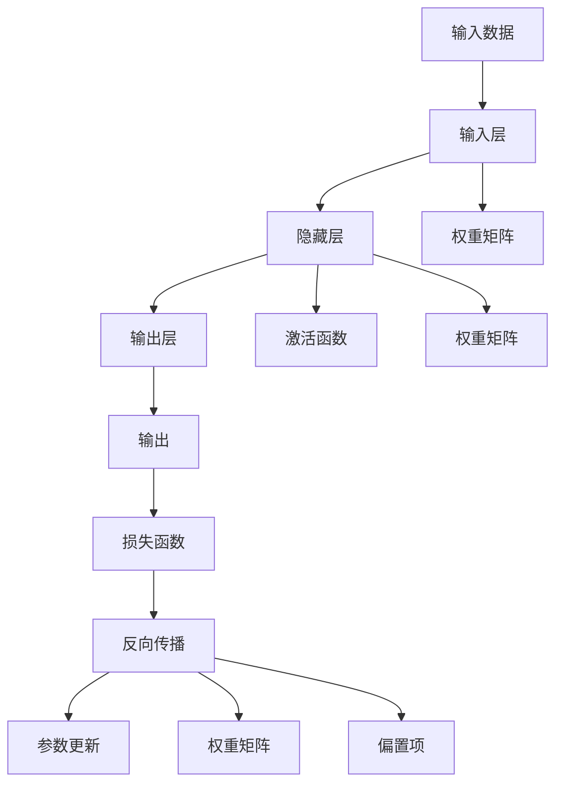
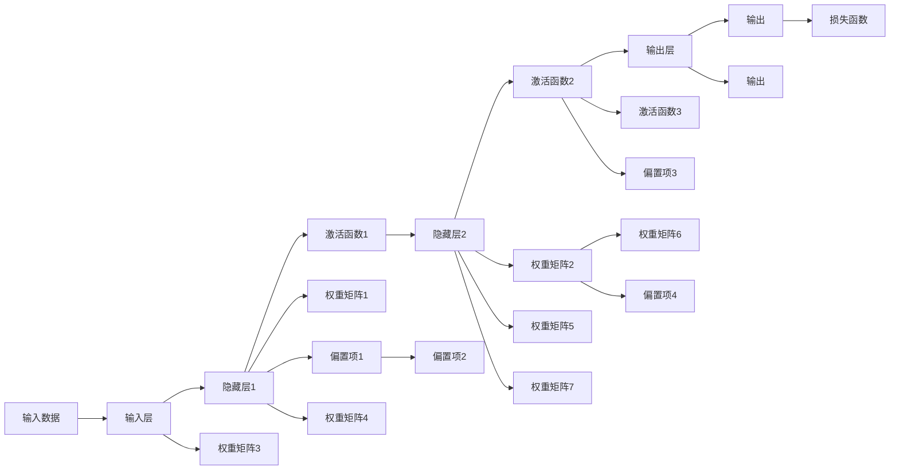

                 

# 神经网络：机器学习的新范式

## 1. 背景介绍

### 1.1 问题由来
在过去几十年里，机器学习领域经历了几次重大的范式变革，从传统的统计学习到深度学习的崛起，再到现如今的神经网络范式。神经网络不仅提升了机器学习的建模能力，更在图像识别、语音识别、自然语言处理等多个领域实现了突破性的应用。本文旨在探讨神经网络的基本原理，分析其在机器学习中的地位与作用，并展望其未来发展趋势。

### 1.2 问题核心关键点
神经网络作为机器学习的新范式，其核心在于通过模仿生物神经元的信息处理机制，实现对数据的高级抽象和自动特征学习。这一过程通过反向传播算法优化模型参数，从而在处理大量复杂数据时表现出卓越的性能。此外，神经网络的泛化能力、可解释性和迁移学习能力也是其突出优势。

### 1.3 问题研究意义
研究神经网络的基本原理，不仅有助于深入理解机器学习背后的数学和物理机制，还能为开发更加高效、智能的机器学习算法提供指导。神经网络的成功应用已经推动了人工智能技术在各个行业中的应用，促进了社会的数字化转型。

## 2. 核心概念与联系

### 2.1 核心概念概述
在深入探讨神经网络的原理之前，我们先对几个关键概念进行梳理：

- **神经网络(Neural Network)**：由多个神经元(或称节点)组成的层级结构，通过权重连接，用于处理输入数据并输出结果。
- **反向传播(Backpropagation)**：一种用于训练神经网络的算法，通过计算输出误差，反向传播误差以更新权重和偏差，实现模型优化。
- **激活函数(Activation Function)**：神经网络中用于引入非线性变换的函数，如sigmoid、ReLU等，增强模型的表达能力。
- **损失函数(Loss Function)**：衡量模型输出与真实标签之间的差距，如均方误差、交叉熵等，指导模型训练。
- **权重矩阵(Weight Matrix)**：连接神经元之间的权重参数，反映输入与输出之间的关系。
- **偏置项(Bias Term)**：每个神经元的偏置参数，调整神经元的激活水平。

这些概念相互关联，共同构成了神经网络的完整架构。

### 2.2 概念间的关系

神经网络的核心原理和架构可以通过以下Mermaid流程图进行展示：



这个流程图展示了神经网络的基本流程：输入数据经过输入层，通过权重矩阵和激活函数传递到隐藏层，经过一系列非线性变换后，最终通过输出层得到结果。反向传播算法根据损失函数计算误差，并更新权重和偏置项，完成模型的训练。

### 2.3 核心概念的整体架构

从更宏观的视角，我们可以将神经网络的结构分为以下几个层次：

1. **输入层**：接收原始数据，将其转换为网络可处理的形式。
2. **隐藏层**：包含多个神经元，通过权重矩阵和激活函数对输入数据进行特征提取和抽象。
3. **输出层**：根据隐藏层的输出，生成模型的预测结果。
4. **激活函数和损失函数**：在隐藏层和输出层中引入非线性变换和误差衡量，增强模型的表达能力和优化效果。

以下是一个详细的流程图示例：



## 3. 核心算法原理 & 具体操作步骤

### 3.1 算法原理概述
神经网络的训练过程通过反向传播算法进行优化。其基本流程如下：

1. **前向传播**：将输入数据通过网络层级传递，最终得到输出结果。
2. **计算误差**：将输出结果与真实标签进行比较，计算误差。
3. **反向传播**：根据误差反向计算每一层的梯度，更新权重和偏置。
4. **参数更新**：使用梯度下降等优化算法，更新模型参数。

### 3.2 算法步骤详解
以下是神经网络训练的详细步骤：

**Step 1: 初始化参数**
- 随机初始化权重矩阵和偏置项。

**Step 2: 前向传播**
- 将输入数据传递通过每一层，计算各层输出。

**Step 3: 计算损失函数**
- 将输出结果与真实标签进行比较，计算损失函数。

**Step 4: 反向传播**
- 根据损失函数计算误差，反向传播误差，计算梯度。

**Step 5: 参数更新**
- 使用梯度下降等优化算法，更新模型参数。

**Step 6: 重复执行**
- 重复上述步骤直至收敛或达到预设轮数。

### 3.3 算法优缺点
神经网络作为机器学习的新范式，具有以下优点：

1. **强大的表达能力**：通过多层非线性变换，神经网络能够处理复杂非线性关系。
2. **自动特征学习**：无需手工设计特征，能够从数据中自动提取重要特征。
3. **泛化能力强**：在大量数据上进行训练后，能够泛化到新数据上。

但同时，神经网络也存在一些缺点：

1. **训练复杂度高**：需要大量数据和计算资源进行训练。
2. **模型可解释性差**：神经网络的黑盒特性使得其内部工作机制难以解释。
3. **容易过拟合**：在大数据集上训练时，容易过拟合。

### 3.4 算法应用领域
神经网络在机器学习中具有广泛的应用，涵盖以下几个主要领域：

1. **计算机视觉**：图像分类、目标检测、语义分割等任务。
2. **自然语言处理**：文本分类、机器翻译、语音识别等任务。
3. **语音识别**：语音转换、语音识别等任务。
4. **强化学习**：游戏AI、机器人控制等任务。
5. **推荐系统**：商品推荐、内容推荐等任务。

## 4. 数学模型和公式 & 详细讲解 & 举例说明

### 4.1 数学模型构建

神经网络可以表示为如下形式：

$$
f(x; \theta) = \sigma(\omega_1 \cdot \sigma(\omega_2 \cdot \sigma(\omega_3 \cdot \sigma(\cdots \cdot x) \cdots)))
$$

其中，$x$为输入向量，$\omega$为权重矩阵，$\sigma$为激活函数，$\theta$为所有参数的集合。

### 4.2 公式推导过程

以一个简单的神经网络为例，推导其前向传播和反向传播的过程：

**前向传播**：
$$
z = w \cdot x + b
$$
$$
a = \sigma(z)
$$

**计算误差**：
$$
e = t - a
$$

**反向传播**：
$$
\frac{\partial e}{\partial a} = 1
$$
$$
\frac{\partial e}{\partial z} = \frac{\partial e}{\partial a} \cdot \frac{\partial a}{\partial z} = \frac{\partial e}{\partial a} \cdot \sigma'(z)
$$
$$
\frac{\partial e}{\partial w} = \frac{\partial e}{\partial z} \cdot \frac{\partial z}{\partial w} = \frac{\partial e}{\partial z} \cdot x^T
$$
$$
\frac{\partial e}{\partial b} = \frac{\partial e}{\partial z} \cdot \frac{\partial z}{\partial b} = \frac{\partial e}{\partial z}
$$

### 4.3 案例分析与讲解

以手写数字识别为例，展示神经网络的应用过程：

1. **数据预处理**：将手写数字图像转换为向量表示，并进行归一化处理。
2. **搭建模型**：设计一个简单的全连接神经网络，包含一个输入层、两个隐藏层和一个输出层。
3. **前向传播**：将预处理后的图像向量输入神经网络，计算各层输出。
4. **反向传播**：计算输出结果与真实标签之间的误差，反向传播误差，更新权重和偏置。
5. **参数更新**：使用梯度下降等优化算法，更新模型参数。
6. **模型评估**：在测试集上评估模型性能，对比不同模型的准确率。

## 5. 项目实践：代码实例和详细解释说明

### 5.1 开发环境搭建

以下是在Python环境下搭建神经网络开发环境的步骤：

1. 安装Python和相关依赖：
```
pip install numpy scipy matplotlib scikit-learn pytorch torchvision
```

2. 安装深度学习框架：
```
pip install torch torchvision
```

3. 创建虚拟环境：
```
conda create -n pytorch_env python=3.7
conda activate pytorch_env
```

### 5.2 源代码详细实现

以下是一个简单的神经网络实现，用于手写数字识别：

```python
import torch
import torch.nn as nn
import torch.nn.functional as F
import torch.optim as optim
import torchvision
import torchvision.transforms as transforms
from torchvision.datasets import MNIST

class NeuralNet(nn.Module):
    def __init__(self):
        super(NeuralNet, self).__init__()
        self.fc1 = nn.Linear(784, 128)
        self.fc2 = nn.Linear(128, 64)
        self.fc3 = nn.Linear(64, 10)

    def forward(self, x):
        x = x.view(-1, 28 * 28)
        x = F.relu(self.fc1(x))
        x = F.relu(self.fc2(x))
        x = self.fc3(x)
        return x

# 加载数据集
train_dataset = MNIST(root='./data', train=True, transform=transforms.ToTensor(), download=True)
test_dataset = MNIST(root='./data', train=False, transform=transforms.ToTensor(), download=True)

# 定义模型、损失函数和优化器
model = NeuralNet()
criterion = nn.CrossEntropyLoss()
optimizer = optim.Adam(model.parameters(), lr=0.001)

# 训练模型
for epoch in range(10):
    running_loss = 0.0
    for i, data in enumerate(train_loader, 0):
        inputs, labels = data
        optimizer.zero_grad()
        outputs = model(inputs)
        loss = criterion(outputs, labels)
        loss.backward()
        optimizer.step()
        running_loss += loss.item()
    print('Epoch {} Loss: {:.6f}'.format(epoch+1, running_loss/len(train_loader)))

# 评估模型
correct = 0
total = 0
with torch.no_grad():
    for data in test_loader:
        images, labels = data
        outputs = model(images)
        _, predicted = torch.max(outputs.data, 1)
        total += labels.size(0)
        correct += (predicted == labels).sum().item()
print('Accuracy: {:.2f}%'.format(100 * correct / total))
```

### 5.3 代码解读与分析

**NeuralNet类**：
- `__init__`方法：定义神经网络的结构，包含三个全连接层。
- `forward`方法：定义前向传播过程，计算模型输出。

**模型训练**：
- 使用Adam优化器和交叉熵损失函数，对模型进行训练。
- 在每个epoch中，遍历训练集，计算损失并更新参数。
- 通过测试集评估模型性能，输出准确率。

## 6. 实际应用场景

### 6.1 计算机视觉

神经网络在计算机视觉领域的应用非常广泛，例如图像分类、目标检测、语义分割等任务。以ImageNet大规模视觉识别挑战为例，神经网络已经取得了接近人眼的识别效果。

**应用场景**：
- 医学影像诊断：利用卷积神经网络对X光片、CT扫描等影像进行自动分析，快速定位病变区域。
- 自动驾驶：使用神经网络对摄像头和传感器数据进行图像识别，实时检测道路和障碍物，辅助驾驶决策。
- 安防监控：通过神经网络对视频流进行目标检测和行为分析，提升监控系统的智能化水平。

### 6.2 自然语言处理

神经网络在自然语言处理领域也有广泛应用，例如文本分类、机器翻译、情感分析等任务。以BERT模型为例，通过预训练大语言模型，可以大大提升各类NLP任务的性能。

**应用场景**：
- 自动摘要：使用神经网络对长文本进行自动总结，提取关键信息。
- 机器翻译：利用神经网络对不同语言文本进行自动翻译，打破语言障碍。
- 情感分析：通过神经网络对用户评论进行情感分析，了解用户反馈。

### 6.3 语音识别

神经网络在语音识别领域也取得了突破性进展，例如语音转文字、语音情感识别等任务。以Google的Deep Speech模型为例，通过神经网络实现高精度的语音转文字。

**应用场景**：
- 语音助手：通过神经网络实现语音识别和自然语言理解，提供智能语音交互体验。
- 语音翻译：将不同语言的语音进行自动翻译，实现跨语言交流。
- 语音搜索：利用语音识别技术，提升搜索效率和用户体验。

### 6.4 未来应用展望

未来，神经网络将在更多的领域得到应用，带来新的技术突破。以下是几个潜在的应用方向：

1. **边缘计算**：神经网络可以在移动设备上实时运行，实现本地化计算，提升响应速度。
2. **人机交互**：通过自然语言处理和语音识别技术，实现更加智能、自然的人机交互方式。
3. **个性化推荐**：通过神经网络对用户行为和偏好进行分析，实现更精准的个性化推荐。
4. **自动驾驶**：利用神经网络对感知数据进行处理，提升自动驾驶系统的感知和决策能力。
5. **医疗诊断**：通过神经网络对医疗影像和数据进行自动分析和诊断，辅助医生诊疗。

## 7. 工具和资源推荐

### 7.1 学习资源推荐

- **《深度学习》**：Ian Goodfellow、Yoshua Bengio和Aaron Courville著，详细介绍了深度学习的数学基础和实践技巧。
- **《神经网络与深度学习》**：Michael Nielsen著，深入浅出地介绍了神经网络的原理和应用。
- **Coursera《深度学习专项课程》**：由深度学习领域专家Andrew Ng教授讲授，系统讲解深度学习的基本理论和实践。
- **Kaggle竞赛**：参与Kaggle竞赛，实战锻炼深度学习技能，积累项目经验。

### 7.2 开发工具推荐

- **TensorFlow**：由Google开发的深度学习框架，支持分布式计算，适合大规模模型训练。
- **PyTorch**：由Facebook开发的深度学习框架，易于使用，支持动态计算图。
- **MXNet**：由亚马逊开发的深度学习框架，支持多种编程语言，适合跨平台部署。
- **Jupyter Notebook**：用于交互式数据科学和机器学习实验的Web界面，方便调试和分享。

### 7.3 相关论文推荐

- **《Deep Learning》**：Ian Goodfellow、Yoshua Bengio和Aaron Courville著，全面介绍了深度学习的理论基础和实践应用。
- **《Understanding Deep Learning》**：Yoshua Bengio著，深入分析了深度学习的数学原理和应用场景。
- **《A Survey of Recent Techniques in Neural Networks》**：Yann LeCun、Yoshua Bengio和Geoffrey Hinton著，综述了深度学习领域的重要进展。

## 8. 总结：未来发展趋势与挑战

### 8.1 研究成果总结

本文介绍了神经网络的基本原理、应用场景和未来发展方向。神经网络作为一种先进的机器学习算法，通过模仿生物神经元的工作机制，实现了对复杂数据的高级抽象和自动特征学习。其在计算机视觉、自然语言处理、语音识别等多个领域展现了强大的应用潜力。

### 8.2 未来发展趋势

未来，神经网络将在更多领域得到应用，推动人工智能技术的发展。以下是几个重要的发展趋势：

1. **深度学习与强化学习结合**：将神经网络与强化学习结合，提升系统的智能决策能力。
2. **联邦学习**：通过分布式计算，保护数据隐私的同时提升模型性能。
3. **自监督学习**：利用无标签数据进行自监督学习，降低对标注数据的依赖。
4. **模型压缩与加速**：通过模型压缩和加速技术，提升模型的部署效率。
5. **跨模态学习**：将视觉、语音、文本等多种模态信息进行融合，实现更全面的信息处理。

### 8.3 面临的挑战

尽管神经网络在机器学习领域取得了巨大成功，但仍面临一些挑战：

1. **计算资源需求高**：神经网络需要大量计算资源进行训练和推理。
2. **模型可解释性差**：神经网络的黑盒特性使得其内部工作机制难以解释。
3. **数据隐私问题**：在分布式计算和跨模态学习中，数据隐私和安全问题值得关注。
4. **公平性问题**：需要避免神经网络在学习过程中引入偏见，确保模型的公平性。

### 8.4 研究展望

面对这些挑战，未来的研究方向包括：

1. **模型压缩与加速**：通过模型压缩和加速技术，降低计算资源需求。
2. **可解释性增强**：通过可解释性方法，提升模型的透明度和可解释性。
3. **隐私保护技术**：开发隐私保护技术，确保数据隐私和安全。
4. **公平性优化**：通过公平性优化方法，提升模型的公平性和鲁棒性。
5. **跨模态融合**：通过跨模态学习，提升多模态数据处理能力。

总之，神经网络作为机器学习的新范式，已经在多个领域展示了强大的应用潜力。未来的研究将继续探索其极限，推动人工智能技术的发展，为人类社会带来更多创新和变革。

## 9. 附录：常见问题与解答

**Q1: 什么是神经网络？**

A: 神经网络是一种由多个神经元组成的层级结构，通过权重连接，用于处理输入数据并输出结果。

**Q2: 神经网络是如何训练的？**

A: 神经网络的训练过程通过反向传播算法进行优化。具体步骤如下：前向传播、计算误差、反向传播、参数更新。

**Q3: 神经网络有哪些优缺点？**

A: 优点：强大的表达能力、自动特征学习、泛化能力强。缺点：训练复杂度高、模型可解释性差、容易过拟合。

**Q4: 神经网络在实际应用中有哪些例子？**

A: 计算机视觉、自然语言处理、语音识别、自动驾驶、医学影像诊断等。

**Q5: 未来神经网络的发展趋势是什么？**

A: 深度学习与强化学习结合、联邦学习、自监督学习、模型压缩与加速、跨模态学习。

---

作者：禅与计算机程序设计艺术 / Zen and the Art of Computer Programming

