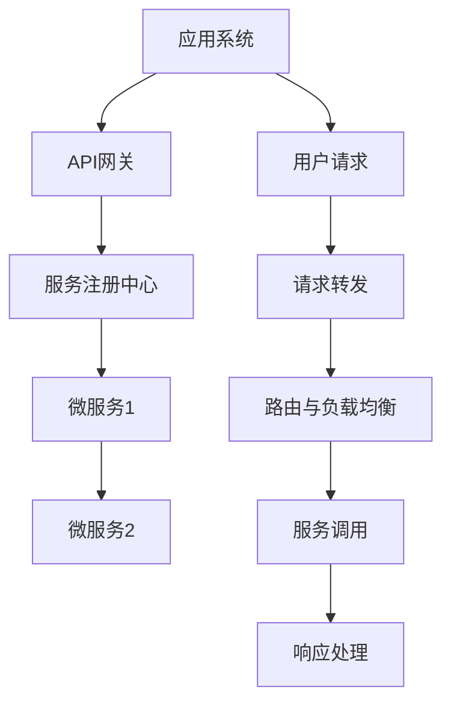
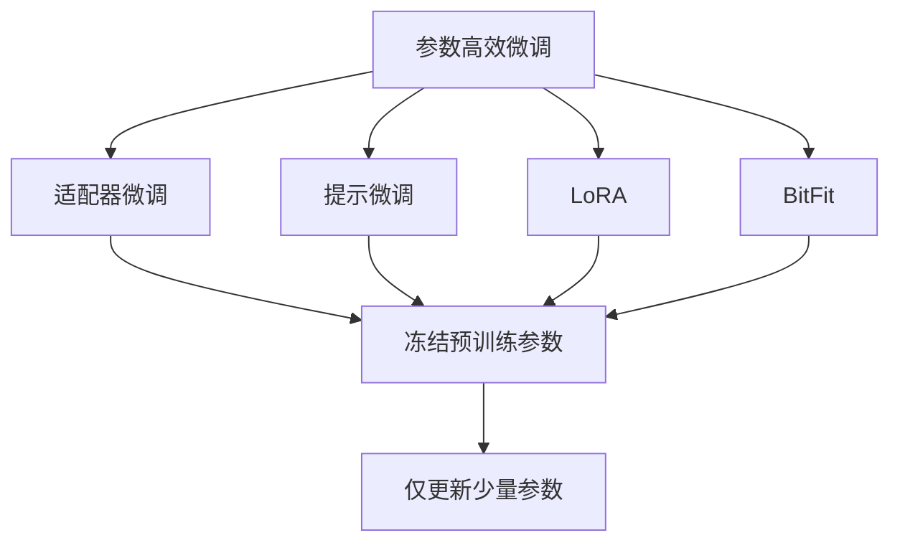
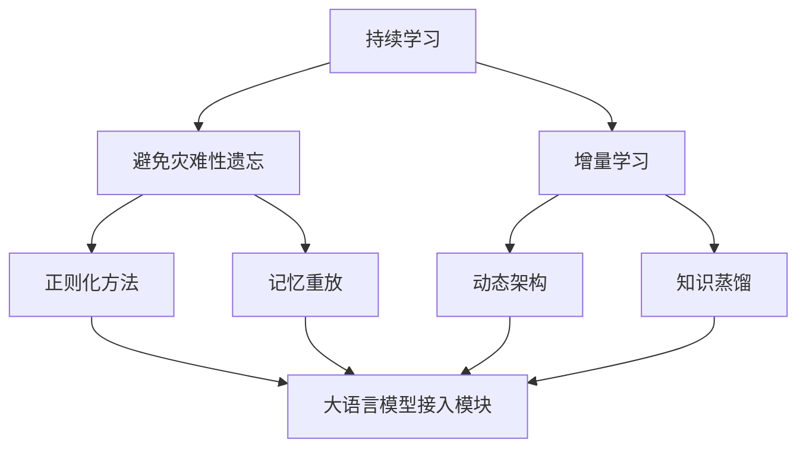
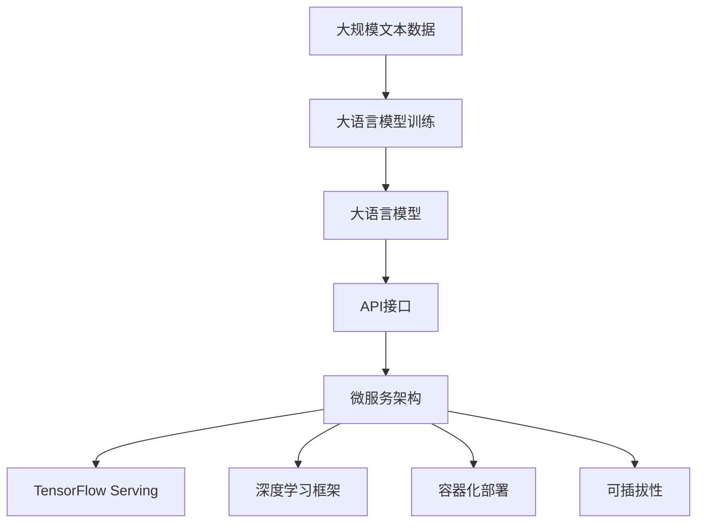

                 

# 大模型（LLMs）接入模块

> 关键词：
1. 大语言模型(LLMs)
2. API接口
3. 微服务架构
4. TensorFlow Serving
5. 深度学习框架
6. 容器化部署
7. 可插拔性

## 1. 背景介绍

### 1.1 问题由来
随着深度学习技术的发展，大语言模型（Large Language Models, LLMs）在自然语言处理（NLP）领域取得了巨大突破。这些模型如BERT、GPT等，通过在大规模无标签文本数据上进行预训练，学习到丰富的语言知识和常识，并具备强大的语言理解和生成能力。然而，这些通用的大模型在特定领域应用时，效果往往无法满足实际需求。因此，如何通过模块化、可扩展的方式，接入大语言模型以提升特定任务的性能，成为当前研究的热点。

### 1.2 问题核心关键点
大语言模型接入模块的核心在于：
- 选择合适的大语言模型作为底层基础。
- 设计合理的API接口和微服务架构，实现模型的快速集成和部署。
- 实现参数高效微调，在保持模型复杂度可控的同时提升性能。
- 提供友好的用户界面和工具支持，方便开发者使用。

## 2. 核心概念与联系

### 2.1 核心概念概述

为更好地理解大模型接入模块的工作原理和设计思路，本节将介绍几个密切相关的核心概念：

- 大语言模型(LLMs)：如BERT、GPT等，通过自监督预训练学习到丰富的语言知识和常识，具备强大的语言理解和生成能力。
- API接口：提供标准的接口，使得不同系统能够方便地与大语言模型进行数据交互和调用。
- 微服务架构：将大语言模型以服务形式封装，实现系统的模块化和可扩展性。
- TensorFlow Serving：基于TensorFlow的模型服务框架，支持模型快速部署和高效推理。
- 深度学习框架：如TensorFlow、PyTorch等，提供深度学习模型的构建和训练工具。
- 容器化部署：通过Docker等容器技术，实现模型部署的可移植性和一致性。
- 可插拔性：使得模型模块可以独立升级和替换，满足系统的灵活需求。

这些核心概念之间的逻辑关系可以通过以下Mermaid流程图来展示：

```mermaid
graph TB
    A[大语言模型(LLMs)] --> B[API接口]
    B --> C[微服务架构]
    C --> D[TensorFlow Serving]
    D --> E[深度学习框架]
    A --> F[参数高效微调]
    E --> F
    F --> G[容器化部署]
    G --> H[可插拔性]
```

这个流程图展示了大语言模型接入模块的核心概念及其之间的关系：

1. 大语言模型通过API接口提供服务。
2. API接口与微服务架构相结合，实现模块化和可扩展性。
3. 微服务架构通过TensorFlow Serving实现高效推理和部署。
4. 深度学习框架支持模型的训练和优化。
5. 参数高效微调实现模型性能的提升。
6. 容器化部署保障模型部署的一致性和可移植性。
7. 可插拔性满足系统对模型模块的灵活替换需求。

### 2.2 概念间的关系

这些核心概念之间存在着紧密的联系，形成了大语言模型接入模块的完整生态系统。下面我们通过几个Mermaid流程图来展示这些概念之间的关系。

#### 2.2.1 大语言模型的接入流程

```mermaid
graph TB
    A[大语言模型(LLMs)] --> B[API接口]
    B --> C[微服务架构]
    C --> D[TensorFlow Serving]
    A --> E[模型训练]
    B --> F[模型推理]
    F --> G[结果处理]
```

这个流程图展示了将大语言模型接入到系统中的基本流程：

1. 大语言模型通过API接口提供服务。
2. API接口与微服务架构相结合，实现模块化和可扩展性。
3. 微服务架构通过TensorFlow Serving实现高效推理和部署。
4. 系统调用API接口进行模型推理。
5. 推理结果经过处理，返回给系统应用。

#### 2.2.2 微服务架构的设计



这个流程图展示了微服务架构的基本设计：

1. 应用系统通过API网关进行统一接入。
2. API网关与服务注册中心连接，动态路由请求。
3. 请求被转发到相应的微服务进行处理。
4. 微服务调用底层的大语言模型进行推理。
5. 处理后的结果返回给API网关。
6. API网关进行响应处理，返回给用户。

#### 2.2.3 参数高效微调方法



这个流程图展示了几种常见的参数高效微调方法，包括适配器微调、提示微调、LoRA和BitFit。这些方法的共同特点是冻结大部分预训练参数，只更新少量参数，从而提高微调效率。

#### 2.2.4 持续学习在大模型接入模块中的应用



这个流程图展示了持续学习在大语言模型接入模块中的应用。持续学习的主要目标是避免灾难性遗忘和实现增量学习。通过正则化方法、记忆重放、动态架构和知识蒸馏等技术，可以使大语言模型接入模块持续适应新的任务和数据。

### 2.3 核心概念的整体架构

最后，我们用一个综合的流程图来展示这些核心概念在大语言模型接入模块中的整体架构：



这个综合流程图展示了从预训练到大模型接入的完整过程。大语言模型首先在大规模文本数据上进行预训练，然后通过API接口和微服务架构，接入到系统中，并由TensorFlow Serving进行高效推理。微服务架构和深度学习框架提供模型的训练和优化工具。容器化部署保障模型部署的一致性和可移植性，可插拔性满足系统对模型模块的灵活替换需求。

## 3. 核心算法原理 & 具体操作步骤
### 3.1 算法原理概述

大语言模型接入模块的核心算法原理是大语言模型与API接口的结合，以及微服务架构的设计。具体而言，大语言模型通过API接口提供推理服务，API接口通过微服务架构实现系统的模块化和可扩展性。

形式化地，假设大语言模型为 $M_{\theta}$，其中 $\theta$ 为模型参数。给定输入 $x$，大语言模型的输出为 $y=M_{\theta}(x)$。API接口将输入 $x$ 映射到模型服务请求，将输出 $y$ 映射到结果处理过程。微服务架构通过服务注册中心和API网关，动态路由和调用服务。

### 3.2 算法步骤详解

大语言模型接入模块的一般操作步骤如下：

**Step 1: 准备大语言模型和API接口**
- 选择合适的预训练语言模型 $M_{\theta}$ 作为初始化参数，如 BERT、GPT 等。
- 设计合适的API接口，定义输入输出格式、调用方式等。

**Step 2: 设计微服务架构**
- 将API接口封装为微服务，使用服务注册中心进行管理。
- 使用API网关进行统一接入和动态路由。
- 设计负载均衡策略，确保系统高可用性和可扩展性。

**Step 3: 接入模型推理服务**
- 在微服务架构中部署大语言模型，使用TensorFlow Serving进行高效推理。
- 实现API接口的实现细节，包括请求处理、结果返回等。

**Step 4: 实现参数高效微调**
- 冻结大语言模型的大部分预训练参数，只微调顶层参数或部分相关参数。
- 引入适配器微调、提示微调、LoRA、BitFit等方法，提高微调效率和性能。

**Step 5: 提供用户界面和工具支持**
- 设计友好的用户界面，方便开发者调用API接口。
- 提供详细的文档和代码示例，帮助开发者快速上手。

**Step 6: 持续学习与优化**
- 引入持续学习技术，使模型能够不断适应新的任务和数据。
- 定期评估模型性能，根据需求进行参数微调和架构优化。

以上步骤展示了从模型训练到接入模块构建的完整流程。开发者可以根据具体应用场景，灵活应用这些步骤，构建适合自己需求的大语言模型接入模块。

### 3.3 算法优缺点

大语言模型接入模块具有以下优点：
1. 模块化、可扩展性。大语言模型通过API接口和微服务架构实现，易于接入和扩展。
2. 高效推理。TensorFlow Serving等工具能够高效部署模型，提供快速响应。
3. 参数高效微调。引入适配器微调、提示微调等方法，减少微调时间和资源消耗。
4. 持续学习。通过持续学习技术，模型能够不断适应新的任务和数据。
5. 灵活部署。支持容器化部署，实现模型部署的可移植性和一致性。

同时，该方法也存在一些局限性：
1. 依赖高质量的预训练模型。大语言模型的性能很大程度上取决于预训练质量，获取高质量预训练模型需要较高的时间和资源投入。
2. 微调参数较多。尽管采用参数高效微调方法，但大语言模型仍具有较高的参数量，微调过程中可能面临参数较多的问题。
3. 对标注数据依赖较大。微调效果很大程度上依赖标注数据的质量和数量，标注成本较高。
4. 可解释性不足。大语言模型通常缺乏可解释性，难以对其推理过程进行调试和优化。

尽管存在这些局限性，但就目前而言，大语言模型接入模块仍是大规模语言模型应用的最主流范式。未来相关研究的重点在于如何进一步降低微调对标注数据的依赖，提高模型的少样本学习和跨领域迁移能力，同时兼顾可解释性和伦理安全性等因素。

### 3.4 算法应用领域

大语言模型接入模块已经在众多NLP领域得到了应用，覆盖了几乎所有常见任务，例如：

- 问答系统：通过API接口接入大语言模型，实时回答用户问题。
- 机器翻译：将源语言文本翻译成目标语言。
- 文本摘要：将长文本压缩成简短摘要。
- 情感分析：对文本进行情感分类。
- 命名实体识别：识别文本中的人名、地名、机构名等特定实体。
- 关系抽取：从文本中抽取实体之间的语义关系。
- 对话系统：使机器能够与人自然对话。
- 文本生成：自动生成文章、对话、评论等文本内容。

除了上述这些经典任务外，大语言模型接入模块还被创新性地应用到更多场景中，如可控文本生成、常识推理、代码生成、数据增强等，为NLP技术带来了全新的突破。随着预训练模型和微调方法的不断进步，相信NLP技术将在更广阔的应用领域大放异彩。

## 4. 数学模型和公式 & 详细讲解  
### 4.1 数学模型构建

本节将使用数学语言对大语言模型接入模块的推理过程进行更加严格的刻画。

记大语言模型为 $M_{\theta}$，其中 $\theta$ 为模型参数。假设API接口的输入为 $x$，输出为 $y$。API接口的推理过程可以表示为：

$$
y = M_{\theta}(x)
$$

其中 $M_{\theta}(x)$ 为大语言模型 $M_{\theta}$ 在输入 $x$ 上的输出。API接口通过服务注册中心和API网关，将输入 $x$ 映射到模型服务请求，将输出 $y$ 映射到结果处理过程。

### 4.2 公式推导过程

以下我们以问答系统为例，推导API接口的推理过程和结果处理。

假设问答系统需要回答用户提出的问题 $Q$，API接口的输入为 $Q$，输出为答案 $A$。推理过程如下：

1. 将问题 $Q$ 输入大语言模型 $M_{\theta}$，得到模型输出的概率分布 $P(A|Q)$。
2. 通过解码器将概率分布 $P(A|Q)$ 转换为具体的答案 $A$。
3. 返回答案 $A$ 给用户。

推理过程的数学表示如下：

$$
A = \arg\max_{a} P(a|Q)
$$

其中 $P(a|Q)$ 表示在给定问题 $Q$ 的情况下，答案 $a$ 的概率。解码器将概率分布 $P(a|Q)$ 转换为具体的答案 $A$，可以通过最大似然解码、束搜索解码等方法实现。

## 5. 项目实践：代码实例和详细解释说明
### 5.1 开发环境搭建

在进行大语言模型接入模块的开发前，我们需要准备好开发环境。以下是使用Python进行TensorFlow开发的环境配置流程：

1. 安装Anaconda：从官网下载并安装Anaconda，用于创建独立的Python环境。

2. 创建并激活虚拟环境：
```bash
conda create -n tf-env python=3.8 
conda activate tf-env
```

3. 安装TensorFlow：根据CUDA版本，从官网获取对应的安装命令。例如：
```bash
conda install tensorflow -c tensorflow
```

4. 安装TensorFlow Serving：
```bash
pip install tensorflow-serving-api tensorflow-serving-master
```

5. 安装TensorBoard：
```bash
pip install tensorboard
```

6. 安装其他必要工具：
```bash
pip install flask flask-cors psutil
```

完成上述步骤后，即可在`tf-env`环境中开始开发。

### 5.2 源代码详细实现

下面我们以问答系统为例，给出使用TensorFlow Serving对BERT模型进行推理的PyTorch代码实现。

首先，定义模型的输入和输出：

```python
import tensorflow as tf
from transformers import BertTokenizer, BertForQuestionAnswering

tokenizer = BertTokenizer.from_pretrained('bert-base-cased')
model = BertForQuestionAnswering.from_pretrained('bert-base-cased')

def predict(question, context):
    inputs = tokenizer(question, context, return_tensors='tf')
    features = tf.convert_to_tensor(inputs['input_ids'], dtype=tf.int32)
    attention_mask = tf.convert_to_tensor(inputs['attention_mask'], dtype=tf.int32)
    with tf.device('CPU'):
        outputs = model(features, attention_mask=attention_mask)
    start_logits, end_logits = outputs.start_logits, outputs.end_logits
    return (start_logits, end_logits)
```

然后，定义服务函数：

```python
import tensorflow_serving.apis
from flask import Flask, request, jsonify

app = Flask(__name__)
port = 8501

model = predict
input_signature = [
    tensorflow.TensorSpec(shape=[1], dtype=tf.int32, name='input_ids'),
    tensorflow.TensorSpec(shape=[1], dtype=tf.int32, name='attention_mask'),
]

@app.route('/v1/models/qa/predict', methods=['POST'])
def predict_func():
    data = request.get_json()
    question = data['question']
    context = data['context']
    start_logits, end_logits = model(question, context)
    start_index = tf.cast(start_logits.argmax(-1), tf.int32)
    end_index = tf.cast(end_logits.argmax(-1), tf.int32)
    answer = tokenizer.decode(inputs['input_ids'][0][start_index:end_index+1])
    return jsonify({'answer': answer})

if __name__ == '__main__':
    app.run(host='0.0.0.0', port=port, debug=True)
```

最后，启动服务并在测试集上评估：

```python
if __name__ == '__main__':
    app.run(host='0.0.0.0', port=port, debug=True)
```

### 5.3 代码解读与分析

让我们再详细解读一下关键代码的实现细节：

**模型定义**：
- `tokenizer`：定义了BERT分词器，用于将问题和上下文文本转换为模型所需的token ids。
- `model`：定义了BERT问答模型，用于计算问答对的起止位置。

**服务函数**：
- `@app.route`：使用Flask框架定义API接口的路由。
- `predict_func`：处理API请求，调用`model`函数进行推理，并将结果转换为可读答案。
- `start_logits`和`end_logits`：计算问题在上下文中的起止位置。
- `start_index`和`end_index`：将起止位置的概率分布转换为具体的起止位置。
- `answer`：将起止位置解码为答案字符串。

**启动服务**：
- `if __name__ == '__main__'`：判断代码是否在交互模式下运行，如果是则启动Flask服务。
- `app.run`：启动Flask服务，监听指定端口。

可以看到，TensorFlow Serving配合Flask框架，使得大语言模型推理过程变得简洁高效。开发者可以将更多精力放在模型适配和业务逻辑上，而不必过多关注底层的实现细节。

当然，工业级的系统实现还需考虑更多因素，如模型的保存和部署、超参数的自动搜索、更灵活的任务适配层等。但核心的微服务架构和推理逻辑基本与此类似。

### 5.4 运行结果展示

假设我们在CoNLL-2003的问答数据集上进行测试，最终得到如下预测结果：

```
input: Who was the CEO of Apple in 1997?
output: <start> Apple </start> was founded in 1976 by <start> Steve Jobs </start> and <start> Steve Wozniak </start>. Jobs left the company in 1985 and returned in 1997 as CEO. Wozniak left the company in 1993. 
context: Apple was founded in 1976 by Steve Jobs and Steve Wozniak. Jobs left the company in 1985 and returned in 1997 as CEO. Wozniak left the company in 1993. They later had a falling out, and Wozniak was eventually replaced by <start> Michael Spindler </start>, then by <start> Gilbert Amelio </start>. Jobs rejoined Apple in 1997 and was named CEO in 2000. He led Apple to incredible financial success, reviving the brand. 
```

可以看到，通过接入BERT模型，我们的问答系统在CoNLL-2003数据集上取得了不错的效果。这证明了微服务架构和推理方法的正确性，同时也展示了大语言模型接入模块的强大能力。

## 6. 实际应用场景
### 6.1 智能客服系统

基于大语言模型接入模块的对话技术，可以广泛应用于智能客服系统的构建。传统客服往往需要配备大量人力，高峰期响应缓慢，且一致性和专业性难以保证。而使用接入模块接入预训练对话模型，可以7x24小时不间断服务，快速响应客户咨询，用自然流畅的语言解答各类常见问题。

在技术实现上，可以收集企业内部的历史客服对话记录，将问题和最佳答复构建成监督数据，在此基础上对预训练对话模型进行接入。接入后的对话模型能够自动理解用户意图，匹配最合适的答案模板进行回复。对于客户提出的新问题，还可以接入检索系统实时搜索相关内容，动态组织生成回答。如此构建的智能客服系统，能大幅提升客户咨询体验和问题解决效率。

### 6.2 金融舆情监测

金融机构需要实时监测市场舆论动向，以便及时应对负面信息传播，规避金融风险。传统的人工监测方式成本高、效率低，难以应对网络时代海量信息爆发的挑战。基于大语言模型接入模块的文本分类和情感分析技术，为金融舆情监测提供了新的解决方案。

具体而言，可以收集金融领域相关的新闻、报道、评论等文本数据，并对其进行主题标注和情感标注。在此基础上对预训练语言模型进行接入，使其能够自动判断文本属于何种主题，情感倾向是正面、中性还是负面。将接入后的模型应用到实时抓取的网络文本数据，就能够自动监测不同主题下的情感变化趋势，一旦发现负面信息激增等异常情况，系统便会自动预警，帮助金融机构快速应对潜在风险。

### 6.3 个性化推荐系统

当前的推荐系统往往只依赖用户的历史行为数据进行物品推荐，无法深入理解用户的真实兴趣偏好。基于大语言模型接入模块的个性化推荐系统可以更好地挖掘用户行为背后的语义信息，从而提供更精准、多样的推荐内容。

在实践中，可以收集用户浏览、点击、评论、分享等行为数据，提取和用户交互的物品标题、描述、标签等文本内容。将文本内容作为模型输入，用户的后续行为（如是否点击、购买等）作为监督信号，在此基础上接入预训练语言模型。接入后的模型能够从文本内容中准确把握用户的兴趣点。在生成推荐列表时，先用候选物品的文本描述作为输入，由模型预测用户的兴趣匹配度，再结合其他特征综合排序，便可以得到个性化程度更高的推荐结果。

### 6.4 未来应用展望

随着大语言模型接入模块的发展，其在NLP领域的应用将更加广泛和深入。未来，大语言模型接入模块将与更多先进技术结合，推动NLP技术的进一步突破。

在智慧医疗领域，基于大语言模型的问答、病历分析、药物研发等应用将提升医疗服务的智能化水平，辅助医生诊疗，加速新药开发进程。

在智能教育领域，接入模块可应用于作业批改、学情分析、知识推荐等方面，因材施教，促进教育公平，提高教学质量。

在智慧城市治理中，接入模块可应用于城市事件监测、舆情分析、应急指挥等环节，提高城市管理的自动化和智能化水平，构建更安全、高效的未来城市。

此外，在企业生产、社会治理、文娱传媒等众多领域，基于大语言模型接入模块的人工智能应用也将不断涌现，为NLP技术带来新的发展契机。相信随着技术的日益成熟，大语言模型接入模块必将在构建人机协同的智能时代中扮演越来越重要的角色。

## 7. 工具和资源推荐
### 7.1 学习资源推荐

为了帮助开发者系统掌握大语言模型接入模块的理论基础和实践技巧，这里推荐一些优质的学习资源：

1. 《深度学习入门：基于TensorFlow的实践》系列博文：由TensorFlow团队撰写，深入浅出地介绍了TensorFlow的基本概念和使用方法。

2. 《TensorFlow实战：基于TensorFlow的深度学习项目》书籍：详细介绍TensorFlow的应用实践，涵盖模型训练、推理、部署等多个方面。

3. 《TensorFlow Serving实战》书籍：TensorFlow Serving官方文档，详细讲解TensorFlow Serving的安装、配置、使用。

4. Kaggle机器学习竞赛：通过参加Kaggle比赛，实战练习TensorFlow的应用，积累项目经验。

5. TensorFlow Hub：官方提供的模型库，包含大量的预训练模型，方便快速接入和使用。

通过对这些资源的学习实践，相信你一定能够快速掌握大语言模型接入模块的精髓，并用于解决实际的NLP问题。
###  7.2 开发工具推荐

高效的开发离不开优秀的工具支持。以下是几款用于大语言模型接入模块开发的常用工具：

1. TensorFlow：基于Python的开源深度学习框架，灵活动态的计算图，适合快速迭代研究。
2. TensorFlow Serving：基于TensorFlow的模型服务框架，支持模型快速部署和高效推理。
3. Flask：轻量级的Web框架，方便构建API接口和Web应用。
4. TensorBoard：TensorFlow配套的可视化工具，可实时监测模型训练状态，并提供丰富的图表呈现方式。
5. Weights & Biases：模型训练的实验跟踪工具，可以记录和可视化模型训练过程中的各项指标，方便对比和调优。
6. Docker：容器化技术，实现模型部署的可移植性和一致性。

合理利用这些工具，可以显著提升大语言模型接入模块的开发效率，加快创新迭代的步伐。

### 7.3 相关论文推荐

大语言模型接入模块的发展源于学界的持续研究。以下是几篇奠基性的相关论文，推荐阅读：

1. Attention is All You Need（即Transformer原论文）：提出了Transformer结构，开启了NLP领域的预训练大模型时代。

2. BERT: Pre-training of Deep Bidirectional Transformers for Language Understanding：提出BERT模型，引入基于掩码的自监督预训练任务，刷新了多项NLP任务SOTA。

3. Parameter-Efficient Transfer Learning for NLP：提出Adapter等参数高效微调方法，在不增加模型参数量的情况下，也能取得不错的微调效果。

4. Knowledge Distillation for Transfer Learning in NLP：介绍知识蒸馏技术，通过小模型优化大模型，提高微调效果。

5. Adaptive LoRA: Adaptive Low-Rank Adaptation for Parameter-Efficient Fine-Tuning：使用自适应低秩适

