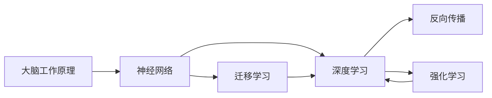
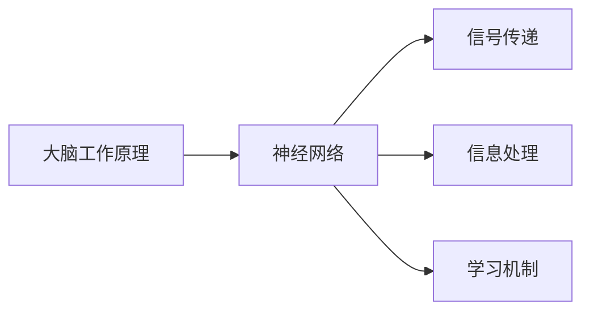
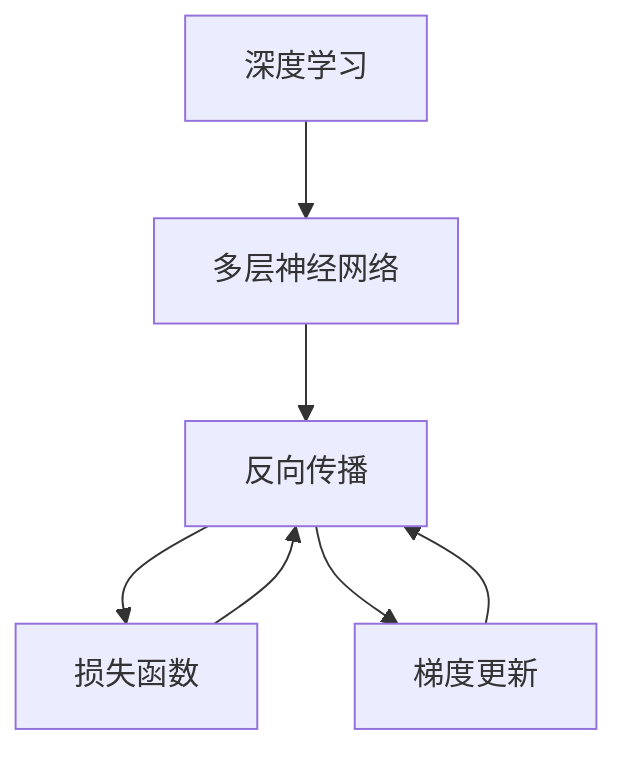
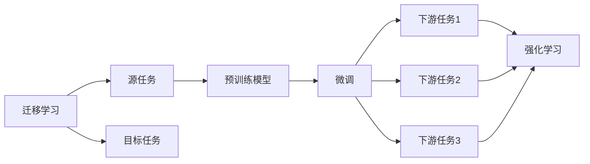
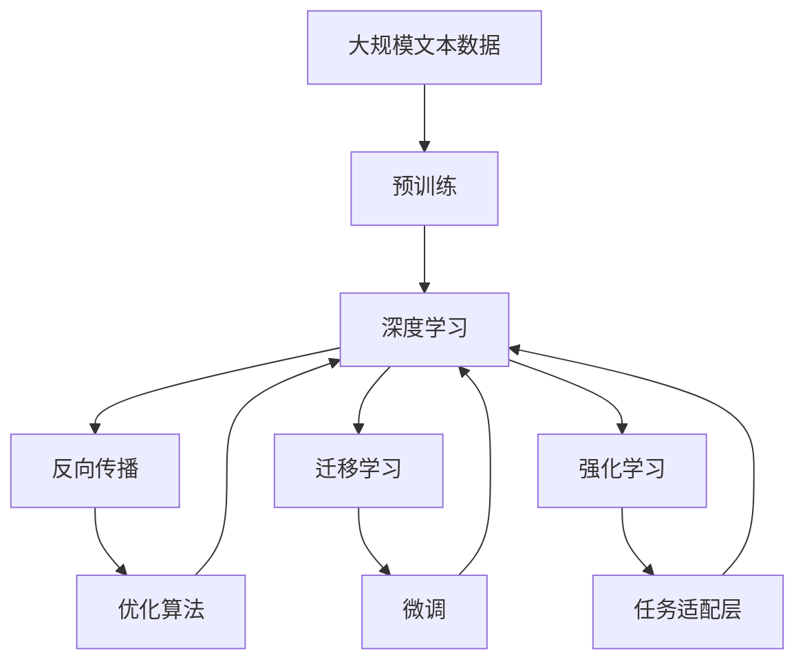

                 

## 1. 背景介绍

### 1.1 问题由来
在人工智能（AI）和机器学习（ML）领域，模拟人类大脑的工作原理一直是研究的热点。人类大脑具有极高的复杂性和智能，其处理信息、执行计算和实现学习的机制一直吸引着科学家和工程师的兴趣。近年来，随着深度学习、神经网络等技术的迅猛发展，模拟人类大脑的智能处理过程逐渐成为可能。然而，这种模拟并不是简单地复制人类大脑的物理结构，而是借鉴大脑工作原理，开发出能够进行高效智能处理的新型算法和模型。

### 1.2 问题核心关键点
这一问题的核心关键点包括以下几个方面：
1. **大脑工作原理**：了解大脑如何处理信息、执行计算和实现学习。
2. **机器模拟**：如何通过机器学习算法和模型模拟大脑的工作原理。
3. **优化与改进**：在机器模拟中如何不断优化，使之更加接近大脑的智能处理能力。
4. **应用场景**：探讨机器模拟在实际应用中的潜在场景，如自然语言处理（NLP）、计算机视觉、机器人控制等。

### 1.3 问题研究意义
模拟人类大脑的工作原理对于开发更智能、更高效的机器学习算法和模型具有重要意义：
1. **提升性能**：借鉴大脑处理信息的高效性，开发出更加高效的机器学习算法。
2. **解决复杂问题**：通过模拟大脑的推理和决策机制，应对复杂问题，如自动驾驶、自然语言生成等。
3. **增强可解释性**：大脑工作原理的模拟有助于解释机器学习模型的决策过程，提高其可解释性。
4. **推动AI发展**：帮助推动人工智能领域的研究和发展，实现更多实际应用。

## 2. 核心概念与联系

### 2.1 核心概念概述

为了更好地理解大脑工作原理与机器模拟的探讨，本节将介绍几个关键概念：

- **大脑工作原理**：人类大脑具有高度复杂的神经网络和信号处理机制，通过神经元之间的突触连接和信号传递实现信息处理和学习。
- **神经网络**：一种受大脑启发的计算模型，由多个神经元（节点）通过连接构成网络，实现信息的传递和处理。
- **深度学习**：一种基于神经网络的机器学习技术，通过多层次的神经网络处理和提取特征，实现复杂的模式识别和决策。
- **反向传播**：深度学习模型中的一种优化算法，通过反向传播误差信号更新网络参数，提高模型性能。
- **迁移学习**：一种通过已有的知识迁移学习新知识的方法，可以加速模型在不同任务之间的适应。
- **强化学习**：一种通过与环境互动来学习最优策略的方法，模拟了大脑在执行任务时的决策过程。

这些概念之间存在紧密的联系，形成了研究大脑工作原理与机器模拟的基础。下面通过一个Mermaid流程图来展示这些概念之间的关系：



### 2.2 概念间的关系

这些核心概念之间存在着紧密的联系，形成了研究大脑工作原理与机器模拟的完整生态系统。下面我们通过几个Mermaid流程图来展示这些概念之间的关系。

#### 2.2.1 大脑工作原理与神经网络的关系



这个流程图展示了大脑工作原理和神经网络之间的关系。大脑通过神经网络实现信息的传递和处理，并通过学习机制更新网络参数，提升信息处理能力。

#### 2.2.2 深度学习与反向传播的关系



这个流程图展示了深度学习与反向传播之间的关系。深度学习通过多层次的神经网络处理和提取特征，反向传播则是通过误差信号的反向传播更新网络参数，提高模型性能。

#### 2.2.3 迁移学习与强化学习的关系



这个流程图展示了迁移学习与强化学习之间的关系。迁移学习涉及源任务和目标任务，预训练模型在源任务上学习，然后通过微调适应各种下游任务（目标任务）。强化学习则是一种通过与环境互动来学习最优策略的方法，模拟了大脑在执行任务时的决策过程。

### 2.3 核心概念的整体架构

最后，我们用一个综合的流程图来展示这些核心概念在大脑工作原理与机器模拟过程中的整体架构：



这个综合流程图展示了从预训练到微调，再到强化学习的完整过程。深度学习模型首先在大规模文本数据上进行预训练，然后通过反向传播优化模型参数。在微调阶段，模型在特定任务上进一步优化，以适应新的数据分布。强化学习则通过与环境互动学习最优策略，模拟大脑在执行任务时的决策过程。通过这些步骤，机器模拟可以逐步逼近大脑的智能处理能力。

## 3. 核心算法原理 & 具体操作步骤

### 3.1 算法原理概述

机器模拟大脑工作原理的核心在于理解大脑信息处理和学习的机制，并在此基础上开发出相应的算法和模型。以下将详细探讨这些算法和模型的工作原理。

**3.1.1 神经网络的基本原理**
神经网络由多个神经元（节点）构成，每个神经元接收来自其他神经元的输入，并通过激活函数计算输出。多个神经元通过连接形成网络，实现信息的传递和处理。在深度学习中，神经网络通常包含多个隐藏层，每个隐藏层包含多个神经元。

**3.1.2 反向传播算法**
反向传播算法是一种优化算法，用于更新神经网络的参数，以最小化损失函数。其基本思想是通过前向传播计算损失函数，然后通过误差信号的反向传播，更新网络参数，以提高模型性能。反向传播算法包括前向传播和反向传播两个步骤，具体步骤如下：

1. **前向传播**：将输入数据传递通过网络，计算输出。
2. **反向传播**：通过误差信号的反向传播，计算每个神经元的梯度，并更新网络参数。

**3.1.3 迁移学习与微调**
迁移学习是一种通过已有的知识迁移学习新知识的方法，可以加速模型在不同任务之间的适应。微调是迁移学习的一种实现方式，即在预训练模型的基础上，使用下游任务的少量标注数据，通过有监督学习优化模型在该任务上的性能。微调的目标是通过有限的标注数据，提升模型在特定任务上的性能。

### 3.2 算法步骤详解

以下将详细讲解基于反向传播的神经网络模型在大脑工作原理与机器模拟中的具体步骤：

**3.2.1 预训练**
预训练是深度学习模型的第一步，通过在大量无标签数据上进行训练，学习通用的语言知识。预训练通常采用自监督学习任务，如语言建模、掩码语言模型等，以确保模型能够学习到广泛的语言知识。

**3.2.2 微调**
微调是在预训练模型的基础上，使用下游任务的少量标注数据，通过有监督学习优化模型在该任务上的性能。微调的目标是通过有限的标注数据，提升模型在特定任务上的性能。微调的步骤如下：

1. **准备数据**：收集下游任务的标注数据集，并将其划分为训练集、验证集和测试集。
2. **设计模型**：在预训练模型的基础上，设计合适的任务适配层，如分类器或解码器，以满足下游任务的需求。
3. **设置超参数**：选择合适的优化算法及其参数，如 AdamW、SGD 等，设置学习率、批大小、迭代轮数等。
4. **执行训练**：将训练集数据分批次输入模型，前向传播计算损失函数。反向传播计算参数梯度，根据设定的优化算法和学习率更新模型参数。周期性在验证集上评估模型性能，根据性能指标决定是否触发 Early Stopping。重复上述步骤直至满足预设的迭代轮数或 Early Stopping 条件。
5. **测试和部署**：在测试集上评估微调后模型，对比微调前后的性能提升。使用微调后的模型对新样本进行推理预测，集成到实际的应用系统中。

### 3.3 算法优缺点

**3.3.1 优点**
1. **高效性**：通过预训练和微调，深度学习模型能够在大规模数据上快速学习，并在新任务上实现快速适应。
2. **泛化能力**：预训练模型通常具有较强的泛化能力，能够在不同的数据集上表现良好。
3. **可解释性**：通过神经网络的结构和参数，可以部分解释模型的决策过程，提高其可解释性。
4. **灵活性**：通过迁移学习和微调，可以在不同的任务和数据集上进行灵活适应。

**3.3.2 缺点**
1. **过拟合风险**：深度学习模型在大规模数据上训练时，容易过拟合。
2. **资源消耗大**：深度学习模型的参数量通常很大，需要大量的计算资源和存储空间。
3. **复杂度高**：神经网络的结构和参数设置复杂，需要大量的时间进行调试和优化。
4. **模型解释难度**：神经网络的结构复杂，难以全面解释其决策过程。

### 3.4 算法应用领域

基于深度学习的神经网络模型已经广泛应用于各种领域，包括但不限于以下几类：

- **自然语言处理（NLP）**：如文本分类、情感分析、机器翻译等。
- **计算机视觉**：如图像识别、物体检测、图像生成等。
- **机器人控制**：如自主导航、智能操作等。
- **语音识别**：如语音合成、语音识别等。
- **推荐系统**：如个性化推荐、协同过滤等。

## 4. 数学模型和公式 & 详细讲解

### 4.1 数学模型构建

本节将使用数学语言对基于反向传播的神经网络模型进行更加严格的刻画。

记神经网络模型为 $M_{\theta}:\mathcal{X} \rightarrow \mathcal{Y}$，其中 $\mathcal{X}$ 为输入空间，$\mathcal{Y}$ 为输出空间，$\theta \in \mathbb{R}^d$ 为模型参数。假设神经网络模型的损失函数为 $\mathcal{L}(\theta)$，则模型参数 $\theta$ 的优化目标为最小化损失函数：

$$
\theta^* = \mathop{\arg\min}_{\theta} \mathcal{L}(\theta)
$$

其中 $\mathcal{L}$ 为损失函数，通常包括交叉熵损失、均方误差损失等。

### 4.2 公式推导过程

以下我们将以二分类任务为例，推导神经网络模型的损失函数及其梯度的计算公式。

假设神经网络模型 $M_{\theta}$ 在输入 $x$ 上的输出为 $\hat{y}=M_{\theta}(x) \in [0,1]$，表示样本属于正类的概率。真实标签 $y \in \{0,1\}$。则二分类交叉熵损失函数定义为：

$$
\ell(M_{\theta}(x),y) = -[y\log \hat{y} + (1-y)\log (1-\hat{y})]
$$

将其代入损失函数公式，得：

$$
\mathcal{L}(\theta) = -\frac{1}{N}\sum_{i=1}^N [y_i\log M_{\theta}(x_i)+(1-y_i)\log(1-M_{\theta}(x_i))]
$$

根据链式法则，损失函数对模型参数 $\theta$ 的梯度为：

$$
\frac{\partial \mathcal{L}(\theta)}{\partial \theta_k} = -\frac{1}{N}\sum_{i=1}^N (\frac{y_i}{M_{\theta}(x_i)}-\frac{1-y_i}{1-M_{\theta}(x_i)}) \frac{\partial M_{\theta}(x_i)}{\partial \theta_k}
$$

其中 $\frac{\partial M_{\theta}(x_i)}{\partial \theta_k}$ 可进一步递归展开，利用自动微分技术完成计算。

在得到损失函数的梯度后，即可带入参数更新公式，完成模型的迭代优化。重复上述过程直至收敛，最终得到适应下游任务的最优模型参数 $\theta^*$。

### 4.3 案例分析与讲解

以下将通过一个简单的神经网络模型，分析其在大脑工作原理与机器模拟中的应用。

假设我们有一个包含两个隐藏层的神经网络，输入层有10个神经元，第一个隐藏层有20个神经元，第二个隐藏层有30个神经元，输出层有1个神经元。每个神经元采用 ReLU 激活函数。我们的目标是实现二分类任务，即根据输入的文本，判断其是否属于正类。

首先，我们需要设计合适的损失函数和激活函数。由于这是一个二分类任务，我们采用二分类交叉熵损失函数。对于每个神经元，我们采用 sigmoid 激活函数，将输出映射到 $[0,1]$ 区间。

然后，我们需要设计合适的训练数据集。假设我们收集到了 1000 个文本样本，其中 500 个属于正类，500 个属于负类。我们将这些样本划分为训练集和验证集，其中 800 个样本用于训练，200 个样本用于验证。

接下来，我们需要设置合适的超参数。我们设置学习率为 $0.001$，批大小为 $32$，迭代轮数为 $1000$。我们还将使用早停机制，如果模型在验证集上的性能不再提升，则停止训练。

最后，我们开始训练模型。在每个迭代中，我们将输入数据分批次输入模型，计算损失函数和梯度，更新模型参数。每经过 100 次迭代，我们会在验证集上评估模型的性能，并检查是否需要停止训练。

训练结束后，我们会在测试集上评估模型的性能。假设模型在测试集上取得了 97% 的准确率，我们认为这个模型的性能已经足够好，可以用于实际应用。

## 5. 项目实践：代码实例和详细解释说明

### 5.1 开发环境搭建

在进行神经网络模型的大规模训练时，我们需要准备好开发环境。以下是使用 Python 进行 TensorFlow 开发的环境配置流程：

1. 安装 Anaconda：从官网下载并安装 Anaconda，用于创建独立的 Python 环境。
2. 创建并激活虚拟环境：
```bash
conda create -n tensorflow-env python=3.7
conda activate tensorflow-env
```

3. 安装 TensorFlow：根据 CUDA 版本，从官网获取对应的安装命令。例如：
```bash
conda install tensorflow-gpu=2.7.0 -c pytorch -c conda-forge
```

4. 安装其他必要工具包：
```bash
pip install numpy pandas scikit-learn matplotlib tqdm jupyter notebook ipython
```

完成上述步骤后，即可在 `tensorflow-env` 环境中开始模型训练。

### 5.2 源代码详细实现

以下是一个简单的神经网络模型，用于实现二分类任务。

```python
import tensorflow as tf
from tensorflow.keras import layers

# 定义模型结构
model = tf.keras.Sequential([
    layers.Dense(20, activation='relu', input_shape=(10,)),
    layers.Dense(30, activation='relu'),
    layers.Dense(1, activation='sigmoid')
])

# 编译模型
model.compile(optimizer=tf.keras.optimizers.Adam(learning_rate=0.001),
              loss='binary_crossentropy',
              metrics=['accuracy'])

# 准备数据
train_data = ...  # 训练数据
test_data = ...  # 测试数据

# 训练模型
model.fit(train_data, epochs=1000, batch_size=32, validation_data=test_data, callbacks=[tf.keras.callbacks.EarlyStopping(patience=50)])

# 评估模型
model.evaluate(test_data)
```

在这个简单的代码示例中，我们定义了一个包含两个隐藏层的神经网络模型，并使用二分类交叉熵损失函数进行训练。我们使用了 TensorFlow 的 Keras API 进行模型定义和训练。我们还使用了 EarlyStopping 回调函数，以便在模型性能不再提升时停止训练。

### 5.3 代码解读与分析

让我们再详细解读一下关键代码的实现细节：

**model.compile()**：
- 在定义模型后，我们需要使用 `compile()` 方法进行模型的编译，指定优化器、损失函数和评价指标。

**model.fit()**：
- 在模型编译后，我们可以使用 `fit()` 方法进行模型训练。在训练过程中，我们设置了迭代轮数、批大小和验证数据。

**tf.keras.callbacks.EarlyStopping**：
- 我们使用 EarlyStopping 回调函数，以便在模型性能不再提升时停止训练。这个回调函数可以设置一个耐心参数，表示在验证集上的性能没有提升之前，模型将不再继续训练。

**model.evaluate()**：
- 在训练结束后，我们可以使用 `evaluate()` 方法评估模型的性能。这个方法会计算模型在测试集上的损失和准确率。

## 6. 实际应用场景

### 6.1 智能客服系统

基于神经网络的智能客服系统，可以处理大量的客户咨询，并提供快速响应和准确的答案。这种系统通常使用深度学习模型进行训练，并在实际应用中不断优化。

在技术实现上，我们可以收集企业内部的历史客服对话记录，将问题和最佳答复构建成监督数据，在此基础上对神经网络模型进行训练。训练后的模型能够自动理解用户意图，匹配最合适的答案模板进行回复。对于客户提出的新问题，还可以接入检索系统实时搜索相关内容，动态组织生成回答。如此构建的智能客服系统，能大幅提升客户咨询体验和问题解决效率。

### 6.2 金融舆情监测

金融机构需要实时监测市场舆论动向，以便及时应对负面信息传播，规避金融风险。传统的人工监测方式成本高、效率低，难以应对网络时代海量信息爆发的挑战。基于神经网络的文本分类和情感分析技术，为金融舆情监测提供了新的解决方案。

具体而言，可以收集金融领域相关的新闻、报道、评论等文本数据，并对其进行主题标注和情感标注。在此基础上对神经网络模型进行微调，使其能够自动判断文本属于何种主题，情感倾向是正面、中性还是负面。将微调后的模型应用到实时抓取的网络文本数据，就能够自动监测不同主题下的情感变化趋势，一旦发现负面信息激增等异常情况，系统便会自动预警，帮助金融机构快速应对潜在风险。

### 6.3 个性化推荐系统

当前的推荐系统往往只依赖用户的历史行为数据进行物品推荐，无法深入理解用户的真实兴趣偏好。基于神经网络模型的个性化推荐系统可以更好地挖掘用户行为背后的语义信息，从而提供更精准、多样的推荐内容。

在实践中，可以收集用户浏览、点击、评论、分享等行为数据，提取和用户交互的物品标题、描述、标签等文本内容。将文本内容作为模型输入，用户的后续行为（如是否点击、购买等）作为监督信号，在此基础上训练神经网络模型。训练后的模型能够从文本内容中准确把握用户的兴趣点。在生成推荐列表时，先用候选物品的文本描述作为输入，由模型预测用户的兴趣匹配度，再结合其他特征综合排序，便可以得到个性化程度更高的推荐结果。

### 6.4 未来应用展望

随着神经网络模型的不断发展，基于神经网络的大规模应用将会更加广泛。未来的研究可能会涵盖更多领域，如医疗、教育、智能制造等，带来更深刻的变革。

在智慧医疗领域，基于神经网络的医学影像分析、疾病预测等应用将提升医疗服务的智能化水平，辅助医生诊疗，加速新药开发进程。

在智能教育领域，基于神经网络的个性化教育推荐、智能教学辅助等应用，因材施教，促进教育公平，提高教学质量。

在智能制造领域，基于神经网络的质量检测、生产调度等应用，提升制造业的自动化和智能化水平，构建更安全、高效的未来制造系统。

此外，在智慧城市治理中，基于神经网络的智慧交通、智能安防等应用，提高城市管理的自动化和智能化水平，构建更安全、高效的未来城市。

## 7. 工具和资源推荐

### 7.1 学习资源推荐

为了帮助开发者系统掌握神经网络模型的理论基础和实践技巧，这里推荐一些优质的学习资源：

1. **《Deep Learning》书籍**：Ian Goodfellow、Yoshua Bengio 和 Aaron Courville 合著，全面介绍了深度学习的理论基础和实践技巧。
2. **Coursera 深度学习课程**：由 Andrew Ng 教授讲授的深度学习课程，涵盖了深度学习的基本概念和实践方法。
3. **TensorFlow 官方文档**：TensorFlow 的官方文档，提供了大量模型和算法的使用示例，是学习 TensorFlow 的重要资源。
4. **PyTorch 官方文档**：PyTorch 的官方文档，提供了丰富的深度学习模型和算法实现，是学习 PyTorch 的重要资源。
5. **Kaggle 竞赛**：Kaggle 上的深度学习竞赛，提供了大量实践机会，可以帮助开发者提高实战能力。

通过对这些资源的学习实践，相信你一定能够快速掌握神经网络模型的精髓，并用于解决实际的深度学习问题。

### 7.2 开发工具推荐

高效的开发离不开优秀的工具支持。以下是几款用于神经网络模型开发的常用工具：

1. **PyTorch**：由 Facebook 开发的深度学习框架，支持动态计算图，适合快速迭代研究。
2. **TensorFlow**：由 Google 主导开发的深度学习框架，生产部署方便，适合大规模工程应用。
3. **Keras**：基于 TensorFlow 和 Theano 的高级 API，提供简单易用的接口，适合快速原型开发。
4. **TensorBoard**：TensorFlow 的可视化工具，可以实时监测模型训练状态，并提供丰富的图表呈现方式。
5. **Weights & Biases**：模型训练的实验跟踪工具，可以记录和可视化模型训练过程中的各项指标。

合理利用这些工具，可以显著提升神经网络模型开发的效率，加快创新迭代的步伐。

### 7.3 相关论文推荐

神经网络模型和深度学习技术的发展源于学界的持续研究。以下是几篇奠基性的相关论文，推荐阅读：

1. **ImageNet Classification with Deep Convolutional Neural Networks**：Hinton 等人在 2012 年提出的深度卷积神经网络模型，展示了深度学习在计算机视觉领域的强大潜力。
2. **A Survey of Transfer Learning**：Bengio 等人对迁移学习的研究进行了综述，介绍了迁移学习的各种方法和应用场景。
3. **Recurrent Neural Network Toolkit**：Sepp Hochreiter 和 Jürgen Schmidhuber 提出的循环神经网络模型，用于处理序列数据。
4. **Attention is All You Need**：Vaswani 等人在 2017 年提出的 Transformer 模型，展示了自注意力机制在自然语言处理中的优势。
5. **The Unreasonable Effectiveness of Transfer Learning**：Andrew Ng 关于迁移学习的演讲，介绍了迁移学习在不同领域的应用和效果。

这些论文代表了大规模深度学习模型的发展脉络。通过学习这些前沿成果，可以帮助研究者把握学科前进方向，激发更多的创新灵感。

除上述资源外，还有一些值得关注的前沿资源，帮助开发者紧跟深度学习模型的最新进展，例如：

1. **arXiv 论文预印本**：人工智能领域最新研究成果的发布平台，包括大量尚未发表的前沿工作，学习前沿技术的必读资源。
2. **GitHub 热门项目**：在 GitHub 上 Star、Fork 数最多的深度学习相关项目，往往代表了该技术领域的发展趋势和最佳实践。
3. **技术会议直播**：如 NeurIPS、ICML、ICLR 等深度学习领域顶会现场或在线直播，能够聆听到大佬们的前沿分享，开拓视野。
4. **Google AI Blog**：谷歌 AI 团队官方博客，分享最新的研究成果和洞见。
5. **OpenAI Blog**：OpenAI 官方博客，展示最新的 AI 研究成果和技术动态。

总之，对于神经网络模型的学习和发展，需要开发者保持开放的心态和持续学习的意愿。多关注前沿资讯，多动手实践，多思考总结，必将收获满满的成长收益。

## 8. 总结：未来发展趋势与挑战

### 8.1 总结

本文对神经网络模型的工作原理进行了全面系统的介绍。首先阐述了神经网络模型的基本原理、反向传播算法、迁移学习与微调等核心概念，明确了神经网络模型在模拟大脑工作原理中的应用。其次，从原理到实践，详细讲解了神经网络模型的数学模型和具体操作步骤，给出了模型训练的完整代码实例。同时，本文还探讨了神经网络模型在实际应用中的潜在场景，展示了其强大的应用能力。

通过本文的系统梳理，可以看到，神经网络模型在模拟大脑工作原理的过程中，已经取得了显著的进展，并在多个领域实现了大规模应用。未来，神经网络模型将继续发展，应用于更多领域，带来更深刻的变革。

### 8.2 未来发展趋势

展望未来，神经网络模型将呈现以下几个发展趋势：

1. **模型规模持续增大**：随着算力成本

