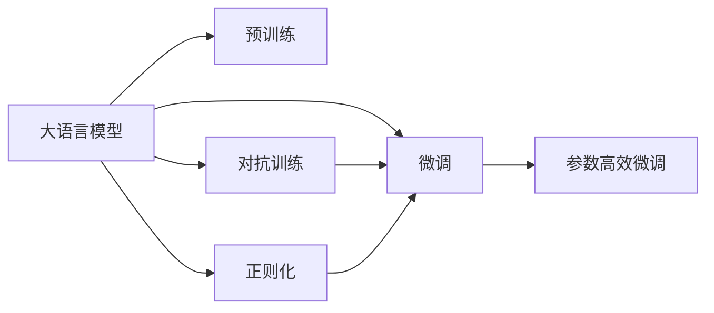
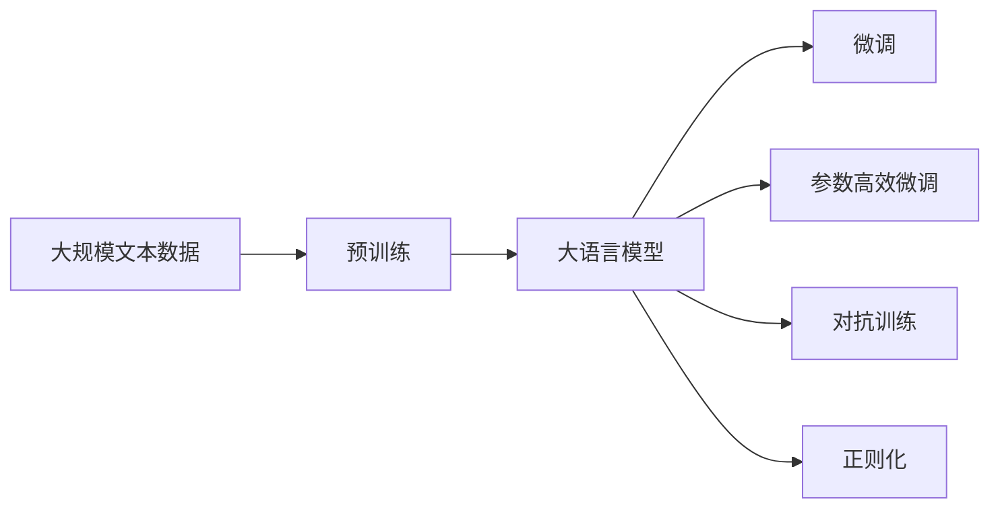
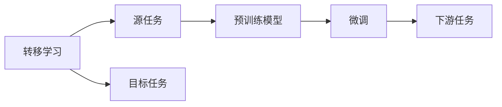
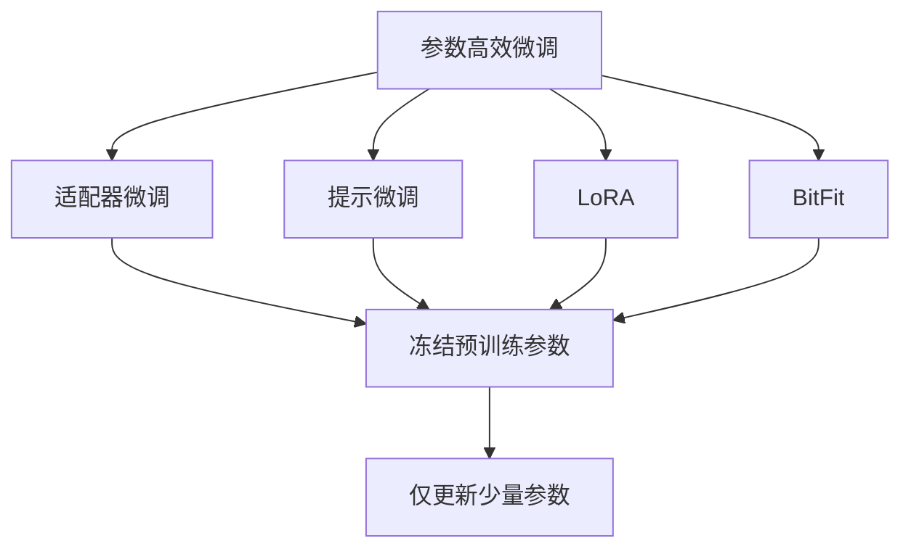
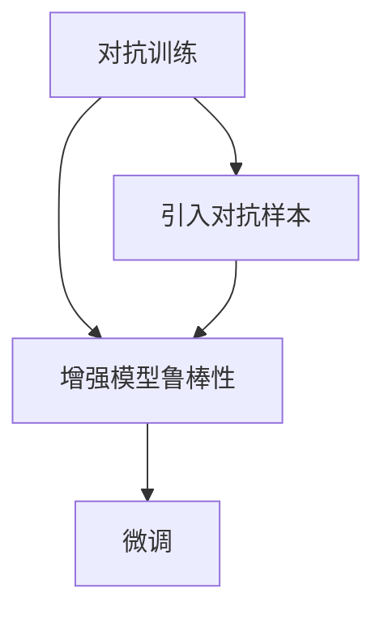
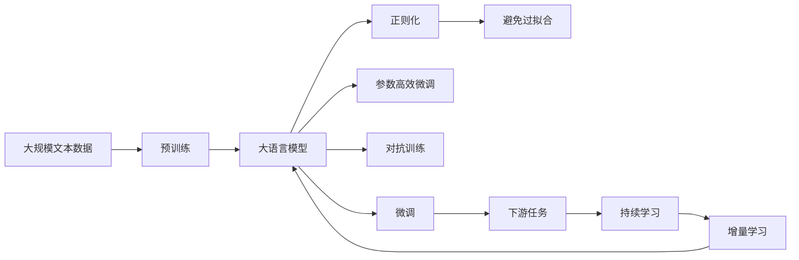

                 

# 大语言模型原理与工程实践：核心架构

> 关键词：大语言模型, 核心架构, 深度学习, 神经网络, 机器学习, 人工智能, 数据结构, 计算机视觉, 自然语言处理, 语音识别, 强化学习, 自动驾驶, 推荐系统

## 1. 背景介绍

### 1.1 问题由来

随着深度学习技术的飞速发展，大规模语言模型（Large Language Models, LLMs）在自然语言处理（NLP）领域取得了显著突破。这些模型通过在大量无标签文本数据上进行预训练，学习到了丰富的语言知识和常识，能够在各种自然语言理解、生成任务中表现优异。

然而，在实际应用中，通用预训练模型通常缺乏特定领域的深度理解和知识，这使得其在特定领域的表现不尽如人意。针对这一问题，研究者提出了微调（Fine-tuning）的概念，即在特定任务的数据集上对预训练模型进行有监督学习，以提升模型在该任务上的性能。

### 1.2 问题核心关键点

微调的核心在于如何平衡模型泛化能力和特定任务的适应性。理想情况下，微调后的模型应能够快速适应新的任务，同时保留预训练模型中对于语言理解的核心能力。微调的主要挑战在于以下几个方面：

- 模型容量控制：预训练模型通常包含大量参数，如何减少微调时的过拟合风险？
- 数据依赖问题：微调模型往往依赖于足够的标注数据，如何在数据稀缺的情况下取得良好效果？
- 模型泛化能力：如何使微调模型在新的、不同的数据上保持良好性能？
- 计算资源需求：大规模预训练模型对计算资源要求极高，如何在有限资源下进行高效微调？

### 1.3 问题研究意义

微调方法在NLP领域的应用，极大地降低了模型训练和调优的成本，提高了模型的性能和应用效率。其主要意义体现在以下几个方面：

- 模型适应性强：微调方法能够使通用模型快速适应特定领域，提升在实际任务中的表现。
- 数据利用率高：通过微调，模型可以高效利用少量的标注数据，最大化数据价值。
- 优化速度快：微调方法在预训练模型基础上进行优化，通常能够在较短时间内完成模型训练和调优。
- 应用前景广：微调方法在多个领域如智能客服、金融分析、健康医疗等都有广泛应用，为各行各业带来转型升级的机遇。

## 2. 核心概念与联系

### 2.1 核心概念概述

为了更好地理解微调方法，本节将介绍几个核心概念：

- 大语言模型（Large Language Models, LLMs）：以Transformer模型为代表，通过在大量文本数据上自监督预训练学习语言表示的模型。常见的模型包括BERT、GPT系列等。
- 预训练（Pre-training）：在大量无标签数据上对模型进行自监督学习，学习通用语言表示的过程。
- 微调（Fine-tuning）：在有标注数据上对预训练模型进行有监督学习，调整模型参数以适应特定任务的过程。
- 参数高效微调（Parameter-Efficient Fine-tuning, PEFT）：在微调过程中仅更新模型中的少量参数，保留大部分预训练权重不变的方法。
- 转移学习（Transfer Learning）：利用预训练模型对特定任务进行微调，以提高模型性能的技术。
- 对抗训练（Adversarial Training）：通过引入对抗样本增强模型鲁棒性，避免过拟合的技术。
- 正则化（Regularization）：如L2正则、Dropout等技术，防止模型过拟合的技术。

这些核心概念通过以下Mermaid流程图展示了它们之间的联系：



这个流程图展示了从预训练到大语言模型微调的核心步骤和相关技术。

### 2.2 概念间的关系

这些核心概念之间存在紧密的联系，形成了微调方法的完整生态系统。以下通过几个Mermaid流程图进一步展示它们之间的关系：

#### 2.2.1 大语言模型的学习范式



这个流程图展示了从预训练到微调，再到参数高效微调和正则化等技术的整体架构。

#### 2.2.2 转移学习与微调的关系



这个流程图展示了从预训练模型到下游任务的转移学习过程。

#### 2.2.3 参数高效微调方法



这个流程图展示了几种常见的参数高效微调方法。

#### 2.2.4 对抗训练在大语言模型中的应用



这个流程图展示了对抗训练如何通过引入对抗样本来增强模型的鲁棒性。

### 2.3 核心概念的整体架构

最后，我们用一个综合的流程图来展示这些核心概念在大语言模型微调过程中的整体架构：



这个综合流程图展示了从预训练到微调，再到对抗训练和持续学习的完整过程。

## 3. 核心算法原理 & 具体操作步骤
### 3.1 算法原理概述

基于监督学习的大语言模型微调方法，通过在特定任务的数据集上对预训练模型进行有监督学习，调整模型参数以适应特定任务。其核心思想是利用预训练模型作为初始化权重，在少量标注数据上进行微调，以优化模型在该任务上的性能。

微调过程可以通过以下步骤进行：

1. 准备预训练模型和数据集。
2. 添加任务适配层，设计损失函数。
3. 设置微调超参数。
4. 执行梯度训练，更新模型参数。
5. 测试和部署微调后的模型。

### 3.2 算法步骤详解

以下是基于监督学习的大语言模型微调的详细步骤：

**Step 1: 准备预训练模型和数据集**
- 选择合适的预训练语言模型 $M_{\theta}$ 作为初始化参数，如 BERT、GPT 等。
- 准备下游任务 $T$ 的标注数据集 $D$，划分为训练集、验证集和测试集。一般要求标注数据与预训练数据的分布不要差异过大。

**Step 2: 添加任务适配层**
- 根据任务类型，在预训练模型顶层设计合适的输出层和损失函数。
- 对于分类任务，通常在顶层添加线性分类器和交叉熵损失函数。
- 对于生成任务，通常使用语言模型的解码器输出概率分布，并以负对数似然为损失函数。

**Step 3: 设置微调超参数**
- 选择合适的优化算法及其参数，如 AdamW、SGD 等，设置学习率、批大小、迭代轮数等。
- 设置正则化技术及强度，包括权重衰减、Dropout、Early Stopping 等。
- 确定冻结预训练参数的策略，如仅微调顶层，或全部参数都参与微调。

**Step 4: 执行梯度训练**
- 将训练集数据分批次输入模型，前向传播计算损失函数。
- 反向传播计算参数梯度，根据设定的优化算法和学习率更新模型参数。
- 周期性在验证集上评估模型性能，根据性能指标决定是否触发 Early Stopping。
- 重复上述步骤直到满足预设的迭代轮数或 Early Stopping 条件。

**Step 5: 测试和部署**
- 在测试集上评估微调后模型 $M_{\hat{\theta}}$ 的性能，对比微调前后的精度提升。
- 使用微调后的模型对新样本进行推理预测，集成到实际的应用系统中。
- 持续收集新的数据，定期重新微调模型，以适应数据分布的变化。

### 3.3 算法优缺点

基于监督学习的大语言模型微调方法具有以下优点：
1. 简单高效。只需准备少量标注数据，即可对预训练模型进行快速适配，获得较大的性能提升。
2. 通用适用。适用于各种NLP下游任务，包括分类、匹配、生成等，设计简单的任务适配层即可实现微调。
3. 参数高效。利用参数高效微调技术，在固定大部分预训练参数的情况下，仍可取得不错的提升。
4. 效果显著。在学术界和工业界的诸多任务上，基于微调的方法已经刷新了最先进的性能指标。

同时，该方法也存在一定的局限性：
1. 依赖标注数据。微调的效果很大程度上取决于标注数据的质量和数量，获取高质量标注数据的成本较高。
2. 迁移能力有限。当目标任务与预训练数据的分布差异较大时，微调的性能提升有限。
3. 负面效果传递。预训练模型的固有偏见、有害信息等，可能通过微调传递到下游任务，造成负面影响。
4. 可解释性不足。微调模型的决策过程通常缺乏可解释性，难以对其推理逻辑进行分析和调试。

尽管存在这些局限性，但就目前而言，基于监督学习的微调方法仍是大语言模型应用的最主流范式。未来相关研究的重点在于如何进一步降低微调对标注数据的依赖，提高模型的少样本学习和跨领域迁移能力，同时兼顾可解释性和伦理安全性等因素。

### 3.4 算法应用领域

基于大语言模型微调的监督学习方法，在NLP领域已经得到了广泛的应用，覆盖了几乎所有常见任务，例如：

- 文本分类：如情感分析、主题分类、意图识别等。通过微调使模型学习文本-标签映射。
- 命名实体识别：识别文本中的人名、地名、机构名等特定实体。通过微调使模型掌握实体边界和类型。
- 关系抽取：从文本中抽取实体之间的语义关系。通过微调使模型学习实体-关系三元组。
- 问答系统：对自然语言问题给出答案。将问题-答案对作为微调数据，训练模型学习匹配答案。
- 机器翻译：将源语言文本翻译成目标语言。通过微调使模型学习语言-语言映射。
- 文本摘要：将长文本压缩成简短摘要。将文章-摘要对作为微调数据，使模型学习抓取要点。
- 对话系统：使机器能够与人自然对话。将多轮对话历史作为上下文，微调模型进行回复生成。

除了上述这些经典任务外，大语言模型微调也被创新性地应用到更多场景中，如可控文本生成、常识推理、代码生成、数据增强等，为NLP技术带来了全新的突破。随着预训练模型和微调方法的不断进步，相信NLP技术将在更广阔的应用领域大放异彩。

## 4. 数学模型和公式 & 详细讲解 & 举例说明
### 4.1 数学模型构建

本节将使用数学语言对基于监督学习的大语言模型微调过程进行更加严格的刻画。

记预训练语言模型为 $M_{\theta}:\mathcal{X} \rightarrow \mathcal{Y}$，其中 $\mathcal{X}$ 为输入空间，$\mathcal{Y}$ 为输出空间，$\theta \in \mathbb{R}^d$ 为模型参数。假设微调任务的训练集为 $D=\{(x_i,y_i)\}_{i=1}^N, x_i \in \mathcal{X}, y_i \in \mathcal{Y}$。

定义模型 $M_{\theta}$ 在数据样本 $(x,y)$ 上的损失函数为 $\ell(M_{\theta}(x),y)$，则在数据集 $D$ 上的经验风险为：

$$
\mathcal{L}(\theta) = \frac{1}{N} \sum_{i=1}^N \ell(M_{\theta}(x_i),y_i)
$$

微调的优化目标是最小化经验风险，即找到最优参数：

$$
\theta^* = \mathop{\arg\min}_{\theta} \mathcal{L}(\theta)
$$

在实践中，我们通常使用基于梯度的优化算法（如SGD、Adam等）来近似求解上述最优化问题。设 $\eta$ 为学习率，$\lambda$ 为正则化系数，则参数的更新公式为：

$$
\theta \leftarrow \theta - \eta \nabla_{\theta}\mathcal{L}(\theta) - \eta\lambda\theta
$$

其中 $\nabla_{\theta}\mathcal{L}(\theta)$ 为损失函数对参数 $\theta$ 的梯度，可通过反向传播算法高效计算。

### 4.2 公式推导过程

以下我们以二分类任务为例，推导交叉熵损失函数及其梯度的计算公式。

假设模型 $M_{\theta}$ 在输入 $x$ 上的输出为 $\hat{y}=M_{\theta}(x) \in [0,1]$，表示样本属于正类的概率。真实标签 $y \in \{0,1\}$。则二分类交叉熵损失函数定义为：

$$
\ell(M_{\theta}(x),y) = -[y\log \hat{y} + (1-y)\log (1-\hat{y})]
$$

将其代入经验风险公式，得：

$$
\mathcal{L}(\theta) = -\frac{1}{N}\sum_{i=1}^N [y_i\log M_{\theta}(x_i)+(1-y_i)\log(1-M_{\theta}(x_i))]
$$

根据链式法则，损失函数对参数 $\theta_k$ 的梯度为：

$$
\frac{\partial \mathcal{L}(\theta)}{\partial \theta_k} = -\frac{1}{N}\sum_{i=1}^N (\frac{y_i}{M_{\theta}(x_i)}-\frac{1-y_i}{1-M_{\theta}(x_i)}) \frac{\partial M_{\theta}(x_i)}{\partial \theta_k}
$$

其中 $\frac{\partial M_{\theta}(x_i)}{\partial \theta_k}$ 可进一步递归展开，利用自动微分技术完成计算。

在得到损失函数的梯度后，即可带入参数更新公式，完成模型的迭代优化。重复上述过程直至收敛，最终得到适应下游任务的最优模型参数 $\theta^*$。

### 4.3 案例分析与讲解

在二分类任务中，假设模型输出为 $\hat{y}=M_{\theta}(x)$，真实标签为 $y$，则交叉熵损失函数为：

$$
\mathcal{L}(\theta) = -\frac{1}{N} \sum_{i=1}^N \left[y_i \log \hat{y}_i + (1-y_i) \log (1-\hat{y}_i)\right]
$$

模型的预测结果 $\hat{y}_i$ 和真实标签 $y_i$ 之间的差异被量化为交叉熵，这个损失函数在模型输出与真实标签接近时趋近于0，反之则增大。

在训练过程中，我们通过反向传播算法计算损失函数 $\mathcal{L}(\theta)$ 对模型参数 $\theta$ 的梯度 $\nabla_{\theta}\mathcal{L}(\theta)$，然后更新模型参数，使模型输出 $\hat{y}_i$ 更加接近真实标签 $y_i$。

以下是一个简单的例子，说明如何利用PyTorch实现二分类任务的微调：

```python
import torch
import torch.nn as nn
import torch.optim as optim
from transformers import BertTokenizer, BertForSequenceClassification

# 初始化模型和优化器
model = BertForSequenceClassification.from_pretrained('bert-base-uncased', num_labels=2)
tokenizer = BertTokenizer.from_pretrained('bert-base-uncased')
optimizer = optim.Adam(model.parameters(), lr=2e-5)

# 定义交叉熵损失函数
criterion = nn.CrossEntropyLoss()

# 数据集准备
train_data = [("This is a positive sentence.", 1), ("This is a negative sentence.", 0)]
train_labels = [label for text, label in train_data]

# 定义训练函数
def train_epoch(model, data_loader, optimizer, criterion):
    model.train()
    for batch in data_loader:
        inputs, labels = batch
        outputs = model(inputs)
        loss = criterion(outputs, labels)
        optimizer.zero_grad()
        loss.backward()
        optimizer.step()

# 训练过程
for epoch in range(10):
    train_epoch(model, train_data, optimizer, criterion)

# 测试模型
test_data = [("This is a positive sentence.", 1), ("This is a negative sentence.", 0)]
test_labels = [label for text, label in test_data]
test_outputs = model(test_data)
test_loss = criterion(test_outputs, test_labels)
print(f"Test Loss: {test_loss.item()}")
```

在这个例子中，我们使用了BERT模型进行二分类任务的微调。首先，我们初始化了模型和优化器，并定义了交叉熵损失函数。然后，我们准备了一个简单的训练数据集，并通过训练函数进行模型训练。最后，我们测试了模型在测试集上的性能。

## 5. 项目实践：代码实例和详细解释说明
### 5.1 开发环境搭建

在进行微调实践前，我们需要准备好开发环境。以下是使用Python进行PyTorch开发的环境配置流程：

1. 安装Anaconda：从官网下载并安装Anaconda，用于创建独立的Python环境。

2. 创建并激活虚拟环境：
```bash
conda create -n pytorch-env python=3.8 
conda activate pytorch-env
```

3. 安装PyTorch：根据CUDA版本，从官网获取对应的安装命令。例如：
```bash
conda install pytorch torchvision torchaudio cudatoolkit=11.1 -c pytorch -c conda-forge
```

4. 安装Transformers库：
```bash
pip install transformers
```

5. 安装各类工具包：
```bash
pip install numpy pandas scikit-learn matplotlib tqdm jupyter notebook ipython
```

完成上述步骤后，即可在`pytorch-env`环境中开始微调实践。

### 5.2 源代码详细实现

下面我们以命名实体识别(NER)任务为例，给出使用Transformers库对BERT模型进行微调的PyTorch代码实现。

首先，定义NER任务的数据处理函数：

```python
from transformers import BertTokenizer
from torch.utils.data import Dataset
import torch

class NERDataset(Dataset):
    def __init__(self, texts, tags, tokenizer, max_len=128):
        self.texts = texts
        self.tags = tags
        self.tokenizer = tokenizer
        self.max_len = max_len
        
    def __len__(self):
        return len(self.texts)
    
    def __getitem__(self, item):
        text = self.texts[item]
        tags = self.tags[item]
        
        encoding = self.tokenizer(text, return_tensors='pt', max_length=self.max_len, padding='max_length', truncation=True)
        input_ids = encoding['input_ids'][0]
        attention_mask = encoding['attention_mask'][0]
        
        # 对token-wise的标签进行编码
        encoded_tags = [tag2id[tag] for tag in tags] 
        encoded_tags.extend([tag2id['O']] * (self.max_len - len(encoded_tags)))
        labels = torch.tensor(encoded_tags, dtype=torch.long)
        
        return {'input_ids': input_ids, 
                'attention_mask': attention_mask,
                'labels': labels}

# 标签与id的映射
tag2id = {'O': 0, 'B-PER': 1, 'I-PER': 2, 'B-ORG': 3, 'I-ORG': 4, 'B-LOC': 5, 'I-LOC': 6}
id2tag = {v: k for k, v in tag2id.items()}

# 创建dataset
tokenizer = BertTokenizer.from_pretrained('bert-base-cased')

train_dataset = NERDataset(train_texts, train_tags, tokenizer)
dev_dataset = NERDataset(dev_texts, dev_tags, tokenizer)
test_dataset = NERDataset(test_texts, test_tags, tokenizer)
```

然后，定义模型和优化器：

```python
from transformers import BertForTokenClassification, AdamW

model = BertForTokenClassification.from_pretrained('bert-base-cased', num_labels=len(tag2id))

optimizer = AdamW(model.parameters(), lr=2e-5)
```

接着，定义训练和评估函数：

```python
from torch.utils.data import DataLoader
from tqdm import tqdm
from sklearn.metrics import classification_report

device = torch.device('cuda') if torch.cuda.is_available() else torch.device('cpu')
model.to(device)

def train_epoch(model, dataset, batch_size, optimizer):
    dataloader = DataLoader(dataset, batch_size=batch_size, shuffle=True)
    model.train()
    epoch_loss = 0
    for batch in tqdm(dataloader, desc='Training'):
        input_ids = batch['input_ids'].to(device)
        attention_mask = batch['attention_mask'].to(device)
        labels = batch['labels'].to(device)
        model.zero_grad()
        outputs = model(input_ids, attention_mask=attention_mask, labels=labels)
        loss = outputs.loss
        epoch_loss += loss.item()
        loss.backward()
        optimizer.step()
    return epoch_loss / len(dataloader)

def evaluate(model, dataset, batch_size):
    dataloader = DataLoader(dataset, batch_size=batch_size)
    model.eval()
    preds, labels = [], []
    with torch.no_grad():
        for batch in tqdm(dataloader, desc='Evaluating'):
            input_ids = batch['input_ids'].to(device)
            attention_mask = batch['attention_mask'].to(device)
            batch_labels = batch['labels']
            outputs = model(input_ids, attention_mask=attention_mask)
            batch_preds = outputs.logits.argmax(dim=2).to('cpu').tolist()
            batch_labels = batch_labels.to('cpu').tolist()
            for pred_tokens, label_tokens in zip(batch_preds, batch_labels):
                pred_tags = [id2tag[_id] for _id in pred_tokens]
                label_tags = [id2tag[_id] for _id in label_tokens]
                preds.append(pred_tags[:len(label_tags)])
                labels.append(label_tags)
                
    print(classification_report(labels, preds))
```

最后，启动训练流程并在测试集上评估：

```python
epochs = 5
batch_size = 16

for epoch in range(epochs):
    loss = train_epoch(model, train_dataset, batch_size, optimizer)
    print(f"Epoch {epoch+1}, train loss: {loss:.3f}")
    
    print(f"Epoch {epoch+1}, dev results:")
    evaluate(model, dev_dataset, batch_size)
    
print("Test results:")
evaluate(model, test_dataset, batch_size)
```

以上就是使用PyTorch对BERT进行命名实体识别任务微调的完整代码实现。可以看到，得益于Transformers库的强大封装，我们可以用相对简洁的代码完成BERT模型的加载和微调。

### 5.3 代码解读与分析

让我们再详细解读一下关键代码的实现细节：

**NERDataset类**：
- `__init__`方法：初始化文本、标签、分词器等关键组件。
- `__len__`方法：返回数据集的样本数量。
- `__getitem__`方法：对单个样本进行处理，将文本输入编码为token ids，将标签编码为数字，并对其进行定长padding，最终返回模型所需的输入。

**tag2id和id2tag字典**：
- 定义了标签与数字id之间的映射关系，用于将token-wise的预测结果解码回真实的标签。

**训练和评估函数**：
- 使用PyTorch的DataLoader对数据集进行批次化加载，供模型训练和推理使用。
- 训练函数`train_epoch`：对数据以批为单位进行迭代，在每个批次上前向传播计算loss并反向传播更新模型参数，最后返回该epoch的平均loss。
- 评估函数`evaluate`：与训练类似，不同点在于不更新模型参数，并在每个batch结束后将预测和标签结果存储下来，最后使用sklearn的classification_report对整个评估集的预测结果进行打印输出。

**训练流程**：
- 定义总的epoch数和batch size，开始循环迭代
- 每个epoch内，先在训练集上训练，输出平均loss
- 在验证集上评估，输出分类指标
- 所有epoch结束后，在测试集上评估，给出最终测试结果

可以看到，PyTorch

