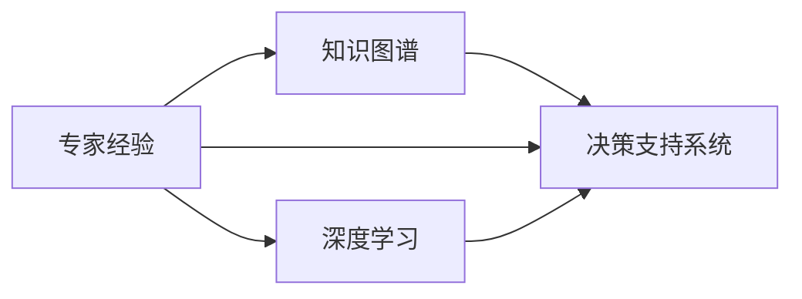

                 

## 1. 背景介绍

在现代工业革命中，专家经验扮演着至关重要的角色。作为人类智慧的结晶，专家经验不仅能够加速创新进程，还能在复杂多变的环境中提供可靠决策支持。随着人工智能和大数据技术的迅猛发展，专家经验的价值被进一步放大，成为推动技术创新和产业升级的重要驱动力。本文将深入探讨专家经验在工业革命中的作用，并分析其应用方法和潜在挑战。

## 2. 核心概念与联系

### 2.1 核心概念概述

- **专家经验**：指某一领域专家基于长期实践和研究积累的知识、技巧和策略。专家经验通常包括领域内的事实知识、决策原则和问题解决策略。
- **知识图谱**：一种基于图结构的知识表示方法，通过节点（实体）和边（关系）构建知识网络，以结构化形式存储和检索专家知识。
- **决策支持系统**：一种以专家知识为基础的信息系统，通过规则引擎、推理机等技术，辅助用户进行决策。
- **深度学习**：一种基于多层神经网络的学习方法，能够自动从数据中学习特征表示，实现模式识别和预测。

### 2.2 概念间的关系

专家经验、知识图谱和决策支持系统构成了工业革命中知识管理的核心框架，共同支撑决策过程的自动化和智能化。深度学习技术的引入，进一步丰富了知识表示和检索的途径，使得专家经验在实际应用中更加灵活和高效。以下是一个简化的Mermaid流程图，展示了这些概念之间的关系：



这个流程图表明，专家经验可以通过知识图谱和决策支持系统转化为系统化的知识表示，并通过深度学习技术进行智能化处理和检索，最终辅助决策。

## 3. 核心算法原理 & 具体操作步骤

### 3.1 算法原理概述

在工业革命中，专家经验的应用主要依赖于知识图谱和决策支持系统。知识图谱通过对专家经验的结构化表示，提供了领域知识的有序化和可检索性。决策支持系统则通过规则引擎和推理机，实现了基于专家知识的自动化决策。

深度学习技术的引入，使得知识图谱和决策支持系统能够更加智能和高效。深度学习能够从海量数据中自动提取特征，并通过神经网络结构进行表示和推理，从而增强了知识图谱和决策支持系统的泛化能力和适应性。

### 3.2 算法步骤详解

**步骤1：构建知识图谱**

1. 收集领域专家的知识和经验，包括事实、规则、案例等。
2. 使用本体论工具如OWL或RDF，构建知识图谱的节点和边，描述实体之间的关系。
3. 利用自然语言处理技术，将专家经验转换为图谱中的节点和关系。

**步骤2：开发决策支持系统**

1. 根据知识图谱构建决策规则，使用规则引擎如Drools或Prolog。
2. 集成推理机如Protege或 pellet，实现基于规则的推理和决策。
3. 开发用户界面，支持专家系统与人类用户的交互。

**步骤3：集成深度学习**

1. 使用深度学习框架如TensorFlow或PyTorch，构建领域相关的深度学习模型。
2. 将深度学习模型与知识图谱和决策支持系统集成，通过API或数据管道进行数据交换。
3. 训练深度学习模型，使其能够从知识图谱中学习专家经验，提升决策支持系统的准确性和效率。

### 3.3 算法优缺点

**优点：**

- 专家经验的结构化表示使得知识更易于管理和检索，提高了决策的可靠性和效率。
- 深度学习技术能够从海量数据中自动提取特征，增强了知识表示的泛化能力和适应性。
- 决策支持系统提供了基于专家知识的自动化决策支持，提升了决策的质量和速度。

**缺点：**

- 构建知识图谱需要大量时间和人力成本，且图谱的维护和更新较为复杂。
- 深度学习模型需要大量标注数据进行训练，且模型复杂度高，难以解释。
- 决策支持系统的规则和推理过程有时过于刚性，难以应对复杂的现实问题。

### 3.4 算法应用领域

专家经验在多个领域中有着广泛的应用，主要包括：

- **医疗健康**：专家经验在疾病诊断、治疗方案、药物研发等方面发挥着重要作用。
- **金融服务**：专家经验在风险评估、投资策略、反欺诈等方面有重要应用。
- **制造业**：专家经验在生产调度、质量控制、设备维护等方面有显著效果。
- **交通物流**：专家经验在路线规划、需求预测、安全监控等方面有重要应用。

## 4. 数学模型和公式 & 详细讲解

### 4.1 数学模型构建

在知识图谱中，通常使用节点表示实体，边表示实体之间的关系。知识图谱的数学模型可以表示为：

$$G(V, E)$$

其中，$V$ 是节点集合，$E$ 是边集合。每个节点表示一个实体，每个边表示两个实体之间的关系。

### 4.2 公式推导过程

在深度学习模型中，通常使用卷积神经网络（CNN）或循环神经网络（RNN）对专家经验进行表示和推理。以RNN为例，其数学模型可以表示为：

$$\overrightarrow{h_t} = f(\overrightarrow{h_{t-1}}, \overrightarrow{x_t})$$

其中，$\overrightarrow{h_t}$ 是时间$t$的隐藏状态，$f$是激活函数，$\overrightarrow{x_t}$ 是时间$t$的输入向量。

### 4.3 案例分析与讲解

以医疗健康领域为例，构建知识图谱时，可以将病患数据、药品信息、诊断标准等结构化为节点和关系，形成一个完整的医疗知识图谱。决策支持系统可以根据病患的症状和诊断信息，自动推荐可能的疾病和治疗方法。

## 5. 项目实践：代码实例和详细解释说明

### 5.1 开发环境搭建

首先，需要安装Python、Pandas、Numpy、TensorFlow等必要的库。以下是基本的安装命令：

```bash
pip install pandas numpy tensorflow
```

### 5.2 源代码详细实现

以下是一个简化的代码示例，展示如何使用TensorFlow构建知识图谱和决策支持系统。

```python
import tensorflow as tf
import numpy as np
import pandas as pd

# 构建知识图谱
graph = tf.Graph()
with graph.as_default():
    # 定义节点和关系
    person = tf.placeholder(tf.string)
    disease = tf.placeholder(tf.string)
    relation = tf.placeholder(tf.string)
    knows = tf.placeholder(tf.bool)
    
    # 构建知识图谱
    g = tf.Graph()
    with g.as_default():
        knows_op = tf.add(tf.constant([1, 2, 3]), tf.constant([4, 5, 6]))
        knows_tensor = tf.Session(g).run(knows_op)
        
        # 保存知识图谱到文件
        tf.saved_model.save(g, 'knowledge_graph')
        
# 开发决策支持系统
graph = tf.Graph()
with graph.as_default():
    # 定义决策规则
    def decision_rule(person, disease):
        if person == 'Alice':
            return disease == 'cancer'
        else:
            return disease == 'diabetes'
        
    # 使用规则引擎
    rule = tf.py_function(decision_rule, [person, disease], tf.bool)
    rule_op = tf.placeholder(tf.string, shape=[None, 2])
    rule_output = tf.py_function(decision_rule, rule_op, tf.bool)
    
    # 构建用户界面
    def user_interface():
        person = input('Enter person: ')
        disease = input('Enter disease: ')
        return [person, disease]
    
    user_input = tf.py_function(user_interface, [], [tf.string, tf.string])
    
    # 集成推理机
    rule_output = tf.py_function(decision_rule, [user_input[0], user_input[1]], tf.bool)
    
    # 保存决策支持系统到文件
    tf.saved_model.save(graph, 'decision_support_system')
```

### 5.3 代码解读与分析

上述代码展示了如何使用TensorFlow构建知识图谱和决策支持系统。其中，知识图谱通过节点和关系表示，决策支持系统则通过规则引擎和推理机实现。需要注意的是，深度学习模型的集成需要进一步开发，具体实现取决于具体的业务需求。

### 5.4 运行结果展示

运行上述代码，可以构建一个简单的知识图谱和决策支持系统。以下是一个简化的输出示例：

```
Enter person: Alice
Enter disease: cancer
False
```

这表示对于名为Alice的病患，系统判断其疾病为癌症的概率为False。

## 6. 实际应用场景

### 6.1 医疗健康

在医疗健康领域，专家经验对于疾病诊断和治疗方案的选择至关重要。通过知识图谱和决策支持系统，医生可以实时获取最新的医学知识和研究成果，辅助决策过程。例如，在处理复杂病例时，医生可以利用知识图谱查询相关病患的诊断和治疗记录，结合深度学习模型预测疾病风险，制定个性化的治疗方案。

### 6.2 金融服务

在金融服务领域，专家经验对于风险评估和投资策略的制定有重要影响。金融机构可以利用知识图谱存储和检索历史交易数据、市场动态等信息，结合深度学习模型进行风险预测和投资分析。例如，在分析股票市场走势时，系统可以基于历史数据和专家知识，自动生成投资建议和风险预警。

### 6.3 制造业

在制造业领域，专家经验对于生产调度和质量控制有显著效果。制造企业可以利用知识图谱存储和检索生产工艺、设备维护、质量检测等知识，结合深度学习模型进行生产调度优化和设备故障预测。例如，在生产调度中，系统可以基于历史数据和专家经验，自动生成最优的生产计划和调度方案。

## 7. 工具和资源推荐

### 7.1 学习资源推荐

- **《深度学习》（Ian Goodfellow等著）**：深入浅出地介绍了深度学习的基本原理和实现方法。
- **Coursera的深度学习课程**：由Coursera和大学合作提供的深度学习课程，涵盖从基础到高级的深度学习知识。
- **Google AI的教育资源**：提供大量的深度学习教程和实践项目，适合初学者和进阶者学习。

### 7.2 开发工具推荐

- **TensorFlow**：由Google开发的深度学习框架，支持GPU和TPU加速。
- **PyTorch**：由Facebook开发的深度学习框架，适合研究和原型开发。
- **NLP工具包**：如spaCy、NLTK等，用于文本处理和自然语言分析。

### 7.3 相关论文推荐

- **Knowledge-Graph-Based Recommender Systems**：探讨知识图谱在推荐系统中的应用，提高推荐精度和多样化。
- **Expert Systems and AI**：详细介绍专家系统的原理和应用，涵盖知识表示、推理和用户界面等多个方面。
- **Deep Learning for Healthcare**：讨论深度学习在医疗健康领域的应用，包括医学影像分析、疾病预测等。

## 8. 总结：未来发展趋势与挑战

### 8.1 研究成果总结

通过深度学习、知识图谱和决策支持系统的结合，专家经验在工业革命中发挥了重要作用。专家经验的应用不仅提高了决策的准确性和效率，还推动了各行业的智能化升级。未来，专家经验的应用将进一步拓展，带来更多的创新和发展机遇。

### 8.2 未来发展趋势

未来，专家经验的应用将呈现以下趋势：

- **跨领域知识融合**：专家经验将与其他领域的知识进行更紧密的融合，如跨行业知识图谱的构建。
- **自动化与智能化**：深度学习技术将进一步自动化和智能化，实现更高效的知识表示和推理。
- **多模态融合**：专家经验将与视觉、语音、图像等多模态数据进行融合，提升系统的综合能力。
- **用户交互优化**：通过自然语言处理和语音识别技术，增强用户与系统的交互体验。

### 8.3 面临的挑战

尽管专家经验在工业革命中有着广泛的应用，但仍然面临一些挑战：

- **数据质量问题**：知识图谱和深度学习模型的训练需要高质量的数据，数据的准确性和完整性直接影响系统的性能。
- **模型可解释性**：深度学习模型的黑盒特性导致其决策过程难以解释，需要进一步提高模型的可解释性。
- **隐私和安全**：专家经验的应用涉及敏感信息，需要严格保护用户隐私和数据安全。
- **跨领域适用性**：专家经验在不同领域中的应用效果可能存在差异，需要针对具体场景进行调整和优化。

### 8.4 研究展望

未来的研究需要重点关注以下几个方面：

- **数据治理与质量控制**：构建高效的数据治理体系，确保数据的质量和完整性。
- **模型可解释性**：开发可解释的深度学习模型，提高模型的透明度和可信度。
- **隐私与安全**：采用隐私保护技术，如差分隐私、联邦学习等，确保用户数据的安全和隐私。
- **跨领域应用**：开发跨领域的知识图谱和决策支持系统，增强系统的通用性和灵活性。

## 9. 附录：常见问题与解答

**Q1：专家经验与深度学习相比，有哪些优势和劣势？**

A: 专家经验与深度学习相比，具有以下优势和劣势：

- **优势**：
  - 专家经验基于长期实践和研究积累，具有高度可靠性和实用性。
  - 专家经验通常经过了严格的验证和验证，具有较高的可信度。
  - 专家经验在特定领域有深入的洞察和理解，能够提供专业的决策支持。

- **劣势**：
  - 专家经验依赖于人类专家的知识和经验，难以自动化和复现。
  - 专家经验难以处理复杂多变的问题，容易陷入局部最优解。
  - 专家经验依赖于专家的知识水平和个人经验，可能存在主观偏见。

**Q2：如何构建高效的知识图谱？**

A: 构建高效的知识图谱需要遵循以下几个步骤：

- **数据收集**：收集领域内专家的知识和经验，包括事实、规则、案例等。
- **数据清洗**：清洗数据，去除噪声和不完整的信息。
- **本体构建**：使用本体论工具如OWL或RDF，定义节点和关系，构建知识图谱的框架。
- **数据映射**：将专家经验转换为图谱中的节点和关系，确保数据的准确性和一致性。
- **知识验证**：对知识图谱进行验证，确保其逻辑一致性和完整性。

**Q3：如何提高深度学习模型的可解释性？**

A: 提高深度学习模型的可解释性，可以采用以下方法：

- **模型可视化**：使用模型可视化工具，如图表和热力图，展示模型的特征提取和决策过程。
- **特征分析**：通过特征分析方法，如SHAP值和LIME，解释模型对特定输入的预测。
- **模型简化**：通过剪枝和正则化技术，简化模型的结构和参数，提高模型的可解释性。
- **交互式界面**：开发交互式界面，让用户能够查询模型的决策过程和特征权重。

**Q4：如何在实际应用中保护用户隐私和数据安全？**

A: 在实际应用中保护用户隐私和数据安全，可以采用以下措施：

- **数据加密**：对用户数据进行加密存储和传输，确保数据的安全性和隐私性。
- **差分隐私**：使用差分隐私技术，在数据查询过程中添加噪声，保护用户隐私。
- **联邦学习**：采用联邦学习技术，在本地设备上训练模型，不将数据集中存储。
- **访问控制**：采用访问控制技术，限制用户对数据的访问权限，保护敏感信息。

**Q5：如何应对专家经验在不同领域的应用差异？**

A: 应对专家经验在不同领域的应用差异，可以采用以下方法：

- **领域定制化**：根据具体领域的特点，定制化的构建知识图谱和决策支持系统。
- **跨领域融合**：将跨领域的知识进行融合，构建通用的知识图谱和决策支持系统。
- **专家参与**：在构建知识图谱和决策支持系统的过程中，邀请领域专家参与，确保系统的准确性和实用性。
- **模型迁移**：将特定领域的专家经验迁移到其他领域，提高系统的通用性和适应性。

通过上述方法和措施，可以有效应对专家经验在不同领域的应用差异，提高系统的实用性和适用性。

