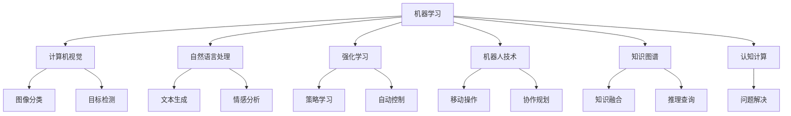

                 

# 人工智能研究的七大领域

## 1. 背景介绍

### 1.1 问题由来

人工智能（AI）作为21世纪最具影响力的技术领域之一，正以前所未有的速度推进着科技革命和社会进步。在过去几十年的发展中，AI技术从最初基于规则的系统，逐步演变为基于大数据和深度学习的智能系统。随着技术的进步，AI的应用领域不断拓展，涉及医疗、金融、交通、制造等各个方面，带来了前所未有的变革。

### 1.2 问题核心关键点

人工智能研究的七大领域包括机器学习、计算机视觉、自然语言处理、强化学习、机器人技术、知识图谱和认知计算。这些领域相互交织、相互促进，共同推动了AI技术的不断进步和应用落地。以下是各领域的核心概念和关键技术。

### 1.3 问题研究意义

人工智能的各个研究领域，不仅在理论上具有重要的科学价值，更在实际应用中展现出了巨大的社会和经济效益。了解和掌握这些领域的核心技术和方法，将有助于推动AI技术的持续创新和发展，为解决复杂问题、提升生产力和生活质量提供强有力的技术支持。

## 2. 核心概念与联系

### 2.1 核心概念概述

在人工智能研究的七大领域中，每个领域都有其独特的核心概念和技术方法。以下是对这些核心概念的简要概述：

- **机器学习**：通过对数据的学习，自动生成预测或决策模型。
- **计算机视觉**：使计算机具有“视觉感知”能力，能够识别、跟踪、分类和理解图像和视频内容。
- **自然语言处理**：使计算机能够理解、处理和生成人类语言，实现人机交互。
- **强化学习**：通过与环境的互动，学习最优策略以实现特定目标。
- **机器人技术**：融合了机械工程、计算机科学、电子工程等多个学科，旨在实现自主决策和复杂任务的执行。
- **知识图谱**：构建结构化的知识网络，实现知识推理和应用。
- **认知计算**：模拟人类认知过程，解决复杂问题。

这些核心概念之间的联系，可以通过以下Mermaid流程图来展示：



这个流程图展示了人工智能各领域之间的联系：

1. 机器学习是其他各领域的基础，提供数据驱动的模型和算法。
2. 计算机视觉、自然语言处理、强化学习等通过机器学习，提升了识别、理解、控制和推理能力。
3. 机器人技术融合了多学科知识，实现智能决策和执行。
4. 知识图谱和认知计算为机器人技术、自然语言处理和计算机视觉提供了知识支持。

### 2.2 概念间的关系

这些核心概念之间存在着紧密的联系，形成了人工智能技术的整体架构。以下是一些关键关系：

- **机器学习与计算机视觉**：计算机视觉任务，如图像分类、目标检测，往往依赖于机器学习算法进行特征提取和分类。
- **机器学习与自然语言处理**：自然语言处理任务，如文本分类、情感分析，通常基于机器学习模型进行语义分析和生成。
- **机器学习与强化学习**：强化学习算法，如Q-learning、Deep Q-Network，能够通过与环境的互动，自动优化模型参数，实现自主决策和控制。
- **机器学习与机器人技术**：机器学习算法为机器人提供了智能决策和自适应控制能力。
- **知识图谱与认知计算**：知识图谱为认知计算提供了知识表示和推理支持，帮助机器理解复杂概念和问题。

## 3. 核心算法原理 & 具体操作步骤

### 3.1 算法原理概述

人工智能各领域的研究，本质上是通过算法和技术手段，使机器能够模拟人类智能行为。以下是对各领域核心算法原理的概述：

- **机器学习**：通过优化损失函数，使模型参数最小化预测误差，实现对未知数据的泛化。
- **计算机视觉**：通过卷积神经网络（CNN）等模型，提取图像特征，进行分类、检测和分割。
- **自然语言处理**：通过循环神经网络（RNN）、变换器（Transformer）等模型，理解语言结构和语义。
- **强化学习**：通过与环境的交互，最大化累计奖励，学习最优策略。
- **机器人技术**：通过运动控制、感知、路径规划等算法，实现自主导航和协作。
- **知识图谱**：通过图神经网络（GNN）等模型，进行知识推理和融合。
- **认知计算**：通过符号计算、神经网络等模型，模拟人类认知过程。

### 3.2 算法步骤详解

以下是各领域核心算法的主要操作步骤：

**3.2.1 机器学习**

1. **数据准备**：收集和标注训练数据。
2. **模型选择**：选择合适的机器学习算法，如线性回归、决策树、神经网络等。
3. **模型训练**：使用训练数据拟合模型，优化损失函数。
4. **模型评估**：使用测试数据评估模型性能。
5. **模型应用**：将训练好的模型应用到实际问题中，进行预测或决策。

**3.2.2 计算机视觉**

1. **数据预处理**：对图像进行归一化、裁剪等预处理操作。
2. **模型训练**：使用CNN等模型，在训练数据上训练分类器或检测器。
3. **模型评估**：在测试数据上评估分类准确率和检测精度。
4. **模型优化**：通过调整超参数和数据增强，进一步提高模型性能。
5. **模型应用**：将训练好的模型应用于图像识别、目标检测等任务。

**3.2.3 自然语言处理**

1. **数据预处理**：对文本进行分词、去除停用词等预处理操作。
2. **模型训练**：使用RNN、Transformer等模型，在训练数据上训练语言模型或分类器。
3. **模型评估**：在测试数据上评估模型性能，如BLEU、ROUGE等指标。
4. **模型优化**：通过调整超参数和数据增强，进一步提高模型性能。
5. **模型应用**：将训练好的模型应用于文本分类、情感分析、机器翻译等任务。

**3.2.4 强化学习**

1. **环境建模**：构建与问题相关的环境模型，定义状态和动作空间。
2. **策略选择**：选择合适的强化学习算法，如Q-learning、深度强化学习（DRL）等。
3. **模型训练**：与环境交互，通过蒙特卡罗方法或基于神经网络的模型，优化策略参数。
4. **模型评估**：在测试环境中评估策略性能，如奖励值或完成任务效率。
5. **模型应用**：将训练好的策略应用于自动控制、游戏AI等任务。

**3.2.5 机器人技术**

1. **传感器安装**：在机器人上安装摄像头、激光雷达等传感器。
2. **数据采集**：通过传感器采集环境数据，如视觉、语音、动作等。
3. **模型训练**：使用深度学习模型，训练路径规划、动作生成等算法。
4. **模型评估**：在模拟环境中评估机器人的表现，如导航精度、协作效率等。
5. **模型应用**：将训练好的模型应用于自主导航、协作机器人等实际应用中。

**3.2.6 知识图谱**

1. **知识构建**：通过人工标注或自动提取，构建知识图谱。
2. **知识推理**：使用GNN等模型，进行知识推理，如实体链接、关系推理等。
3. **知识融合**：将不同来源的知识融合到一个统一的图谱中，提升知识推理的准确性。
4. **知识应用**：将知识图谱应用于推荐系统、搜索引擎等实际应用中。

**3.2.7 认知计算**

1. **问题建模**：将复杂问题抽象为符号表示，构建符号表示网络。
2. **符号推理**：使用符号计算模型，进行逻辑推理和推理查询。
3. **神经网络结合**：将符号计算与神经网络结合，提升问题解决能力。
4. **应用实现**：将认知计算模型应用于复杂问题解决，如自然语言理解、逻辑推理等。

### 3.3 算法优缺点

**3.3.1 机器学习**

**优点**：
- 数据驱动，泛化能力强。
- 算法种类丰富，适应性广。

**缺点**：
- 需要大量标注数据，获取成本高。
- 模型复杂度较高，训练时间长。

**3.3.2 计算机视觉**

**优点**：
- 应用广泛，如医疗、交通等领域。
- 数据获取相对容易，图像处理技术成熟。

**缺点**：
- 对光照、视角等因素敏感，鲁棒性较差。
- 需要大量计算资源，推理速度慢。

**3.3.3 自然语言处理**

**优点**：
- 提升人机交互体验，应用广泛。
- 语言理解和生成能力强。

**缺点**：
- 语义歧义问题难以解决。
- 对语料质量和处理技术要求高。

**3.3.4 强化学习**

**优点**：
- 能够学习最优策略，适应复杂环境。
- 可用于复杂任务，如游戏AI、自动控制等。

**缺点**：
- 训练过程复杂，需要大量时间。
- 模型复杂度较高，难以解释。

**3.3.5 机器人技术**

**优点**：
- 结合机械和电子技术，应用广泛。
- 能够实现自主决策和执行。

**缺点**：
- 对传感器和算法要求高。
- 对环境复杂性要求高，适应能力有限。

**3.3.6 知识图谱**

**优点**：
- 提供结构化的知识表示，易于推理。
- 支持多领域知识的融合和应用。

**缺点**：
- 构建和维护知识图谱成本高。
- 推理过程复杂，计算量大。

**3.3.7 认知计算**

**优点**：
- 模拟人类认知过程，解决复杂问题。
- 符号计算能力强，逻辑推理严谨。

**缺点**：
- 需要大量符号表示和推理规则。
- 难以处理大规模数据和复杂问题。

### 3.4 算法应用领域

**3.4.1 机器学习**

机器学习广泛应用于金融、医疗、电商等众多领域，如信用评分、疾病诊断、商品推荐等。

**3.4.2 计算机视觉**

计算机视觉在医疗影像分析、自动驾驶、工业检测等领域有着广泛应用，如病灶识别、车辆跟踪、质量检测等。

**3.4.3 自然语言处理**

自然语言处理在智能客服、智能翻译、智能写作等领域表现出色，如智能客服系统、机器翻译系统、智能写文章工具等。

**3.4.4 强化学习**

强化学习在游戏AI、机器人控制、自动交易等领域有重要应用，如AlphaGo、机器人路径规划、自动交易策略等。

**3.4.5 机器人技术**

机器人技术在制造、物流、教育等领域有着广泛应用，如自动化生产线、无人驾驶、教育机器人等。

**3.4.6 知识图谱**

知识图谱在推荐系统、搜索引擎、智能问答等领域表现突出，如电商推荐系统、智能问答系统、知识图谱搜索引擎等。

**3.4.7 认知计算**

认知计算在复杂问题解决、智能决策等领域有重要应用，如自动定理证明、智能决策支持系统等。

## 4. 数学模型和公式 & 详细讲解 & 举例说明

### 4.1 数学模型构建

以下是各领域核心算法的数学模型构建：

**4.1.1 机器学习**

- **线性回归模型**：
  $$
  y = \theta_0 + \sum_{i=1}^n \theta_i x_i
  $$
  其中 $\theta = (\theta_0, \theta_1, ..., \theta_n)$ 为模型参数。

- **神经网络模型**：
  $$
  y = \sigma(\sum_{i=1}^n w_i x_i + b)
  $$
  其中 $\sigma$ 为激活函数，$w$ 和 $b$ 为权重和偏置。

**4.1.2 计算机视觉**

- **卷积神经网络（CNN）**：
  $$
  f(x) = \sigma(\sum_{i=1}^n w_i \phi(x) + b)
  $$
  其中 $\phi(x)$ 为卷积操作，$w$ 和 $b$ 为卷积核和偏置。

**4.1.3 自然语言处理**

- **循环神经网络（RNN）**：
  $$
  h_t = f(h_{t-1}, x_t)
  $$
  其中 $h_t$ 为隐藏状态，$f$ 为循环函数。

- **Transformer模型**：
  $$
  y = \sum_{i=1}^n w_i \alpha(x_i, y)
  $$
  其中 $\alpha(x_i, y)$ 为自注意力机制。

**4.1.4 强化学习**

- **Q-learning算法**：
  $$
  Q(s, a) \leftarrow Q(s, a) + \alpha [r + \gamma \max_{a'} Q(s', a') - Q(s, a)]
  $$
  其中 $Q(s, a)$ 为状态动作值函数，$\alpha$ 为学习率，$r$ 为即时奖励，$s'$ 为下一个状态，$a'$ 为下一个动作。

**4.1.5 机器人技术**

- **路径规划算法**：
  $$
  \min_{\theta} \sum_{i=1}^n (d_i(\theta) - p_i)^2
  $$
  其中 $d_i(\theta)$ 为路径长度，$p_i$ 为路径控制参数。

**4.1.6 知识图谱**

- **图神经网络（GNN）**：
  $$
  \hat{h}_v = \frac{1}{Z} \sum_{u \in N(v)} \exp(e_{vu}) h_u
  $$
  其中 $h_u$ 为节点 $u$ 的特征向量，$N(v)$ 为节点 $v$ 的邻居节点集合，$e_{vu}$ 为边特征向量，$Z$ 为归一化常数。

**4.1.7 认知计算**

- **符号推理**：
  $$
  \phi(x) = \bigwedge_{i=1}^n \text{if } p_i \rightarrow q_i
  $$
  其中 $p_i$ 为前提，$q_i$ 为结论，$\phi(x)$ 为推理结果。

### 4.2 公式推导过程

**4.2.1 机器学习**

**线性回归模型推导**：
- **目标函数**：
  $$
  \min_{\theta} \frac{1}{2N} \sum_{i=1}^N (y_i - \theta^T x_i)^2
  $$
  其中 $N$ 为样本数量。

- **梯度下降更新**：
  $$
  \theta \leftarrow \theta - \alpha \frac{1}{N} \sum_{i=1}^N (y_i - \theta^T x_i) x_i
  $$
  其中 $\alpha$ 为学习率。

**神经网络模型推导**：
- **梯度下降更新**：
  $$
  \theta \leftarrow \theta - \alpha \frac{1}{N} \sum_{i=1}^N (y_i - \sigma(\sum_{i=1}^n w_i x_i + b)) \frac{\partial \sigma}{\partial \theta}
  $$
  其中 $\frac{\partial \sigma}{\partial \theta}$ 为激活函数的导数。

**4.2.2 计算机视觉**

**卷积神经网络（CNN）推导**：
- **前向传播**：
  $$
  f(x) = \sum_{i=1}^n w_i \phi(x)
  $$
  其中 $\phi(x)$ 为卷积操作。

- **梯度下降更新**：
  $$
  w \leftarrow w - \alpha \frac{1}{N} \sum_{i=1}^N (y_i - f(x_i)) x_i
  $$
  其中 $\alpha$ 为学习率。

**4.2.3 自然语言处理**

**循环神经网络（RNN）推导**：
- **前向传播**：
  $$
  h_t = f(h_{t-1}, x_t)
  $$
  其中 $f$ 为循环函数。

- **梯度下降更新**：
  $$
  \theta \leftarrow \theta - \alpha \frac{1}{N} \sum_{i=1}^N (y_i - h_t) \frac{\partial f}{\partial h_{t-1}} \frac{\partial f}{\partial \theta}
  $$
  其中 $\frac{\partial f}{\partial h_{t-1}}$ 和 $\frac{\partial f}{\partial \theta}$ 分别为循环函数和参数的导数。

**Transformer模型推导**：
- **前向传播**：
  $$
  y = \sum_{i=1}^n w_i \alpha(x_i, y)
  $$
  其中 $\alpha(x_i, y)$ 为自注意力机制。

- **梯度下降更新**：
  $$
  \theta \leftarrow \theta - \alpha \frac{1}{N} \sum_{i=1}^N (y_i - \sum_{j=1}^n w_j \alpha(x_j, y)) \frac{\partial \alpha}{\partial \theta}
  $$
  其中 $\frac{\partial \alpha}{\partial \theta}$ 为自注意力机制的导数。

**4.2.4 强化学习**

**Q-learning算法推导**：
- **目标函数**：
  $$
  Q(s, a) \leftarrow Q(s, a) + \alpha [r + \gamma \max_{a'} Q(s', a') - Q(s, a)]
  $$
  其中 $\alpha$ 为学习率，$r$ 为即时奖励，$s'$ 为下一个状态，$a'$ 为下一个动作。

**4.2.5 机器人技术**

**路径规划算法推导**：
- **目标函数**：
  $$
  \min_{\theta} \sum_{i=1}^n (d_i(\theta) - p_i)^2
  $$
  其中 $d_i(\theta)$ 为路径长度，$p_i$ 为路径控制参数。

- **梯度下降更新**：
  $$
  \theta \leftarrow \theta - \alpha \frac{1}{N} \sum_{i=1}^N (d_i(\theta) - p_i) \frac{\partial d_i(\theta)}{\partial \theta}
  $$
  其中 $\alpha$ 为学习率，$\frac{\partial d_i(\theta)}{\partial \theta}$ 为路径函数对参数的导数。

**4.2.6 知识图谱**

**图神经网络（GNN）推导**：
- **前向传播**：
  $$
  \hat{h}_v = \frac{1}{Z} \sum_{u \in N(v)} \exp(e_{vu}) h_u
  $$
  其中 $h_u$ 为节点 $u$ 的特征向量，$N(v)$ 为节点 $v$ 的邻居节点集合，$e_{vu}$ 为边特征向量，$Z$ 为归一化常数。

- **梯度下降更新**：
  $$
  w \leftarrow w - \alpha \frac{1}{N} \sum_{i=1}^N (h_i - \hat{h}_i) \frac{\partial \hat{h}_i}{\partial w}
  $$
  其中 $\alpha$ 为学习率，$\frac{\partial \hat{h}_i}{\partial w}$ 为图神经网络对参数的导数。

**4.2.7 认知计算**

**符号推理推导**：
- **目标函数**：
  $$
  \phi(x) = \bigwedge_{i=1}^n \text{if } p_i \rightarrow q_i
  $$
  其中 $p_i$ 为前提，$q_i$ 为结论，$\phi(x)$ 为推理结果。

- **梯度下降更新**：
  $$
  \theta \leftarrow \theta - \alpha \frac{1}{N} \sum_{i=1}^N (y_i - \phi(x_i)) \frac{\partial \phi}{\partial \theta}
  $$
  其中 $\alpha$ 为学习率，$\frac{\partial \phi}{\partial \theta}$ 为符号推理对参数的导数。

### 4.3 案例分析与讲解

以下是各领域核心算法在实际应用中的案例分析：

**4.3.1 机器学习**

- **信用评分**：使用线性回归模型，对用户的经济行为数据进行预测，评估其信用风险。

- **疾病诊断**：使用神经网络模型，对患者的医学影像数据进行分类，辅助医生进行诊断。

**4.3.2 计算机视觉**

- **自动驾驶**：使用CNN模型，对路标和交通标志进行识别，辅助自动驾驶系统进行决策。

- **工业检测**：使用CNN模型，对产品质量进行检测，及时发现缺陷。

**4.3.3 自然语言处理**

- **智能客服**：使用RNN模型，对用户咨询进行理解，自动生成回复。

- **机器翻译**：使用Transformer模型，将文本从一种语言翻译成另一种语言。

**4.3.4 强化学习**

- **AlphaGo**：使用强化学习算法，训练AlphaGo在围棋中战胜人类。

- **机器人路径规划**：使用强化学习算法，训练机器人进行自主导航。

**4.3.5 机器人技术**

- **自动化生产线**：使用机器人技术，实现生产线的自动化操作和质量检测。

- **无人驾驶**：使用机器人技术，实现无人驾驶汽车的控制和导航。

**4.3.6 知识图谱**

- **电商推荐系统**：使用知识图谱，实现个性化推荐，提升用户购物体验。

- **智能问答系统**：使用知识图谱，构建知识库，实现智能问答。

**4.3.7 认知计算**

- **自动定理证明**：使用认知计算，证明数学定理。

- **智能决策支持系统**：使用认知计算，辅助决策者进行复杂问题的决策。

## 5. 项目实践：代码实例和详细解释说明

### 5.1 开发环境搭建

在进行各领域核心算法实践前，我们需要准备好开发环境。以下是使用Python进行PyTorch开发的环境配置流程：

1. 安装Anaconda：从官网下载并安装Anaconda，用于创建独立的Python环境。

2. 创建并激活虚拟环境：
```bash
conda create -n pytorch-env python=3.8 
conda activate pytorch-env
```

3. 安装PyTorch：根据CUDA版本，从官网获取对应的安装命令。例如：
```bash
conda install pytorch torchvision torchaudio cudatoolkit=11.1 -c pytorch -c conda-forge
```

4. 安装TensorFlow：
```bash
pip install tensorflow
```

5. 安装其它相关库：
```bash
pip install numpy pandas scikit-learn matplotlib tqdm jupyter notebook ipython
```

完成上述步骤后，即可在`pytorch-env`环境中开始各领域的核心算法实践。

### 5.2 源代码详细实现

以下以计算机视觉中的图像分类为例，给出使用PyTorch进行卷积神经网络（CNN）的代码实现。

首先，定义CNN模型类：

```python
import torch.nn as nn
import torch.nn.functional as F

class CNNModel(nn.Module):
    def __init__(self):
        super(CNNModel, self).__init__()
        self.conv1 = nn.Conv2d(3, 32, kernel_size=3, stride=1, padding=1)
        self.pool1 = nn.MaxPool2d(kernel_size=2, stride=2)
        self.conv2 = nn.Conv2d(32, 64, kernel_size=3, stride=1, padding=1)
        self.pool2 = nn.MaxPool2d(kernel_size=2, stride=2)
        self.fc1 = nn.Linear(7*7*64, 256)
        self.fc2 = nn.Linear(256, 10)

    def forward(self, x):
        x = self.pool1(F.relu(self.conv1(x)))
        x = self.pool2(F.relu(self.conv2(x)))
        x = x.view(-1, 7*7*64)
        x = F.relu(self.fc1(x))
        x = self.fc2(x)
        return x
```

然后，定义数据处理函数：

```python
import torchvision.transforms as transforms
from torch.utils.data import DataLoader
from torchvision.datasets import CIFAR10

class CIFAR10Dataset(Dataset):
    def __init__

