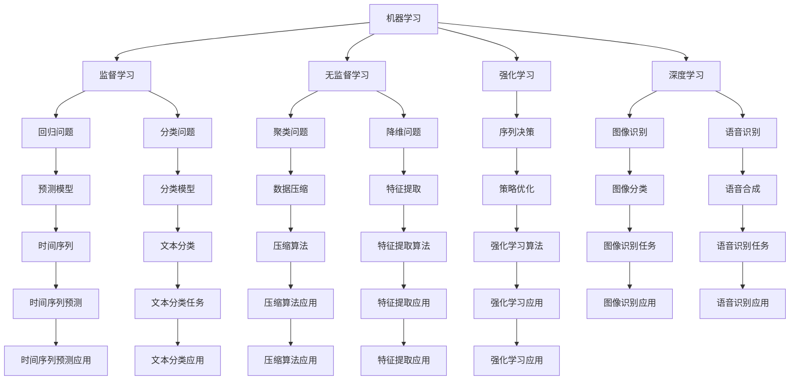

                 

# 人工智能领域的奠基者们

> 关键词：人工智能, 机器学习, 深度学习, 计算机视觉, 自然语言处理, 人机交互, 认知心理学

## 1. 背景介绍

### 1.1 问题由来
人工智能（AI）自诞生之日起，便一直是科技界最激动人心的领域之一。经过几十年的发展，AI已经渗透到各个行业，成为推动社会进步的重要力量。回顾AI的发展历程，可以发现许多奠基者们在前沿领域的探索，不仅为AI技术的发展奠定了基础，也为后人的研究指明了方向。

本文旨在回顾那些在人工智能领域做出杰出贡献的奠基者们，探讨他们的理论和方法对现代AI技术的深远影响。通过回顾这些奠基者的贡献，希望能激发更多研究者投身于这一领域，推动人工智能技术的不断进步。

### 1.2 问题核心关键点
本文将重点探讨以下关键点：
- 人工智能的历史演进
- 人工智能领域的奠基者们及其贡献
- 人工智能技术的未来发展方向
- 人工智能在各个领域的实际应用

## 2. 核心概念与联系

### 2.1 核心概念概述

在人工智能领域，有许多重要概念和技术，这些概念和技术共同构成了AI的基石。本文将介绍几个核心的概念：

- 机器学习（Machine Learning, ML）：通过数据驱动的方法，让机器自动学习并改进其性能。它是AI的核心技术之一，广泛应用于图像识别、自然语言处理等领域。
- 深度学习（Deep Learning, DL）：一种特殊的机器学习方法，通过多层神经网络模拟人类大脑的学习过程，用于处理大规模数据和高维特征。深度学习是现代AI技术的重要基础。
- 计算机视觉（Computer Vision, CV）：使计算机能够理解和解释图像和视频中的视觉信息。它包括图像分类、目标检测、语义分割等任务。
- 自然语言处理（Natural Language Processing, NLP）：让计算机能够理解和生成人类语言。它包括文本分类、信息抽取、问答系统等任务。
- 人机交互（Human-Computer Interaction, HCI）：研究如何让计算机更好地理解人类行为和需求，提升用户体验。
- 认知心理学（Cognitive Psychology）：研究人类认知过程的科学，为人工智能提供了重要的理论基础。

这些概念之间存在着紧密的联系，通过不断交叉融合，推动了AI技术的进步。

### 2.2 概念间的关系

这些核心概念之间的关系可以通过以下Mermaid流程图来展示：



这个流程图展示了人工智能领域的主要概念和技术之间的关系。监督学习、无监督学习、强化学习、深度学习是机器学习的主要分支，分别应用于回归、分类、聚类、图像识别、语音识别等任务。

## 3. 核心算法原理 & 具体操作步骤
### 3.1 算法原理概述

人工智能的算法原理是多样化的，但大多数算法都可以归结为数据驱动的学习过程。下面是几种核心算法的概述：

- **监督学习**：利用标注数据训练模型，使其能够预测新数据。
- **无监督学习**：利用未标注数据进行学习，发现数据中的隐含结构。
- **强化学习**：通过与环境的交互，学习最优策略以最大化累积奖励。
- **深度学习**：利用多层神经网络模拟人类大脑的学习过程，处理高维数据。

### 3.2 算法步骤详解

这里以深度学习中的卷积神经网络（Convolutional Neural Network, CNN）为例，详细介绍其操作步骤：

1. **数据预处理**：将原始图像数据标准化，如归一化像素值、数据增强等。
2. **网络构建**：设计多层卷积层、池化层和全连接层，定义损失函数和优化器。
3. **模型训练**：将数据集分为训练集和验证集，使用梯度下降算法训练模型。
4. **模型评估**：在测试集上评估模型性能，如准确率、损失函数等。
5. **模型优化**：根据评估结果调整超参数，如学习率、网络结构等。

### 3.3 算法优缺点

深度学习在处理大规模数据和高维特征方面具有显著优势，但也存在以下缺点：

- **计算资源消耗大**：训练深度学习模型需要大量计算资源，且训练时间较长。
- **模型复杂度高**：深度学习模型的结构复杂，难以解释其内部工作机制。
- **数据依赖性强**：深度学习模型依赖大量标注数据进行训练，数据质量对模型性能影响巨大。

### 3.4 算法应用领域

深度学习在计算机视觉、自然语言处理等领域得到了广泛应用：

- **计算机视觉**：如图像分类、目标检测、语义分割等任务。
- **自然语言处理**：如文本分类、机器翻译、问答系统等任务。
- **语音识别**：如语音合成、语音识别等任务。

## 4. 数学模型和公式 & 详细讲解

### 4.1 数学模型构建

以深度学习中的卷积神经网络（CNN）为例，构建其数学模型：

$$
y = W^T \sigma(b + XW)
$$

其中，$y$为输出向量，$W$为权重矩阵，$b$为偏置向量，$\sigma$为激活函数，$X$为输入向量。

### 4.2 公式推导过程

以多层卷积神经网络为例，其前向传播过程如下：

1. **卷积层**：
$$
y = \sigma\left(W * X + b\right)
$$

2. **池化层**：
$$
y = \max\limits_{i,j}(y_{i,j})
$$

3. **全连接层**：
$$
y = W^T \sigma(b + XW)
$$

4. **softmax层**：
$$
p(y_i) = \frac{e^{y_i}}{\sum\limits_{j=1}^C e^{y_j}}
$$

其中，$C$为类别数，$y_i$为第$i$个类别的输出值。

### 4.3 案例分析与讲解

以图像分类为例，CNN通过卷积层提取图像的特征，池化层降维，全连接层进行分类。在训练过程中，通过反向传播算法计算损失函数的梯度，使用梯度下降算法更新模型参数。

## 5. 项目实践：代码实例和详细解释说明

### 5.1 开发环境搭建

要进行深度学习项目实践，需要先搭建开发环境。以下是使用Python进行TensorFlow开发的环境配置流程：

1. 安装Anaconda：从官网下载并安装Anaconda，用于创建独立的Python环境。
2. 创建并激活虚拟环境：
```bash
conda create -n tf-env python=3.8 
conda activate tf-env
```

3. 安装TensorFlow：
```bash
pip install tensorflow
```

4. 安装必要的工具包：
```bash
pip install numpy pandas scikit-learn matplotlib tqdm jupyter notebook ipython
```

完成上述步骤后，即可在`tf-env`环境中开始项目开发。

### 5.2 源代码详细实现

以下是使用TensorFlow实现图像分类的代码：

```python
import tensorflow as tf
from tensorflow.keras import layers, models

# 定义CNN模型
def create_model(input_shape):
    model = models.Sequential([
        layers.Conv2D(32, (3, 3), activation='relu', input_shape=input_shape),
        layers.MaxPooling2D((2, 2)),
        layers.Conv2D(64, (3, 3), activation='relu'),
        layers.MaxPooling2D((2, 2)),
        layers.Conv2D(64, (3, 3), activation='relu'),
        layers.Flatten(),
        layers.Dense(64, activation='relu'),
        layers.Dense(10, activation='softmax')
    ])
    return model

# 加载数据
train_data = tf.keras.datasets.cifar10.load_data()
test_data = tf.keras.datasets.cifar10.load_data()

# 数据预处理
train_data = tf.keras.utils.to_categorical(train_data[0], num_classes=10)
test_data = tf.keras.utils.to_categorical(test_data[0], num_classes=10)

# 创建模型
model = create_model(train_data.shape[1:])

# 编译模型
model.compile(optimizer='adam', loss='categorical_crossentropy', metrics=['accuracy'])

# 训练模型
model.fit(train_data, train_data[1], epochs=10, validation_data=(test_data, test_data[1]))

# 评估模型
model.evaluate(test_data, test_data[1])
```

### 5.3 代码解读与分析

代码中，我们首先定义了CNN模型，然后加载了CIFAR-10数据集，并对数据进行了预处理和模型训练。训练过程中，我们使用了Adam优化器和交叉熵损失函数。最后，对模型进行了评估，并输出了准确率等指标。

## 6. 实际应用场景

### 6.1 智能医疗

计算机视觉在医疗领域有广泛应用。例如，通过深度学习模型对医学影像进行分析，可以辅助医生进行病灶检测、病理诊断等工作。这些技术不仅提高了诊断的准确性和效率，还减少了医生的工作负担。

### 6.2 自动驾驶

在自动驾驶领域，计算机视觉和深度学习技术用于识别和理解交通环境，如图像分类、目标检测、行为预测等任务。这些技术为自动驾驶车辆提供了视觉感知能力，提高了行驶安全性和效率。

### 6.3 金融风控

自然语言处理技术在金融领域也有重要应用。例如，通过文本分析技术，可以识别欺诈行为、情感分析客户情绪等。这些技术为金融机构提供了更多的数据洞察，有助于风险管理和客户服务。

### 6.4 未来应用展望

随着深度学习技术的发展，未来人工智能将有更多应用场景：

- **无人制造**：通过计算机视觉和自然语言处理技术，实现智能制造和自动化生产。
- **个性化推荐**：利用深度学习模型进行用户行为分析，提供个性化的商品推荐和内容推荐。
- **智能客服**：通过自然语言处理技术，实现智能客服系统的构建，提升客户服务体验。

## 7. 工具和资源推荐

### 7.1 学习资源推荐

为了帮助开发者系统掌握深度学习技术，以下是一些优秀的学习资源：

1. 《深度学习》课程：由Coursera提供的由Andrew Ng主讲的深度学习课程，深入浅出地讲解了深度学习的理论和技术。
2. 《Hands-On Machine Learning with Scikit-Learn, Keras, and TensorFlow》书籍：该书详细介绍了使用Scikit-Learn、Keras和TensorFlow进行机器学习和深度学习开发的方法。
3. TensorFlow官方文档：提供了详细的TensorFlow教程和API文档，是学习和使用TensorFlow的重要参考资料。
4. Kaggle：提供丰富的数据集和竞赛平台，帮助开发者实践和验证深度学习模型。
5. arXiv：提供前沿研究论文，是深度学习领域的重要资讯来源。

### 7.2 开发工具推荐

高效开发深度学习模型，需要选择合适的工具和框架。以下是一些推荐的开发工具：

1. TensorFlow：由Google开发的开源深度学习框架，支持分布式计算，广泛应用于各种深度学习项目。
2. PyTorch：由Facebook开发的开源深度学习框架，支持动态计算图，易于调试和扩展。
3. Keras：高层深度学习API，易于上手，支持多种后端（TensorFlow、Theano、CNTK等）。
4. Jupyter Notebook：用于编写和运行Python代码的交互式开发环境。
5. TensorBoard：用于可视化模型训练过程和结果的图形界面工具。

### 7.3 相关论文推荐

深度学习技术的快速发展离不开研究者的不断探索。以下是几篇具有里程碑意义的论文：

1. AlexNet：2012年ImageNet竞赛中获胜的模型，开启了深度学习在计算机视觉中的应用。
2. ResNet：通过残差连接解决了深度网络训练困难的问题，推动了深度学习的发展。
3. Inception：提出了Inception模块，提高了深度卷积神经网络的性能。
4. Transformer：提出了自注意力机制，改进了自然语言处理任务的效果。
5. GANs：提出了生成对抗网络，推动了生成式深度学习的研究。

这些论文不仅推动了深度学习技术的发展，还提供了重要的研究方向和方法。

## 8. 总结：未来发展趋势与挑战

### 8.1 总结

本文对人工智能领域的奠基者们及其贡献进行了详细回顾。从机器学习、深度学习、计算机视觉、自然语言处理等多个方面，展示了人工智能技术的发展历程。通过回顾这些奠基者的贡献，可以更好地理解当前AI技术的应用和未来发展方向。

### 8.2 未来发展趋势

展望未来，人工智能技术将继续快速发展，并在各个领域得到广泛应用：

1. **更高效的计算模型**：未来的深度学习模型将更加高效，能够处理更大规模和更复杂的数据。
2. **更智能的决策模型**：通过引入因果推断、生成对抗网络等技术，使得AI模型更加智能和可解释。
3. **更普适的算法**：未来的AI算法将更加普适，能够处理多种类型的输入和任务。
4. **更广泛的领域应用**：人工智能技术将在更多领域得到应用，如医疗、金融、自动驾驶等。

### 8.3 面临的挑战

尽管人工智能技术在不断发展，但仍面临许多挑战：

1. **计算资源限制**：深度学习模型需要大量的计算资源，未来如何提高计算效率是一个重要问题。
2. **数据隐私和安全**：深度学习模型依赖大量数据进行训练，如何保护数据隐私和安全是一个重要挑战。
3. **模型可解释性**：深度学习模型的内部工作机制难以解释，未来如何提高模型的可解释性是一个重要研究方向。
4. **知识整合能力不足**：现有模型缺乏整合外部知识的能力，如何实现知识驱动的AI是未来的重要课题。

### 8.4 研究展望

未来，人工智能研究需要在以下几个方面寻求新的突破：

1. **跨领域融合**：将深度学习与认知心理学、伦理、社会等学科结合，实现更全面的AI研究。
2. **多模态融合**：实现图像、语音、文本等多模态数据的融合，提高AI系统的感知能力。
3. **自监督学习**：通过自监督学习技术，减少对标注数据的依赖，提高模型的泛化能力。
4. **算法优化**：通过算法优化，提高深度学习模型的计算效率和可解释性。
5. **知识驱动**：引入外部知识，如知识图谱、规则库等，提高AI系统的决策能力。

总之，人工智能技术的未来充满无限可能，但要实现这些目标，还需要研究者们的不懈努力和创新探索。只有不断突破，才能推动AI技术不断进步，为人类社会带来更大的福祉。

## 9. 附录：常见问题与解答

**Q1：什么是深度学习？**

A: 深度学习是一种特殊的机器学习方法，通过多层神经网络模拟人类大脑的学习过程，用于处理大规模数据和高维特征。它包括卷积神经网络（CNN）、循环神经网络（RNN）、生成对抗网络（GAN）等多种模型。

**Q2：深度学习模型如何进行训练？**

A: 深度学习模型的训练通常包括以下步骤：
1. 数据预处理：标准化数据，如归一化、数据增强等。
2. 网络构建：设计多层神经网络，定义损失函数和优化器。
3. 模型训练：将数据集分为训练集和验证集，使用梯度下降算法训练模型。
4. 模型评估：在测试集上评估模型性能，如准确率、损失函数等。
5. 模型优化：根据评估结果调整超参数，如学习率、网络结构等。

**Q3：深度学习模型的计算资源消耗大，如何解决这一问题？**

A: 深度学习模型的计算资源消耗大，可以通过以下方法解决：
1. 使用分布式计算：将模型训练任务分配到多个计算节点上进行并行计算。
2. 使用GPU/TPU加速：利用GPU或TPU等专用计算设备，提高计算速度。
3. 使用压缩算法：对模型参数进行压缩，减少存储空间和计算资源消耗。
4. 使用模型裁剪：去除不必要的层和参数，减小模型尺寸，加快推理速度。

**Q4：深度学习模型的可解释性如何提高？**

A: 提高深度学习模型的可解释性可以通过以下方法：
1. 引入可解释性模块：如LIME、SHAP等，用于解释模型的预测结果。
2. 使用可视化工具：如TensorBoard、Keras等，可视化模型的内部结构和参数变化。
3. 引入因果推断：通过因果推断技术，解释模型的决策过程和原因。
4. 引入先验知识：通过引入符号化的先验知识，如知识图谱、规则库等，提高模型的可解释性。

**Q5：深度学习模型如何应用于实际场景？**

A: 深度学习模型可以应用于各种实际场景，如计算机视觉、自然语言处理、智能医疗等。具体步骤包括：
1. 数据预处理：标准化数据，如归一化、数据增强等。
2. 网络构建：设计多层神经网络，定义损失函数和优化器。
3. 模型训练：将数据集分为训练集和验证集，使用梯度下降算法训练模型。
4. 模型评估：在测试集上评估模型性能，如准确率、损失函数等。
5. 模型优化：根据评估结果调整超参数，如学习率、网络结构等。
6. 模型部署：将模型封装为标准化服务接口，便于集成调用。

总之，深度学习技术在实际应用中具有广阔的前景，但需要研究者们不断探索和创新，才能实现更广泛和深入的应用。

