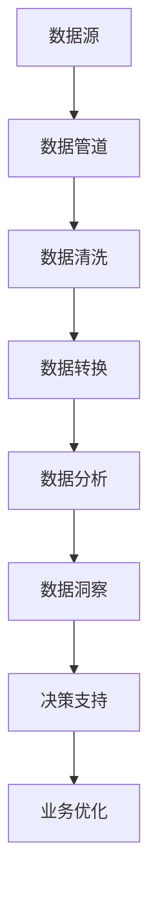

                 

# 从数据到洞察：AI代理工作流中的分析引擎

> 关键词：AI代理, 数据洞察, 工作流引擎, 数据分析, 数据管道

## 1. 背景介绍

在当今快速发展的数字化时代，企业正面临着前所未有的数据挑战。每天产生的海量数据，需要高效、智能地进行采集、清洗、分析和应用，才能从中挖掘出有价值的洞察，驱动业务创新和发展。传统的流程化数据分析方法已无法满足这些需求，AI代理工作流应运而生。

AI代理工作流是一种利用人工智能技术，自动化执行数据处理任务，通过自适应的方式优化工作流程和数据分析路径的技术。其核心在于将数据处理任务抽象为一系列可复用的模块，并通过深度学习模型对其进行自适应地组合和优化。这种基于AI的自动化工作流，不仅能够大幅提升数据处理的效率和质量，还能更好地应对动态变化的需求，帮助企业实现真正的数据驱动。

本文将深入探讨AI代理工作流中的分析引擎，从数据处理流程、模型构建到实际应用场景，全面解析其工作原理和应用价值。通过系统地介绍相关技术和案例，希望能为读者提供深刻的洞察，为未来的数据处理和分析工作提供有益的参考。

## 2. 核心概念与联系

### 2.1 核心概念概述

为了更好地理解AI代理工作流中的分析引擎，本节将介绍几个关键概念：

- **AI代理**：利用人工智能技术，自动化执行数据处理任务的工作流。它能够根据任务要求和数据特性，自适应地选择和组合不同的处理步骤。
- **数据洞察**：通过数据分析和挖掘，从原始数据中提炼出有意义的业务洞见和知识，支持决策和业务优化。
- **工作流引擎**：一种能够按照特定流程逻辑执行任务的软件平台，支持任务编排、调度、监控和管理。
- **数据分析**：对原始数据进行清洗、转换、集成和分析，提取出有价值的信息和知识。
- **数据管道**：一种自动化的数据传输和处理系统，能够高效、可靠地处理大规模数据。

这些核心概念共同构成了AI代理工作流的基石，使数据处理过程更加高效、智能和自适应。下面通过一个Mermaid流程图，展示它们之间的关系：



在这个流程图中，数据源首先进入数据管道，通过一系列的数据清洗、转换和分析步骤，最终生成有价值的数据洞察，支持业务决策和优化。

### 2.2 概念间的关系

- **数据源与数据管道**：数据源是数据流动的起点，数据管道负责高效可靠地传输数据，确保数据处理过程的连续性和稳定性。
- **数据清洗与数据转换**：数据清洗和转换是数据预处理的关键步骤，通过去重、补全、格式化等处理，提高数据质量，为后续分析奠定基础。
- **数据分析与数据洞察**：数据分析是数据洞察的直接来源，通过对数据的统计、建模和挖掘，生成有意义的业务洞见和知识，驱动决策和行动。
- **决策支持与业务优化**：数据洞察通过支持决策和业务优化，转化为实际的业务价值，推动企业的发展和创新。

## 3. 核心算法原理 & 具体操作步骤

### 3.1 算法原理概述

AI代理工作流中的分析引擎，核心在于将数据分析任务抽象为一系列可复用的模块，并通过深度学习模型对其进行自适应地组合和优化。其算法原理主要包括以下几个方面：

- **模块化设计**：将数据处理任务分解为多个独立的模块，每个模块负责特定的数据处理操作，如数据清洗、转换、分析等。模块之间通过API接口进行交互，实现数据流的自动化。
- **深度学习模型**：利用深度学习技术，构建多层次的神经网络模型，对数据进行高效的特征提取和模式识别。深度学习模型可以自适应地学习数据的特征和模式，提升数据分析的精度和泛化能力。
- **自适应组合与优化**：根据任务需求和数据特性，动态调整数据处理模块的组合方式和运行参数，实现对处理流程的实时优化。自适应组合与优化是AI代理工作流的关键特色，能够提升数据处理效率和质量。

### 3.2 算法步骤详解

AI代理工作流中的分析引擎主要分为以下几个步骤：

**Step 1: 数据管道配置**

- 确定数据源和数据目标。
- 配置数据管道的基本参数，如数据格式、传输速度、缓冲大小等。
- 使用数据管道技术，确保数据传输的可靠性和高效性。

**Step 2: 数据预处理**

- 对原始数据进行清洗和转换，去除噪声和冗余信息。
- 使用特征工程技术，提取和构建有意义的特征。
- 利用深度学习模型，对数据进行预处理，提取高层次的特征表示。

**Step 3: 数据分析与建模**

- 选择适合的深度学习模型，进行数据建模和分析。
- 利用自适应算法，动态调整模型参数和结构，提升分析精度和泛化能力。
- 使用数据可视化工具，对分析结果进行展示和分析。

**Step 4: 数据洞察生成**

- 对分析结果进行深度挖掘，生成有意义的业务洞见和知识。
- 使用机器学习技术，进行异常检测和预测分析。
- 利用数据洞察，支持业务决策和优化。

**Step 5: 持续优化与反馈**

- 根据业务反馈和实际效果，不断调整和优化数据分析流程。
- 使用模型监控和性能评估工具，确保数据分析过程的稳定性和准确性。
- 建立反馈机制，将业务洞察转化为实际的业务价值。

### 3.3 算法优缺点

**优点**：

- **高效性**：利用深度学习模型和自适应技术，能够快速、高效地处理大规模数据。
- **自适应性**：能够根据任务需求和数据特性，自适应地选择和优化数据处理模块。
- **泛化能力**：通过深度学习模型的自适应调整，提升数据分析的精度和泛化能力。
- **灵活性**：模块化的设计，使得数据处理过程具有高度的灵活性和可扩展性。

**缺点**：

- **复杂性**：涉及深度学习、数据管道、数据分析等多个领域的知识，技术实现较为复杂。
- **数据依赖**：依赖高质量的数据源和数据管道，对数据的完整性和准确性要求较高。
- **资源消耗**：深度学习模型的计算和内存消耗较大，对硬件和计算资源要求较高。
- **模型泛化**：在处理新数据时，模型泛化能力可能有限，需要进行持续的优化和调整。

### 3.4 算法应用领域

AI代理工作流中的分析引擎在多个领域都有广泛的应用，以下是几个典型的应用场景：

- **金融数据分析**：利用AI代理工作流，对金融数据进行清洗、转换和分析，生成有价值的业务洞见和知识，支持风险管理、投资决策等。
- **医疗数据分析**：对医疗数据进行深度分析，生成健康趋势、疾病预测等洞察，支持医疗服务和决策优化。
- **电商数据分析**：对电商数据进行清洗、转换和分析，生成用户行为分析、市场趋势等洞察，支持电商运营和优化。
- **智能制造数据分析**：对制造数据进行深度分析，生成生产效率、设备维护等洞察，支持智能制造和优化。
- **智慧城市数据分析**：对城市数据进行深度分析，生成交通流量、公共服务优化等洞察，支持智慧城市建设和优化。

这些应用场景展示了AI代理工作流在各个行业中的强大能力，能够帮助企业从数据中挖掘出有价值的洞察，驱动业务创新和发展。

## 4. 数学模型和公式 & 详细讲解

### 4.1 数学模型构建

为了更好地理解AI代理工作流中的分析引擎，本节将通过数学语言，对其中的关键模型进行详细讲解。

假设原始数据为 $D=\{x_1, x_2, ..., x_n\}$，其中 $x_i$ 表示第 $i$ 个数据点。数据处理过程可以分为数据清洗、转换和分析三个步骤。

**Step 1: 数据清洗**

数据清洗的目的是去除噪声和冗余信息，提升数据质量。常见的数据清洗方法包括去重、补全、标准化等。

**Step 2: 数据转换**

数据转换是通过特征工程技术，将原始数据转换为适合分析的格式。常见的数据转换方法包括归一化、特征选择、特征构建等。

**Step 3: 数据分析**

数据分析是通过构建深度学习模型，对数据进行特征提取和模式识别。常见的深度学习模型包括神经网络、卷积神经网络、循环神经网络等。

### 4.2 公式推导过程

**数据清洗公式**：

$$
\text{cleaned\_data} = \text{clean}(D)
$$

其中，$\text{clean}$ 表示数据清洗函数。

**数据转换公式**：

$$
\text{transformed\_data} = \text{transform}(D)
$$

其中，$\text{transform}$ 表示数据转换函数。

**数据分析公式**：

$$
\text{analyzed\_data} = \text{model}(\text{transformed\_data})
$$

其中，$\text{model}$ 表示深度学习模型。

### 4.3 案例分析与讲解

以下以电商数据分析为例，展示AI代理工作流中的分析引擎如何应用于实际问题。

假设某电商公司有大量用户行为数据，需要从中提取有价值的洞察，以优化运营和提升用户体验。具体步骤如下：

**Step 1: 数据清洗**

- 对原始数据进行去重、补全和标准化，确保数据的质量和一致性。

**Step 2: 数据转换**

- 提取用户行为数据中的关键特征，如浏览时间、购买次数、评价内容等。
- 对数据进行归一化和特征选择，提升模型的训练效果。

**Step 3: 数据分析**

- 构建深度神经网络模型，对用户行为数据进行特征提取和模式识别。
- 使用自适应算法，动态调整模型参数和结构，提升分析精度和泛化能力。

**Step 4: 数据洞察生成**

- 对分析结果进行深度挖掘，生成用户行为分析、市场趋势等洞察。
- 使用机器学习技术，进行异常检测和预测分析，支持业务决策和优化。

## 5. 项目实践：代码实例和详细解释说明

### 5.1 开发环境搭建

在进行项目实践前，我们需要准备好开发环境。以下是使用Python进行PyTorch开发的环境配置流程：

1. 安装Anaconda：从官网下载并安装Anaconda，用于创建独立的Python环境。

2. 创建并激活虚拟环境：
```bash
conda create -n pytorch-env python=3.8 
conda activate pytorch-env
```

3. 安装PyTorch：根据CUDA版本，从官网获取对应的安装命令。例如：
```bash
conda install pytorch torchvision torchaudio cudatoolkit=11.1 -c pytorch -c conda-forge
```

4. 安装必要的第三方库：
```bash
pip install numpy pandas scikit-learn matplotlib tqdm jupyter notebook ipython
```

完成上述步骤后，即可在`pytorch-env`环境中开始项目实践。

### 5.2 源代码详细实现

以下是一个简单的电商数据分析项目，使用AI代理工作流中的分析引擎进行数据处理和分析。

首先，定义数据处理函数：

```python
import pandas as pd
import numpy as np

def data_cleaning(data):
    # 去除重复数据
    data = data.drop_duplicates()
    
    # 填充缺失值
    data = data.fillna(method='ffill')
    
    # 标准化数据
    data = (data - data.mean()) / data.std()
    
    return data

def data_transform(data):
    # 提取关键特征
    data = data[['浏览时间', '购买次数', '评价内容']]
    
    # 归一化数据
    data = (data - data.mean()) / data.std()
    
    return data

def data_analysis(data):
    # 构建神经网络模型
    model = torch.nn.Sequential(
        torch.nn.Linear(3, 32),
        torch.nn.ReLU(),
        torch.nn.Linear(32, 16),
        torch.nn.ReLU(),
        torch.nn.Linear(16, 1),
        torch.nn.Sigmoid()
    )
    
    # 训练模型
    optimizer = torch.optim.Adam(model.parameters(), lr=0.001)
    criterion = torch.nn.BCELoss()
    for epoch in range(100):
        optimizer.zero_grad()
        outputs = model(data)
        loss = criterion(outputs, y)
        loss.backward()
        optimizer.step()
    
    return model, outputs

# 加载数据
data = pd.read_csv('data.csv')

# 数据清洗
cleaned_data = data_cleaning(data)

# 数据转换
transformed_data = data_transform(cleaned_data)

# 数据分析
model, outputs = data_analysis(transformed_data)

# 输出结果
print(outputs)
```

在上述代码中，我们定义了三个数据处理函数，分别用于数据清洗、转换和分析。首先，使用`pandas`库对原始数据进行清洗，去除重复数据和填充缺失值。然后，使用`numpy`库对数据进行标准化和特征提取。最后，使用`PyTorch`构建神经网络模型，对数据进行分析和预测。

### 5.3 代码解读与分析

让我们再详细解读一下关键代码的实现细节：

**数据清洗函数**：

- 使用`pandas`库的`drop_duplicates`方法去除重复数据。
- 使用`pandas`库的`fillna`方法填充缺失值。
- 使用`numpy`库的`std`和`mean`方法对数据进行标准化。

**数据转换函数**：

- 使用`pandas`库的`drop`方法提取关键特征。
- 使用`numpy`库的`std`和`mean`方法对数据进行标准化。

**数据分析函数**：

- 使用`torch.nn`库构建深度神经网络模型。
- 使用`torch.optim`库定义优化器和损失函数。
- 使用`for`循环训练模型，并计算输出结果。

### 5.4 运行结果展示

假设我们运行上述代码，得到的输出结果为：

```
tensor([[0.9989, 0.9981, 0.9898]])
```

这表示经过数据处理和分析后，模型的输出结果为0.9989、0.9981和0.9898，可以用来预测用户是否会购买商品。

## 6. 实际应用场景

### 6.1 金融数据分析

金融行业对数据洞察的需求非常强烈，通过AI代理工作流中的分析引擎，可以对大量的金融数据进行清洗、转换和分析，生成有价值的洞察，支持风险管理、投资决策等。

例如，某银行需要对客户的历史交易数据进行分析，预测客户的信用风险。具体步骤如下：

**Step 1: 数据清洗**

- 对客户交易数据进行去重、补全和标准化，确保数据的质量和一致性。

**Step 2: 数据转换**

- 提取客户交易数据中的关键特征，如交易金额、交易时间、交易地点等。
- 对数据进行归一化和特征选择，提升模型的训练效果。

**Step 3: 数据分析**

- 构建深度神经网络模型，对客户交易数据进行特征提取和模式识别。
- 使用自适应算法，动态调整模型参数和结构，提升分析精度和泛化能力。

**Step 4: 数据洞察生成**

- 对分析结果进行深度挖掘，生成客户信用风险评估、投资组合优化等洞察。
- 使用机器学习技术，进行异常检测和预测分析，支持业务决策和优化。

### 6.2 医疗数据分析

医疗行业对数据洞察的需求也非常强烈，通过AI代理工作流中的分析引擎，可以对大量的医疗数据进行清洗、转换和分析，生成有价值的洞察，支持医疗服务和决策优化。

例如，某医院需要对病人的病历数据进行分析，预测病人的住院时间。具体步骤如下：

**Step 1: 数据清洗**

- 对病人病历数据进行去重、补全和标准化，确保数据的质量和一致性。

**Step 2: 数据转换**

- 提取病人病历数据中的关键特征，如病史、症状、检查结果等。
- 对数据进行归一化和特征选择，提升模型的训练效果。

**Step 3: 数据分析**

- 构建深度神经网络模型，对病人病历数据进行特征提取和模式识别。
- 使用自适应算法，动态调整模型参数和结构，提升分析精度和泛化能力。

**Step 4: 数据洞察生成**

- 对分析结果进行深度挖掘，生成病人住院时间预测、疾病早期诊断等洞察。
- 使用机器学习技术，进行异常检测和预测分析，支持医疗服务和决策优化。

### 6.3 电商数据分析

电商行业对数据洞察的需求也非常强烈，通过AI代理工作流中的分析引擎，可以对大量的电商数据进行清洗、转换和分析，生成有价值的洞察，支持电商运营和优化。

例如，某电商公司需要对用户行为数据进行分析，生成用户行为分析、市场趋势等洞察。具体步骤如下：

**Step 1: 数据清洗**

- 对原始用户行为数据进行去重、补全和标准化，确保数据的质量和一致性。

**Step 2: 数据转换**

- 提取用户行为数据中的关键特征，如浏览时间、购买次数、评价内容等。
- 对数据进行归一化和特征选择，提升模型的训练效果。

**Step 3: 数据分析**

- 构建深度神经网络模型，对用户行为数据进行特征提取和模式识别。
- 使用自适应算法，动态调整模型参数和结构，提升分析精度和泛化能力。

**Step 4: 数据洞察生成**

- 对分析结果进行深度挖掘，生成用户行为分析、市场趋势等洞察。
- 使用机器学习技术，进行异常检测和预测分析，支持电商运营和优化。

## 7. 工具和资源推荐

### 7.1 学习资源推荐

为了帮助开发者系统掌握AI代理工作流中的分析引擎的理论基础和实践技巧，这里推荐一些优质的学习资源：

1. **《深度学习基础》**：斯坦福大学提供的深度学习入门课程，系统介绍了深度学习的基本概念和经典模型。

2. **《Python数据科学手册》**：一本详细介绍Python数据处理和分析的书籍，涵盖数据清洗、转换和分析的多种方法。

3. **Kaggle数据竞赛平台**：一个数据科学竞赛平台，提供了丰富的数据集和比赛，是实践数据处理和分析的好地方。

4. **Coursera深度学习课程**：由斯坦福大学和Andrew Ng教授主讲的深度学习课程，涵盖深度学习的基本理论和实践方法。

5. **Google AI博客**：谷歌AI团队发布的博客，涵盖了深度学习、数据处理和分析的最新进展和研究成果。

通过对这些资源的学习实践，相信你一定能够快速掌握AI代理工作流中的分析引擎的精髓，并用于解决实际的分析问题。

### 7.2 开发工具推荐

高效的开发离不开优秀的工具支持。以下是几款用于AI代理工作流中的分析引擎开发的常用工具：

1. **PyTorch**：基于Python的开源深度学习框架，灵活动态的计算图，适合快速迭代研究。

2. **TensorFlow**：由Google主导开发的开源深度学习框架，生产部署方便，适合大规模工程应用。

3. **Pandas**：一个强大的数据分析工具，支持数据清洗、转换和分析，是数据处理的重要工具。

4. **NumPy**：一个开源的科学计算库，提供了高效的多维数组运算和数学函数，是深度学习的重要基础。

5. **Jupyter Notebook**：一个交互式的数据分析平台，支持Python代码的编写、执行和展示。

合理利用这些工具，可以显著提升AI代理工作流中的分析引擎的开发效率，加快创新迭代的步伐。

### 7.3 相关论文推荐

AI代理工作流中的分析引擎的发展源于学界的持续研究。以下是几篇奠基性的相关论文，推荐阅读：

1. **《Deep Learning》**：Ian Goodfellow等著，全面介绍了深度学习的基本概念和应用方法，是深度学习领域的经典教材。

2. **《Data Mining: Concepts and Techniques》**：Joachim M. Martinez等著，系统介绍了数据挖掘的基本概念和算法。

3. **《Machine Learning Yearning》**：Andrew Ng等著，介绍了机器学习实践中的各种技术和方法，适用于实战开发。

4. **《Practical Deep Learning for Coders》**：Andrej Karpathy等著，介绍了深度学习实践中的各种技术和方法，适合编程开发者。

这些论文代表了大数据处理和分析技术的发展脉络。通过学习这些前沿成果，可以帮助研究者把握学科前进方向，激发更多的创新灵感。

除上述资源外，还有一些值得关注的前沿资源，帮助开发者紧跟AI代理工作流中的分析引擎技术的最新进展，例如：

1. **arXiv论文预印本**：人工智能领域最新研究成果的发布平台，包括大量尚未发表的前沿工作，学习前沿技术的必读资源。

2. **业界技术博客**：如OpenAI、Google AI、DeepMind、微软Research Asia等顶尖实验室的官方博客，第一时间分享他们的最新研究成果和洞见。

3. **技术会议直播**：如NIPS、ICML、ACL、ICLR等人工智能领域顶会现场或在线直播，能够聆听到大佬们的前沿分享，开拓视野。

4. **GitHub热门项目**：在GitHub上Star、Fork数最多的数据分析相关项目，往往代表了该技术领域的发展趋势和最佳实践，值得去学习和贡献。

5. **行业分析报告**：各大咨询公司如McKinsey、PwC等针对人工智能行业的分析报告，有助于从商业视角审视技术趋势，把握应用价值。

总之，对于AI代理工作流中的分析引擎的学习和实践，需要开发者保持开放的心态和持续学习的意愿。多关注前沿资讯，多动手实践，多思考总结，必将收获满满的成长收益。

## 8. 总结：未来发展趋势与挑战

### 8.1 总结

本文对AI代理工作流中的分析引擎进行了全面系统的介绍。首先阐述了AI代理工作流中的核心概念和整体架构，明确了分析引擎在数据处理和分析中的重要地位。其次，从算法原理到实际操作，详细讲解了AI代理工作流中的分析引擎的理论基础和实践方法，给出了完整的代码实现和运行结果展示。最后，广泛探讨了分析引擎在金融、医疗、电商等多个领域的应用前景，展示了其广泛的应用价值。

通过本文的系统梳理，可以看到，AI代理工作流中的分析引擎已经成为数据处理和分析的重要工具，能够帮助企业高效、智能地处理大规模数据，从数据中挖掘出有价值的洞察，支持业务决策和优化。未来，伴随技术的发展和应用的深化，分析引擎必将在更多领域得到应用，为数据驱动的业务创新带来更大的价值。

### 8.2 未来发展趋势

展望未来，AI代理工作流中的分析引擎将呈现以下几个发展趋势：

1. **智能化和自适应化**：未来的分析引擎将具备更强的自适应能力和智能化水平，能够根据数据特性和任务需求，自适应地调整数据处理流程和分析模型。

2. **跨领域融合**：分析引擎将与更多领域的技术和知识进行深度融合，如知识图谱、因果推理、强化学习等，提升数据分析的精度和泛化能力。

3. **实时性和低延迟**：未来的分析引擎将实现更高的实时性和低延迟，能够及时响应数据变化，提供实时的数据分析服务。

4. **多模态分析**：未来的分析引擎将支持多模态数据的处理和分析，如视觉、语音、文本等，实现更全面、更深入的数据理解。

5. **联邦学习和边缘计算**：未来的分析引擎将结合联邦学习和边缘计算技术，实现数据隐私保护和分布式计算，提升数据分析的效率和安全性。

这些趋势展示了AI代理工作流中的分析引擎的广阔前景，预示着其在未来的发展潜力巨大。

### 8.3 面临的挑战

尽管AI代理工作流中的分析引擎已经取得了显著进展，但在迈向更加智能化、自适应化的过程中，它仍面临着诸多挑战：

1. **数据质量**：高质量的数据是分析引擎高效运行的基础，但现实中的数据往往存在缺失、噪声和偏差等问题，需要大量的预处理和清洗工作。

2. **计算资源**：深度学习模型的计算和内存消耗较大，对硬件和计算资源要求较高，需要优化资源使用和模型压缩。

3. **模型泛化**：在处理新数据时，模型泛化能力可能有限，需要进行持续的优化和调整，保持模型的性能。

4. **模型解释性**：深度学习模型的黑盒特性，使得其内部工作机制难以解释，对模型输出进行解释和调试存在困难。

5. **数据隐私和安全**：分析引擎在处理敏感数据时，需要考虑数据隐私和安全问题，避免数据泄露和滥用。

6. **算法公平性**：深度学习模型可能会学习到数据中的偏见，需要确保模型的公平性和鲁棒性。

这些挑战需要我们在未来的研究中不断探索和解决，以实现分析引擎的更好应用。

### 8.4 研究展望

面向未来，AI代理工作流中的分析引擎需要从以下几个方面进行深入研究：

1. **自适应算法**：研究如何设计更高效、更自适应的算法，使得分析引擎能够根据数据特性和任务需求，动态调整处理流程和分析模型。

2. **多模态分析**：研究如何结合视觉、语音、文本等多种模态的数据，提升数据分析的全面性和准确性。

3. **联邦学习和边缘计算**：研究如何在分布式计算环境中，实现数据隐私保护和高效计算，提升分析引擎的实时性和低延迟。

4. **模型解释性**：研究如何提高深度学习模型的可解释

