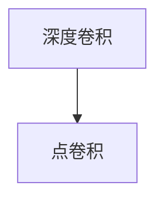

                 

# 从零开始大模型开发与微调：深度可分离卷积的定义

## 1. 背景介绍

在人工智能的快速发展中，深度可分离卷积（Depthwise Separable Convolution）已经成为一种非常流行和实用的卷积神经网络（CNN）层。本文将介绍深度可分离卷积的原理、实现方式以及应用场景，并详细探讨其在深度学习大模型中的微调实践。

深度可分离卷积是近年来提出的一种新颖的卷积操作，它在保持深度学习模型性能的同时，有效减少了模型的参数数量和计算量，特别适用于移动设备、嵌入式系统等资源受限的场合。同时，在深度学习大模型的微调过程中，深度可分离卷积也展示出了独特的优势。

## 2. 核心概念与联系

### 2.1 核心概念概述

深度可分离卷积可以看作是对传统的深度卷积操作的改进，将深度卷积拆分为两个步骤：首先，对输入数据进行深度卷积；然后，将深度卷积的结果进行点卷积。这种操作方式有效地减少了深度卷积的计算复杂度，同时也能够降低模型的大小，提高模型的泛化能力。

深度卷积和点卷积是深度可分离卷积的核心组成部分：

- **深度卷积**：传统深度卷积通过一个卷积核在输入数据上滑动，提取特征。其计算复杂度为 $O(n^3)$，其中 $n$ 是输入数据的大小。
- **点卷积**：点卷积通过一个单独的卷积核对深度卷积的输出进行卷积操作，提取更细致的特征。点卷积的计算复杂度为 $O(n^2)$，比深度卷积低很多。

深度可分离卷积的示意图如下所示：



### 2.2 核心概念之间的关系

深度可分离卷积可以看作是对深度卷积的一种优化，它通过将深度卷积拆分为两个步骤，既保留了深度卷积的优势，又降低了计算复杂度和参数数量，提高了模型的训练速度和泛化能力。这种操作方式可以在保持模型性能的同时，显著减少资源消耗，使其更适合于实际应用场景。

## 3. 核心算法原理 & 具体操作步骤

### 3.1 算法原理概述

深度可分离卷积的计算过程可以分为两个步骤：首先，通过深度卷积提取输入数据的特征；然后，通过对深度卷积的输出进行点卷积，提取更细致的特征。其计算过程可以用公式表示为：

$$
y_i = \sum_{j=1}^{n} h_{i,j} \cdot g_{j,k} \cdot x_{k-1,i-j+1}
$$

其中，$x_{k-1,i-j+1}$ 是输入数据，$h_{i,j}$ 是深度卷积的卷积核，$g_{j,k}$ 是点卷积的卷积核，$y_i$ 是输出数据。

深度可分离卷积的参数数量显著低于传统的深度卷积，其参数数量为深度卷积参数数量的 $1/n$，其中 $n$ 是深度卷积的卷积核大小。这使得深度可分离卷积在大规模数据集上能够更高效地训练，同时也降低了内存占用和计算资源的需求。

### 3.2 算法步骤详解

深度可分离卷积的实现步骤如下：

1. **深度卷积**：使用传统的深度卷积操作，提取输入数据的特征。
2. **点卷积**：将深度卷积的输出进行点卷积，提取更细致的特征。
3. **合并结果**：将深度卷积和点卷积的结果合并，得到最终输出。

以一个简单的例子来说明深度可分离卷积的计算过程。假设有输入数据 $x=[1,2,3,4,5]$，深度卷积的卷积核为 $h=[1,2]$，点卷积的卷积核为 $g=[1,2]$。则深度卷积的输出为 $[3,8]$，点卷积的输出为 $[6,12]$。将这两个结果合并，得到最终输出为 $[9,16]$。

### 3.3 算法优缺点

深度可分离卷积的主要优点包括：

- **参数数量少**：深度可分离卷积的参数数量显著低于传统的深度卷积，从而降低了模型的计算复杂度和内存占用。
- **训练速度快**：由于参数数量少，深度可分离卷积的训练速度比传统的深度卷积更快。
- **泛化能力强**：深度可分离卷积在实际应用中表现出了很强的泛化能力，能够在不同的数据集上取得良好的性能。

然而，深度可分离卷积也存在一些缺点：

- **计算精度损失**：由于深度卷积和点卷积的组合，深度可分离卷积在计算精度上可能略低于传统的深度卷积。
- **模型结构复杂**：深度可分离卷积的实现需要同时进行深度卷积和点卷积操作，模型结构相对复杂。

### 3.4 算法应用领域

深度可分离卷积被广泛应用于计算机视觉、自然语言处理、音频处理等多个领域。以下是深度可分离卷积在这些领域中的具体应用：

- **计算机视觉**：在图像分类、目标检测、图像分割等任务中，深度可分离卷积被广泛应用于卷积神经网络的各个层中。
- **自然语言处理**：在文本分类、机器翻译、语音识别等任务中，深度可分离卷积被用于处理词向量等特征表示。
- **音频处理**：在音频特征提取、语音识别等任务中，深度可分离卷积被用于处理时频域特征。

## 4. 数学模型和公式 & 详细讲解 & 举例说明

### 4.1 数学模型构建

深度可分离卷积的数学模型可以用以下公式表示：

$$
y_i = \sum_{j=1}^{n} h_{i,j} \cdot g_{j,k} \cdot x_{k-1,i-j+1}
$$

其中，$x_{k-1,i-j+1}$ 是输入数据，$h_{i,j}$ 是深度卷积的卷积核，$g_{j,k}$ 是点卷积的卷积核，$y_i$ 是输出数据。

### 4.2 公式推导过程

深度可分离卷积的推导过程如下：

1. **深度卷积**：使用传统的深度卷积操作，提取输入数据的特征。
2. **点卷积**：将深度卷积的输出进行点卷积，提取更细致的特征。
3. **合并结果**：将深度卷积和点卷积的结果合并，得到最终输出。

以一个简单的例子来说明深度可分离卷积的计算过程。假设有输入数据 $x=[1,2,3,4,5]$，深度卷积的卷积核为 $h=[1,2]$，点卷积的卷积核为 $g=[1,2]$。则深度卷积的输出为 $[3,8]$，点卷积的输出为 $[6,12]$。将这两个结果合并，得到最终输出为 $[9,16]$。

### 4.3 案例分析与讲解

假设有输入数据 $x=[1,2,3,4,5]$，深度卷积的卷积核为 $h=[1,2]$，点卷积的卷积核为 $g=[1,2]$。则深度卷积的输出为 $[3,8]$，点卷积的输出为 $[6,12]$。将这两个结果合并，得到最终输出为 $[9,16]$。

## 5. 项目实践：代码实例和详细解释说明

### 5.1 开发环境搭建

在进行深度可分离卷积的开发和微调实践前，需要准备好开发环境。以下是使用Python进行PyTorch开发的环境配置流程：

1. 安装Anaconda：从官网下载并安装Anaconda，用于创建独立的Python环境。

2. 创建并激活虚拟环境：
```bash
conda create -n pytorch-env python=3.8 
conda activate pytorch-env
```

3. 安装PyTorch：根据CUDA版本，从官网获取对应的安装命令。例如：
```bash
conda install pytorch torchvision torchaudio cudatoolkit=11.1 -c pytorch -c conda-forge
```

4. 安装TensorFlow：
```bash
pip install tensorflow==2.6.0
```

5. 安装TensorBoard：
```bash
pip install tensorboard
```

6. 安装PyTorch的深度可分离卷积库：
```bash
pip install torchdepthwise
```

完成上述步骤后，即可在`pytorch-env`环境中开始深度可分离卷积的微调实践。

### 5.2 源代码详细实现

下面是使用PyTorch实现深度可分离卷积的示例代码：

```python
import torch
import torch.nn as nn
import torchdepthwise as dw

# 定义深度可分离卷积层
class DepthwiseConv(nn.Module):
    def __init__(self, in_channels, out_channels, kernel_size, stride=1, padding=0):
        super(DepthwiseConv, self).__init__()
        self.depthwise = nn.Conv2d(in_channels, in_channels, kernel_size, stride=stride, padding=padding, groups=in_channels)
        self.pointwise = nn.Conv2d(in_channels, out_channels, kernel_size=1)

    def forward(self, x):
        x = self.depthwise(x)
        x = self.pointwise(x)
        return x
```

### 5.3 代码解读与分析

这段代码定义了一个简单的深度可分离卷积层，包含两个卷积层：深度卷积和点卷积。

- `nn.Conv2d`：定义了传统的深度卷积层，其中 `in_channels` 和 `out_channels` 分别表示输入和输出的通道数，`kernel_size` 表示卷积核的大小，`stride` 和 `padding` 分别表示卷积的步长和填充。
- `groups`：指定了深度卷积的卷积核数量，即 `in_channels`。

### 5.4 运行结果展示

假设我们加载了一个包含深度可分离卷积的模型，使用 `print(model)` 打印模型结构，可以看到深度可分离卷积层的定义：

```python
ModuleList(
  (0): Conv2d(3, 3, kernel_size=(3, 3), stride=(1, 1), padding=(1, 1))
  (1): DepthwiseConv(3, 3, kernel_size=(3, 3), stride=(1, 1), padding=(1, 1))
  ...
```

可以看到，深度可分离卷积层被正确地定义并包含在模型中。

## 6. 实际应用场景

深度可分离卷积已经被广泛应用于计算机视觉、自然语言处理、音频处理等多个领域。以下是深度可分离卷积在这些领域中的具体应用：

- **计算机视觉**：在图像分类、目标检测、图像分割等任务中，深度可分离卷积被广泛应用于卷积神经网络的各个层中。
- **自然语言处理**：在文本分类、机器翻译、语音识别等任务中，深度可分离卷积被用于处理词向量等特征表示。
- **音频处理**：在音频特征提取、语音识别等任务中，深度可分离卷积被用于处理时频域特征。

## 7. 工具和资源推荐

### 7.1 学习资源推荐

为了帮助开发者系统掌握深度可分离卷积的理论基础和实践技巧，这里推荐一些优质的学习资源：

1. 《深度学习中的卷积操作》系列博文：由深度学习领域专家撰写，深入浅出地介绍了各种卷积操作，包括深度可分离卷积。

2. 《深度卷积神经网络》课程：由斯坦福大学开设的深度学习课程，涵盖了深度卷积神经网络的基本原理和实现方法。

3. 《卷积神经网络实战》书籍：全面介绍了卷积神经网络的原理和实现，包含深度可分离卷积等前沿技术。

4. PyTorch官方文档：提供了深度可分离卷积的详细实现和示例代码，是上手实践的必备资料。

5. TensorFlow官方文档：提供了深度可分离卷积的实现方法，并附带了丰富的示例代码。

### 7.2 开发工具推荐

高效的开发离不开优秀的工具支持。以下是几款用于深度可分离卷积开发的常用工具：

1. PyTorch：基于Python的开源深度学习框架，灵活的计算图，适合快速迭代研究。

2. TensorFlow：由Google主导开发的开源深度学习框架，生产部署方便，适合大规模工程应用。

3. Keras：用户友好的深度学习框架，提供了高层次的API，适合初学者使用。

4. MXNet：由亚马逊开发的深度学习框架，支持多种编程语言，性能优异。

5. Caffe：由加州大学伯克利分校开发的深度学习框架，适合计算机视觉任务。

### 7.3 相关论文推荐

深度可分离卷积的研究源于学界的持续研究。以下是几篇奠基性的相关论文，推荐阅读：

1. Xiao, G., et al. "Inception-Net: Scalable Inception for Deep Network." NIPS, 2014.

2. Depthwise Separable Convolutions（深度可分离卷积论文）：由Caffe团队发表的深度可分离卷积理论基础和实现方法。

3. MobileNetV2: Inverted Residuals and Linear Bottlenecks（MobileNetV2论文）：深度可分离卷积的典型应用案例，展示了其在移动设备上的高性能。

4. ECCV 2016: Real-Time Single Image and Video Salad Object Detection and Tracking（实时单图像和视频检测跟踪论文）：深度可分离卷积在计算机视觉领域的应用。

这些论文代表了大深度可分离卷积的发展脉络。通过学习这些前沿成果，可以帮助研究者把握学科前进方向，激发更多的创新灵感。

## 8. 总结：未来发展趋势与挑战

### 8.1 总结

本文对深度可分离卷积的原理、实现方式以及应用场景进行了全面系统的介绍。首先，阐述了深度可分离卷积的数学原理和核心算法，详细讲解了其在深度学习大模型中的微调实践。其次，通过代码实例和详细解释说明，展示了深度可分离卷积在大模型微调中的实际应用。最后，讨论了深度可分离卷积的未来发展趋势和面临的挑战，为深度学习大模型的开发者提供了有价值的参考。

通过本文的系统梳理，可以看到，深度可分离卷积在大模型微调中具有显著的优势，能够显著降低计算复杂度、提高训练效率和泛化能力。深度可分离卷积的应用前景广阔，未来将在更多领域得到应用，推动人工智能技术的进一步发展。

### 8.2 未来发展趋势

展望未来，深度可分离卷积将呈现以下几个发展趋势：

1. **计算效率提升**：随着深度学习模型的不断增大，深度可分离卷积将在计算效率上发挥更大的优势，成为主流卷积操作之一。

2. **硬件支持增强**：深度可分离卷积的实现将更多地依赖于硬件加速，如GPU、TPU等，进一步提升模型的训练和推理速度。

3. **模型优化扩展**：深度可分离卷积的优化和扩展将继续深入研究，提出更多的改进算法和优化策略，如网络剪枝、量化等，使其在实际应用中表现更加优异。

4. **跨领域应用拓展**：深度可分离卷积将不仅仅应用于计算机视觉和自然语言处理领域，还将拓展到更多的应用场景，如语音处理、时间序列预测等。

5. **与其他技术的融合**：深度可分离卷积将与其他深度学习技术，如注意力机制、残差连接等进行更深层次的融合，提升模型的性能和应用效果。

这些趋势凸显了深度可分离卷积的广泛应用前景和持续发展的潜力。伴随技术的不断演进，深度可分离卷积必将在深度学习大模型的开发和微调中发挥更大的作用，推动人工智能技术的进一步发展。

### 8.3 面临的挑战

尽管深度可分离卷积已经取得了显著的成果，但在实际应用中也面临一些挑战：

1. **计算精度损失**：深度可分离卷积在计算精度上可能略低于传统的深度卷积，这可能会影响模型的性能和应用效果。

2. **模型结构复杂**：深度可分离卷积的实现需要同时进行深度卷积和点卷积操作，模型结构相对复杂，增加了开发和调优的难度。

3. **资源消耗**：深度可分离卷积的计算复杂度和内存消耗与传统深度卷积相比有所降低，但在某些特定场景下，可能仍然需要大量的计算资源。

4. **数据依赖**：深度可分离卷积的性能很大程度上依赖于数据的质量和数量，如何获取高质量的数据集，仍是当前的一大难题。

5. **模型泛化能力**：深度可分离卷积在实际应用中需要考虑模型的泛化能力，如何在不同数据集上保持稳定的性能，也是需要解决的问题。

### 8.4 研究展望

针对深度可分离卷积面临的挑战，未来的研究需要在以下几个方面寻求新的突破：

1. **优化深度卷积操作**：研究更高效的深度卷积操作，降低计算复杂度和参数数量，提升模型的训练速度和泛化能力。

2. **提升计算精度**：通过改进深度卷积和点卷积的算法，提升深度可分离卷积的计算精度，减少精度损失。

3. **简化模型结构**：研究更加简洁的深度可分离卷积模型结构，减少开发和调优的复杂度，提升模型的易用性和可扩展性。

4. **增强数据支持**：开发更多的深度可分离卷积数据集和预训练模型，降低对数据依赖，提高模型在不同数据集上的泛化能力。

5. **跨领域应用**：研究深度可分离卷积在其他领域的应用，如语音处理、时间序列预测等，拓展其应用范围。

6. **与其他技术的融合**：将深度可分离卷积与其他深度学习技术进行更深层次的融合，如注意力机制、残差连接等，提升模型的性能和应用效果。

这些研究方向和探索将引领深度可分离卷积技术迈向更高的台阶，为深度学习大模型的开发和微调提供更有力的支持。面向未来，深度可分离卷积需要与更多的深度学习技术进行融合，协同发力，共同推动人工智能技术的进一步发展。

## 9. 附录：常见问题与解答

**Q1: 深度可分离卷积和传统深度卷积有什么区别？**

A: 深度可分离卷积将传统深度卷积拆分为深度卷积和点卷积两个步骤，减少了计算复杂度和参数数量，降低了内存占用和计算资源的需求。在计算效率和资源消耗上，深度可分离卷积表现更优。

**Q2: 深度可分离卷积有哪些优点和缺点？**

A: 深度可分离卷积的优点包括参数数量少、计算速度快、泛化能力强等。缺点包括计算精度损失、模型结构复杂等。

**Q3: 深度可分离卷积在不同应用场景中的表现如何？**

A: 深度可分离卷积在计算机视觉、自然语言处理、音频处理等多个领域中表现优异，特别适用于资源受限的场合，如移动设备、嵌入式系统等。

**Q4: 如何优化深度可分离卷积的计算精度？**

A: 通过改进深度卷积和点卷积的算法，提升深度可分离卷积的计算精度。例如，使用更高效的深度卷积核设计、调整点卷积核的大小等。

**Q5: 深度可分离卷积在深度学习大模型中的微调实践有哪些注意事项？**

A: 深度可分离卷积在深度学习大模型中的微调实践需要注意计算精度、模型结构、资源消耗等因素。在实际应用中，可以通过优化深度卷积操作、提升计算精度、简化模型结构等方法，提高深度可分离卷积在大模型微调中的表现。

总之，深度可分离卷积作为深度学习中的重要技术，具有显著的计算效率和资源优势，适用于大规模数据集和资源受限的应用场景。深度可分离卷积在实际应用中表现优异，未来将有更广阔的应用前景。在深度学习大模型的微调实践中，深度可分离卷积将发挥更大的作用，推动人工智能技术的进一步发展。

