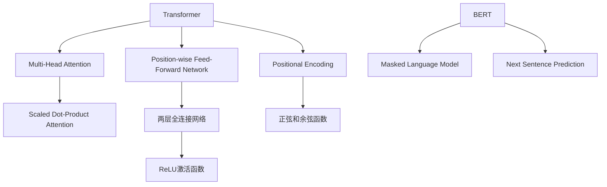
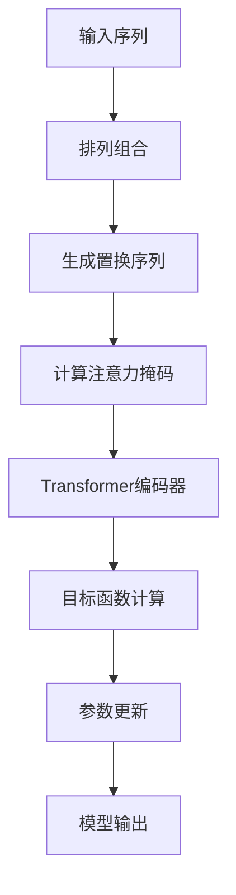

# XLNet原理与代码实例讲解

## 1. 背景介绍

### 1.1 问题的由来

在自然语言处理(NLP)领域,Transformer模型取得了巨大的成功,但它们在处理长序列时仍然存在一些挑战。传统的语言模型通常采用自回归(auto-regressive)方式,即按照文本序列的顺序从左到右生成单词,这种方法存在两个主要缺陷:

1. 上下文依赖性(Context Fragility):模型无法利用到目标单词右侧的上下文信息,导致生成的单词可能与右侧上下文不一致。

2. 计算效率低下:由于需要逐个单词生成,无法并行计算,在处理长序列时计算效率低下。

为了解决这些问题,谷歌大脑于2019年提出了XLNet(XL nets: Generalized Autoregressive Pretraining for Language Understanding)模型。

### 1.2 研究现状

XLNet模型的提出旨在克服传统语言模型的局限性,并在自然语言理解任务上取得更好的性能。XLNet通过一种新颖的自回归生成方式,能够利用双向上下文信息,同时支持并行计算,大大提高了计算效率。

在多项自然语言理解基准测试中,XLNet模型展现出了卓越的性能,在20项任务中,它超过了当时最先进的BERT模型。XLNet的出现为NLP领域带来了新的突破,引发了广泛的关注和研究。

### 1.3 研究意义

深入理解XLNet模型的原理和实现对于以下几个方面具有重要意义:

1. 理解新型自回归生成方式的优势,为设计更高效的语言模型提供新思路。

2. 掌握XLNet模型的核心算法和数学原理,为进一步优化和创新奠定基础。

3. 通过实践代码示例,加深对模型实现细节的理解,为部署应用做好准备。

4. 探索XLNet在各种NLP任务中的应用场景和效果,发现其潜力和局限性。

5. 把握XLNet模型的发展趋势和未来挑战,为NLP领域的持续创新指明方向。

### 1.4 本文结构

本文将全面深入地介绍XLNet模型的理论基础、核心算法、数学模型、代码实现和应用场景,内容安排如下:

- 核心概念与联系
- 核心算法原理与具体操作步骤
- 数学模型和公式详细讲解与案例分析
- 项目实践:代码实例和详细解释说明
- 实际应用场景
- 工具和资源推荐
- 总结:未来发展趋势与挑战
- 附录:常见问题与解答

## 2. 核心概念与联系

XLNet模型建立在Transformer的基础之上,并对其进行了创新改进。为了更好地理解XLNet,我们先简要回顾一下Transformer和BERT模型的核心概念。

上图展示了Transformer和BERT模型的一些核心组件:

1. **Transformer**:由多头注意力机制(Multi-Head Attention)、前馈神经网络(Position-wise Feed-Forward Network)和位置编码(Positional Encoding)组成。

2. **多头注意力机制**:包含多个缩放点积注意力(Scaled Dot-Product Attention),能够更好地捕获序列中不同位置的依赖关系。

3. **前馈神经网络**:由两层全连接网络和ReLU激活函数组成,对注意力的输出进行进一步处理。

4. **位置编码**:使用正弦和余弦函数为序列中的每个位置赋予唯一的位置表示。

5. **BERT**:基于Transformer编码器,引入了掩码语言模型(Masked Language Model)和下一句预测(Next Sentence Prediction)两个预训练任务。

XLNet模型在Transformer和BERT的基础上,提出了一种新颖的自回归生成方式,能够利用双向上下文信息,同时支持并行计算,从而克服了传统语言模型的局限性。接下来我们将深入探讨XLNet的核心算法原理。

## 3. 核心算法原理与具体操作步骤

### 3.1 算法原理概述

XLNet的核心算法是**置换语言模型**(Permutation Language Modeling),它通过最大化一个置换序列的概率来学习双向语境信息。具体来说,XLNet会对输入序列进行排列组合,生成多个置换序列,然后最大化这些置换序列的联合概率。

与传统语言模型按顺序生成单词不同,XLNet采用了一种新颖的自回归生成方式,能够利用目标单词两侧的上下文信息。这种方式不仅克服了上下文依赖性问题,而且支持并行计算,大大提高了计算效率。

算法的核心思想可以用下面的公式表示:

$$\begin{aligned}
\mathcal{L}_{\theta} &= \sum_{x} \log P_{\theta}(x) \
&= \sum_{x} \log \left(\sum_{\underline{z} \in \underline{Z}(x)} P_{\theta}(x, \underline{z})\right) \
&= \sum_{x} \log \left(\sum_{\underline{z} \in \underline{Z}(x)} \exp\left(f_{\theta}(x, \underline{z})\right)\right)
\end{aligned}$$

其中:

- $x$表示输入序列
- $\underline{Z}(x)$是序列$x$的所有可能排列
- $\underline{z}$是一个特定的排列序列
- $f_{\theta}(x, \underline{z})$是置换语言模型的得分函数,用于计算排列序列$\underline{z}$在给定$x$的条件下的对数概率

通过最大化所有可能排列序列的联合概率,XLNet能够同时利用目标单词左右两侧的上下文信息,避免了传统语言模型的上下文依赖性问题。

### 3.2 算法步骤详解

XLNet算法的具体实现步骤如下:

1. **输入序列**:将原始的输入序列$x$输入到模型中。

2. **排列组合**:对输入序列$x$进行全排列,生成所有可能的置换序列$\underline{Z}(x)$。

3. **生成置换序列**:从$\underline{Z}(x)$中随机采样一个置换序列$\underline{z}$。

4. **计算注意力掩码**:根据置换序列$\underline{z}$计算注意力掩码,确保每个位置只能关注其在$\underline{z}$中的有效上下文位置。

5. **Transformer编码器**:将置换序列$\underline{z}$和注意力掩码输入到Transformer编码器中,计算置换语言模型的得分函数$f_{\theta}(x, \underline{z})$。

6. **目标函数计算**:根据公式$\mathcal{L}_{\theta} = \sum_{x} \log \left(\sum_{\underline{z} \in \underline{Z}(x)} \exp\left(f_{\theta}(x, \underline{z})\right)\right)$计算目标函数。

7. **参数更新**:使用优化算法(如Adam)更新模型参数$\theta$,最小化目标函数$\mathcal{L}_{\theta}$。

8. **模型输出**:重复上述步骤,直到模型收敛,得到最终的XLNet模型。

通过上述步骤,XLNet能够有效地利用双向上下文信息,同时支持并行计算,从而克服了传统语言模型的局限性。

### 3.3 算法优缺点

**优点**:

1. **利用双向上下文**:通过置换语言模型,XLNet能够同时利用目标单词左右两侧的上下文信息,避免了传统语言模型的上下文依赖性问题。

2. **支持并行计算**:与传统语言模型按序生成单词不同,XLNet的生成方式支持并行计算,大大提高了计算效率。

3. **泛化能力强**:在多项自然语言理解基准测试中,XLNet展现出了卓越的性能,泛化能力强。

4. **灵活性高**:XLNet的置换语言模型思想可以应用于其他序列建模任务,如机器翻译、语音识别等。

**缺点**:

1. **计算开销大**:需要对输入序列进行全排列,计算开销较大,尤其是对于长序列。

2. **内存消耗高**:需要存储所有可能的置换序列,对内存消耗较高。

3. **训练时间长**:由于需要计算所有置换序列的联合概率,训练时间较长。

4. **数据噪声敏感**:对于含有噪声的数据,全排列可能会放大噪声的影响。

### 3.4 算法应用领域

XLNet算法主要应用于自然语言处理领域,尤其是在以下任务中表现出色:

1. **语言理解**:如文本分类、情感分析、问答系统等。

2. **机器翻译**:利用XLNet的双向上下文信息,可以提高翻译质量。

3. **文本生成**:如新闻自动撰写、对话系统、创作辅助等。

4. **信息抽取**:从非结构化文本中抽取关键信息,如命名实体识别、关系抽取等。

5. **语音识别**:将XLNet的思想应用于语音序列建模。

6. **其他序列建模任务**:如生物信息学序列分析、时间序列预测等。

总的来说,XLNet算法为自然语言处理和序列建模任务提供了一种新颖有效的解决方案,具有广阔的应用前景。

## 4. 数学模型和公式详细讲解与举例说明

### 4.1 数学模型构建

XLNet的数学模型建立在Transformer的基础之上,并引入了置换语言模型的思想。我们将从以下几个方面来构建XLNet的数学模型:

1. **注意力机制**
2. **置换语言模型**
3. **目标函数**

#### 4.1.1 注意力机制

XLNet继承了Transformer中的多头注意力机制,用于捕获序列中不同位置之间的依赖关系。对于一个查询向量$q$、键向量$k$和值向量$v$,缩放点积注意力的计算公式如下:

$$\mathrm{Attention}(q, k, v) = \mathrm{softmax}\left(\frac{qk^T}{\sqrt{d_k}}\right)v$$

其中$d_k$是缩放因子,用于防止点积过大导致梯度消失或爆炸。

多头注意力机制通过将查询、键和值投影到不同的子空间,并对每个子空间的注意力进行并行计算,从而捕获更丰富的依赖关系。具体计算公式如下:

$$\begin{aligned}
\mathrm{MultiHead}(Q, K, V) &= \mathrm{Concat}(head_1, \dots, head_h)W^O\
\text{where}\  head_i &= \mathrm{Attention}(QW_i^Q, KW_i^K, VW_i^V)
\end{aligned}$$

其中$W_i^Q$、$W_i^K$、$W_i^V$和$W^O$是可学习的投影矩阵。

#### 4.1.2 置换语言模型

置换语言模型是XLNet的核心创新,它通过对输入序列进行全排列,生成多个置换序列,然后最大化这些置换序列的联合概率,从而利用双向上下文信息。

设$x = (x_1, x_2, \dots, x_n)$为输入序列,其所有可能的排列组成集合$\underline{Z}(x)$。对于任意一个置换序列$\underline{z} = (z_1, z_2, \dots, z_n) \in \underline{Z}(x)$,我们定义其条件概率为:

$$P_{\theta}(x, \underline{z}) =