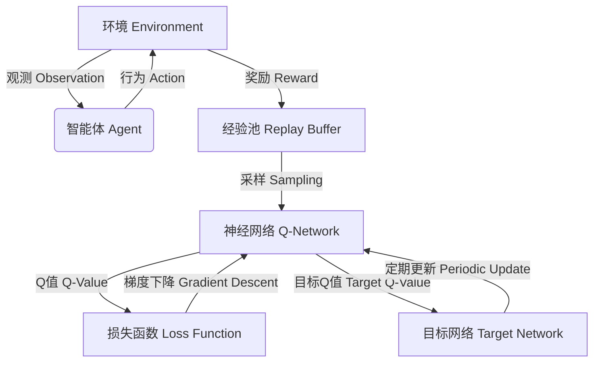

# 一切皆是映射：理解DQN的稳定性与收敛性问题

## 1. 背景介绍

### 1.1 问题的由来

强化学习(Reinforcement Learning, RL)是机器学习领域中一个极具挑战性的研究方向。与监督学习和无监督学习不同,强化学习的目标是让智能体(Agent)通过与环境(Environment)的交互来学习如何采取最优行为策略,从而最大化预期的累积奖励。

在传统的强化学习算法中,我们通常需要构建一个表格来存储每个状态-行为对应的价值函数(Value Function),这种方法在状态空间和行为空间较小的情况下是可行的。然而,对于复杂的问题,比如视频游戏、机器人控制等,状态空间和行为空间都是巨大的,这使得表格法变得不再实用。

为了解决这个问题,DeepMind在2013年提出了深度Q网络(Deep Q-Network, DQN),这是第一个将深度神经网络应用于强化学习的突破性工作。DQN使用深度神经网络来逼近Q函数,从而能够处理高维状态空间和连续行为空间。DQN在Atari游戏上取得了超越人类水平的成绩,引发了强化学习领域的深度学习革命。

### 1.2 研究现状

尽管DQN取得了巨大的成功,但它在训练过程中仍然存在一些稳定性和收敛性问题。这些问题主要源于以下几个方面:

1. **经验重播(Experience Replay)**: DQN采用了经验重播的技术,即将过去的经验存储在经验池(Replay Buffer)中,并在训练时随机从中采样数据进行训练。这种方法可以打破数据之间的相关性,提高数据利用率。但是,经验池中的数据分布会随着训练的进行而发生变化,这可能导致训练过程的不稳定性。

2. **目标网络(Target Network)**: 为了减小训练过程中的oscilations,DQN引入了目标网络的概念。目标网络是一个定期复制自主网络的副本,用于计算目标Q值。这种方法可以提高训练的稳定性,但同时也引入了新的超参数,如目标网络更新频率。

3. **探索与利用(Exploration-Exploitation Dilemma)**: 在强化学习中,智能体需要在探索(Exploration)和利用(Exploitation)之间寻求平衡。过多的探索会导致训练效率低下,而过多的利用则可能陷入次优解。DQN采用了$\epsilon$-greedy策略来解决这个问题,但是如何选择合适的$\epsilon$值并不是一个简单的问题。

4. **奖励函数(Reward Function)**: 奖励函数的设计对强化学习算法的性能有着重大影响。在复杂的环境中,设计一个合理的奖励函数本身就是一个挑战。DQN在Atari游戏中采用的是简单的分数奖励,但在其他领域可能需要更加精细的奖励函数设计。

### 1.3 研究意义

理解DQN的稳定性和收敛性问题,对于进一步改进和发展强化学习算法具有重要意义。通过深入分析DQN的训练过程,我们可以更好地理解神经网络在强化学习中的作用,并探索新的技术来提高算法的性能和稳定性。

此外,DQN作为一种基础算法,其稳定性和收敛性问题也反映了强化学习领域中的一些普遍挑战,如样本效率、探索与利用平衡、奖励函数设计等。通过解决DQN中的这些问题,我们可以为解决更广泛的强化学习问题提供启示和借鉴。

### 1.4 本文结构

本文将从以下几个方面深入探讨DQN的稳定性和收敛性问题:

1. 核心概念与联系
2. 核心算法原理与具体操作步骤
3. 数学模型和公式详细讲解与举例说明
4. 项目实践:代码实例和详细解释说明
5. 实际应用场景
6. 工具和资源推荐
7. 总结:未来发展趋势与挑战
8. 附录:常见问题与解答

## 2. 核心概念与联系

在探讨DQN的稳定性和收敛性问题之前,我们需要先了解一些核心概念和它们之间的联系。

### 2.1 强化学习基础

强化学习是一种基于环境交互的学习范式,其目标是让智能体(Agent)通过与环境(Environment)的交互来学习如何采取最优行为策略,从而最大化预期的累积奖励。

强化学习问题可以形式化为一个马尔可夫决策过程(Markov Decision Process, MDP),它由以下几个要素组成:

- 状态空间(State Space) $\mathcal{S}$
- 行为空间(Action Space) $\mathcal{A}$
- 转移概率(Transition Probability) $\mathcal{P}_{ss'}^a = \Pr(s_{t+1}=s'|s_t=s,a_t=a)$
- 奖励函数(Reward Function) $\mathcal{R}_s^a = \mathbb{E}[r_{t+1}|s_t=s,a_t=a]$
- 折扣因子(Discount Factor) $\gamma \in [0, 1]$

在强化学习中,我们希望找到一个最优策略(Optimal Policy) $\pi^*$,使得在该策略下,智能体可以获得最大的预期累积奖励:

$$
\pi^* = \arg\max_\pi \mathbb{E}_\pi \left[ \sum_{t=0}^\infty \gamma^t r_t \right]
$$

为了找到最优策略,我们可以通过估计状态-行为对的价值函数(Value Function)来指导智能体的行为选择。价值函数可分为状态价值函数(State-Value Function)和行为价值函数(Action-Value Function):

- 状态价值函数 $V^\pi(s) = \mathbb{E}_\pi \left[ \sum_{t=0}^\infty \gamma^t r_t | s_0 = s \right]$
- 行为价值函数 $Q^\pi(s, a) = \mathbb{E}_\pi \left[ \sum_{t=0}^\infty \gamma^t r_t | s_0 = s, a_0 = a \right]$

状态价值函数和行为价值函数之间存在着以下关系:

$$
V^\pi(s) = \sum_{a \in \mathcal{A}} \pi(a|s) Q^\pi(s, a)
$$

$$
Q^\pi(s, a) = \mathcal{R}_s^a + \gamma \sum_{s' \in \mathcal{S}} \mathcal{P}_{ss'}^a V^\pi(s')
$$

通过估计行为价值函数 $Q^\pi(s, a)$,我们可以得到一个贪婪策略(Greedy Policy) $\pi'$,使得对于任意状态 $s$,都有 $\pi'(s) = \arg\max_a Q^\pi(s, a)$。在某些条件下,这个贪婪策略就是最优策略 $\pi^*$。

### 2.2 深度Q网络(DQN)

深度Q网络(Deep Q-Network, DQN)是第一个将深度神经网络应用于强化学习的突破性工作。DQN的核心思想是使用一个深度神经网络来逼近行为价值函数 $Q^\pi(s, a)$,从而解决高维状态空间和连续行为空间的问题。

在DQN中,我们定义一个参数化的神经网络 $Q(s, a; \theta)$ 来逼近真实的行为价值函数 $Q^\pi(s, a)$,其中 $\theta$ 表示神经网络的参数。我们的目标是通过最小化损失函数来优化神经网络参数 $\theta$,使得 $Q(s, a; \theta)$ 尽可能接近 $Q^\pi(s, a)$。

DQN采用的损失函数为:

$$
\mathcal{L}(\theta) = \mathbb{E}_{(s, a, r, s') \sim U(\mathcal{D})} \left[ \left( r + \gamma \max_{a'} Q(s', a'; \theta^-) - Q(s, a; \theta) \right)^2 \right]
$$

其中:

- $(s, a, r, s')$ 是从经验池 $\mathcal{D}$ 中均匀采样的一个转移样本
- $\theta^-$ 表示目标网络的参数,用于计算目标Q值
- $\gamma$ 是折扣因子

通过最小化这个损失函数,我们可以使得 $Q(s, a; \theta)$ 逼近期望的Q值 $r + \gamma \max_{a'} Q(s', a'; \theta^-)$。

为了提高训练的稳定性,DQN引入了几种关键技术:

1. **经验重播(Experience Replay)**: 将过去的经验存储在经验池 $\mathcal{D}$ 中,并在训练时随机从中采样数据进行训练,以打破数据之间的相关性,提高数据利用率。

2. **目标网络(Target Network)**: 引入一个目标网络 $Q(s, a; \theta^-)$,它是一个定期复制自主网络的副本,用于计算目标Q值。这种方法可以减小训练过程中的oscilations。

3. **$\epsilon$-greedy策略**: 在选择行为时,以概率 $\epsilon$ 随机选择一个行为(探索),以概率 $1-\epsilon$ 选择当前Q值最大的行为(利用)。这种策略可以在探索和利用之间寻求平衡。

虽然DQN取得了巨大的成功,但它在训练过程中仍然存在一些稳定性和收敛性问题,这些问题主要源于经验重播、目标网络、探索与利用平衡以及奖励函数设计等方面。在后续章节中,我们将详细探讨这些问题及其解决方案。

## 3. 核心算法原理与具体操作步骤

### 3.1 算法原理概述

DQN算法的核心原理可以概括为以下几个方面:

1. **价值函数逼近**: 使用深度神经网络 $Q(s, a; \theta)$ 来逼近真实的行为价值函数 $Q^\pi(s, a)$,从而解决高维状态空间和连续行为空间的问题。

2. **经验重播**: 将过去的经验存储在经验池 $\mathcal{D}$ 中,并在训练时随机从中采样数据进行训练,以打破数据之间的相关性,提高数据利用率。

3. **目标网络**: 引入一个目标网络 $Q(s, a; \theta^-)$,它是一个定期复制自主网络的副本,用于计算目标Q值。这种方法可以减小训练过程中的oscilations。

4. **$\epsilon$-greedy策略**: 在选择行为时,以概率 $\epsilon$ 随机选择一个行为(探索),以概率 $1-\epsilon$ 选择当前Q值最大的行为(利用)。这种策略可以在探索和利用之间寻求平衡。

5. **损失函数最小化**: 通过最小化损失函数 $\mathcal{L}(\theta)$,使得神经网络 $Q(s, a; \theta)$ 逼近期望的Q值 $r + \gamma \max_{a'} Q(s', a'; \theta^-)$。

上图展示了DQN算法的核心流程。智能体与环境进行交互,将经验存储在经验池中。然后从经验池中采样数据,输入到Q网络中计算Q值。通过与目标网络计算的目标Q值之间的差异,构建损失函数并进行梯度下降优化Q网络的参数。目标网络会定期从Q网络复制参数,以保持训练的稳定性。

### 3.2 算法步骤详解

DQN算法的具体步骤如下:

1. **初始化**:
   - 初始化Q网络 $Q(s, a; \theta)$ 和目标网络 $Q(s, a; \theta^-)$,两个网络的参数初始相同
   - 初始化经验池 $\mathcal{D}$ 为空
   - 初始化探索率 $\epsilon$

2. **观测初始状态**:
   - 从环