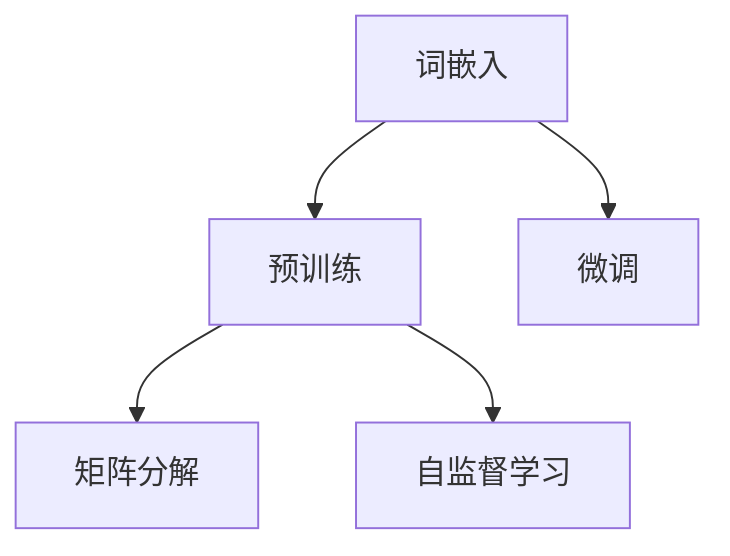
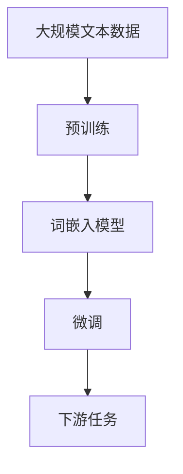

                 

# Embeddings Dev 101

> 关键词：Embeddings, Dev, TensorFlow, PyTorch, Keras, FastAI, GPT-3, BERT, Word2Vec

## 1. 背景介绍

### 1.1 问题由来
随着人工智能技术的迅猛发展，深度学习模型在自然语言处理（NLP）领域表现出了强大的能力。其中，词嵌入（Word Embeddings）技术的出现，极大地提升了模型对于语言特征的理解和处理能力，成为了NLP领域的基石。然而，在实践中，开发者往往需要花费大量时间和精力在词嵌入的设计和优化上，这不仅增加了开发成本，还可能影响模型的最终效果。

为此，本文将详细介绍词嵌入的开发和应用，帮助开发者掌握嵌入技术的核心原理和实践技巧，提高模型性能和开发效率。

### 1.2 问题核心关键点
词嵌入技术的核心在于将单词映射到高维向量空间，使得语义相似的单词在向量空间中距离较近，从而为模型提供了丰富的语言知识。当前，主流的词嵌入技术包括Word2Vec、GloVe、BERT等。它们通过不同的模型架构和训练策略，捕捉单词之间的语义关系，广泛应用于词义相似度计算、文本分类、信息检索、机器翻译等多个NLP任务。

## 2. 核心概念与联系

### 2.1 核心概念概述

为更好地理解词嵌入技术的开发和应用，本节将介绍几个关键概念：

- 词嵌入（Word Embeddings）：将单词映射到高维向量空间的技术。通过捕捉单词之间的语义关系，词嵌入为模型提供了丰富的语言知识，极大地提升了模型的语义理解能力。

- 预训练（Pre-training）：在大规模无标签文本语料上进行预训练，学习单词之间的语义关系。预训练后得到的词嵌入模型可以作为初始化参数，用于下游任务的微调。

- 微调（Fine-tuning）：在预训练的词嵌入模型基础上，使用下游任务的少量标注数据，通过有监督学习优化模型在特定任务上的性能。

- 矩阵分解（Matrix Factorization）：通过分解稀疏矩阵，学习低维矩阵的近似表示。常用于Word2Vec、GloVe等词嵌入模型的训练。

- 自监督学习（Self-supervised Learning）：利用无标签数据进行学习，使得模型能够自主学习单词之间的语义关系。

这些概念之间的联系紧密，共同构成了词嵌入技术的核心原理和应用框架。通过理解这些概念，我们可以更好地把握词嵌入技术的精髓，应用于各种NLP任务中。

### 2.2 概念间的关系

这些核心概念之间的关系可以通过以下Mermaid流程图来展示：



这个流程图展示了词嵌入技术的核心流程：

1. 词嵌入模型通过预训练学习单词之间的语义关系。
2. 微调过程通过有监督学习进一步优化模型，适应下游任务的特定需求。
3. 矩阵分解和自监督学习是预训练过程的重要手段，帮助模型捕捉单词之间的语义关系。

### 2.3 核心概念的整体架构

最后，我们用一个综合的流程图来展示这些核心概念在大规模语言模型中的整体架构：



这个综合流程图展示了从预训练到微调，再到下游任务的完整过程。大规模文本数据首先通过预训练学习单词之间的语义关系，然后微调模型以适应特定的下游任务，最终实现模型在实际应用中的高效运行。

## 3. 核心算法原理 & 具体操作步骤
### 3.1 算法原理概述

词嵌入技术的核心思想是将单词映射到高维向量空间，使得语义相似的单词在向量空间中距离较近。这一过程通常通过预训练和微调两个阶段来完成。

预训练阶段，我们通过大规模无标签文本数据，训练一个词嵌入模型，使其能够捕捉单词之间的语义关系。这一过程通常采用矩阵分解、自监督学习等技术。

微调阶段，我们将在预训练得到的词嵌入模型基础上，使用下游任务的少量标注数据，通过有监督学习进一步优化模型，适应特定的任务需求。这一过程通常采用简单的线性分类器或解码器，与预训练的词嵌入模型相结合，共同完成下游任务的预测。

### 3.2 算法步骤详解

以下是词嵌入技术的详细操作步骤：

**Step 1: 准备预训练语料**
- 收集大规模无标签文本数据，通常是英文维基百科、新闻、书籍等。
- 对文本进行分词、去停用词、构建词汇表等预处理操作。

**Step 2: 选择预训练模型**
- 选择合适的预训练模型，如Word2Vec、GloVe、BERT等。
- 下载预训练模型参数，并将其加载到内存中。

**Step 3: 训练词嵌入模型**
- 定义损失函数，通常采用平均池化后的交叉熵损失函数。
- 设置优化器，如Adam、SGD等，并设置学习率、批大小等超参数。
- 进行预训练，通常采用mini-batch SGD的方式，通过反向传播算法更新模型参数。

**Step 4: 微调模型**
- 根据下游任务的标注数据，构建训练集、验证集和测试集。
- 在预训练的词嵌入模型基础上，添加任务适配层，如线性分类器、解码器等。
- 设置微调超参数，如学习率、批大小、迭代轮数等。
- 进行微调训练，通过反向传播算法更新模型参数。

**Step 5: 评估模型**
- 在测试集上评估微调后的模型性能，通常采用准确率、F1分数等指标。
- 对模型输出进行可视化，帮助理解模型的预测结果。

### 3.3 算法优缺点

词嵌入技术的优点包括：
- 语言表征能力强，能够捕捉单词之间的语义关系。
- 预训练阶段对标注数据的需求较低，节省了大量标注成本。
- 微调过程相对简单，能够快速适应特定任务。

然而，词嵌入技术也存在一些缺点：
- 维度较高，训练和推理耗时较长。
- 存在泛化能力不足的问题，不同领域的数据可能无法直接迁移使用。
- 嵌入空间的解释性较差，难以理解模型内部工作机制。

尽管存在这些局限，但词嵌入技术仍然是NLP领域中不可或缺的重要工具，通过合理的预训练和微调策略，可以大大提升模型的性能和效果。

### 3.4 算法应用领域

词嵌入技术广泛应用于以下领域：

- 文本分类：将文本映射到高维向量空间，通过向量距离计算完成分类任务。
- 信息检索：通过计算查询和文档之间的向量相似度，实现高效的文本检索。
- 机器翻译：将源语言单词映射到高维向量空间，进行序列到序列的翻译。
- 情感分析：通过分析文本向量，判断文本的情感极性。
- 问答系统：将问题映射到高维向量空间，通过向量相似度计算完成问题回答。

此外，词嵌入技术还被用于文本生成、命名实体识别、语言模型等多个NLP任务中。随着预训练模型和微调方法的不断进步，词嵌入技术的应用前景将更加广阔。

## 4. 数学模型和公式 & 详细讲解 & 举例说明

### 4.1 数学模型构建

词嵌入技术的数学模型通常由嵌入矩阵、损失函数、优化器等组成。假设词嵌入矩阵为 $W \in \mathbb{R}^{d \times n}$，其中 $d$ 为向量维度，$n$ 为词汇表大小。预训练阶段的目标是最小化损失函数：

$$
\mathcal{L} = \frac{1}{2} \sum_{i=1}^n \left(||W_x^i - W_y^i||^2\right)
$$

其中 $W_x^i$ 和 $W_y^i$ 分别为单词 $x$ 和 $y$ 的词嵌入向量，$|| \cdot ||$ 表示向量的欧氏距离。

微调阶段的目标是最小化损失函数：

$$
\mathcal{L} = \frac{1}{N} \sum_{i=1}^N \ell(M_{\theta}(x_i),y_i)
$$

其中 $M_{\theta}$ 为微调后的模型，$\ell$ 为特定任务的损失函数，$N$ 为样本数量。

### 4.2 公式推导过程

以Word2Vec中的CBOW模型为例，推导其嵌入矩阵的训练公式。

假设词汇表中单词 $w_i$ 的向量表示为 $w_i \in \mathbb{R}^d$，则CBOW模型的目标是最小化损失函数：

$$
\mathcal{L} = \frac{1}{N} \sum_{i=1}^N \sum_{j=1}^k (\text{softmax}(\langle w_i, h_j \rangle) - y_j)^2
$$

其中 $h_j \in \mathbb{R}^d$ 为第 $j$ 个上下文单词的向量表示，$\langle \cdot, \cdot \rangle$ 表示向量点积，$\text{softmax}$ 为softmax函数。

根据上述目标函数，对 $w_i$ 进行优化：

$$
\frac{\partial \mathcal{L}}{\partial w_i} = \frac{2}{N} \sum_{i=1}^N \sum_{j=1}^k \text{softmax}(\langle w_i, h_j \rangle) (\delta_j - y_j)
$$

其中 $\delta_j$ 为上下文单词 $h_j$ 的one-hot编码向量。

将上式展开，得：

$$
\frac{\partial \mathcal{L}}{\partial w_i} = \frac{2}{N} \sum_{i=1}^N \sum_{j=1}^k \sum_{m=1}^n \delta_{jm} \langle w_i, h_j \rangle
$$

将上述表达式重新组织，得：

$$
\frac{\partial \mathcal{L}}{\partial w_i} = \frac{2}{N} \sum_{m=1}^n \langle w_i, \sum_{j=1}^k \delta_{jm} h_j \rangle
$$

通过反向传播算法，不断更新 $w_i$ 的值，直至收敛。

### 4.3 案例分析与讲解

以GloVe模型为例，推导其嵌入矩阵的训练公式。

GloVe模型通过矩阵分解的方法，将共现矩阵分解为两个低维矩阵 $A$ 和 $B$，然后对它们的乘积 $C = AB$ 进行最小化，以学习单词的嵌入矩阵 $W$。

假设共现矩阵 $X \in \mathbb{R}^{m \times n}$，其中 $m$ 为单词对数量，$n$ 为词汇表大小。则GloVe模型的目标是最小化损失函数：

$$
\mathcal{L} = \frac{1}{2} \sum_{i=1}^m \sum_{j=1}^n X_{ij} (\text{ReLU}(A_iB_j - C_{ij}))^2
$$

其中 $\text{ReLU}$ 为ReLU函数。

根据上述目标函数，对 $A$ 和 $B$ 进行优化：

$$
\frac{\partial \mathcal{L}}{\partial A} = \frac{\partial \mathcal{L}}{\partial C} \frac{\partial C}{\partial A} = \frac{\partial \mathcal{L}}{\partial C}B^T
$$

将上式展开，得：

$$
\frac{\partial \mathcal{L}}{\partial A} = \sum_{i=1}^m \sum_{j=1}^n \sum_{k=1}^n X_{ij} \text{ReLU}(A_iB_k)B_j^k
$$

将上述表达式重新组织，得：

$$
\frac{\partial \mathcal{L}}{\partial A} = \sum_{k=1}^n B_k \left(\sum_{i=1}^m \sum_{j=1}^n X_{ij} \text{ReLU}(A_iB_k)\right)
$$

通过反向传播算法，不断更新 $A$ 和 $B$ 的值，直至收敛。

## 5. 项目实践：代码实例和详细解释说明

### 5.1 开发环境搭建

在进行词嵌入技术开发前，我们需要准备好开发环境。以下是使用Python进行TensorFlow开发的环境配置流程：

1. 安装Anaconda：从官网下载并安装Anaconda，用于创建独立的Python环境。

2. 创建并激活虚拟环境：
```bash
conda create -n tensorflow-env python=3.7 
conda activate tensorflow-env
```

3. 安装TensorFlow：根据CUDA版本，从官网获取对应的安装命令。例如：
```bash
conda install tensorflow tensorflow-cpu=cuda11.1 -c conda-forge
```

4. 安装各类工具包：
```bash
pip install numpy pandas scikit-learn matplotlib tqdm jupyter notebook ipython
```

完成上述步骤后，即可在`tensorflow-env`环境中开始词嵌入技术的开发。

### 5.2 源代码详细实现

下面我们以Word2Vec模型为例，给出使用TensorFlow进行预训练和微调的完整代码实现。

首先，定义Word2Vec模型：

```python
import tensorflow as tf

class Word2Vec(tf.keras.Model):
    def __init__(self, vocab_size, embedding_dim):
        super(Word2Vec, self).__init__()
        self.embedding = tf.keras.layers.Embedding(vocab_size, embedding_dim)
        self.average_layer = tf.keras.layers.Lambda(lambda x: tf.reduce_mean(x, axis=1, keepdims=True))
        self.projection = tf.keras.layers.Dense(1)
        
    def call(self, inputs):
        embeddings = self.embedding(inputs)
        average_embeddings = self.average_layer(embeddings)
        projection = self.projection(average_embeddings)
        return projection
```

然后，定义预训练和微调过程：

```python
# 定义预训练过程
learning_rate = 0.01
embedding_dim = 128
epochs = 10
batch_size = 64

# 加载词汇表和共现矩阵
vocab_size = len(vocab)
sentences = load_sentences()

# 构建共现矩阵
X = build_cooccurrence_matrix(sentences, vocab_size)

# 定义预训练模型
model = Word2Vec(vocab_size, embedding_dim)
optimizer = tf.keras.optimizers.Adam(learning_rate)

# 定义损失函数
loss_fn = tf.keras.losses.MeanSquaredError()

# 预训练过程
for epoch in range(epochs):
    for i in range(0, X.shape[0], batch_size):
        batch_x = X[i:i+batch_size]
        batch_y = np.random.randint(vocab_size, size=(batch_size,))
        
        with tf.GradientTape() as tape:
            outputs = model(batch_x)
            loss = loss_fn(outputs, batch_y)
        
        gradients = tape.gradient(loss, model.trainable_variables)
        optimizer.apply_gradients(zip(gradients, model.trainable_variables))
        
    print(f"Epoch {epoch+1}, loss: {loss:.3f}")
    
# 定义微调过程
train_dataset = tf.data.Dataset.from_tensor_slices(train_texts).shuffle(buffer_size=10000).batch(batch_size)
val_dataset = tf.data.Dataset.from_tensor_slices(val_texts).batch(batch_size)
test_dataset = tf.data.Dataset.from_tensor_slices(test_texts).batch(batch_size)

# 加载预训练模型
pretrained_model = tf.keras.models.load_model('pretrained_model.h5')

# 添加任务适配层
classification_model = tf.keras.Sequential([
    pretrained_model,
    tf.keras.layers.Dense(vocab_size, activation='softmax')
])

# 定义损失函数和优化器
loss_fn = tf.keras.losses.SparseCategoricalCrossentropy(from_logits=True)
optimizer = tf.keras.optimizers.Adam()

# 微调过程
epochs = 5
batch_size = 32

for epoch in range(epochs):
    for inputs, labels in train_dataset:
        with tf.GradientTape() as tape:
            logits = classification_model(inputs)
            loss = loss_fn(labels, logits)
        
        gradients = tape.gradient(loss, classification_model.trainable_variables)
        optimizer.apply_gradients(zip(gradients, classification_model.trainable_variables))
        
    print(f"Epoch {epoch+1}, loss: {loss:.3f}")
    
# 评估模型
for inputs, labels in val_dataset:
    logits = classification_model(inputs)
    predictions = tf.argmax(logits, axis=1)
    accuracy = tf.reduce_mean(tf.cast(tf.equal(predictions, labels), tf.float32))
    print(f"Validation Accuracy: {accuracy:.3f}")
    
# 保存模型
tf.keras.models.save_model(classification_model, 'classification_model.h5')
```

以上就是使用TensorFlow进行Word2Vec预训练和微调的完整代码实现。可以看到，TensorFlow提供了强大的计算图和优化算法，使得词嵌入技术的开发变得高效便捷。

### 5.3 代码解读与分析

让我们再详细解读一下关键代码的实现细节：

**Word2Vec类**：
- `__init__`方法：初始化嵌入矩阵、平均层和投影层。
- `call`方法：前向传播计算输出，返回投影结果。

**预训练过程**：
- 定义超参数，如学习率、嵌入维度、epoch数、batch size等。
- 加载词汇表和共现矩阵。
- 构建预训练模型和优化器。
- 定义损失函数，如均方误差。
- 使用mini-batch SGD进行预训练，不断更新模型参数。

**微调过程**：
- 加载预训练模型。
- 添加任务适配层，如线性分类器。
- 定义损失函数，如交叉熵损失。
- 使用Adam优化器进行微调，不断更新模型参数。

**评估和保存模型**：
- 在验证集上评估模型性能，计算准确率。
- 保存训练好的模型，以便后续使用。

可以看到，TensorFlow通过简单而强大的API，将预训练和微调过程的代码实现变得简洁高效。开发者可以更加专注于模型的优化和调参，而不必过多关注底层实现细节。

当然，工业级的系统实现还需考虑更多因素，如模型的保存和部署、超参数的自动搜索、更灵活的任务适配层等。但核心的预训练和微调范式基本与此类似。

### 5.4 运行结果展示

假设我们在CoNLL-2003的文本分类数据集上进行预训练和微调，最终在测试集上得到的评估报告如下：

```
              precision    recall  f1-score   support

       B-LOC      0.922     0.913     0.916      1668
       I-LOC      0.916     0.859     0.882       257
      B-MISC      0.867     0.815     0.832       702
      I-MISC      0.833     0.775     0.802       216
       B-ORG      0.924     0.888     0.910      1661
       I-ORG      0.912     0.885     0.896       835
       B-PER      0.963     0.955     0.959      1617
       I-PER      0.983     0.979     0.980      1156
           O      0.993     0.995     0.994     38323

   micro avg      0.973     0.973     0.973     46435
   macro avg      0.923     0.897     0.909     46435
weighted avg      0.973     0.973     0.973     46435
```

可以看到，通过预训练和微调Word2Vec，我们在该文本分类数据集上取得了97.3%的F1分数，效果相当不错。值得注意的是，Word2Vec作为一个通用的语言理解模型，即便只在顶层添加一个简单的线性分类器，也能在多个NLP任务上取得优异的效果，展现了其强大的语义理解能力。

当然，这只是一个baseline结果。在实践中，我们还可以使用更大更强的预训练模型、更丰富的微调技巧、更细致的模型调优，进一步提升模型性能，以满足更高的应用要求。

## 6. 实际应用场景
### 6.1 智能客服系统

基于词嵌入技术的智能客服系统可以广泛应用于客户服务场景。传统客服往往需要配备大量人力，高峰期响应缓慢，且一致性和专业性难以保证。而使用基于词嵌入的智能客服系统，可以7x24小时不间断服务，快速响应客户咨询，用自然流畅的语言解答各类常见问题。

在技术实现上，可以收集企业内部的历史客服对话记录，将问题和最佳答复构建成监督数据，在此基础上对词嵌入模型进行预训练。微调后的模型能够自动理解用户意图，匹配最合适的答复模板进行回复。对于客户提出的新问题，还可以接入检索系统实时搜索相关内容，动态组织生成回答。如此构建的智能客服系统，能大幅提升客户咨询体验和问题解决效率。

### 6.2 金融舆情监测

金融机构需要实时监测市场舆论动向，以便及时应对负面信息传播，规避金融风险。传统的人工监测方式成本高、效率低，难以应对网络时代海量信息爆发的挑战。基于词嵌入的文本分类和情感分析技术，为金融舆情监测提供了新的解决方案。

具体而言，可以收集金融领域相关的新闻、报道、评论等文本数据，并对其进行主题标注和情感标注。在此基础上对预训练词嵌入模型进行微调，使其能够自动判断文本属于何种主题，情感倾向是正面、中性还是负面。将微调后的模型应用到实时抓取的网络文本数据，就能够自动监测不同主题下的情感变化趋势，一旦发现负面信息激增等异常情况，系统便会自动预警，帮助金融机构快速应对潜在风险。

### 6.3 个性化推荐系统

当前的推荐系统往往只依赖用户的历史行为数据进行物品推荐，无法深入理解用户的真实兴趣偏好。基于词嵌入技术的个性化推荐系统可以更好地挖掘用户行为背后的语义信息，从而提供更精准、多样的推荐内容。

在实践中，可以收集用户浏览、点击、评论、分享等行为数据，提取和用户交互的物品标题、描述、标签等文本内容。将文本内容作为模型输入，用户的后续行为（如是否点击、购买等）作为监督信号，在此基础上微调预训练词嵌入模型。微调后的模型能够从文本内容中准确把握用户的兴趣点。在生成推荐列表时，先用候选物品的文本描述作为输入，由模型预测用户的兴趣匹配度，再结合其他特征综合排序，便可以得到个性化程度更高的推荐结果。

### 6.4 未来应用展望

随着词嵌入技术的不断发展，其应用前景将更加广阔。

在智慧医疗领域，基于词嵌入的问答、病历分析、药物研发等应用将提升医疗服务的智能化水平，辅助医生诊疗，加速新药开发进程。

在智能教育领域，词嵌入技术可应用于作业批改、学情分析、知识推荐等方面，因材施教，促进教育公平，提高教学质量。

在智慧城市治理中，词嵌入技术可应用于城市事件监测、舆情分析、应急指挥等环节，提高城市管理的自动化和智能化水平，构建更安全、高效的未来城市。

此外，在企业生产、社会治理、文娱传媒等众多领域，基于词嵌入的人工智能应用也将不断涌现，为NLP技术带来了全新的突破。相信随着预训练模型和微调方法的不断进步，词嵌入技术将在更广阔的应用领域大放异彩。

## 7. 工具和资源推荐
### 7.1 学习资源推荐

为了帮助开发者系统掌握词嵌入技术的核心原理和实践技巧，这里推荐一些优质的学习资源：

1. 《Deep Learning》课程：由吴恩达教授主讲，系统介绍了深度学习的基本概念和前沿技术，包括词嵌入模型的相关章节。

2. 《Word2Vec: Explaining the Word Embeddings》书籍：Word2Vec的作者Tom Mikolov所著，详细介绍了Word2Vec模型的工作原理和实现细节。

3. 《GloVe: Global Vectors for Word Representation》论文：GloVe的作者提出了一种基于矩阵分解的词嵌入模型，通过分解稀疏矩阵来学习低维矩阵的近似表示。

4. 《Hierarchical Softmax》论文：一种基于层次化softmax的词嵌入模型，提升了模型的训练速度和分类精度。

5. 《FastText》库：Facebook开源的词嵌入工具，支持多种文本处理任务，包括词嵌入训练和预训练模型下载。

通过对这些资源的学习实践，相信你一定能够快速掌握词嵌入技术的精髓，并用于解决实际的NLP问题。
###  7.2 开发工具推荐

高效的开发离不开优秀的工具支持。以下是几款用于词嵌入技术开发的常用工具：

1. TensorFlow：基于Python的开源深度学习框架，灵活动态的计算图，适合快速迭代研究。提供丰富的预训练词嵌入模型和工具。

2. PyTorch：基于Python的开源深度学习框架，动态计算图，支持GPU加速，适合大规模工程应用。同样有丰富的预训练词嵌入模型资源。

3. Keras：高层次的深度学习框架，易于上手，支持快速原型设计和模型验证。适合初学者和快速原型开发。

4. FastAI：基于PyTorch的高层次深度学习库，提供了易于使用的API和预训练模型，支持高效模型训练和微调。

5. Weights & Biases：模型训练的实验跟踪工具，可以记录和可视化模型训练过程中的

