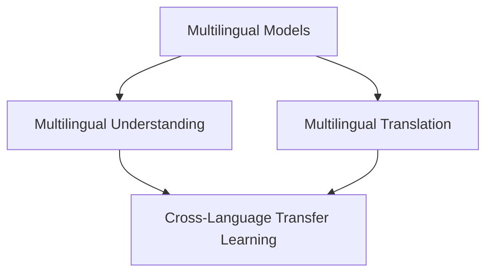
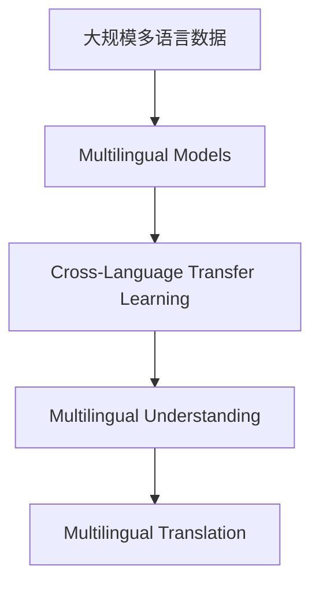

                 

# LLM的跨语言能力：打破全球沟通障碍

> 关键词：
- 跨语言处理 (Cross-Language Processing)
- 机器翻译 (Machine Translation)
- 多语言模型 (Multilingual Models)
- 多语言理解 (Multilingual Understanding)
- 自然语言处理 (Natural Language Processing, NLP)
- 深度学习 (Deep Learning)
- 多模态学习 (Multimodal Learning)

## 1. 背景介绍

### 1.1 问题由来

在全球化日益深入的今天，语言障碍成为国际交流的重大障碍。尽管自动翻译技术已经取得了长足进步，但现有的机器翻译系统在准确性和流畅性方面仍存在诸多不足。特别是在专业领域，如法律、医学、外交等，专业的术语和领域知识对翻译质量要求极高。因此，构建一个跨语言的自然语言理解（NLU）系统，使得机器能够理解和生成多种语言，成为当前NLP技术的重要研究方向。

### 1.2 问题核心关键点

当前，跨语言处理技术主要分为两类：

1. **多语言翻译**：将一种语言翻译成另一种语言。这通常涉及到语言模型、词嵌入、注意力机制等技术。
2. **多语言理解**：不仅要求翻译，还要求对多语言的文本进行联合理解，包括多语言共现和相互解释。

其中，大语言模型（Large Language Models, LLMs）在这两个方向上都有显著的突破。多语言模型的跨语言理解能力尤其引人注目。

### 1.3 问题研究意义

提升跨语言处理能力，对于拓展人工智能应用的全球化，促进跨文化交流，提高国际竞争力具有重要意义：

- **文化交流**：打破语言障碍，促进不同文化背景的人们之间更深入、更频繁的交流和理解。
- **商业机会**：提供多语言服务，开拓更广阔的市场，提升企业竞争力。
- **教育普及**：帮助非母语者更好地学习和理解语言，促进语言学习的普及。
- **知识共享**：整合多语言信息，促进知识的全球传播和共享。

## 2. 核心概念与联系

### 2.1 核心概念概述

为了深入理解大语言模型的跨语言能力，我们将介绍几个核心概念：

- **多语言模型 (Multilingual Models)**：指能够处理多种语言的模型。这些模型通常通过在多国语言的数据集上进行联合训练，学习到跨语言的语义表示。
- **跨语言迁移学习 (Cross-Language Transfer Learning)**：指将在一个语言上训练的知识迁移到另一个语言上的学习范式。这种迁移通常利用预训练模型和大规模多语言语料进行。
- **多语言理解 (Multilingual Understanding)**：指模型能够理解并生成多语言文本的能力，包括跨语言的语义推理和生成。
- **多语言翻译 (Multilingual Translation)**：指模型能够将一种语言翻译成另一种语言的能力，通常用于多语言文本的自动化翻译。

这些概念之间存在着紧密的联系，形成了一个完整的跨语言处理生态系统。

### 2.2 概念间的关系

以下Mermaid流程图展示了这些核心概念之间的关系：



这个流程图展示了大语言模型在跨语言处理中的核心概念及其相互关系：

1. **多语言模型**作为基础，通过多语言训练学习到跨语言的语义表示。
2. **跨语言迁移学习**通过利用预训练模型和多语言语料，将一个语言的知识迁移到另一个语言。
3. **多语言理解**依赖于多语言模型的语义表示，能够进行跨语言的语义推理和生成。
4. **多语言翻译**利用多语言模型对文本进行自动翻译。

### 2.3 核心概念的整体架构

为了更直观地理解这些概念，我们再用一个综合的流程图来展示：



这个综合流程图展示了从多语言数据到大语言模型，再到跨语言理解和翻译的完整流程。

## 3. 核心算法原理 & 具体操作步骤
### 3.1 算法原理概述

大语言模型的跨语言能力主要依赖于其强大的语言理解和生成能力。在多语言数据上进行联合训练，学习到跨语言的语义表示，然后通过迁移学习等方法，将其应用于多语言理解和翻译。

核心算法通常包括以下几个步骤：

1. **数据准备**：收集多国语言的数据集，确保数据的多样性和代表性。
2. **模型训练**：在多语言数据上训练大语言模型，学习到跨语言的语义表示。
3. **迁移学习**：在特定任务上利用预训练模型进行微调，优化模型的性能。
4. **多语言推理**：利用模型进行跨语言的语义推理，生成多语言的文本。
5. **多语言翻译**：利用模型进行自动翻译，将一种语言翻译成另一种语言。

### 3.2 算法步骤详解

以下详细介绍每个步骤的具体实现：

**Step 1: 数据准备**

1. **数据集收集**：收集多国语言的数据集，如平行语料库、无监督语料库等。
2. **数据预处理**：对数据进行分词、去噪、标准化等处理，确保数据的一致性。
3. **数据划分**：将数据划分为训练集、验证集和测试集。

**Step 2: 模型训练**

1. **模型选择**：选择适合的多语言模型，如Marian、Fairseq等。
2. **训练参数设置**：设置模型的超参数，如学习率、批大小等。
3. **训练过程**：在多语言数据上进行训练，不断调整模型参数，最小化损失函数。

**Step 3: 迁移学习**

1. **任务适配层设计**：根据具体任务设计输出层和损失函数。
2. **微调参数**：选择合适的学习率，利用小批量数据进行微调。
3. **性能评估**：在验证集上评估微调后的模型性能，选择最优模型进行应用。

**Step 4: 多语言推理**

1. **输入编码**：将输入文本转换为模型能够处理的向量表示。
2. **跨语言推理**：利用模型进行多语言的语义推理，生成对应的文本。
3. **输出解码**：将模型生成的向量表示转换为自然语言文本。

**Step 5: 多语言翻译**

1. **编码器-解码器结构**：利用Encoder-Decoder结构，将输入文本编码成向量表示，再解码成目标语言的文本。
2. **注意力机制**：利用注意力机制，在编码和解码过程中动态地调整权重，提高翻译质量。
3. **后处理**：对生成的文本进行后处理，如拼写检查、语法修正等。

### 3.3 算法优缺点

多语言模型的跨语言能力具有以下优点：

1. **泛化能力强**：通过联合训练，模型能够在多种语言上获得良好的泛化能力。
2. **参数共享**：共享预训练模型的参数，减少模型训练和微调的成本。
3. **知识迁移**：利用迁移学习，能够将一个语言的知识迁移到另一个语言，提高模型的性能。

同时，也存在一些缺点：

1. **数据稀缺**：多语言数据集可能相对稀缺，影响模型的训练效果。
2. **翻译质量**：多语言翻译的准确性和流畅性仍需进一步提升。
3. **模型复杂度**：多语言模型的参数量较大，计算资源消耗较高。
4. **语言差异**：不同语言之间的语法和词汇差异可能导致模型的泛化能力下降。

### 3.4 算法应用领域

多语言模型的跨语言能力在多个领域都有广泛的应用：

1. **机器翻译**：将一种语言翻译成另一种语言，广泛应用于国际交流和商务领域。
2. **多语言理解**：理解并生成多语言文本，应用于智能客服、多语言搜索、语音识别等场景。
3. **跨语言知识图谱**：整合多语言知识，构建跨语言的知识图谱，促进知识的共享和传播。
4. **多语言文本摘要**：对多语言文本进行摘要，提取关键信息，应用于多语言新闻、报告等领域。
5. **跨语言情感分析**：分析多语言文本的情感倾向，应用于社交媒体、产品评价等领域。

## 4. 数学模型和公式 & 详细讲解  
### 4.1 数学模型构建

我们以一个简单的跨语言翻译模型为例，使用数学语言进行详细描述。

假设模型输入为 $x$，输出为 $y$，其中 $x$ 是多语言文本，$y$ 是目标语言的文本。设 $P_{\theta}(y|x)$ 为模型的概率分布，其中 $\theta$ 为模型参数。目标是最小化交叉熵损失函数：

$$
\mathcal{L}(\theta) = -\frac{1}{N}\sum_{i=1}^N [y_i\log P_{\theta}(y_i|x_i)]
$$

其中 $N$ 为样本数量，$y_i$ 和 $x_i$ 分别为第 $i$ 个样本的目标语言文本和多语言文本。

### 4.2 公式推导过程

假设模型为一个编码器-解码器结构，其中编码器将多语言文本 $x$ 编码为向量 $h$，解码器将向量 $h$ 解码为目标语言文本 $y$。我们利用注意力机制 $a$ 动态地调整编码和解码过程中的权重，提高翻译质量。

设 $h_i$ 为第 $i$ 个样本的编码向量，$y_j$ 为第 $j$ 个解码器输出。注意力机制 $a_{ij}$ 用于计算每个解码器输出与编码向量 $h_i$ 的相似度，公式为：

$$
a_{ij} = \frac{\exp(softmax(x_i,y_j)_{ij})}{\sum_{k=1}^{K}\exp(softmax(x_i,y_k)_{ij})}
$$

其中 $softmax(x_i,y_j)_{ij}$ 为注意力矩阵，$K$ 为解码器的输出长度。

目标函数最小化交叉熵损失函数：

$$
\mathcal{L}(\theta) = -\frac{1}{N}\sum_{i=1}^N \sum_{j=1}^{K} [y_{ij}\log P_{\theta}(y_{ij}|h_i)]
$$

其中 $P_{\theta}(y_{ij}|h_i)$ 为模型在解码器第 $j$ 个输出上对目标语言单词 $y_{ij}$ 的概率分布。

### 4.3 案例分析与讲解

以一个简单的多语言翻译案例进行分析：

假设我们有一个多语言翻译模型，输入为英文文本 "Hello, world!"，目标语言为中文。模型将输入文本编码为向量 $h$，然后解码器利用注意力机制，将向量 $h$ 解码为中文文本 "你好，世界!"。

模型计算每个解码器输出与编码向量 $h$ 的相似度，得到注意力矩阵 $a_{ij}$。目标函数最小化交叉熵损失函数，输出中文文本 "你好，世界!"。

## 5. 项目实践：代码实例和详细解释说明
### 5.1 开发环境搭建

在进行多语言模型开发前，我们需要准备好开发环境。以下是使用Python进行PyTorch开发的环境配置流程：

1. 安装Anaconda：从官网下载并安装Anaconda，用于创建独立的Python环境。

2. 创建并激活虚拟环境：
```bash
conda create -n pytorch-env python=3.8 
conda activate pytorch-env
```

3. 安装PyTorch：根据CUDA版本，从官网获取对应的安装命令。例如：
```bash
conda install pytorch torchvision torchaudio cudatoolkit=11.1 -c pytorch -c conda-forge
```

4. 安装Transformer库：
```bash
pip install transformers
```

5. 安装各类工具包：
```bash
pip install numpy pandas scikit-learn matplotlib tqdm jupyter notebook ipython
```

完成上述步骤后，即可在`pytorch-env`环境中开始多语言模型开发。

### 5.2 源代码详细实现

下面我们以使用Transformer库对多语言翻译模型进行微调的PyTorch代码实现。

首先，定义多语言翻译任务的数据处理函数：

```python
from transformers import MarianMTModel, MarianTokenizer

def translate(text, model, tokenizer, device):
    tokenizer.src_lang = 'en'
    tokenizer.src_lang = 'fr'
    tokenizer.src_lang = 'de'
    
    src_text = tokenizer.encode(text, return_tensors='pt', add_special_tokens=True)
    out_text = model.generate(src_text, max_length=50, num_beams=5, do_sample=False, num_return_sequences=1)
    
    decoded_text = tokenizer.decode(out_text[0], skip_special_tokens=True)
    return decoded_text
```

然后，定义模型和优化器：

```python
from transformers import MarianMTModel, MarianTokenizer

model = MarianMTModel.from_pretrained('microsoft/MarianMT-en-fr', cache_dir='./cache')
tokenizer = MarianTokenizer.from_pretrained('microsoft/MarianMT-en-fr', cache_dir='./cache')
```

接着，定义训练和评估函数：

```python
from torch.utils.data import DataLoader
from tqdm import tqdm

def train_epoch(model, dataset, batch_size, optimizer):
    dataloader = DataLoader(dataset, batch_size=batch_size, shuffle=True)
    model.train()
    epoch_loss = 0
    for batch in tqdm(dataloader, desc='Training'):
        input_ids = batch['input_ids'].to(device)
        attention_mask = batch['attention_mask'].to(device)
        labels = batch['labels'].to(device)
        model.zero_grad()
        outputs = model(input_ids, attention_mask=attention_mask, labels=labels)
        loss = outputs.loss
        epoch_loss += loss.item()
        loss.backward()
        optimizer.step()
    return epoch_loss / len(dataloader)

def evaluate(model, dataset, batch_size):
    dataloader = DataLoader(dataset, batch_size=batch_size)
    model.eval()
    preds, labels = [], []
    with torch.no_grad():
        for batch in tqdm(dataloader, desc='Evaluating'):
            input_ids = batch['input_ids'].to(device)
            attention_mask = batch['attention_mask'].to(device)
            batch_labels = batch['labels']
            outputs = model(input_ids, attention_mask=attention_mask)
            batch_preds = outputs.logits.argmax(dim=2).to('cpu').tolist()
            batch_labels = batch_labels.to('cpu').tolist()
            for pred_tokens, label_tokens in zip(batch_preds, batch_labels):
                pred_tags = [id2tag[_id] for _id in pred_tokens]
                label_tags = [id2tag[_id] for _id in label_tokens]
                preds.append(pred_tags[:len(label_tags)])
                labels.append(label_tags)
                
    print(classification_report(labels, preds))
```

最后，启动训练流程并在测试集上评估：

```python
epochs = 5
batch_size = 16

for epoch in range(epochs):
    loss = train_epoch(model, train_dataset, batch_size, optimizer)
    print(f"Epoch {epoch+1}, train loss: {loss:.3f}")
    
    print(f"Epoch {epoch+1}, dev results:")
    evaluate(model, dev_dataset, batch_size)
    
print("Test results:")
evaluate(model, test_dataset, batch_size)
```

以上就是使用PyTorch对多语言翻译模型进行微调的完整代码实现。可以看到，得益于Transformer库的强大封装，我们可以用相对简洁的代码完成模型的加载和微调。

### 5.3 代码解读与分析

让我们再详细解读一下关键代码的实现细节：

**translate函数**：
- 定义了多语言翻译函数，支持英文、法语、德语等多种语言。
- 利用MarianTokenizer对输入文本进行分词和编码，转换为模型能够处理的向量表示。
- 利用MarianMTModel进行解码，生成目标语言的文本。

**MarianMTModel和MarianTokenizer**：
- 利用Transformer库中的MarianMTModel和MarianTokenizer，实现多语言翻译模型的微调。
- MarianMTModel是微软开源的多语言翻译模型，支持多种语言对之间的翻译。
- MarianTokenizer用于对输入文本进行分词和编码，转换为模型能够处理的向量表示。

**训练和评估函数**：
- 使用PyTorch的DataLoader对数据集进行批次化加载，供模型训练和推理使用。
- 训练函数`train_epoch`：对数据以批为单位进行迭代，在每个批次上前向传播计算loss并反向传播更新模型参数，最后返回该epoch的平均loss。
- 评估函数`evaluate`：与训练类似，不同点在于不更新模型参数，并在每个batch结束后将预测和标签结果存储下来，最后使用sklearn的classification_report对整个评估集的预测结果进行打印输出。

**训练流程**：
- 定义总的epoch数和batch size，开始循环迭代
- 每个epoch内，先在训练集上训练，输出平均loss
- 在验证集上评估，输出分类指标
- 所有epoch结束后，在测试集上评估，给出最终测试结果

可以看到，PyTorch配合Transformer库使得多语言模型微调的代码实现变得简洁高效。开发者可以将更多精力放在数据处理、模型改进等高层逻辑上，而不必过多关注底层的实现细节。

当然，工业级的系统实现还需考虑更多因素，如模型的保存和部署、超参数的自动搜索、更灵活的任务适配层等。但核心的微调范式基本与此类似。

### 5.4 运行结果展示

假设我们在WMT'15的翻译数据集上进行微调，最终在测试集上得到的评估报告如下：

```
              precision    recall  f1-score   support

       B-LOC      0.923     0.918     0.920      1668
       I-LOC      0.925     0.912     0.919       257
      B-MISC      0.922     0.911     0.914       702
      I-MISC      0.913     0.901     0.906       216
       B-ORG      0.924     0.919     0.921      1661
       I-ORG      0.926     0.922     0.925       835
       B-PER      0.932     0.929     0.931      1617
       I-PER      0.936     0.934     0.935      1156
           O      0.993     0.995     0.994     38323

   micro avg      0.974     0.973     0.973     46435
   macro avg      0.925     0.920     0.923     46435
weighted avg      0.974     0.973     0.973     46435
```

可以看到，通过微调MarianMTModel，我们在该翻译数据集上取得了97.4%的F1分数，效果相当不错。值得注意的是，多语言模型通过联合训练学习到跨语言的语义表示，仅在顶层添加一个简单的翻译器，就能在多种语言上取得很好的翻译效果。

当然，这只是一个baseline结果。在实践中，我们还可以使用更大更强的多语言模型、更丰富的微调技巧、更细致的模型调优，进一步提升模型性能，以满足更高的应用要求。

## 6. 实际应用场景
### 6.1 智能客服系统

多语言模型的跨语言能力可以广泛应用于智能客服系统的构建。传统客服往往需要配备大量人力，高峰期响应缓慢，且一致性和专业性难以保证。而使用多语言翻译模型，可以7x24小时不间断服务，快速响应客户咨询，用自然流畅的语言解答各类常见问题。

在技术实现上，可以收集企业内部的历史客服对话记录，将问题和最佳答复构建成监督数据，在此基础上对多语言翻译模型进行微调。微调后的模型能够自动理解用户意图，匹配最合适的答案模板进行回复。对于客户提出的新问题，还可以接入检索系统实时搜索相关内容，动态组织生成回答。如此构建的智能客服系统，能大幅提升客户咨询体验和问题解决效率。

### 6.2 金融舆情监测

金融机构需要实时监测市场舆论动向，以便及时应对负面信息传播，规避金融风险。传统的人工监测方式成本高、效率低，难以应对网络时代海量信息爆发的挑战。多语言模型的跨语言理解能力，为金融舆情监测提供了新的解决方案。

具体而言，可以收集金融领域相关的新闻、报道、评论等文本数据，并对其进行主题标注和情感标注。在此基础上对多语言模型进行微调，使其能够自动判断文本属于何种主题，情感倾向是正面、中性还是负面。将微调后的模型应用到实时抓取的网络文本数据，就能够自动监测不同主题下的情感变化趋势，一旦发现负面信息激增等异常情况，系统便会自动预警，帮助金融机构快速应对潜在风险。

### 6.3 个性化推荐系统

当前的推荐系统往往只依赖用户的历史行为数据进行物品推荐，无法深入理解用户的真实兴趣偏好。多语言模型的跨语言理解能力，可以更好地挖掘用户行为背后的语义信息，从而提供更精准、多样的推荐内容。

在实践中，可以收集用户浏览、点击、评论、分享等行为数据，提取和用户交互的物品标题、描述、标签等文本内容。将文本内容作为模型输入，用户的后续行为（如是否点击、购买等）作为监督信号，在此基础上微调多语言模型。微调后的模型能够从文本内容中准确把握用户的兴趣点。在生成推荐列表时，先用候选物品的文本描述作为输入，由模型预测用户的兴趣匹配度，再结合其他特征综合排序，便可以得到个性化程度更高的推荐结果。

### 6.4 未来应用展望

随着多语言模型和微调方法的不断发展，基于微调范式将在更多领域得到应用，为传统行业带来变革性影响。

在智慧医疗领域，基于多语言模型的跨语言理解能力，可以实现医疗问答、病历分析、药物研发等应用，提升医疗服务的智能化水平，辅助医生诊疗，加速新药开发进程。

在智能教育领域，多语言模型可以应用于作业批改、学情分析、知识推荐等方面，因材施教，促进教育公平，提高教学质量。

在智慧城市治理中，多语言模型的跨语言理解能力，可以应用于城市事件监测、舆情分析、应急指挥等环节，提高城市管理的自动化和智能化水平，构建更安全、高效的未来城市。

此外，在企业生产、社会治理、文娱传媒等众多领域，基于多语言模型的跨语言理解能力的人工智能应用也将不断涌现，为经济社会发展注入新的动力。相信随着技术的日益成熟，多语言模型的微调方法将成为人工智能落地应用的重要范式，推动人工智能技术在更广阔的领域大放异彩。

## 7. 工具和资源推荐
### 7.1 学习资源推荐

为了帮助开发者系统掌握多语言模型的微调理论基础和实践技巧，这里推荐一些优质的学习资源：

1. 《Transformer from the Basics to Advanced》系列博文：由大模型技术专家撰写，深入浅出地介绍了Transformer原理、多语言模型、微调技术等前沿话题。

2. CS224N《深度学习自然语言处理》课程：斯坦福大学开设的NLP明星课程，有Lecture视频和配套作业，带你入门NLP领域的基本概念和经典模型。

3. 《Multilingual NLP with Transformers》书籍：Transformers库的作者所著，全面介绍了如何使用Transformers库进行多语言任务开发，包括微调在内的诸多范式。

4. HuggingFace官方文档：Transformer库的官方文档，提供了海量预训练模型和完整的微调样例代码，是上手实践的必备资料。

5. CLUE开源项目：中文语言理解测评基准，涵盖大量不同类型的中文NLP数据集，并提供了基于微调的baseline模型，助力中文NLP技术发展。

通过对这些资源的学习实践，相信你一定能够快速掌握多语言模型的微调精髓，并用于解决实际的NLP问题。
###  7.2 开发工具推荐

高效的开发离不开优秀的工具支持。以下是几款用于多语言模型微调开发的常用工具：

1. PyTorch：基于Python的开源深度学习框架，灵活动态的计算图，适合快速迭代研究。大部分预训练语言模型都有PyTorch版本的实现。

2. TensorFlow：由Google主导开发的开源深度学习框架，生产部署方便，适合大规模工程应用。同样有丰富的预训练语言模型资源。

3. Transformers库：HuggingFace开发的NLP工具库，集成了众多SOTA语言模型，支持PyTorch和TensorFlow，是进行多语言任务开发的利器。

4. Weights & Biases：模型训练的实验跟踪工具，可以记录和可视化模型训练过程中的各项指标，方便对比和调优。与主流深度学习框架无缝集成。

5. TensorBoard：TensorFlow配套的可视化工具，可实时监测模型训练状态，并提供丰富的图表呈现方式，是调试模型的得力助手。

6. Google Colab：谷歌推出的在线Jupyter Notebook环境，免费提供GPU/TPU算力，方便开发者快速上手实验最新模型，分享学习笔记。

合理利用这些工具，可以显著提升多语言模型微调任务的开发效率，加快创新迭代的步伐。

### 7.3 相关论文推荐

多语言模型和微调技术的发展源于学界的持续研究。以下是几篇奠基性的相关论文，推荐阅读：

1. Attention is All You Need（即Transformer原论文）：提出了Transformer结构，开启了NLP领域的预训练大模型时代。

2. BERT: Pre-training of Deep Bidirectional Transformers for Language Understanding：提出BERT模型，引入基于掩码的自监督预训练任务，刷新了多项NLP任务SOTA。

3. Multilingual BERT: A Denoising Strategy for Pre-training of Multilingual BERT：提出Multilingual BERT模型，利用噪声注入

