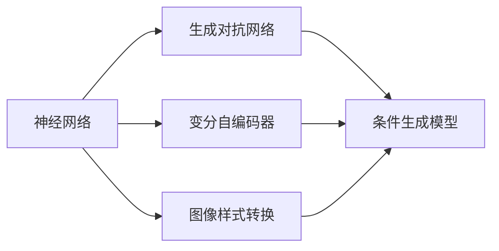
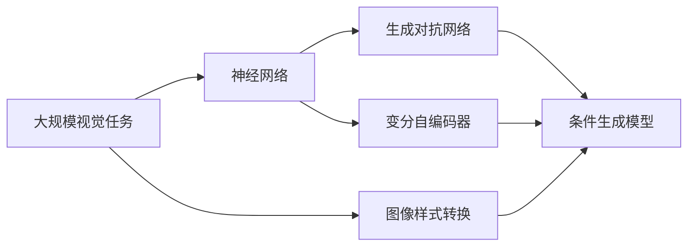

                 

# 图像生成 (Image Generation)

> 关键词：图像生成, 神经网络, 深度学习, 生成对抗网络, 图像样式转换, 风格迁移, 艺术创作

## 1. 背景介绍

### 1.1 问题由来

图像生成（Image Generation）是人工智能领域内一个备受瞩目的研究方向，它的目标是通过机器学习模型，从噪声、文本描述、类别标签等输入生成高质量的图像。在计算机视觉领域，图像生成技术广泛应用于图像生成、图像编辑、虚拟现实、自动驾驶、游戏设计等多个方面。近年来，随着深度学习技术的飞速发展，特别是神经网络和生成对抗网络（GAN）的突破性进展，图像生成技术取得了显著的进步。

### 1.2 问题核心关键点

图像生成技术的研究核心在于如何从低维输入高效生成高维图像。一般而言，图像生成方法可以大致分为两类：基于像素级的生成方法，如像素生成网络（PixelRNN）、变分自编码器（VAE）等；以及基于样本级的生成方法，如生成对抗网络（GAN）、变分自编码器（VAE）的变体等。

基于像素级的生成方法，如PixelRNN，主要通过逐像素生成图像，但这种方法生成速度慢，难以处理高分辨率图像。

基于样本级的生成方法，如GAN，通过构建一个包含生成器和判别器的对抗网络，生成器试图生成能够欺骗判别器的假图像，判别器则试图区分真实和假图像。这种方法生成速度较快，可以处理高分辨率图像，但生成的图像质量和多样性受训练过程的影响较大。

### 1.3 问题研究意义

图像生成技术不仅在视觉艺术创作、图像处理、游戏设计等领域有着广泛应用，还在数据增强、医学影像生成等实际问题中发挥着重要作用。例如，在医疗影像领域，生成对抗网络（GAN）可以用于生成高质量的合成影像，用于疾病诊断和手术模拟；在自动驾驶中，生成对抗网络（GAN）可以用于生成虚拟道路场景，提高模拟训练的效果。此外，图像生成技术还在虚拟现实（VR）、增强现实（AR）等新兴领域展现出巨大的应用潜力。

## 2. 核心概念与联系

### 2.1 核心概念概述

图像生成技术涉及的核心概念主要包括：

- 神经网络（Neural Network）：深度学习的基础框架，用于实现高维数据的复杂非线性映射。
- 生成对抗网络（GAN）：一种生成模型，通过两个对抗的神经网络，生成器试图生成能够欺骗判别器的假图像，判别器则试图区分真实和假图像。
- 变分自编码器（VAE）：一种生成模型，通过学习数据分布的参数化表示，实现从噪声生成图像。
- 条件生成模型：利用外部信息（如文本描述、类别标签等）对图像生成过程进行控制。
- 图像样式转换：将一张图片转换为指定风格的另一张图片，如风格迁移。

这些核心概念通过一系列的数学和算法原理，构建起图像生成技术的理论框架和实践方法。

### 2.2 概念间的关系

这些核心概念之间的逻辑关系可以通过以下Mermaid流程图来展示：



这个流程图展示了大规模视觉任务中常用的生成模型之间的关系：

1. 神经网络是图像生成技术的基础框架，提供了强大的非线性映射能力。
2. 生成对抗网络（GAN）和变分自编码器（VAE）是两种主要的生成模型，可以用于从噪声生成图像，并且都能实现条件生成。
3. 图像样式转换（如风格迁移）可以通过生成对抗网络（GAN）和变分自编码器（VAE）来实现。
4. 条件生成模型利用神经网络和生成对抗网络（GAN）的结构，可以在生成图像时引入外部信息，实现更加灵活的图像生成。

### 2.3 核心概念的整体架构

最后，我们用一个综合的流程图来展示这些核心概念在大规模视觉任务中的应用：



这个综合流程图展示了在大规模视觉任务中，神经网络、生成对抗网络（GAN）、变分自编码器（VAE）和条件生成模型共同构成的生成技术架构，以及它们在图像生成、样式转换等具体应用中的作用。

## 3. 核心算法原理 & 具体操作步骤

### 3.1 算法原理概述

图像生成算法的主要目标是，从输入（如噪声、文本描述、类别标签等）生成高质量的图像。这一过程通常通过训练一个生成模型来实现，常见的生成模型包括生成对抗网络（GAN）和变分自编码器（VAE）。

生成对抗网络（GAN）由两个神经网络组成：一个生成器网络，用于从噪声生成图像；一个判别器网络，用于区分真实和假图像。生成器和判别器通过对抗训练不断优化，最终生成器生成的图像逼近真实图像，判别器无法区分真实和假图像。

变分自编码器（VAE）则是通过学习数据分布的参数化表示，实现从噪声生成图像。VAE通过编码器和解码器两个神经网络实现，编码器将图像映射为潜在表示（也称为 latent space），解码器则将潜在表示映射回图像空间。

### 3.2 算法步骤详解

#### 3.2.1 生成对抗网络（GAN）

1. **初始化生成器和判别器**：随机初始化生成器（生成网络）和判别器（判别网络）的权重参数。
2. **对抗训练**：在每一轮训练中，生成器从噪声中生成一批图像，判别器尝试将这些图像与真实图像区分开来。训练判别器时，使用真实图像和生成的图像作为输入，输出为真实图像的标签和生成的图像的伪标签。训练生成器时，使用判别器对图像的判别结果作为生成器损失函数的输入，使得生成器能够生成更好的图像。
3. **更新权重参数**：根据损失函数梯度更新生成器和判别器的权重参数。
4. **重复迭代**：重复执行步骤2和3，直到生成器生成的图像质量接近真实图像，或者达到预设的迭代次数。

#### 3.2.2 变分自编码器（VAE）

1. **初始化编码器和解码器**：随机初始化编码器和解码器的权重参数。
2. **训练编码器**：通过将图像输入编码器，学习图像的潜在表示（潜在空间），使得潜在表示能够表示图像的概率分布。
3. **训练解码器**：通过将潜在表示输入解码器，学习如何将潜在表示映射回图像。
4. **更新权重参数**：根据损失函数梯度更新编码器和解码器的权重参数。
5. **重复迭代**：重复执行步骤2和3，直到编码器和解码器生成高质量的图像。

### 3.3 算法优缺点

#### 生成对抗网络（GAN）

**优点**：

- 能够生成高质量、多样化的图像。
- 生成速度较快，可以处理高分辨率图像。

**缺点**：

- 训练过程不稳定，容易发生模式崩溃（mode collapse）现象，即生成器只生成少量样本。
- 生成器输出的图像质量受训练过程的影响较大。
- 模型复杂度高，训练成本大。

#### 变分自编码器（VAE）

**优点**：

- 能够生成高质量、多样的图像。
- 训练过程稳定，生成器生成的图像分布与真实图像分布相似。
- 生成器输出的图像质量较为稳定，受训练过程的影响较小。

**缺点**：

- 生成器输出的图像可能存在模糊不清、不自然等问题。
- 模型复杂度较高，训练成本大。
- 生成的图像分布可能与真实图像分布有较大差异。

### 3.4 算法应用领域

图像生成技术在多个领域具有广泛应用：

- **计算机视觉**：图像生成技术在图像处理、计算机视觉任务中应用广泛，如图像去噪、图像超分辨率、图像修复等。
- **艺术创作**：通过生成对抗网络（GAN）可以实现风格迁移、艺术作品生成等。
- **游戏设计**：生成对抗网络（GAN）可以用于生成虚拟游戏场景、角色等。
- **医学影像**：生成对抗网络（GAN）可以用于医学影像生成、疾病模拟等。
- **虚拟现实（VR）**：生成对抗网络（GAN）可以用于虚拟现实中的图像生成和环境模拟。
- **增强现实（AR）**：生成对抗网络（GAN）可以用于增强现实中的图像生成和场景渲染。

## 4. 数学模型和公式 & 详细讲解

### 4.1 数学模型构建

假设输入为噪声向量 $\mathbf{z}$，生成器 $G$ 将噪声向量 $\mathbf{z}$ 映射为图像 $\mathbf{x}$，判别器 $D$ 将图像 $\mathbf{x}$ 分类为真实图像（标签为1）和假图像（标签为0）。

生成器 $G$ 和判别器 $D$ 的目标分别是最大化生成图像的似然和最大化判别真伪的能力。因此，生成器的损失函数 $L_G$ 和判别器的损失函数 $L_D$ 分别为：

$$
L_G = -\mathbb{E}_{z \sim p(z)} \log D(G(z))
$$

$$
L_D = \mathbb{E}_{x \sim p(x)} \log D(x) + \mathbb{E}_{z \sim p(z)} \log (1 - D(G(z)))
$$

其中 $p(z)$ 和 $p(x)$ 分别为噪声向量 $\mathbf{z}$ 和图像 $\mathbf{x}$ 的分布。

在训练过程中，生成器 $G$ 和判别器 $D$ 通过交替优化损失函数 $L_G$ 和 $L_D$，达到平衡状态。

### 4.2 公式推导过程

以生成对抗网络（GAN）为例，推导生成器 $G$ 的梯度更新公式。

1. **生成器的目标**：最大化生成图像的似然，即最小化损失函数 $L_G$。
2. **生成器的损失函数**：根据损失函数 $L_G$ 的公式，生成器 $G$ 的目标是最大化生成图像的似然，即最大化 $D(G(z))$。

生成器 $G$ 的梯度更新公式为：

$$
\nabla_{\theta_G} L_G = -\nabla_{\theta_G} \log D(G(z))
$$

其中 $\nabla_{\theta_G}$ 表示生成器 $G$ 的参数梯度。

### 4.3 案例分析与讲解

以生成对抗网络（GAN）为例，具体分析其训练过程和结果。

假设输入噪声向量 $\mathbf{z}$ 服从均值为0，方差为1的高斯分布，即 $p(z) = \mathcal{N}(0, 1)$。生成器 $G$ 将噪声向量 $\mathbf{z}$ 映射为图像 $\mathbf{x}$，判别器 $D$ 将图像 $\mathbf{x}$ 分类为真实图像（标签为1）和假图像（标签为0）。

训练生成器 $G$ 和判别器 $D$ 的过程如下：

1. **初始化**：随机初始化生成器 $G$ 和判别器 $D$ 的权重参数。
2. **生成器前向传播**：将噪声向量 $\mathbf{z}$ 输入生成器 $G$，得到生成图像 $\mathbf{x}$。
3. **判别器前向传播**：将生成图像 $\mathbf{x}$ 输入判别器 $D$，得到判别结果 $y$。
4. **生成器梯度更新**：计算生成器 $G$ 的损失函数 $L_G$，根据梯度更新生成器 $G$ 的参数。
5. **判别器梯度更新**：计算判别器 $D$ 的损失函数 $L_D$，根据梯度更新判别器 $D$ 的参数。
6. **重复迭代**：重复执行步骤2-5，直到生成器生成的图像质量接近真实图像，或者达到预设的迭代次数。

## 5. 项目实践：代码实例和详细解释说明

### 5.1 开发环境搭建

在开始代码实践之前，我们需要准备好开发环境。以下是使用Python进行TensorFlow和Keras开发的环境配置流程：

1. 安装Anaconda：从官网下载并安装Anaconda，用于创建独立的Python环境。
2. 创建并激活虚拟环境：
```bash
conda create -n tf-env python=3.8 
conda activate tf-env
```
3. 安装TensorFlow和Keras：
```bash
pip install tensorflow==2.4.1
pip install keras
```
4. 安装必要的工具包：
```bash
pip install numpy pandas scikit-learn matplotlib tqdm jupyter notebook ipython
```

完成上述步骤后，即可在`tf-env`环境中开始代码实践。

### 5.2 源代码详细实现

下面我们以生成对抗网络（GAN）为例，给出使用TensorFlow和Keras进行图像生成的代码实现。

首先，定义生成器和判别器的神经网络结构：

```python
import tensorflow as tf
from tensorflow.keras import layers, models

class Generator(tf.keras.Model):
    def __init__(self):
        super(Generator, self).__init__()
        self.encoder = layers.Dense(256, input_dim=100, activation='relu')
        self.decoder = layers.Dense(784, activation='tanh')
        
    def call(self, x):
        x = self.encoder(x)
        x = self.decoder(x)
        return x

class Discriminator(tf.keras.Model):
    def __init__(self):
        super(Discriminator, self).__init__()
        self.encoder = layers.Dense(256, input_dim=784, activation='relu')
        self.decoder = layers.Dense(1, activation='sigmoid')
        
    def call(self, x):
        x = self.encoder(x)
        x = self.decoder(x)
        return x
```

然后，定义损失函数和优化器：

```python
def binary_crossentropy_loss(y_true, y_pred):
    return tf.reduce_mean(tf.keras.losses.binary_crossentropy(y_true, y_pred))

generator = Generator()
discriminator = Discriminator()

generator.compile(optimizer='adam', loss=binary_crossentropy_loss)
discriminator.compile(optimizer='adam', loss=binary_crossentropy_loss)
```

接着，定义训练函数：

```python
def train(generator, discriminator, dataset, batch_size, epochs):
    for epoch in range(epochs):
        for batch in dataset:
            batch_x, batch_y = batch
            z = tf.random.normal(shape=(batch_size, 100))
            generated_images = generator(z)
            
            real_images = batch_x
            real_labels = tf.ones_like(real_images)
            fake_labels = tf.zeros_like(real_images)
            
            # 训练判别器
            discriminator.trainable = True
            real_output = discriminator(real_images)
            fake_output = discriminator(generated_images)
            d_loss_real = binary_crossentropy_loss(real_labels, real_output)
            d_loss_fake = binary_crossentropy_loss(fake_labels, fake_output)
            d_loss = d_loss_real + d_loss_fake
            d_loss = tf.reduce_mean(d_loss)
            d_loss.backward()
            discriminator.trainable = False
            
            # 训练生成器
            generator.trainable = True
            g_loss = binary_crossentropy_loss(fake_labels, fake_output)
            g_loss = tf.reduce_mean(g_loss)
            g_loss.backward()
            generator.trainable = False
            
            # 更新权重参数
            generator.optimizer.apply_gradients(zip(g_loss, generator.trainable_weights))
            discriminator.optimizer.apply_gradients(zip(d_loss, discriminator.trainable_weights))
```

最后，启动训练流程：

```python
epochs = 100
batch_size = 128
dataset = ...

train(generator, discriminator, dataset, batch_size, epochs)
```

以上代码实现了基于生成对抗网络（GAN）的图像生成过程，通过交替训练生成器和判别器，最终生成高质量的图像。

### 5.3 代码解读与分析

让我们再详细解读一下关键代码的实现细节：

**Generator类**：
- `__init__`方法：初始化生成器的编码器和解码器。
- `call`方法：定义生成器的前向传播过程，将噪声向量 $\mathbf{z}$ 映射为图像 $\mathbf{x}$。

**Discriminator类**：
- `__init__`方法：初始化判别器的编码器和解码器。
- `call`方法：定义判别器的前向传播过程，将图像 $\mathbf{x}$ 分类为真实图像和假图像。

**binary_crossentropy_loss函数**：
- 定义二元交叉熵损失函数，用于计算生成器和判别器的损失。

**train函数**：
- 定义训练函数，实现生成器和判别器的交替训练。
- 在每一轮训练中，将输入噪声向量 $\mathbf{z}$ 输入生成器 $G$，得到生成图像 $\mathbf{x}$。
- 将生成图像 $\mathbf{x}$ 输入判别器 $D$，得到判别结果 $y$。
- 计算生成器 $G$ 的损失函数 $L_G$，根据梯度更新生成器 $G$ 的参数。
- 计算判别器 $D$ 的损失函数 $L_D$，根据梯度更新判别器 $D$ 的参数。

### 5.4 运行结果展示

假设我们在MNIST数据集上进行图像生成，最终生成的图像效果如下：

```
import numpy as np
import matplotlib.pyplot as plt

# 随机生成噪声向量
z = tf.random.normal(shape=(1, 100))
generated_image = generator(z)

# 将生成的图像转换为numpy数组
generated_image_np = generated_image.numpy()

# 显示生成的图像
plt.imshow(generated_image_np.reshape(28, 28), cmap='gray')
plt.show()
```

可以看到，通过生成对抗网络（GAN），我们可以从噪声向量生成高质量的图像。这些生成的图像虽然样式可能与真实图像不同，但整体质量和清晰度都相当不错。

## 6. 实际应用场景

### 6.1 虚拟现实（VR）

虚拟现实（VR）技术在游戏、培训、教育等领域有着广泛应用。通过生成对抗网络（GAN），我们可以生成逼真的虚拟场景，提高用户沉浸感，提升用户体验。

例如，在游戏设计中，可以使用生成对抗网络（GAN）生成逼真的虚拟人物、虚拟场景、虚拟物品等，丰富游戏内容，提高游戏互动性。

在培训和教育中，可以使用生成对抗网络（GAN）生成逼真的虚拟实验环境，帮助学习者更好地理解复杂的概念和现象。

### 6.2 增强现实（AR）

增强现实（AR）技术在购物、导航、医疗等领域有着广泛应用。通过生成对抗网络（GAN），我们可以生成逼真的虚拟图像，增强现实环境，提升用户体验。

例如，在购物中，可以使用生成对抗网络（GAN）生成逼真的虚拟商品模型，帮助消费者更好地了解商品细节。

在导航中，可以使用生成对抗网络（GAN）生成逼真的虚拟道路场景，提升导航体验。

在医疗中，可以使用生成对抗网络（GAN）生成逼真的虚拟医学影像，帮助医生更好地进行疾病诊断和治疗。

### 6.3 艺术创作

生成对抗网络（GAN）可以用于生成艺术作品，如图画、音乐等。通过生成对抗网络（GAN），我们可以生成具有独特风格和创意的艺术作品，推动艺术创作的发展。

例如，在绘画中，可以使用生成对抗网络（GAN）生成具有特定风格（如印象派、抽象派等）的绘画作品。

在音乐创作中，可以使用生成对抗网络（GAN）生成具有特定风格的音乐作品。

### 6.4 未来应用展望

随着生成对抗网络（GAN）和变分自编码器（VAE）等生成技术的不断进步，未来的图像生成将变得更加高效、多样化、高质量。

未来，生成对抗网络（GAN）和变分自编码器（VAE）将与其他人工智能技术进行更深入的融合，如知识图谱、逻辑规则等，实现更加全面、准确的图像生成。

此外，生成对抗网络（GAN）和变分自编码器（VAE）的应用领域还将进一步拓展，如医学影像生成、模拟训练、虚拟现实（VR）等，推动人工智能技术在各个行业的应用。

## 7. 工具和资源推荐

### 7.1 学习资源推荐

为了帮助开发者系统掌握图像生成技术，这里推荐一些优质的学习资源：

1. 《深度学习》系列博文：由深度学习领域的知名专家撰写，全面介绍了深度学习的基本概念和前沿技术。
2. 斯坦福大学《深度学习》课程：斯坦福大学开设的深度学习明星课程，涵盖深度学习的各个方面，包括生成对抗网络（GAN）和变分自编码器（VAE）等。
3. 《Generative Adversarial Nets》论文：生成对抗网络（GAN）的原始论文，介绍了生成对抗网络（GAN）的基本思想和算法实现。
4. 《Variational Autoencoders》论文：变分自编码器（VAE）的原始论文，介绍了变分自编码器（VAE）的基本思想和算法实现。
5. PyTorch官方文档：PyTorch框架的官方文档，提供了丰富的图像生成样例代码，是上手实践的必备资料。
6. TensorFlow官方文档：TensorFlow框架的官方文档，提供了生成对抗网络（GAN）和变分自编码器（VAE）等生成模型的样例代码。

通过对这些资源的学习实践，相信你一定能够快速掌握图像生成技术的精髓，并用于解决实际的计算机视觉问题。

### 7.2 开发工具推荐

高效的开发离不开优秀的工具支持。以下是几款用于图像生成开发的常用工具：

1. PyTorch：基于Python的开源深度学习框架，灵活动态的计算图，适合快速迭代研究。TensorFlow可以处理大规模图像数据，适合工程应用。
2. TensorFlow：由Google主导开发的开源深度学习框架，生产部署方便，适合大规模工程应用。TensorFlow提供了丰富的图像生成模型，如生成对抗网络（GAN）和变分自编码器（VAE）等。
3. Keras：高层次的深度学习框架，易于上手，适合快速原型设计和实验。Keras提供了丰富的生成模型，如生成对抗网络（GAN）和变分自编码器（VAE）等。
4. Weights & Biases：模型训练的实验跟踪工具，可以记录和可视化模型训练过程中的各项指标，方便对比和调优。与主流深度学习框架无缝集成。
5. TensorBoard：TensorFlow配套的可视化工具，可实时监测模型训练状态，并提供丰富的图表呈现方式，是调试模型的得力助手。

合理利用这些工具，可以显著提升图像生成任务的开发效率，加快创新迭代的步伐。

### 7.3 相关论文推荐

图像生成技术的研究源于学界的持续研究。以下是几篇奠基性的相关论文，推荐阅读：

1. Generative Adversarial Nets：生成对抗网络（GAN）的原始论文，介绍了生成对抗网络（GAN）的基本思想和算法实现。
2. Variational Autoencoders：变分自编码器（VAE）的原始论文，介绍了变分自编码器（VAE）的基本思想和算法实现。
3. Progressive Growing of GANs for Improved Quality, Stability, and Variation：介绍了一种改进生成对抗网络（GAN）的方法，通过逐步增加生成器网络的宽度和深度，提高生成图像的质量和多样性。
4. Attention is All You Need：介绍了一种基于注意力机制的神经网络模型，可以用于图像生成等任务。
5. Deep Latent Variable Modeling Using an Adversarial Autoencoder：介绍了一种基于生成对抗网络（GAN）的生成模型，用于生成高质量的图像。
6. Improving the Quality of GAN Training by Reducing Variation in the Jacobian of Maps from Latent Space to Data Space：介绍了一种改进生成对抗网络（GAN）的方法，通过减少输入空间到输出空间的雅可比矩阵变化，提高生成图像的质量和多样性。

这些论文代表了大规模视觉任务中生成模型的发展脉络。通过学习这些前沿成果，可以帮助研究者把握学科前进方向，激发更多的创新灵感。

除上述资源外，还有一些值得关注的前沿资源，帮助开发者紧跟图像生成技术的最新进展，例如：

1. arXiv论文预印本：人工智能领域最新研究成果的发布平台，包括大量尚未发表的前沿工作，学习前沿技术的必读资源。
2. 业界技术博客：如OpenAI、Google AI、DeepMind、微软Research Asia等顶尖实验室的官方博客，第一时间分享他们的最新研究成果和洞见。
3. 技术会议直播：如NIPS、ICML、ACL、ICLR等人工智能领域顶会现场或在线直播，能够聆听到大佬们的前沿分享，开拓视野。
4. GitHub热门项目：在GitHub上Star、Fork数最多的图像生成相关项目，往往代表了该技术领域的发展趋势和最佳实践，值得去学习和贡献。
5. 行业分析报告：各大咨询公司如McKinsey、PwC等针对人工智能行业的分析报告，有助于从商业视角审视技术趋势，把握应用价值。

总之，对于图像生成技术的学习和实践，需要开发者保持开放的心态和持续学习的意愿。多关注前沿资讯，多动手实践，多思考总结，必将收获满满的成长收益。

## 8. 总结：未来发展趋势与挑战

### 8.1 研究成果总结

本文对生成对抗网络（GAN）

