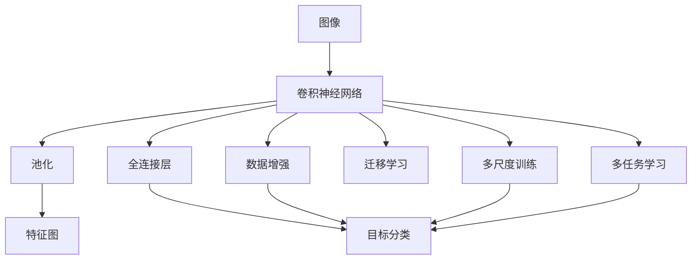

                 

# 基于tensorflow图像识别系统的设计与开发

## 1. 背景介绍

### 1.1 问题由来

近年来，图像识别技术在智能家居、自动驾驶、安防监控等领域得到了广泛应用。其核心是利用计算机视觉技术，将图像转化为结构化的语义信息，实现对场景中的物体、人脸、文字等的识别和理解。深度学习技术的快速发展，尤其是卷积神经网络(CNN)和全卷积网络(FCNN)在图像识别任务上的卓越表现，为这一领域带来了革命性的变化。

TensorFlow作为当前最流行的深度学习框架之一，提供了强大的工具和环境支持，使得开发者能够更高效地实现图像识别系统的设计。本文将围绕TensorFlow，探讨基于CNN的图像识别系统设计与开发的技术细节和关键点，并结合实际案例进行分析和展示。

## 2. 核心概念与联系

### 2.1 核心概念概述

为更好地理解基于CNN的图像识别系统，本节将介绍几个密切相关的核心概念：

- 卷积神经网络(CNN)：以卷积层和池化层为主要组成部分的神经网络结构，用于处理图像数据的特征提取和降维。
- 全卷积网络(FCNN)：基于CNN的一种网络结构，可以将任意大小的输入图像转换为固定大小的输出特征图。
- 数据增强(Data Augmentation)：通过一系列变换操作，如旋转、翻转、裁剪等，生成更多训练数据，提高模型的鲁棒性和泛化能力。
- 迁移学习(Transfer Learning)：使用预训练的模型参数，在新任务上进行微调，以快速提升模型性能。
- 多尺度训练(Multi-scale Training)：使用不同大小的目标图像，训练模型在不同尺度下识别目标的能力。
- 多任务学习(Multi-task Learning)：在同一个模型上同时训练多个相关任务，提高模型的综合性能。

这些核心概念之间的逻辑关系可以通过以下Mermaid流程图来展示：



这个流程图展示了大规模图像识别任务的基本架构：首先，图像输入CNN，经过卷积、池化等操作提取特征，然后通过全连接层进行分类，并使用数据增强、迁移学习、多尺度训练、多任务学习等技术，提高模型性能。

### 2.2 概念间的关系

这些核心概念之间存在着紧密的联系，形成了图像识别任务的完整生态系统。

- 卷积神经网络是图像识别任务的核心，通过卷积操作提取图像特征。
- 池化层用于降低特征图的大小，同时保留重要的特征信息。
- 全连接层将特征图转换为分类输出，是分类器的关键部分。
- 数据增强通过扩展训练数据，提高模型的泛化能力。
- 迁移学习利用预训练模型，加速模型在新任务的微调过程。
- 多尺度训练和多任务学习则是通过扩充模型输入和任务，进一步提高模型性能。

这些概念共同构成了图像识别任务的完整设计框架，使得基于CNN的图像识别系统能够在各种场景下发挥强大的识别能力。通过理解这些核心概念，我们可以更好地把握图像识别任务的原理和优化方向。

## 3. 核心算法原理 & 具体操作步骤

### 3.1 算法原理概述

基于CNN的图像识别系统，其核心算法包括卷积操作、池化操作、全连接层、损失函数、优化器等。

卷积操作通过滑动卷积核提取图像的局部特征，池化操作通过降采样保留重要特征。全连接层将特征图转化为目标分类的概率分布，损失函数用于衡量模型输出与真实标签之间的差异，优化器用于更新模型参数，使损失函数最小化。

具体算法流程如下：

1. 将输入图像输入卷积层，通过卷积操作提取图像特征。
2. 对卷积层的输出进行池化操作，降低特征图的大小。
3. 将池化后的特征图输入全连接层，通过全连接层进行分类。
4. 计算模型输出与真实标签之间的损失。
5. 使用优化器根据损失函数更新模型参数。

### 3.2 算法步骤详解

以一个简单的图像分类任务为例，介绍CNN的实现步骤：

**Step 1: 数据预处理**

1. 加载图像数据集，并进行预处理操作，如缩放、归一化等。

```python
import tensorflow as tf
from tensorflow.keras.preprocessing.image import ImageDataGenerator

train_datagen = ImageDataGenerator(rescale=1./255)
test_datagen = ImageDataGenerator(rescale=1./255)

train_generator = train_datagen.flow_from_directory(
    train_dir,
    target_size=(224, 224),
    batch_size=32,
    class_mode='categorical')

test_generator = test_datagen.flow_from_directory(
    test_dir,
    target_size=(224, 224),
    batch_size=32,
    class_mode='categorical')
```

2. 定义数据增强策略，增强训练集的多样性。

```python
train_datagen = ImageDataGenerator(
    rescale=1./255,
    rotation_range=20,
    width_shift_range=0.2,
    height_shift_range=0.2,
    shear_range=0.2,
    zoom_range=0.2,
    horizontal_flip=True,
    fill_mode='nearest')
```

**Step 2: 构建卷积神经网络模型**

1. 定义卷积层、池化层和全连接层，并构建完整的卷积神经网络模型。

```python
from tensorflow.keras.models import Sequential
from tensorflow.keras.layers import Conv2D, MaxPooling2D, Flatten, Dense

model = Sequential([
    Conv2D(32, (3, 3), activation='relu', input_shape=(224, 224, 3)),
    MaxPooling2D((2, 2)),
    Conv2D(64, (3, 3), activation='relu'),
    MaxPooling2D((2, 2)),
    Conv2D(128, (3, 3), activation='relu'),
    MaxPooling2D((2, 2)),
    Flatten(),
    Dense(128, activation='relu'),
    Dense(num_classes, activation='softmax')
])
```

2. 编译模型，设置损失函数和优化器。

```python
model.compile(
    optimizer=tf.keras.optimizers.Adam(learning_rate=0.001),
    loss=tf.keras.losses.CategoricalCrossentropy(),
    metrics=['accuracy'])
```

**Step 3: 训练模型**

1. 使用训练数据集进行模型训练。

```python
model.fit(
    train_generator,
    steps_per_epoch=len(train_generator),
    epochs=10,
    validation_data=test_generator,
    validation_steps=len(test_generator)
)
```

2. 保存训练好的模型。

```python
model.save('my_cnn_model.h5')
```

**Step 4: 评估模型**

1. 使用测试数据集评估模型性能。

```python
test_loss, test_acc = model.evaluate(test_generator, verbose=2)
print('Test accuracy:', test_acc)
```

2. 加载模型，进行推理预测。

```python
model = tf.keras.models.load_model('my_cnn_model.h5')

predictions = model.predict(test_images)
```

### 3.3 算法优缺点

**优点**：
- CNN能够自动提取图像特征，无需手动设计特征提取器。
- 数据增强可以显著提高模型的鲁棒性和泛化能力。
- 迁移学习可以加速模型在新任务的微调过程，减少训练时间。
- 多尺度训练和多任务学习进一步提高模型性能。

**缺点**：
- 模型结构复杂，参数量大，需要较大的计算资源。
- 需要大量标注数据进行训练，标注成本较高。
- 模型过于复杂时，容易出现过拟合现象。
- 模型的可解释性不足，难以理解其内部工作机制。

### 3.4 算法应用领域

CNN在图像识别任务中已经得到了广泛的应用，包括但不限于：

- 目标检测：识别图像中的特定目标，如人脸、车辆、动物等。
- 图像分类：对图像进行分门别类，如识别数字、物体、场景等。
- 医学影像分析：分析医学影像，如CT、MRI等，进行疾病诊断。
- 视频分析：从视频帧中提取特征，进行行为识别和动作检测。
- 自动驾驶：通过图像识别技术，辅助驾驶车辆进行导航和决策。
- 安防监控：实时监控场景，检测可疑行为和事件。

除了这些经典应用外，CNN还被创新性地应用到更多场景中，如可控图像生成、增强现实、三维重建等，为计算机视觉技术带来了新的突破。

## 4. 数学模型和公式 & 详细讲解

### 4.1 数学模型构建

假设输入图像为 $X \in \mathbb{R}^{H \times W \times C}$，其中 $H$ 和 $W$ 分别为图像的高和宽，$C$ 为通道数（RGB图像为3）。卷积层中的卷积核大小为 $F \times F$，通道数为 $K$，则卷积操作可以表示为：

$$
Y = \sigma\left( \sum_{i=0}^{K-1} \sum_{j=0}^{K-1} \sum_{x=0}^{H-F} \sum_{y=0}^{W-F} W_{ij} X_{x:i+F-1, y:j+F-1, k} \right)
$$

其中 $\sigma$ 为激活函数，$W_{ij}$ 为卷积核，$X_{x:i+F-1, y:j+F-1, k}$ 为输入图像的一个局部区域。

池化操作可以通过最大池化或平均池化实现，其数学公式如下：

$$
Y_{x, y} = \max_{i, j} X_{x+i, y+j} \quad \text{(最大池化)}
$$

$$
Y_{x, y} = \frac{1}{F^2} \sum_{i=0}^{F-1} \sum_{j=0}^{F-1} X_{x+i, y+j} \quad \text{(平均池化)}
$$

### 4.2 公式推导过程

以一个简单的分类任务为例，推导CNN的分类输出。

**Step 1: 卷积层**

假设输入图像大小为 $224 \times 224 \times 3$，卷积核大小为 $3 \times 3$，步长为 $1$，池化层大小为 $2 \times 2$，步长为 $2$。经过两层的卷积和池化操作，输出特征图大小变为 $7 \times 7 \times 128$。

**Step 2: 全连接层**

将特征图展平，输入到全连接层中，输出 $10$ 个分类的概率分布。全连接层的参数数量为 $128 \times 10 = 1280$。

**Step 3: 损失函数**

假设真实标签为 $y$，模型输出为 $\hat{y}$，则交叉熵损失函数可以表示为：

$$
L = -\sum_{i=1}^{10} y_i \log(\hat{y}_i)
$$

**Step 4: 优化器**

假设学习率为 $0.001$，使用Adam优化器进行参数更新，其更新公式为：

$$
\theta_{t+1} = \theta_t - \eta \nabla L(\theta_t)
$$

其中 $\theta_t$ 为当前模型参数，$\nabla L(\theta_t)$ 为损失函数对模型参数的梯度。

### 4.3 案例分析与讲解

以ImageNet数据集为例，介绍CNN在图像分类任务中的应用。

ImageNet是一个大规模图像分类数据集，包含超过1000个类别的图像。使用CNN进行ImageNet分类任务，需要构建一个包含多个卷积层、池化层和全连接层的复杂模型。

**Step 1: 数据准备**

1. 加载ImageNet数据集，并进行预处理操作。

```python
train_dir = 'train/'
test_dir = 'test/'
train_datagen = ImageDataGenerator(rescale=1./255, shear_range=0.2, zoom_range=0.2, horizontal_flip=True)
test_datagen = ImageDataGenerator(rescale=1./255)

train_generator = train_datagen.flow_from_directory(
    train_dir,
    target_size=(224, 224),
    batch_size=32,
    class_mode='categorical')

test_generator = test_datagen.flow_from_directory(
    test_dir,
    target_size=(224, 224),
    batch_size=32,
    class_mode='categorical')
```

2. 构建VGG16模型，并进行训练。

```python
from tensorflow.keras.applications.vgg16 import VGG16

model = VGG16(weights='imagenet', include_top=False)

model.compile(
    optimizer=tf.keras.optimizers.Adam(learning_rate=0.001),
    loss=tf.keras.losses.CategoricalCrossentropy(),
    metrics=['accuracy'])

model.fit(
    train_generator,
    steps_per_epoch=len(train_generator),
    epochs=10,
    validation_data=test_generator,
    validation_steps=len(test_generator)
)
```

**Step 2: 微调**

1. 冻结VGG16的前13层卷积层，仅微调顶层全连接层。

```python
for layer in model.layers[:13]:
    layer.trainable = False

model.layers[-1].trainable = True
```

2. 重新训练模型，微调顶层全连接层。

```python
model.compile(
    optimizer=tf.keras.optimizers.Adam(learning_rate=0.001),
    loss=tf.keras.losses.CategoricalCrossentropy(),
    metrics=['accuracy'])

model.fit(
    train_generator,
    steps_per_epoch=len(train_generator),
    epochs=10,
    validation_data=test_generator,
    validation_steps=len(test_generator)
)
```

## 5. 项目实践：代码实例和详细解释说明

### 5.1 开发环境搭建

在进行图像识别系统的设计与开发前，我们需要准备好开发环境。以下是使用Python进行TensorFlow开发的环境配置流程：

1. 安装Anaconda：从官网下载并安装Anaconda，用于创建独立的Python环境。

2. 创建并激活虚拟环境：
```bash
conda create -n tf-env python=3.8 
conda activate tf-env
```

3. 安装TensorFlow：根据CUDA版本，从官网获取对应的安装命令。例如：
```bash
conda install tensorflow
```

4. 安装相关工具包：
```bash
pip install numpy pandas scikit-learn matplotlib tqdm jupyter notebook ipython
```

完成上述步骤后，即可在`tf-env`环境中开始图像识别系统的设计与开发。

### 5.2 源代码详细实现

这里我们以图像分类任务为例，展示使用TensorFlow实现CNN的代码实现。

**Step 1: 数据预处理**

1. 加载图像数据集，并进行预处理操作。

```python
import tensorflow as tf
from tensorflow.keras.preprocessing.image import ImageDataGenerator

train_datagen = ImageDataGenerator(rescale=1./255)
test_datagen = ImageDataGenerator(rescale=1./255)

train_generator = train_datagen.flow_from_directory(
    train_dir,
    target_size=(224, 224),
    batch_size=32,
    class_mode='categorical')

test_generator = test_datagen.flow_from_directory(
    test_dir,
    target_size=(224, 224),
    batch_size=32,
    class_mode='categorical')
```

2. 定义数据增强策略，增强训练集的多样性。

```python
train_datagen = ImageDataGenerator(
    rescale=1./255,
    rotation_range=20,
    width_shift_range=0.2,
    height_shift_range=0.2,
    shear_range=0.2,
    zoom_range=0.2,
    horizontal_flip=True,
    fill_mode='nearest')
```

**Step 2: 构建卷积神经网络模型**

1. 定义卷积层、池化层和全连接层，并构建完整的卷积神经网络模型。

```python
from tensorflow.keras.models import Sequential
from tensorflow.keras.layers import Conv2D, MaxPooling2D, Flatten, Dense

model = Sequential([
    Conv2D(32, (3, 3), activation='relu', input_shape=(224, 224, 3)),
    MaxPooling2D((2, 2)),
    Conv2D(64, (3, 3), activation='relu'),
    MaxPooling2D((2, 2)),
    Conv2D(128, (3, 3), activation='relu'),
    MaxPooling2D((2, 2)),
    Flatten(),
    Dense(128, activation='relu'),
    Dense(num_classes, activation='softmax')
])
```

2. 编译模型，设置损失函数和优化器。

```python
model.compile(
    optimizer=tf.keras.optimizers.Adam(learning_rate=0.001),
    loss=tf.keras.losses.CategoricalCrossentropy(),
    metrics=['accuracy'])
```

**Step 3: 训练模型**

1. 使用训练数据集进行模型训练。

```python
model.fit(
    train_generator,
    steps_per_epoch=len(train_generator),
    epochs=10,
    validation_data=test_generator,
    validation_steps=len(test_generator)
)
```

2. 保存训练好的模型。

```python
model.save('my_cnn_model.h5')
```

**Step 4: 评估模型**

1. 使用测试数据集评估模型性能。

```python
test_loss, test_acc = model.evaluate(test_generator, verbose=2)
print('Test accuracy:', test_acc)
```

2. 加载模型，进行推理预测。

```python
model = tf.keras.models.load_model('my_cnn_model.h5')

predictions = model.predict(test_images)
```

### 5.3 代码解读与分析

让我们再详细解读一下关键代码的实现细节：

**数据预处理函数**：
- `ImageDataGenerator`：用于数据增强和数据预处理，生成批次的图像数据。
- `rescale`：对图像进行缩放，将像素值归一化到0到1之间。
- `rotation_range`：对图像进行随机旋转，增加数据多样性。
- `width_shift_range`、`height_shift_range`：对图像进行随机平移，增加数据多样性。
- `shear_range`：对图像进行随机剪切，增加数据多样性。
- `zoom_range`：对图像进行随机缩放，增加数据多样性。
- `horizontal_flip`：对图像进行随机水平翻转，增加数据多样性。

**模型构建函数**：
- `Sequential`：用于按顺序堆叠模型层。
- `Conv2D`：用于定义卷积层，提取图像特征。
- `MaxPooling2D`：用于定义池化层，降低特征图的大小。
- `Flatten`：用于将特征图展平，输入全连接层。
- `Dense`：用于定义全连接层，输出分类结果。

**模型编译函数**：
- `optimizer`：用于设置优化器，如Adam。
- `loss`：用于设置损失函数，如Categorical Crossentropy。
- `metrics`：用于设置评估指标，如accuracy。

**模型训练函数**：
- `fit`：用于训练模型，传入训练数据集、验证数据集、训练轮数等参数。
- `steps_per_epoch`：指定每轮训练迭代次数。
- `validation_steps`：指定每轮验证迭代次数。

**模型保存函数**：
- `save`：用于保存训练好的模型，方便后续使用。

**模型评估函数**：
- `evaluate`：用于评估模型性能，传入测试数据集、评估轮数等参数。

**模型加载函数**：
- `load_model`：用于加载训练好的模型，方便后续推理预测。

**模型推理函数**：
- `predict`：用于进行推理预测，传入测试图像数据。

**图像预处理函数**：
- `ImageDataGenerator`：用于数据增强和数据预处理，生成批次的图像数据。
- `rescale`：对图像进行缩放，将像素值归一化到0到1之间。
- `rotation_range`：对图像进行随机旋转，增加数据多样性。
- `width_shift_range`、`height_shift_range`：对图像进行随机平移，增加数据多样性。
- `shear_range`：对图像进行随机剪切，增加数据多样性。
- `zoom_range`：对图像进行随机缩放，增加数据多样性。
- `horizontal_flip`：对图像进行随机水平翻转，增加数据多样性。

## 6. 实际应用场景

### 6.1 智能家居

智能家居系统通过图像识别技术，实现对家庭环境的智能感知和控制。例如，智能摄像头可以通过图像识别技术，识别家庭成员、宠物、物品等，并根据识别结果自动调整室内环境，如开启灯光、调节温度等，提升家居生活的便利性和舒适度。

**应用场景**：
- 人脸识别门禁系统：识别家庭成员，自动解锁门禁。
- 智能安防监控：检测可疑行为，及时报警。
- 智能环境控制系统：根据家庭成员活动，自动调整照明、温度等环境参数。

### 6.2 自动驾驶

自动驾驶技术需要实时感知和理解道路环境，图像识别技术在其中扮演了重要角色。通过摄像头和激光雷达获取的路况图像，自动驾驶系统可以识别行人、车辆、交通信号等，辅助驾驶车辆进行导航和决策，提高行车安全和效率。

**应用场景**：
- 目标检测：识别道路上的行人、车辆、道路标线等，进行避障和导航。
- 行为识别：检测路人的行为意图，如横穿马路、转弯等，进行安全提醒。
- 场景理解：识别交通信号、标志牌等，进行交通规则理解和车辆行为预测。

### 6.3 安防监控

安防监控系统通过图像识别技术，实时监控场景，检测可疑行为和事件，提高公共安全水平。例如，智能视频监控系统可以识别异常行为，如入侵、爆炸、火灾等，并及时报警，保障公共安全。

**应用场景**：
- 入侵检测：识别入侵者，进行报警和视频追踪。
- 爆炸检测：识别爆炸物，进行报警和应急处理。
- 火灾检测：识别火灾，进行报警和消防调度。

### 6.4 未来应用展望

随着图像识别技术的不断进步，其在更多领域的应用前景将更加广阔。

1. 医疗影像分析：利用图像识别技术，对医学影像进行分析和诊断，辅助医生进行疾病诊断和治疗方案制定。
2. 智能客服：通过图像识别技术，识别用户面部表情、手势等，提升客户服务的个性化和智能化水平。
3. 电子商务：利用图像识别技术，对商品进行分类和标注，提升商品搜索和推荐的效果。
4. 工业检测：通过图像识别技术，对生产线上的设备进行缺陷检测和故障诊断，提高生产效率和设备维护的及时性。
5. 智能交通：利用图像识别技术，对交通流量进行实时监控和预测，优化交通管理，减少拥堵。

总之，图像识别技术在各个领域的应用将不断拓展，为人工智能技术带来新的突破和发展。

## 7. 工具和资源推荐

### 7.1 学习资源推荐

为了帮助开发者系统掌握基于CNN的图像识别技术的理论基础和实践技巧，这里推荐一些优质的学习资源：

1. 《深度学习》（Ian Goodfellow等）：经典深度学习教材，深入浅出地介绍了深度学习的基本概念和原理，是学习深度学习的必读书籍。
2. 《卷积神经网络实战》（Adrin Jalali）：介绍了CNN的原理和应用，通过实际案例进行讲解，适合动手实践。
3. 《TensorFlow实战深度学习》（Yaroslav Halchenko）：详细介绍了TensorFlow的使用方法和API设计，适合TensorFlow初学者。
4. 《图像处理与深度学习》（Alexey Bochkovskiy等）：讲解了图像处理和深度学习的综合应用，涵盖多种经典模型和任务。
5. 《TensorFlow官方文档》：TensorFlow的官方文档，提供了完整的API参考和示例代码，是学习TensorFlow的必备资料。
6. Kaggle竞赛：参加Kaggle图像识别竞赛，学习最新的图像识别技术和竞赛技巧，提升实战能力。

通过对这些资源的学习实践，相信你一定能够快速掌握基于CNN的图像识别技术的精髓，并用于解决实际的图像识别问题。

### 7.2 开发工具推荐

高效的开发离不开优秀的工具支持。以下是几款用于图像识别任务开发的常用工具：

1. TensorFlow：基于Python的开源深度学习框架，提供强大的计算图和自动微分功能，适合复杂图像识别模型的训练和推理。
2. PyTorch：基于Python的开源深度学习框架，提供动态计算图和灵活的模型构建方式，适合研究前沿深度学习模型。
3. OpenCV：开源计算机视觉库，提供了丰富的图像处理和特征提取功能，适合图像识别预处理任务。
4. Matplotlib：Python绘图库，用于绘制图像识别模型的训练曲线和评估结果，适合数据可视化。
5. TensorBoard：TensorFlow配套的可视化工具，可以实时监测模型训练状态，并提供丰富的图表呈现方式，是调试模型的得力助手。
6. Weights & Biases：模型训练的实验跟踪工具，可以记录和可视化模型训练过程中的各项指标，方便对比和调优。

合理利用这些工具，可以显著提升图像识别任务的开发效率，加快创新迭代的步伐。

### 7.3 相关论文推荐

图像识别技术

