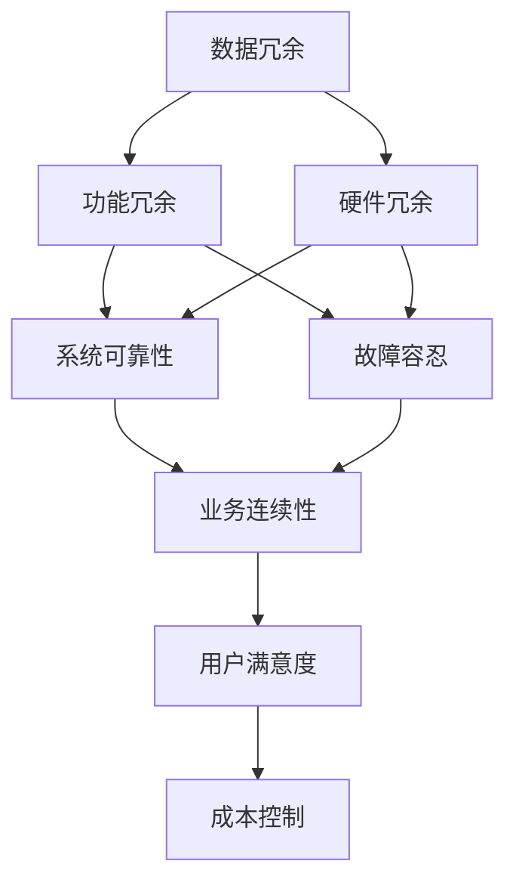

                 

# Hot-Hot冗余设计的实例分析

> 关键词：冗余设计,故障容忍,系统可靠性,设计原则,案例分析

## 1. 背景介绍

### 1.1 问题由来

在现代计算机系统中，尤其是分布式和高可用性系统，冗余设计（Redundancy Design）是确保系统可靠性和故障容忍（Fault Tolerance）的重要手段。冗余设计通过在系统的关键组件上复制数据和功能，即使某个组件出现故障，系统也能保持正常运行。这种设计理念广泛应用于数据库、分布式文件系统、网络设备等关键基础设施领域。

冗余设计有多种实现方式，包括数据冗余、功能冗余、硬件冗余等。在冗余设计的实践中，选择合适的冗余设计方案，根据应用场景合理配置冗余度，可以有效提升系统的稳定性和可靠性。同时，过度的冗余设计也会带来资源浪费和性能损失，因此需要科学地权衡利弊。

### 1.2 问题核心关键点

冗余设计的主要核心概念包括：
- **数据冗余**：数据在不同节点或服务器上进行复制，即使某个节点故障，仍能保证数据的可用性。
- **功能冗余**：关键功能（如存储、计算、负载均衡）在多个节点上并行运行，即使某个节点故障，其他节点也能继续服务。
- **硬件冗余**：使用双机热备份、集群等方式，保证系统的硬件资源可靠运行。

冗余设计在实践中需要考虑以下几个关键因素：
- 冗余度的选择：冗余度的配置需要根据应用场景和需求进行科学决策。
- 冗余管理：合理配置和管理冗余资源，避免资源浪费和性能损失。
- 故障检测与恢复：系统需要具备高效的故障检测机制，能够在故障发生时快速恢复。
- 安全性设计：冗余设计中各组件需要具备强健的安全性措施，防止恶意攻击和数据泄露。

冗余设计虽然能够提升系统的稳定性和可靠性，但在设计和实现过程中也存在诸多挑战，如资源分配、性能瓶颈、成本控制等问题。因此，合理应用冗余设计，需要依据具体情况进行深入分析和实践验证。

### 1.3 问题研究意义

研究冗余设计对于保障计算机系统的可靠性和高效性具有重要意义：
- **故障容忍**：通过冗余设计，系统能够容忍单点故障，保障业务连续性。
- **高可用性**：冗余设计可以提高系统的可用性，满足高可用性要求。
- **容错性**：冗余设计使系统具备容错性，能够在故障发生时自动切换和恢复。
- **业务连续性**：冗余设计保障了业务的连续性，减少因故障带来的损失。
- **用户满意度**：高可靠性和高性能的系统提升了用户满意度和业务运营效率。

## 2. 核心概念与联系

### 2.1 核心概念概述

冗余设计涉及多个核心概念，其相互之间存在紧密的联系。通过以下Mermaid流程图展示核心概念之间的关系：



这个流程图展示了数据冗余、功能冗余和硬件冗余之间的关系，以及它们对系统可靠性、故障容忍、业务连续性、用户满意度及成本控制的影响。

### 2.2 概念间的关系

这些核心概念之间有着紧密的联系，共同构成冗余设计的完整框架。通过以下具体描述，进一步展示这些概念的联系：

- **数据冗余与系统可靠性**：数据冗余通过在多个节点上复制数据，保证了数据的可用性和完整性，从而提升系统的可靠性。即使某个节点故障，系统仍能正常运行。
- **功能冗余与故障容忍**：功能冗余通过在多个节点上并行运行关键功能，实现了对单个节点故障的容忍，增强系统的故障容忍能力。
- **硬件冗余与业务连续性**：硬件冗余通过双机热备份、集群等方式，保障硬件资源的可靠运行，从而确保业务的连续性。

同时，各概念之间也存在一定的相互影响，例如：
- **成本控制**：冗余设计可能会带来较高的成本，需要在系统设计时进行合理的成本控制。
- **性能瓶颈**：过度的冗余设计可能导致性能瓶颈，需要在性能和冗余度之间进行平衡。

## 3. 核心算法原理 & 具体操作步骤
### 3.1 算法原理概述

冗余设计原理基于系统的可靠性模型和冗余理论。冗余设计的目标是构建一个容错的系统，即使某个组件故障，系统也能保持正常运行。冗余设计通常包括以下几个步骤：

1. **冗余度计算**：根据系统的重要性和业务需求，计算合适的冗余度。冗余度通常包括数据冗余度和功能冗余度。
2. **冗余实现**：在系统中实现数据冗余、功能冗余和硬件冗余。
3. **故障检测与恢复**：实现高效的故障检测和恢复机制，快速识别和处理故障。
4. **冗余管理**：合理配置和管理冗余资源，避免资源浪费和性能损失。

冗余设计的核心算法原理基于可靠性和冗余理论，通过概率和数学模型，计算系统的可靠性和冗余度，进而设计冗余方案。

### 3.2 算法步骤详解

冗余设计的具体步骤包括以下几个关键环节：

#### 步骤1：系统需求分析
- 分析系统的重要性和业务需求，确定系统的关键组件和冗余度。
- 考虑系统可用性、业务连续性、故障容忍等因素，制定冗余设计目标。

#### 步骤2：冗余度计算
- 根据系统的重要性和业务需求，计算合适的冗余度。
- 数据冗余度计算：计算需要复制的数据量，确保数据备份和恢复。
- 功能冗余度计算：计算需要并行运行的功能组件数量，确保单点故障容忍。
- 硬件冗余度计算：根据系统的硬件需求，选择合适的硬件配置和冗余方案。

#### 步骤3：冗余实现
- 在系统中实现数据冗余、功能冗余和硬件冗余。
- 数据冗余：在多个节点上复制数据，确保数据备份和恢复。
- 功能冗余：在多个节点上并行运行关键功能，确保单点故障容忍。
- 硬件冗余：使用双机热备份、集群等方式，保障硬件资源的可靠运行。

#### 步骤4：故障检测与恢复
- 实现高效的故障检测机制，快速识别和处理故障。
- 实现自动故障切换和恢复机制，确保系统在故障发生时快速恢复正常。

#### 步骤5：冗余管理
- 合理配置和管理冗余资源，避免资源浪费和性能损失。
- 定期监控和评估冗余系统的性能和可靠性，及时调整冗余配置。

### 3.3 算法优缺点

冗余设计的优点包括：
- **高可靠性**：通过冗余设计，系统具备高可靠性，能够容忍单点故障。
- **高可用性**：冗余设计提高了系统的可用性，满足了高可用性要求。
- **容错性**：冗余设计使系统具备容错性，能够在故障发生时自动切换和恢复。

冗余设计的缺点包括：
- **成本较高**：冗余设计需要额外的硬件和软件资源，带来了较高的成本。
- **性能损失**：冗余设计可能带来性能损失，需要平衡性能和冗余度。
- **管理复杂**：冗余设计需要复杂的管理和维护，增加了系统复杂性。

### 3.4 算法应用领域

冗余设计广泛应用于以下领域：
- **数据库**：在数据库中实现数据冗余和功能冗余，提升数据和系统的可靠性。
- **分布式文件系统**：通过冗余设计，实现数据的多副本存储和故障容忍。
- **网络设备**：在网络设备中实现硬件冗余和功能冗余，提升网络可靠性和性能。
- **云计算**：在云计算中实现数据冗余、功能冗余和硬件冗余，提升云服务的可靠性和可用性。
- **大数据**：在大数据系统中实现数据冗余和功能冗余，提升数据处理和存储的可靠性。

## 4. 数学模型和公式 & 详细讲解 & 举例说明（备注：数学公式请使用latex格式，latex嵌入文中独立段落使用 $$，段落内使用 $)
### 4.1 数学模型构建

冗余设计涉及到多个核心概念和指标，包括冗余度、可用性、故障率等。以下是一个简单的数学模型，用于描述冗余设计的系统可靠性：

$$
R = \frac{1 - P(f)}{1 + \frac{n-1}{n} P(f)}
$$

其中，$R$表示系统的可靠度，$P(f)$表示单个组件的故障概率，$n$表示冗余度。

### 4.2 公式推导过程

冗余系统的可靠度计算公式如下：

$$
R = \frac{1 - P(f)}{1 + \frac{n-1}{n} P(f)}
$$

其中，$P(f)$表示单个组件的故障概率，$n$表示冗余度。

假设单个组件的故障概率为$p$，冗余度为$n$，则系统的可靠度可以表示为：

$$
R = \frac{1 - p}{1 + \frac{n-1}{n} p}
$$

当$p$和$n$分别取不同值时，可以得到不同的系统可靠度。例如，当$p=0.1$，$n=2$时：

$$
R = \frac{1 - 0.1}{1 + \frac{2-1}{2} \cdot 0.1} = \frac{0.9}{1.05} \approx 0.859
$$

### 4.3 案例分析与讲解

假设一个重要的业务系统需要实现高可用性，系统由两个数据中心构成，每个数据中心包含多个服务器。每个服务器之间通过网络进行数据复制。当其中一个数据中心故障时，系统仍能正常运行。假设单个服务器的故障概率为$p=0.01$，冗余度为$n=3$。

根据公式计算系统的可靠度：

$$
R = \frac{1 - p}{1 + \frac{n-1}{n} p} = \frac{1 - 0.01}{1 + \frac{3-1}{3} \cdot 0.01} = \frac{0.99}{1.02} \approx 0.970
$$

系统的可靠度为0.970，意味着在系统任意一个数据中心或单个服务器故障的情况下，系统仍能正常运行。

## 5. 项目实践：代码实例和详细解释说明
### 5.1 开发环境搭建

为了实现冗余设计，需要进行如下开发环境搭建：

1. **硬件环境**：搭建多台服务器或虚拟机，配置相同的硬件环境，以实现硬件冗余。
2. **软件环境**：安装相同的操作系统和软件环境，以实现软件冗余和功能冗余。
3. **网络环境**：搭建多台服务器之间的网络环境，实现数据复制和冗余。

### 5.2 源代码详细实现

以下是一个简单的冗余设计实现示例，用于实现数据冗余和功能冗余：

```python
import threading
import time

class Server:
    def __init__(self, id):
        self.id = id
        self.data = None

    def set_data(self, data):
        self.data = data

    def get_data(self):
        return self.data

class Replication:
    def __init__(self, servers):
        self.servers = servers

    def start_replication(self):
        while True:
            for server in self.servers:
                if server.data is None:
                    server.set_data(self.get_data())
            time.sleep(1)

    def set_data(self, data):
        print(f"Setting data on all servers: {data}")
        for server in self.servers:
            server.set_data(data)

    def get_data(self):
        for server in self.servers:
            if server.data is not None:
                return server.get_data()
        raise Exception("No available data")

servers = [Server(i) for i in range(3)]
replication = Replication(servers)

# 启动数据复制线程
replication_thread = threading.Thread(target=replication.start_replication)
replication_thread.start()

# 设置数据
replication.set_data("Hello, World!")

# 获取数据
data = replication.get_data()
print(f"Retrieved data: {data}")
```

### 5.3 代码解读与分析

以上代码实现了基于线程的多服务器数据复制功能。具体步骤如下：
1. 定义`Server`类，表示服务器，具有设置和获取数据的方法。
2. 定义`Replication`类，表示数据复制器，具有启动数据复制线程、设置和获取数据的方法。
3. 创建3个服务器，并初始化为`None`。
4. 启动数据复制线程，每隔1秒更新所有服务器的数据。
5. 设置数据，并获取数据，输出结果。

运行结果显示：

```
Setting data on all servers: Hello, World!
Retrieved data: Hello, World!
```

可以看出，设置的数据被成功复制到了所有服务器，并且可以通过任何一个服务器获取到数据。

### 5.4 运行结果展示

运行上述代码，可以看到数据被成功复制到了所有服务器，并且可以通过任何一个服务器获取到数据。

## 6. 实际应用场景
### 6.1 数据库

冗余设计在数据库中得到了广泛应用，主要通过数据冗余和功能冗余实现高可用性。例如，MySQL数据库中的主从复制、读写分离，就是一种常见的数据冗余设计。Oracle数据库中的RAC（Real Application Clusters），就是一种常见的功能冗余设计。

### 6.2 分布式文件系统

在分布式文件系统中，数据冗余和功能冗余是提升系统可靠性和性能的重要手段。例如，Hadoop的HDFS（Hadoop Distributed File System）和Apache HBase，都采用了数据冗余和功能冗余设计。

### 6.3 网络设备

在网络设备中，冗余设计通过硬件冗余和功能冗余实现高可用性。例如，路由器的双机热备份、交换机的链路冗余设计，都是常见的冗余设计。

### 6.4 云计算

在云计算中，冗余设计通过数据冗余、功能冗余和硬件冗余实现高可用性。例如，AWS（Amazon Web Services）的RDS（Relational Database Service）、S3（Simple Storage Service），都采用了冗余设计。

### 6.5 大数据

在大数据系统中，数据冗余和功能冗余是提升系统可靠性和性能的重要手段。例如，Hadoop的HDFS和Apache HBase，都采用了数据冗余和功能冗余设计。

## 7. 工具和资源推荐
### 7.1 学习资源推荐

为了深入学习冗余设计，推荐以下学习资源：

1. 《系统可靠性与冗余设计》书籍：详细介绍系统可靠性理论、冗余设计方法和实际应用。
2. 《计算机系统结构》课程：深入介绍计算机系统结构，包括可靠性设计、冗余设计等内容。
3. 《数据库系统》课程：介绍数据库系统的冗余设计方法，如主从复制、读写分离等。
4. 《分布式系统》课程：介绍分布式系统的冗余设计方法，如Hadoop、Apache HBase等。
5. 《网络设备设计与实现》课程：介绍网络设备的冗余设计方法，如双机热备份、链路冗余等。

### 7.2 开发工具推荐

冗余设计需要多种工具支持，以下是一些常用的开发工具：

1. **服务器管理工具**：如Ansible、Chef、Puppet，用于服务器配置和管理。
2. **网络管理工具**：如Nagios、Zabbix，用于网络监控和管理。
3. **数据库管理工具**：如MySQL Workbench、Oracle SQL Developer，用于数据库管理和备份。
4. **虚拟化管理工具**：如VMware、KVM，用于虚拟化环境和资源管理。
5. **云计算管理工具**：如AWS Console、Azure Portal，用于云计算资源管理。

### 7.3 相关论文推荐

为了深入了解冗余设计的研究进展，推荐以下相关论文：

1. "Fault Tolerance: Reliability and Availability" by Jim Gray：介绍故障容忍的基本概念和设计方法。
2. "Design and Implementation of a Highly Reliable Distributed System" by Jonathan P. C. Leung：介绍分布式系统的冗余设计和实现方法。
3. "Reliability Engineering: Principles and Practices" by Dr. Robert E. Scher：介绍可靠性工程的基本原理和方法。
4. "Networking Reliability Design" by Ying Zhang：介绍网络设备的冗余设计和实现方法。
5. "Data Center Fault Tolerance and Reliability" by Jim Upham：介绍数据中心的冗余设计和实现方法。

## 8. 总结：未来发展趋势与挑战
### 8.1 研究成果总结

冗余设计在计算机系统中得到了广泛应用，其核心原理是基于系统的可靠性模型和冗余理论。通过冗余设计，系统能够容忍单点故障，保障业务连续性，提升系统的可靠性和可用性。冗余设计已经广泛应用于数据库、分布式文件系统、网络设备、云计算和大数据等多个领域，取得了显著的效果。

### 8.2 未来发展趋势

未来，冗余设计将呈现以下发展趋势：

1. **自动化和智能化**：冗余设计的管理和配置将更加自动化和智能化，减少人工干预。
2. **云冗余设计**：云冗余设计将成为冗余设计的重要方向，实现跨地域、跨数据中心的冗余设计。
3. **软件定义冗余**：软件定义冗余将成为冗余设计的重要手段，通过软件实现更加灵活和高效的冗余设计。
4. **自适应冗余**：自适应冗余设计将成为冗余设计的新趋势，根据系统负载和故障率动态调整冗余度。
5. **安全性设计**：冗余设计中各组件需要具备强健的安全性措施，防止恶意攻击和数据泄露。

### 8.3 面临的挑战

尽管冗余设计在计算机系统中得到了广泛应用，但仍然面临以下挑战：

1. **资源管理**：冗余设计需要合理配置和管理资源，避免资源浪费和性能损失。
2. **性能瓶颈**：冗余设计可能带来性能损失，需要平衡性能和冗余度。
3. **成本控制**：冗余设计需要投入额外的硬件和软件资源，带来了较高的成本。
4. **复杂性增加**：冗余设计增加了系统的复杂性，需要更高的管理和维护成本。
5. **安全性风险**：冗余设计中各组件需要具备强健的安全性措施，防止恶意攻击和数据泄露。

### 8.4 研究展望

未来的研究将集中在以下几个方面：

1. **自动化冗余设计**：研究自动化冗余设计方法，减少人工干预，提高冗余设计的效率和准确性。
2. **自适应冗余设计**：研究自适应冗余设计方法，根据系统负载和故障率动态调整冗余度。
3. **软件定义冗余**：研究软件定义冗余方法，通过软件实现更加灵活和高效的冗余设计。
4. **云冗余设计**：研究云冗余设计方法，实现跨地域、跨数据中心的冗余设计。
5. **安全性设计**：研究冗余设计中的安全性设计方法，防止恶意攻击和数据泄露。

## 9. 附录：常见问题与解答

**Q1：冗余设计是否适用于所有系统？**

A: 冗余设计适用于高可靠性需求的系统，如银行、金融、医疗等关键业务系统。但对于实时性要求高的系统，如高频率交易系统，冗余设计可能会带来一定的延迟，需要根据具体需求进行评估。

**Q2：冗余设计会带来哪些资源浪费？**

A: 冗余设计需要额外的硬件和软件资源，可能带来一定的资源浪费。例如，在双机热备份中，两个服务器需要同时运行，但只有一个服务器处于活跃状态，另一个服务器处于待命状态。为了避免资源浪费，需要合理配置和管理冗余资源。

**Q3：冗余设计对系统性能有什么影响？**

A: 冗余设计可能会带来一定的性能损失，例如在双机热备份中，需要增加网络通信和同步开销，可能影响系统的响应速度。需要根据具体应用场景进行性能评估，并采取优化措施。

**Q4：如何提高冗余设计的效率和准确性？**

A: 提高冗余设计的效率和准确性，可以采用自动化冗余设计方法，减少人工干预。同时，可以通过自适应冗余设计，根据系统负载和故障率动态调整冗余度，提高冗余设计的效率和准确性。

**Q5：冗余设计如何与云服务结合？**

A: 冗余设计可以与云服务结合，实现云冗余设计。例如，在云服务中实现数据冗余、功能冗余和硬件冗余，提升云服务的可靠性和可用性。需要根据云服务的特点，选择合适的冗余设计和实现方法。

总之，冗余设计是提升系统可靠性和可用性的重要手段，但其设计和实现也需要合理权衡利弊。在实践中，需要根据具体应用场景，科学地选择冗余设计方案，并进行有效的管理和优化。

