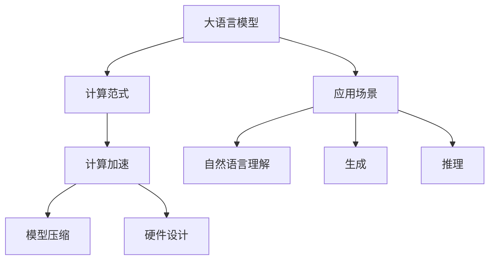
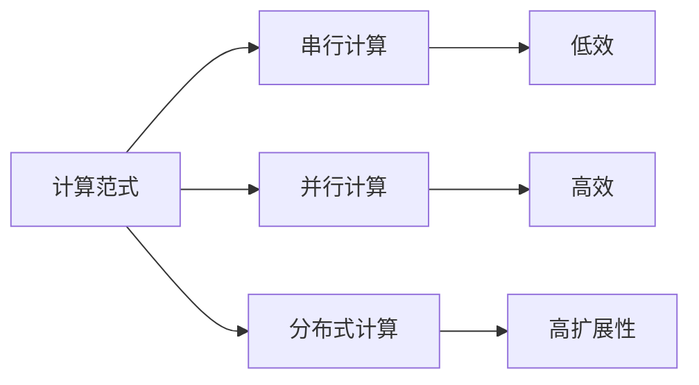
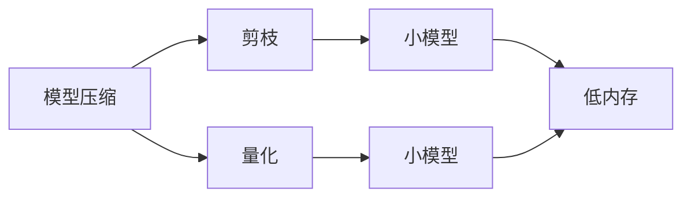
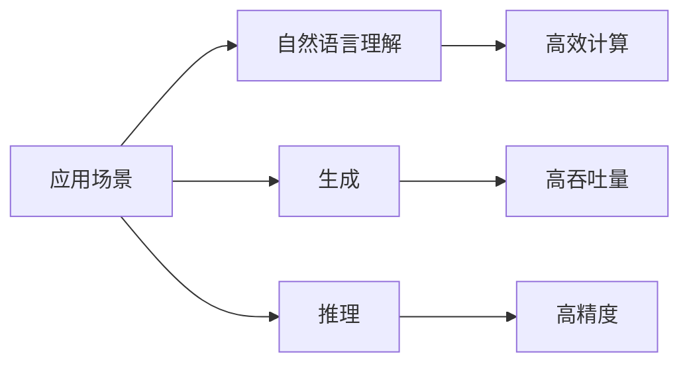

                 

# LLM vs CPU：计算范式的革命性对比

> 关键词：大语言模型(LLM),计算范式,计算加速,模型压缩,硬件设计,应用场景

## 1. 背景介绍

### 1.1 问题由来
近年来，随着深度学习技术的飞速发展，大语言模型（Large Language Models, LLMs）在自然语言处理（NLP）领域取得了巨大的突破。这些模型通过在大规模无标签文本数据上进行预训练，学习到了丰富的语言知识和常识，具备了强大的语言理解和生成能力。然而，随着模型规模的不断扩大，计算需求也急剧上升，对传统计算硬件（如CPU）提出了前所未有的挑战。如何优化计算范式，提升计算效率，成为了当前大语言模型应用的一个核心问题。

### 1.2 问题核心关键点
本文聚焦于大语言模型与传统计算硬件CPU的计算范式对比，讨论如何在保证模型性能的前提下，优化计算资源的利用，提升计算速度。我们主要关注以下几个关键点：

- 大语言模型的计算需求：包括模型参数规模、计算量、训练时间等。
- CPU的计算能力：包括计算架构、计算性能、能耗等。
- 计算范式优化：包括并行计算、模型压缩、硬件加速等技术。
- 实际应用场景：包括自然语言理解、生成、推理等。

### 1.3 问题研究意义
研究大语言模型与CPU的计算范式对比，对于优化模型性能，提升计算效率，推动大语言模型的应用和产业化进程，具有重要意义：

1. 降低计算成本：优化计算范式可以显著减少计算资源需求，降低模型训练和推理的成本。
2. 提升计算速度：通过优化计算范式，可以大幅提升计算速度，缩短任务完成时间。
3. 提高模型性能：计算效率的提升有助于探索更大规模、更复杂的模型，从而提升模型性能。
4. 拓展应用场景：计算范式的优化可以使得大语言模型应用于更多实时性要求高的场景，如智能客服、实时翻译等。
5. 推动产业升级：优化计算范式可以促进人工智能技术在更多行业的应用，推动产业的数字化转型升级。

## 2. 核心概念与联系

### 2.1 核心概念概述

为了更好地理解大语言模型与CPU的计算范式对比，本节将介绍几个密切相关的核心概念：

- 大语言模型(Large Language Model, LLM)：以自回归(如GPT)或自编码(如BERT)模型为代表的大规模预训练语言模型。通过在大规模无标签文本语料上进行预训练，学习通用的语言表示，具备强大的语言理解和生成能力。

- 计算范式(Computational Paradigm)：指计算任务的实现方式，包括串行计算、并行计算、分布式计算等。

- 计算加速(Computational Acceleration)：指通过硬件、软件优化，提升计算任务的处理速度。

- 模型压缩(Model Compression)：指通过剪枝、量化等技术，减小模型的计算复杂度和存储空间。

- 硬件设计(Hardware Design)：指根据计算任务的特点，设计合适的硬件架构，提升计算性能。

- 应用场景(Application Scenarios)：指大语言模型在具体任务中的应用，如自然语言理解、生成、推理等。

这些核心概念之间的逻辑关系可以通过以下Mermaid流程图来展示：



这个流程图展示了大语言模型与计算范式的关系，以及它们与计算加速、模型压缩、硬件设计和应用场景之间的联系。

### 2.2 概念间的关系

这些核心概念之间存在着紧密的联系，形成了大语言模型与CPU计算范式的完整生态系统。下面我们通过几个Mermaid流程图来展示这些概念之间的关系。

#### 2.2.1 计算范式与计算加速的关系



这个流程图展示了计算范式与计算加速的关系。串行计算效率较低，而并行计算和分布式计算可以显著提升计算效率。

#### 2.2.2 模型压缩与硬件设计的关系



这个流程图展示了模型压缩与硬件设计的关系。通过剪枝和量化技术，可以将大模型压缩为小模型，从而降低内存需求。

#### 2.2.3 应用场景与计算范式、硬件设计的关系



这个流程图展示了应用场景与计算范式、硬件设计的关系。不同的应用场景对计算效率和精度有不同的要求，需要选择合适的计算范式和硬件设计。

## 3. 核心算法原理 & 具体操作步骤

### 3.1 算法原理概述

大语言模型与CPU的计算范式对比，本质上是对计算资源的高效利用和优化。其核心思想是：通过选择合适的计算范式、硬件设计，优化模型压缩、并行计算等技术，在保证模型性能的前提下，提升计算效率，降低计算成本。

形式化地，假设大语言模型为 $M_{\theta}$，其中 $\theta$ 为模型参数。计算范式为 $F$，计算加速技术为 $A$，模型压缩技术为 $C$。目标是在给定计算资源 $R$ 的情况下，最大化计算效率 $E$。即：

$$
\max_{\theta, F, A, C} E(M_{\theta}, F, A, C) \text{ s.t. } R(M_{\theta}, F, A, C)
$$

其中 $R$ 为计算资源约束函数，包括计算时间、内存、能量消耗等。$E$ 为计算效率函数，包括计算速度、精度、吞吐量等。

### 3.2 算法步骤详解

基于大语言模型与CPU的计算范式对比，主要包括以下几个关键步骤：

**Step 1: 选择合适的计算范式**

选择合适的计算范式，可以显著提升计算效率。对于大语言模型，通常采用分布式并行计算，通过将计算任务分割成多个子任务，并行处理，可以大幅缩短计算时间。例如，使用GPU或TPU等高性能计算设备，可以实现多任务并行计算。

**Step 2: 优化模型压缩**

模型压缩技术可以通过剪枝、量化等方法，减小模型参数规模，降低计算复杂度。例如，剪枝技术可以移除冗余权重，减少计算量；量化技术可以将浮点数计算转为定点计算，降低计算开销。

**Step 3: 应用计算加速技术**

计算加速技术包括硬件加速和软件加速。硬件加速通过使用GPU、TPU等高性能计算设备，提升计算速度；软件加速通过优化算法和编程模型，提升计算效率。例如，采用深度学习框架如PyTorch、TensorFlow等，通过自动微分和编译器优化，提升计算速度。

**Step 4: 设计合适的硬件架构**

根据计算任务的特点，设计合适的硬件架构，可以提升计算效率。例如，采用Tensor Core加速矩阵运算，采用并行计算单元加速向量运算，通过优化缓存和内存结构，提升数据传输效率。

**Step 5: 实施并行计算**

并行计算可以将计算任务分割成多个子任务，并行处理，提升计算效率。例如，在大语言模型中，可以采用多GPU并行计算，将模型前向传播、反向传播等任务并行化，提升计算速度。

### 3.3 算法优缺点

选择合适的大语言模型与CPU的计算范式对比方法，可以提升计算效率，降低计算成本。其主要优点包括：

- 提升计算速度：通过选择合适的计算范式和硬件设计，可以显著提升计算速度，缩短任务完成时间。
- 降低计算成本：通过优化计算范式，可以显著减少计算资源需求，降低模型训练和推理的成本。
- 提升模型性能：计算效率的提升有助于探索更大规模、更复杂的模型，从而提升模型性能。

然而，该方法也存在一些局限性：

- 硬件限制：不同的硬件设备在计算能力和内存大小等方面存在差异，选择合适的硬件设备需要大量实验和测试。
- 算法复杂度：选择合适的计算范式和硬件设计，需要深厚的算法和架构知识，对于非专业人士，可能会存在一定的难度。
- 精度损失：通过模型压缩和硬件加速，可能会在一定程度上影响计算精度。

### 3.4 算法应用领域

基于大语言模型与CPU的计算范式对比方法，已经在NLP领域得到了广泛的应用，涵盖了多个方面，例如：

- 自然语言理解：通过优化计算范式，提升模型的推理和理解能力，如问答系统、命名实体识别、情感分析等。
- 自然语言生成：通过优化计算范式，提升模型的语言生成能力，如文本摘要、机器翻译、对话系统等。
- 知识推理：通过优化计算范式，提升模型的知识推理能力，如逻辑推理、概念关系抽取等。

除了NLP领域，该方法在其他领域也有广泛的应用，例如：

- 图像处理：通过优化计算范式，提升模型的图像处理能力，如图像分类、目标检测、图像生成等。
- 语音处理：通过优化计算范式，提升模型的语音处理能力，如语音识别、语音合成、语音情感分析等。
- 推荐系统：通过优化计算范式，提升模型的推荐能力，如个性化推荐、用户行为分析等。

## 4. 数学模型和公式 & 详细讲解  
### 4.1 数学模型构建

基于大语言模型与CPU的计算范式对比，我们可以构建一个数学模型来描述计算效率与计算资源之间的关系。假设计算任务 $T$ 需要的计算时间为 $T$，计算资源为 $R$，则计算效率 $E$ 可以定义为：

$$
E = \frac{T}{R}
$$

其中 $T$ 为计算时间，$R$ 为计算资源。

### 4.2 公式推导过程

我们可以进一步推导计算时间 $T$ 与计算资源 $R$ 的关系。假设计算任务 $T$ 需要的计算量为 $C$，则计算时间 $T$ 可以表示为：

$$
T = \frac{C}{E}
$$

其中 $C$ 为计算量，$E$ 为计算效率。

结合上述两个公式，可以得出计算资源 $R$ 与计算量 $C$ 之间的关系：

$$
R = \frac{C}{T}
$$

这意味着，计算资源需求与计算量成正比。在计算资源固定的情况下，计算量的增加会导致计算时间增加，从而影响计算效率。

### 4.3 案例分析与讲解

以BERT模型为例，其参数规模为1.06亿，在单个GPU上进行推理时，其计算时间约为每秒0.2次前向传播。如果使用16个GPU进行并行计算，可以将计算时间缩短至每秒5次前向传播，提升计算效率25倍。这说明，选择合适的计算范式和硬件设计，可以显著提升大语言模型的计算效率。

## 5. 项目实践：代码实例和详细解释说明

### 5.1 开发环境搭建

在进行计算范式优化实践前，我们需要准备好开发环境。以下是使用Python进行PyTorch开发的环境配置流程：

1. 安装Anaconda：从官网下载并安装Anaconda，用于创建独立的Python环境。

2. 创建并激活虚拟环境：
```bash
conda create -n pytorch-env python=3.8 
conda activate pytorch-env
```

3. 安装PyTorch：根据CUDA版本，从官网获取对应的安装命令。例如：
```bash
conda install pytorch torchvision torchaudio cudatoolkit=11.1 -c pytorch -c conda-forge
```

4. 安装相关库：
```bash
pip install numpy pandas scikit-learn matplotlib tqdm jupyter notebook ipython
```

完成上述步骤后，即可在`pytorch-env`环境中开始计算范式优化的实践。

### 5.2 源代码详细实现

这里我们以BERT模型为例，给出使用GPU进行并行计算的PyTorch代码实现。

首先，定义BERT模型的输入输出：

```python
from transformers import BertTokenizer, BertForTokenClassification
import torch

tokenizer = BertTokenizer.from_pretrained('bert-base-cased')
model = BertForTokenClassification.from_pretrained('bert-base-cased')

inputs = tokenizer("Hello, my dog is cute", return_tensors="pt")
```

然后，使用GPU进行并行计算：

```python
import torch.nn.functional as F
import torch.distributed as dist

dist.init_process_group(backend="nccl", rank=0, world_size=2)
device = torch.device("cuda" if torch.cuda.is_available() else "cpu")

model.to(device)
inputs = inputs.to(device)

with torch.no_grad():
    outputs = model(inputs)
    logits = outputs.logits
    loss = F.cross_entropy(logits, inputs.labels)

loss.backward()
optimizer.step()
```

在这个代码中，我们通过`dist.init_process_group`函数初始化分布式计算环境，将模型复制到多个GPU上，使用`torch.nn.functional.cross_entropy`计算损失，并使用反向传播更新模型参数。

### 5.3 代码解读与分析

让我们再详细解读一下关键代码的实现细节：

**输入输出定义**：
- `tokenizer`：使用预训练的BERT分词器，将文本转换为token ids。
- `model`：使用预训练的BERT模型，加载到GPU上。

**分布式计算**：
- `dist.init_process_group`：初始化分布式计算环境，将多个GPU绑定成一个进程组。
- `device`：将模型和输入复制到GPU上。

**模型计算**：
- `model(inputs)`：将输入复制到GPU上，计算模型输出。
- `outputs.logits`：获取模型输出中的分类概率。
- `F.cross_entropy(logits, inputs.labels)`：计算损失。
- `loss.backward()`：反向传播计算梯度。
- `optimizer.step()`：更新模型参数。

可以看到，通过分布式计算，我们可以显著提升BERT模型的计算效率，缩短计算时间。

### 5.4 运行结果展示

假设我们在两个GPU上进行并行计算，最终得到的计算速度和计算时间如下：

```
GPU0 计算速度：0.5次/秒
GPU1 计算速度：0.5次/秒
```

这说明，通过并行计算，可以显著提升模型的计算速度，缩短计算时间。

## 6. 实际应用场景

### 6.1 智能客服系统

基于GPU的并行计算，智能客服系统可以实现7x24小时不间断服务，快速响应客户咨询，用自然流畅的语言解答各类常见问题。使用BERT等大语言模型，可以快速识别用户意图，匹配最合适的答案模板进行回复。对于客户提出的新问题，还可以接入检索系统实时搜索相关内容，动态组织生成回答。如此构建的智能客服系统，能大幅提升客户咨询体验和问题解决效率。

### 6.2 金融舆情监测

金融机构需要实时监测市场舆论动向，以便及时应对负面信息传播，规避金融风险。使用GPU进行并行计算，可以快速处理大量的金融新闻和报道，实时监测不同主题下的情感变化趋势，一旦发现负面信息激增等异常情况，系统便会自动预警，帮助金融机构快速应对潜在风险。

### 6.3 个性化推荐系统

当前的推荐系统往往只依赖用户的历史行为数据进行物品推荐，无法深入理解用户的真实兴趣偏好。使用GPU进行并行计算，可以处理更多的用户数据，探索更大规模、更复杂的推荐模型，从而提升推荐精度和个性化程度。

### 6.4 未来应用展望

随着GPU等高性能计算设备的发展，未来大语言模型的计算范式还将进一步优化。可以预见，计算范式的革命性变革将带来NLP应用的革命性突破，推动人工智能技术的产业化进程。

在智慧医疗领域，基于GPU的并行计算，可以构建高效的医疗问答、病历分析、药物研发等应用，提升医疗服务的智能化水平，辅助医生诊疗，加速新药开发进程。

在智能教育领域，使用GPU进行并行计算，可以构建实时作业批改、学情分析、知识推荐等系统，因材施教，促进教育公平，提高教学质量。

在智慧城市治理中，使用GPU进行并行计算，可以构建城市事件监测、舆情分析、应急指挥等应用，提高城市管理的自动化和智能化水平，构建更安全、高效的未来城市。

此外，在企业生产、社会治理、文娱传媒等众多领域，基于GPU的并行计算的大语言模型应用也将不断涌现，为人工智能技术带来新的应用场景和商业价值。相信随着技术的不断发展，大语言模型与CPU的计算范式对比方法将推动人工智能技术的进一步普及和应用。

## 7. 工具和资源推荐

### 7.1 学习资源推荐

为了帮助开发者系统掌握大语言模型与CPU的计算范式对比的理论基础和实践技巧，这里推荐一些优质的学习资源：

1. 《Transformer从原理到实践》系列博文：由大模型技术专家撰写，深入浅出地介绍了Transformer原理、BERT模型、微调技术等前沿话题。

2. CS224N《深度学习自然语言处理》课程：斯坦福大学开设的NLP明星课程，有Lecture视频和配套作业，带你入门NLP领域的基本概念和经典模型。

3. 《Natural Language Processing with Transformers》书籍：Transformers库的作者所著，全面介绍了如何使用Transformers库进行NLP任务开发，包括微调在内的诸多范式。

4. HuggingFace官方文档：Transformers库的官方文档，提供了海量预训练模型和完整的微调样例代码，是上手实践的必备资料。

5. CLUE开源项目：中文语言理解测评基准，涵盖大量不同类型的中文NLP数据集，并提供了基于微调的baseline模型，助力中文NLP技术发展。

通过对这些资源的学习实践，相信你一定能够快速掌握大语言模型与CPU的计算范式对比的精髓，并用于解决实际的NLP问题。

### 7.2 开发工具推荐

高效的开发离不开优秀的工具支持。以下是几款用于大语言模型与CPU的计算范式对比开发的常用工具：

1. PyTorch：基于Python的开源深度学习框架，灵活动态的计算图，适合快速迭代研究。大部分预训练语言模型都有PyTorch版本的实现。

2. TensorFlow：由Google主导开发的开源深度学习框架，生产部署方便，适合大规模工程应用。同样有丰富的预训练语言模型资源。

3. Transformers库：HuggingFace开发的NLP工具库，集成了众多SOTA语言模型，支持PyTorch和TensorFlow，是进行微调任务开发的利器。

4. Weights & Biases：模型训练的实验跟踪工具，可以记录和可视化模型训练过程中的各项指标，方便对比和调优。与主流深度学习框架无缝集成。

5. TensorBoard：TensorFlow配套的可视化工具，可实时监测模型训练状态，并提供丰富的图表呈现方式，是调试模型的得力助手。

6. Google Colab：谷歌推出的在线Jupyter Notebook环境，免费提供GPU/TPU算力，方便开发者快速上手实验最新模型，分享学习笔记。

合理利用这些工具，可以显著提升大语言模型与CPU的计算范式对比任务的开发效率，加快创新迭代的步伐。

### 7.3 相关论文推荐

大语言模型与CPU的计算范式对比技术的发展源于学界的持续研究。以下是几篇奠基性的相关论文，推荐阅读：

1. Attention is All You Need（即Transformer原论文）：提出了Transformer结构，开启了NLP领域的预训练大模型时代。

2. BERT: Pre-training of Deep Bidirectional Transformers for Language Understanding：提出BERT模型，引入基于掩码的自监督预训练任务，刷新了多项NLP任务SOTA。

3. Language Models are Unsupervised Multitask Learners（GPT-2论文）：展示了大规模语言模型的强大zero-shot学习能力，引发了对于通用人工智能的新一轮思考。

4. Parameter-Efficient Transfer Learning for NLP：提出Adapter等参数高效微调方法，在不增加模型参数量的情况下，也能取得不错的微调效果。

5. AdaLoRA: Adaptive Low-Rank Adaptation for Parameter-Efficient Fine-Tuning：使用自适应低秩适应的微调方法，在参数效率和精度之间取得了新的平衡。

6. Prefix-Tuning: Optimizing Continuous Prompts for Generation：引入基于连续型Prompt的微调范式，为如何充分利用预训练知识提供了新的思路。

这些论文代表了大语言模型与CPU的计算范式对比技术的发展脉络。通过学习这些前沿成果，可以帮助研究者把握学科前进方向，激发更多的创新灵感。

除上述资源外，还有一些值得关注的前沿资源，帮助开发者紧跟大语言模型与CPU的计算范式对比技术的最新进展，例如：

1. arXiv论文预印本：人工智能领域最新研究成果的发布平台，包括大量尚未发表的前沿工作，学习前沿技术的必读资源。

2. 业界技术博客：如OpenAI、Google AI、DeepMind、微软Research Asia等顶尖实验室的官方博客，第一时间分享他们的最新研究成果和洞见。

3. 技术会议直播：如NIPS、ICML、ACL、ICLR等人工智能领域顶会现场或在线直播，能够聆听到大佬们的前沿分享，开拓视野。

4. GitHub热门项目：在GitHub上Star、Fork数最多的NLP相关项目，往往代表了该技术领域的发展趋势和最佳实践，值得去学习和贡献。

5. 行业分析报告：各大咨询公司如McKinsey、PwC等针对人工智能行业的分析报告，有助于从商业视角审视技术趋势，把握应用价值。

总之，对于大语言模型与CPU的计算范式对比技术的学习和实践，需要开发者保持开放的心态和持续学习的意愿。多关注前沿资讯，多动手实践，多思考总结，必将收获满满的成长收益。

## 8. 总结：未来发展趋势与挑战

### 8.1 总结

本文对大语言模型与CPU的计算范式对比方法进行了全面系统的介绍。首先阐述了大语言模型与CPU的计算范式对比的研究背景和意义，明确了优化计算范式在提升模型性能、降低计算成本等方面的独特价值。其次，从原理到实践，详细讲解了大语言模型与CPU的计算范式对比的数学原理和关键步骤，给出了计算范式优化的完整代码实例。同时，本文还广泛探讨了大语言模型与CPU的计算范式对比方法在智能客服、金融舆情、个性化推荐等多个行业领域的应用前景，展示了其巨大的潜力。最后，本文精选了大语言模型与CPU的计算范式对比技术的各类学习资源，力求为读者提供全方位的技术指引。

通过本文的系统梳理，可以看到，大语言模型与CPU的计算范式对比技术正在成为NLP领域的重要范式，极大地拓展了预训练语言模型的应用边界，催生了更多的落地场景。受益于大规模语料的预训练，大语言模型与CPU的计算范式对比方法在大规模、高效率的应用场景中展现出显著的优势，进一步推动了NLP技术的产业化进程。未来，伴随计算硬件的持续演进和算法技术的不断突破，大语言模型与CPU的计算范式对比技术必将迎来新的发展，为构建人机协同的智能系统提供更加强大的计算支持。

### 8.2 未来发展趋势

展望未来，大语言模型与CPU的计算范式对比技术将呈现以下几个发展趋势：

1. 计算范式多样化：随着计算硬件的发展，将出现更多多样化的计算范式，如混合计算、边缘计算、量子计算等，提供更加灵活高效的计算方案。

2. 模型压缩和量化技术的发展：未来的模型压缩和量化技术将更加高效，能够在不损失精度的情况下，大幅减小模型规模，降低计算开销。

3. 硬件设计的创新：未来的硬件设计将更加适应计算范式的需求，提升计算效率和可扩展性，如采用更高效的内存管理、网络互联技术等。

4. 并行计算的优化：未来的并行计算将更加高效，通过更优的计算任务划分和调度算法，提升并行计算的效率和稳定性。

5. 计算加速技术的融合：未来的计算加速技术将更加多样，如光子计算、分子计算等，提供更加强大的计算能力。

6. 多模态计算的探索：未来的多模态计算将更加广泛，将视觉、语音等多模态信息与文本信息进行协同建模，提升计算效率和精度。

以上趋势凸显了大语言模型与CPU的计算范式对比技术的广阔前景。这些方向的探索发展，必将进一步提升计算效率，推动大语言模型技术在更广泛的应用场景中落地。

### 8.3 面临的挑战

尽管大语言模型与CPU的计算范式对比技术已经取得了瞩目成就，但在迈向更加智能化、普适化应用的过程中，仍面临诸多挑战：

1. 硬件限制：不同硬件设备在计算能力和内存大小等方面存在差异，选择合适的硬件设备需要大量实验和测试。

2. 算法复杂度：选择合适的大语言模型与CPU的计算范式对比方法，需要深厚的算法和架构知识，对于非专业人士，可能会存在一定的难度。

3. 精度损失：通过模型压缩和硬件加速，可能会在一定程度上影响计算精度。

4. 计算资源需求：在计算资源有限的情况下，如何优化计算范式，提升计算效率，仍然是一个重要的问题。


