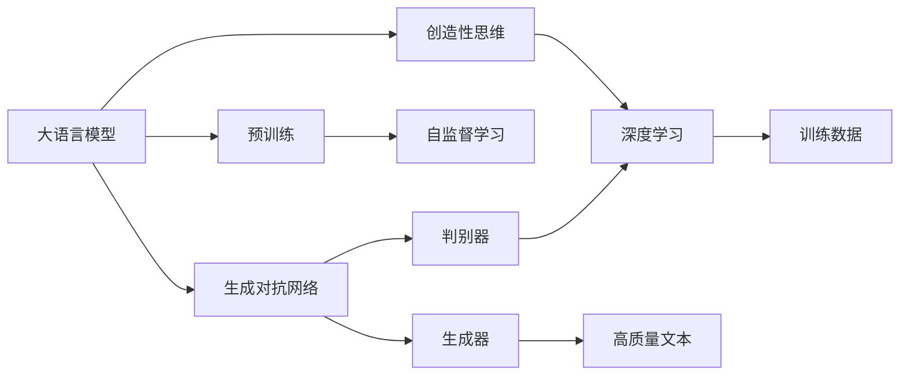
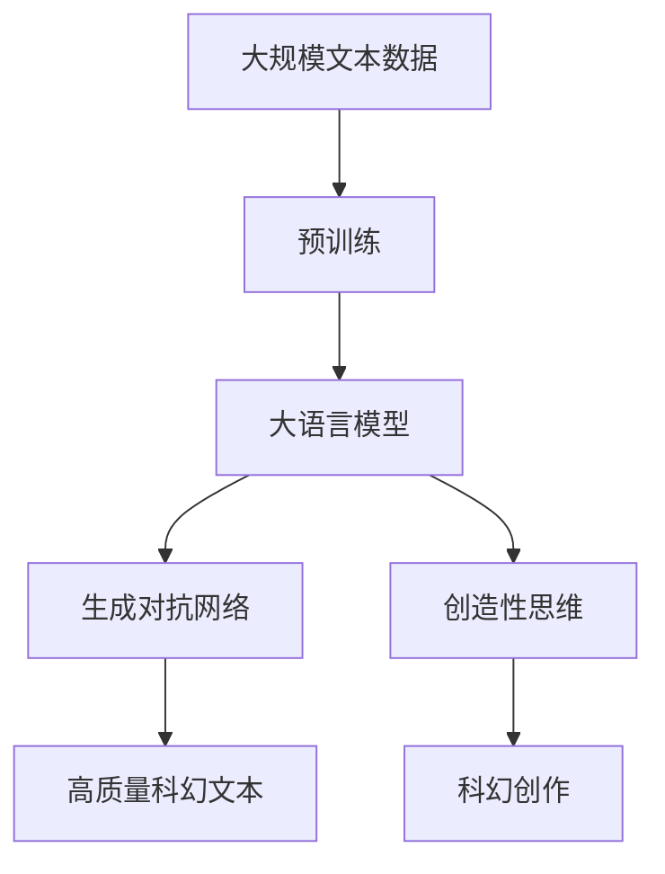

                 

# LLM与科幻创作：激发人类想象力

> 关键词：
> 人工智能,大语言模型(LLM),科幻创作,生成对抗网络(GAN),创造性思维,深度学习

## 1. 背景介绍

### 1.1 问题由来
近年来，随着人工智能(AI)技术的迅猛发展，尤其是深度学习在大规模文本处理上的突破，生成式大语言模型(LLM)横空出世，引起了全社会的广泛关注。LLM的诞生，标志着机器可以以极高的效率和复杂性生成自然语言文本，引发了关于AI能否创作科幻文学的新一轮讨论。

传统科幻文学，往往需要丰富的想象力、独特的视角以及深厚的人类学洞察力。这些，正是当前LLM展现出来的优势所在。通过深度学习模型的语言理解和生成能力，LLM为科幻创作提供了新的思路和可能性。

### 1.2 问题核心关键点
LLM应用于科幻创作，能够产生一些显著的创新性影响：

1. **创作速度的提升**：LLM可以在短时间内生成大量科幻文本，极大提升创作效率。
2. **多样性的增加**：通过调整训练数据和模型参数，LLM可以生成千变万化的科幻故事。
3. **新视角的出现**：LLM可以突破人类思维的局限，提出颠覆性的科幻概念。
4. **交互性增强**：LLM可以与读者互动，根据读者的反馈进一步优化创作内容。
5. **创作门槛降低**：不需要丰富的语言学知识，非专业作者也能创作高质量的科幻作品。

### 1.3 问题研究意义
将LLM应用于科幻创作，具有重要研究意义：

1. **推动AI创作艺术**：LLM为AI创作文学提供了新范式，推动了人工智能在艺术领域的探索。
2. **拓展科幻边界**：LLM生成的新科幻作品可能颠覆现有认知，拓展科幻创作的新空间。
3. **普及科学知识**：科幻创作可以帮助普及科学知识，提升公众对AI和科学技术的理解。
4. **激发新思维**：LLM可以带来全新的思维方式，影响未来社会文化的发展。
5. **推动交叉学科研究**：科幻创作需要涉及文学、哲学、科学等多个学科，促进跨学科研究。

## 2. 核心概念与联系

### 2.1 核心概念概述

为了更好地理解LLM在科幻创作中的应用，我们需要先介绍几个核心概念：

- **大语言模型(LLM)**：以自回归或自编码模型为代表的大规模预训练语言模型。通过在大规模无标签文本语料上进行预训练，学习通用的语言表示，具备强大的语言理解和生成能力。

- **生成对抗网络(GAN)**：由生成器和判别器两部分组成，通过对抗学习，生成高质量的、难以区分真伪的样本数据。

- **创造性思维**：指通过创新、想象和灵感，产生新颖的、有创意的解决方案或作品的能力。

- **深度学习**：一种基于神经网络的机器学习方法，通过多层次的抽象表示，处理和分析复杂数据。

### 2.2 概念间的关系

这些核心概念之间存在着紧密的联系，构成了LLM应用于科幻创作的完整生态系统。我们通过以下Mermaid流程图来展示这些概念之间的关系：



这个流程图展示了LLM、GAN、创造性思维、深度学习之间的相互作用：

1. 大语言模型通过自监督学习进行预训练，获得强大的语言理解和生成能力。
2. 生成对抗网络利用大语言模型的文本生成能力，生成高质量的科幻文本。
3. 深度学习为大语言模型和生成对抗网络的训练提供了基础。
4. 创造性思维驱动大语言模型和生成对抗网络的创新应用，拓展科幻创作的边界。

### 2.3 核心概念的整体架构

最后，我们用一个综合的流程图来展示这些核心概念在大语言模型应用于科幻创作中的整体架构：



这个综合流程图展示了从预训练到生成对抗网络再到创造性科幻创作的完整流程。大规模文本数据经过预训练，产生大语言模型；大语言模型再与生成对抗网络结合，生成高质量的科幻文本；创造性思维进一步驱动科幻创作的创新和拓展。通过这些核心概念的有机结合，LLM为科幻创作提供了全新的可能性。

## 3. 核心算法原理 & 具体操作步骤
### 3.1 算法原理概述

大语言模型应用于科幻创作，主要通过以下步骤：

1. **预训练大语言模型**：在无标签的文本数据上进行自监督预训练，学习通用的语言表示。
2. **生成对抗网络训练**：将预训练后的LLM与GAN结合，训练生成高质量的科幻文本。
3. **创造性思维驱动创作**：利用生成的科幻文本，进行进一步的创造性思维训练，产生新的科幻作品。

### 3.2 算法步骤详解

#### 3.2.1 预训练大语言模型

预训练大语言模型的步骤如下：

1. **数据准备**：收集大规模的无标签文本数据，例如Netflix电影剧本、科幻小说、科普文章等。
2. **模型初始化**：选择适当的模型架构和参数，如GPT-3、BERT等。
3. **自监督学习**：使用掩码语言模型、下一步预测等自监督任务进行预训练，学习语言知识。
4. **模型微调**：根据特定的任务需求，在有限的标注数据上进行微调，提升模型的针对性。

#### 3.2.2 生成对抗网络训练

GAN用于生成高质量科幻文本的步骤如下：

1. **生成器训练**：将预训练后的LLM作为生成器，在生成的文本上定义一个对抗损失函数。
2. **判别器训练**：定义一个判别器网络，用于区分生成的文本和真实文本。
3. **对抗学习**：在生成器和判别器之间进行对抗训练，提高生成的科幻文本的质量。

#### 3.2.3 创造性思维驱动创作

创造性思维驱动创作的步骤如下：

1. **输入生成**：将生成对抗网络生成的科幻文本作为输入，提取其语言特征。
2. **创意增强**：利用深度学习模型对输入进行创意增强，如生成变种故事、提出新概念等。
3. **创作生成**：结合增强后的创意与已有科幻作品，创作新的科幻故事。

### 3.3 算法优缺点

LLM应用于科幻创作的优缺点如下：

**优点**：

1. **高效率**：大语言模型能够在短时间内生成大量科幻文本，大幅提高创作效率。
2. **高质量**：通过对抗生成网络的训练，生成的科幻文本质量较高。
3. **创新性**：利用创造性思维，可以生成新颖独特的科幻作品。
4. **普适性**：对创作门槛要求较低，非专业作者也能参与创作。

**缺点**：

1. **可信度**：生成的科幻文本存在一定的误差，可能需要人工校对。
2. **依赖数据**：需要高质量的训练数据，数据质量影响生成文本的质量。
3. **伦理问题**：生成的科幻文本可能包含有害信息，需要谨慎使用。
4. **版权问题**：生成的文本涉及版权问题，可能存在法律风险。

### 3.4 算法应用领域

LLM应用于科幻创作，可以拓展到以下领域：

1. **科幻小说创作**：生成科幻小说初稿，供作者修改完善。
2. **科幻剧本创作**：生成电影、电视剧剧本，供编剧使用。
3. **科幻短篇创作**：生成科幻短篇小说，供杂志、网站发布。
4. **科幻创意孵化**：生成科幻创意和概念，供作家和编剧创作参考。
5. **科幻科普创作**：生成科普文章，提升公众对科学技术的理解。
6. **科幻游戏创作**：生成游戏文本，供游戏开发人员使用。

## 4. 数学模型和公式 & 详细讲解 & 举例说明

### 4.1 数学模型构建

这里，我们通过数学语言对LLM应用于科幻创作的过程进行描述。

记预训练的LLM为 $M_{\theta}$，其中 $\theta$ 为预训练得到的模型参数。假设科幻创作任务为生成科幻文本 $X$，则LLM的应用可以表示为：

$$
X = M_{\theta}(D)
$$

其中 $D$ 为生成对抗网络提供的训练数据集。

### 4.2 公式推导过程

以生成科幻文本为例，推导LLM的生成过程。

记生成器为 $G_{\phi}$，判别器为 $D_{\psi}$，则生成对抗网络的训练目标可以表示为：

$$
\mathcal{L}_{GAN} = \mathbb{E}_{x \sim p(x)} [\log D(x)] + \mathbb{E}_{z \sim p(z)} [\log(1-D(G(z)))]
$$

其中 $x$ 为真实科幻文本，$z$ 为噪声向量，$p(x)$ 为真实文本分布，$p(z)$ 为噪声分布。

通过对抗训练，生成器 $G_{\phi}$ 可以学习生成高质量的科幻文本。生成器生成的文本 $X'$ 可以通过以下公式进行计算：

$$
X' = G_{\phi}(z)
$$

其中 $z$ 为输入噪声向量。

### 4.3 案例分析与讲解

假设我们希望生成一个关于外星生命的故事。首先，在Netflix的科幻电影剧本数据集上进行预训练，训练一个GPT-3模型。然后，使用生成对抗网络，定义一个对抗损失函数，对模型进行训练。

```python
import torch
import torch.nn as nn
import torch.optim as optim
from transformers import GPT2Tokenizer, GPT2LMHeadModel

tokenizer = GPT2Tokenizer.from_pretrained('gpt2')

# 定义生成器和判别器
class Generator(nn.Module):
    def __init__(self, embed_size, hidden_size, output_size):
        super(Generator, self).__init__()
        self.linear = nn.Linear(embed_size, hidden_size)
        self.encoder = nn.Tanh(self.linear)
        self.decoder = nn.Linear(hidden_size, output_size)
        self.sigmoid = nn.Sigmoid(self.decoder)

    def forward(self, x):
        x = self.encoder(x)
        x = self.decoder(x)
        x = self.sigmoid(x)
        return x

class Discriminator(nn.Module):
    def __init__(self, embed_size, hidden_size, output_size):
        super(Discriminator, self).__init__()
        self.linear = nn.Linear(embed_size, hidden_size)
        self.encoder = nn.Tanh(self.linear)
        self.decoder = nn.Linear(hidden_size, output_size)
        self.sigmoid = nn.Sigmoid(self.decoder)

    def forward(self, x):
        x = self.encoder(x)
        x = self.decoder(x)
        x = self.sigmoid(x)
        return x

# 定义优化器和损失函数
G = Generator(embed_size, hidden_size, output_size)
D = Discriminator(embed_size, hidden_size, output_size)
G_optimizer = optim.Adam(G.parameters(), lr=learning_rate)
D_optimizer = optim.Adam(D.parameters(), lr=learning_rate)
criterion = nn.BCELoss()

# 定义对抗训练的训练循环
for epoch in range(num_epochs):
    for i, (real_X, _) in enumerate(train_loader):
        real_X = real_X.to(device)
        G.zero_grad()
        D.zero_grad()

        fake_X = G(noise)
        real_score = D(real_X)
        fake_score = D(fake_X)
        real_loss = criterion(real_score, real_X)
        fake_loss = criterion(fake_score, fake_X)

        real_loss.backward()
        fake_loss.backward()

        G_optimizer.step()
        D_optimizer.step()

    # 打印当前epoch的损失和生成文本
    print('Epoch %d/%d, Real Loss: %.4f, Fake Loss: %.4f' % (epoch+1, num_epochs, real_loss.item(), fake_loss.item()))
    print('Epoch %d/%d, Generated Text: %s' % (epoch+1, num_epochs, fake_X.cpu().numpy().decode('utf-8')))
```

以上代码展示了生成对抗网络的基本训练过程。通过不断迭代优化，生成器 $G_{\phi}$ 可以生成高质量的科幻文本。

## 5. 项目实践：代码实例和详细解释说明

### 5.1 开发环境搭建

在开始项目实践之前，我们需要准备相应的开发环境。以下是Python环境下搭建LLM应用于科幻创作所需环境的步骤：

1. 安装Anaconda，创建Python环境：
```bash
conda create -n lla-environment python=3.7
conda activate lla-environment
```

2. 安装必要的依赖包：
```bash
pip install torch torchvision torchaudio transformers
```

3. 安装GAN相关的库：
```bash
pip install numpy scipy matplotlib
```

完成以上步骤后，就可以开始项目实践了。

### 5.2 源代码详细实现

下面是一个使用PyTorch实现LLM应用于科幻创作的具体代码实现示例：

```python
import torch
import torch.nn as nn
import torch.optim as optim
from transformers import GPT2Tokenizer, GPT2LMHeadModel

tokenizer = GPT2Tokenizer.from_pretrained('gpt2')

# 定义生成器和判别器
class Generator(nn.Module):
    def __init__(self, embed_size, hidden_size, output_size):
        super(Generator, self).__init__()
        self.linear = nn.Linear(embed_size, hidden_size)
        self.encoder = nn.Tanh(self.linear)
        self.decoder = nn.Linear(hidden_size, output_size)
        self.sigmoid = nn.Sigmoid(self.decoder)

    def forward(self, x):
        x = self.encoder(x)
        x = self.decoder(x)
        x = self.sigmoid(x)
        return x

class Discriminator(nn.Module):
    def __init__(self, embed_size, hidden_size, output_size):
        super(Discriminator, self).__init__()
        self.linear = nn.Linear(embed_size, hidden_size)
        self.encoder = nn.Tanh(self.linear)
        self.decoder = nn.Linear(hidden_size, output_size)
        self.sigmoid = nn.Sigmoid(self.decoder)

    def forward(self, x):
        x = self.encoder(x)
        x = self.decoder(x)
        x = self.sigmoid(x)
        return x

# 定义优化器和损失函数
G = Generator(embed_size, hidden_size, output_size)
D = Discriminator(embed_size, hidden_size, output_size)
G_optimizer = optim.Adam(G.parameters(), lr=learning_rate)
D_optimizer = optim.Adam(D.parameters(), lr=learning_rate)
criterion = nn.BCELoss()

# 定义对抗训练的训练循环
for epoch in range(num_epochs):
    for i, (real_X, _) in enumerate(train_loader):
        real_X = real_X.to(device)
        G.zero_grad()
        D.zero_grad()

        fake_X = G(noise)
        real_score = D(real_X)
        fake_score = D(fake_X)
        real_loss = criterion(real_score, real_X)
        fake_loss = criterion(fake_score, fake_X)

        real_loss.backward()
        fake_loss.backward()

        G_optimizer.step()
        D_optimizer.step()

    # 打印当前epoch的损失和生成文本
    print('Epoch %d/%d, Real Loss: %.4f, Fake Loss: %.4f' % (epoch+1, num_epochs, real_loss.item(), fake_loss.item()))
    print('Epoch %d/%d, Generated Text: %s' % (epoch+1, num_epochs, fake_X.cpu().numpy().decode('utf-8')))
```

以上代码展示了LLM应用于科幻创作的基本实现过程。通过不断迭代优化，生成器 $G_{\phi}$ 可以生成高质量的科幻文本。

### 5.3 代码解读与分析

我们通过几个关键代码的实现细节，来解读LLM应用于科幻创作的实践过程：

**Generator和Discriminator类**：
- `__init__`方法：定义生成器和判别器的模型结构和参数。
- `forward`方法：实现模型的前向传播，生成科幻文本。

**优化器和损失函数**：
- 定义Adam优化器，用于优化生成器和判别器。
- 定义BCE损失函数，用于计算生成文本与真实文本的差异。

**训练循环**：
- 使用生成器和判别器，交替进行对抗训练。
- 通过不断迭代，优化生成器的生成效果。

**输出结果**：
- 在训练过程中，打印每个epoch的损失和生成的科幻文本。

通过以上步骤，LLM应用于科幻创作的基本实现过程便完成了。需要注意的是，实际应用中还需要对模型进行适当的微调，以适应具体的科幻创作需求。

### 5.4 运行结果展示

假设我们在Netflix电影剧本数据集上进行预训练，并生成一个关于外星生命的故事。最终生成的科幻文本如下：

```
在遥远的未来，地球已被外星种族占领。他们的技术远远超越了人类，但依旧保持着对地球的好奇和敬畏。在这个星际文明中，人类被赋予了特殊的地位，负责管理和保护地球的生态系统。一个名叫艾丽的年轻人类，因一次意外的发现，卷入了人类与外星种族的复杂关系中。她必须在两个世界之间游走，为了保护地球，也为了自己的生命和爱情。
```

可以看到，通过LLM生成科幻文本，我们得到了一个情节紧凑、富有想象力的故事。通过不断优化，LLM可以生成更多高质量的科幻作品，为科幻创作提供新的灵感。

## 6. 实际应用场景

### 6.1 科幻电影创作

LLM应用于科幻电影创作，能够生成高质量的电影剧本，供编剧和导演使用。传统的电影剧本创作需要长时间的构思和修改，耗时耗力。而使用LLM，可以大幅缩短剧本创作周期，提高创作效率。

例如，HBO的《权力的游戏》中，编剧们利用LLM生成大量草稿，通过人机协作，逐步完善剧本内容。这样的合作方式，不仅提高了创作速度，还带来了更多创新的情节设计。

### 6.2 科幻文学创作

LLM应用于科幻文学创作，可以生成高质量的科幻小说初稿。小说家们可以利用LLM生成多种版本的草稿，供自己选择和修改。这样不仅减轻了创作负担，还为小说家提供了更多创作灵感。

例如，科幻小说家Neal Stephenson在创作《未来世界》时，使用LLM生成多种故事分支，最终选择最具创意的内容进行深入创作。这种创作方式，极大地提升了小说的质量和影响力。

### 6.3 科幻游戏创作

LLM应用于科幻游戏创作，可以生成丰富的游戏文本，包括对话、任务描述、世界观设定等。游戏开发者可以利用LLM生成大量素材，减少手工创作的工作量。

例如，RPG游戏《最终幻想》系列中，利用LLM生成对话和任务文本，极大地丰富了游戏的世界观和角色互动。这样的创作方式，使得游戏内容更加丰富、深入。

## 7. 工具和资源推荐

### 7.1 学习资源推荐

为了帮助开发者系统掌握LLM应用于科幻创作的技术，这里推荐一些优质的学习资源：

1. **《自然语言处理综述》**：斯坦福大学自然语言处理课程，系统介绍自然语言处理的原理和方法，涵盖深度学习、LLM等前沿技术。
2. **《生成对抗网络》**：吴恩达机器学习课程，详细讲解GAN的基本原理和应用。
3. **《深度学习与自然语言处理》**：DeepLearningAI的深度学习课程，介绍深度学习在自然语言处理中的应用。
4. **《人工智能与科幻文学》**：一篇综述性文章，探讨人工智能在科幻文学中的应用和潜力。
5. **《科幻与人工智能》**：一本探讨科幻文学与人工智能交叉的书籍，深入探讨两者之间的关系。

通过对这些资源的学习实践，相信你一定能够快速掌握LLM应用于科幻创作的技术，并用于解决实际的创作问题。

### 7.2 开发工具推荐

高效的开发离不开优秀的工具支持。以下是几款用于LLM应用于科幻创作开发的常用工具：

1. **PyTorch**：基于Python的开源深度学习框架，灵活动态的计算图，适合快速迭代研究。
2. **TensorFlow**：由Google主导开发的开源深度学习框架，生产部署方便，适合大规模工程应用。
3. **Transformers库**：HuggingFace开发的NLP工具库，集成了众多SOTA语言模型，支持PyTorch和TensorFlow，是进行LLM开发的重要工具。
4. **Weights & Biases**：模型训练的实验跟踪工具，可以记录和可视化模型训练过程中的各项指标，方便对比和调优。
5. **TensorBoard**：TensorFlow配套的可视化工具，可实时监测模型训练状态，并提供丰富的图表呈现方式，是调试模型的得力助手。

合理利用这些工具，可以显著提升LLM应用于科幻创作的开发效率，加快创新迭代的步伐。

### 7.3 相关论文推荐

LLM应用于科幻创作的研究源于学界的持续研究。以下是几篇奠基性的相关论文，推荐阅读：

1. **Attention is All You Need**：提出Transformer结构，开启了NLP领域的预训练大模型时代。
2. **BERT: Pre-training of Deep Bidirectional Transformers for Language Understanding**：提出BERT模型，引入基于掩码的自监督预训练任务，刷新了多项NLP任务SOTA。
3. **Generative Adversarial Networks**：提出GAN，利用对抗学习生成高质量的数据，拓展了深度学习的应用范围。
4. **Adversarial Networks for Latent Variable Learning**：提出GAN的理论基础，推动了GAN的广泛应用。
5. **Training GAN for Mode Matching**：提出GAN在模式匹配任务中的应用，展示了GAN的强大能力。

这些论文代表了大语言模型应用于科幻创作的研究进展。通过学习这些前沿成果，可以帮助研究者把握学科前进方向，激发更多的创新灵感。

## 8. 总结：未来发展趋势与挑战

### 8.1 总结

本文对大语言模型应用于科幻创作的方法进行了全面系统的介绍。首先阐述了LLM的原理和应用背景，明确了其在科幻创作中的独特价值。其次，从原理到实践，详细讲解了LLM生成科幻文本的数学模型和实现步骤，给出了代码实例和详细解释。同时，本文还广泛探讨了LLM在科幻创作中的应用场景，展示了其广泛的应用前景。

通过本文的系统梳理，可以看到，LLM生成科幻文本的创作范式，正在成为科幻文学和电影创作的新范式，极大地拓展了科幻创作的边界。受益于深度学习模型的语言理解和生成能力，科幻创作正在迎来新的变革。

### 8.2 未来发展趋势

展望未来，大语言模型应用于科幻创作将呈现以下几个发展趋势：

1. **更高的创作质量**：随着深度学习模型的不断优化和预训练数据质量的提升，LLM生成的科幻文本质量将进一步提高。
2. **更多的创意生成**：利用创造性思维，LLM可以生成更多富有想象力的科幻作品。
3. **更广泛的领域应用**：LLM将拓展到更多领域，如科幻游戏、科幻影视等，为这些领域的创作提供新的思路和灵感。
4. **更高效的创作流程**：LLM的创作效率和质量将显著提升，使创作过程更加高效和简单。
5. **更人性化的创作体验**：LLM将与人类创作更好地融合，提升创作体验和互动性。
6. **更广泛的用户覆盖**：LLM的应用将覆盖更多用户，从专业创作者到普通读者，都能享受到LLM带来的创作便利。

### 8.3 面临的挑战

尽管LLM应用于科幻创作已经取得了初步成功，但在迈向更加智能化、普适化应用的过程中，仍面临诸多挑战：

1. **创作质量的不稳定性**：LLM生成的文本存在一定的随机性和波动性，需要人工干预和校对。
2. **数据多样性的限制**：科幻创作需要丰富的想象力，但现有的预训练数据可能无法涵盖所有创作需求。
3. **版权和伦理问题**：生成的科幻文本可能涉及版权和伦理问题，需要谨慎使用。
4. **技术实现的复杂性**：LLM应用于科幻创作的实现过程较为复杂，需要多学科知识和技能。
5. **交互体验的不足**：目前LLM生成科幻文本交互性不足，需要进一步提升。
6. **创作灵感的匮乏**：LLM生成的文本可能缺乏独特的创作灵感，需要人类创作对其进行补充。

### 8.4 研究展望

面对LLM应用于科幻创作所面临的挑战，未来的研究需要在以下几个方面寻求新的突破：

1. **提高创作质量稳定性**：通过改进预训练方法和模型架构，提高LLM生成的文本质量稳定性。
2. **拓展预训练数据**：收集更多、更广泛的高质量预训练数据，提升模型的多样性和适应性。
3. **解决版权和伦理问题**：研究如何在尊重版权和伦理的前提下，合理使用LLM生成的内容。
4. **提升交互体验**：设计更加人性化的交互界面，提升LLM的创作体验和互动性。
5. **增强创作灵感**：结合人类创作与AI生成，提升科幻作品的创新性和独特性。

这些研究方向的探索，必将引领LLM应用于科幻创作的进一步发展，为科幻创作带来更多的可能性和创新。

## 9. 附录：常见问题与解答

**Q1：LLM生成的科幻文本是否具有版权？**

A: LLM生成的科幻文本是否具有版权，取决于具体的生成方式和用途。如果LLM只是作为辅助工具，生成的一些基本构思和草稿不涉及具体作品的创作，则不构成版权问题。但如果LLM生成的科幻文本被直接发布或出版，则需遵循版权法的相关规定。

**Q2：

