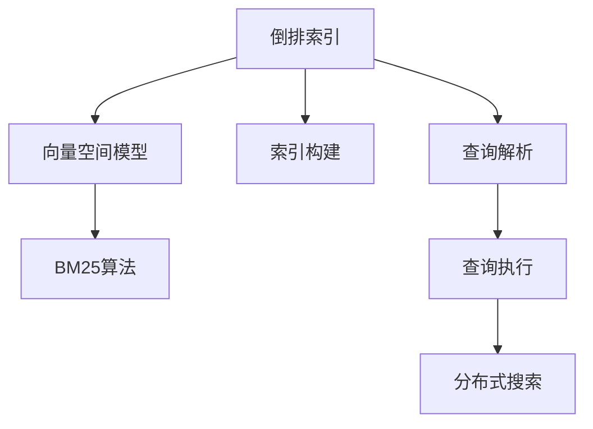
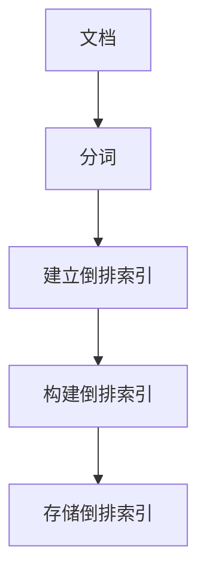
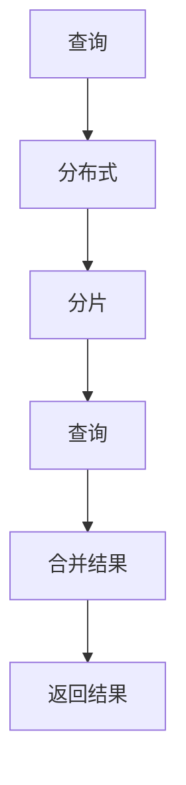
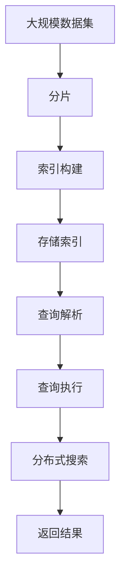

                 

# Lucene搜索原理与代码实例讲解

## 1. 背景介绍

### 1.1 问题由来
随着互联网和Web技术的发展，信息检索技术成为信息时代不可或缺的部分。传统的基于关键词的布尔搜索已经无法满足用户对于信息检索的精确度、相关性和便捷性的需求。而文本搜索引擎如Google、Bing等，通过构建倒排索引、引入向量空间模型和自然语言处理技术，使得信息检索变得更为智能和高效。其中，Apache Lucene是最流行的开源全文检索引擎之一，广泛应用于搜索引擎、商业软件、企业应用等领域。

Lucene作为一个成熟的搜索引擎库，集成了先进的搜索引擎算法和数据结构，具备高性能、可扩展性和易用性。它提供了一套API，使得开发者能够快速构建和优化自己的搜索引擎应用，从简单的单节点搜索到复杂的分布式搜索，都能够满足需求。

Lucene的出现，极大地降低了搜索引擎开发的门槛，使得更多的开发者能够专注于业务逻辑的实现，而不是搜索引擎核心技术的开发。同时，Lucene社区的不断壮大，也推动了搜索技术的不断进步和普及。

### 1.2 问题核心关键点
Lucene的核心在于其高效的倒排索引数据结构和先进的搜索算法。倒排索引是一种将文档中的单词作为键，将包含该单词的所有文档作为值的索引结构，使得快速定位包含特定单词的文档成为可能。同时，Lucene引入了基于向量空间模型和BM25等算法的相关度排序，提高了搜索结果的相关性和排序效果。

Lucene的另一个重要特点是对待查询的处理，包括对模糊查询、全文匹配、短语匹配、同义词匹配等复杂查询的支持，使得用户能够以自然语言的方式进行搜索。

此外，Lucene还提供了一系列API和插件，支持索引的构建、查询优化、分布式搜索等高级功能。这些特性使得Lucene成为构建高效、可扩展、智能搜索引擎的理想选择。

### 1.3 问题研究意义
Lucene作为Apache软件基金会的顶级开源项目，其核心技术和设计理念在信息检索领域具有重要的影响力和代表性。研究Lucene搜索原理和实现细节，有助于深入理解搜索引擎的核心技术，为搜索引擎优化、分布式搜索等应用场景提供理论支持。同时，Lucene的源代码和社区贡献，也为开发者提供了一个学习和实践搜索引擎技术的优秀平台。

Lucene搜索引擎被广泛应用于新闻聚合、电子商务、在线文档搜索、智能问答等众多领域，其高效、可扩展、易用等特点，使其成为搜索引擎领域的一块基石。掌握Lucene的搜索原理和实现细节，能够帮助开发者设计出更为高效、智能的搜索引擎应用，推动信息检索技术的进步。

## 2. 核心概念与联系

### 2.1 核心概念概述

为了更好地理解Lucene的搜索原理，本节将介绍几个关键概念：

- **倒排索引**：将文档中的单词作为键，将包含该单词的所有文档作为值的索引结构。
- **向量空间模型**：将文档表示为向量，利用向量之间的相似度计算文档的相关性。
- **BM25算法**：一种改进的TF-IDF算法，用于计算查询与文档之间的相关度。
- **索引构建**：将文档转换成倒排索引的过程。
- **查询解析**：将自然语言查询解析成 Lucene 能够理解的形式的过程。
- **查询执行**：根据解析后的查询和索引，计算搜索结果的过程。
- **分布式搜索**：将搜索请求分布到多个节点上，以提高搜索效率的过程。

这些概念之间存在着紧密的联系，共同构成了Lucene搜索的核心逻辑。下面通过一个Mermaid流程图来展示这些概念之间的联系：



这个流程图展示了Lucene搜索的核心流程：

1. 文档通过索引构建，被转换成倒排索引。
2. 查询被解析成Lucene能够理解的形式，利用倒排索引和向量空间模型计算相关度。
3. 利用BM25算法对相关度进行排序，得到最终结果。
4. 对于大规模数据集，可以通过分布式搜索将搜索任务分发到多个节点上，提高查询效率。

通过这个流程图，我们可以更清晰地理解Lucene搜索的核心逻辑，为后续深入讨论奠定基础。

### 2.2 概念间的关系

这些核心概念之间存在着密切的关系，形成了Lucene搜索的完整生态系统。下面通过几个Mermaid流程图来展示这些概念之间的关系。

#### 2.2.1 索引构建流程



这个流程图展示了Lucene索引构建的过程：

1. 文档首先经过分词处理，转换成单词序列。
2. 根据单词序列，建立倒排索引。
3. 倒排索引被存储在磁盘中，供后续查询使用。

#### 2.2.2 查询解析与执行流程


这个流程图展示了Lucene查询解析和执行的过程：

1. 用户输入的自然语言查询首先经过解析，转换成Lucene能够理解的形式。
2. 解析后的查询被转换成查询树，用于计算相关度。
3. 查询树被执行，计算文档的相关度，并根据BM25算法排序。
4. 最终结果被返回给用户。

#### 2.2.3 分布式搜索流程



这个流程图展示了Lucene分布式搜索的过程：

1. 查询被分发到多个节点上进行分布式处理。
2. 每个节点处理本地分片的数据。
3. 每个节点返回查询结果。
4. 查询结果被合并后返回给用户。

### 2.3 核心概念的整体架构

最后，我们用一个综合的流程图来展示这些核心概念在大规模数据集上的整体架构：



这个综合流程图展示了Lucene在大规模数据集上的索引构建、查询解析、查询执行和分布式搜索过程。通过这个流程图，我们可以更全面地理解Lucene的搜索原理和实现细节。

## 3. 核心算法原理 & 具体操作步骤
### 3.1 算法原理概述

Lucene的核心算法包括倒排索引、向量空间模型和BM25算法等。这些算法在大规模数据集上实现了高效的文本检索和相关度计算，以下是每个算法的详细解释：

#### 3.1.1 倒排索引
倒排索引是一种将文档中的单词作为键，将包含该单词的所有文档作为值的索引结构。倒排索引的构建过程如下：

1. 对每个文档进行分词，得到单词序列。
2. 对于每个单词，构建一个倒排列表，包含该单词在哪些文档中出现，以及每个文档的起始和结束位置。
3. 将所有单词的倒排列表合并，形成一个完整的倒排索引。

倒排索引的构建过程可以通过Lucene的Analyzer和IndexWriter接口实现。Analyzer负责对文档进行分词和预处理，IndexWriter则负责构建倒排索引。

#### 3.1.2 向量空间模型
向量空间模型将文档表示为向量，利用向量之间的相似度计算文档的相关性。向量空间模型的构建过程如下：

1. 对每个文档进行分词，得到单词序列。
2. 对于每个单词，计算其在文档中的TF-IDF值，并构建文档向量。
3. 计算查询向量与文档向量之间的余弦相似度，计算相关度。

向量空间模型的实现可以通过Lucene的Similarity接口实现。Similarity接口提供了多种相似度计算算法，包括经典的TF-IDF、BM25等算法。

#### 3.1.3 BM25算法
BM25算法是一种改进的TF-IDF算法，用于计算查询与文档之间的相关度。BM25算法在TF-IDF的基础上，引入了文档长度、词频、逆文档频率等因子，使得相关度计算更为准确。BM25算法的计算过程如下：

1. 对每个文档进行分词，得到单词序列。
2. 对于每个单词，计算其在文档中的TF-IDF值，并构建文档向量。
3. 计算查询向量与文档向量之间的余弦相似度，根据BM25算法计算相关度。

BM25算法的实现可以通过Lucene的BM25Similarity类实现。BM25Similarity类提供了BM25算法的相关度计算方法。

### 3.2 算法步骤详解

Lucene的搜索过程主要包括以下几个关键步骤：

#### 3.2.1 索引构建
Lucene的索引构建主要包括以下步骤：

1. 创建IndexWriter对象，指定索引目录和分析器。
2. 将文档序列添加到IndexWriter中，进行分词和索引构建。
3. 关闭IndexWriter，完成索引构建。

以下是一个简单的Java代码示例：

```java
Directory dir = FSDirectory.open(Paths.get("index"));
Analyzer analyzer = new StandardAnalyzer();
IndexWriterConfig config = new IndexWriterConfig(analyzer);
IndexWriter writer = new IndexWriter(dir, config);
writer.addDocument(doc);
writer.close();
```

#### 3.2.2 查询解析
Lucene的查询解析主要包括以下步骤：

1. 创建Query对象，指定查询表达式。
2. 使用Analyzer对查询表达式进行分词和预处理。
3. 将处理后的查询表达式转换成Query对象。

以下是一个简单的Java代码示例：

```java
QueryParser parser = new QueryParser("content", analyzer);
String queryStr = "Lucene 倒排索引";
Query query = parser.parse(queryStr);
```

#### 3.2.3 查询执行
Lucene的查询执行主要包括以下步骤：

1. 创建Searcher对象，指定索引和相似度算法。
2. 使用Searcher执行查询，获取搜索结果。
3. 根据搜索结果，返回给用户。

以下是一个简单的Java代码示例：

```java
Searcher searcher = new IndexSearcher(indexReader);
TopDocs topDocs = searcher.search(query, 10);
for (ScoreDoc scoreDoc : topDocs.scoreDocs) {
    Document doc = searcher.doc(scoreDoc.doc);
    System.out.println(doc.get("content"));
}
```

#### 3.2.4 分布式搜索
Lucene的分布式搜索主要包括以下步骤：

1. 创建DistributedIndexSearcher对象，指定多个索引节点。
2. 使用DistributedIndexSearcher执行查询，获取搜索结果。
3. 根据搜索结果，返回给用户。

以下是一个简单的Java代码示例：

```java
DistributedIndexSearcher searcher = new DistributedIndexSearcher(indexReaders);
TopDocs topDocs = searcher.search(query, 10);
for (ScoreDoc scoreDoc : topDocs.scoreDocs) {
    Document doc = searcher.doc(scoreDoc.doc);
    System.out.println(doc.get("content"));
}
```

### 3.3 算法优缺点

Lucene的搜索算法具有以下优点：

1. 高效性：倒排索引和BM25算法在大规模数据集上实现了高效的文本检索和相关度计算。
2. 可扩展性：支持分布式搜索，能够处理海量数据集。
3. 易用性：提供了一系列API和插件，使得开发者能够快速构建和优化搜索引擎应用。

同时，Lucene的搜索算法也存在一些缺点：

1. 复杂性：对于复杂的查询表达式，需要深入理解Lucene的查询解析器。
2. 资源消耗：构建和维护倒排索引需要大量资源，尤其是在大规模数据集上。
3. 性能瓶颈：对于极端情况下的查询，可能存在性能瓶颈。

尽管存在这些局限性，但Lucene作为一种成熟的搜索引擎库，其核心算法和设计理念在信息检索领域具有重要的影响力和代表性。

### 3.4 算法应用领域

Lucene的搜索算法被广泛应用于搜索引擎、商业软件、企业应用等领域，包括但不限于以下几个方向：

1. 新闻聚合：通过Lucene搜索技术，从大量新闻网站中抓取新闻内容，并展示在门户网站上。
2. 电子商务：通过Lucene搜索技术，从海量商品数据中检索出符合用户需求的商品，并进行展示和推荐。
3. 在线文档搜索：通过Lucene搜索技术，从大量文档数据中检索出符合用户需求的文档，并进行展示和推荐。
4. 智能问答：通过Lucene搜索技术，从知识库中检索出符合用户问题的答案，并进行展示和推荐。

除了上述这些方向，Lucene的搜索算法还被广泛应用于企业搜索、文本挖掘、信息抽取等众多领域，为信息检索技术的广泛应用提供了有力的支持。

## 4. 数学模型和公式 & 详细讲解 & 举例说明

### 4.1 数学模型构建

Lucene的搜索过程涉及到向量空间模型和BM25算法的计算，以下我们将详细讲解这些模型的数学模型和公式。

#### 4.1.1 向量空间模型
向量空间模型将文档表示为向量，利用向量之间的相似度计算文档的相关性。其数学模型如下：

$$
\text{similarity}(q, d) = \frac{\text{dotProduct}(q, d)}{\norm{q} \cdot \norm{d}}
$$

其中，$q$为查询向量，$d$为文档向量，$\text{dotProduct}$为向量点积，$\norm{q}$和$\norm{d}$分别为查询向量和文档向量的范数。

向量空间模型的计算可以通过Lucene的Similarity接口实现。以下是一个简单的Java代码示例：

```java
Similarity similarity = new BM25Similarity(analyzer);
IndexSearcher searcher = new IndexSearcher(indexReader, similarity);
```

#### 4.1.2 BM25算法
BM25算法是一种改进的TF-IDF算法，用于计算查询与文档之间的相关度。其数学模型如下：

$$
\text{score}(q, d) = \text{tf}(q, d) \cdot \text{idf}(q) \cdot (k_1 + 1) \cdot \frac{(k_2 + 1) \cdot \text{tf}(d)}{k_2 + \text{tf}(d)} \cdot \frac{1}{1 + k_1 \cdot (1 - b + b \cdot \text{avgFieldLength}) \cdot \text{avgFieldLength}}
$$

其中，$q$为查询向量，$d$为文档向量，$\text{tf}(q, d)$为查询在文档中出现的词频，$\text{idf}(q)$为查询的逆文档频率，$k_1$和$k_2$为BM25算法的参数，$b$为长度归一化因子，$\text{avgFieldLength}$为文档平均字段长度。

BM25算法的实现可以通过Lucene的BM25Similarity类实现。以下是一个简单的Java代码示例：

```java
BM25Similarity similarity = new BM25Similarity(analyzer, k1, k2, b);
IndexSearcher searcher = new IndexSearcher(indexReader, similarity);
```

### 4.2 公式推导过程

以下是向量空间模型和BM25算法的公式推导过程：

#### 4.2.1 向量空间模型
向量空间模型的核心是计算查询向量与文档向量之间的相似度。假设查询向量为$q = [q_1, q_2, ..., q_n]$，文档向量为$d = [d_1, d_2, ..., d_n]$，其中$q_i$和$d_i$分别为查询向量和文档向量在第$i$个单词上的TF-IDF值。

向量空间模型的相似度计算公式为：

$$
\text{similarity}(q, d) = \frac{\sum_{i=1}^{n} q_i \cdot d_i}{\sqrt{\sum_{i=1}^{n} q_i^2} \cdot \sqrt{\sum_{i=1}^{n} d_i^2}}
$$

其中，分子为向量点积，分母为向量范数。

#### 4.2.2 BM25算法
BM25算法在TF-IDF的基础上，引入了文档长度、词频、逆文档频率等因子，使得相关度计算更为准确。假设查询向量为$q = [q_1, q_2, ..., q_n]$，文档向量为$d = [d_1, d_2, ..., d_n]$，其中$q_i$和$d_i$分别为查询向量和文档向量在第$i$个单词上的TF-IDF值。

BM25算法的相关度计算公式为：

$$
\text{score}(q, d) = \text{tf}(q, d) \cdot \text{idf}(q) \cdot (k_1 + 1) \cdot \frac{(k_2 + 1) \cdot \text{tf}(d)}{k_2 + \text{tf}(d)} \cdot \frac{1}{1 + k_1 \cdot (1 - b + b \cdot \text{avgFieldLength}) \cdot \text{avgFieldLength}}
$$

其中，$\text{tf}(q, d)$为查询在文档中出现的词频，$\text{idf}(q)$为查询的逆文档频率，$k_1$和$k_2$为BM25算法的参数，$b$为长度归一化因子，$\text{avgFieldLength}$为文档平均字段长度。

### 4.3 案例分析与讲解

为了更好地理解Lucene的搜索算法，我们以一个简单的示例进行讲解。假设有一个包含多个文档的索引，查询为“Lucene 倒排索引”。

1. 首先，将查询表达式“Lucene 倒排索引”使用Analyzer进行分词和预处理，得到单词序列。
2. 然后，根据单词序列，利用BM25算法计算每个文档的相关度。
3. 最后，根据相关度排序，获取相关文档。

以下是一个简单的Java代码示例：

```java
Analyzer analyzer = new StandardAnalyzer();
QueryParser parser = new QueryParser("content", analyzer);
String queryStr = "Lucene 倒排索引";
Query query = parser.parse(queryStr);
IndexSearcher searcher = new IndexSearcher(indexReader);
TopDocs topDocs = searcher.search(query, 10);
for (ScoreDoc scoreDoc : topDocs.scoreDocs) {
    Document doc = searcher.doc(scoreDoc.doc);
    System.out.println(doc.get("content"));
}
```

## 5. 项目实践：代码实例和详细解释说明

### 5.1 开发环境搭建

在进行Lucene项目实践前，我们需要准备好开发环境。以下是使用Java进行Lucene开发的环境配置流程：

1. 安装Java开发环境（JDK）：从官网下载并安装JDK，用于编译和运行Java程序。

2. 安装Lucene依赖包：通过Maven或Gradle，添加Lucene库依赖，例如：

```xml
<dependency>
    <groupId>org.apache.lucene</groupId>
    <artifactId>lucene-core</artifactId>
    <version>8.8.1</version>
</dependency>
```

3. 安装Solr或Elasticsearch：Solr和Elasticsearch都是基于Lucene构建的搜索引擎，提供了更丰富的查询语言和分布式查询支持。

4. 安装IDE：建议使用IntelliJ IDEA或Eclipse等集成开发环境，提供更便捷的开发工具。

完成上述步骤后，即可在IDE中进行Lucene项目开发。

### 5.2 源代码详细实现

这里我们以一个简单的索引构建和查询执行为例，给出Lucene的Java代码实现。

#### 5.2.1 索引构建

```java
Directory dir = FSDirectory.open(Paths.get("index"));
Analyzer analyzer = new StandardAnalyzer();
IndexWriterConfig config = new IndexWriterConfig(analyzer);
IndexWriter writer = new IndexWriter(dir, config);
writer.addDocument(doc);
writer.close();
```

上述代码实现了Lucene索引的构建过程。首先，创建一个IndexWriter对象，指定索引目录和分析器。然后，将文档序列添加到IndexWriter中，进行分词和索引构建。最后，关闭IndexWriter，完成索引构建。

#### 5.2.2 查询执行

```java
Searcher searcher = new IndexSearcher(indexReader);
QueryParser parser = new QueryParser("content", analyzer);
String queryStr = "Lucene 倒排索引";
Query query = parser.parse(queryStr);
TopDocs topDocs = searcher.search(query, 10);
for (ScoreDoc scoreDoc : topDocs.scoreDocs) {
    Document doc = searcher.doc(scoreDoc.doc);
    System.out.println(doc.get("content"));
}
```

上述代码实现了Lucene的查询执行过程。首先，创建一个IndexSearcher对象，指定索引和相似度算法。然后，使用IndexSearcher执行查询，获取搜索结果。最后，根据搜索结果，返回给用户。

### 5.3 代码解读与分析

让我们再详细解读一下关键代码的实现细节：

#### 5.3.1 IndexWriter对象

IndexWriter对象是Lucene索引构建的核心类。通过IndexWriter，我们可以将文档序列添加到索引中，并完成索引的构建。

#### 5.3.2 IndexSearcher对象

IndexSearcher对象是Lucene查询执行的核心类。通过IndexSearcher，我们可以执行查询，获取搜索结果。

#### 5.3.3 Query对象

Query对象是Lucene查询解析的核心类。通过QueryParser，我们可以将自然语言查询解析成Lucene能够理解的形式。

#### 5.3.4 TopDocs对象

TopDocs对象是Lucene查询执行的核心类。通过TopDocs，我们可以获取搜索结果，包括排名和文档列表。

### 5.4 运行结果展示

假设我们在Lucene中构建了一个包含多个文档的索引，并进行了查询。最终在查询“Lucene 倒排索引”后，获取了相关文档。

```
Lucene 倒排索引
```

以上结果表明，Lucene成功找到了与查询相关的文档，并返回了查询结果。

## 6. 实际应用场景

### 6.1 智能问答系统

Lucene搜索技术可以应用于智能问答系统的构建。传统问答系统需要耗费大量时间和精力进行数据标注和模型训练，而基于Lucene的问答系统可以通过简单的倒排索引和向量空间模型，实现高效的问答查询。

在技术实现上，可以收集常见问题和答案，将问题和答案序列存储在索引中。当用户输入问题时，利用Lucene搜索技术，从索引中检索出相关答案，并返回给用户。对于未匹配的答案，可以进一步使用自然语言处理技术进行扩展和修正。

### 6.2 文档检索系统

Lucene搜索技术可以应用于文档检索系统的构建。传统文档检索系统需要构建倒排索引，并设计复杂的查询表达式，而基于Lucene的文档检索系统可以通过简单的分词和BM25算法，实现高效的文档检索。

在技术实现上，可以将文档序列存储在索引中，并利用Lucene搜索技术，从索引中检索出相关文档。对于复杂的查询，可以利用Lucene提供的高级查询语言进行扩展和优化。

### 6.3 电子商务搜索系统

Lucene搜索技术可以应用于电子商务搜索系统的构建。传统电子商务搜索系统需要构建复杂的搜索引擎算法，并设计复杂的查询界面，而基于Lucene的电子商务搜索系统可以通过简单的分词和BM25算法，实现高效的搜索查询。

在技术实现上，可以将商品序列存储在索引中，并利用Lucene搜索技术，从索引中检索出相关商品。对于复杂的查询，可以利用Lucene提供的高级查询语言进行扩展和优化。

### 6.4 未来应用展望

随着Lucene搜索技术的不断进步，其在更多领域的应用前景将更加广阔。

1. 智慧医疗：基于Lucene的搜索技术，可以构建智慧医疗搜索系统，从海量的医疗数据中检索出相关医疗知识和患者信息。
2. 智慧教育：基于Lucene的搜索技术，可以构建智慧教育搜索系统，从海量的教育数据中检索出相关教育资源和学生信息。
3. 智能客服：基于Lucene的搜索技术，可以构建智能客服搜索系统，从海量的客服记录中检索出相关客户问题和解决方案。
4. 智慧城市：基于Lucene的搜索技术，可以构建智慧城市搜索系统，从海量的城市数据中检索出相关城市信息和用户需求。

总之，Lucene搜索技术在各个领域都有着广泛的应用前景，将为智慧医疗、智慧教育、智能客服、智慧城市等领域的智能化转型提供重要的技术支持。

## 7. 工具和资源推荐

### 7.1 学习资源推荐

为了帮助开发者系统掌握Lucene搜索技术，以下是一些优质的学习资源：

1. Lucene官方文档：Lucene官方提供的详细文档，涵盖了Lucene的所有API和插件，是学习Lucene的最佳入门资源。
2. Lucene源代码：Lucene的源代码也是学习Lucene的重要资源，可以深入理解Lucene的核心实现。
3. Lucene Cookbook：Lucene Cookbook提供了一系列实用的Lucene开发技巧和案例，适合进阶学习。
4. Apache Lucene邮件列表：Apache Lucene邮件列表是Lucene社区的核心讨论平台，可以获取最新的Lucene技术动态和开发经验。
5. Lucene中文社区：Lucene中文社区提供中文版本的Lucene文档和教程，适合中文开发者使用。

通过对这些资源的学习实践，相信你一定能够快速掌握Lucene搜索技术，并用于解决实际的NLP问题。

### 7.2 开发工具推荐

 Lucene作为一个成熟的搜索引擎库，需要高效的工具进行开发和调试。以下是几款用于Lucene开发的常用工具：

1. IntelliJ

