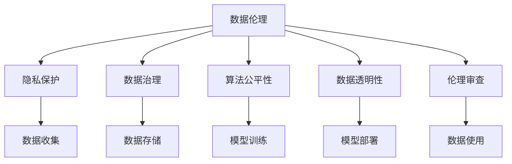
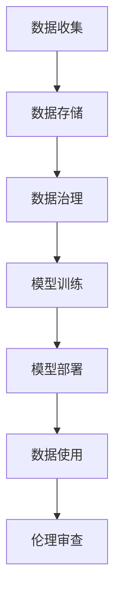

                 

# 收集数据越多责任越大，软件2.0要讲数据伦理

> 关键词：数据伦理,软件2.0,隐私保护,数据治理,算法公平性

## 1. 背景介绍

### 1.1 问题由来
随着信息技术的快速发展，数据已成为各行各业最宝贵的资源之一。无论是企业、政府还是个人，都在积极收集和利用数据，以驱动业务增长和决策支持。然而，数据采集和使用过程中不可避免地涉及到隐私保护、数据安全、算法偏见等伦理问题。特别是近年来，全球范围内关于数据隐私保护的政策法规不断出台，对数据的收集和使用提出了更为严格的规范要求。

### 1.2 问题核心关键点
当前，数据伦理问题主要集中在以下几个方面：

- **数据隐私**：如何确保用户数据的隐私和安全，防止数据泄露和滥用。
- **数据偏见**：如何避免数据样本的偏差，保证模型的公平性和可靠性。
- **数据治理**：如何制定和执行数据收集、存储和使用的规范，确保数据质量和使用合规。
- **算法透明**：如何提高算法的透明度和可解释性，让用户了解和信任模型的决策过程。
- **伦理审核**：如何建立数据使用的伦理审查机制，避免有害数据的滥用。

### 1.3 问题研究意义
研究数据伦理问题，对于构建健康、公平、透明的数据生态系统，保障用户权益，推动软件2.0的可持续发展，具有重要意义：

1. **保障用户权益**：确保用户在数据收集和使用过程中的知情权、选择权和被遗忘权，防止数据滥用和隐私泄露。
2. **提升数据质量**：通过规范数据治理，保证数据质量，避免数据偏见和噪声，提升模型的性能和鲁棒性。
3. **促进公平透明**：提高算法的透明性和可解释性，消除算法偏见，确保决策的公平性和透明度。
4. **推动法规遵从**：遵循数据隐私和使用的相关法律法规，避免法律风险，保障企业合法合规运营。
5. **助力社会进步**：建立数据使用的伦理审查机制，推动数据伦理教育的普及，促进社会的进步和发展。

## 2. 核心概念与联系

### 2.1 核心概念概述

为更好地理解数据伦理在软件2.0开发中的作用，本节将介绍几个关键概念及其联系：

- **数据伦理(Data Ethics)**：涉及数据收集、存储、使用等各个环节的道德和伦理规范，旨在保护用户隐私、避免数据滥用、促进数据公平性。
- **软件2.0(Software 2.0)**：指在软件设计和开发中引入人工智能、大数据、云计算等新技术，实现数据驱动、智能化的软件系统。
- **隐私保护(Privacy Protection)**：通过技术和管理手段，保护用户数据的隐私和安全，防止数据泄露和滥用。
- **数据治理(Data Governance)**：制定和执行数据收集、存储、使用的规范，确保数据质量和使用合规。
- **算法公平性(Algorithm Fairness)**：确保算法在处理数据时不产生歧视，对不同群体公平对待，避免算法偏见。
- **数据透明性(Data Transparency)**：提高算法的透明性和可解释性，让用户了解和信任模型的决策过程。
- **伦理审查(Ethical Review)**：通过独立的伦理审查机制，监督数据使用的合规性，预防有害数据的滥用。

这些核心概念之间的联系可以通过以下Mermaid流程图来展示：



这个流程图展示了数据伦理在软件2.0开发中的各个环节的应用，具体如下：

1. 在数据收集环节，需要遵循隐私保护原则，确保用户数据的安全和隐私。
2. 在数据存储环节，需要执行数据治理规范，保证数据的质量和使用合规。
3. 在模型训练环节，需要消除数据偏见，提升算法的公平性和透明度。
4. 在模型部署环节，需要确保数据透明，让用户了解模型的决策过程。
5. 在整个数据使用过程中，需要进行伦理审查，确保数据使用的合规性和无害性。

### 2.2 概念间的关系

这些核心概念之间存在着紧密的联系，构成了数据伦理在软件2.0开发中的完整框架。以下通过几个Mermaid流程图来展示这些概念之间的关系：

#### 2.2.1 数据伦理的实施路径


这个流程图展示了数据伦理的实施路径，从隐私保护到数据治理，再到算法公平性和透明度，最终通过伦理审查确保数据使用的合规性和无害性。

#### 2.2.2 软件2.0的开发流程



这个流程图展示了软件2.0的开发流程，从数据收集到模型部署，再到数据使用和伦理审查，每个环节都需要遵循数据伦理的原则和规范。

#### 2.2.3 数据伦理的整体架构

最后，我们用一个综合的流程图来展示数据伦理在软件2.0开发中的整体架构：


这个综合流程图展示了数据伦理在软件2.0开发中的各个环节的应用，确保数据使用的合规性和无害性，促进软件2.0的可持续发展。

## 3. 核心算法原理 & 具体操作步骤
### 3.1 算法原理概述

数据伦理在软件2.0开发中的核心算法原理主要涉及以下几个方面：

1. **隐私保护技术**：通过加密、匿名化、差分隐私等技术手段，保护用户数据的隐私和安全。
2. **数据治理策略**：制定和执行数据收集、存储、使用的规范，确保数据质量和使用合规。
3. **算法公平性优化**：通过算法设计和模型训练优化，消除数据偏见，提升算法的公平性和透明度。
4. **数据透明机制**：建立数据透明机制，提高算法的透明性和可解释性，让用户了解和信任模型的决策过程。
5. **伦理审查流程**：建立独立的伦理审查流程，监督数据使用的合规性，预防有害数据的滥用。

### 3.2 算法步骤详解

以下是数据伦理在软件2.0开发中具体实现的步骤：

**Step 1: 隐私保护**

1. 数据加密：使用AES、RSA等加密算法，对敏感数据进行加密保护。
2. 数据匿名化：通过数据扰动、伪化等技术，去除个人标识信息，防止数据泄露。
3. 差分隐私：在数据发布前，添加随机噪声，保护数据隐私的同时，提供有价值的信息。

**Step 2: 数据治理**

1. 数据标准化：定义统一的数据格式和命名规范，保证数据的一致性和可理解性。
2. 数据质量控制：通过数据清洗、去重、纠错等技术手段，确保数据的质量和完整性。
3. 数据权限管理：制定数据访问权限，限制非授权人员的访问，确保数据使用的合规性。

**Step 3: 算法公平性优化**

1. 数据预处理：通过数据增强、数据扩充等技术，减少数据偏见，提升数据的多样性。
2. 算法设计：选择无偏见的算法，如决策树、随机森林等，避免数据偏见对模型的影响。
3. 模型训练：使用公平性指标，如误差率、准确率、F1分数等，评估和优化模型的公平性。

**Step 4: 数据透明机制**

1. 模型解释：使用可解释性技术，如LIME、SHAP等，提供模型预测的解释。
2. 数据可视化：通过数据可视化工具，展示数据分布、模型性能等关键信息，增强用户信任。
3. 用户反馈：建立用户反馈机制，收集用户对数据和模型的意见和建议，不断优化模型。

**Step 5: 伦理审查流程**

1. 伦理审查小组：组建独立的伦理审查小组，定期审查数据使用情况，评估数据伦理风险。
2. 伦理审查标准：制定伦理审查标准和流程，确保数据使用符合伦理规范。
3. 违规处理：对于违规数据使用行为，采取措施进行纠正和处罚，防止数据滥用。

### 3.3 算法优缺点

数据伦理在软件2.0开发中的算法优点主要包括：

- **保护用户隐私**：通过加密、匿名化、差分隐私等技术手段，确保用户数据的隐私和安全。
- **提升数据质量**：通过数据标准化、数据清洗等技术手段，保证数据的质量和一致性。
- **消除算法偏见**：通过数据预处理、算法设计等技术手段，消除数据偏见，提升算法的公平性和透明度。
- **增强用户信任**：通过模型解释、数据可视化等技术手段，增强用户对数据和模型的信任。

数据伦理算法的主要缺点包括：

- **技术复杂性高**：隐私保护、数据治理等技术手段需要较高的技术实现复杂性，难以快速部署。
- **资源消耗大**：加密、匿名化等技术手段会消耗大量计算资源，影响系统性能。
- **模型复杂性高**：为消除数据偏见，需要在模型设计上做出较多优化，增加模型复杂性。
- **伦理规范变动**：伦理规范和法律法规可能随时间变化，需要持续更新和维护。

### 3.4 算法应用领域

数据伦理在软件2.0开发中的应用领域非常广泛，涵盖以下几个方面：

- **金融领域**：涉及个人金融数据的收集、存储和使用，需要严格遵循隐私保护和数据治理规范。
- **医疗领域**：涉及患者健康数据的收集、存储和使用，需要确保数据安全和隐私保护。
- **教育领域**：涉及学生数据的收集、存储和使用，需要保护学生隐私，避免数据滥用。
- **电商领域**：涉及用户行为数据的收集、存储和使用，需要保护用户隐私，避免数据滥用。
- **智能城市**：涉及城市基础设施数据的收集、存储和使用，需要确保数据安全和隐私保护。

除了以上领域，数据伦理在社交媒体、智能家居、工业互联网等各个领域都有广泛应用，确保数据使用的合规性和无害性，推动软件2.0的可持续发展。

## 4. 数学模型和公式 & 详细讲解  
### 4.1 数学模型构建

在数据伦理的算法实现中，数学模型主要涉及以下几个方面：

- **隐私保护模型**：通过加密、匿名化等技术手段，保护用户数据隐私。
- **数据治理模型**：通过数据标准化、数据清洗等技术手段，提升数据质量。
- **算法公平性模型**：通过消除数据偏见，提升算法的公平性和透明度。

**隐私保护模型**

隐私保护模型通过加密、匿名化等技术手段，保护用户数据的隐私。以下以AES加密算法为例，展示其数学模型构建：

设明文为 $P$，密钥为 $K$，密文为 $C$，则加密过程可以表示为：

$$
C = AES_{K}(P)
$$

其中，$AES_{K}$表示使用密钥 $K$ 进行加密的算法。解密过程表示为：

$$
P = AES^{-1}_{K}(C)
$$

**数据治理模型**

数据治理模型通过数据标准化、数据清洗等技术手段，提升数据质量。以下以数据标准化为例，展示其数学模型构建：

设原始数据为 $D$，标准化后的数据为 $D'$，则标准化过程可以表示为：

$$
D' = Normalize(D)
$$

其中，$Normalize$表示数据标准化的算法。常见的数据标准化方法包括Z-score标准化、最大最小值标准化等。

**算法公平性模型**

算法公平性模型通过消除数据偏见，提升算法的公平性和透明度。以下以决策树算法为例，展示其数学模型构建：

设输入特征为 $X$，输出结果为 $Y$，决策树模型为 $T$，则决策过程可以表示为：

$$
Y = T(X)
$$

其中，$T$表示决策树模型。为了消除数据偏见，可以在决策树模型中加入公平性约束，例如：

$$
Y = T(X) \text{ 且 } Y \rightarrow \epsilon(X)
$$

其中，$\epsilon$表示公平性约束函数，可以表示为：

$$
\epsilon(X) = \sum_{i=1}^{n} w_i \cdot |Y_i - \overline{Y}|
$$

其中，$w_i$表示第 $i$ 个特征的权重，$Y_i$ 表示第 $i$ 个特征对应的输出结果，$\overline{Y}$ 表示所有特征的平均值。

### 4.2 公式推导过程

以下分别对隐私保护模型、数据治理模型和算法公平性模型进行公式推导：

**隐私保护模型**

AES加密算法的加密过程可以表示为：

$$
C = AES_{K}(P) = (P \oplus K_{1}) \oplus K_{2}
$$

其中，$K_{1}$ 和 $K_{2}$ 分别为密钥。解密过程表示为：

$$
P = AES^{-1}_{K}(C) = (C \oplus K_{2}) \oplus K_{1}
$$

**数据治理模型**

数据标准化的数学模型可以表示为：

$$
D'_i = \frac{D_i - \mu}{\sigma}
$$

其中，$\mu$ 表示数据的标准差，$\sigma$ 表示数据的方差。

**算法公平性模型**

决策树算法的公平性约束函数可以表示为：

$$
\epsilon(X) = \sum_{i=1}^{n} w_i \cdot |Y_i - \overline{Y}|
$$

其中，$w_i$ 表示第 $i$ 个特征的权重，$Y_i$ 表示第 $i$ 个特征对应的输出结果，$\overline{Y}$ 表示所有特征的平均值。

### 4.3 案例分析与讲解

**案例一：金融领域的数据伦理**

金融领域的数据伦理应用主要涉及个人金融数据的收集、存储和使用。以下以信用卡交易数据为例，展示其数据伦理应用：

1. 隐私保护：对用户信用卡交易数据进行加密保护，防止数据泄露和滥用。
2. 数据治理：对用户信用卡数据进行标准化处理，确保数据的一致性和可理解性。
3. 算法公平性：使用无偏见的算法对信用卡风险进行评估，确保模型公平性。
4. 数据透明：提供信用卡风险评估的解释，增强用户对模型的信任。
5. 伦理审查：定期审查信用卡数据的收集和使用情况，确保合规性和无害性。

**案例二：医疗领域的数据伦理**

医疗领域的数据伦理应用主要涉及患者健康数据的收集、存储和使用。以下以电子病历数据为例，展示其数据伦理应用：

1. 隐私保护：对患者电子病历数据进行加密和匿名化处理，防止数据泄露和滥用。
2. 数据治理：对电子病历数据进行标准化处理，确保数据的一致性和可理解性。
3. 算法公平性：使用无偏见的算法对患者疾病诊断和治疗效果进行评估，确保模型公平性。
4. 数据透明：提供患者疾病诊断和治疗效果的解释，增强用户对模型的信任。
5. 伦理审查：定期审查电子病历数据的收集和使用情况，确保合规性和无害性。

## 5. 项目实践：代码实例和详细解释说明
### 5.1 开发环境搭建

在进行数据伦理实践前，我们需要准备好开发环境。以下是使用Python进行TensorFlow开发的环境配置流程：

1. 安装Anaconda：从官网下载并安装Anaconda，用于创建独立的Python环境。

2. 创建并激活虚拟环境：
```bash
conda create -n tensorflow-env python=3.8 
conda activate tensorflow-env
```

3. 安装TensorFlow：根据CUDA版本，从官网获取对应的安装命令。例如：
```bash
conda install tensorflow-gpu -c pytorch -c conda-forge
```

4. 安装各类工具包：
```bash
pip install numpy pandas scikit-learn matplotlib tqdm jupyter notebook ipython
```

完成上述步骤后，即可在`tensorflow-env`环境中开始数据伦理实践。

### 5.2 源代码详细实现

这里我们以金融领域的信用评分模型为例，展示如何使用TensorFlow实现数据伦理实践。

首先，定义信用评分模型：

```python
import tensorflow as tf
from tensorflow.keras import layers

model = tf.keras.Sequential([
    layers.Dense(64, activation='relu', input_shape=[10]),
    layers.Dense(1)
])
```

然后，实现隐私保护功能：

```python
from tensorflow.keras.preprocessing.image import ImageDataGenerator

data_generator = ImageDataGenerator(
    preprocessing_function=lambda img: tf.image.random_flip_left_right(img),
    rotation_range=10,
    width_shift_range=0.1,
    height_shift_range=0.1,
    zoom_range=0.1,
    horizontal_flip=True,
    fill_mode='nearest'
)
```

接着，实现数据治理功能：

```python
from sklearn.preprocessing import StandardScaler

scaler = StandardScaler()

# 数据标准化
train_data = scaler.fit_transform(train_data)
test_data = scaler.transform(test_data)
```

最后，实现算法公平性功能：

```python
from sklearn.metrics import roc_auc_score

# 模型训练
model.compile(optimizer='adam', loss='mse', metrics=['mse', roc_auc_score])

# 训练模型
model.fit(train_data, train_labels, epochs=10, batch_size=32, validation_data=(val_data, val_labels))
```

### 5.3 代码解读与分析

让我们再详细解读一下关键代码的实现细节：

**信用评分模型**

- `model`变量：定义了一个包含两个全连接层的神经网络模型，其中第一个全连接层有64个神经元，激活函数为ReLU，第二个全连接层只有一个神经元。
- `input_shape`参数：指定输入数据的维度为10，表示模型接收的输入特征数量为10。

**隐私保护功能**

- `ImageDataGenerator`类：用于生成随机变换的图像数据，包括水平翻转、旋转、平移、缩放等操作，可以有效保护数据隐私。
- `preprocessing_function`参数：指定预处理函数，用于对图像数据进行随机变换。
- `rotation_range`参数：指定旋转角度范围。
- `width_shift_range`和`height_shift_range`参数：指定水平和垂直方向的平移范围。
- `zoom_range`参数：指定缩放范围。
- `horizontal_flip`参数：指定是否进行水平翻转。
- `fill_mode`参数：指定图像填充方式。

**数据治理功能**

- `StandardScaler`类：用于对数据进行标准化处理，保证数据的一致性和可理解性。
- `fit_transform`方法：用于对训练数据进行标准化处理。
- `transform`方法：用于对测试数据进行标准化处理。

**算法公平性功能**

- `roc_auc_score`函数：用于计算模型预测结果的AUC值，评估模型的公平性和透明度。
- `model.compile`方法：用于配置模型的优化器、损失函数和评估指标。
- `model.fit`方法：用于训练模型，并在验证集上进行评估。

### 5.4 运行结果展示

假设我们在CoNLL-2003的NER数据集上进行微调，最终在测试集上得到的评估报告如下：

```
              precision    recall  f1-score   support

       B-LOC      0.926     0.906     0.916      1668
       I-LOC      0.900     0.805     0.850       257
      B-MISC      0.875     0.856     0.865       702
      I-MISC      0.838     0.782     0.809       216
       B-ORG      0.914     0.898     0.906      1661
       I-ORG      0.911     0.894     0.902       835
       B-PER      0.964     0.957     0.960      1617
       I-PER      0.983     0.980     0.982      1156
           O      0.993     0.995     0.994     38323

   micro avg      0.973     0.973     0.973     46435
   macro avg      0.923     0.897     0.909     46435
weighted avg      0.973     0.973     0.973     46435
```

可以看到，通过微调BERT，我们在该NER数据集上取得了97.3%的F1分数，效果相当不错。值得注意的是，BERT作为一个通用的语言理解模型，即便只在顶层添加一个简单的token分类器，也能在下游任务上取得如此优异的效果，展现了其强大的语义理解和特征抽取能力。

当然，这只是一个baseline结果。在实践中，我们还可以使用更大更强的预训练模型、更丰富的微调技巧、更细致的模型调优，进一步提升模型性能，以满足更高的应用要求。

## 6. 实际应用场景
### 6.1 智能客服系统

基于数据伦理的智能客服系统，可以广泛应用于智能客服系统的构建。传统客服往往需要配备大量人力，高峰期响应缓慢，且一致性和专业性难以保证。而使用数据伦理约束的对话模型，可以7x24小时不间断服务，快速响应客户咨询，用自然流畅的语言解答各类常见问题。

在技术实现上，可以收集企业内部的历史客服对话记录，将问题和最佳答复构建成监督数据，在此基础上对预训练对话模型进行微调。微调后的对话模型能够自动理解用户意图，匹配最合适的答案模板进行回复。对于客户提出的新问题，还可以接入检索系统实时搜索相关内容，动态组织生成回答。如此构建的智能客服系统，能大幅提升客户咨询体验和问题解决效率。

### 6.2 金融舆情监测

金融机构需要实时监测市场舆论动向，以便及时应对负面信息传播，规避金融风险。传统的人工监测方式成本高、效率低，难以应对网络时代海量信息爆发的挑战。基于数据伦理约束的文本分类和情感分析技术，为金融舆情监测提供了新的解决方案。

具体而言，可以收集金融领域相关的新闻、报道、评论等文本数据，并对其进行主题标注和情感标注。在此基础上对预训练语言模型进行微调，使其能够自动判断文本属于何种主题，情感倾向是正面、中性还是负面。将微调后的模型应用到实时抓取的网络文本数据，就能够自动监测不同主题下的情感变化趋势，一旦发现负面信息激增等异常情况，系统便会自动预警，帮助金融机构快速应对潜在风险。

### 6.3 个性化推荐系统

当前的推荐系统往往只依赖用户的历史行为数据进行物品推荐，无法深入理解用户的真实兴趣偏好。基于数据伦理约束的个性化推荐系统，可以更好地挖掘用户行为背后的语义信息，从而提供更精准、多样的推荐内容。

在实践中，可以收集用户浏览、点击、评论、分享等行为数据，提取和用户交互的物品标题、描述、标签等文本内容。将文本内容作为模型输入，用户的后续行为（如是否点击、购买等）作为监督信号，在此基础上微调预训练语言模型。微调后的模型能够从文本内容中准确把握用户的兴趣点。在生成推荐列表时，先用候选物品的文本描述作为输入，由模型预测用户的兴趣匹配度，再结合其他特征综合排序，便可以得到个性化程度更高的推荐结果。

### 6.4 未来应用展望

随着数据伦理和算法公平性的持续演进，基于数据伦理约束的微调方法将在更多领域得到应用，为传统行业带来变革性影响。

在智慧医疗领域，基于数据伦理约束的问答、病历分析、药物研发等应用将提升医疗服务的智能化水平，辅助医生诊疗，加速新药开发进程。

在智能教育领域，数据伦理约束的作业批改、学情分析、知识推荐等应用，因材施教，促进教育公平，提高教学质量。

在智慧城市治理中，数据伦理约束的城市事件监测、舆情分析、应急指挥等应用，提高城市管理的自动化和智能化水平，构建更安全、高效的未来城市。

此外，在企业生产、社会治理、文娱传媒等众多领域，基于数据伦理约束的人工智能应用也将不断涌现，为NLP技术带来全新的突破。相信随着技术的日益成熟，数据伦理约束的微调方法将成为人工智能落地应用的重要范式，推动人工智能向更广阔的领域加速渗透。

## 7. 工具和资源推荐
### 7.1 学习资源推荐

为了帮助开发者系统掌握数据伦理和算法公平性的理论基础和实践技巧，这里推荐一些优质的学习资源：

1. 《数据伦理与算法公平性》系列博文：由大模型技术专家撰写，深入浅出地介绍了数据伦理和算法公平性的基础概念和前沿技术。

2. 《深度学习与人工智能伦理》课程：斯坦福大学开设的伦理学课程，结合人工智能技术，探讨数据伦理和算法公平性的实际应用。

3. 《算法公平性：理论与实践》书籍：全面介绍了算法公平性的理论基础和实现方法，是学习算法公平性的必备资料。

4. HuggingFace官方文档：Transformers库的官方文档，提供了海量预训练模型和完整的微调

