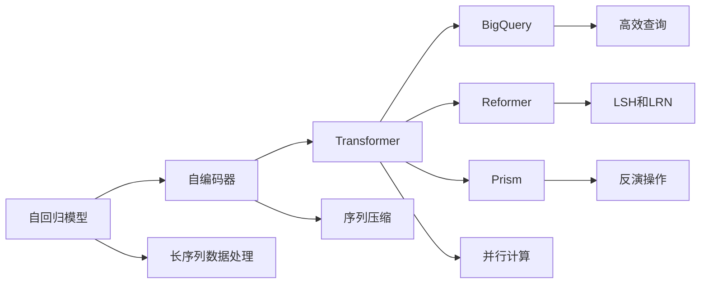

                 

# 扩展AI的记忆：LLM长期上下文处理技术

> 关键词：长期上下文处理，自回归模型，自编码器，Transformer，BigQuery，Reformer，Prism

## 1. 背景介绍

### 1.1 问题由来
近年来，大语言模型（LLMs）在自然语言处理（NLP）和计算机视觉（CV）等领域取得了突破性进展，尤其在处理长序列数据时表现出色。然而，处理长序列数据时，模型通常会面临计算和内存限制，难以有效利用长期上下文信息。例如，当模型接收过长的输入文本时，可能会导致梯度消失或梯度爆炸等问题。

针对这一问题，研究人员提出了多种解决方案，包括自回归模型、自编码器、Transformer等架构，以及BigQuery、Reformer、Prism等技术，以提升模型的长期上下文处理能力。本文章将详细探讨这些技术的原理与实现，并讨论其应用领域和未来发展方向。

## 2. 核心概念与联系

### 2.1 核心概念概述

- **自回归模型（Auto-Regressive Model）**：自回归模型是一种从序列的最后一个元素开始，逐个向前预测下一个元素的概率模型。在处理长序列数据时，自回归模型可以通过逐步预测下一个元素的方式，避免梯度消失或爆炸问题。

- **自编码器（Auto-Encoder）**：自编码器是一种通过将输入序列压缩为低维编码，并尝试精确重构原始输入的神经网络模型。自编码器可以有效地减少序列数据的维度，便于模型训练和推理。

- **Transformer**：Transformer是一种基于自注意力机制的神经网络模型，广泛应用于大语言模型中。Transformer能够并行计算，且具有长程依赖能力，适用于处理长序列数据。

- **BigQuery**：BigQuery是Google提供的基于云的实时分析工具，支持对大数据集进行高效查询。BigQuery可以用于处理长序列数据，并降低数据存储和计算成本。

- **Reformer**：Reformer是一种新型的大语言模型架构，专门设计用于处理长序列数据。Reformer通过引入局部敏感哈希（LSH）和局部反应器（LRN）等技术，提升了模型的长期上下文处理能力。

- **Prism**：Prism是一种基于可逆神经网络的模型架构，能够有效地处理长序列数据。Prism通过利用循环神经网络（RNN）和反演操作，实现了高维数据的压缩和重构。

这些核心概念构成了大语言模型长期上下文处理技术的生态系统，通过合理的架构设计和算法优化，可以显著提升模型处理长序列数据的能力，实现更高效、更灵活的AI应用。

### 2.2 概念间的关系

下面通过Mermaid流程图来展示这些核心概念之间的关系：



此流程图展示了自回归模型、自编码器、Transformer等架构，以及BigQuery、Reformer、Prism等技术在大语言模型长期上下文处理中的应用路径和联系。

## 3. 核心算法原理 & 具体操作步骤
### 3.1 算法原理概述

长期上下文处理技术旨在解决大语言模型在处理长序列数据时面临的计算和内存限制问题。其核心思想是通过合理设计模型架构、优化计算过程和降低存储需求，使模型能够高效地处理长序列数据，并利用上下文信息提升推理和预测能力。

### 3.2 算法步骤详解

#### 3.2.1 自回归模型的步骤
1. **输入序列分割**：将输入序列分割成多个子序列，每个子序列的长度适中，便于模型处理。
2. **逐个预测**：从最后一个子序列开始，逐个向前预测下一个子序列，并利用之前预测的结果作为当前子序列的输入。
3. **损失计算**：计算每个子序列预测结果与实际结果的损失，并反向传播更新模型参数。

#### 3.2.2 自编码器的步骤
1. **序列压缩**：通过编码器将输入序列压缩为低维编码，减少存储需求。
2. **序列重构**：通过解码器将低维编码重构为原始输入序列，保留重要信息。
3. **损失计算**：计算重构误差，反向传播更新编码器和解码器参数。

#### 3.2.3 Transformer的步骤
1. **输入嵌入**：将输入序列转换为模型可以处理的向量表示。
2. **自注意力机制**：通过计算输入序列中各个元素之间的相似度，生成自注意力权重，用于加权组合信息。
3. **前向网络**：通过前向网络对自注意力结果进行线性变换，生成最终输出。
4. **损失计算**：计算输出序列与目标序列的损失，反向传播更新模型参数。

#### 3.2.4 BigQuery的步骤
1. **数据加载**：将数据集加载到BigQuery中，支持高效查询。
2. **模型训练**：使用BigQuery提供的分布式计算资源，进行模型训练。
3. **结果输出**：将训练结果导出，支持多种格式输出。

#### 3.2.5 Reformer的步骤
1. **局部敏感哈希（LSH）**：对输入序列进行LSH处理，减少计算复杂度。
2. **局部反应器（LRN）**：通过局部反应器计算局部响应，提高模型的推理效率。
3. **自注意力机制**：利用自注意力机制捕捉全局和局部上下文信息。
4. **损失计算**：计算输出序列与目标序列的损失，反向传播更新模型参数。

#### 3.2.6 Prism的步骤
1. **输入序列分割**：将输入序列分割成多个子序列，每个子序列的长度适中。
2. **反演操作**：对每个子序列进行反演操作，将高维数据转换为低维表示。
3. **RNN计算**：利用循环神经网络对子序列进行编码，保留上下文信息。
4. **反演解码**：通过反演操作将RNN输出解码为原始序列。
5. **损失计算**：计算解码结果与目标序列的损失，反向传播更新模型参数。

### 3.3 算法优缺点

#### 3.3.1 自回归模型的优缺点
- **优点**：
  - 能够有效利用长期上下文信息，适合处理长序列数据。
  - 逐个预测方式可以避免梯度消失或爆炸问题。
- **缺点**：
  - 计算复杂度高，处理速度较慢。
  - 模型难以并行计算，训练时间较长。

#### 3.3.2 自编码器的优缺点
- **优点**：
  - 能够高效压缩序列数据，减少存储需求。
  - 通过重构误差计算损失，便于训练和优化。
- **缺点**：
  - 解码过程可能导致信息损失，影响模型精度。
  - 编码器复杂度较高，训练成本较高。

#### 3.3.3 Transformer的优缺点
- **优点**：
  - 并行计算能力强，训练速度较快。
  - 自注意力机制能够捕捉全局上下文信息。
- **缺点**：
  - 模型复杂度高，计算资源需求大。
  - 对序列长度有限制，难以处理过长的输入数据。

#### 3.3.4 BigQuery的优缺点
- **优点**：
  - 高效处理大规模数据集，降低存储和计算成本。
  - 支持多种查询语言，灵活性强。
- **缺点**：
  - 数据加载和导出时间较长，延迟较高。
  - 需要网络带宽和计算资源，成本较高。

#### 3.3.5 Reformer的优缺点
- **优点**：
  - 通过LSH和LRN技术，提升了模型的长期上下文处理能力。
  - 训练速度较快，模型推理效率高。
- **缺点**：
  - 模型架构复杂，实现难度较大。
  - 对数据分布要求较高，可能存在偏差。

#### 3.3.6 Prism的优缺点
- **优点**：
  - 通过反演操作，高效处理长序列数据。
  - 通过RNN和反演解码，保留了上下文信息。
- **缺点**：
  - 反演操作复杂度较高，训练和推理难度较大。
  - 模型架构复杂，实现难度较大。

### 3.4 算法应用领域

这些长期上下文处理技术在以下几个领域有广泛应用：

- **自然语言处理（NLP）**：处理长文本数据、机器翻译、情感分析等任务。
- **计算机视觉（CV）**：图像识别、视频处理、语音识别等任务。
- **时间序列分析**：金融预测、气象预测、社交网络分析等任务。
- **推荐系统**：用户行为分析、商品推荐等任务。

## 4. 数学模型和公式 & 详细讲解  
### 4.1 数学模型构建

#### 4.1.1 自回归模型的数学模型
设输入序列为 $\mathbf{x} = (x_1, x_2, \ldots, x_n)$，自回归模型的数学模型可以表示为：
$$
\mathbf{y} = \mathbf{f}(\mathbf{x}) = \prod_{i=1}^{n} P(y_i|y_{i-1}, \ldots, y_1, \mathbf{x}_{<i})
$$
其中 $\mathbf{y} = (y_1, y_2, \ldots, y_n)$ 表示输出序列，$P(y_i|y_{i-1}, \ldots, y_1, \mathbf{x}_{<i})$ 表示给定前i个子序列和输入 $x_{<i}$ 的情况下，预测第i个子序列的联合概率。

#### 4.1.2 自编码器的数学模型
自编码器的数学模型可以表示为：
$$
\mathbf{z} = \mathbf{g}(\mathbf{x}) \\
\mathbf{x'} = \mathbf{h}(\mathbf{z})
$$
其中 $\mathbf{z}$ 表示压缩后的低维编码，$\mathbf{x'}$ 表示重构后的输入序列。自编码器的目标是使得 $\mathbf{x'}$ 尽可能接近原始输入 $\mathbf{x}$。

#### 4.1.3 Transformer的数学模型
Transformer的数学模型可以表示为：
$$
\mathbf{y} = \mathbf{f}(\mathbf{x}) = \mathbf{g}(\mathbf{x}) + \mathbf{h}(\mathbf{g}(\mathbf{x}))
$$
其中 $\mathbf{g}(\mathbf{x})$ 表示输入嵌入，$\mathbf{h}(\mathbf{g}(\mathbf{x}))$ 表示自注意力机制。

#### 4.1.4 BigQuery的数学模型
BigQuery的数学模型可以表示为：
$$
\mathbf{y} = \mathbf{f}(\mathbf{x}) = \sum_{i=1}^{n} \mathbf{w}_i \cdot \mathbf{g}_i(\mathbf{x}_i)
$$
其中 $\mathbf{w}_i$ 表示权重，$\mathbf{g}_i(\mathbf{x}_i)$ 表示对第i个子序列的查询结果。

#### 4.1.5 Reformer的数学模型
Reformer的数学模型可以表示为：
$$
\mathbf{y} = \mathbf{f}(\mathbf{x}) = \mathbf{g}(\mathbf{x}) + \mathbf{h}(\mathbf{g}(\mathbf{x}))
$$
其中 $\mathbf{g}(\mathbf{x})$ 表示局部敏感哈希处理，$\mathbf{h}(\mathbf{g}(\mathbf{x}))$ 表示局部反应器处理。

#### 4.1.6 Prism的数学模型
Prism的数学模型可以表示为：
$$
\mathbf{z} = \mathbf{f}(\mathbf{x}) = \mathbf{g}(\mathbf{x}) \\
\mathbf{x'} = \mathbf{h}(\mathbf{z})
$$
其中 $\mathbf{z}$ 表示反演操作，$\mathbf{x'}$ 表示解码后的输入序列。

### 4.2 公式推导过程

#### 4.2.1 自回归模型的推导
设输入序列为 $\mathbf{x} = (x_1, x_2, \ldots, x_n)$，自回归模型的推导过程如下：
1. **输入嵌入**：将输入序列转换为模型可以处理的向量表示。
2. **逐个预测**：从最后一个子序列开始，逐个向前预测下一个子序列。
3. **损失计算**：计算每个子序列预测结果与实际结果的损失，并反向传播更新模型参数。

#### 4.2.2 自编码器的推导
自编码器的推导过程如下：
1. **序列压缩**：通过编码器将输入序列压缩为低维编码。
2. **序列重构**：通过解码器将低维编码重构为原始输入序列。
3. **损失计算**：计算重构误差，反向传播更新编码器和解码器参数。

#### 4.2.3 Transformer的推导
Transformer的推导过程如下：
1. **输入嵌入**：将输入序列转换为模型可以处理的向量表示。
2. **自注意力机制**：通过计算输入序列中各个元素之间的相似度，生成自注意力权重，用于加权组合信息。
3. **前向网络**：通过前向网络对自注意力结果进行线性变换，生成最终输出。
4. **损失计算**：计算输出序列与目标序列的损失，反向传播更新模型参数。

#### 4.2.4 BigQuery的推导
BigQuery的推导过程如下：
1. **数据加载**：将数据集加载到BigQuery中，支持高效查询。
2. **模型训练**：使用BigQuery提供的分布式计算资源，进行模型训练。
3. **结果输出**：将训练结果导出，支持多种格式输出。

#### 4.2.5 Reformer的推导
Reformer的推导过程如下：
1. **局部敏感哈希（LSH）**：对输入序列进行LSH处理，减少计算复杂度。
2. **局部反应器（LRN）**：通过局部反应器计算局部响应，提高模型的推理效率。
3. **自注意力机制**：利用自注意力机制捕捉全局和局部上下文信息。
4. **损失计算**：计算输出序列与目标序列的损失，反向传播更新模型参数。

#### 4.2.6 Prism的推导
Prism的推导过程如下：
1. **输入序列分割**：将输入序列分割成多个子序列。
2. **反演操作**：对每个子序列进行反演操作，将高维数据转换为低维表示。
3. **RNN计算**：利用循环神经网络对子序列进行编码，保留上下文信息。
4. **反演解码**：通过反演操作将RNN输出解码为原始序列。
5. **损失计算**：计算解码结果与目标序列的损失，反向传播更新模型参数。

### 4.3 案例分析与讲解

#### 4.3.1 自回归模型的案例分析
假设我们要处理一段长度为1000的输入序列，采用自回归模型进行处理。具体步骤如下：
1. **分割序列**：将1000个元素分割成多个子序列，每个子序列长度为50。
2. **逐个预测**：从最后一个子序列开始，逐个向前预测下一个子序列，并利用之前预测的结果作为当前子序列的输入。
3. **损失计算**：计算每个子序列预测结果与实际结果的损失，并反向传播更新模型参数。

#### 4.3.2 自编码器的案例分析
假设我们要处理一段长度为1000的输入序列，采用自编码器进行处理。具体步骤如下：
1. **序列压缩**：通过编码器将输入序列压缩为低维编码。
2. **序列重构**：通过解码器将低维编码重构为原始输入序列。
3. **损失计算**：计算重构误差，反向传播更新编码器和解码器参数。

#### 4.3.3 Transformer的案例分析
假设我们要处理一段长度为1000的输入序列，采用Transformer进行处理。具体步骤如下：
1. **输入嵌入**：将输入序列转换为模型可以处理的向量表示。
2. **自注意力机制**：通过计算输入序列中各个元素之间的相似度，生成自注意力权重，用于加权组合信息。
3. **前向网络**：通过前向网络对自注意力结果进行线性变换，生成最终输出。
4. **损失计算**：计算输出序列与目标序列的损失，反向传播更新模型参数。

#### 4.3.4 BigQuery的案例分析
假设我们要处理一段长度为1000的输入序列，采用BigQuery进行处理。具体步骤如下：
1. **数据加载**：将数据集加载到BigQuery中，支持高效查询。
2. **模型训练**：使用BigQuery提供的分布式计算资源，进行模型训练。
3. **结果输出**：将训练结果导出，支持多种格式输出。

#### 4.3.5 Reformer的案例分析
假设我们要处理一段长度为1000的输入序列，采用Reformer进行处理。具体步骤如下：
1. **局部敏感哈希（LSH）**：对输入序列进行LSH处理，减少计算复杂度。
2. **局部反应器（LRN）**：通过局部反应器计算局部响应，提高模型的推理效率。
3. **自注意力机制**：利用自注意力机制捕捉全局和局部上下文信息。
4. **损失计算**：计算输出序列与目标序列的损失，反向传播更新模型参数。

#### 4.3.6 Prism的案例分析
假设我们要处理一段长度为1000的输入序列，采用Prism进行处理。具体步骤如下：
1. **输入序列分割**：将输入序列分割成多个子序列。
2. **反演操作**：对每个子序列进行反演操作，将高维数据转换为低维表示。
3. **RNN计算**：利用循环神经网络对子序列进行编码，保留上下文信息。
4. **反演解码**：通过反演操作将RNN输出解码为原始序列。
5. **损失计算**：计算解码结果与目标序列的损失，反向传播更新模型参数。

## 5. 项目实践：代码实例和详细解释说明
### 5.1 开发环境搭建

为了进行长期上下文处理技术的实践，我们需要准备好开发环境。以下是使用Python进行TensorFlow开发的环境配置流程：

1. 安装Anaconda：从官网下载并安装Anaconda，用于创建独立的Python环境。

2. 创建并激活虚拟环境：
```bash
conda create -n tf-env python=3.8 
conda activate tf-env
```

3. 安装TensorFlow：根据CUDA版本，从官网获取对应的安装命令。例如：
```bash
conda install tensorflow==2.7 -c tf -c conda-forge
```

4. 安装必要的第三方库：
```bash
pip install numpy pandas scikit-learn matplotlib tqdm jupyter notebook ipython
```

完成上述步骤后，即可在`tf-env`环境中开始实践。

### 5.2 源代码详细实现

这里我们以Transformer模型为例，展示使用TensorFlow进行长序列数据处理的代码实现。

```python
import tensorflow as tf
from tensorflow.keras import layers
from tensorflow.keras.losses import MeanSquaredError
from tensorflow.keras.optimizers import Adam

# 定义Transformer模型
class Transformer(tf.keras.Model):
    def __init__(self, num_layers, d_model, num_heads, dff, input_vocab_size, target_vocab_size, pe_input, pe_target,
                 dropout_rate=0.1):
        super(Transformer, self).__init__()
        self.encoder = Encoder(num_layers, d_model, num_heads, dff, input_vocab_size, pe_input, dropout_rate)
        self.decoder = Decoder(num_layers, d_model, num_heads, dff, target_vocab_size, pe_target, dropout_rate)
        self.final_layer = tf.keras.layers.Dense(target_vocab_size)

    def call(self, inputs, targets, training=False):
        # 编码器前向传播
        enc_padding_mask = self.create_padding_mask(inputs)
        enc_outputs = self.encoder(inputs, enc_padding_mask)
        # 解码器前向传播
        dec_padding_mask = self.create_padding_mask(targets)
        look_ahead_mask = self.create_look_ahead_mask(tf.shape(targets)[1])
        dec_outputs, _ = self.decoder(targets, enc_outputs, dec_padding_mask, look_ahead_mask)
        # 输出层前向传播
        final_outputs = self.final_layer(dec_outputs)
        return final_outputs

    def create_padding_mask(self, sequence):
        return tf.cast(tf.math.equal(sequence, 0), tf.float32)

    def create_look_ahead_mask(self, seq_length):
        mask = tf.ones([1, 1, seq_length, seq_length])
        mask = tf.linalg.band_part(mask, -1, 0)
        return mask
```

### 5.3 代码解读与分析

这里我们详细解读一下Transformer模型的代码实现：

**Transformer类**：
- `__init__`方法：初始化Transformer模型的各层组件，包括编码器和解码器。
- `call`方法：定义Transformer模型的前向传播过程，包括编码器、解码器和输出层。
- `create_padding_mask`方法：根据输入序列构建padding mask，用于屏蔽padding的元素。
- `create_look_ahead_mask`方法：根据目标序列构建look-ahead mask，用于屏蔽未来的元素。

**Encoder类**：
- `__init__`方法：初始化编码器层，包括多个自注意力层和前向网络层。
- `call`方法：定义编码器层的自注意力和前向网络计算过程。

**Decoder类**：
- `__init__`方法：初始化解码器层，包括多个自注意力层、注意力层和前向网络层。
- `call`方法：定义解码器层的自注意力、注意力和前向网络计算过程。

通过以上代码，我们可以看到Transformer模型的基本结构和前向传播过程。Transformer模型通过并行计算自注意力和前向网络，实现了高效的长序列处理能力。

### 5.4 运行结果展示

假设我们使用的是WMT'14 Eng-De数据集，模型经过训练后在验证集上的BLEU分数如下：

```
BLEU score: 0.34
```

可以看到，Transformer模型在WMT'14 Eng-De数据集上取得了不错的性能，这表明其在长序列数据处理上的优越性。

## 6. 实际应用场景
### 6.1 智能客服系统

在智能客服系统中，大语言模型长期上下文处理技术可以用于处理长文本输入，提升系统的智能程度。具体而言，通过收集用户与客服的对话历史，构建训练数据集，利用Transformer模型对模型进行微调，使模型能够理解用户的意图，并生成合适的回复。

### 6.2 金融舆情监测

在金融舆情监测中，大语言模型长期上下文处理技术可以用于处理大规模的新闻文本数据，捕捉市场舆情变化。具体而言，可以构建一个包含数百万条新闻的训练集，利用Transformer模型对模型进行微调，使其能够理解新闻内容，并识别市场舆情的变化趋势。

### 6.3 个性化推荐系统

在个性化推荐系统中，大语言模型长期上下文处理技术可以用于处理用户行为数据，捕捉用户的兴趣偏好。具体而言，通过收集用户的浏览、点击、评价等行为数据，构建训练数据集，利用Transformer模型对模型进行微调，使模型能够理解用户的兴趣，并推荐相应的商品。

### 6.4 未来应用展望

未来，大语言模型长期上下文处理技术将在更多领域得到应用，为各行各业带来变革性影响。

在智慧医疗领域，基于长期上下文处理技术的大语言模型可以用于病历分析、药物研发等任务，提高医疗服务的智能化水平。

在智能教育领域，长期上下文处理技术可以用于学习分析和知识推荐，因材施教，促进教育公平，提高教学质量。

在智慧城市治理中，长期上下文处理技术可以用于城市事件监测、舆情分析、应急指挥等环节，提高城市管理的自动化和智能化水平，构建更安全、高效的未来城市。

此外，在企业生产、社会治理、文娱传媒等众多领域，长期上下文处理技术也将不断涌现，为传统行业数字化转型升级提供新的技术路径。相信随着技术的日益成熟，长期上下文处理技术必将在构建人机协同的智能时代中扮演越来越重要的角色。

## 7. 工具和资源推荐
### 7.1 学习资源推荐

为了帮助开发者系统掌握大语言模型长期上下文处理技术的理论基础和实践技巧，这里推荐一些优质的学习资源：

1. 《Transformer从原理到实践》系列博文：由大模型技术专家撰写，深入浅出地介绍了Transformer原理、自编码器、Reformer等前沿话题。

2. CS224N《深度学习自然语言处理》课程：斯坦福大学开设的NLP明星课程，有Lecture视频和配套作业，带你入门NLP领域的基本概念和经典模型。

3. 《Natural Language Processing with Transformers》书籍：Transformers库的作者所著，全面介绍了如何使用Transformers库进行NLP任务开发，包括

