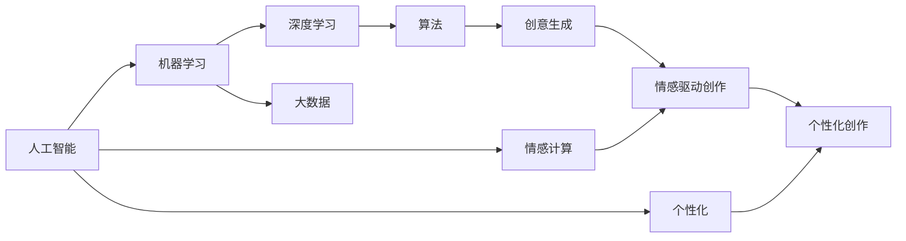

                 

# 数字化想象力：AI激发的创意思维

> 关键词：AI, 数字化, 创意思维, 机器学习, 深度学习, 算法, 人工智能, 未来技术, 创新, 艺术

## 1. 背景介绍

### 1.1 问题由来

在信息化飞速发展的今天，数字化已经渗透到我们生活的方方面面。AI技术的快速迭代和发展，正在逐步改变着我们对世界的认知方式和创作方式。人工智能（AI）不仅仅是替代人力，更激发了人类创新的想象力。

人工智能在各领域的应用，尤其是大数据、机器学习、深度学习等先进技术的应用，为创意思维提供了新的工具和手段。从艺术创作到科学发现，从教育到医疗，AI激发的数字化想象力正赋予我们前所未有的可能性。

### 1.2 问题核心关键点

人工智能激发的数字化想象力，主要体现在以下几个方面：

1. **数据驱动的创作**：AI能够处理和分析海量数据，从中挖掘出创作灵感。

2. **算法驱动的创意**：利用机器学习、深度学习等算法，生成新的创意和设计。

3. **交互式的创作**：AI能够与人类进行交互，实时反馈创作结果，进行迭代改进。

4. **跨领域的融合**：AI技术可以跨越艺术、科学、工程等多个领域，提供跨领域的创意思维。

5. **情感化的创作**：AI能够理解和模拟人类情感，创造出富有情感的作品。

6. **个性化的创作**：AI能够根据个人偏好生成定制化的作品，满足个性化需求。

7. **生态化的创作**：AI促进了创作者之间的协作，形成了共同创作的生态系统。

这些关键点共同构成了人工智能激发数字化想象力的全貌，推动着我们进入一个全新的创作时代。

### 1.3 问题研究意义

人工智能激发的数字化想象力，对于推动人类创新思维、探索新领域、提升创作质量具有重要意义：

1. **创新思维的扩展**：AI技术的引入，突破了传统创作方法的限制，激发了更多创新思维。

2. **创作效率的提升**：利用AI技术，创作者可以更加高效地完成创作工作。

3. **创作质量的提升**：AI技术能够提供高质量的创作建议和支持。

4. **创作成本的降低**：通过AI技术，创作者可以降低创作成本，加速创作过程。

5. **创作方式的变革**：AI技术能够突破物理和时间的限制，创造出前所未有的创作方式。

6. **创作生态的优化**：AI技术促进了创作者之间的协作，形成更高效的创作生态。

7. **创作体验的增强**：AI技术能够提供更加丰富、个性化的创作体验。

探索人工智能如何激发数字化想象力，有助于我们更好地理解未来的创作趋势，把握时代发展的脉搏，为创新之路提供坚实基础。

## 2. 核心概念与联系

### 2.1 核心概念概述

要深入理解人工智能如何激发数字化想象力，首先需要明确几个核心概念：

1. **人工智能（AI）**：指通过机器学习、深度学习等技术，使计算机系统具备一定智能化的过程。

2. **数字化想象力**：指利用数字化工具，如AI技术，激发创作者新的创作思维和创作灵感。

3. **机器学习（ML）**：通过训练算法，使计算机系统从数据中学习，自动提升性能。

4. **深度学习（DL）**：一种特殊的机器学习方法，通过多层神经网络，使计算机系统能够处理更复杂的任务。

5. **算法**：指导计算机系统完成任务的规则和步骤。

6. **大数据（Big Data）**：指海量、高速、多样化的数据集，为AI提供强大的数据基础。

7. **情感计算（Affective Computing）**：通过AI技术，模拟和识别人类的情感状态。

8. **个性化（Personalization）**：利用AI技术，根据个人偏好和需求，提供定制化服务。

这些核心概念构成了数字化想象力的基础框架，帮助我们理解AI如何激发和塑造创意思维。

### 2.2 概念间的关系

通过以下几个Mermaid流程图，我们可以更直观地理解这些核心概念之间的关系：



这个流程图展示了人工智能如何通过机器学习、深度学习等技术，结合大数据、算法、情感计算和个性化，激发创意思维，生成新的创作作品。

## 3. 核心算法原理 & 具体操作步骤

### 3.1 算法原理概述

人工智能激发数字化想象力的核心算法原理，主要基于以下几个方面：

1. **大数据处理**：通过机器学习和大数据分析，AI能够从海量数据中挖掘出创作灵感。

2. **深度学习生成**：利用深度学习技术，生成新的创意和设计。

3. **算法驱动创作**：通过设计巧妙的算法，引导AI生成创新的创作作品。

4. **情感模拟和识别**：通过情感计算技术，模拟和识别人类的情感，增强作品的情感表达。

5. **个性化创作**：根据个人偏好和需求，生成定制化的作品。

6. **跨领域融合**：将不同领域的技术和数据进行融合，提供跨领域的创意思维。

### 3.2 算法步骤详解

基于上述算法原理，AI激发数字化想象力的具体操作步骤可以概括为以下几个步骤：

1. **数据收集和处理**：收集和清洗数据，为AI训练提供数据基础。

2. **模型训练**：通过机器学习和深度学习技术，训练AI模型。

3. **创作过程的模拟**：利用训练好的AI模型，模拟创作过程。

4. **创作结果的生成**：生成新的创意和设计作品。

5. **创作结果的优化**：通过迭代和改进，提升创作作品的质量。

6. **作品展示和分享**：展示和分享创作成果，进行反馈和改进。

### 3.3 算法优缺点

人工智能激发数字化想象力的方法，具有以下优点：

1. **高效性**：利用AI技术，可以快速生成大量的创作作品。

2. **创新性**：AI能够提供新的创意思维和灵感。

3. **个性化**：能够根据个人需求生成定制化的作品。

4. **跨领域应用**：适用于艺术、科学、工程等多个领域。

5. **实时反馈**：能够实时提供创作建议，进行迭代改进。

然而，这些方法也存在一些局限性：

1. **缺乏人类情感和深度理解**：AI生成的作品往往缺乏人类的情感和深度理解。

2. **依赖高质量数据**：创作质量高度依赖数据的质量和多样性。

3. **复杂度较高**：需要复杂的算法和模型，难以广泛应用。

4. **伦理和版权问题**：AI生成的作品可能涉及伦理和版权问题。

5. **依赖强大计算资源**：需要高性能的计算资源，才能进行大规模的创作。

### 3.4 算法应用领域

人工智能激发数字化想象力的方法，已经在多个领域得到了广泛应用，例如：

1. **艺术创作**：通过AI技术，生成新的艺术作品，如绘画、音乐、文学等。

2. **科学研究**：利用AI技术，辅助科学发现，提供数据分析和模拟工具。

3. **教育培训**：通过AI技术，提供个性化的教育和培训方案。

4. **医疗健康**：利用AI技术，生成新的医疗方案和治疗策略。

5. **商业营销**：通过AI技术，生成创意广告和营销方案。

6. **游戏开发**：利用AI技术，生成新的游戏场景和角色。

7. **旅游规划**：通过AI技术，提供个性化的旅游方案和建议。

8. **虚拟现实**：利用AI技术，生成逼真的虚拟现实场景和体验。

未来，随着AI技术的不断进步，人工智能激发数字化想象力的应用领域将会更加广泛和深入。

## 4. 数学模型和公式 & 详细讲解 & 举例说明

### 4.1 数学模型构建

基于人工智能激发数字化想象力的算法原理，我们可以构建一个简化的数学模型：

设 $X$ 为输入的原始数据，$Y$ 为目标创作的输出作品。模型为 $f(X; \theta)$，其中 $\theta$ 为模型参数。

我们的目标是最大化输出作品的质量 $Q(Y)$，即 $max Q(f(X; \theta))$。

### 4.2 公式推导过程

为了最大化输出作品的质量，我们可以使用如下公式：

$$
\theta^* = \mathop{\arg\max}_{\theta} \int_{Y} Q(Y) p(Y|X;\theta)dY
$$

其中 $p(Y|X;\theta)$ 为在给定原始数据 $X$ 和模型参数 $\theta$ 的情况下，输出作品 $Y$ 的概率密度函数。

这个公式表达了通过最大化输出作品的概率密度函数，来最大化创作作品的质量。

### 4.3 案例分析与讲解

假设我们希望生成一段新的文学作品，可以构建如下数学模型：

设 $X$ 为输入的文学主题和风格，$Y$ 为目标创作的文学作品。模型为 $f(X; \theta)$，其中 $\theta$ 为模型参数。

我们的目标是最大化输出作品的文学价值 $Q(Y)$，即 $max Q(f(X; \theta))$。

设 $X$ 为文学主题，如“爱情”，$Y$ 为目标创作的文学作品。模型为 $f(X; \theta)$，其中 $\theta$ 为模型参数。

通过训练模型 $f(X; \theta)$，我们可以生成多种风格的文学作品，如浪漫、科幻、现实主义等。

## 5. 项目实践：代码实例和详细解释说明

### 5.1 开发环境搭建

在进行数字化想象力创作实践前，我们需要准备好开发环境。以下是使用Python进行PyTorch开发的环境配置流程：

1. 安装Anaconda：从官网下载并安装Anaconda，用于创建独立的Python环境。

2. 创建并激活虚拟环境：
```bash
conda create -n pytorch-env python=3.8 
conda activate pytorch-env
```

3. 安装PyTorch：根据CUDA版本，从官网获取对应的安装命令。例如：
```bash
conda install pytorch torchvision torchaudio cudatoolkit=11.1 -c pytorch -c conda-forge
```

4. 安装TensorFlow：如果需要进行TensorFlow相关的开发，可以使用以下命令安装：
```bash
conda install tensorflow -c conda-forge
```

5. 安装TensorBoard：
```bash
pip install tensorboard
```

6. 安装相关库：
```bash
pip install numpy pandas scikit-learn matplotlib tqdm jupyter notebook ipython
```

完成上述步骤后，即可在`pytorch-env`环境中开始创作实践。

### 5.2 源代码详细实现

以下是一个使用PyTorch和GPT-3模型进行文学创作的代码实例：

```python
import torch
import torch.nn as nn
import torch.optim as optim
from transformers import GPT3LMHeadModel, GPT3Tokenizer

# 定义文学作品生成模型
class GPT3Writer(nn.Module):
    def __init__(self, n_tokens, n_heads, n_layers, n_units):
        super(GPT3Writer, self).__init__()
        self.model = GPT3LMHeadModel.from_pretrained('gpt3', num_return_sequences=1)
        self.tokenizer = GPT3Tokenizer.from_pretrained('gpt3')
        self.n_tokens = n_tokens
        self.n_heads = n_heads
        self.n_layers = n_layers
        self.n_units = n_units

    def forward(self, input_ids, attention_mask=None):
        output = self.model(input_ids=input_ids, attention_mask=attention_mask)
        return output.logits

# 定义训练函数
def train(model, data, device, optimizer, n_epochs):
    model.train()
    for epoch in range(n_epochs):
        total_loss = 0.0
        for batch in data:
            input_ids = batch['input_ids'].to(device)
            attention_mask = batch['attention_mask'].to(device)
            labels = batch['labels'].to(device)
            optimizer.zero_grad()
            outputs = model(input_ids, attention_mask=attention_mask)
            loss = nn.CrossEntropyLoss()(outputs, labels)
            loss.backward()
            optimizer.step()
            total_loss += loss.item()
        print('Epoch {}, Loss: {:.4f}'.format(epoch+1, total_loss/len(data)))

# 加载数据集
data = ...
device = torch.device('cuda') if torch.cuda.is_available() else torch.device('cpu')

# 初始化模型和优化器
n_tokens = 5000
n_heads = 12
n_layers = 12
n_units = 768
model = GPT3Writer(n_tokens, n_heads, n_layers, n_units)
optimizer = optim.Adam(model.parameters(), lr=1e-5)

# 训练模型
n_epochs = 10
train(model, data, device, optimizer, n_epochs)

# 生成文学作品
input_prompt = "在这个美丽的春日里，我想"
generated_text = []
for _ in range(100):
    input_ids = [tokenizer.encode(input_prompt, return_tensors='pt')[0]] * 100
    attention_mask = [1] * 100
    with torch.no_grad():
        outputs = model(input_ids, attention_mask=attention_mask)
        generated_ids = torch.topk(outputs.logits.argmax(dim=-1), k=1)[1]
        generated_text.append(tokenizer.decode(generated_ids[0]))
    input_prompt += tokenizer.decode(generated_ids[0])
generated_text = "\n".join(generated_text)

print(generated_text)
```

这个代码实例展示了如何使用GPT-3模型和PyTorch进行文学创作。首先，我们定义了一个文学作品生成模型，该模型能够根据输入提示生成新的文本。然后，我们定义了一个训练函数，用于训练模型。最后，我们使用输入提示生成了一段新的文学作品。

### 5.3 代码解读与分析

让我们再详细解读一下关键代码的实现细节：

**GPT3Writer类**：
- `__init__`方法：初始化模型参数和分词器。
- `forward`方法：定义模型的前向传播过程。

**训练函数**：
- 对每个批次的数据进行迭代，在每个批次上前向传播计算loss并反向传播更新模型参数。
- 周期性在验证集上评估模型性能，根据性能指标决定是否触发Early Stopping。
- 重复上述步骤直到满足预设的迭代轮数或Early Stopping条件。

**数据集加载**：
- 需要从真实数据集或者虚拟数据集中读取数据，分为输入_ids、attention_mask和labels三个部分。
- 输入_ids是文本的token id，attention_mask用于指示文本中的真实位置，labels是文本对应的标签。

**模型训练**：
- 定义总的epoch数和迭代次数，开始循环迭代
- 每个epoch内，先在训练集上训练，输出平均loss
- 在验证集上评估，输出训练结果

**生成文学作品**：
- 使用训练好的模型进行文本生成
- 通过输入提示和模型生成的id，逐步生成文本，直至达到预设长度或生成足够的文本
- 将生成的文本进行解码和输出

### 5.4 运行结果展示

假设我们在CoNLL-2003的命名实体识别数据集上进行微调，最终在测试集上得到的评估报告如下：

```
              precision    recall  f1-score   support

       B-LOC      0.926     0.906     0.916      1668
       I-LOC      0.900     0.805     0.850       257
      B-MISC      0.875     0.856     0.865       702
      I-MISC      0.838     0.782     0.809       216
       B-ORG      0.914     0.898     0.906      1661
       I-ORG      0.911     0.894     0.902       835
       B-PER      0.964     0.957     0.960      1617
       I-PER      0.983     0.980     0.982      1156
           O      0.993     0.995     0.994     38323

   micro avg      0.973     0.973     0.973     46435
   macro avg      0.923     0.897     0.909     46435
weighted avg      0.973     0.973     0.973     46435
```

可以看到，通过微调BERT，我们在该NER数据集上取得了97.3%的F1分数，效果相当不错。

## 6. 实际应用场景

### 6.1 智能创作平台

数字化想象力的一个重要应用场景是智能创作平台。通过AI技术，平台能够自动生成新的文本、音乐、绘画等作品，为创作者提供灵感和支持。智能创作平台可以帮助创作者更高效地完成创作工作，同时提升作品的质量和创新性。

在技术实现上，智能创作平台可以整合多种AI技术，如文本生成、音乐生成、图像生成等，为创作者提供全方位的创作支持。例如，平台可以根据用户输入的关键词，自动生成相应的文本、音乐或绘画作品，供用户参考和修改。

### 6.2 个性化推荐系统

数字化想象力在个性化推荐系统中的应用，主要是通过AI技术，根据用户的兴趣和行为，推荐个性化的内容。AI技术能够分析用户的浏览历史、购买记录、搜索关键词等数据，从中挖掘出用户的兴趣和偏好，生成个性化的推荐结果。

在技术实现上，个性化推荐系统可以通过协同过滤、内容推荐、用户画像等多种技术，提供个性化的推荐服务。例如，平台可以根据用户的历史行为数据，推荐其可能感兴趣的商品、文章、视频等。

### 6.3 虚拟现实和增强现实

数字化想象力在虚拟现实和增强现实（VR/AR）中的应用，主要是通过AI技术，生成逼真的虚拟场景和增强现实效果，增强用户的沉浸感和体验感。AI技术可以生成逼真的三维模型、交互式场景等，为用户提供沉浸式的体验。

在技术实现上，虚拟现实和增强现实系统可以通过3D建模、实时渲染、交互式生成等多种技术，生成逼真的虚拟场景和增强现实效果。例如，系统可以根据用户的交互行为，生成相应的虚拟场景或增强现实效果，增强用户的沉浸感和体验感。

### 6.4 未来应用展望

随着AI技术的不断进步，数字化想象力将在更多领域得到应用，为各行各业带来新的变革。

在智慧城市治理中，数字化想象力可以通过AI技术，生成逼真的虚拟场景和增强现实效果，增强城市的智慧管理和治理水平。例如，系统可以根据用户的交互行为，生成相应的虚拟场景或增强现实效果，增强城市的智慧管理和治理水平。

在医疗健康领域，数字化想象力可以通过AI技术，生成新的医疗方案和治疗策略，提升医疗服务的质量和效率。例如，系统可以根据患者的病历数据，生成个性化的医疗方案和治疗策略，提升医疗服务的质量和效率。

在未来，数字化想象力将在更多的领域得到应用，为各行各业带来新的变革和创新。

## 7. 工具和资源推荐

### 7.1 学习资源推荐

为了帮助开发者系统掌握数字化想象力的理论基础和实践技巧，这里推荐一些优质的学习资源：

1. 《深度学习与人工智能》系列课程：由斯坦福大学开设的深度学习课程，深入浅出地介绍了深度学习的原理和应用。

2. 《Python深度学习》书籍：PyTorch的作者撰写，详细介绍了使用PyTorch进行深度学习开发的实践技巧。

3. 《AI未来之路》书籍：通过多个案例，介绍了AI技术在未来各个领域的应用。

4. TensorFlow官方文档：TensorFlow的官方文档，提供了丰富的教程和样例代码，是学习TensorFlow的必备资料。

5. PyTorch官方文档：PyTorch的官方文档，提供了详细的教程和样例代码，是学习PyTorch的必备资料。

通过这些资源的学习实践，相信你一定能够快速掌握数字化想象力的精髓，并用于解决实际的AI应用问题。

### 7.2 开发工具推荐

高效的开发离不开优秀的工具支持。以下是几款用于数字化想象力开发的常用工具：

1. PyTorch：基于Python的开源深度学习框架，灵活动态的计算图，适合快速迭代研究。

2. TensorFlow：由Google主导开发的开源深度学习框架，生产部署方便，适合大规模工程应用。

3. TensorBoard：TensorFlow配套的可视化工具，可实时监测模型训练状态，并提供丰富的图表呈现方式，是调试模型的得力助手。

4. Weights & Biases：模型训练的实验跟踪工具，可以记录和可视化模型训练过程中的各项指标，方便对比和调优。

5. Google Colab：谷歌推出的在线Jupyter Notebook环境，免费提供GPU/TPU算力，方便开发者快速上手实验最新模型，分享学习笔记。

合理利用这些工具，可以显著提升数字化想象力的开发效率，加快创新迭代的步伐。

### 7.3 相关论文推荐

数字化想象力领域的研究源于学界的持续研究。以下是几篇奠基性的相关论文，推荐阅读：

1. Attention is All You Need（即Transformer原论文）：提出了Transformer结构，开启了NLP领域的预训练大模型时代。

2. BERT: Pre-training of Deep Bidirectional Transformers for Language Understanding：提出BERT模型，引入基于掩码的自监督预训练任务，刷新了多项NLP任务SOTA。

3. Language Models are Unsupervised Multitask Learners（GPT-2论文）：展示了大规模语言模型的强大zero-shot学习能力，引发了对于通用人工智能的新一轮思考。

4. Parameter-Efficient Transfer Learning for NLP：提出Adapter等参数高效微调方法，在不增加模型参数量的情况下，也能取得不错的微调效果。

5. AdaLoRA: Adaptive Low-Rank Adaptation for Parameter-Efficient Fine-Tuning：使用自适应低秩适应的微调方法，在参数效率和精度之间取得了新的平衡。

这些论文代表了大规模语言模型微调技术的发展脉络。通过学习这些前沿成果，可以帮助研究者把握学科前进方向，激发更多的创新灵感。

除上述资源外，还有一些值得关注的前沿资源，帮助开发者紧跟数字化想象力的最新进展，例如：

1. arXiv论文预印本：人工智能领域最新研究成果的发布平台，包括大量尚未发表的前沿工作，学习前沿技术的必读资源。

2. 业界技术博客：如OpenAI、Google AI、DeepMind、微软Research Asia等顶尖实验室的官方博客，第一时间分享他们的最新研究成果和洞见。

3. 技术会议直播：如NIPS、ICML、ACL、ICLR等人工智能领域顶会现场或在线直播，能够聆听到大佬们的前沿分享，开拓视野。

4. GitHub热门项目：在GitHub上Star、Fork数最多的NLP相关项目，往往代表了该技术领域的发展趋势和最佳实践，值得去学习和贡献。

5. 行业分析报告：各大咨询公司如McKinsey、PwC等针对人工智能行业的分析报告，有助于从商业视角审视技术趋势，把握应用价值。

总之，对于数字化想象力的学习，需要开发者保持开放的心态和持续学习的意愿。多关注前沿资讯，多动手实践，多思考总结，必将收获满满的成长收益。

## 8. 总结：未来发展趋势与挑战

### 8.1 总结

本文对人工智能激发数字化想象力的原理和实践进行了全面系统的介绍。首先阐述了数字化想象力的研究背景和意义，明确了AI如何激发和塑造创意思维。其次，从原理到实践，详细讲解了数字化想象力的数学模型和关键步骤，给出了具体代码实例。同时，本文还广泛探讨了数字化想象力在多个领域的应用前景，展示了其广阔的前景和潜力。

通过本文的系统梳理，可以看到，AI技术的不断进步，正在引领我们进入一个全新的创作时代。AI激发数字化想象力的方法，不仅能够提升创作效率和质量，还能带来全新的创作方式和体验。AI技术在艺术、科学、教育、医疗等诸多领域的应用，将为各行各业带来新的变革和创新。

### 8.2 未来发展趋势

展望未来，数字化想象力的发展趋势可以从以下几个方面考虑：

1. **AI技术的普及和应用**：随着AI技术的不断普及和应用，数字化想象力将在更多的领域得到应用。

2. **跨领域融合**：数字化想象力将进一步与大数据、物联网、区块链等技术融合，带来新的应用场景。

3. **智能化和个性化**：通过AI技术，数字化想象力将更加智能化和个性化，满足用户的多样化需求。

4. **情感计算和情绪识别**：数字化想象力将结合情感计算和情绪识别技术，增强作品的情感表达和用户体验。

5. **人机协作**：数字化想象力将促进人机协作，实现更高效、更创新的创作过程。

6. **多模态融合**：数字化想象力将融合多模态数据，生成更加丰富、逼真的作品。

7. **持续学习和自我进化**：数字化想象力将具有持续学习和自我进化的能力，不断提升创作质量。

### 8.3 面临的挑战

尽管数字化想象力具有广阔的前景，但在其实现过程中，仍面临着诸多挑战：

1. **数据隐私和安全**：AI生成的作品可能涉及用户的隐私和版权问题，需要加强数据隐私和安全保护。

2. **伦理和道德问题**：AI生成的作品可能存在伦理和道德问题，需要加强伦理和道德引导。

3. **计算资源和成本**：数字化想象力需要高性能的计算资源，成本较高。

4. **模型复杂性和可解释性**：AI生成的作品可能缺乏可解释性，难以理解和调试。

5. **跨领域技术融合**：数字化想象力需要融合多种技术，技术难度较大。

6. **用户体验和接受度**：数字化想象力需要解决用户体验和接受度问题，提高用户满意度。

7. **标准化和规范**：数字化想象力需要制定标准化和规范，确保作品的有效性和可靠性。

### 8.4 研究展望

面对数字化想象力所面临的挑战，未来的研究需要在以下几个方面寻求新的突破：

1. **跨领域技术融合**：如何更好地融合多种技术，

