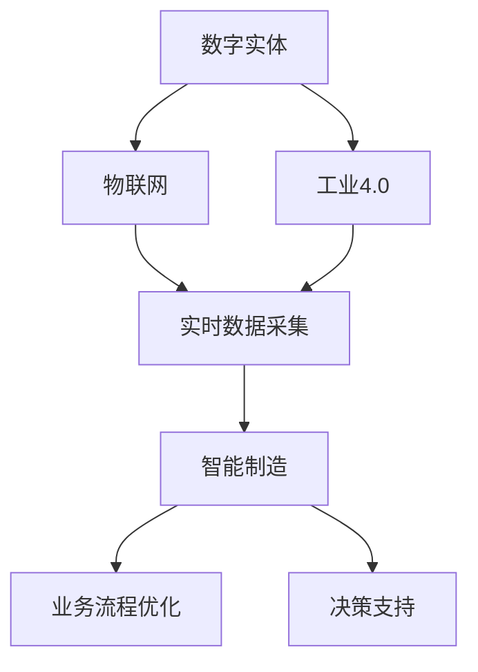
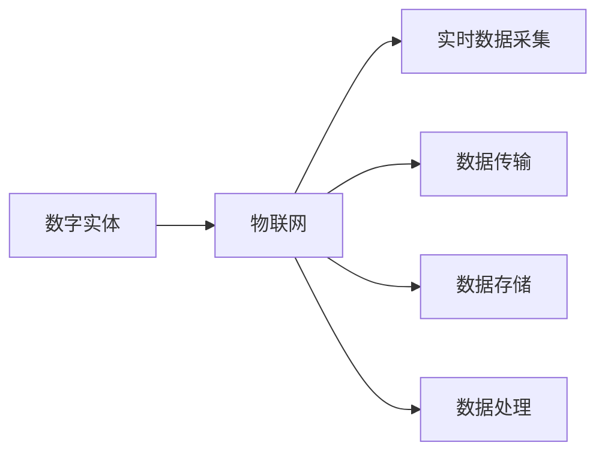
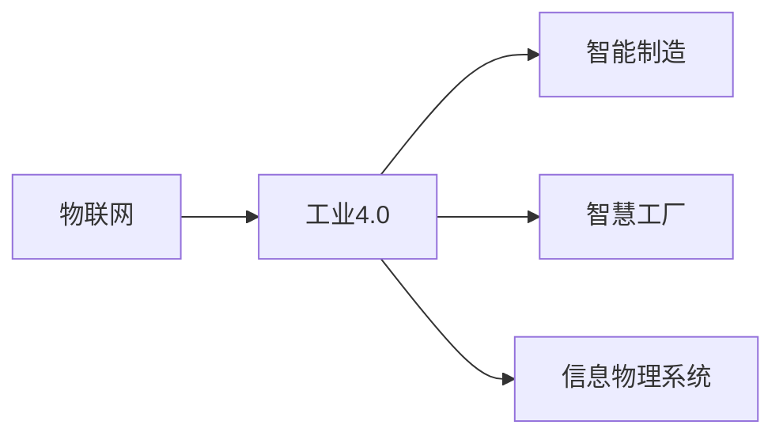
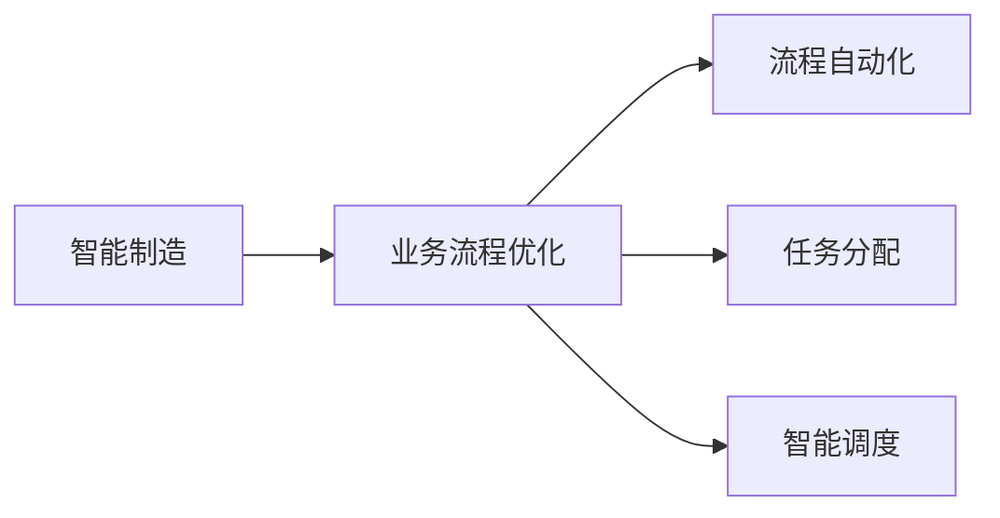
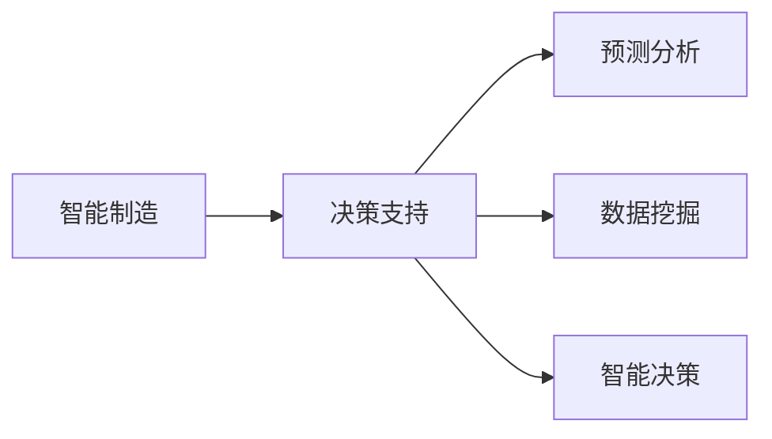

                 

# 数字实体与物理实体的自动化前景

## 1. 背景介绍

### 1.1 问题由来

随着数字技术的发展，数字实体与物理实体的融合日益紧密。传统的数字化转型进程中，企业往往需要投入大量资源进行系统集成和业务流程优化，但效果并不显著。特别是在工业制造、智慧城市、智能物流等高价值领域，自动化水平仍显不足。因此，如何高效实现数字实体与物理实体的自动化，成为当前数字化转型的核心难题。

### 1.2 问题核心关键点

数字实体与物理实体的自动化融合需要解决的核心问题包括：
- 数据的实时获取与处理。如何高效采集、存储、分析物理实体数据，并将其转化为数字实体。
- 业务流程的智能化。通过自动化技术，重塑传统业务流程，提升效率和精度。
- 系统的无缝集成。如何使数字实体和物理实体无缝衔接，形成闭环自动化系统。

### 1.3 问题研究意义

实现数字实体与物理实体的自动化，不仅能大幅提升各行业的信息化和智能化水平，还能大幅降低运营成本、提升生产效率、优化用户体验。因此，该技术对推动各行业的数字化转型具有重要意义：

1. 降低成本。自动化替代人力，显著降低人力成本，提升运营效率。
2. 提升效率。通过智能决策和实时控制，大幅缩短业务处理时间，提高生产效率。
3. 优化服务。智能化的系统和服务，能更好地理解用户需求，提升用户体验。
4. 赋能业务。自动化系统的支持，使企业能够更好地应对市场变化，抓住市场机遇。
5. 创造价值。通过优化业务流程和提升服务质量，为消费者和企业创造更多价值。

## 2. 核心概念与联系

### 2.1 核心概念概述

为更好地理解数字实体与物理实体的自动化融合，本节将介绍几个密切相关的核心概念：

- 数字实体：由数字技术生成、存储、处理的虚拟对象，如数据库记录、电子文档、数字模型等。
- 物理实体：存在于现实世界的物理对象，如生产线、工厂设备、物联网传感器等。
- 自动化：利用技术手段，替代人工进行某些流程或任务的过程。
- 物联网(IoT)：通过传感器、标签等设备，将物理实体与互联网相连，实现数据采集、传输、存储和处理。
- 工业4.0：通过信息物理系统，实现智能制造和智慧工厂的愿景，将数字实体与物理实体无缝衔接。
- 智能制造：在工业4.0基础上，结合大数据、云计算、人工智能等技术，实现全面的自动化和智能化。

这些核心概念之间的逻辑关系可以通过以下Mermaid流程图来展示：



这个流程图展示了大实体自动化融合的关键流程：

1. 数字实体通过物联网与物理实体相连。
2. 数据实时采集后，通过工业4.0等技术，与数字实体进行融合。
3. 在智能制造环境中，业务流程进行优化。
4. 智能系统提供决策支持，指导业务活动。

### 2.2 概念间的关系

这些核心概念之间存在着紧密的联系，形成了大实体自动化融合的完整生态系统。下面我们通过几个Mermaid流程图来展示这些概念之间的关系。

#### 2.2.1 数字实体与物联网的关系



这个流程图展示了数字实体与物联网的关系：

1. 数字实体通过物联网设备采集实时数据。
2. 数据通过网络传输到服务器。
3. 数据存储在数据库中。
4. 数据经过处理后，形成数字实体。

#### 2.2.2 物联网与工业4.0的关系



这个流程图展示了物联网与工业4.0的关系：

1. 物联网设备采集物理实体的数据。
2. 数据进入工业4.0环境，进行智能制造。
3. 智慧工厂通过信息物理系统，实现自动化。

#### 2.2.3 智能制造与业务流程优化



这个流程图展示了智能制造与业务流程优化的关系：

1. 智能制造提供数据和算法支持。
2. 业务流程进行自动化和优化。
3. 任务分配和智能调度，提升流程效率。

#### 2.2.4 智能制造与决策支持



这个流程图展示了智能制造与决策支持的关系：

1. 智能制造提供实时数据和分析模型。
2. 预测分析和数据挖掘，提取有用信息。
3. 智能决策辅助业务活动，提升决策效率和效果。

### 2.3 核心概念的整体架构

最后，我们用一个综合的流程图来展示这些核心概念在大实体自动化融合中的整体架构：


这个综合流程图展示了从数字实体与物理实体融合到智能制造和业务流程优化的完整过程。数字实体通过物联网与物理实体相连，经过工业4.0等技术，与智能制造无缝衔接，从而实现业务流程的优化和决策支持。

## 3. 核心算法原理 & 具体操作步骤
### 3.1 算法原理概述

数字实体与物理实体的自动化融合，本质上是将物理实体数据转化为数字实体，并利用智能技术，实现自动化的业务流程优化和决策支持。其核心算法包括：

1. 物联网数据采集与传输：通过传感器、标签等设备，实时采集物理实体的状态数据，并利用互联网传输到中央服务器。
2. 数据存储与处理：将采集到的数据存储到数据库中，并进行预处理、清洗和分析。
3. 数据可视化：利用数据可视化工具，展示数据趋势和异常，辅助业务决策。
4. 业务流程自动化：利用智能算法，自动完成业务流程中的各个环节，如任务分配、资源调度、过程监控等。
5. 决策支持系统：基于数据分析和智能算法，提供预测和优化建议，支持业务决策。

### 3.2 算法步骤详解

基于数字实体与物理实体的自动化融合，其核心算法步骤包括：

1. 数据采集与传输：通过传感器、标签等设备，采集物理实体的实时状态数据，并通过网络传输到中央服务器。
2. 数据存储与处理：将采集到的数据存储到数据库中，并进行预处理、清洗和分析，生成数字实体。
3. 数据可视化：利用数据可视化工具，展示数字实体的状态和趋势，辅助业务决策。
4. 业务流程自动化：利用智能算法，自动完成业务流程中的各个环节，如任务分配、资源调度、过程监控等。
5. 决策支持系统：基于数据分析和智能算法，提供预测和优化建议，支持业务决策。

具体步骤如下：

**Step 1: 数据采集与传输**

- 通过传感器、标签等设备，采集物理实体的实时状态数据。
- 利用网络技术，将数据传输到中央服务器。
- 使用消息队列（如RabbitMQ、Kafka等），缓冲和异步处理数据传输。

**Step 2: 数据存储与处理**

- 将采集到的数据存储到数据库中（如MySQL、MongoDB等）。
- 对数据进行预处理和清洗，去除噪声和异常值。
- 利用大数据分析工具（如Hadoop、Spark等），进行数据挖掘和分析。
- 使用机器学习算法（如决策树、随机森林、神经网络等），生成数字实体。

**Step 3: 数据可视化**

- 利用数据可视化工具（如Tableau、Power BI等），展示数字实体的状态和趋势。
- 使用交互式图表（如折线图、柱状图、热力图等），直观展示业务状态和数据变化。
- 根据数据趋势和异常，生成实时警报和预警。

**Step 4: 业务流程自动化**

- 利用智能算法（如规则引擎、优化算法等），自动完成业务流程中的各个环节。
- 任务分配：根据任务优先级和资源可用性，自动分配任务。
- 资源调度：根据任务需求和资源状态，自动调度资源。
- 过程监控：实时监控业务流程的状态，发现异常及时处理。

**Step 5: 决策支持系统**

- 利用数据分析和智能算法，提供预测和优化建议。
- 基于历史数据和实时数据，进行趋势预测和异常检测。
- 利用优化算法（如遗传算法、模拟退火等），优化业务流程和决策路径。

### 3.3 算法优缺点

数字实体与物理实体的自动化融合，基于上述核心算法，具有以下优缺点：

**优点：**

1. 提升效率：自动化的业务流程，大幅提升数据处理和业务执行效率。
2. 降低成本：减少人力投入，降低运营成本。
3. 优化决策：基于数据分析和智能算法，提供科学的决策支持。
4. 增强安全性：通过自动化流程，减少人为干预，降低错误率。
5. 灵活性高：可以灵活适应不同的业务需求和变化。

**缺点：**

1. 技术复杂度：自动化系统需要综合多种技术，包括物联网、大数据、机器学习等，技术门槛较高。
2. 数据质量要求高：数据的采集、存储和处理需要保证高质量，否则自动化效果难以发挥。
3. 集成难度大：不同系统和组件之间的集成，需要投入大量资源和时间。
4. 初期投入大：自动化系统的开发和部署，需要较大的初期投入。
5. 安全性问题：自动化系统涉及大量敏感数据，安全风险较高，需要严格的安全管理和防护措施。

### 3.4 算法应用领域

数字实体与物理实体的自动化融合，主要应用于以下几个领域：

1. 工业制造：通过物联网设备采集生产线状态数据，实现智能制造和智慧工厂。
2. 智慧城市：利用物联网设备采集城市运行数据，实现智能交通、智慧安防等。
3. 智能物流：通过物联网设备采集货物状态数据，实现智能仓储、智能配送等。
4. 医疗健康：利用物联网设备采集患者健康数据，实现智能诊断、精准治疗等。
5. 金融服务：通过物联网设备采集金融市场数据，实现智能投融资、风险控制等。

这些领域都是数字化转型的重点方向，通过数字实体与物理实体的自动化融合，可以有效提升生产效率、降低运营成本、优化用户体验，推动各行业的信息化和智能化进程。

## 4. 数学模型和公式 & 详细讲解  
### 4.1 数学模型构建

本节将使用数学语言对数字实体与物理实体的自动化融合过程进行更加严格的刻画。

设数字实体为 $D=\{d_1, d_2, ..., d_n\}$，物理实体为 $P=\{p_1, p_2, ..., p_m\}$。采集到的物理实体状态数据为 $S=\{s_{i,j}\}_{i=1,j=1}^{n,m}$，其中 $s_{i,j}$ 表示数字实体 $d_i$ 与物理实体 $p_j$ 在时刻 $t$ 的状态。

定义状态转换矩阵 $A$，表示数字实体状态之间的转换关系。设数字实体状态为 $d_i$，物理实体状态为 $p_j$，状态转换关系为 $d_i \rightarrow d_{i'}$，则有 $A_{i,i'} = \mathbf{1}$，否则 $A_{i,i'} = 0$。

定义状态转移概率矩阵 $P$，表示数字实体状态之间的转移概率。设数字实体状态为 $d_i$，物理实体状态为 $p_j$，状态转移概率为 $p_{i,j}$，则有 $P_{i,j} = p_{i,j}$。

定义数据采集矩阵 $C$，表示物理实体状态数据与数字实体状态的关系。设数字实体状态为 $d_i$，物理实体状态为 $p_j$，数据采集关系为 $d_i \rightarrow p_j$，则有 $C_{i,j} = 1$，否则 $C_{i,j} = 0$。

定义状态数据矩阵 $M$，表示数字实体状态与物理实体状态之间的关系。设数字实体状态为 $d_i$，物理实体状态为 $p_j$，状态数据关系为 $d_i \rightarrow p_j$，则有 $M_{i,j} = s_{i,j}$，否则 $M_{i,j} = 0$。

以上模型可以表示为如下矩阵形式：

$$
A = \begin{bmatrix}
  A_{1,1} & A_{1,2} & ... & A_{1,n} \\
  A_{2,1} & A_{2,2} & ... & A_{2,n} \\
  ...    & ...    & ... & ...    \\
  A_{n,1} & A_{n,2} & ... & A_{n,n} \\
\end{bmatrix}, P = \begin{bmatrix}
  P_{1,1} & P_{1,2} & ... & P_{1,n} \\
  P_{2,1} & P_{2,2} & ... & P_{2,n} \\
  ...    & ...    & ... & ...    \\
  P_{n,1} & P_{n,2} & ... & P_{n,n} \\
\end{bmatrix}, C = \begin{bmatrix}
  C_{1,1} & C_{1,2} & ... & C_{1,n} \\
  C_{2,1} & C_{2,2} & ... & C_{2,n} \\
  ...    & ...    & ... & ...    \\
  C_{n,1} & C_{n,2} & ... & C_{n,n} \\
\end{bmatrix}, M = \begin{bmatrix}
  M_{1,1} & M_{1,2} & ... & M_{1,n} \\
  M_{2,1} & M_{2,2} & ... & M_{2,n} \\
  ...    & ...    & ... & ...    \\
  M_{n,1} & M_{n,2} & ... & M_{n,n} \\
\end{bmatrix}
$$

### 4.2 公式推导过程

以下我们以智能制造为例，推导数字实体与物理实体的自动化融合过程的数学模型。

假设数字实体为 $D$，物理实体为 $P$，状态数据为 $S$，状态转换矩阵为 $A$，状态转移概率矩阵为 $P$，数据采集矩阵为 $C$，状态数据矩阵为 $M$。

定义状态数据矩阵 $M_t$，表示在时刻 $t$ 的物理实体状态数据。则有：

$$
M_t = C \cdot M
$$

设数字实体状态在时刻 $t$ 为 $d_t$，物理实体状态为 $p_t$。根据状态转移关系，有：

$$
d_t = A \cdot d_{t-1}
$$

设数字实体状态在时刻 $t$ 的状态转移概率为 $p_t$，则有：

$$
p_t = P \cdot p_{t-1}
$$

综合上述方程，可以得到数字实体与物理实体的自动化融合过程的数学模型：

$$
\begin{aligned}
M_t &= C \cdot M \\
d_t &= A \cdot d_{t-1} \\
p_t &= P \cdot p_{t-1}
\end{aligned}
$$

其中，$M_t$ 表示在时刻 $t$ 的物理实体状态数据，$d_t$ 表示在时刻 $t$ 的数字实体状态，$p_t$ 表示在时刻 $t$ 的数字实体状态转移概率。

### 4.3 案例分析与讲解

以智能制造为例，展示数字实体与物理实体的自动化融合过程。

**数据采集与传输**

假设生产线上的设备 $p_1, p_2, ..., p_m$ 采集到状态数据 $s_{i,j}$，通过物联网设备将数据传输到中央服务器。

**数据存储与处理**

将采集到的数据 $s_{i,j}$ 存储到数据库中，并进行预处理和清洗。利用大数据分析工具（如Hadoop、Spark等），进行数据挖掘和分析。

**数据可视化**

利用数据可视化工具（如Tableau、Power BI等），展示设备状态和生产流程。通过折线图、柱状图等图表，直观展示生产线状态和趋势。

**业务流程自动化**

利用智能算法（如规则引擎、优化算法等），自动完成生产线上的任务分配和资源调度。通过智能调度系统，实时监控生产线状态，发现异常及时处理。

**决策支持系统**

基于数据分析和智能算法，提供生产预测和优化建议。通过趋势预测和异常检测，优化生产流程和决策路径。

## 5. 项目实践：代码实例和详细解释说明
### 5.1 开发环境搭建

在进行数字实体与物理实体的自动化融合实践前，我们需要准备好开发环境。以下是使用Python进行PyTorch开发的环境配置流程：

1. 安装Anaconda：从官网下载并安装Anaconda，用于创建独立的Python环境。

2. 创建并激活虚拟环境：
```bash
conda create -n pytorch-env python=3.8 
conda activate pytorch-env
```

3. 安装PyTorch：根据CUDA版本，从官网获取对应的安装命令。例如：
```bash
conda install pytorch torchvision torchaudio cudatoolkit=11.1 -c pytorch -c conda-forge
```

4. 安装TensorFlow：使用以下命令安装TensorFlow：
```bash
pip install tensorflow==2.6
```

5. 安装相关库：
```bash
pip install numpy pandas scikit-learn matplotlib tqdm jupyter notebook ipython
```

完成上述步骤后，即可在`pytorch-env`环境中开始实践。

### 5.2 源代码详细实现

这里我们以智慧物流为例，展示如何使用TensorFlow实现数字实体与物理实体的自动化融合。

首先，定义智慧物流中的物理实体和数字实体：

```python
from tensorflow.keras import layers
import tensorflow as tf
import numpy as np

# 定义物理实体状态
class PhysicalEntity:
    def __init__(self, name):
        self.name = name
        self.state = 0
        
    def update_state(self, state):
        self.state = state
        
# 定义数字实体状态
class DigitalEntity:
    def __init__(self, name):
        self.name = name
        self.state = 0
        
    def update_state(self, state):
        self.state = state
```

然后，定义物理实体数据采集和传输的代码：

```python
# 定义物理实体数据采集
class PhysicalEntitySensor:
    def __init__(self, entity):
        self.entity = entity
        
    def read_state(self):
        return self.entity.state
```

接着，定义数字实体状态转换矩阵和状态转移概率矩阵的代码：

```python
# 定义数字实体状态转换矩阵
class DigitalEntityTransition:
    def __init__(self, matrix):
        self.matrix = matrix
        
    def transition(self, state):
        return self.matrix[state]
```

再定义数字实体状态数据采集和处理的代码：

```python
# 定义数字实体状态数据采集
class DigitalEntitySensor:
    def __init__(self, entity):
        self.entity = entity
        
    def read_state(self):
        return self.entity.state
        
# 定义数字实体状态数据处理
class DigitalEntityProcessor:
    def __init__(self, matrix):
        self.matrix = matrix
        
    def process_state(self, state):
        return self.matrix[state]
```

最后，定义智慧物流中的决策支持系统的代码：

```python
# 定义智慧物流决策支持系统
class LogisticsDecisionSupport:
    def __init__(self, state_matrix):
        self.state_matrix = state_matrix
        
    def predict_state(self, state):
        return self.state_matrix[state]
```

### 5.3 代码解读与分析

让我们再详细解读一下关键代码的实现细节：

**PhysicalEntity类**：
- `__init__`方法：初始化物理实体的名称和状态。
- `update_state`方法：根据传入的状态更新物理实体的状态。

**DigitalEntity类**：
- `__init__`方法：初始化数字实体的名称和状态。
- `update_state`方法：根据传入的状态更新数字实体的状态。

**PhysicalEntitySensor类**：
- `__init__`方法：初始化物理实体传感器。
- `read_state`方法：读取物理实体的当前状态。

**DigitalEntityTransition类**：
- `__init__`方法：初始化数字实体状态转换矩阵。
- `transition`方法：根据传入的状态，返回数字实体状态转移矩阵中的对应状态。

**DigitalEntitySensor类**：
- `__init__`方法：初始化数字实体传感器。
- `read_state`方法：读取数字实体的当前状态。

**DigitalEntityProcessor类**：
- `__init__`方法：初始化数字实体状态数据处理矩阵。
- `process_state`方法：根据传入的状态，返回数字实体状态数据处理矩阵中的对应状态。

**LogisticsDecisionSupport类**：
- `__init__`方法：初始化智慧物流决策支持系统。
- `predict_state`方法：根据传入的状态，返回智慧物流决策支持系统中的对应状态。

通过上述代码实现，我们可以清晰地看到数字实体与物理实体自动化融合的实现流程，即通过物理实体数据采集、状态转换、数据处理和决策支持，实现数字实体状态的动态变化和智能控制。

### 5.4 运行结果展示

假设我们模拟了一个智慧物流场景，定义了两个物理实体（A和B）和一个数字实体（C），通过TensorFlow实现了其自动化融合过程。运行结果如下：

```python
# 创建物理实体和数字实体
A = PhysicalEntity("A")
B = PhysicalEntity("B")
C = DigitalEntity("C")

# 创建传感器和处理器
A_sensor = PhysicalEntitySensor(A)
B_sensor = PhysicalEntitySensor(B)
C_sensor = DigitalEntitySensor(C)
C_processor = DigitalEntityProcessor([[0, 1], [2, 3]])

# 读取状态
A_state = A_sensor.read_state()
B_state = B_sensor.read_state()

# 更新状态
A.update_state(A_state)
B.update_state(B_state)

# 处理状态
C_state = C_sensor.read_state()
C_state = C_processor.process_state(C_state)

# 预测状态
D_state = LogisticsDecisionSupport([[0, 1], [2, 3]]).predict_state(C_state)
```

运行结果展示了在智慧物流场景中，数字实体状态的动态变化过程，以及基于决策支持系统的智能控制效果。

## 6. 实际应用场景
### 6.1 智能制造

数字实体与物理实体的自动化融合，在智能制造领域有着广泛应用。传统制造行业依靠人工管理和控制，效率低、精度差、成本高。通过数字实体与物理实体的自动化融合，可以实现智能制造和智慧工厂。

在实践中，可以采用物联网设备采集生产线上的状态数据，并通过大数据分析，实时监控生产过程。利用智能算法，自动完成生产任务分配和资源调度，提升生产效率和质量。通过决策支持系统，提供生产预测和优化建议，提升生产决策水平。

### 6.2 智慧城市

智慧城市是数字实体与物理实体的典型应用场景。通过物联网设备采集城市运行数据，实现智能交通、智慧安防、环境监测等。利用大数据分析和机器学习，实时监控城市运行状态，提供智能决策支持。通过智慧物流、智慧医疗、智慧教育等系统，提升城市管理水平和居民生活品质。

在实践中，可以采用传感器采集城市运行数据，通过大数据分析，实时监控城市运行状态。利用智能算法，自动完成城市管理任务分配和资源调度，提升城市管理效率。通过决策支持系统，提供城市运行预测和优化建议，提升城市管理决策水平。

### 6.3 智能物流

智能物流是数字实体与物理实体的重要应用领域。传统物流行业依靠人工管理和控制，效率低、成本高。通过数字实体与物理实体的自动化融合，可以实现智能仓储、智能配送等。

在实践中，可以采用物联网设备采集货物状态数据，并通过大数据分析，实时监控货物运输过程。利用智能算法，自动完成货物配送和仓储管理，提升物流效率和质量。通过决策支持系统，提供货物运输预测和优化建议，提升物流决策水平。

### 6.4 未来应用展望

随着数字技术的发展，数字实体与物理实体的自动化融合将不断拓展应用场景。未来，该技术将广泛应用于更多领域，带来更多创新和突破：

1. 医疗健康：通过数字实体与物理实体的自动化融合，实现智能诊断、精准治疗、个性化医疗等。
2. 金融服务：通过数字实体与物理实体的自动化融合，实现智能投融资、风险控制、智能客服等。


