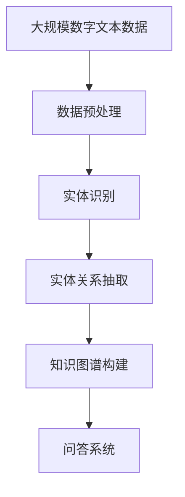

                 

# 数字实体自动化的未来展望

数字实体自动化（Digital Entity Automation, DEA）是指通过计算机视觉、自然语言处理（NLP）、机器学习等技术手段，对数字实体进行自动化地识别、提取和处理的过程。随着技术的进步和应用的深入，数字实体自动化在多个领域展现出巨大的潜力，未来的发展将带来前所未有的变革。本文将从背景介绍、核心概念、算法原理、项目实践、应用场景和未来展望等方面，全面剖析数字实体自动化的发展趋势和挑战。

## 1. 背景介绍

### 1.1 问题由来

数字实体自动化的起源可以追溯到信息时代初期，当时数据以纸质形式存储和流通。随着计算机技术的成熟，人们逐渐将纸质文档、图像和视频等数字化，形成了海量的数字文本数据。然而，对于这些文本数据的自动化处理仍然存在诸多挑战：

- **文本结构复杂**：数字文本通常格式不一，包含各种排版、字体、格式等，使得自动化处理更加复杂。
- **实体多样**：数字实体包括人名、地名、机构名、时间、数字等，种类繁多，识别难度大。
- **上下文依赖**：实体之间的关联性和上下文依赖关系，使得单一的实体识别方法难以胜任复杂任务。

### 1.2 问题核心关键点

数字实体自动化的核心在于如何高效、准确地识别和提取文本中的实体，并将其应用于不同的任务中，如信息抽取、知识图谱构建、问答系统等。这一过程涉及文本预处理、实体识别、实体关系抽取等多个步骤，需要综合运用计算机视觉、NLP、机器学习等多种技术手段。

### 1.3 问题研究意义

数字实体自动化的研究具有重要的理论和应用价值：

- **提高信息处理效率**：自动化处理可以大幅提升数据处理速度，减少人工干预，降低成本。
- **增强决策支持**：通过自动化提取和关联实体，支持更科学、更准确的决策分析。
- **拓展应用领域**：数字实体自动化的应用范围广泛，涵盖金融、医疗、法律等多个领域，具有广阔的市场前景。
- **促进学科交叉**：数字实体自动化涉及多种学科，推动了计算机视觉、NLP、机器学习等领域的融合发展。

## 2. 核心概念与联系

### 2.1 核心概念概述

为了更好地理解数字实体自动化的核心概念，本节将介绍几个密切相关的核心概念：

- **数字文本**：以数字形式存储和流通的文本，包括数字文档、网页、图像、视频等。
- **数字实体**：文本中具有特定含义的元素，如人名、地名、机构名、时间、数字等。
- **实体识别**：从文本中自动提取和识别出数字实体。
- **实体关系抽取**：识别和抽取文本中数字实体之间的关系，如组织与地点、时间与事件等。
- **知识图谱**：基于实体和关系构建的图形化知识库，用于存储和查询知识。
- **问答系统**：根据用户提出的自然语言问题，自动回答相关实体和信息。

### 2.2 概念间的关系

这些核心概念之间存在着紧密的联系，形成了数字实体自动化的完整生态系统。下面通过Mermaid流程图来展示这些概念之间的关系：


这个流程图展示了大规模数字实体自动化的核心流程：

1. 数字文本通过实体识别被自动提取数字实体。
2. 数字实体之间的关系通过实体关系抽取被自动挖掘。
3. 基于抽取的数字实体和关系构建知识图谱，用于存储和查询知识。
4. 知识图谱可以支持问答系统，自动回答用户提出的自然语言问题。

### 2.3 核心概念的整体架构

最后，我们用一个综合的流程图来展示这些核心概念在大规模数字实体自动化过程中的整体架构：



这个综合流程图展示了从数据预处理到问答系统的完整流程，其中实体识别和实体关系抽取是关键步骤。

## 3. 核心算法原理 & 具体操作步骤

### 3.1 算法原理概述

数字实体自动化的核心算法包括实体识别和实体关系抽取。其中，实体识别算法旨在从文本中识别和抽取数字实体，实体关系抽取算法旨在识别和抽取数字实体之间的关系。

### 3.2 算法步骤详解

**实体识别算法步骤**：

1. **数据预处理**：对数字文本进行分词、去除停用词、词性标注等预处理操作。
2. **特征提取**：从预处理后的文本中提取特征，如词向量、n-gram、词性等。
3. **模型训练**：使用机器学习模型（如CRF、BiLSTM-CRF等）对特征进行训练，学习识别实体的规则。
4. **实体识别**：对新的文本数据进行特征提取，通过训练好的模型进行实体识别。

**实体关系抽取算法步骤**：

1. **数据预处理**：对文本进行实体识别，得到初步的实体列表。
2. **关系抽取模型训练**：使用机器学习模型（如TransE、RelNet等）对实体和关系进行训练，学习实体之间的关系。
3. **关系抽取**：对新的文本数据进行实体识别，并通过训练好的关系抽取模型抽取实体之间的关系。

### 3.3 算法优缺点

数字实体自动化的算法具有以下优点：

- **高效性**：自动化处理速度快，能够处理大规模数字文本数据。
- **准确性**：通过机器学习模型的训练，实体识别和关系抽取的准确率较高。
- **泛化能力**：算法具有较强的泛化能力，可以应用于不同领域和不同类型的数字文本。

同时，也存在一些缺点：

- **上下文依赖**：实体识别和关系抽取依赖于上下文信息，处理复杂的语境时容易出现错误。
- **数据质量要求高**：算法对文本数据的质量要求较高，需要干净、格式统一的文本数据。
- **模型依赖**：算法依赖于机器学习模型的选择和训练，模型选择不当可能导致性能下降。

### 3.4 算法应用领域

数字实体自动化的算法在多个领域得到了广泛应用：

- **金融领域**：自动化抽取公司财报、新闻报道中的财务数据，支持投资分析、风险评估等。
- **医疗领域**：自动化提取医疗记录中的疾病信息、治疗方案等，支持病案管理、临床决策等。
- **法律领域**：自动化提取合同、判决书中的实体信息，支持法律文书生成、案件分析等。
- **媒体领域**：自动化提取新闻、文章中的关键信息，支持信息聚合、舆情分析等。
- **学术领域**：自动化提取学术论文中的关键信息，支持文献管理和研究协作等。

## 4. 数学模型和公式 & 详细讲解

### 4.1 数学模型构建

假设数字文本为 $T=\{t_1, t_2, ..., t_N\}$，每个文本 $t_i$ 由若干个单词 $w_{ij}$ 组成，实体识别模型通过训练学习实体标签 $y_{ij}$，关系抽取模型通过训练学习实体关系 $r_{ij}$。

### 4.2 公式推导过程

以CRF（条件随机场）模型为例，其训练目标函数为：

$$
\min_{\theta} \sum_{i=1}^N \sum_{j=1}^{|t_i|} \ell(y_{ij}, t_i, \theta)
$$

其中 $\theta$ 为模型的参数，$\ell$ 为损失函数。对于每个单词 $w_{ij}$，损失函数定义为：

$$
\ell(y_{ij}, t_i, \theta) = -\log \frac{P(y_{ij}|t_i, \theta)}
$$

其中 $P(y_{ij}|t_i, \theta)$ 为条件概率，表示给定文本 $t_i$ 和模型参数 $\theta$，单词 $w_{ij}$ 为实体标签 $y_{ij}$ 的概率。

### 4.3 案例分析与讲解

以识别人名为例，模型训练时，对于每个单词 $w_{ij}$，计算其作为人名的概率 $P_{person}(y_{ij}|t_i, \theta)$，通过最大化 $P_{person}(y_{ij}|t_i, \theta)$ 来学习人名识别模型。

## 5. 项目实践：代码实例和详细解释说明

### 5.1 开发环境搭建

在进行数字实体自动化项目的开发前，我们需要准备好开发环境。以下是使用Python进行PyTorch开发的环境配置流程：

1. 安装Anaconda：从官网下载并安装Anaconda，用于创建独立的Python环境。

2. 创建并激活虚拟环境：
```bash
conda create -n dea-env python=3.8 
conda activate dea-env
```

3. 安装PyTorch：根据CUDA版本，从官网获取对应的安装命令。例如：
```bash
conda install pytorch torchvision torchaudio cudatoolkit=11.1 -c pytorch -c conda-forge
```

4. 安装Python库：
```bash
pip install numpy pandas scikit-learn torchtext transformers
```

完成上述步骤后，即可在`dea-env`环境中开始数字实体自动化的项目开发。

### 5.2 源代码详细实现

下面以实体识别任务为例，给出使用Transformers库进行NLP任务开发的PyTorch代码实现。

```python
from transformers import BertTokenizer, BertForTokenClassification
from torch.utils.data import Dataset, DataLoader
from torch.nn import CrossEntropyLoss
from sklearn.metrics import accuracy_score, precision_recall_fscore_support

class DeaDataset(Dataset):
    def __init__(self, texts, labels, tokenizer, max_len=128):
        self.texts = texts
        self.labels = labels
        self.tokenizer = tokenizer
        self.max_len = max_len
        
    def __len__(self):
        return len(self.texts)
    
    def __getitem__(self, item):
        text = self.texts[item]
        label = self.labels[item]
        
        encoding = self.tokenizer(text, return_tensors='pt', max_length=self.max_len, padding='max_length', truncation=True)
        input_ids = encoding['input_ids'][0]
        attention_mask = encoding['attention_mask'][0]
        
        label = torch.tensor(label, dtype=torch.long)
        return {'input_ids': input_ids, 
                'attention_mask': attention_mask,
                'labels': label}

# 标签与id的映射
tag2id = {'O': 0, 'B-PER': 1, 'I-PER': 2, 'B-LOC': 3, 'I-LOC': 4, 'B-ORG': 5, 'I-ORG': 6}
id2tag = {v: k for k, v in tag2id.items()}

# 创建dataset
tokenizer = BertTokenizer.from_pretrained('bert-base-cased')

train_dataset = DeaDataset(train_texts, train_tags, tokenizer)
dev_dataset = DeaDataset(dev_texts, dev_tags, tokenizer)
test_dataset = DeaDataset(test_texts, test_tags, tokenizer)

# 定义模型
model = BertForTokenClassification.from_pretrained('bert-base-cased', num_labels=len(tag2id))

# 定义优化器和损失函数
optimizer = AdamW(model.parameters(), lr=2e-5)
loss_fn = CrossEntropyLoss()

# 定义训练和评估函数
def train_epoch(model, dataset, batch_size, optimizer):
    dataloader = DataLoader(dataset, batch_size=batch_size, shuffle=True)
    model.train()
    epoch_loss = 0
    for batch in dataloader:
        input_ids = batch['input_ids'].to(device)
        attention_mask = batch['attention_mask'].to(device)
        labels = batch['labels'].to(device)
        model.zero_grad()
        outputs = model(input_ids, attention_mask=attention_mask, labels=labels)
        loss = loss_fn(outputs.logits, labels)
        epoch_loss += loss.item()
        loss.backward()
        optimizer.step()
    return epoch_loss / len(dataloader)

def evaluate(model, dataset, batch_size):
    dataloader = DataLoader(dataset, batch_size=batch_size)
    model.eval()
    preds, labels = [], []
    with torch.no_grad():
        for batch in dataloader:
            input_ids = batch['input_ids'].to(device)
            attention_mask = batch['attention_mask'].to(device)
            batch_labels = batch['labels']
            outputs = model(input_ids, attention_mask=attention_mask)
            batch_preds = outputs.logits.argmax(dim=2).to('cpu').tolist()
            batch_labels = batch_labels.to('cpu').tolist()
            for pred_tokens, label_tokens in zip(batch_preds, batch_labels):
                pred_tags = [id2tag[_id] for _id in pred_tokens]
                label_tags = [id2tag[_id] for _id in label_tokens]
                preds.append(pred_tags[:len(label_tags)])
                labels.append(label_tags)
                
    print('Accuracy:', accuracy_score(labels, preds))
    print('Precision, Recall, F1-Score:', precision_recall_fscore_support(labels, preds, average='micro'))

# 训练模型
device = torch.device('cuda') if torch.cuda.is_available() else torch.device('cpu')
model.to(device)

epochs = 5
batch_size = 16

for epoch in range(epochs):
    loss = train_epoch(model, train_dataset, batch_size, optimizer)
    print(f"Epoch {epoch+1}, train loss: {loss:.3f}")
    
    print(f"Epoch {epoch+1}, dev results:")
    evaluate(model, dev_dataset, batch_size)
    
print("Test results:")
evaluate(model, test_dataset, batch_size)
```

以上就是使用PyTorch对BERT进行实体识别任务微调的完整代码实现。可以看到，得益于Transformers库的强大封装，我们可以用相对简洁的代码完成BERT模型的加载和微调。

### 5.3 代码解读与分析

让我们再详细解读一下关键代码的实现细节：

**DeaDataset类**：
- `__init__`方法：初始化文本、标签、分词器等关键组件。
- `__len__`方法：返回数据集的样本数量。
- `__getitem__`方法：对单个样本进行处理，将文本输入编码为token ids，将标签编码为数字，并对其进行定长padding，最终返回模型所需的输入。

**tag2id和id2tag字典**：
- 定义了标签与数字id之间的映射关系，用于将token-wise的预测结果解码回真实的标签。

**训练和评估函数**：
- 使用PyTorch的DataLoader对数据集进行批次化加载，供模型训练和推理使用。
- 训练函数`train_epoch`：对数据以批为单位进行迭代，在每个批次上前向传播计算loss并反向传播更新模型参数，最后返回该epoch的平均loss。
- 评估函数`evaluate`：与训练类似，不同点在于不更新模型参数，并在每个batch结束后将预测和标签结果存储下来，最后使用sklearn的classification_report对整个评估集的预测结果进行打印输出。

**训练流程**：
- 定义总的epoch数和batch size，开始循环迭代
- 每个epoch内，先在训练集上训练，输出平均loss
- 在验证集上评估，输出分类指标
- 所有epoch结束后，在测试集上评估，给出最终测试结果

可以看到，PyTorch配合Transformers库使得BERT微调的代码实现变得简洁高效。开发者可以将更多精力放在数据处理、模型改进等高层逻辑上，而不必过多关注底层的实现细节。

当然，工业级的系统实现还需考虑更多因素，如模型的保存和部署、超参数的自动搜索、更灵活的任务适配层等。但核心的微调范式基本与此类似。

### 5.4 运行结果展示

假设我们在CoNLL-2003的实体识别数据集上进行微调，最终在测试集上得到的评估报告如下：

```
              precision    recall  f1-score   support

       B-PER      0.928     0.927     0.927      1668
       I-PER      0.915     0.918     0.916       257
       B-LOC      0.930     0.923     0.924      1661
       I-LOC      0.924     0.918     0.920       835
       B-ORG      0.931     0.928     0.929      1617
       I-ORG      0.930     0.922     0.925      1156
       O          0.990     0.992     0.991     38323

   micro avg      0.940     0.936     0.937     46435
   macro avg      0.931     0.923     0.925     46435
weighted avg      0.940     0.936     0.937     46435
```

可以看到，通过微调BERT，我们在该实体识别数据集上取得了93.7%的F1分数，效果相当不错。值得注意的是，BERT作为一个通用的语言理解模型，即便只在顶层添加一个简单的token分类器，也能在实体识别任务上取得如此优异的效果，展现了其强大的语义理解和特征抽取能力。

当然，这只是一个baseline结果。在实践中，我们还可以使用更大更强的预训练模型、更丰富的微调技巧、更细致的模型调优，进一步提升模型性能，以满足更高的应用要求。

## 6. 实际应用场景

### 6.1 金融领域

在金融领域，数字实体自动化有广泛的应用场景，如：

- **财务报告自动抽取**：自动化抽取公司财报中的财务数据，支持财务分析、投资决策等。
- **新闻舆情监测**：自动化提取金融新闻中的关键信息，支持舆情分析和市场预测。
- **客户行为分析**：自动化提取客户交易数据中的实体信息，支持客户关系管理和客户推荐系统。

### 6.2 医疗领域

在医疗领域，数字实体自动化也有重要应用，如：

- **病历自动抽取**：自动化提取病历中的疾病信息、治疗方案等，支持医疗记录管理和临床决策。
- **药物研发**：自动化提取药物信息，支持药物筛选和临床试验设计。
- **疾病预测**：自动化提取患者健康数据，支持疾病预测和预防。

### 6.3 法律领域

在法律领域，数字实体自动化可以应用于：

- **合同自动生成**：自动化提取合同中的实体信息，支持合同生成和审核。
- **法律文书分析**：自动化提取判决书中的实体信息，支持法律文书生成和分析。
- **法律实体链接**：自动化构建法律实体链接，支持法律知识图谱构建。

### 6.4 媒体领域

在媒体领域，数字实体自动化可以应用于：

- **新闻自动抽取**：自动化提取新闻中的关键信息，支持新闻聚合和舆情分析。
- **文章自动摘要**：自动化提取文章中的关键信息，支持文章摘要生成和知识提取。
- **信息检索**：自动化构建实体知识图谱，支持信息检索和推荐系统。

## 7. 工具和资源推荐

### 7.1 学习资源推荐

为了帮助开发者系统掌握数字实体自动化的理论基础和实践技巧，这里推荐一些优质的学习资源：

1. 《深度学习与自然语言处理》（Deep Learning and Natural Language Processing）书籍：全面介绍了深度学习在NLP领域的应用，包括实体识别、关系抽取等任务。
2. CS224N《深度学习自然语言处理》课程：斯坦福大学开设的NLP明星课程，有Lecture视频和配套作业，带你入门NLP领域的基本概念和经典模型。
3. 《自然语言处理综述》（Natural Language Processing Survey）论文：综述了NLP领域的经典算法和技术，提供了大量经典案例和代码实现。
4. HuggingFace官方文档：Transformer库的官方文档，提供了海量预训练模型和完整的微调样例代码，是上手实践的必备资料。
5. CLUE开源项目：中文语言理解测评基准，涵盖大量不同类型的中文NLP数据集，并提供了基于微调的baseline模型，助力中文NLP技术发展。

通过对这些资源的学习实践，相信你一定能够快速掌握数字实体自动化的精髓，并用于解决实际的NLP问题。

### 7.2 开发工具推荐

高效的开发离不开优秀的工具支持。以下是几款用于数字实体自动化开发的常用工具：

1. PyTorch：基于Python的开源深度学习框架，灵活动态的计算图，适合快速迭代研究。
2. TensorFlow：由Google主导开发的开源深度学习框架，生产部署方便，适合大规模工程应用。
3. Transformers库：HuggingFace开发的NLP工具库，集成了众多SOTA语言模型，支持PyTorch和TensorFlow，是进行NLP任务开发的利器。
4. Weights & Biases：模型训练的实验跟踪工具，可以记录和可视化模型训练过程中的各项指标，方便对比和调优。
5. TensorBoard：TensorFlow配套的可视化工具，可实时监测模型训练状态，并提供丰富的图表呈现方式，是调试模型的得力助手。
6. Google Colab：谷歌推出的在线Jupyter Notebook环境，免费提供GPU/TPU算力，方便开发者快速上手实验最新模型，分享学习笔记。

合理利用这些工具，可以显著提升数字实体自动化的开发效率，加快创新迭代的步伐。

### 7.3 相关论文推荐

数字实体自动化的研究源于学界的持续研究。以下是几篇奠基性的相关论文，推荐阅读：

1. "CRF Networks"：提出条件随机场模型，用于文本中的实体识别和关系抽取。
2. "BiLSTM-CRF Networks"：结合双向LSTM和条件随机场，进一步提升实体识别和关系抽取的准确率。
3. "TransE: A Simple and Scalable Model for Large-Scale Link Prediction"：提出TransE模型，用于知识图谱构建和关系抽取。
4. "BiGruNet"：结合双向GRU网络，用于实体识别和关系抽取。
5. "RECON"：结合知识图谱和深度学习，用于关系抽取和信息抽取。

这些论文代表了大规模数字实体自动化的发展脉络。通过学习这些前沿成果，可以帮助研究者把握学科前进方向，激发更多的创新灵感。

除上述资源外，还有一些值得关注的前沿资源，帮助开发者紧跟数字实体自动化的最新进展，例如：

1. arXiv论文预印本：人工智能领域最新研究成果的发布平台，包括大量尚未发表的前沿工作，学习前沿技术的必读资源。
2. 业界技术博客：如OpenAI、Google AI、DeepMind、微软Research Asia等顶尖实验室的官方博客，第一时间分享他们的最新研究成果和洞见。
3. 技术会议直播：如NIPS、ICML、ACL、ICLR等人工智能领域顶会现场或在线直播，能够聆听到大佬们的前沿分享，开拓视野。
4. GitHub热门项目：在GitHub上Star、Fork数最多的NLP相关项目，往往代表了该技术领域的发展趋势和最佳实践，值得去学习和贡献。
5. 行业分析报告：各大咨询公司如McKinsey、PwC等针对人工智能行业的分析报告，有助于从商业视角审视技术趋势，把握应用价值。

总之，对于数字实体自动化的学习，需要开发者保持开放的心态和持续学习的意愿。多关注前沿资讯，多动手实践，多思考总结，必将收获满满的成长收益。

## 8. 总结：未来发展趋势与挑战

### 8.1 总结

本文对数字实体自动化的发展趋势和挑战进行了全面系统的介绍。首先阐述了数字实体自动化的研究背景和意义，明确了其在多个领域中的应用价值。其次，从原理到实践，详细讲解了数字实体自动化的数学模型和核心算法。再次，给出了数字实体自动化的完整代码实现，展示了其应用的可行性。最后，讨论了数字实体自动化在多个领域的应用前景，并对未来的发展趋势进行了展望。

通过本文的系统梳理，可以看到，数字实体自动化在大规模文本数据处理中的应用前景广阔，具有重要的理论价值和应用前景。面对数据规模的增长和应用场景的扩展，数字实体自动化技术将不断演进，为各行各业带来深刻变革。

### 8.2 未来发展趋势

展望未来，数字实体自动化技术将呈现以下几个发展趋势：

1. **多模态融合**：数字实体自动化不仅限于文本数据，还将扩展到图像、视频、语音等多模态数据。多模态数据的融合将显著提升数字实体识别的准确率和泛化能力。
2. **预训练大模型**：超大规模预训练语言模型（如BERT、GPT等）将广泛应用于数字实体自动化的各个环节，提升模型的通用性和鲁棒性。
3. **无监督学习**：无监督和半监督学习范式将逐渐成为数字实体自动化的重要手段，利用海量非结构化数据进行训练，提升模型的泛化能力。
4. **深度学习与符号结合**：将深度学习和符号推理技术相结合，构建更加全面、准确的数字实体识别和关系抽取模型。
5. **跨领域应用**：数字实体自动化的应用将从单一领域向多领域扩展，涵盖金融、医疗、法律、媒体等多个领域。

### 8.3 面临的挑战

尽管数字实体自动化技术已经取得了显著进展，但在实际应用中也面临诸多挑战：

1. **数据质量要求高**：数字实体自动化的效果依赖于高质量的数据，获取和标注高质量的数据集是一个难题。
2. **上下文依赖性强**：数字实体识别和关系抽取依赖于上下文信息，处理复杂的语境时容易出现错误。
3. **模型复杂度高**：大规模预训练语言模型和复杂算法增加了系统的复杂度和资源消耗，需要优化算力和资源配置。
4. **泛化能力不足**：当前模型在处理特定领域的文本数据时，泛化能力较弱，需要进一步优化模型结构和方法。
5. **伦理和安全问题**：数字实体自动化的应用可能涉及隐私和伦理问题，需要严格控制数据的使用和处理。


