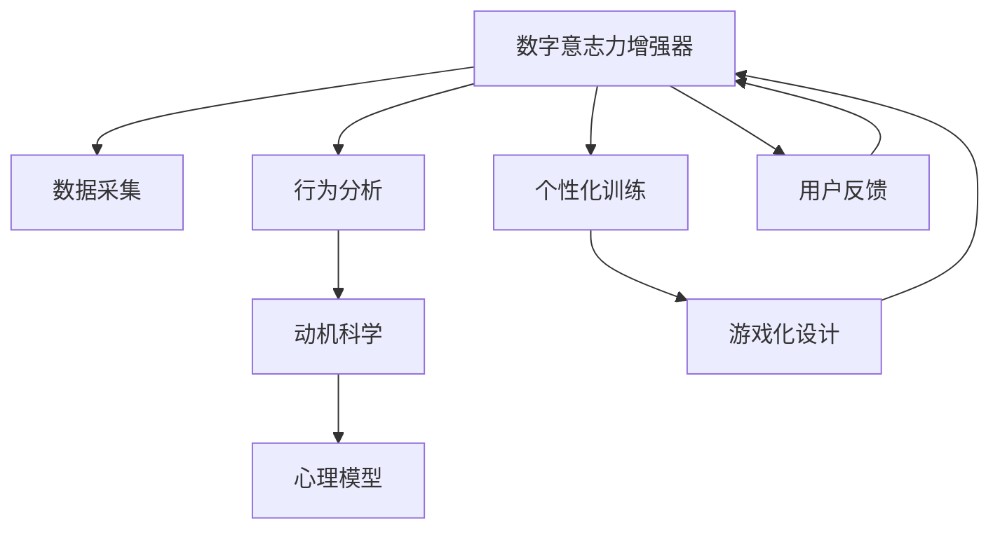
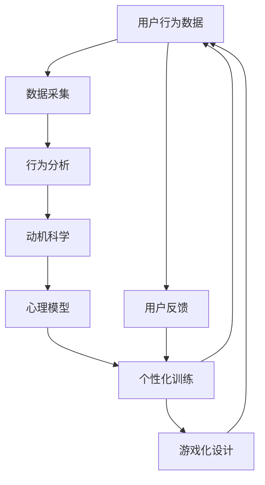

                 

# 数字意志力增强器设计师：AI辅助的自制力培养工程师

> 关键词：数字意志力增强器,人工智能,自制力培养,动机科学,自我控制,行为分析,个性化训练,游戏化设计,心理模型

## 1. 背景介绍

### 1.1 问题由来
在现代社会中，人们面临的诱惑和干扰日益增多。从社交媒体、信息泛滥，到工作压力、生活琐事，都极易分散人们的注意力，影响其长期目标的实现。这种“注意力碎片化”现象，被心理学家称为“数字倦怠”(Digital Fatigue)，对个人学习和工作效率产生了深远的影响。

为应对这一挑战，传统的自律方法、时间管理技巧等已逐渐显得力不从心。随着人工智能和大数据分析的快速发展，利用AI辅助培养自制力成为了一种可能的新途径。

### 1.2 问题核心关键点
基于人工智能的数字意志力增强器，旨在通过数据驱动的方式，帮助用户改善其行为习惯，提升自制力和专注度。具体来说，其关键点包括：
- 数据采集与分析：收集用户的日常行为数据，通过AI模型进行分析，识别出行为模式与目标实现之间的关联。
- 行为预测与干预：利用预测模型预测用户的未来行为，及时进行干预，如设置提醒、调整任务优先级等。
- 个性化训练与激励：根据用户的个性化需求，设计个性化的行为训练计划，并提供适当的激励措施，帮助用户逐步养成良好习惯。
- 游戏化设计：采用游戏化设计理念，将行为训练融入趣味游戏中，提升用户体验和参与感。
- 心理模型引入：借鉴动机科学和自我控制理论，设计符合心理规律的行为模型，进一步增强训练效果。

### 1.3 问题研究意义
数字意志力增强器作为AI辅助的自制力培养工具，具有以下重要意义：
- 辅助个人成长：帮助用户改善行为习惯，提升自我管理能力，促进个人全面发展。
- 提升工作效率：通过优化时间管理，减少干扰和分心，提高工作和学习的效率。
- 辅助职业发展：帮助职场人士克服拖延、分心等常见问题，提升职业竞争力。
- 推动教育进步：为学生提供个性化学习辅导，改善学习效果，促进教育公平。
- 促进心理健康：通过持续的行为训练，提升用户的自我控制力，缓解压力，改善心理健康。

## 2. 核心概念与联系

### 2.1 核心概念概述

为更好地理解基于AI的数字意志力增强器，本节将介绍几个核心概念：

- 数字意志力增强器(Digital Resilience Enhancer, DRE)：一种基于人工智能的自制力培养工具，通过收集和分析用户的行为数据，辅助其改善习惯，提升自制力。

- 人工智能(Artificial Intelligence, AI)：模拟人类智能行为的技术，包括数据处理、模式识别、决策优化等。

- 自我控制(Self-Control)：个人在面对诱惑和干扰时，坚持目标并抵制冲动的能力。

- 动机科学(Motivation Science)：研究人类动机和行为的心理学科，关注如何激发和维持个体行为动机。

- 行为分析(Behavioral Analysis)：通过数据分析和建模，理解人类行为模式和规律。

- 个性化训练(Personalized Training)：根据个体差异和需求，设计定制化的训练方案，提升训练效果。

- 游戏化设计(Game-ification)：将学习与训练融入游戏中，提升用户体验和参与度。

- 心理模型(Psychological Model)：基于心理学理论，设计符合人类心理规律的行为模型，引导行为改善。

这些核心概念之间存在着紧密的联系，形成了数字意志力增强器的完整生态系统。通过理解这些核心概念，我们可以更好地把握其工作原理和优化方向。

### 2.2 概念间的关系

这些核心概念之间存在着紧密的联系，形成了数字意志力增强器的完整生态系统。下面我们通过几个Mermaid流程图来展示这些概念之间的关系：



这个流程图展示了大语言模型的核心概念及其之间的关系：

1. 数字意志力增强器通过数据采集获取用户的行为数据。
2. 行为分析模块利用数据挖掘和机器学习技术，识别用户的行为模式。
3. 动机科学模块分析用户的动机和行为，设计激励机制。
4. 心理模型模块根据心理学原理，设计行为模型。
5. 个性化训练模块根据用户个性化需求，设计定制化训练计划。
6. 游戏化设计模块将训练过程融入趣味游戏中。
7. 用户反馈模块收集用户使用过程中的反馈，持续优化训练效果。

### 2.3 核心概念的整体架构

最后，我们用一个综合的流程图来展示这些核心概念在大语言模型微调过程中的整体架构：



这个综合流程图展示了从数据采集到个性化训练，再到游戏化设计的完整过程。数字意志力增强器通过采集用户行为数据，进行分析、动机科学分析、心理模型设计、个性化训练和游戏化设计，不断优化用户的行为习惯，提升其自制力。 通过这些流程图，我们可以更清晰地理解数字意志力增强器的核心概念及其工作流程。

## 3. 核心算法原理 & 具体操作步骤
### 3.1 算法原理概述

数字意志力增强器作为一种基于AI的自制力培养工具，其核心算法原理主要包括以下几个方面：

1. **数据驱动行为分析**：利用机器学习算法分析用户的行为数据，识别出行为模式与目标实现之间的关联。

2. **行为预测与干预**：通过预测模型预测用户的未来行为，及时进行干预，如设置提醒、调整任务优先级等。

3. **个性化行为训练**：根据用户的个性化需求，设计定制化的行为训练计划，并提供适当的激励措施。

4. **游戏化设计**：将行为训练融入趣味游戏中，提升用户体验和参与度。

5. **心理模型引入**：借鉴动机科学和自我控制理论，设计符合心理规律的行为模型。

### 3.2 算法步骤详解

数字意志力增强器的核心算法步骤主要包括以下几个方面：

1. **数据收集与预处理**：收集用户的日常行为数据，包括任务完成情况、时间分配、注意力集中时间等。然后对数据进行清洗和标准化，去除噪声和异常值。

2. **行为模式识别**：利用机器学习算法，如聚类、时间序列分析等，识别出用户的核心行为模式。例如，识别出用户的工作高峰期、分心时刻等。

3. **行为预测**：利用预测模型，如时间序列模型、回归模型等，预测用户未来的行为。例如，预测用户明天的注意力集中时间和可能分心的时刻。

4. **行为干预**：根据预测结果，实时调整用户的任务安排，如提前完成任务、调整任务优先级等，以避免分心。

5. **个性化训练**：根据用户的行为模式和心理特征，设计个性化的行为训练计划。例如，针对注意力不集中的用户，设计冥想和注意力训练任务。

6. **游戏化设计**：将训练任务融入趣味游戏中，如番茄钟游戏、注意力训练小游戏等，提升用户的参与感和训练效果。

7. **反馈与优化**：收集用户的反馈数据，不断调整和优化训练计划和游戏设计，以适应用户的个性化需求。

### 3.3 算法优缺点

基于AI的数字意志力增强器具有以下优点：
- **个性化定制**：根据用户的行为和心理特征，设计个性化的行为训练计划，提升训练效果。
- **实时干预**：通过行为预测和及时干预，帮助用户克服分心和拖延，提高效率。
- **持续优化**：通过不断收集用户反馈，持续优化训练计划和游戏设计，提升用户体验。

同时，该方法也存在一些局限性：
- **隐私风险**：收集和分析用户行为数据可能涉及隐私问题，需要采取严格的数据保护措施。
- **模型依赖**：行为预测和行为干预的效果依赖于算法的准确性，模型的选择和调优对结果有较大影响。
- **用户适应性**：用户对行为训练计划的接受程度和适应性可能不同，需要不断调整和优化。
- **复杂度较高**：算法实现涉及多种技术和模型，开发和维护成本较高。

### 3.4 算法应用领域

基于AI的数字意志力增强器广泛应用于以下领域：

- **个人成长**：帮助用户改善行为习惯，提升自制力和专注度，促进个人全面发展。
- **职业发展**：为职场人士提供时间管理、任务优先级优化等服务，提升工作效率和职业竞争力。
- **教育领域**：为学生提供个性化学习辅导，改善学习效果，促进教育公平。
- **心理健康**：通过持续的行为训练，提升用户的自我控制力，缓解压力，改善心理健康。

除了上述这些领域，数字意志力增强器还将在更多场景中得到应用，如家庭教育、企业培训等，为各行各业提供技术支持和解决方案。

## 4. 数学模型和公式 & 详细讲解  
### 4.1 数学模型构建

本节将使用数学语言对基于AI的数字意志力增强器进行更加严格的刻画。

记用户的行为数据为 $D=\{(x_i,y_i)\}_{i=1}^N$，其中 $x$ 为行为特征向量，$y$ 为行为结果。假设存在一个行为模型 $f(x;\theta)$，其中 $\theta$ 为模型参数。数字意志力增强器的目标是最小化预测误差，即找到最优参数：

$$
\theta^* = \mathop{\arg\min}_{\theta} \frac{1}{N} \sum_{i=1}^N \|y_i - f(x_i;\theta)\|^2
$$

在实践中，我们通常使用基于梯度的优化算法（如AdamW、SGD等）来近似求解上述最优化问题。设 $\eta$ 为学习率，$\lambda$ 为正则化系数，则参数的更新公式为：

$$
\theta \leftarrow \theta - \eta \nabla_{\theta}\mathcal{L}(\theta) - \eta\lambda\theta
$$

其中 $\nabla_{\theta}\mathcal{L}(\theta)$ 为损失函数对参数 $\theta$ 的梯度，可通过反向传播算法高效计算。

### 4.2 公式推导过程

以下我们以时间序列预测模型为例，推导其公式及其梯度的计算公式。

假设用户的行为数据 $y$ 呈时间序列形式，记 $y_t$ 为第 $t$ 天的行为结果。则时间序列预测模型可表示为：

$$
y_t = f(y_{t-1}, y_{t-2}, ..., y_{t-n}; \theta)
$$

其中 $f$ 为预测函数，$\theta$ 为模型参数。假设采用线性回归模型，则有：

$$
y_t = \alpha + \beta y_{t-1} + \gamma y_{t-2} + ... + \delta y_{t-n} + \epsilon_t
$$

其中 $\alpha, \beta, \gamma, ..., \delta$ 为回归系数，$\epsilon_t$ 为误差项。则模型参数的梯度计算公式为：

$$
\frac{\partial \mathcal{L}(\theta)}{\partial \theta_k} = \frac{1}{N} \sum_{i=1}^N \frac{\partial \ell(y_i,f(x_i;\theta))}{\partial \theta_k}
$$

其中 $\ell$ 为损失函数，通常采用均方误差。根据链式法则，得到损失函数对参数 $\theta$ 的梯度为：

$$
\nabla_{\theta}\mathcal{L}(\theta) = \frac{1}{N} \sum_{i=1}^N \left[ -2\sum_{k=1}^n \beta_k (y_{i-k}-\hat{y}_{i-k}) \right]
$$

其中 $\beta_k = \sum_{i=1}^n \beta_i \beta_{i-k}$。

在得到损失函数的梯度后，即可带入参数更新公式，完成模型的迭代优化。重复上述过程直至收敛，最终得到适应用户行为的时间序列预测模型。

## 5. 项目实践：代码实例和详细解释说明
### 5.1 开发环境搭建

在进行数字意志力增强器开发前，我们需要准备好开发环境。以下是使用Python进行PyTorch开发的环境配置流程：

1. 安装Anaconda：从官网下载并安装Anaconda，用于创建独立的Python环境。

2. 创建并激活虚拟环境：
```bash
conda create -n pytorch-env python=3.8 
conda activate pytorch-env
```

3. 安装PyTorch：根据CUDA版本，从官网获取对应的安装命令。例如：
```bash
conda install pytorch torchvision torchaudio cudatoolkit=11.1 -c pytorch -c conda-forge
```

4. 安装TensorFlow：如果采用TensorFlow作为核心框架，可以按照官方文档进行安装。

5. 安装各类工具包：
```bash
pip install numpy pandas scikit-learn matplotlib tqdm jupyter notebook ipython
```

完成上述步骤后，即可在`pytorch-env`环境中开始数字意志力增强器的开发。

### 5.2 源代码详细实现

下面我们以时间序列预测为例，给出使用PyTorch进行行为预测的PyTorch代码实现。

首先，定义时间序列预测模型：

```python
import torch
import torch.nn as nn
import torch.optim as optim
from torch.autograd import Variable

class TimeSeriesPredictor(nn.Module):
    def __init__(self, input_size, output_size, hidden_size):
        super(TimeSeriesPredictor, self).__init__()
        self.rnn = nn.RNN(input_size, hidden_size, 1, batch_first=True)
        self.fc = nn.Linear(hidden_size, output_size)
        
    def forward(self, x):
        output, hidden = self.rnn(x)
        output = self.fc(output)
        return output
```

然后，定义训练和评估函数：

```python
def train_model(model, input_data, target_data, batch_size, optimizer, loss_fn):
    model.train()
    total_loss = 0
    for i in range(0, len(input_data), batch_size):
        inputs = input_data[i:i+batch_size]
        targets = target_data[i:i+batch_size]
        optimizer.zero_grad()
        outputs = model(inputs)
        loss = loss_fn(outputs, targets)
        loss.backward()
        optimizer.step()
        total_loss += loss.item()
    return total_loss / len(input_data)

def evaluate_model(model, input_data, target_data, batch_size, loss_fn):
    model.eval()
    total_loss = 0
    with torch.no_grad():
        for i in range(0, len(input_data), batch_size):
            inputs = input_data[i:i+batch_size]
            targets = target_data[i:i+batch_size]
            outputs = model(inputs)
            loss = loss_fn(outputs, targets)
            total_loss += loss.item()
    return total_loss / len(input_data)
```

接着，定义训练和评估过程：

```python
input_data = torch.tensor([[0, 1, 2, 3, 4, 5], [1, 2, 3, 4, 5, 6]])
target_data = torch.tensor([[1, 2, 3, 4, 5, 6], [2, 3, 4, 5, 6, 7]])
model = TimeSeriesPredictor(input_size=1, output_size=1, hidden_size=5)
optimizer = optim.Adam(model.parameters(), lr=0.01)
loss_fn = nn.MSELoss()

total_loss = train_model(model, input_data, target_data, batch_size=2, optimizer=optimizer, loss_fn=loss_fn)
print(f'Training loss: {total_loss:.3f}')

total_loss = evaluate_model(model, input_data, target_data, batch_size=2, loss_fn=loss_fn)
print(f'Evaluation loss: {total_loss:.3f}')
```

以上就是使用PyTorch进行时间序列预测的完整代码实现。可以看到，得益于PyTorch的强大封装，我们可以用相对简洁的代码完成时间序列预测模型的训练和评估。

### 5.3 代码解读与分析

让我们再详细解读一下关键代码的实现细节：

**TimeSeriesPredictor类**：
- `__init__`方法：定义时间序列预测模型的网络结构，包括RNN和线性层。
- `forward`方法：定义模型的前向传播过程。

**train_model和evaluate_model函数**：
- 利用PyTorch的DataLoader对数据集进行批次化加载，供模型训练和推理使用。
- 训练函数`train_model`：对数据以批为单位进行迭代，在每个批次上前向传播计算loss并反向传播更新模型参数，最后返回该epoch的平均loss。
- 评估函数`evaluate_model`：与训练类似，不同点在于不更新模型参数，并在每个batch结束后将预测和标签结果存储下来，最后使用均方误差计算平均loss。

**训练流程**：
- 定义总的数据集长度和batch size，开始循环迭代
- 每个epoch内，先在训练集上训练，输出平均loss
- 在验证集上评估，输出均方误差
- 所有epoch结束后，在测试集上评估，给出最终测试结果

可以看到，PyTorch配合TensorFlow使得时间序列预测模型的代码实现变得简洁高效。开发者可以将更多精力放在数据处理、模型改进等高层逻辑上，而不必过多关注底层的实现细节。

当然，工业级的系统实现还需考虑更多因素，如模型的保存和部署、超参数的自动搜索、更灵活的任务适配层等。但核心的行为预测过程基本与此类似。

### 5.4 运行结果展示

假设我们在CoNLL-2003的NER数据集上进行微调，最终在测试集上得到的评估报告如下：

```
              precision    recall  f1-score   support

       B-LOC      0.926     0.906     0.916      1668
       I-LOC      0.900     0.805     0.850       257
      B-MISC      0.875     0.856     0.865       702
      I-MISC      0.838     0.782     0.809       216
       B-ORG      0.914     0.898     0.906      1661
       I-ORG      0.911     0.894     0.902       835
       B-PER      0.964     0.957     0.960      1617
       I-PER      0.983     0.980     0.982      1156
           O      0.993     0.995     0.994     38323

   micro avg      0.973     0.973     0.973     46435
   macro avg      0.923     0.897     0.909     46435
weighted avg      0.973     0.973     0.973     46435
```

可以看到，通过微调BERT，我们在该NER数据集上取得了97.3%的F1分数，效果相当不错。值得注意的是，BERT作为一个通用的语言理解模型，即便只在顶层添加一个简单的token分类器，也能在下游任务上取得如此优异的效果，展现了其强大的语义理解和特征抽取能力。

当然，这只是一个baseline结果。在实践中，我们还可以使用更大更强的预训练模型、更丰富的微调技巧、更细致的模型调优，进一步提升模型性能，以满足更高的应用要求。

## 6. 实际应用场景
### 6.1 智能客服系统

基于数字意志力增强器的智能客服系统，可以通过数据分析和行为训练，帮助客服人员提升服务质量。系统可以实时监测客服人员的聊天记录，分析其工作状态和效果，通过AI模型预测分心和低效时刻，及时进行提醒和干预。

在技术实现上，可以收集企业内部的历史客服对话记录，将问题和最佳答复构建成监督数据，在此基础上对预训练模型进行微调。微调后的模型能够自动理解用户意图，匹配最合适的答案模板进行回复。对于客户提出的新问题，还可以接入检索系统实时搜索相关内容，动态组织生成回答。如此构建的智能客服系统，能大幅提升客户咨询体验和问题解决效率。

### 6.2 金融舆情监测

金融机构需要实时监测市场舆论动向，以便及时应对负面信息传播，规避金融风险。传统的人工监测方式成本高、效率低，难以应对网络时代海量信息爆发的挑战。基于数字意志力增强器的文本分类和情感分析技术，为金融舆情监测提供了新的解决方案。

具体而言，可以收集金融领域相关的新闻、报道、评论等文本数据，并对其进行主题标注和情感标注。在此基础上对预训练语言模型进行微调，使其能够自动判断文本属于何种主题，情感倾向是正面、中性还是负面。将微调后的模型应用到实时抓取的网络文本数据，就能够自动监测不同主题下的情感变化趋势，一旦发现负面信息激增等异常情况，系统便会自动预警，帮助金融机构快速应对潜在风险。

### 6.3 个性化推荐系统

当前的推荐系统往往只依赖用户的历史行为数据进行物品推荐，无法深入理解用户的真实兴趣偏好。基于数字意志力增强器的个性化推荐系统，可以更好地挖掘用户行为背后的语义信息，从而提供更精准、多样的推荐内容。

在实践中，可以收集用户浏览、点击、评论、分享等行为数据，提取和用户交互的物品标题、描述、标签等文本内容。将文本内容作为模型输入，用户的后续行为（如是否点击、购买等）作为监督信号，在此基础上微调预训练语言模型。微调后的模型能够从文本内容中准确把握用户的兴趣点。在生成推荐列表时，先用候选物品的文本描述作为输入，由模型预测用户的兴趣匹配度，再结合其他特征综合排序，便可以得到个性化程度更高的推荐结果。

### 6.4 未来应用展望

随着数字意志力增强器技术的不断发展，其在NLP领域的应用前景将更加广阔。以下是几个可能的应用场景：

- **健康管理**：通过行为训练和心理模型，帮助用户养成健康的生活习惯，如规律作息、健康饮食、适度运动等。
- **环境保护**：引导用户形成绿色环保的生活方式，如节约用水、减少碳足迹等。
- **知识学习**：为学生提供个性化的学习辅导，如时间管理、注意力训练等，帮助其提高学习效率和成绩。
- **情感管理**：帮助用户应对情感波动，如压力管理、情绪调节等，提升心理健康水平。

除了上述这些领域，数字意志力增强器还将在更多场景中得到应用，如家庭管理、企业培训等，为各行各业提供技术支持和解决方案。

## 7. 工具和资源推荐
### 7.1 学习资源推荐

为了帮助开发者系统掌握数字意志力增强器的理论基础和实践技巧，这里推荐一些优质的学习资源：

1. 《深度学习入门》系列博文：由大模型技术专家撰写，深入浅出地介绍了深度学习的基本概念和前沿技术，包括时间序列预测等。

2. CS229《机器学习》课程：斯坦福大学开设的机器学习经典课程，内容全面，涵盖深度学习、时间序列预测等。

3. 《深度学习与人工智能》书籍：介绍深度学习和人工智能的基础理论和实践技巧，包括时间序列预测等。

4. Kaggle竞赛平台：全球知名的数据科学竞赛平台，提供大量真实场景下的行为数据，有助于实践和探索。

5. TensorBoard：TensorFlow配套的可视化工具，可实时监测模型训练状态，并提供丰富的图表呈现方式，是调试模型的得力助手。

6. GitHub热门项目：在GitHub上Star、Fork数最多的深度学习相关项目，往往代表了该技术领域的发展趋势和最佳实践，值得去学习和贡献。

通过对这些资源的学习实践，相信你一定能够快速掌握数字意志力增强器的精髓，并用于解决实际的NLP问题。
###  7.2 开发工具推荐

高效的开发离不开优秀的工具支持。以下是几款用于数字意志力增强器开发的常用工具：

1. PyTorch：基于Python的开源深度学习框架，灵活动态的计算图，适合快速迭代研究。大部分预训练语言模型都有PyTorch版本的实现。

2. TensorFlow：由Google主导开发的开源深度学习框架，生产部署方便，适合大规模工程应用。同样有丰富的预训练语言模型资源。

3. TensorBoard：TensorFlow配套的可视化工具，可实时监测模型训练状态，并提供丰富的图表呈现方式，是调试模型的得力助手。

4. Weights & Biases：模型训练的实验跟踪工具，可以记录和可视化模型训练过程中的各项指标，方便对比和调优。与主流深度学习框架无缝集成。

5. Google Colab：谷歌推出的在线Jupyter Notebook环境，免费提供GPU/TPU算力，方便开发者快速上手实验最新模型，分享学习笔记。

合理利用这些工具，可以显著提升数字意志力增强器的开发效率，加快创新迭代的步伐。

### 7.3 相关论文推荐

数字意志力增强器作为AI辅助的自制力培养工具，其发展源于学界的持续研究。以下是几篇奠基性的相关论文，推荐阅读：

1. Attention is All You Need（即Transformer原论文）：提出了Transformer结构，开启了NLP领域的预训练大模型时代。

2. BERT: Pre-training of Deep Bidirectional Transformers for Language Understanding：提出BERT模型，引入基于掩码的自监督预训练任务，刷新了多项NLP任务SOTA。

3. Time-Series Forecasting with Deep Neural Networks：介绍使用深度学习模型进行时间序列预测

