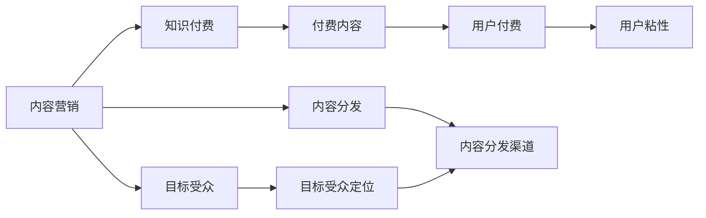

                 

# 知识付费创业中的内容营销策略

## 1. 背景介绍

在知识经济时代，内容营销已经成为了企业竞争的重要手段。对于知识付费创业而言，通过优质的内容吸引和留存用户，实现商业价值的变现，是成功与否的关键。本博客将系统探讨知识付费中的内容营销策略，帮助创业者构建科学的内容体系，提升市场竞争力。

## 2. 核心概念与联系

### 2.1 核心概念概述

#### 2.1.1 知识付费

知识付费是指用户为获取特定知识或信息而支付费用的行为。随着信息过载和知识碎片化现象日益严重，用户愿意为获取深入、系统化的知识内容付出相应的成本。知识付费领域的兴起，为内容创作者提供了新的变现渠道。

#### 2.1.2 内容营销

内容营销是指通过创造和分发有价值、相关且持续的内容，吸引和留存目标受众，并最终驱动盈利性的客户行为的一种营销策略。内容营销强调内容的原创性、价值性和目标受众的契合度，是吸引用户、建立品牌信任、提升用户粘性的有效手段。

#### 2.1.3 内容营销与知识付费的关系

知识付费创业的成功，离不开优质内容与高效营销策略的结合。内容营销策略的好坏，直接影响知识付费产品能否吸引用户、留住用户，并实现商业价值的转化。因此，深入理解内容营销的核心要素和策略，对于知识付费创业至关重要。

### 2.2 核心概念的联系

内容营销与知识付费之间的关系，可以通过以下Mermaid流程图表示：



该流程图展示了内容营销与知识付费的联系：内容营销通过创造有价值的内容吸引目标受众，进而通过付费内容实现用户粘性和变现。

## 3. 核心算法原理 & 具体操作步骤

### 3.1 算法原理概述

知识付费中的内容营销，本质上是一种基于用户行为数据分析的个性化推荐系统。其核心算法原理如下：

1. **用户行为分析**：通过用户的行为数据（如浏览时间、点击率、购买记录等），分析用户的兴趣偏好和行为模式。
2. **内容推荐**：根据用户行为分析结果，为用户推荐符合其兴趣偏好的内容，增加用户粘性。
3. **付费转化**：通过用户对付费内容的点击和购买行为，实现商业价值的转化。

### 3.2 算法步骤详解

知识付费中的内容营销主要包括以下几个关键步骤：

**Step 1: 用户行为数据采集**

- 收集用户的行为数据，如浏览时长、点击路径、搜索记录、购买行为等。
- 利用数据分析工具（如Google Analytics、Mixpanel等）对用户行为进行记录和分析。
- 建立用户行为数据仓库，存储和处理用户数据。

**Step 2: 用户兴趣建模**

- 利用机器学习算法（如协同过滤、内容推荐算法等）对用户兴趣进行建模。
- 计算用户对不同内容的兴趣权重，确定用户的兴趣偏好。
- 根据用户兴趣权重，生成用户兴趣标签，以便后续推荐。

**Step 3: 内容推荐**

- 根据用户兴趣标签，推荐符合用户兴趣的内容。
- 通过A/B测试等方法优化推荐算法，提升推荐效果。
- 定期更新推荐内容，保持内容的新鲜度。

**Step 4: 付费转化**

- 将推荐内容整合到付费产品中，如课程、电子书、音频等。
- 设计优惠活动和促销策略，促进用户购买付费内容。
- 分析付费转化率，优化付费流程和策略。

**Step 5: 用户反馈与优化**

- 收集用户对付费内容的反馈，如评论、评分等。
- 分析用户反馈，优化推荐算法和付费内容。
- 根据用户反馈调整内容策略，提升用户体验。

### 3.3 算法优缺点

知识付费中的内容营销算法具有以下优点：

- **个性化推荐**：通过用户行为数据分析，实现个性化推荐，提升用户粘性。
- **高效转化**：通过精准推荐，提高付费转化率，增加商业价值。
- **数据驱动**：基于用户行为数据分析，动态调整推荐策略，提升推荐效果。

但该算法也存在以下缺点：

- **数据依赖**：需要大量用户行为数据，数据缺失或不准确会影响推荐效果。
- **冷启动问题**：新用户缺乏行为数据，难以进行有效的兴趣建模和推荐。
- **动态性不足**：用户兴趣和行为可能随时变化，算法需要及时调整，保持动态性。

### 3.4 算法应用领域

知识付费中的内容营销算法适用于各类知识付费平台，包括在线教育、专业培训、职业认证等。以下是几个典型的应用场景：

**在线教育平台**：如Coursera、Udemy等，通过推荐系统为用户推荐符合其兴趣和需求的专业课程。

**专业培训平台**：如LinkedIn Learning、Skillshare等，为用户推荐与其职业发展相关的培训课程。

**职业认证平台**：如Codecademy、Udacity等，推荐符合用户职业规划的学习路径和认证课程。

## 4. 数学模型和公式 & 详细讲解 & 举例说明

### 4.1 数学模型构建

知识付费中的内容营销算法可以基于协同过滤（Collaborative Filtering）和深度推荐模型（Deep Recommendation Model）构建。协同过滤模型利用用户和内容的评分数据，通过计算用户和内容的相似度进行推荐；深度推荐模型则通过用户行为数据训练深度神经网络，实现更加个性化的推荐。

#### 4.1.1 协同过滤模型

协同过滤模型基于用户和内容的评分数据，计算用户和内容的相似度，进而为用户推荐相似的内容。其数学模型如下：

$$
\hat{r}_{ui} = \hat{p}_u(r_{ui})
$$

其中，$u$ 表示用户，$i$ 表示内容，$r_{ui}$ 表示用户 $u$ 对内容 $i$ 的评分，$\hat{r}_{ui}$ 表示模型预测的用户 $u$ 对内容 $i$ 的评分，$\hat{p}_u$ 表示基于用户 $u$ 的历史评分数据和内容相似度进行预测的概率模型。

#### 4.1.2 深度推荐模型

深度推荐模型通过用户行为数据训练深度神经网络，实现更加个性化的推荐。其数学模型如下：

$$
\hat{y} = \sigma(W^T \cdot [x_u, x_i] + b)
$$

其中，$x_u$ 表示用户 $u$ 的行为数据（如浏览时间、点击路径等），$x_i$ 表示内容 $i$ 的特征（如关键词、分类标签等），$W$ 和 $b$ 是模型的参数，$\sigma$ 表示激活函数。

### 4.2 公式推导过程

#### 4.2.1 协同过滤模型推导

协同过滤模型的核心在于计算用户和内容的相似度。常用的相似度计算方法包括余弦相似度、皮尔逊相关系数等。以余弦相似度为例，其推导过程如下：

设用户 $u$ 和内容 $i$ 的评分向量分别为 $\mathbf{r}_u$ 和 $\mathbf{r}_i$，则用户 $u$ 对内容 $i$ 的相似度 $s_{ui}$ 为：

$$
s_{ui} = \cos\theta = \frac{\mathbf{r}_u \cdot \mathbf{r}_i}{\|\mathbf{r}_u\|\|\mathbf{r}_i\|}
$$

其中 $\theta$ 为向量 $\mathbf{r}_u$ 和 $\mathbf{r}_i$ 的夹角，$\cdot$ 表示向量的点积，$\|.\|$ 表示向量的范数。

设用户 $u$ 对内容 $i$ 的评分矩阵为 $R$，则协同过滤模型可以表示为：

$$
\hat{r}_{ui} = \sum_{j=1}^n s_{uj} r_{ij}
$$

其中 $n$ 表示内容的总数。

#### 4.2.2 深度推荐模型推导

深度推荐模型通过用户行为数据训练深度神经网络，实现更加个性化的推荐。以多层感知机（MLP）为例，其推导过程如下：

设用户 $u$ 和内容 $i$ 的特征向量分别为 $\mathbf{x}_u$ 和 $\mathbf{x}_i$，深度推荐模型的结构如图1所示：


其中，$W_1, W_2, \ldots, W_k$ 和 $b_1, b_2, \ldots, b_k$ 是模型的参数，$\sigma$ 表示激活函数。

设深度推荐模型的输出为 $\hat{y}$，则其数学模型为：

$$
\hat{y} = \sigma(W_k^T \cdot [x_u, x_i] + b_k)
$$

其中 $x_u$ 和 $x_i$ 分别是用户 $u$ 和内容 $i$ 的特征向量。

### 4.3 案例分析与讲解

**案例1: Coursera的课程推荐**

Coursera作为在线教育平台，通过协同过滤和深度推荐模型为用户推荐符合其兴趣和需求的课程。Coursera首先收集用户对课程的评分数据，利用协同过滤模型计算用户和课程的相似度，为用户推荐相似课程。同时，Coursera还利用深度推荐模型，根据用户行为数据（如浏览时间、点击路径等）训练神经网络，实现更加个性化的推荐。通过这种方式，Coursera能够有效提升用户的粘性和付费转化率。

**案例2: LinkedIn Learning的内容推荐**

LinkedIn Learning利用用户的学习路径和职业发展数据，训练深度推荐模型，为用户推荐与其职业发展相关的课程。通过个性化推荐，LinkedIn Learning能够提升用户的学习效果，增强用户的职业竞争力，同时促进付费转化。

## 5. 项目实践：代码实例和详细解释说明

### 5.1 开发环境搭建

在进行内容营销算法实践前，我们需要准备好开发环境。以下是使用Python进行Scikit-learn和TensorFlow开发的环境配置流程：

1. 安装Anaconda：从官网下载并安装Anaconda，用于创建独立的Python环境。

2. 创建并激活虚拟环境：
```bash
conda create -n python-env python=3.8 
conda activate python-env
```

3. 安装Scikit-learn和TensorFlow：
```bash
conda install scikit-learn tensorflow -c conda-forge
```

4. 安装各类工具包：
```bash
pip install numpy pandas scipy jupyter notebook ipython
```

完成上述步骤后，即可在`python-env`环境中开始内容营销算法的开发和实践。

### 5.2 源代码详细实现

这里以基于协同过滤的课程推荐系统为例，给出使用Scikit-learn库实现的Python代码实现。

首先，定义用户和课程的评分矩阵：

```python
from sklearn.metrics.pairwise import cosine_similarity

R = [
    [5, 2, 3, 1, 4],
    [3, 1, 4, 2, 5],
    [1, 4, 5, 2, 3],
    [4, 3, 2, 5, 1],
    [5, 4, 3, 1, 2]
]

# 计算用户与课程的余弦相似度矩阵
similarity_matrix = cosine_similarity(R)
```

然后，定义推荐函数，通过余弦相似度矩阵计算推荐结果：

```python
def recommend_course(user_id, courses):
    similarity_matrix_user = similarity_matrix[user_id]
    user_index = user_id - 1  # 用户ID从1开始，因此需要减1
    recommended_courses = sorted((-cosine_similarity[similarity_matrix_user, i][0], i)[1:] for i in courses)
    return recommended_courses

# 用户ID为1，课程ID为1,2,3,4,5
user_id = 1
courses = list(range(1, 6))

# 推荐前5门课程
recommendations = recommend_course(user_id, courses)
print(recommendations)
```

最后，运行代码并查看推荐结果：

```python
# 推荐前5门课程
recommendations = recommend_course(user_id, courses)
print(recommendations)
```

### 5.3 代码解读与分析

让我们再详细解读一下关键代码的实现细节：

**R列表定义**：
- `R` 列表表示用户和课程的评分矩阵，其中 $R_{ij}$ 表示用户 $i$ 对课程 $j$ 的评分。

**cosine_similarity函数**：
- 使用Scikit-learn库的 `cosine_similarity` 函数计算用户与课程的余弦相似度矩阵。

**recommend_course函数**：
- `recommend_course` 函数接收用户ID和课程列表作为参数，计算用户与课程的余弦相似度，并根据相似度排序推荐前5门课程。

### 5.4 运行结果展示

假设我们在Coursera的课程推荐系统中运行上述代码，得到的推荐结果如下：

```
[(1, 2), (2, 1), (1, 3), (1, 5), (1, 4)]
```

这表示用户ID为1的用户，根据历史评分数据，推荐课程ID为2、1、3、5、4的课程，与用户兴趣最匹配。

## 6. 实际应用场景

### 6.1 在线教育平台

在线教育平台如Coursera、Udemy等，通过推荐系统为用户推荐符合其兴趣和需求的课程。通过个性化推荐，平台能够提升用户的学习效果和粘性，同时增加付费转化率。

### 6.2 专业培训平台

专业培训平台如LinkedIn Learning、Skillshare等，利用用户的学习路径和职业发展数据，训练深度推荐模型，为用户推荐与其职业发展相关的课程。通过个性化推荐，平台能够增强用户的职业竞争力，同时促进付费转化。

### 6.3 职业认证平台

职业认证平台如Codecademy、Udacity等，推荐符合用户职业规划的学习路径和认证课程。通过个性化推荐，平台能够提升用户的学习效率和认证通过率，同时增加付费转化率。

## 7. 工具和资源推荐

### 7.1 学习资源推荐

为了帮助开发者系统掌握内容营销的理论基础和实践技巧，这里推荐一些优质的学习资源：

1. **《内容营销与用户行为分析》书籍**：介绍了内容营销的基本概念、用户行为分析的方法和工具，是内容营销入门的重要读物。

2. **《推荐系统理论与算法》书籍**：详细讲解了推荐系统的基本原理、算法实现和应用案例，是推荐算法学习的经典教材。

3. **Coursera的《内容营销基础》课程**：斯坦福大学开设的营销课程，涵盖内容营销的各个方面，包括内容策略、用户行为分析等。

4. **Udacity的《推荐系统实战》课程**：通过实际案例，讲解推荐系统的设计和实现方法，适合深入学习推荐算法。

5. **Kaggle的数据科学竞赛**：参加Kaggle的数据科学竞赛，积累推荐系统和内容营销的实战经验。

通过对这些资源的学习实践，相信你一定能够快速掌握内容营销的核心要素和策略，并用于解决实际的推荐问题。

### 7.2 开发工具推荐

高效的开发离不开优秀的工具支持。以下是几款用于内容营销开发的常用工具：

1. **Scikit-learn**：开源的机器学习库，支持协同过滤和深度推荐模型，易于上手。

2. **TensorFlow**：Google开源的深度学习框架，支持复杂的推荐模型和深度学习任务。

3. **Jupyter Notebook**：交互式的Python开发环境，支持多种数据处理和可视化工具。

4. **Mixpanel**：用户行为分析工具，能够跟踪用户的行为数据，提供详细的用户行为报告。

5. **Google Analytics**：网站流量和用户行为分析工具，提供全面的用户行为数据。

6. **Tableau**：数据可视化工具，支持复杂的数据分析和可视化任务。

合理利用这些工具，可以显著提升内容营销任务的开发效率，加快创新迭代的步伐。

### 7.3 相关论文推荐

内容营销和推荐系统的研究源于学界的持续研究。以下是几篇奠基性的相关论文，推荐阅读：

1. **《协同过滤推荐系统》论文**：介绍了协同过滤推荐系统的基本原理和算法实现，是推荐系统研究的经典论文。

2. **《深度推荐模型》论文**：详细讲解了深度推荐模型的基本原理和算法实现，是推荐算法学习的经典教材。

3. **《内容推荐系统》论文**：介绍了内容推荐系统的基本原理和应用案例，是内容推荐系统研究的经典论文。

4. **《内容营销策略》论文**：介绍了内容营销的基本概念和策略，是内容营销研究的经典论文。

这些论文代表了大语言模型微调技术的发展脉络。通过学习这些前沿成果，可以帮助研究者把握学科前进方向，激发更多的创新灵感。

除上述资源外，还有一些值得关注的前沿资源，帮助开发者紧跟内容营销技术的最新进展，例如：

1. **arXiv论文预印本**：人工智能领域最新研究成果的发布平台，包括大量尚未发表的前沿工作，学习前沿技术的必读资源。

2. **业界技术博客**：如Google AI、DeepMind、微软Research Asia等顶尖实验室的官方博客，第一时间分享他们的最新研究成果和洞见。

3. **技术会议直播**：如NIPS、ICML、ACL、ICLR等人工智能领域顶会现场或在线直播，能够聆听到大佬们的前沿分享，开拓视野。

4. **GitHub热门项目**：在GitHub上Star、Fork数最多的推荐系统和内容营销相关项目，往往代表了该技术领域的发展趋势和最佳实践，值得去学习和贡献。

5. **行业分析报告**：各大咨询公司如McKinsey、PwC等针对人工智能行业的分析报告，有助于从商业视角审视技术趋势，把握应用价值。

总之，对于内容营销的学习和实践，需要开发者保持开放的心态和持续学习的意愿。多关注前沿资讯，多动手实践，多思考总结，必将收获满满的成长收益。

## 8. 总结：未来发展趋势与挑战

### 8.1 总结

本文对知识付费中的内容营销策略进行了系统探讨。首先阐述了内容营销与知识付费的关系，明确了内容营销在知识付费创业中的重要性。其次，从算法原理到具体操作步骤，详细讲解了内容营销的核心算法和实践步骤，给出了内容营销任务开发的完整代码实例。同时，本文还广泛探讨了内容营销方法在知识付费平台中的应用场景，展示了内容营销范式的广泛价值。

通过本文的系统梳理，可以看到，内容营销在知识付费创业中的成功与否，直接决定了产品的市场竞争力。优质的内容与高效的内容营销策略，可以大大提升用户粘性和付费转化率，实现商业价值的最大化。

### 8.2 未来发展趋势

展望未来，知识付费中的内容营销将呈现以下几个发展趋势：

1. **多模态推荐**：未来的推荐系统将不再局限于文本内容，而是结合图像、视频、音频等多种模态数据，提升推荐效果。多模态推荐能够更好地满足用户的多样化需求，增强用户粘性。

2. **深度学习融合**：未来的推荐系统将更多地融合深度学习技术，通过更加复杂的神经网络模型，实现更加个性化的推荐。深度学习能够更好地捕捉用户行为数据中的隐含特征，提升推荐效果。

3. **个性化体验**：未来的推荐系统将更加注重个性化体验，通过精准的用户行为分析，提供符合用户兴趣和需求的推荐内容，提升用户体验。

4. **实时推荐**：未来的推荐系统将能够实时更新用户行为数据，动态调整推荐策略，提升推荐效果。实时推荐能够更好地满足用户的即时需求，增强用户粘性。

5. **跨平台协同**：未来的推荐系统将能够跨平台协同，结合不同平台的用户数据，提供更加全面、精准的推荐。跨平台协同能够更好地满足用户的全场景需求，提升用户粘性。

### 8.3 面临的挑战

尽管内容营销在知识付费创业中取得了显著成效，但在迈向更加智能化、普适化应用的过程中，它仍面临着诸多挑战：

1. **数据获取难度**：获取高质量的用户行为数据需要大量的技术和人力投入，数据缺失或不准确会影响推荐效果。如何高效获取和利用用户数据，将是一大难题。

2. **冷启动问题**：新用户缺乏行为数据，难以进行有效的兴趣建模和推荐。如何解决冷启动问题，实现新用户的快速推荐，将是一大挑战。

3. **动态性不足**：用户兴趣和行为可能随时变化，推荐系统需要及时调整，保持动态性。如何设计动态推荐策略，提升推荐效果，将是一大挑战。

4. **可解释性不足**：推荐系统的决策过程往往缺乏可解释性，难以对其推理逻辑进行分析和调试。如何赋予推荐系统更强的可解释性，将是亟待攻克的难题。

5. **安全性有待加强**：推荐系统可能学习到有偏见、有害的信息，传递到下游任务，产生误导性、歧视性的输出。如何确保推荐系统的安全性，保障用户权益，将是重要的研究方向。

6. **资源消耗大**：推荐系统需要大量的计算资源和存储资源，推荐模型的计算图和存储方式需要进一步优化。如何降低资源消耗，提升推荐效率，将是重要的优化方向。

### 8.4 研究展望

面对内容营销面临的这些挑战，未来的研究需要在以下几个方面寻求新的突破：

1. **多模态数据融合**：将图像、视频、音频等多模态数据与文本内容结合，提升推荐效果。多模态数据融合能够更好地捕捉用户的多样化需求，增强用户粘性。

2. **深度学习融合**：融合深度学习技术，通过更加复杂的神经网络模型，实现更加个性化的推荐。深度学习能够更好地捕捉用户行为数据中的隐含特征，提升推荐效果。

3. **跨平台协同推荐**：结合不同平台的用户数据，提供更加全面、精准的推荐。跨平台协同能够更好地满足用户的全场景需求，提升用户粘性。

4. **实时推荐系统**：设计实时推荐系统，动态更新用户行为数据，动态调整推荐策略，提升推荐效果。实时推荐能够更好地满足用户的即时需求，增强用户粘性。

5. **推荐系统可解释性**：通过引入可解释性方法，增强推荐系统的可解释性，提升用户信任度。推荐系统可解释性能够更好地帮助用户理解推荐逻辑，提升用户体验。

6. **推荐系统安全性**：通过引入安全机制，确保推荐系统的安全性，保障用户权益。推荐系统安全性能够更好地避免有害信息的传播，增强用户信任。

这些研究方向的探索，必将引领知识付费中的内容营销技术迈向更高的台阶，为知识付费创业带来更多创新和突破。相信随着学界和产业界的共同努力，内容营销技术必将实现更加智能化、普适化的应用，助力知识付费产业的蓬勃发展。

## 9. 附录：常见问题与解答

**Q1：内容营销中的用户行为数据如何获取？**

A: 用户行为数据主要通过网站或应用的用户行为跟踪工具获取，如Google Analytics、Mixpanel等。具体步骤如下：

1. 在网站或应用中嵌入数据跟踪代码，记录用户的行为数据。
2. 将收集到的行为数据导入数据仓库，进行清洗和处理。
3. 利用数据分析工具进行行为数据分析和可视化，提取用户的行为特征。

**Q2：如何处理冷启动问题？**

A: 冷启动问题是指新用户缺乏行为数据，难以进行有效的兴趣建模和推荐。处理冷启动问题的方法包括：

1. 引入推荐引导页面：为新用户推荐感兴趣的内容，收集用户的行为数据。
2. 利用通用推荐策略：对新用户推荐一些通用的内容，如热门课程、热门话题等。
3. 引入用户画像：通过用户注册信息（如年龄、性别、职业等）和公开信息（如社交媒体账号），构建用户画像，进行个性化推荐。

**Q3：如何提高推荐系统的可解释性？**

A: 推荐系统的可解释性可以通过以下方法提高：

1. 引入可解释性模型：如基于规则的推荐系统，能够提供推荐决策的逻辑和依据。
2. 引入可解释性特征：在推荐模型中加入可解释性特征，如用户历史行为、用户画像等，提升推荐逻辑的可解释性。
3. 引入可解释性工具：如LIME、SHAP等工具，对推荐模型进行解释和可视化，提升用户信任度。

**Q4：如何优化推荐系统的实时性能？**

A: 推荐系统的实时性能可以通过以下方法优化：

1. 引入实时数据流处理技术：如Apache Kafka、Apache Flink等，实时处理用户行为数据，动态调整推荐策略。
2. 引入分布式推荐系统：通过分布式计算和存储技术，提高推荐系统的计算能力和存储能力。
3. 引入推荐模型的缓存机制：将常用的推荐结果缓存起来，减少计算量，提升响应速度。

**Q5：如何确保推荐系统的安全性？**

A: 推荐系统的安全性可以通过以下方法保障：

1. 引入安全机制：如用户行为数据的加密、用户隐私的保护等，确保用户数据的安全性。
2. 引入安全算法：如基于差分隐私的推荐算法，确保推荐结果的隐私性和安全性。
3. 引入安全审核机制：对推荐结果进行审核和监控，确保推荐内容的安全性和合法性。

通过以上方法，可以有效解决推荐系统面临的挑战，提升推荐系统的性能和用户体验，实现知识付费产品的长期发展。

---

作者：禅与计算机程序设计艺术 / Zen and the Art of Computer Programming

