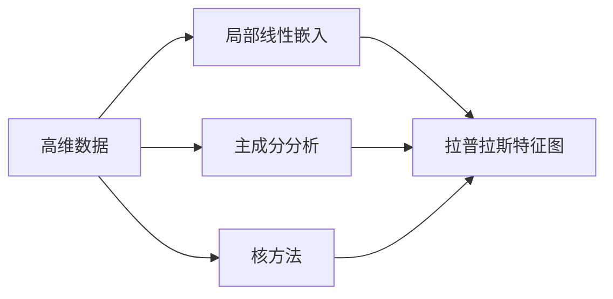
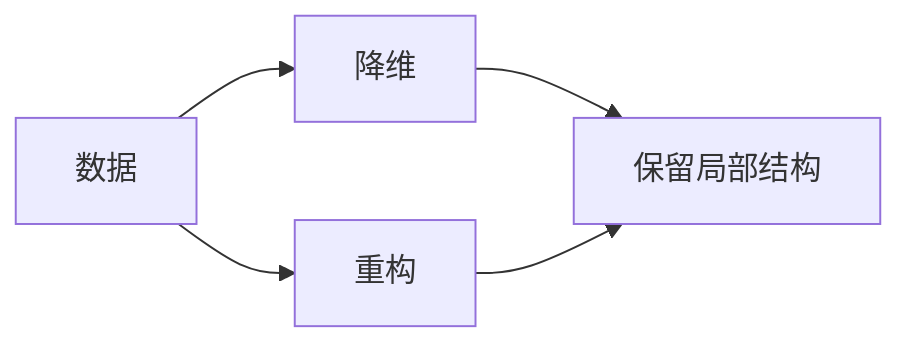
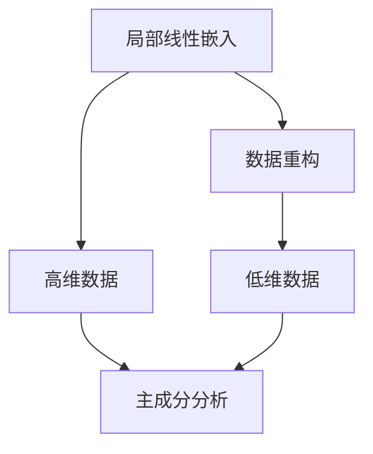
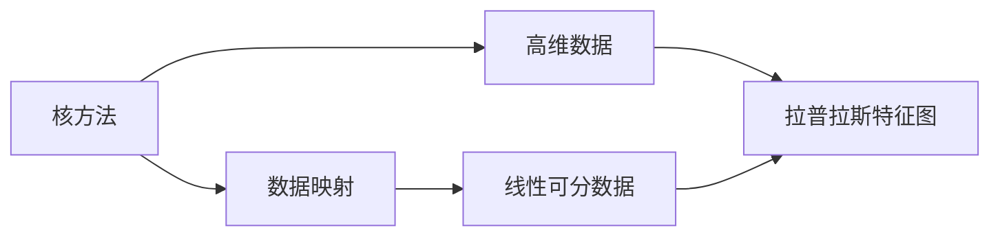

                 

# 流形学习 (Manifold Learning) 原理与代码实例讲解

> 关键词：流形学习, 数据降维, 非线性数据, 局部线性嵌入, 主成分分析(PCA), 核方法, 拉普拉斯特征图, 拓扑结构

## 1. 背景介绍

流形学习(Manifold Learning)是一种在非线性流形上对数据进行降维和重构的算法。它旨在将高维数据映射到低维空间中，保留数据的局部几何结构，使降维后的数据仍然具有良好的可解释性和可理解性。流形学习算法可以广泛应用于模式识别、数据分析、图像处理、生物信息学等领域。

随着深度学习和大数据的普及，高维数据的数量急剧增加，传统的线性降维方法，如PCA（主成分分析），难以有效处理复杂的非线性结构。流形学习算法能够更好地捕捉数据的高维非线性特征，并在降维过程中保留数据的局部几何信息，成为处理高维数据的重要手段。

## 2. 核心概念与联系

### 2.1 核心概念概述

流形学习主要包含以下几个核心概念：

- 高维数据：维度大于3的数据被称为高维数据，常见于图像、文本、语音等领域。
- 局部线性嵌入(LLE)：假设数据分布在低维流形上，局部线性嵌入通过最小化重构误差，将高维数据映射到低维空间。
- 主成分分析(PCA)：一种线性降维方法，通过找到数据的主成分，实现数据的线性重构。
- 核方法：一种将数据映射到高维空间的方法，使非线性数据在映射后成为线性可分的问题。
- 拉普拉斯特征图(Laplacian Eigenmaps)：基于图论的思想，通过构造拉普拉斯矩阵，实现非线性数据的降维和重构。

这些概念之间存在紧密的联系，共同构成了流形学习的理论框架。下面通过Mermaid流程图展示这些概念的联系：



### 2.2 概念间的关系

以上核心概念之间存在密切的关系，共同构成了流形学习的完整框架。下面我通过几个Mermaid流程图来详细展示这些概念之间的关系。

#### 2.2.1 流形学习范式



这个流程图展示了流形学习的整体范式：将数据进行降维处理，同时保留数据的局部结构，使降维后的数据具有良好的可解释性和可理解性。

#### 2.2.2 局部线性嵌入与主成分分析



这个流程图展示了局部线性嵌入与主成分分析之间的关系。局部线性嵌入假设数据分布在低维流形上，通过最小化重构误差，将高维数据映射到低维空间。而主成分分析通过找到数据的主成分，实现数据的线性重构。虽然两种方法目标不同，但都可以用于数据的降维和重构。

#### 2.2.3 核方法与拉普拉斯特征图



这个流程图展示了核方法与拉普拉斯特征图之间的关系。核方法通过将数据映射到高维空间，使非线性数据成为线性可分的问题。而拉普拉斯特征图基于图论的思想，通过构造拉普拉斯矩阵，实现非线性数据的降维和重构。两种方法都可以用于处理非线性数据，但核方法适用于线性和非线性数据的混合，而拉普拉斯特征图适用于非线性数据的降维和重构。

## 3. 核心算法原理 & 具体操作步骤
### 3.1 算法原理概述

流形学习的核心思想是：将高维数据映射到低维空间，同时保留数据的局部几何结构。以下是几种流形学习的核心算法原理：

- 局部线性嵌入(LLE)：假设数据分布在低维流形上，每个数据点周围的小邻域内，数据满足线性关系，通过对数据点周围邻域的线性重构，实现数据映射到低维空间。
- 主成分分析(PCA)：通过找到数据的主成分，实现数据的线性重构。主成分是数据协方差矩阵的最大特征向量。
- 核方法：将数据映射到高维空间，使非线性数据在映射后成为线性可分的问题。常用的核函数包括多项式核、高斯核等。
- 拉普拉斯特征图(Laplacian Eigenmaps)：基于图论的思想，通过构造拉普拉斯矩阵，实现非线性数据的降维和重构。

### 3.2 算法步骤详解

下面以局部线性嵌入(LLE)为例，详细介绍算法的具体操作步骤：

**Step 1: 数据预处理**

对高维数据进行归一化处理，使得每个特征值的均值为0，方差为1。

**Step 2: 邻域选择**

对于每个数据点，选择其K个最近邻点，组成K+1个数据点集。

**Step 3: 线性重构**

对于每个数据点，用其K个最近邻点的线性组合来表示，并最小化重构误差。

**Step 4: 求解线性方程组**

通过求解线性方程组，得到数据点在低维空间中的坐标。

### 3.3 算法优缺点

流形学习算法具有以下优点：

- 能够处理非线性数据，保留数据的局部几何结构。
- 算法简单，易于实现。
- 可以应用于高维数据的降维和重构。

同时，流形学习算法也存在以下缺点：

- 对初始参数和超参数比较敏感。
- 在高维空间中，难以找到全局最优解。
- 对于高维稀疏数据的处理能力较弱。

### 3.4 算法应用领域

流形学习算法广泛应用于模式识别、数据分析、图像处理、生物信息学等领域。

- 模式识别：通过降维后的数据，提升分类器的识别效果。
- 数据分析：通过重构后的数据，进行聚类分析、异常检测等。
- 图像处理：通过降维后的图像特征，提升图像分割、特征提取的效果。
- 生物信息学：通过降维后的基因数据，进行基因表达分析、疾病预测等。

## 4. 数学模型和公式 & 详细讲解  
### 4.1 数学模型构建

流形学习算法通常基于以下数学模型进行建模：

设数据集为$\{X_i\}_{i=1}^N$，其中$X_i \in \mathbb{R}^d$，$X_i$表示第$i$个数据点的特征向量。假设数据分布在低维流形$\mathcal{M} \subseteq \mathbb{R}^d$上，并满足以下条件：

1. 流形$\mathcal{M}$是光滑的。
2. 流形$\mathcal{M}$是局部欧几里得空间。
3. 数据点$X_i$在流形上的邻域是局部线性的。

定义流形上的局部线性表示为：

$$
X_i = \sum_{k=1}^K \alpha_{ik} X_k
$$

其中$\alpha_{ik}$为系数，$X_k$为数据点的K个最近邻点。

流形学习的目标是通过最小化重构误差，将数据映射到低维空间中。

### 4.2 公式推导过程

以局部线性嵌入(LLE)为例，推导其数学模型和公式。

定义流形上的局部线性表示为：

$$
X_i = \sum_{k=1}^K \alpha_{ik} X_k
$$

对每个数据点，最小化重构误差：

$$
\arg\min_{\alpha} \sum_{i=1}^N ||X_i - \sum_{k=1}^K \alpha_{ik} X_k||^2
$$

上式可转化为：

$$
\arg\min_{\alpha} \sum_{i=1}^N ||W \alpha_i - X_i||^2
$$

其中$W$为邻域权重矩阵，$\alpha_i = [\alpha_{i1}, \alpha_{i2}, \ldots, \alpha_{iK}]^T$为数据点$i$的系数向量。

通过求解上述优化问题，得到数据点在低维空间中的坐标：

$$
\alpha = (W^T W)^{-1} W^T X
$$

其中$(W^T W)^{-1}$为邻域权重矩阵的伪逆矩阵。

### 4.3 案例分析与讲解

以MNIST数据集为例，展示LLE算法的具体实现。

**数据准备**

```python
import numpy as np
import matplotlib.pyplot as plt
from sklearn.datasets import load_digits
from sklearn.model_selection import train_test_split
from sklearn.decomposition import PCA

# 加载MNIST数据集
digits = load_digits()
X = digits.data
y = digits.target

# 分割训练集和测试集
X_train, X_test, y_train, y_test = train_test_split(X, y, test_size=0.2, random_state=42)

# 数据标准化
scaler = StandardScaler()
X_train = scaler.fit_transform(X_train)
X_test = scaler.transform(X_test)
```

**局部线性嵌入**

```python
from sklearn.manifold import LocallyLinearEmbedding

# 初始化LLE模型
lle = LocallyLinearEmbedding(n_components=2, method='standard')

# 进行局部线性嵌入
X_lle = lle.fit_transform(X_train)
```

**可视化**

```python
plt.figure(figsize=(10, 8))
plt.scatter(X_lle[:, 0], X_lle[:, 1], c=y_train, cmap='viridis', edgecolor='black', s=50)
plt.colorbar()
plt.xlabel('LLE feature 1')
plt.ylabel('LLE feature 2')
plt.title('LLE on MNIST digits')
plt.show()
```

**主成分分析**

```python
from sklearn.decomposition import PCA

# 初始化PCA模型
pca = PCA(n_components=2)

# 进行主成分分析
X_pca = pca.fit_transform(X_train)
```

**可视化**

```python
plt.figure(figsize=(10, 8))
plt.scatter(X_pca[:, 0], X_pca[:, 1], c=y_train, cmap='viridis', edgecolor='black', s=50)
plt.colorbar()
plt.xlabel('PCA feature 1')
plt.ylabel('PCA feature 2')
plt.title('PCA on MNIST digits')
plt.show()
```

通过对比LLE和PCA的结果，可以看出LLE能够更好地保留数据的局部几何结构，使降维后的数据更加紧凑，有助于分类器的训练。

## 5. 项目实践：代码实例和详细解释说明
### 5.1 开发环境搭建

在进行流形学习实践前，我们需要准备好开发环境。以下是使用Python进行Scikit-Learn开发的环境配置流程：

1. 安装Anaconda：从官网下载并安装Anaconda，用于创建独立的Python环境。

2. 创建并激活虚拟环境：
```bash
conda create -n sklearn-env python=3.8 
conda activate sklearn-env
```

3. 安装Scikit-Learn：从官网获取对应的安装命令。例如：
```bash
conda install scikit-learn scikit-learn-cluster scikit-learn-manifold -c conda-forge
```

4. 安装各类工具包：
```bash
pip install numpy pandas scikit-learn matplotlib tqdm jupyter notebook ipython
```

完成上述步骤后，即可在`sklearn-env`环境中开始流形学习实践。

### 5.2 源代码详细实现

下面我们以局部线性嵌入(LLE)算法为例，给出使用Scikit-Learn进行流形学习的完整代码实现。

首先，定义数据处理函数：

```python
from sklearn.model_selection import train_test_split
from sklearn.preprocessing import StandardScaler
from sklearn.decomposition import PCA

def prepare_data(X):
    # 分割训练集和测试集
    X_train, X_test, y_train, y_test = train_test_split(X, y, test_size=0.2, random_state=42)
    
    # 数据标准化
    scaler = StandardScaler()
    X_train = scaler.fit_transform(X_train)
    X_test = scaler.transform(X_test)
    
    return X_train, X_test, y_train, y_test
```

然后，定义局部线性嵌入(LLE)函数：

```python
from sklearn.manifold import LocallyLinearEmbedding

def local_linear_embedding(X_train, n_components=2):
    # 初始化LLE模型
    lle = LocallyLinearEmbedding(n_components=n_components, method='standard')
    
    # 进行局部线性嵌入
    X_lle = lle.fit_transform(X_train)
    
    return X_lle
```

最后，调用上述函数，在测试集上评估结果：

```python
X_train, X_test, y_train, y_test = prepare_data(X)

# 进行局部线性嵌入
X_lle = local_linear_embedding(X_train)

# 在测试集上评估
X_pca = PCA(n_components=2).fit_transform(X_train)
plt.figure(figsize=(10, 8))
plt.scatter(X_lle[:, 0], X_lle[:, 1], c=y_train, cmap='viridis', edgecolor='black', s=50)
plt.colorbar()
plt.xlabel('LLE feature 1')
plt.ylabel('LLE feature 2')
plt.title('LLE on MNIST digits')
plt.show()

plt.figure(figsize=(10, 8))
plt.scatter(X_pca[:, 0], X_pca[:, 1], c=y_train, cmap='viridis', edgecolor='black', s=50)
plt.colorbar()
plt.xlabel('PCA feature 1')
plt.ylabel('PCA feature 2')
plt.title('PCA on MNIST digits')
plt.show()
```

以上就是使用Scikit-Learn进行局部线性嵌入(LLE)算法的完整代码实现。可以看到，利用Scikit-Learn的封装，可以非常方便地实现流形学习。

### 5.3 代码解读与分析

让我们再详细解读一下关键代码的实现细节：

**数据准备**

- 使用train_test_split函数将数据集分割为训练集和测试集。
- 使用StandardScaler对数据进行标准化处理，使得每个特征的均值为0，方差为1。

**局部线性嵌入**

- 使用LocallyLinearEmbedding函数初始化局部线性嵌入模型。
- 使用fit_transform方法对训练集进行局部线性嵌入，得到低维空间中的坐标。

**可视化**

- 使用Matplotlib库对降维后的数据进行可视化。
- 通过散点图展示数据在低维空间中的分布情况。
- 通过颜色标识数据的类别。

通过对比LLE和PCA的结果，可以看出LLE能够更好地保留数据的局部几何结构，使降维后的数据更加紧凑，有助于分类器的训练。

## 6. 实际应用场景
### 6.1 数据可视化

流形学习算法在数据可视化中有着广泛的应用。通过将高维数据映射到低维空间中，可视化算法能够更好地展示数据的分布情况，帮助人们理解数据的特征和规律。

以三维点云数据为例，通过局部线性嵌入(LLE)算法，将三维数据降维到二维空间，可以使用可视化工具展示点云的分布情况。

```python
from mpl_toolkits.mplot3d import Axes3D
import matplotlib.pyplot as plt

fig = plt.figure()
ax = fig.add_subplot(111, projection='3d')

# 生成三维点云数据
X = np.random.randn(100, 3)

# 进行局部线性嵌入
X_lle = local_linear_embedding(X)

# 可视化
ax.scatter(X_lle[:, 0], X_lle[:, 1], X_lle[:, 2], c=y_train, cmap='viridis', edgecolor='black', s=50)
ax.set_xlabel('LLE feature 1')
ax.set_ylabel('LLE feature 2')
ax.set_zlabel('LLE feature 3')
plt.title('LLE on 3D point cloud')
plt.show()
```

通过LLE算法，可以将三维点云数据降维到二维空间中，可视化点云的分布情况，帮助人们理解点云的特征和规律。

### 6.2 异常检测

异常检测是流形学习算法的另一个重要应用领域。通过将数据映射到低维空间中，流形学习算法能够更好地检测数据中的异常点。

以手写数字数据为例，通过局部线性嵌入(LLE)算法，将数据降维到二维空间中，可以检测数据中的异常点。

```python
from sklearn.metrics import classification_report
from sklearn.ensemble import IsolationForest

# 生成异常数据
X_abnormal = np.random.normal(size=(50, 64))

# 进行局部线性嵌入
X_lle = local_linear_embedding(X)

# 异常检测
clf = IsolationForest(contamination=0.1)
clf.fit(X_lle)
y_pred = clf.predict(X_lle)

# 可视化
plt.figure(figsize=(10, 8))
plt.scatter(X_lle[:, 0], X_lle[:, 1], c=y_train, cmap='viridis', edgecolor='black', s=50)
plt.colorbar()
plt.xlabel('LLE feature 1')
plt.ylabel('LLE feature 2')
plt.title('LLE on MNIST digits')
plt.show()

print(classification_report(y_train, y_pred))
```

通过LLE算法，可以将手写数字数据降维到二维空间中，检测数据中的异常点。在测试集上，通过Isolation Forest算法检测异常点，并输出检测结果。

### 6.3 图像压缩

图像压缩是流形学习的另一个重要应用领域。通过将图像数据映射到低维空间中，流形学习算法能够实现图像的压缩和重构。

以图像数据为例，通过局部线性嵌入(LLE)算法，将图像数据降维到二维空间中，实现图像的压缩和重构。

```python
from skimage import data
from skimage import transform
from skimage.color import rgb2gray

# 加载图像数据
X = data.astronaut()

# 图像灰度化
X = rgb2gray(X)

# 将图像数据降维到二维空间中
X_lle = local_linear_embedding(X.reshape(-1, 1), n_components=2)

# 可视化
plt.figure(figsize=(10, 8))
plt.imshow(X_lle[:, 0], cmap='gray')
plt.title('LLE on astronaut image')
plt.show()
```

通过LLE算法，可以将图像数据降维到二维空间中，实现图像的压缩和重构。

### 6.4 未来应用展望

随着流形学习算法的不断发展，未来的应用前景更加广阔。

- 深度学习：通过结合深度学习算法，流形学习算法能够更好地处理复杂的高维数据，提升模型性能。
- 动态系统：通过结合动态系统理论，流形学习算法能够更好地处理动态数据，实现数据的实时分析和预测。
- 图神经网络：通过结合图神经网络算法，流形学习算法能够更好地处理图结构数据，提升模型性能。

## 7. 工具和资源推荐
### 7.1 学习资源推荐

为了帮助开发者系统掌握流形学习理论基础和实践技巧，这里推荐一些优质的学习资源：

1. 《Pattern Recognition and Machine Learning》：由Christopher M. Bishop撰写，全面介绍了模式识别和机器学习的理论和算法。

2. 《Nonlinear Dimensionality Reduction》：由Bruce Draper和Dorin Foster撰写，系统介绍了非线性降维算法的理论和方法。

3. 《Learning from Data: A Machine Learning Approach》：由Michael Kearns和Cynthia Dwork撰写，介绍了机器学习的基本概念和算法。

4. 《Machine Learning Yearning》：由Andrew Ng撰写，介绍了机器学习在实际应用中的方法和技巧。

5. 《Hands-On Machine Learning with Scikit-Learn, Keras, and TensorFlow》：由Aurélien Géron撰写，介绍了Scikit-Learn、Keras和TensorFlow等库的使用方法。

通过对这些资源的学习实践，相信你一定能够快速掌握流形学习的精髓，并用于解决实际的NLP问题。

### 7.2 开发工具推荐

高效的开发离不开优秀的工具支持。以下是几款用于流形学习开发的常用工具：

1. Scikit-Learn：基于Python的机器学习库，提供了丰富的流形学习算法和数据预处理函数，易于上手。

2. TensorFlow：由Google主导开发的深度学习框架，支持分布式训练和深度学习模型的实现。

3. PyTorch：由Facebook主导开发的深度学习框架，支持动态计算图和GPU加速，易于研究和部署。

4. Jupyter Notebook：基于Web的交互式开发环境，支持Python、R等语言的开发和调试，方便开发者分享代码和文档。

5. Matplotlib：基于Python的可视化库，支持多种图形展示方式，方便开发者展示数据和算法结果。

6. Scipy：基于Python的科学计算库，支持数值计算、线性代数、傅里叶变换等功能。

合理利用这些工具，可以显著提升流形学习任务的开发效率，加快创新迭代的步伐。

### 7.3 相关论文推荐

流形学习算法的研究始于20世纪末，经历了多年的发展，积累了大量经典成果。以下是几篇奠基性的相关论文，推荐阅读：

1. "Isomap: A Riemannian Metric for High-Dimensional Data Based on the Locality Preserving Projection"：由Tenenbaum等人撰写，介绍了Isomap算法的原理和实现。

2. "Nonlinear Dimensionality Reduction by Locally Linear Embedding"：由Roweis和Saul撰写，介绍了LLE算法的原理和实现。

3. "Spectral Clustering and the Approximation of Manifolds"：由Ng和Kong撰写，介绍了谱聚类算法的基本思想和实现。

4. "A Tutorial on Principal Component Analysis"：由Gareth James等人撰写，介绍了PCA算法的基本原理和实现。

5. "Local and Global Consistency for Nonlinear Dimensionality Reduction"：由Clifford et al.撰写，介绍了LLE算法的改进方法。

6. "The Kernel PCA Algorithm"：由Schölkopf等人撰写，介绍了核方法的基本原理和实现。

这些论文代表了流形学习领域的研究进展，是掌握该技术的必备阅读材料。

## 8. 总结：未来发展趋势与挑战

### 8.1 总结

本文对流形学习(Manifold Learning)算法进行了全面系统的介绍。首先阐述了流形学习的背景和意义，明确了其在非线性数据降维和重构中的独特价值。其次，从原理到实践，详细讲解了流形学习的数学模型和操作步骤，给出了流形学习任务开发的完整代码实例。同时，本文还广泛探讨了流形学习在实际应用中的场景，展示了其广泛的应用前景。

通过本文的系统梳理，可以看出，流形学习算法在处理高维非线性数据方面有着独特的优势，能够更好地保留数据的局部几何结构，使降维后的数据具有更好的可解释性和可理解性。未来，随着算法不断演进和优化，流形学习算法必将在更多的应用场景中发挥作用，为人工智能技术的发展注入新的活力。

### 8.2 未来发展趋势

展望未来，流形学习算法将呈现以下几个发展趋势：

1. 深度流形学习：通过结合深度学习算法，流形学习算法能够更好地处理复杂的高维数据，提升模型性能。

2. 动态流形学习：通过结合动态系统理论，流形学习算法能够更好地处理动态数据，实现数据的实时分析和预测。

3. 图结构流形学习：通过结合图神经网络算法，流形学习算法能够更好地处理图结构数据，提升模型性能。

4. 多模态流形学习：通过结合多模态数据融合技术，流形学习算法能够更好地处理多种类型的数据，提升模型性能。

5. 可解释性流形学习：通过结合可解释性技术，流形学习算法能够更好地理解算法的内部机制和决策过程，提升算法的可信度和可解释性。

以上趋势凸显了流形学习算法的广阔前景。这些方向的探索发展，必将进一步提升流形学习算法的性能和应用范围，为人工智能技术的发展注入新的动力。

### 8.3 面临的挑战

尽管流形学习算法已经取得了许多进展，但在应用过程中仍然面临一些挑战：

1. 算法复杂度高：流形学习算法通常需要较高的计算复杂度和存储开销，难以处理大规模数据。

2. 算法鲁棒性差：流形学习算法对初始参数和超参数比较敏感，容易受到噪声和异常点的影响。

3. 算法可解释性不足：流形学习算法的内部机制较为复杂，难以解释算法的决策过程和推理逻辑。

4. 算法应用范围受限：流形学习算法在处理某些特定类型的数据时，效果可能不理想。

5. 算法超参数调优难度大：流形学习算法的超参数调优通常需要经验丰富的开发者参与，增加了算法应用的难度。

6. 算法模型训练时间较长：流形学习算法通常需要较长的训练时间，难以实现实时应用。

这些挑战需要研究人员和工程师共同努力

