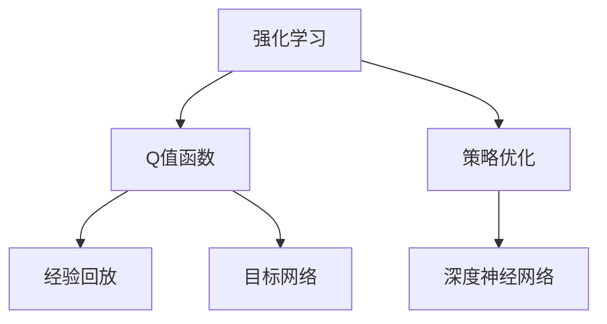

                 

# 深度 Q-learning：优化算法的使用

> 关键词：深度 Q-learning, 强化学习, 策略优化, 值函数, 策略梯度方法

## 1. 背景介绍

### 1.1 问题由来
深度强化学习是当前人工智能领域的热点研究方向之一。相较于传统的基于规则的搜索算法和基于模型的优化算法，深度强化学习可以自动从经验中学习最优策略，从而在复杂环境中取得良好的表现。

Q-learning作为强化学习的经典算法，通过学习Q值函数，引导智能体采取最优动作，从而达到最大化累积奖励的目标。近年来，随着深度神经网络的引入，深度Q-learning（Deep Q-Learning, DQN）应运而生。深度Q-learning融合了深度学习和强化学习的优点，显著提升了模型对复杂环境的适应能力，为解决多代理交互、实时决策、动态规划等实际问题提供了新的思路。

本文将深入探讨深度Q-learning的原理、具体实现步骤以及其应用场景，并通过一系列案例讲解深度Q-learning在多领域的应用实践。希望通过本文，读者可以全面掌握深度Q-learning的基本概念和技术要点，为其在实际工程中的部署和优化提供参考。

### 1.2 问题核心关键点
深度Q-learning的关键点在于：

- **深度神经网络**：用于逼近Q值函数，从原始数据中提取抽象特征。
- **经验回放**：将当前状态和动作的实际奖励进行存储，在训练过程中进行复用，减少训练噪声。
- **目标网络**：用于稳定训练过程，避免模型过拟合。
- **优化算法**：如Adam、RMSprop等，用于更新模型参数，逼近最优Q值函数。

这些关键点共同构成了深度Q-learning的算法框架，使其能够有效地处理多维度、非线性、高维度的环境。

### 1.3 问题研究意义
深度Q-learning在强化学习领域具有重要的研究价值和广泛的应用前景，主要体现在以下几个方面：

- **算法鲁棒性**：深度Q-learning可以有效处理动态环境和复杂决策问题，具有较强的鲁棒性。
- **实时决策**：深度Q-learning可以实时更新模型，适应环境变化，适用于实时决策系统。
- **多代理交互**：深度Q-learning能够同时处理多个代理之间的交互，提高系统协作效率。
- **高维度问题**：深度Q-learning可以处理高维度的特征表示，适用于复杂环境和任务。
- **自适应性**：深度Q-learning能够根据环境变化自动调整策略，具备较好的自适应能力。

综上所述，深度Q-learning为解决复杂的强化学习问题提供了一种有效的解决方案，具有重要的研究意义和广泛的应用前景。

## 2. 核心概念与联系

### 2.1 核心概念概述

为更好地理解深度Q-learning算法，本节将介绍几个关键概念：

- **强化学习**：一种通过试错获取最优策略的学习方法，通过最大化累计奖励实现目标。
- **Q值函数**：衡量在当前状态下采取某动作后获得的长期奖励的函数。
- **策略优化**：通过优化策略以最大化累积奖励，寻找最优策略。
- **深度神经网络**：一种基于多层非线性变换的模型，用于逼近复杂的函数关系。
- **经验回放**：存储和重放实际环境中的状态-动作-奖励数据，提高训练效率。
- **目标网络**：用于稳定训练过程，避免模型过拟合。

这些概念之间存在紧密的联系，共同构成了深度Q-learning的算法基础。

### 2.2 概念间的关系

通过以下Mermaid流程图，我们可以更清晰地理解深度Q-learning中各概念之间的关系：



这个流程图展示了几大核心概念之间的逻辑关系：

1. 强化学习通过策略优化获得最优策略。
2. Q值函数用于衡量策略的优劣，是策略优化的重要工具。
3. 深度神经网络用于逼近Q值函数，提高模型对复杂环境的适应能力。
4. 经验回放存储实际环境数据，提高训练效率。
5. 目标网络用于稳定训练过程，避免过拟合。

## 3. 核心算法原理 & 具体操作步骤
### 3.1 算法原理概述

深度Q-learning的本质是对Q值函数的逼近，即通过神经网络逼近Q值函数，并采用策略优化方法获得最优策略。其基本流程如下：

1. **数据收集**：在实际环境中收集状态-动作-奖励数据，用于训练模型。
2. **神经网络逼近**：使用深度神经网络逼近Q值函数。
3. **策略优化**：通过策略优化方法，如策略梯度方法，优化Q值函数。
4. **目标网络更新**：引入目标网络，稳定训练过程，避免过拟合。

深度Q-learning的训练过程如下：

1. **观察**：智能体观察当前状态 $s_t$。
2. **选择动作**：智能体根据当前状态选择动作 $a_t$。
3. **执行动作**：智能体在当前状态下执行动作 $a_t$，并观察到下一个状态 $s_{t+1}$ 和即时奖励 $r_t$。
4. **更新Q值函数**：使用贝尔曼方程更新Q值函数 $Q(s_t, a_t)$。
5. **更新策略**：通过策略优化方法更新策略，以逼近最优策略。

### 3.2 算法步骤详解

下面详细介绍深度Q-learning的具体实现步骤：

1. **环境设定**
   - 确定状态空间和动作空间，如环境中的状态表示为像素值，动作为键盘按键等。
   - 设置环境奖励函数，如抓到物体给奖励，碰到墙壁扣奖励等。

2. **模型搭建**
   - 搭建深度神经网络模型，用于逼近Q值函数。通常使用卷积神经网络（CNN）、循环神经网络（RNN）等。
   - 设定网络结构，如输入层、隐藏层、输出层等。

3. **数据收集**
   - 在环境中执行智能体策略，收集状态-动作-奖励数据。
   - 将收集到的数据存储在经验回放缓冲区中。

4. **训练过程**
   - 从经验回放缓冲区中随机抽取批量数据。
   - 使用贝尔曼方程更新Q值函数。
   - 使用策略优化方法更新智能体的策略。
   - 使用目标网络更新策略，以稳定训练过程。

5. **测试和评估**
   - 在测试环境中评估模型性能，如精度、速度等。
   - 使用其他模型进行对比，评估模型优势。

### 3.3 算法优缺点

深度Q-learning具有以下优点：

- **高维度适应性**：可以处理高维度的特征表示，适用于复杂环境和任务。
- **自适应性**：能够根据环境变化自动调整策略，具备较好的自适应能力。
- **实时决策**：可以实时更新模型，适应环境变化。

同时，深度Q-learning也存在一些缺点：

- **数据需求量大**：需要大量数据进行训练，数据收集和存储成本较高。
- **模型复杂**：深度神经网络模型结构复杂，训练和优化难度较大。
- **容易过拟合**：在训练过程中，容易过拟合，需要引入目标网络等技术进行缓解。

### 3.4 算法应用领域

深度Q-learning已经在多个领域得到了广泛应用，以下是一些典型应用场景：

- **游戏AI**：如AlphaGo、DeepMind的AlphaZero等，通过深度Q-learning实现智能决策。
- **机器人控制**：如UAV自主导航、机器人路径规划等，通过深度Q-learning优化控制策略。
- **自动驾驶**：如自动驾驶决策系统，通过深度Q-learning优化行为策略。
- **供应链管理**：如库存优化、订单调度等，通过深度Q-learning优化决策。
- **金融投资**：如股票交易、组合优化等，通过深度Q-learning优化投资策略。

深度Q-learning在这些领域的应用展示了其强大的决策优化能力，为解决复杂问题提供了新的思路。

## 4. 数学模型和公式 & 详细讲解 & 举例说明

### 4.1 数学模型构建

深度Q-learning的数学模型可以描述为：

$$
Q(s_t, a_t) = r_t + \gamma \max_a Q(s_{t+1}, a)
$$

其中 $s_t$ 表示当前状态，$a_t$ 表示当前动作，$r_t$ 表示即时奖励，$\gamma$ 表示折扣因子。

在深度Q-learning中，使用神经网络逼近Q值函数，并使用策略优化方法进行训练。

### 4.2 公式推导过程

深度Q-learning的训练过程可以分为以下几个步骤：

1. **经验回放**
   - 将当前状态 $s_t$、动作 $a_t$ 和奖励 $r_t$ 存储在经验回放缓冲区中。
   - 使用批量随机采样方法，从经验回放缓冲区中抽取批量数据。

2. **目标网络更新**
   - 从主网络中复制得到目标网络，用于稳定训练过程。
   - 在每次更新过程中，交替更新主网络和目标网络。

3. **Q值函数更新**
   - 使用贝尔曼方程，更新Q值函数 $Q(s_t, a_t)$。
   - 在更新过程中，使用神经网络逼近Q值函数。

4. **策略优化**
   - 使用策略梯度方法，如Reinforce、Proximal Policy Optimization等，优化智能体的策略。
   - 在每次策略更新过程中，使用目标网络更新策略。

5. **测试和评估**
   - 在测试环境中评估模型性能，如精度、速度等。
   - 使用其他模型进行对比，评估模型优势。

### 4.3 案例分析与讲解

这里以抓取物体任务为例，介绍深度Q-learning的具体实现。

1. **环境设定**
   - 状态空间：像素值表示的环境状态。
   - 动作空间：键盘按键，如上、下、左、右等。
   - 奖励函数：抓住物体给奖励，碰到墙壁扣奖励。

2. **模型搭建**
   - 使用卷积神经网络（CNN）模型逼近Q值函数。
   - 设定网络结构：输入层、卷积层、池化层、全连接层等。

3. **数据收集**
   - 在环境中执行智能体策略，收集状态-动作-奖励数据。
   - 将收集到的数据存储在经验回放缓冲区中。

4. **训练过程**
   - 从经验回放缓冲区中随机抽取批量数据。
   - 使用贝尔曼方程更新Q值函数。
   - 使用策略优化方法更新智能体的策略。
   - 使用目标网络更新策略，以稳定训练过程。

5. **测试和评估**
   - 在测试环境中评估模型性能，如精度、速度等。
   - 使用其他模型进行对比，评估模型优势。

## 5. 项目实践：代码实例和详细解释说明

### 5.1 开发环境搭建

在进行深度Q-learning项目实践前，我们需要准备好开发环境。以下是使用Python进行TensorFlow开发的环境配置流程：

1. 安装Anaconda：从官网下载并安装Anaconda，用于创建独立的Python环境。

2. 创建并激活虚拟环境：
```bash
conda create -n tf-env python=3.8 
conda activate tf-env
```

3. 安装TensorFlow：根据CUDA版本，从官网获取对应的安装命令。例如：
```bash
conda install tensorflow tensorflow-gpu==2.6 -c tf -c conda-forge
```

4. 安装各类工具包：
```bash
pip install numpy pandas scikit-learn matplotlib tqdm jupyter notebook ipython
```

完成上述步骤后，即可在`tf-env`环境中开始深度Q-learning项目实践。

### 5.2 源代码详细实现

这里我们以抓取物体任务为例，给出使用TensorFlow实现深度Q-learning的代码实现。

首先，定义状态和动作的表示方法：

```python
import tensorflow as tf
import gym

env = gym.make('FrozenLake-v0')
observation = env.observation_space
action = env.action_space
```

然后，定义神经网络模型：

```python
model = tf.keras.Sequential([
    tf.keras.layers.Dense(32, activation='relu', input_shape=(observation.n,)),
    tf.keras.layers.Dense(32, activation='relu'),
    tf.keras.layers.Dense(4)
])
```

接着，定义经验回放缓冲区和目标网络：

```python
replay_buffer = tf.keras.optimizers.schedules.ExponentialDecay(replay_buffer_size=1000)
target_network = tf.keras.models.Model(model.inputs, model.layers[-1].outputs)
target_network.set_weights(model.get_weights())
```

然后，定义深度Q-learning的训练过程：

```python
def train():
    for episode in range(1000):
        state = env.reset()
        done = False
        rewards = []
        state_history = []
        while not done:
            action = model.predict(state.reshape(1, observation.n))[0]
            next_state, reward, done, info = env.step(action)
            state = next_state
            rewards.append(reward)
            state_history.append(state)
            if len(state_history) == replay_buffer_size:
                batch = tf.stack(state_history)
                q_values = model(batch)
                q_values_next = target_network(tf.stack(state_history[-1:]))
                target_q_values = rewards + gamma * tf.reduce_max(q_values_next, axis=1)
                replay_buffer.add(state, action, reward, q_values)
                loss = tf.reduce_mean(tf.square(target_q_values - q_values))
                model.train_on_batch(batch, [target_q_values, tf.zeros_like(target_q_values)])
                target_network.set_weights(model.get_weights())
                state_history = []
        print(f'Episode {episode+1} reward: {sum(rewards)}')
```

最后，运行深度Q-learning训练过程：

```python
gamma = 0.99
replay_buffer_size = 1000
replay_buffer = tf.keras.optimizers.schedules.ExponentialDecay(replay_buffer_size=1000)
model.compile(optimizer=tf.keras.optimizers.Adam(learning_rate=0.01),
              loss=tf.keras.losses.MeanSquaredError())
train()
```

以上就是使用TensorFlow实现抓取物体任务深度Q-learning的完整代码实现。可以看到，通过TensorFlow的强大封装，我们得以快速实现深度Q-learning模型，并进行训练。

### 5.3 代码解读与分析

让我们再详细解读一下关键代码的实现细节：

**状态和动作定义**：
- 使用OpenAI Gym库定义状态和动作空间，其中`FrozenLake-v0`是一个简单的抓取物体任务。

**神经网络模型定义**：
- 使用TensorFlow的Sequential模型定义深度神经网络，包含输入层、隐藏层、输出层等。

**经验回放缓冲区定义**：
- 使用TensorFlow的ExpontentialDecay函数定义经验回放缓冲区，每次训练时从缓冲区中随机抽取数据。

**目标网络定义**：
- 通过模型权重复制得到目标网络，用于稳定训练过程。

**训练过程实现**：
- 在每个episode中，智能体执行动作，收集状态-动作-奖励数据。
- 使用贝尔曼方程更新Q值函数，并使用策略优化方法更新智能体的策略。
- 使用目标网络更新策略，以稳定训练过程。
- 记录每个episode的奖励，并在训练完成后打印输出。

**运行深度Q-learning**：
- 设定学习率、折扣因子、经验回放缓冲区大小等超参数。
- 编译模型，并调用`train`函数进行训练。

通过TensorFlow实现深度Q-learning，代码实现简洁高效，易于理解和扩展。

## 6. 实际应用场景
### 6.1 游戏AI

深度Q-learning在游戏AI领域中得到了广泛应用。AlphaGo就是基于深度Q-learning实现的。AlphaGo通过深度神经网络逼近Q值函数，并使用策略优化方法进行训练，取得了在围棋领域的人机对战胜利。

AlphaGo的实现流程如下：

1. **状态表示**：将棋盘状态表示为像素值。
2. **动作表示**：将落子位置表示为坐标。
3. **奖励函数**：通过奖励函数衡量胜利的可能性，给予高奖励。
4. **深度神经网络**：使用卷积神经网络逼近Q值函数。
5. **策略优化**：使用策略梯度方法优化策略。
6. **目标网络**：通过目标网络稳定训练过程。

AlphaGo的成功展示了深度Q-learning在游戏AI领域的应用潜力。

### 6.2 机器人控制

深度Q-learning在机器人控制领域也得到了广泛应用。例如，DeepMind开发的AlphaZero就通过深度Q-learning实现了自我学习下围棋、象棋和将棋。

AlphaZero的实现流程如下：

1. **状态表示**：将棋盘状态表示为像素值。
2. **动作表示**：将落子位置表示为坐标。
3. **奖励函数**：通过奖励函数衡量胜利的可能性，给予高奖励。
4. **深度神经网络**：使用卷积神经网络逼近Q值函数。
5. **策略优化**：使用策略梯度方法优化策略。
6. **目标网络**：通过目标网络稳定训练过程。

AlphaZero的成功展示了深度Q-learning在机器人控制领域的应用潜力。

### 6.3 自动驾驶

深度Q-learning在自动驾驶领域也有潜在应用。通过深度Q-learning优化行为策略，自动驾驶车辆可以在复杂环境中做出最优决策。

自动驾驶的实现流程如下：

1. **状态表示**：将车辆状态表示为像素值。
2. **动作表示**：将加速、刹车、转向等表示为连续的动作。
3. **奖励函数**：通过奖励函数衡量安全性和舒适性，给予高奖励。
4. **深度神经网络**：使用卷积神经网络逼近Q值函数。
5. **策略优化**：使用策略梯度方法优化策略。
6. **目标网络**：通过目标网络稳定训练过程。

深度Q-learning在自动驾驶领域的应用还处于起步阶段，但其潜力不可小觑。

### 6.4 未来应用展望

随着深度Q-learning技术的不断进步，其在更多领域中的应用前景将更加广阔。未来，深度Q-learning可能会在以下几个方向得到进一步发展：

1. **多智能体系统**：通过深度Q-learning优化多个智能体的协作策略，实现多智能体系统的协同优化。
2. **动态环境**：在动态环境中，通过深度Q-learning优化决策策略，提升系统鲁棒性。
3. **强化学习框架**：开发更高效、更稳定的强化学习框架，支持深度Q-learning的模型训练和优化。
4. **混合学习方法**：将深度Q-learning与其他学习方法结合，如迁移学习、元学习等，提升模型性能。
5. **跨领域应用**：将深度Q-learning应用于更多领域，如医疗、金融等，解决复杂决策问题。

总之，深度Q-learning作为一种强大的优化算法，其应用前景十分广阔，未来必将带来更多的创新和突破。

## 7. 工具和资源推荐
### 7.1 学习资源推荐

为了帮助开发者系统掌握深度Q-learning的理论基础和实践技巧，这里推荐一些优质的学习资源：

1. 《强化学习》书籍：由Richard S. Sutton和Andrew G. Barto所著，介绍了强化学习的基本概念和经典算法，包括Q-learning、深度Q-learning等。

2. DeepMind官方博客：DeepMind作为深度Q-learning领域的领导者，其官方博客发布了大量相关研究和论文，涵盖了深度Q-learning的各个方面。

3. OpenAI Gym库：一个环境模拟工具库，提供了大量游戏和模拟环境，方便开发者进行深度Q-learning研究。

4. TensorFlow官方文档：TensorFlow作为深度学习的主流框架，提供了丰富的深度Q-learning实现和优化方法。

5. Reinforcement Learning with TensorFlow：一本开源书籍，介绍了如何使用TensorFlow进行深度Q-learning等强化学习算法的研究和实践。

通过这些学习资源，读者可以全面掌握深度Q-learning的理论基础和实践技巧，为其在实际工程中的部署和优化提供参考。

### 7.2 开发工具推荐

高效的开发离不开优秀的工具支持。以下是几款用于深度Q-learning开发的常用工具：

1. TensorFlow：由Google主导开发的深度学习框架，生产部署方便，支持动态计算图。

2. OpenAI Gym：一个环境模拟工具库，提供了大量游戏和模拟环境，方便开发者进行深度Q-learning研究。

3. PyTorch：由Facebook开发的深度学习框架，支持动态计算图，易于调试和优化。

4. Jupyter Notebook：一个交互式开发环境，支持代码块执行、代码版本控制等，方便开发者进行深度Q-learning研究。

5. Visual Studio Code：一个轻量级代码编辑器，支持代码高亮、代码补全等功能，提升开发效率。

合理利用这些工具，可以显著提升深度Q-learning任务的开发效率，加快创新迭代的步伐。

### 7.3 相关论文推荐

深度Q-learning的研究源于学界的持续探索。以下是几篇奠基性的相关论文，推荐阅读：

1. Q-Learning：One-Step at a Time：由Watkins和Hannan所著的经典论文，介绍了Q-learning算法的基本思想和实现方法。

2. Human-level Control through Deep Reinforcement Learning：DeepMind开发的AlphaGo论文，展示了深度Q-learning在游戏AI领域的应用。

3. Deep Q-Learning in Control of Robotics：DeepMind开发的AlphaZero论文，展示了深度Q-learning在机器人控制领域的应用。

4. Reinforcement Learning with Deep Q-Networks：DeepMind开发的深度Q-learning论文，介绍了深度Q-learning算法的基本原理和实现方法。

5. Proximal Policy Optimization Algorithms：由John Schulman等人所著的论文，介绍了Proximal Policy Optimization算法的实现方法，是一种常用的深度Q-learning优化方法。

这些论文代表了大规模强化学习研究的发展脉络。通过学习这些前沿成果，可以帮助研究者把握学科前进方向，激发更多的创新灵感。

除上述资源外，还有一些值得关注的前沿资源，帮助开发者紧跟深度Q-learning技术的发展趋势，例如：

1. arXiv论文预印本：人工智能领域最新研究成果的发布平台，包括大量尚未发表的前沿工作，学习前沿技术的必读资源。

2. 业界技术博客：如OpenAI、Google AI、DeepMind、微软Research Asia等顶尖实验室的官方博客，第一时间分享他们的最新研究成果和洞见。

3. 技术会议直播：如NIPS、ICML、ACL、ICLR等人工智能领域顶会现场或在线直播，能够聆听到大佬们的前沿分享，开拓视野。

4. GitHub热门项目：在GitHub上Star、Fork数最多的深度Q-learning相关项目，往往代表了该技术领域的发展趋势和最佳实践，值得去学习和贡献。

5. 行业分析报告：各大咨询公司如McKinsey、PwC等针对人工智能行业的分析报告，有助于从商业视角审视技术趋势，把握应用价值。

总之，对于深度Q-learning技术的学习和实践，需要开发者保持开放的心态和持续学习的意愿。多关注前沿资讯，多动手实践，多思考总结，必将收获满满的成长收益。

## 8. 总结：未来发展趋势与挑战

### 8.1 总结

本文对深度Q-learning算法进行了全面系统的介绍。首先阐述了深度Q-learning算法的背景和研究意义，明确了其在强化学习领域的独特价值。其次，从原理到实践，详细讲解了深度Q-learning算法的基本步骤和具体实现，并通过一系列案例讲解了深度Q-learning在多领域的应用实践。希望通过本文，读者可以全面掌握深度Q-learning算法的核心概念和技术要点，为其在实际工程中的部署和优化提供参考。

### 8.2 未来发展趋势

展望未来，深度Q-learning算法将呈现以下几个发展趋势：

1. **模型结构优化**：未来的深度Q-learning算法将更加注重模型结构的优化，提高模型泛化性和鲁棒性。
2. **多智能体系统**：通过深度Q-learning优化多个智能体的协作策略，实现多智能体系统的协同优化。
3. **动态环境适应**：在动态环境中，通过深度Q-learning优化决策策略，提升系统鲁棒性。
4. **混合学习方法**：将深度Q-learning与其他学习方法结合，如迁移学习、元学习等，提升模型性能。
5. **跨领域应用**：将深度Q-learning应用于更多领域，如医疗、金融等，解决复杂决策问题。

这些趋势展示了深度Q-learning算法的广阔前景，为解决复杂的强化学习问题提供了一种新的解决方案。

### 8.3 面临的挑战

尽管深度Q-learning算法取得了显著成果，但在迈向更加智能化、普适化应用的过程中，仍面临诸多挑战：

1. **数据需求量大**：深度Q-learning需要大量数据进行训练，数据收集和存储成本较高。
2. **模型复杂性**：深度神经网络模型结构复杂，训练和优化难度较大。
3. **模型鲁棒性**：深度Q-learning模型在动态环境中的鲁棒性有待提升。
4. **训练不稳定**：深度Q-learning模型的训练过程不稳定，容易过拟合。
5. **计算资源消耗**：深度Q-learning算法需要大量计算资源，如何优化资源消耗是重要的研究方向。

### 8.4 研究展望

面对深度Q-learning算法所面临的挑战，未来的研究需要在以下几个方面寻求新的突破：

1. **无监督和半监督

