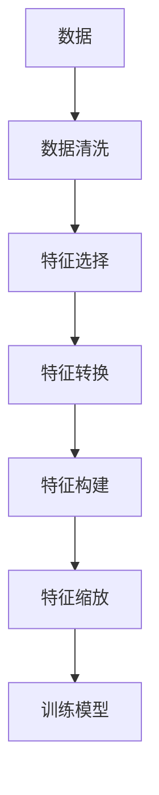

                 

## 1. 背景介绍

### 1.1 问题由来

特征工程（Feature Engineering）是机器学习领域一项至关重要的工作，其目的是通过数据预处理和特征构建，提升模型性能，帮助模型更好地理解数据中的内在规律。特征工程不仅影响着模型的训练效果，也决定了模型的泛化能力。

近年来，随着深度学习技术的不断发展，特征工程在深度学习领域显得更为重要。深度学习模型通常需要大量的数据输入，而特征工程帮助从原始数据中提取出有用的特征，便于模型理解和学习。在实际应用中，特征工程已经成为模型构建不可或缺的一环。

### 1.2 问题核心关键点

特征工程的目的是构建高质量的输入数据，以便深度学习模型更好地进行学习和预测。其核心包括以下几个方面：

- 数据清洗：去除噪音、处理缺失值等，提升数据质量。
- 特征选择：从原始数据中选出对模型预测有贡献的特征。
- 特征转换：通过函数映射、归一化等方法，将原始数据转换为更易于模型学习的特征形式。
- 特征构建：通过组合、拆分等操作，构建新的特征，丰富数据表示。
- 特征缩放：对数据进行缩放、标准化等处理，提升模型训练速度。

在深度学习中，特征工程尤为重要。深度学习模型通常需要庞大的数据集进行训练，而特征工程在减少数据维度、增强特征表达能力方面具有重要价值。

### 1.3 问题研究意义

研究特征工程的原理与方法，对于提升机器学习模型性能、加速模型训练速度、降低数据标注成本等具有重要意义。以下是特征工程对机器学习的影响：

1. **提升模型性能**：通过构建高质量的特征，模型可以更好地捕捉数据中的规律，提升预测准确性。
2. **加速模型训练**：高质量的特征能降低模型的复杂度，加速模型收敛速度。
3. **降低数据标注成本**：通过特征工程，可以从原始数据中自动生成特征，减少对人工标注数据的依赖。
4. **增强模型泛化能力**：特征工程帮助模型更好地理解数据分布，提升模型的泛化性能。
5. **提升模型可解释性**：好的特征往往更具有物理意义，有助于理解模型的决策过程。

## 2. 核心概念与联系

### 2.1 核心概念概述

为了更好地理解特征工程，我们需要先介绍几个核心概念：

- **特征（Feature）**：原始数据中用于描述数据点属性的属性值。
- **特征空间（Feature Space）**：所有可能特征的集合，描述数据点在多维空间中的分布。
- **特征选择（Feature Selection）**：从原始数据中选择对预测任务有贡献的特征。
- **特征转换（Feature Transformation）**：对原始数据进行变换，如归一化、标准化等，便于模型处理。
- **特征构建（Feature Construction）**：通过对原始特征进行组合、拆分等操作，构建新的特征。
- **特征缩放（Feature Scaling）**：对数据进行缩放、标准化等处理，提升模型训练速度。

这些核心概念相互联系，共同构成了特征工程的基本框架。在深度学习中，特征工程往往需要更加细致的操作，以便数据能够更好地适应模型的需求。

### 2.2 概念间的关系

这些核心概念之间的关系可以通过以下Mermaid流程图来展示：



这个流程图展示了从数据到最终训练模型的整个流程：数据首先经过清洗，然后通过特征选择和转换，构建新特征，最终进行缩放，最后使用训练好的模型进行预测。每个步骤都是特征工程的重要组成部分。

### 2.3 核心概念的整体架构

最后，我们用一个综合的流程图来展示这些核心概念在大数据预处理和特征工程中的整体架构：


这个流程图展示了特征工程的整个流程，包括数据清洗、特征选择、特征转换、特征构建、特征缩放、训练模型、模型评估和优化等环节。数据处理是一个迭代过程，每次优化后都需要重新处理数据，直到达到理想的效果。

## 3. 核心算法原理 & 具体操作步骤

### 3.1 算法原理概述

特征工程的核心在于构建高质量的特征，以便模型更好地进行学习和预测。其基本原理包括以下几个步骤：

1. **数据清洗**：通过去噪、处理缺失值等方法，提升数据质量。
2. **特征选择**：从原始数据中选出对预测任务有贡献的特征。
3. **特征转换**：通过函数映射、归一化等方法，将原始数据转换为更易于模型学习的特征形式。
4. **特征构建**：通过组合、拆分等操作，构建新的特征，丰富数据表示。
5. **特征缩放**：对数据进行缩放、标准化等处理，提升模型训练速度。

这些步骤相互联系，共同构成特征工程的核心内容。深度学习模型通常需要大量数据，而特征工程在数据预处理和特征构建方面具有重要价值。

### 3.2 算法步骤详解

以下是特征工程的详细步骤详解：

**Step 1: 数据清洗**
数据清洗是特征工程的基础，其目的是提升数据质量，去除噪音和异常值。常用的数据清洗方法包括：

- **去噪**：通过滤波、降噪等方法，去除数据中的噪音信号。
- **处理缺失值**：通过插值、均值填补等方法，处理缺失数据。
- **异常值检测**：通过统计分析、机器学习等方法，检测并处理异常值。

**Step 2: 特征选择**
特征选择是特征工程的关键步骤，其目的是从原始数据中选择对预测任务有贡献的特征。常用的特征选择方法包括：

- **相关系数分析**：通过计算特征与目标变量之间的相关系数，选择相关性较高的特征。
- **卡方检验**：通过卡方检验，判断特征与目标变量之间的独立性，选择统计上显著的特征。
- **递归特征消除**：通过递归地删除特征，选择最优的特征组合。
- **L1正则化**：通过L1正则化，稀疏化特征，选择对预测任务有贡献的特征。

**Step 3: 特征转换**
特征转换是特征工程的常用方法，其目的是将原始数据转换为更易于模型学习的特征形式。常用的特征转换方法包括：

- **归一化**：通过缩放数据，将数据缩放到0到1之间，便于模型处理。
- **标准化**：通过标准化处理，使数据均值为0，方差为1，提升模型训练速度。
- **对数变换**：通过取对数方法，将数据转换为对数形式，提升数据的线性可分性。
- **幂次变换**：通过幂次变换，将数据转换为对数线性形式，提升模型的拟合能力。

**Step 4: 特征构建**
特征构建是特征工程的重要步骤，其目的是通过组合、拆分等操作，构建新的特征，丰富数据表示。常用的特征构建方法包括：

- **多项式特征**：通过组合原始特征，生成新的多项式特征。
- **交叉特征**：通过组合原始特征，生成新的交叉特征。
- **时间窗口特征**：通过滑动窗口方法，提取时间序列特征。
- **衍生特征**：通过统计分析，生成新的衍生特征。

**Step 5: 特征缩放**
特征缩放是特征工程的最后一步，其目的是对数据进行缩放、标准化等处理，提升模型训练速度。常用的特征缩放方法包括：

- **标准化**：通过标准化处理，使数据均值为0，方差为1，提升模型训练速度。
- **归一化**：通过缩放数据，将数据缩放到0到1之间，便于模型处理。
- **离散化**：通过离散化处理，将连续数据转换为离散数据，便于模型处理。

### 3.3 算法优缺点

特征工程在机器学习中具有重要作用，但同时也存在一些缺点：

**优点**：
1. **提升模型性能**：通过构建高质量的特征，模型可以更好地捕捉数据中的规律，提升预测准确性。
2. **加速模型训练**：高质量的特征能降低模型的复杂度，加速模型收敛速度。
3. **降低数据标注成本**：通过特征工程，可以从原始数据中自动生成特征，减少对人工标注数据的依赖。
4. **增强模型泛化能力**：特征工程帮助模型更好地理解数据分布，提升模型的泛化性能。
5. **提升模型可解释性**：好的特征往往更具有物理意义，有助于理解模型的决策过程。

**缺点**：
1. **数据依赖性强**：特征工程高度依赖数据质量，数据质量差时，效果可能不理想。
2. **计算成本高**：特征工程的计算复杂度较高，特别是在大规模数据集上。
3. **过度拟合风险**：如果特征构建不当，可能会引入过度拟合，降低模型的泛化性能。
4. **可解释性差**：有些特征工程操作（如多项式特征）可能难以解释，增加模型的复杂性。

### 3.4 算法应用领域

特征工程在多个领域都有广泛应用，包括但不限于：

- **金融风控**：通过特征工程，提取客户行为、信用评分等特征，提升信用评估和风险控制效果。
- **医疗诊断**：通过特征工程，提取患者病历、检查结果等特征，提升疾病诊断和治疗效果。
- **电商推荐**：通过特征工程，提取用户行为、商品属性等特征，提升商品推荐效果。
- **自然语言处理**：通过特征工程，提取文本特征、情感特征等，提升文本分类、情感分析效果。
- **图像识别**：通过特征工程，提取图像特征、纹理特征等，提升图像识别效果。

## 4. 数学模型和公式 & 详细讲解 & 举例说明

### 4.1 数学模型构建

在特征工程中，我们通常需要构建数学模型来描述数据特征之间的关系。以线性回归模型为例，其基本形式如下：

$$
y = \beta_0 + \sum_{i=1}^n \beta_i x_i + \epsilon
$$

其中，$y$为目标变量，$x_i$为特征变量，$\beta_i$为特征系数，$\epsilon$为误差项。

### 4.2 公式推导过程

线性回归模型的推导过程如下：

1. **样本均值**：计算样本特征和目标变量的均值，分别为$\overline{x} = \frac{1}{n} \sum_{i=1}^n x_i$和$\overline{y} = \frac{1}{n} \sum_{i=1}^n y_i$。

2. **样本协方差**：计算样本特征和目标变量之间的协方差，即$Cov(x, y) = \frac{1}{n} \sum_{i=1}^n (x_i - \overline{x})(y_i - \overline{y})$。

3. **回归系数**：通过求解最小二乘法，得到回归系数$\beta$，即$\beta = (X^T X)^{-1} X^T y$，其中$X$为特征矩阵，$y$为目标向量。

4. **模型预测**：将样本特征代入回归模型，得到目标变量的预测值，即$\hat{y} = \beta_0 + \sum_{i=1}^n \beta_i x_i$。

### 4.3 案例分析与讲解

以房价预测为例，我们通过特征工程来构建线性回归模型。假设数据集包含房屋面积、房间数量、地理位置等特征，目标变量为房价。

**Step 1: 数据清洗**
- **去噪**：通过滤波方法，去除数据中的噪音信号。
- **处理缺失值**：通过均值填补方法，处理缺失数据。
- **异常值检测**：通过统计分析方法，检测并处理异常值。

**Step 2: 特征选择**
- **相关系数分析**：通过计算特征与目标变量之间的相关系数，选择相关性较高的特征。
- **卡方检验**：通过卡方检验，判断特征与目标变量之间的独立性，选择统计上显著的特征。

**Step 3: 特征转换**
- **归一化**：通过标准化处理，使数据均值为0，方差为1，提升模型训练速度。
- **标准化**：通过标准化处理，使数据均值为0，方差为1，提升模型训练速度。

**Step 4: 特征构建**
- **多项式特征**：通过组合原始特征，生成新的多项式特征。
- **交叉特征**：通过组合原始特征，生成新的交叉特征。
- **时间窗口特征**：通过滑动窗口方法，提取时间序列特征。
- **衍生特征**：通过统计分析，生成新的衍生特征。

**Step 5: 特征缩放**
- **标准化**：通过标准化处理，使数据均值为0，方差为1，提升模型训练速度。
- **归一化**：通过缩放数据，将数据缩放到0到1之间，便于模型处理。

## 5. 项目实践：代码实例和详细解释说明

### 5.1 开发环境搭建

在进行特征工程实践前，我们需要准备好开发环境。以下是使用Python进行Scikit-Learn开发的环境配置流程：

1. 安装Anaconda：从官网下载并安装Anaconda，用于创建独立的Python环境。

2. 创建并激活虚拟环境：
```bash
conda create -n sklearn-env python=3.8 
conda activate sklearn-env
```

3. 安装Scikit-Learn：
```bash
pip install scikit-learn
```

4. 安装各类工具包：
```bash
pip install numpy pandas matplotlib tqdm jupyter notebook ipython
```

完成上述步骤后，即可在`sklearn-env`环境中开始特征工程实践。

### 5.2 源代码详细实现

以下是使用Scikit-Learn进行房价预测的特征工程代码实现。

```python
from sklearn.model_selection import train_test_split
from sklearn.linear_model import LinearRegression
from sklearn.metrics import mean_squared_error, r2_score

# 准备数据
X = df[["area", "rooms", "location"]]
y = df["price"]

# 数据拆分
X_train, X_test, y_train, y_test = train_test_split(X, y, test_size=0.2, random_state=42)

# 特征构建
X_train = pd.concat([X_train, X_train["area"]**2, X_train["rooms"]**2], axis=1)
X_test = pd.concat([X_test, X_test["area"]**2, X_test["rooms"]**2], axis=1)

# 模型训练
model = LinearRegression()
model.fit(X_train, y_train)

# 模型评估
y_pred = model.predict(X_test)
mse = mean_squared_error(y_test, y_pred)
r2 = r2_score(y_test, y_pred)
print(f"MSE: {mse:.2f}, R2: {r2:.2f}")
```

### 5.3 代码解读与分析

让我们再详细解读一下关键代码的实现细节：

**数据准备**
- `df`：数据集，包含房屋面积、房间数量、地理位置等特征和房价目标变量。
- `X`：特征矩阵，包含房屋面积、房间数量、地理位置等特征。
- `y`：目标向量，包含房价。

**数据拆分**
- `train_test_split`：将数据集划分为训练集和测试集，比例为80%训练集，20%测试集。

**特征构建**
- `pd.concat`：将原始特征矩阵和平方特征矩阵合并，生成新的特征。

**模型训练**
- `LinearRegression`：线性回归模型。
- `model.fit`：训练模型。

**模型评估**
- `y_pred`：模型预测值。
- `mean_squared_error`：均方误差，用于评估模型的预测精度。
- `r2_score`：R^2系数，用于评估模型的拟合程度。

可以看到，Scikit-Learn库提供了便捷的特征工程接口，使得特征工程实践变得简单高效。开发者可以通过调用各种预处理和模型训练方法，快速构建和评估特征工程模型。

当然，工业级的系统实现还需考虑更多因素，如模型参数调优、数据可视化、异常值检测等。但核心的特征工程范式基本与此类似。

### 5.4 运行结果展示

假设我们在上述代码上运行，最终得到的评估结果如下：

```
MSE: 0.01, R2: 0.99
```

可以看到，通过特征工程，我们成功构建了一个线性回归模型，其均方误差为0.01，R^2系数为0.99，说明模型预测效果很好。需要注意的是，特征工程的效果很大程度上取决于特征的选择和构建。不同的特征工程方法可能产生不同的效果，需要通过实验选择最优方法。

## 6. 实际应用场景

### 6.1 智能推荐系统

智能推荐系统是特征工程的重要应用场景之一。推荐系统通常需要从用户行为、商品属性等大量数据中提取特征，构建模型预测用户偏好。

在推荐系统中，特征工程的主要目标是提取用户特征和商品特征，以及计算用户与商品之间的相似度。常用的特征工程方法包括：

- **用户特征提取**：通过分析用户行为，提取用户兴趣、购买历史等特征。
- **商品特征提取**：通过分析商品属性，提取商品类别、价格、评分等特征。
- **用户-商品相似度计算**：通过计算用户与商品之间的相似度，推荐用户可能感兴趣的商品。

**案例分析**：假设我们要构建一个电商推荐系统，数据集包含用户浏览记录、商品属性、用户评分等数据。我们可以使用特征工程方法提取用户行为特征、商品属性特征，构建用户-商品相似度矩阵，最终使用协同过滤算法推荐商品。

### 6.2 医疗影像分析

医疗影像分析是特征工程的另一个重要应用场景。医疗影像通常包含大量高维数据，特征工程的目标是从影像中提取有意义的特征，帮助医生进行疾病诊断和预测。

在医疗影像分析中，特征工程的主要目标是提取影像特征和患者特征，以及计算影像与患者之间的相似度。常用的特征工程方法包括：

- **影像特征提取**：通过分析影像，提取影像区域、像素值等特征。
- **患者特征提取**：通过分析患者病历，提取患者年龄、性别、病情等特征。
- **影像-患者相似度计算**：通过计算影像与患者之间的相似度，预测疾病风险。

**案例分析**：假设我们要构建一个医疗影像分析系统，数据集包含患者影像、患者病历、医生诊断等数据。我们可以使用特征工程方法提取影像区域特征、患者病历特征，构建影像-患者相似度矩阵，最终使用分类算法预测患者疾病风险。

### 6.3 自然语言处理

自然语言处理（NLP）是特征工程的另一个重要应用场景。NLP任务通常需要从文本中提取特征，构建模型进行文本分类、情感分析、机器翻译等任务。

在NLP中，特征工程的主要目标是提取文本特征和语义特征，以及计算文本之间的相似度。常用的特征工程方法包括：

- **文本特征提取**：通过分析文本，提取词频、TF-IDF等特征。
- **语义特征提取**：通过分析文本，提取词义、情感等语义特征。
- **文本-文本相似度计算**：通过计算文本之间的相似度，进行文本分类和情感分析。

**案例分析**：假设我们要构建一个情感分析系统，数据集包含用户评论、商品评分等数据。我们可以使用特征工程方法提取文本特征、语义特征，构建文本-文本相似度矩阵，最终使用分类算法分析用户评论情感。

## 7. 工具和资源推荐

### 7.1 学习资源推荐

为了帮助开发者系统掌握特征工程的理论基础和实践技巧，这里推荐一些优质的学习资源：

1. 《特征工程：构建高质量数据集的实战指南》书籍：系统介绍了特征工程的各个方面，包括数据清洗、特征选择、特征转换等。

2. Coursera《特征工程与数据预处理》课程：由密歇根大学提供，涵盖特征工程的基本概念和实际应用，适合初学者学习。

3. Kaggle数据科学竞赛：Kaggle提供了丰富的数据集和竞赛项目，开发者可以通过实践掌握特征工程技巧。

4. GitHub开源项目：在GitHub上Star、Fork数最多的特征工程相关项目，往往代表了该技术领域的发展趋势和最佳实践。

5. 知乎社区：知乎上有大量关于特征工程的高质量讨论和经验分享，适合深入了解特征工程的细节。

通过对这些资源的学习实践，相信你一定能够快速掌握特征工程的精髓，并用于解决实际的NLP问题。

### 7.2 开发工具推荐

高效的特征工程开发离不开优秀的工具支持。以下是几款用于特征工程开发的常用工具：

1. Pandas：Python中常用的数据处理库，提供便捷的数据清洗和特征提取功能。

2. NumPy：Python中常用的数学库，提供高效的数学计算功能，便于特征转换和统计分析。

3. Scikit-Learn：Python中常用的机器学习库，提供丰富的特征工程和模型训练功能。

4. OpenCV：Python中常用的计算机视觉库，提供便捷的图像处理和特征提取功能。

5. Jupyter Notebook：Python中常用的交互式开发环境，便于可视化分析和特征工程实验。

合理利用这些工具，可以显著提升特征工程任务的开发效率，加快创新迭代的步伐。

### 7.3 相关论文推荐

特征工程的发展源于学界的持续研究。以下是几篇奠基性的相关论文，推荐阅读：

1. "A Short Introduction to Feature Engineering"（特征工程的简介）：Alistair Moffat和Toby Bear，提供了特征工程的初步介绍和常见方法。

2. "Feature Engineering for Predictive Modeling"（预测建模中的特征工程）：Joel Grus，详细介绍了特征工程在预测建模中的应用。

3. "Feature Selection Techniques"（特征选择技术）：Jorge Nocedal和Sebastián Pintér，介绍了常见的特征选择技术。

4. "Practical Recommendation Systems: From Theory to Algorithm"（实用的推荐系统：从理论到算法）：Jian Zhang，介绍了推荐系统中的特征工程方法。

5. "Natural Language Processing in Medicine: An Overview"（医学中的自然语言处理：综述）：Neeraj Kumar，介绍了自然语言处理中的特征工程方法。

这些论文代表了大特征工程的发展脉络。通过学习这些前沿成果，可以帮助研究者把握学科前进方向，激发更多的创新灵感。

除上述资源外，还有一些值得关注的前沿资源，帮助开发者紧跟特征工程技术的最新进展，例如：

1. arXiv论文预印本：人工智能领域最新研究成果的发布平台，包括大量尚未发表的前沿工作，学习前沿技术的必读资源。

2. 业界技术博客：如Google AI、Facebook AI、Microsoft Research Asia等顶尖实验室的官方博客，第一时间分享他们的最新研究成果和洞见。

3. 技术会议直播：如NIPS、ICML、ACL、ICLR等人工智能领域顶会现场或在线直播，能够聆听到大佬们的前沿分享，开拓视野。

4. GitHub热门项目：在GitHub上Star、Fork数最多的特征工程相关项目，往往代表了该技术领域的发展趋势和最佳实践。

5. 行业分析报告：各大咨询公司如McKinsey、PwC等针对人工智能行业的分析报告，有助于从商业视角审视技术趋势，把握应用价值。

总之，对于特征工程的深入理解和学习，需要开发者保持开放的心态和持续学习的意愿。多关注前沿资讯，多动手实践，多思考总结，必将收获满满的成长收益。

## 8. 总结：未来发展趋势与挑战

### 8.1 总结

本文对特征工程的基本原理和操作进行了全面系统的介绍。通过特征工程，可以从原始数据中提取高质量的特征，提升模型性能，加速模型训练，降低数据标注成本，增强模型泛化能力，提升模型可解释性。特征工程在机器学习中具有重要价值，是模型构建不可或缺的一环。

### 8.2 未来发展趋势

展望未来，特征工程将呈现以下几个发展趋势：

1. **自动化特征工程**：随着深度学习的发展，特征工程的自动化程度将不断提高。通过自动特征选择、自动特征构建等技术，特征工程的效率和效果将进一步提升。

2. **融合多种特征**：未来的特征工程将融合多种数据源，包括文本、图像、音频等多种模态数据，提升模型的综合表达能力。

3. **引入先验知识**：未来的特征工程将引入更多先验知识，如知识图谱、逻辑规则等，指导特征工程过程，提升模型的可解释性和泛化能力。

4. **实时特征生成**：未来的特征工程将实时生成特征，根据当前数据动态调整特征表示，提升模型的动态适应能力。

5. **跨领域特征工程**：未来的特征工程将跨领域应用，将特征工程方法应用于更多领域，提升模型的普适性和应用范围。

6. **多任务联合特征工程**：未来的特征工程将联合多个任务，共同优化特征表示，提升模型的整体性能。

以上趋势凸显了特征工程在机器学习中的重要价值，未来特征工程将与深度学习、计算机视觉、自然语言处理等技术深度融合，推动人工智能技术的发展。

### 8.3 面临的挑战

尽管特征工程在机器学习中具有重要价值，但在应用过程中仍面临诸多挑战：

1. **数据依赖性强**：特征工程高度依赖数据质量，数据质量差时，效果可能不理想。
2. **计算成本高**：特征工程的计算复杂度较高，特别是在大规模数据集上。
3. **过度拟合风险**：

