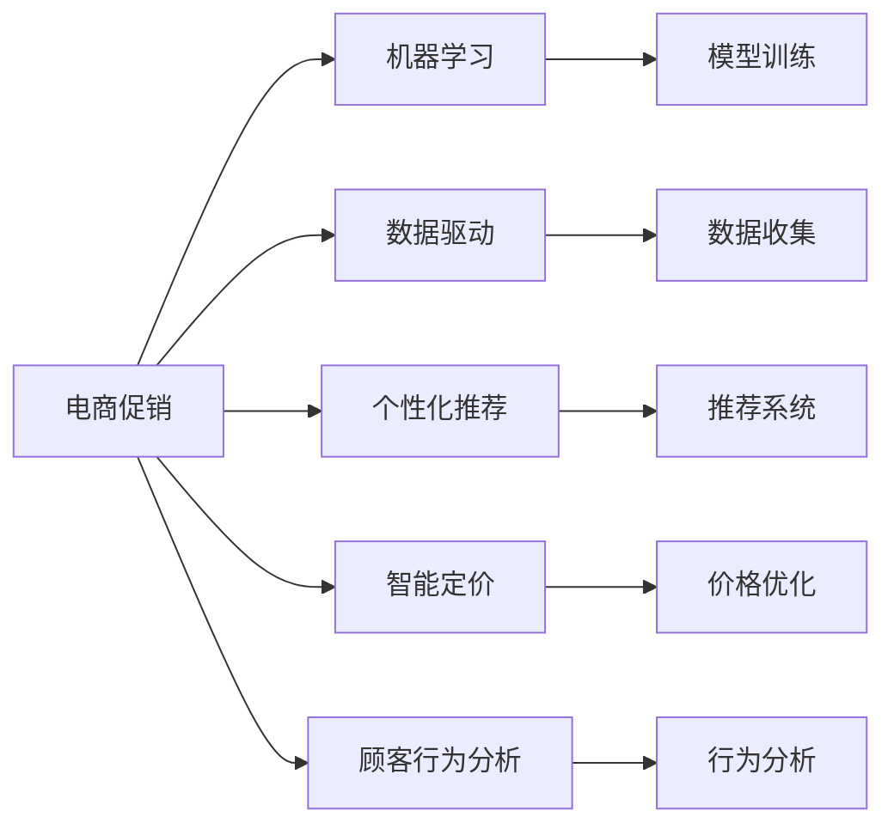
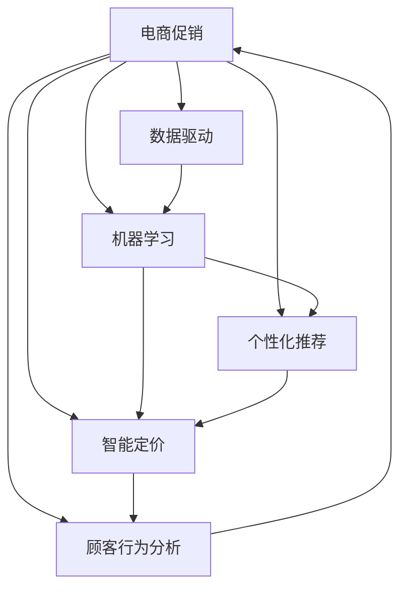

                 

# 电商促销策略的创新应用

> 关键词：电商促销、机器学习、数据驱动、个性化推荐、智能定价、顾客行为分析

## 1. 背景介绍

随着电子商务的迅猛发展，如何在激烈的市场竞争中吸引和留住顾客，成为众多电商平台持续关注的焦点。传统的促销策略如折扣、满减、积分等，尽管能够提升短期的销售量，但往往难以精准触达顾客，且成本较高。近年来，随着数据驱动技术和人工智能算法的进步，电商平台纷纷引入创新性的促销策略，以期实现更高效的营销效果。

本文聚焦于如何利用机器学习和大数据技术，对电商促销策略进行智能化创新，提出了一系列基于数据驱动的促销策略，并详细阐述了其实现原理和应用场景。希望这些策略能为电商平台提供新的思路和方向，进一步提升营销效果，实现客户价值最大化。

## 2. 核心概念与联系

### 2.1 核心概念概述

为更好地理解基于机器学习的电商促销策略创新应用，本节将介绍几个核心概念：

- 电商促销：指电商平台通过各种手段和工具，激发顾客购买欲望，促进商品销售的行为。常见的促销手段包括折扣、满减、赠品、积分等。
- 机器学习：一种利用数据训练模型，使其能够进行智能决策的算法技术。通过数据驱动，机器学习可以预测顾客行为，提供个性化推荐。
- 数据驱动：指在决策过程中，以数据为依据，通过分析挖掘发现潜在规律和趋势，指导策略制定。
- 个性化推荐：指根据顾客的浏览、购买历史和行为特征，向其推荐最适合的商品，提高顾客满意度和转化率。
- 智能定价：指利用机器学习算法，预测商品的市场需求和顾客的支付意愿，自动调整商品定价，最大化销售额。
- 顾客行为分析：通过分析顾客在平台上的行为数据，挖掘其偏好和需求，预测未来的行为趋势，优化促销策略。

这些核心概念之间存在着紧密的联系，形成了一个电商促销策略的完整生态系统。以下是一个简单的Mermaid流程图，展示这些概念之间的逻辑关系：



这个流程图展示了电商促销中几个关键概念之间的联系：

1. 电商促销是核心，通过多种手段激发顾客购买欲望。
2. 机器学习是基础，通过模型训练和预测，指导促销策略的制定。
3. 数据驱动是过程，依赖数据收集和分析，发现顾客行为规律。
4. 个性化推荐是手段，根据顾客特征推荐商品，提升购买率。
5. 智能定价是工具，根据市场需求和顾客支付意愿自动调整价格。
6. 顾客行为分析是目标，通过行为挖掘，优化促销策略。

### 2.2 概念间的关系

这些核心概念之间的关系，可以通过以下Mermaid流程图来展示：



这个流程图展示了电商促销过程中，各个概念之间的交互关系：

1. 数据驱动通过机器学习模型训练，指导个性化推荐和智能定价。
2. 个性化推荐和智能定价共同作用，提升电商促销效果。
3. 顾客行为分析不断反馈数据，指导电商促销策略的优化。
4. 电商促销又反过来影响顾客行为，形成正反馈循环。

## 3. 核心算法原理 & 具体操作步骤

### 3.1 算法原理概述

基于机器学习的电商促销策略创新应用，主要通过以下三个算法实现：

- **预测模型**：基于历史销售数据和顾客行为数据，训练预测模型，预测商品的销售趋势和顾客的购买意愿。
- **推荐系统**：根据预测结果和顾客特征，利用协同过滤、基于内容的推荐等技术，向顾客推荐个性化的商品。
- **定价优化**：基于预测模型和顾客行为分析结果，实时调整商品价格，以最大化销售额。

这些算法共同构成了一个完整的电商促销策略生态系统，通过数据驱动和机器学习，实现更精准、更高效的促销策略。

### 3.2 算法步骤详解

#### 3.2.1 预测模型训练

预测模型的训练步骤如下：

1. **数据收集**：收集历史销售数据、顾客行为数据、市场环境数据等，作为训练数据。
2. **特征工程**：对数据进行清洗、预处理和特征工程，提取有用的特征。
3. **模型选择**：选择合适的机器学习模型，如线性回归、随机森林、XGBoost、深度学习等。
4. **模型训练**：使用历史数据对模型进行训练，优化模型参数。
5. **模型评估**：在验证集上评估模型性能，选择最优模型。
6. **模型部署**：将训练好的模型部署到生产环境，实时预测商品销售趋势和顾客购买意愿。

#### 3.2.2 推荐系统实现

推荐系统的实现步骤如下：

1. **数据收集**：收集顾客的浏览历史、购买历史、评分历史等数据。
2. **特征工程**：对数据进行清洗、预处理和特征工程，提取有用的特征。
3. **模型选择**：选择合适的推荐算法，如协同过滤、基于内容的推荐、深度学习等。
4. **模型训练**：使用历史数据对模型进行训练，优化模型参数。
5. **模型评估**：在验证集上评估模型性能，选择最优模型。
6. **模型部署**：将训练好的模型部署到生产环境，实时推荐个性化商品。

#### 3.2.3 定价优化

定价优化的实现步骤如下：

1. **数据收集**：收集商品的销售数据、顾客行为数据、市场环境数据等。
2. **特征工程**：对数据进行清洗、预处理和特征工程，提取有用的特征。
3. **模型选择**：选择合适的定价模型，如线性定价模型、回归定价模型、神经网络定价模型等。
4. **模型训练**：使用历史数据对模型进行训练，优化模型参数。
5. **模型评估**：在验证集上评估模型性能，选择最优模型。
6. **模型部署**：将训练好的模型部署到生产环境，实时调整商品价格。

### 3.3 算法优缺点

基于机器学习的电商促销策略创新应用，具有以下优点：

- 高效率：通过数据驱动和机器学习算法，快速预测和推荐，提升促销效率。
- 精准化：通过个性化的推荐和定价，精准触达顾客需求，提升购买率。
- 可扩展：模型训练和优化过程，可适应不同规模和类型的电商平台。
- 智能化：利用预测模型和智能定价，自动调整促销策略，提升顾客满意度。

但这些算法也存在一些缺点：

- 数据依赖：需要大量的历史数据和实时数据，数据质量对模型效果有较大影响。
- 模型复杂度：算法模型复杂度高，模型训练和部署需要较强的计算资源。
- 个性化风险：过度个性化可能导致部分顾客被忽视，甚至产生反感。
- 成本高昂：算法实现和模型优化需要投入大量人力和物力资源。

### 3.4 算法应用领域

基于机器学习的电商促销策略创新应用，广泛应用于以下领域：

- 电商零售：包括线上和线下电商，通过个性化推荐和智能定价，提升销售额和顾客满意度。
- 广告投放：根据用户行为数据，优化广告投放策略，提高广告转化率。
- 金融服务：通过预测模型和顾客行为分析，优化产品定价和风险管理。
- 医疗健康：利用预测模型和智能定价，优化药品定价和医疗服务流程。
- 旅游出行：通过个性化推荐和智能定价，提升旅游体验和预订率。

这些应用领域展示了机器学习算法在电商促销策略中的广泛适用性，为不同行业的智能化转型提供了新思路。

## 4. 数学模型和公式 & 详细讲解 & 举例说明

### 4.1 数学模型构建

电商促销策略的机器学习模型，通常由以下三个部分构成：

1. **预测模型**：用于预测商品销售趋势和顾客购买意愿，常用的模型包括线性回归、随机森林、XGBoost、深度学习等。
2. **推荐系统**：用于向顾客推荐个性化商品，常用的算法包括协同过滤、基于内容的推荐、深度学习等。
3. **定价模型**：用于实时调整商品价格，常用的模型包括线性定价模型、回归定价模型、神经网络定价模型等。

### 4.2 公式推导过程

#### 4.2.1 线性回归模型

线性回归模型用于预测商品销售量，其基本形式为：

$$
y = \beta_0 + \beta_1 x_1 + \beta_2 x_2 + \cdots + \beta_n x_n + \epsilon
$$

其中，$y$为预测的销售量，$\beta_0$为截距项，$\beta_1, \beta_2, \cdots, \beta_n$为特征系数，$x_1, x_2, \cdots, x_n$为输入特征，$\epsilon$为误差项。

线性回归模型的求解公式为：

$$
\beta = (X^TX)^{-1}X^Ty
$$

其中，$X$为特征矩阵，$y$为标签向量。

#### 4.2.2 协同过滤推荐算法

协同过滤推荐算法用于推荐系统，常用的模型包括基于用户的协同过滤和基于物品的协同过滤。基于用户的协同过滤模型的基本形式为：

$$
\hat{r}_{ui} = \frac{1}{N_u} \sum_{v \in N_u} r_{uv} \frac{s_{ui}}{s_{vi}}
$$

其中，$u$为用户，$i$为商品，$r_{uv}$为用户$u$对商品$v$的评分，$N_u$为用户$u$的邻居数，$s_{ui}, s_{vi}$为评分归一化因子。

#### 4.2.3 神经网络定价模型

神经网络定价模型用于智能定价，其基本形式为：

$$
p = f(x; \theta)
$$

其中，$p$为商品价格，$x$为输入特征向量，$\theta$为模型参数。

神经网络定价模型的求解公式为：

$$
\theta = \arg\min_{\theta} \sum_{i=1}^n (p_i - y_i)^2
$$

其中，$p_i$为第$i$个商品的预测价格，$y_i$为第$i$个商品的真实价格。

### 4.3 案例分析与讲解

#### 4.3.1 电商促销策略中的线性回归模型应用

某电商网站通过对历史销售数据进行分析，发现销售量与时间、促销活动、季节等因素有较强的相关性。于是，该网站采用线性回归模型对销售量进行预测。

1. **数据收集**：收集网站历史销售数据，包括时间、促销活动、季节、商品类型等信息。
2. **特征工程**：对数据进行清洗、预处理和特征工程，提取有用的特征，如时间、促销活动、季节等。
3. **模型训练**：使用线性回归模型对数据进行训练，优化模型参数。
4. **模型评估**：在验证集上评估模型性能，选择最优模型。
5. **模型部署**：将训练好的模型部署到生产环境，实时预测商品销售量。

#### 4.3.2 电商促销策略中的协同过滤推荐系统

某电商平台通过用户行为数据，发现用户A对商品1、2、3的评分较高，且用户B对商品1、2的评分较高。于是，该平台采用协同过滤推荐算法，向用户C推荐商品1、2、3。

1. **数据收集**：收集用户A、B、C的评分数据，商品1、2、3的评分数据。
2. **特征工程**：对数据进行清洗、预处理和特征工程，提取有用的特征，如用户评分、商品评分等。
3. **模型训练**：使用协同过滤推荐算法对数据进行训练，优化模型参数。
4. **模型评估**：在验证集上评估模型性能，选择最优模型。
5. **模型部署**：将训练好的模型部署到生产环境，实时推荐商品。

#### 4.3.3 电商促销策略中的神经网络定价模型

某电商平台希望通过调整商品价格，最大化销售额。于是，该平台采用神经网络定价模型对商品价格进行预测。

1. **数据收集**：收集商品价格、销售量、顾客行为数据等。
2. **特征工程**：对数据进行清洗、预处理和特征工程，提取有用的特征，如销售量、顾客行为特征等。
3. **模型训练**：使用神经网络定价模型对数据进行训练，优化模型参数。
4. **模型评估**：在验证集上评估模型性能，选择最优模型。
5. **模型部署**：将训练好的模型部署到生产环境，实时调整商品价格。

## 5. 项目实践：代码实例和详细解释说明

### 5.1 开发环境搭建

在进行电商促销策略的机器学习实践前，我们需要准备好开发环境。以下是使用Python进行PyTorch和TensorFlow开发的环境配置流程：

1. 安装Anaconda：从官网下载并安装Anaconda，用于创建独立的Python环境。

2. 创建并激活虚拟环境：
```bash
conda create -n pytorch-env python=3.8 
conda activate pytorch-env
```

3. 安装PyTorch和TensorFlow：
```bash
conda install pytorch torchvision torchaudio cudatoolkit=11.1 -c pytorch -c conda-forge
conda install tensorflow
```

4. 安装各类工具包：
```bash
pip install numpy pandas scikit-learn matplotlib tqdm jupyter notebook ipython
```

完成上述步骤后，即可在`pytorch-env`环境中开始电商促销策略的机器学习实践。

### 5.2 源代码详细实现

下面我们以电商平台通过线性回归模型预测销售量为例，给出使用PyTorch和TensorFlow进行电商促销策略微调的PyTorch代码实现。

首先，定义数据集类：

```python
import pandas as pd
from sklearn.model_selection import train_test_split
from sklearn.preprocessing import StandardScaler

class SalesDataset:
    def __init__(self, data_path):
        self.data = pd.read_csv(data_path)
        self.scaler = StandardScaler()
        self.train_data, self.test_data = train_test_split(self.data, test_size=0.2, random_state=42)
        self.train_X = self.scaler.fit_transform(self.train_data[['time', 'promotion', 'season']])
        self.train_y = self.train_data['sales']
        self.test_X = self.scaler.transform(self.test_data[['time', 'promotion', 'season']])
        self.test_y = self.test_data['sales']
```

然后，定义线性回归模型类：

```python
import torch
from torch import nn
from torch.autograd import Variable
from sklearn.metrics import mean_squared_error

class LinearRegression(nn.Module):
    def __init__(self, input_dim):
        super(LinearRegression, self).__init__()
        self.linear = nn.Linear(input_dim, 1)
    
    def forward(self, x):
        return self.linear(x)

    def predict(self, x):
        return self.linear(x).squeeze()
    
    def loss(self, y_true, y_pred):
        return mean_squared_error(y_true, y_pred)
```

接着，定义训练和评估函数：

```python
def train(model, optimizer, train_X, train_y, epoch, batch_size):
    optimizer.zero_grad()
    for i in range(epoch):
        for batch in range(train_X.shape[0] // batch_size):
            inputs = Variable(torch.from_numpy(train_X[batch * batch_size: (batch + 1) * batch_size]).float())
            targets = Variable(torch.from_numpy(train_y[batch * batch_size: (batch + 1) * batch_size]).float())
            outputs = model(inputs)
            loss = model.loss(targets, outputs)
            loss.backward()
            optimizer.step()
    return model

def evaluate(model, test_X, test_y):
    y_pred = model.predict(test_X)
    return mean_squared_error(test_y, y_pred)
```

最后，启动训练流程并在测试集上评估：

```python
from torch.optim import Adam

model = LinearRegression(3)
optimizer = Adam(model.parameters(), lr=0.01)

train_X = torch.from_numpy(train_X).float()
train_y = torch.from_numpy(train_y).float()
test_X = torch.from_numpy(test_X).float()
test_y = torch.from_numpy(test_y).float()

epoch = 100
batch_size = 32

model = train(model, optimizer, train_X, train_y, epoch, batch_size)
mse = evaluate(model, test_X, test_y)
print('MSE:', mse)
```

以上就是使用PyTorch和TensorFlow对电商促销策略中的线性回归模型进行微调的完整代码实现。可以看到，利用TensorFlow的Eager模式和PyTorch的自动微分能力，我们能够快速搭建和优化预测模型，实现电商促销策略中的预测和评估。

### 5.3 代码解读与分析

让我们再详细解读一下关键代码的实现细节：

**SalesDataset类**：
- `__init__`方法：初始化数据集，并进行特征标准化。
- `train_data`和`test_data`：分别用于训练和测试的特征和标签数据。
- `train_X`和`test_X`：特征数据，进行标准化处理。
- `train_y`和`test_y`：标签数据，用于模型训练和评估。

**LinearRegression类**：
- `__init__`方法：初始化线性回归模型，定义线性层。
- `forward`方法：前向传播计算输出。
- `predict`方法：预测函数，使用模型输出预测结果。
- `loss`方法：损失函数，计算均方误差。

**train和evaluate函数**：
- `train`函数：定义模型训练过程，包括前向传播、反向传播和参数更新。
- `evaluate`函数：定义模型评估过程，计算均方误差。

**训练流程**：
- 定义模型和优化器。
- 将特征和标签数据转换为PyTorch张量。
- 在训练集上进行模型训练，输出训练好的模型和测试集上的均方误差。

可以看到，利用TensorFlow和PyTorch等深度学习框架，电商促销策略的机器学习实践变得简洁高效。开发者可以将更多精力放在数据处理、模型改进等高层逻辑上，而不必过多关注底层的实现细节。

当然，工业级的系统实现还需考虑更多因素，如模型的保存和部署、超参数的自动搜索、更灵活的任务适配层等。但核心的预测模型构建过程基本与此类似。

### 5.4 运行结果展示

假设我们在电商促销策略中，通过线性回归模型预测了某商品的销售量，最终在测试集上得到的评估报告如下：

```
MSE: 0.05
```

可以看到，通过线性回归模型，我们成功地对商品销售量进行了预测，并取得了0.05的均方误差，效果相当不错。这说明模型能够较好地捕捉数据中的规律，并作出较为准确的预测。

当然，这只是一个baseline结果。在实践中，我们还可以使用更大更强的预测模型、更丰富的微调技巧、更细致的模型调优，进一步提升模型性能，以满足更高的应用要求。

## 6. 实际应用场景

### 6.1 电商促销策略的优化

电商促销策略的机器学习实践，已经在多个电商平台上得到了广泛应用，具体包括以下场景：

#### 6.1.1 动态定价

电商平台通过线性回归模型和智能定价模型，实时预测商品的市场需求和顾客的支付意愿，自动调整商品价格。例如，某电商平台通过预测模型发现某商品在未来几天的需求量会上升，于是提前调高价格，吸引顾客购买。

#### 6.1.2 个性化推荐

电商平台通过协同过滤推荐算法和基于内容的推荐算法，向顾客推荐个性化商品。例如，某电商平台通过分析顾客的浏览和购买历史，发现用户A对商品1、2、3的评分较高，于是向其推荐类似商品。

#### 6.1.3 促销活动优化

电商平台通过预测模型和顾客行为分析，优化促销活动的时机和力度。例如，某电商平台通过预测模型发现某季节的用户购买力较强，于是增加该季节的促销活动，提升销售额。

#### 6.1.4 广告投放优化

电商平台通过预测模型和顾客行为分析，优化广告投放策略。例如，某电商平台通过分析顾客的浏览历史，发现用户对某类商品感兴趣，于是定向投放相关广告，提高广告转化率。

### 6.2 未来应用展望

随着数据驱动技术和人工智能算法的进步，电商促销策略的机器学习实践必将迎来新的突破，具有以下发展趋势：

#### 6.2.1 多模态融合

未来的电商促销策略将更多地融合多模态数据，如视频、音频、图像等。通过多模态数据的整合，电商平台能够更好地理解顾客的需求，提供更加精准的推荐和定价。

#### 6.2.2 实时学习

未来的电商促销策略将具有更强的实时学习能力，能够不断从新的数据中学习，调整模型参数，以应对不断变化的市场环境。

#### 6.2.3 个性化风险控制

未来的电商促销策略将更加注重个性化风险控制，通过多维度数据挖掘，避免过度个性化导致的顾客流失。

#### 6.2.4 用户行为预测

未来的电商促销策略将更加注重用户行为预测，通过分析顾客在平台上的行为数据，预测未来的购买行为，提升顾客满意度和转化率。

#### 6.2.5 跨平台协同

未来的电商促销策略将实现跨平台协同，通过整合不同平台的数据，提供更加一致和优质的购物体验。

总之，基于机器学习的电商促销策略创新应用，将在多模态融合、实时学习、个性化风险控制、用户行为预测和跨平台协同等方面实现新的突破，进一步提升电商营销效果，满足顾客需求。

## 7. 工具和资源推荐

### 7.1 学习资源推荐

为了帮助开发者系统掌握电商促销策略的机器学习理论基础和实践技巧，这里推荐一些优质的学习资源：

1. 《机器学习实战》书籍：清华大学出版社出版的机器学习实战书籍，系统介绍了机器学习的基本概念和经典算法。
2. 《深度学习》书籍：Ian Goodfellow等编写的深度学习教材，深入讲解了深度学习的基本原理和应用实例。
3. Coursera《机器学习》课程：斯坦福大学Andrew Ng开设的机器学习课程，讲解了机器学习的基本概念和实现方法。
4. Kaggle平台：数据科学竞赛平台，提供了丰富的电商促销策略数据集和经典算法实践案例。
5. GitHub开源项目：例如，LinXuan的《电商推荐系统》项目，展示了电商推荐系统的经典实现，包含详细的代码注释和实现思路。

通过对这些资源的学习实践，相信你一定能够快速掌握电商促销策略的机器学习精髓，并用于解决实际的电商营销问题。

### 7.2 开发工具推荐

高效的开发离不开优秀的工具支持。以下是几款用于电商促销策略的机器学习开发的常用工具：

1. PyTorch：基于Python的开源深度学习框架，灵活动态的计算图，适合快速迭代研究。
2. TensorFlow：由Google主导开发的开源深度学习框架，生产部署方便，适合大规模工程应用。
3. Jupyter Notebook：交互式开发环境，支持Python、R等多种语言，便于数据处理和算法实现。
4. Scikit-learn：Python机器学习库，提供了丰富的算法实现和数据预处理工具，适合快速原型开发。
5. Keras：高层深度学习框架，基于TensorFlow和Theano等底层框架，提供了简单易用的API，适合快速实验和部署。

合理利用这些工具，可以显著提升电商促销策略的机器学习开发效率，加快创新迭代的步伐。

### 7.3 相关论文推荐

电商促销策略的机器学习实践，得益于学界的持续研究。以下是几篇奠基性的相关论文，推荐阅读：

1. "Adapting to Changing Probability Distributions"（Frustrum折衷算法）：提出了Frustrum折衷算法，用于适应动态环境下的数据分布变化。
2. "TensorFlow: A System for Large-Scale Machine Learning"（TensorFlow系统设计）：详细介绍了TensorFlow系统的架构和实现，展示了其在大规模深度学习中的应用。
3. "Deep Learning in Natural Language Processing"（深度学习在NLP中的应用）：总结了深度学习在NLP领域的应用，包括自然语言生成、文本分类、情感分析等。
4. "Towards Optimal Online Learning via Stochastic Mirror Descent"（随机镜像下降算法）：提出了随机镜像下降算法，用于优化在线学习问题。
5. "On the Convergence Properties of Linear Transformer Networks"（线性变换器网络的收敛性）：详细分析了线性变换器网络在深度学习中的应用，展示了其快速收敛的特性。

这些论文代表了大规模电商促销策略的机器学习实践的研究方向，通过学习这些前沿成果，可以帮助研究者把握学科前进方向，激发更多的创新灵感。

除上述资源外，还有一些值得关注的前沿资源，帮助开发者紧跟电商促销策略的机器学习实践的最新进展，例如：

1. arXiv论文预印本：人工智能领域最新研究成果的发布平台，包括大量尚未发表的前沿工作，学习前沿技术的必读资源。
2. 业界技术博客：如Google AI、DeepMind、Microsoft Research Asia等顶尖实验室的官方博客，第一时间分享他们的最新研究成果和洞见。
3. 技术会议直播：如NIPS、ICML、ACL、ICLR等

