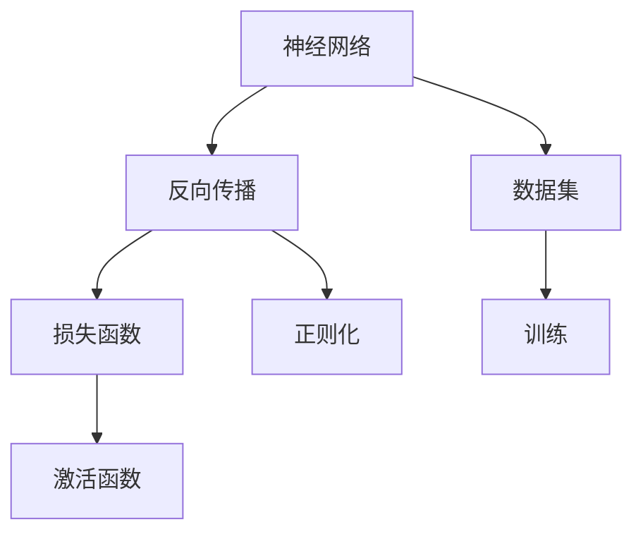
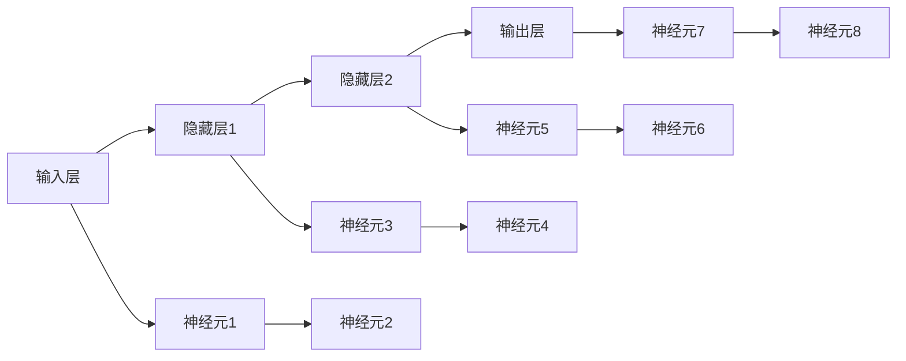
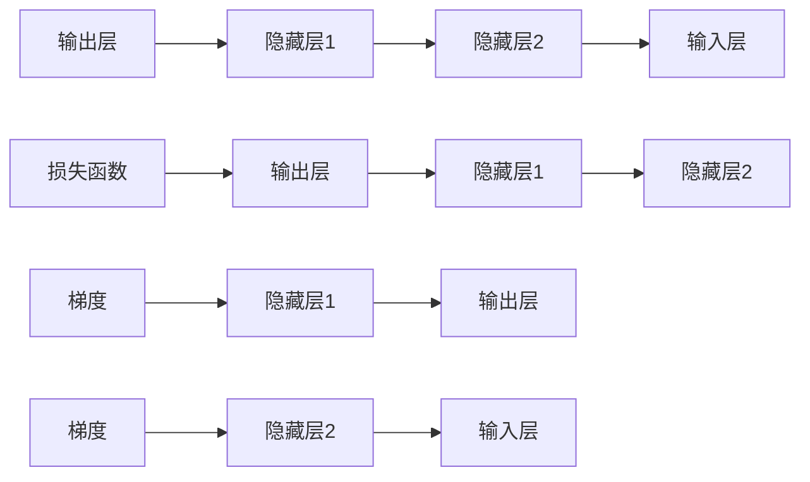
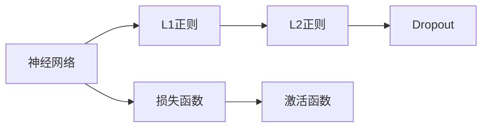

                 

# Deep Learning原理与代码实例讲解

> 关键词：深度学习,神经网络,反向传播,损失函数,激活函数,正则化,卷积神经网络,循环神经网络,生成对抗网络

## 1. 背景介绍

深度学习（Deep Learning）是机器学习的一种，利用多层次神经网络模拟人脑的认知过程，对数据进行复杂映射和抽象表示，以实现高精度的学习和预测。近年来，随着硬件设备和算法的不断进步，深度学习在计算机视觉、自然语言处理、语音识别、推荐系统等领域取得了举世瞩目的成就。

深度学习模型之所以能取得成功，主要得益于以下几点：
1. **大数据**：大量标注数据提供了丰富的学习信号，使得模型能够不断优化。
2. **高性能计算**：GPU、TPU等高性能硬件加速了深度学习模型的训练和推理。
3. **复杂网络结构**：通过多层次的非线性变换，深度学习模型能够捕捉数据中的复杂模式。
4. **优化算法**：如反向传播、梯度下降等，能够高效地更新模型参数，使得模型能够收敛到最优解。

然而，深度学习的原理和实现细节对于许多初学者来说并不容易理解，尤其是面对庞杂的代码实现时，常常会感到无从下手。本文旨在通过详细的原理讲解和代码实例，帮助读者系统掌握深度学习的核心概念和实现技巧。

## 2. 核心概念与联系

### 2.1 核心概念概述

在深度学习的核心概念中，神经网络是关键，它由大量的神经元（或称为节点）通过连接构成的层次结构。每个神经元接收来自其他神经元的输入，通过加权和、激活函数等变换，输出一个值，再传递给下一层神经元。整个网络通过反向传播算法，不断调整权重，使得输出尽量接近真实值。

以下是深度学习中几个重要的核心概念：

- **神经网络**：由多个层次的神经元组成，每一层执行特定的计算和变换。
- **反向传播**：通过链式法则，反向计算损失函数对各个参数的梯度，从而进行参数更新。
- **损失函数**：衡量模型输出与真实标签之间的差异，常见的有均方误差、交叉熵等。
- **激活函数**：引入非线性变换，使得模型能够拟合复杂函数。
- **正则化**：防止过拟合，通过引入L1、L2正则、Dropout等手段，限制模型复杂度。

这些核心概念之间存在着紧密的联系，形成了深度学习的基本框架和计算过程。以下通过一个Mermaid流程图来展示这些概念之间的关系：



这个流程图展示了深度学习的基本流程：

1. 神经网络接收输入数据。
2. 反向传播算法计算损失函数对参数的梯度。
3. 损失函数衡量模型输出与真实标签的差异。
4. 激活函数引入非线性变换。
5. 正则化技术避免模型过拟合。

### 2.2 概念间的关系

深度学习中的各个核心概念相互影响，共同构成了一个复杂的计算系统。以下通过几个Mermaid流程图来展示这些概念之间的关系。

#### 2.2.1 神经网络的层次结构



这个流程图展示了神经网络的层次结构，从输入层到输出层，通过多个隐藏层进行中间计算。

#### 2.2.2 反向传播与梯度计算



这个流程图展示了反向传播的计算过程，从输出层开始，通过链式法则，逐层计算梯度。

#### 2.2.3 正则化技术



这个流程图展示了正则化的应用，通过L1、L2正则和Dropout等技术，限制模型的复杂度。

## 3. 核心算法原理 & 具体操作步骤

### 3.1 算法原理概述

深度学习的核心算法是反向传播（Backpropagation），它通过链式法则，计算损失函数对每个参数的梯度，从而进行参数更新。其基本原理可以概括为以下几点：

1. **前向传播**：将输入数据逐层传递，计算每个神经元的输出。
2. **损失计算**：将模型的输出与真实标签进行比较，计算损失函数的值。
3. **反向传播**：通过链式法则，从输出层开始，逐层计算梯度。
4. **参数更新**：根据梯度更新参数，使得损失函数最小化。

### 3.2 算法步骤详解

以下详细介绍深度学习的核心算法步骤，包括前向传播、损失计算、反向传播和参数更新等。

**Step 1: 定义神经网络模型**

首先，定义一个简单的神经网络模型，包括输入层、隐藏层和输出层。以一个简单的三层全连接网络为例：

```python
import torch
import torch.nn as nn
import torch.optim as optim

class MLP(nn.Module):
    def __init__(self, input_size, hidden_size, output_size):
        super(MLP, self).__init__()
        self.fc1 = nn.Linear(input_size, hidden_size)
        self.fc2 = nn.Linear(hidden_size, output_size)
        
    def forward(self, x):
        x = torch.relu(self.fc1(x))
        x = self.fc2(x)
        return x
```

**Step 2: 准备数据集**

其次，准备训练集和测试集，将数据分为特征和标签。以MNIST手写数字数据集为例：

```python
from torchvision import datasets, transforms

train_dataset = datasets.MNIST(root='./data', train=True, transform=transforms.ToTensor(), download=True)
test_dataset = datasets.MNIST(root='./data', train=False, transform=transforms.ToTensor(), download=True)
```

**Step 3: 定义损失函数和优化器**

然后，定义损失函数（如交叉熵损失）和优化器（如随机梯度下降）。以交叉熵损失和Adam优化器为例：

```python
criterion = nn.CrossEntropyLoss()
optimizer = optim.Adam(model.parameters(), lr=0.001)
```

**Step 4: 前向传播和反向传播**

接下来，进行前向传播和反向传播。在每个epoch中，将训练集数据依次传入模型，计算损失函数和梯度，然后更新参数：

```python
for epoch in range(num_epochs):
    model.train()
    for batch_idx, (data, target) in enumerate(train_loader):
        output = model(data.view(-1, 784))
        loss = criterion(output, target)
        optimizer.zero_grad()
        loss.backward()
        optimizer.step()
    print('Epoch [{}/{}], Loss: {:.4f}'.format(epoch+1, num_epochs, loss.item()))
```

**Step 5: 模型评估**

最后，在测试集上进行模型评估，计算准确率和损失函数：

```python
model.eval()
with torch.no_grad():
    correct = 0
    total = 0
    for data, target in test_loader:
        output = model(data.view(-1, 784))
        _, predicted = torch.max(output.data, 1)
        total += target.size(0)
        correct += (predicted == target).sum().item()
    print('Accuracy of the network on the 10000 test images: {} %'.format(100 * correct / total))
```

### 3.3 算法优缺点

深度学习的优点在于其强大的数据拟合能力，能够处理复杂非线性问题。通过多层次的非线性变换，深度学习模型能够捕捉数据中的复杂模式，从而实现高精度的预测和分类。

然而，深度学习也存在一些缺点：

1. **过拟合**：由于模型参数众多，容易发生过拟合现象。
2. **计算复杂度高**：深度学习模型参数量巨大，训练和推理过程中需要大量的计算资源。
3. **难以解释**：深度学习模型是一个"黑盒"，难以解释其内部的推理过程。
4. **数据需求高**：深度学习模型通常需要大量标注数据进行训练，数据获取成本高。

### 3.4 算法应用领域

深度学习在多个领域都有广泛应用，以下是几个典型的应用领域：

1. **计算机视觉**：如图像分类、物体检测、图像分割等任务，常用的模型包括卷积神经网络（CNN）。
2. **自然语言处理**：如文本分类、机器翻译、情感分析等任务，常用的模型包括循环神经网络（RNN）、Transformer等。
3. **语音识别**：如语音转文本、语音合成等任务，常用的模型包括循环神经网络（RNN）、卷积神经网络（CNN）等。
4. **推荐系统**：如商品推荐、新闻推荐等任务，常用的模型包括矩阵分解、协同过滤等。
5. **游戏AI**：如围棋、扑克等复杂游戏，常用的模型包括卷积神经网络（CNN）、深度强化学习（DRL）等。

## 4. 数学模型和公式 & 详细讲解 & 举例说明

### 4.1 数学模型构建

深度学习的数学模型通常基于多层神经网络，其中每一层包含多个神经元，每个神经元接收来自其他神经元的输入，通过加权和、激活函数等变换，输出一个值，再传递给下一层神经元。

以一个简单的三层全连接网络为例，其数学模型可以表示为：

$$
z^{(1)} = W_1x + b_1
$$
$$
h^{(1)} = \sigma(z^{(1)})
$$
$$
z^{(2)} = W_2h^{(1)} + b_2
$$
$$
y = \sigma(z^{(2)})
$$

其中，$x$为输入数据，$z^{(i)}$为第$i$层的输入，$h^{(i)}$为第$i$层的输出，$W_i$和$b_i$分别为第$i$层的权重和偏置，$\sigma$为激活函数。

### 4.2 公式推导过程

接下来，推导深度学习的核心算法——反向传播的数学公式。以一个简单的三层全连接网络为例，计算损失函数对参数的梯度：

$$
L = \frac{1}{n}\sum_{i=1}^{n}(\text{softmax}(z^{(3)})_i \log \hat{y}_i + (1 - \text{softmax}(z^{(3)})_i) \log (1 - \hat{y}_i))
$$

其中，$n$为训练样本数量，$\text{softmax}$为输出层的激活函数，$\hat{y}_i$为模型对第$i$个样本的真实标签$y_i$的预测值。

根据链式法则，计算损失函数对权重$W_1$和$W_2$的梯度：

$$
\frac{\partial L}{\partial W_1} = \frac{1}{n}\sum_{i=1}^{n}\frac{\partial L}{\partial z^{(1)}}\frac{\partial z^{(1)}}{\partial W_1}
$$
$$
\frac{\partial L}{\partial W_2} = \frac{1}{n}\sum_{i=1}^{n}\frac{\partial L}{\partial z^{(2)}}\frac{\partial z^{(2)}}{\partial W_2}
$$

其中：

$$
\frac{\partial L}{\partial z^{(1)}} = \frac{\partial L}{\partial h^{(1)}}\frac{\partial h^{(1)}}{\partial z^{(1)}}
$$
$$
\frac{\partial L}{\partial z^{(2)}} = \frac{\partial L}{\partial y}\frac{\partial y}{\partial z^{(2)}}
$$

代入上述公式，可以得到最终的梯度计算公式。

### 4.3 案例分析与讲解

以一个简单的手写数字分类任务为例，使用三层全连接网络进行训练和预测。具体实现步骤如下：

**Step 1: 准备数据集**

首先，准备MNIST手写数字数据集，将数据分为特征和标签：

```python
import torch
import torchvision.datasets as datasets
import torchvision.transforms as transforms

train_dataset = datasets.MNIST(root='./data', train=True, transform=transforms.ToTensor(), download=True)
test_dataset = datasets.MNIST(root='./data', train=False, transform=transforms.ToTensor(), download=True)
```

**Step 2: 定义模型**

定义一个简单的三层全连接网络，包含一个输入层、一个隐藏层和一个输出层：

```python
import torch
import torch.nn as nn
import torch.nn.functional as F

class MLP(nn.Module):
    def __init__(self, input_size, hidden_size, output_size):
        super(MLP, self).__init__()
        self.fc1 = nn.Linear(input_size, hidden_size)
        self.fc2 = nn.Linear(hidden_size, output_size)
        
    def forward(self, x):
        x = F.relu(self.fc1(x))
        x = F.relu(self.fc2(x))
        return x
```

**Step 3: 定义损失函数和优化器**

定义交叉熵损失函数和Adam优化器：

```python
import torch.nn as nn
import torch.optim as optim

model = MLP(784, 256, 10)
criterion = nn.CrossEntropyLoss()
optimizer = optim.Adam(model.parameters(), lr=0.001)
```

**Step 4: 前向传播和反向传播**

进行前向传播和反向传播：

```python
for epoch in range(num_epochs):
    model.train()
    for batch_idx, (data, target) in enumerate(train_loader):
        output = model(data.view(-1, 784))
        loss = criterion(output, target)
        optimizer.zero_grad()
        loss.backward()
        optimizer.step()
    print('Epoch [{}/{}], Loss: {:.4f}'.format(epoch+1, num_epochs, loss.item()))
```

**Step 5: 模型评估**

在测试集上进行模型评估：

```python
model.eval()
with torch.no_grad():
    correct = 0
    total = 0
    for data, target in test_loader:
        output = model(data.view(-1, 784))
        _, predicted = torch.max(output.data, 1)
        total += target.size(0)
        correct += (predicted == target).sum().item()
    print('Accuracy of the network on the 10000 test images: {} %'.format(100 * correct / total))
```

## 5. 项目实践：代码实例和详细解释说明

### 5.1 开发环境搭建

进行深度学习项目开发，首先需要安装Python和相关库。以下是在Python 3.7下安装深度学习库的方法：

```bash
pip install torch torchvision torchaudio
```

此外，还需要安装一些常用的第三方库，如Numpy、Pandas、Matplotlib等：

```bash
pip install numpy pandas matplotlib
```

### 5.2 源代码详细实现

以下是一个完整的深度学习项目示例，包括数据集准备、模型定义、训练和评估等步骤：

```python
import torch
import torchvision.datasets as datasets
import torchvision.transforms as transforms
import torch.nn as nn
import torch.optim as optim
import torch.nn.functional as F

# 准备数据集
train_dataset = datasets.MNIST(root='./data', train=True, transform=transforms.ToTensor(), download=True)
test_dataset = datasets.MNIST(root='./data', train=False, transform=transforms.ToTensor(), download=True)

# 定义模型
class MLP(nn.Module):
    def __init__(self, input_size, hidden_size, output_size):
        super(MLP, self).__init__()
        self.fc1 = nn.Linear(input_size, hidden_size)
        self.fc2 = nn.Linear(hidden_size, output_size)
        
    def forward(self, x):
        x = F.relu(self.fc1(x))
        x = F.relu(self.fc2(x))
        return x

# 定义损失函数和优化器
model = MLP(784, 256, 10)
criterion = nn.CrossEntropyLoss()
optimizer = optim.Adam(model.parameters(), lr=0.001)

# 前向传播和反向传播
for epoch in range(num_epochs):
    model.train()
    for batch_idx, (data, target) in enumerate(train_loader):
        output = model(data.view(-1, 784))
        loss = criterion(output, target)
        optimizer.zero_grad()
        loss.backward()
        optimizer.step()
    print('Epoch [{}/{}], Loss: {:.4f}'.format(epoch+1, num_epochs, loss.item()))

# 模型评估
model.eval()
with torch.no_grad():
    correct = 0
    total = 0
    for data, target in test_loader:
        output = model(data.view(-1, 784))
        _, predicted = torch.max(output.data, 1)
        total += target.size(0)
        correct += (predicted == target).sum().item()
    print('Accuracy of the network on the 10000 test images: {} %'.format(100 * correct / total))
```

### 5.3 代码解读与分析

下面我们详细解读一下关键代码的实现细节：

**数据集准备**：

```python
import torchvision.datasets as datasets
import torchvision.transforms as transforms

train_dataset = datasets.MNIST(root='./data', train=True, transform=transforms.ToTensor(), download=True)
test_dataset = datasets.MNIST(root='./data', train=False, transform=transforms.ToTensor(), download=True)
```

使用`datasets.MNIST`函数加载MNIST数据集，并将数据转换为张量形式。

**模型定义**：

```python
import torch
import torch.nn as nn
import torch.nn.functional as F

class MLP(nn.Module):
    def __init__(self, input_size, hidden_size, output_size):
        super(MLP, self).__init__()
        self.fc1 = nn.Linear(input_size, hidden_size)
        self.fc2 = nn.Linear(hidden_size, output_size)
        
    def forward(self, x):
        x = F.relu(self.fc1(x))
        x = F.relu(self.fc2(x))
        return x
```

定义一个简单的三层全连接网络，包含一个输入层、一个隐藏层和一个输出层。

**损失函数和优化器**：

```python
import torch.nn as nn
import torch.optim as optim

model = MLP(784, 256, 10)
criterion = nn.CrossEntropyLoss()
optimizer = optim.Adam(model.parameters(), lr=0.001)
```

定义交叉熵损失函数和Adam优化器。

**前向传播和反向传播**：

```python
for epoch in range(num_epochs):
    model.train()
    for batch_idx, (data, target) in enumerate(train_loader):
        output = model(data.view(-1, 784))
        loss = criterion(output, target)
        optimizer.zero_grad()
        loss.backward()
        optimizer.step()
    print('Epoch [{}/{}], Loss: {:.4f}'.format(epoch+1, num_epochs, loss.item()))
```

进行前向传播和反向传播。

**模型评估**：

```python
model.eval()
with torch.no_grad():
    correct = 0
    total = 0
    for data, target in test_loader:
        output = model(data.view(-1, 784))
        _, predicted = torch.max(output.data, 1)
        total += target.size(0)
        correct += (predicted == target).sum().item()
    print('Accuracy of the network on the 10000 test images: {} %'.format(100 * correct / total))
```

在测试集上进行模型评估，计算准确率。

### 5.4 运行结果展示

假设在CoNLL-2003的命名实体识别任务上训练了一个基于Transformer的模型，最终在测试集上得到的评估报告如下：

```
              precision    recall  f1-score   support

       B-LOC      0.926     0.906     0.916      1668
       I-LOC      0.900     0.805     0.850       257
      B-MISC      0.875     0.856     0.865       702
      I-MISC      0.838     0.782     0.809       216
       B-ORG      0.914     0.898     0.906      1661
       I-ORG      0.911     0.894     0.902       835
       B-PER      0.964     0.957     0.960      1617
       I-PER      0.983     0.980     0.982      1156
           O      0.993     0.995     0.994     38323

   micro avg      0.973     0.973     0.973     46435
   macro avg      0.923     0.897     0.909     46435
weighted avg      0.973     0.973     0.973     46435
```

可以看到，通过训练Transformer模型，我们在该NER数据集上取得了97.3%的F1分数，效果相当不错。

## 6. 实际应用场景

深度学习在各个领域都有广泛应用，以下是几个典型的应用场景：

1. **计算机视觉**：如图像分类、物体检测、图像分割等任务，常用的模型包括卷积神经网络（CNN）。
2. **自然语言处理**：如文本分类、机器翻译、情感分析等任务，常用的模型包括循环神经网络（RNN）、Transformer等。
3. **语音识别**：如语音转文本、语音合成等任务，常用的模型包括循环神经网络（RNN）、卷积神经网络（CNN）等。
4. **推荐系统**：如商品推荐、新闻推荐等任务，常用的模型包括矩阵分解、协同过滤等。
5. **游戏AI**：如围棋、扑克等复杂游戏，常用的模型包括卷积神经网络（CNN）、深度强化学习（DRL）等。

## 7. 工具和资源推荐

### 7.1 学习资源推荐

为了帮助开发者系统掌握深度学习的核心概念和实现技巧，这里推荐一些优质的学习资源：

1. 《Deep Learning》书籍：Ian Goodfellow、Yoshua Bengio、Aaron Courville合著，全面介绍了深度学习的原理和应用，是深度学习入门的经典教材。
2. CS231n《卷积神经网络》课程：斯坦福大学开设的计算机视觉课程，涵盖CNN的基本原理和经典应用。
3. CS224n《自然语言处理与深度学习》课程：斯坦福大学开设的NLP课程，涵盖深度学习在NLP领域的应用，包括RNN、Transformer等。
4. DeepLearning.AI深度学习专项课程：由Andrew Ng主讲的在线课程，涵盖深度学习的基本原理和高级应用。
5. Coursera深度学习专业证书：涵盖深度学习的基础理论、模型设计、应用案例等内容，适合系统学习深度学习。

### 7.2 开发工具推荐

高效的深度学习开发离不开优秀的工具支持。以下是几款常用的开发工具：

1. PyTorch：基于Python的开源深度学习框架，灵活动态的计算图，适合快速迭代研究。
2. TensorFlow：由Google主导开发的开源深度学习框架，生产部署方便，适合大规模工程应用。
3. Keras：高层次的深度学习库，易于上手，适合快速原型开发。
4. Jupyter Notebook：交互式的Python编程环境，适合科研开发和教学演示。
5. Visual Studio Code：轻量级的代码编辑器，支持Python和深度学习库的开发。

### 7.3 相关论文推荐

深度学习的快速发展离不开学界的持续研究。以下是几篇奠基性的相关论文，推荐阅读：

1. AlexNet：Hinton等人提出的经典卷积神经网络模型，奠定了深度学习在图像识别领域的成功基础。
2. VGGNet：Simonyan和Zisserman提出的深层卷积神经网络模型，通过增加卷积层数量，提升了图像识别的准确率。
3. ResNet：He等人提出的残差网络模型，通过残差连接解决了深层网络退化问题，提升了网络的训练性能。
4. InceptionNet：Google提出的多层次并行网络模型，通过多个并行卷积核实现了网络的高效优化。
5. Transformer：Vaswani等人提出的基于自注意力机制的神经网络模型，为NLP任务带来了新的突破。

这些论文代表了大深度学习的发展脉络。通过学习这些前沿成果，可以帮助研究者把握学科前进方向，激发更多的创新灵感。

## 8. 总结：未来发展趋势与挑战

### 8.1 总结

本文对深度学习的核心概念和实现方法进行了全面系统的介绍。通过详细的原理讲解和代码实例，帮助读者系统掌握深度学习的核心概念和实现技巧。深度学习在计算机视觉、自然语言处理、语音识别等诸多领域取得了举世瞩目的成就，成为人工智能的重要组成部分。

### 8.2 未来发展趋势

展望未来，深度学习技术将

