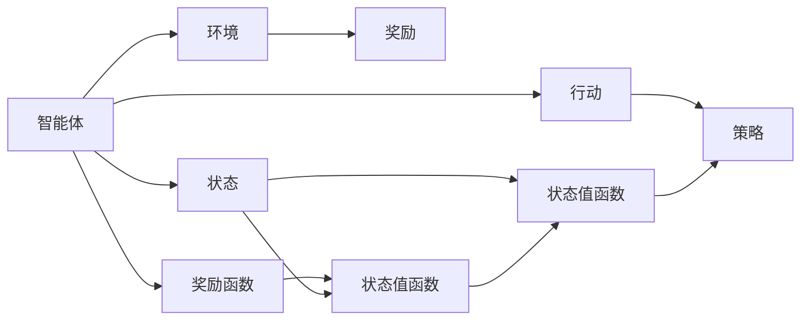
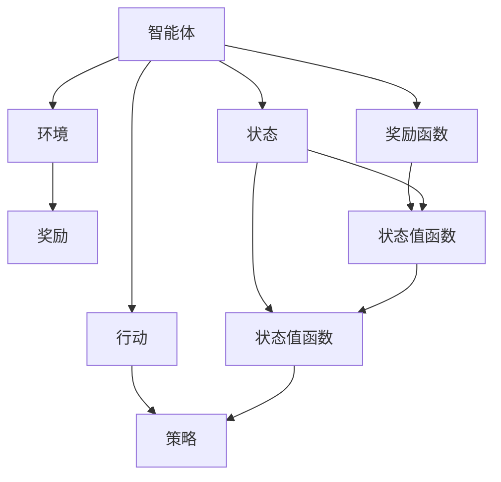
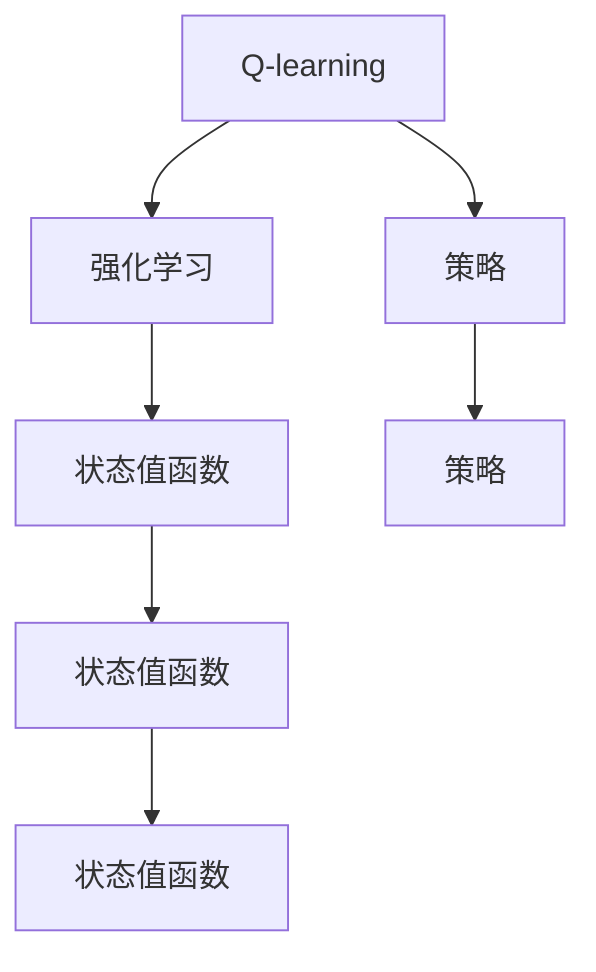
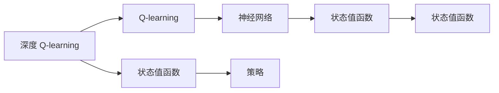
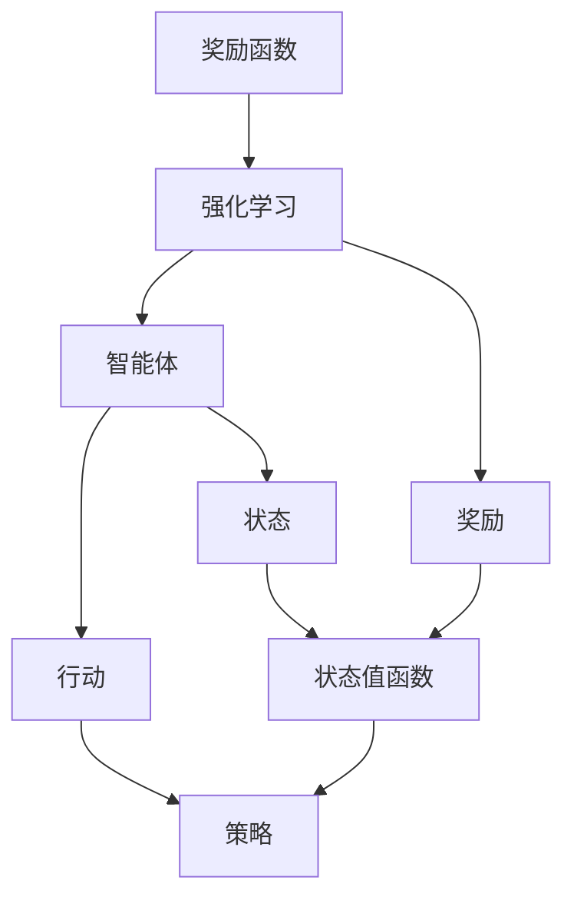

                 

# 深度 Q-learning：奖励函数的选择与优化

## 1. 背景介绍

### 1.1 问题由来
深度强化学习（Deep Reinforcement Learning, DRL）作为强化学习与深度神经网络结合的产物，近年来在诸多领域取得了突破性进展。深度 Q-learning（Deep Q-Learning, DQN）作为其中最具代表性的一种方法，通过神经网络逼近 Q 函数，提升了强化学习的表现能力。然而，Q 函数的选择和设计是 DQN 算法能否成功的关键，决定着模型能否正确估计奖励函数的未来值。

### 1.2 问题核心关键点
在深度 Q-learning 中，Q 函数的选择和设计是核心问题。一个良好的 Q 函数应该能够逼近真实的价值函数，准确估计未来奖励的累积值，同时具有良好的泛化能力，避免对特定环境或特定状态进行过度拟合。常见的 Q 函数设计方法包括经验 Q 学习（Experience-Q Learning）、深度 Q 网络（Deep Q-Networks）、分布式 Q-learning 等。

深度 Q-learning 的奖励函数设计，是决定模型性能的重要因素。奖励函数的选择和优化直接影响模型的收敛速度和稳定性，以及最终的策略效果。合理的奖励函数设计，可以引导模型更有效地探索状态空间，规避局部最优，提高全局搜索效率。

### 1.3 问题研究意义
研究深度 Q-learning 的奖励函数，对于优化深度强化学习模型的性能、提升策略质量、实现更加智能化的决策过程具有重要意义：

1. 优化模型性能。一个合理的奖励函数可以引导模型更加高效地探索状态空间，避免陷入局部最优。
2. 提高策略质量。奖励函数决定了模型的学习目标，直接影响到最终的决策策略。
3. 实现智能决策。通过优化奖励函数，模型可以在复杂环境中做出更加合理、有效的决策。
4. 加速模型训练。合理的奖励函数可以加快模型的收敛速度，减少训练时间。
5. 促进模型泛化。优化后的奖励函数具有良好的泛化能力，使得模型在不同环境或任务上表现一致。

## 2. 核心概念与联系

### 2.1 核心概念概述

为更好地理解深度 Q-learning 的奖励函数选择与优化，本节将介绍几个密切相关的核心概念：

- 强化学习（Reinforcement Learning, RL）：通过智能体与环境交互，实现策略的优化。目标是最小化累计奖励。
- Q-learning：一种基于值函数的强化学习算法，通过迭代更新 Q 函数逼近最优策略。
- 深度 Q-learning：将神经网络与 Q-learning 结合，通过神经网络逼近 Q 函数，提升模型逼近能力。
- 奖励函数（Reward Function）：在强化学习中，定义智能体行为选择的评价标准，影响模型的学习效果。
- 状态值函数（State Value Function）：描述状态下可获得的累计奖励的函数。
- 策略（Policy）：定义智能体在每个状态下采取的行动方案，是决策的依据。

这些核心概念之间的逻辑关系可以通过以下Mermaid流程图来展示：



这个流程图展示了一些核心概念之间的关系：

1. 智能体通过与环境交互，观察当前状态，选择行动。
2. 环境根据智能体的行动，给予奖励，并更新状态。
3. 状态值函数和策略函数共同作用，决定智能体的行动选择。
4. 奖励函数定义智能体行为的好坏，与策略函数、状态值函数相互作用。

### 2.2 概念间的关系

这些核心概念之间存在着紧密的联系，形成了强化学习的基本框架。下面我们通过几个Mermaid流程图来展示这些概念之间的关系。

#### 2.2.1 强化学习过程


这个流程图展示了强化学习的基本过程：

1. 智能体观察当前状态，选择行动。
2. 环境根据智能体的行动，给予奖励，并更新状态。
3. 状态值函数和策略函数共同作用，决定智能体的行动选择。
4. 奖励函数定义智能体行为的好坏，与策略函数、状态值函数相互作用。

#### 2.2.2 Q-learning与强化学习的关系


这个流程图展示了 Q-learning 在强化学习中的作用：

1. Q-learning 通过迭代更新 Q 函数逼近最优策略。
2. Q 函数描述了在状态 s 下，采取行动 a 的累积奖励值。
3. 状态值函数和策略函数共同作用，决定智能体的行动选择。
4. Q 函数和策略函数是强化学习中的关键组成部分。

#### 2.2.3 深度 Q-learning 与 Q-learning 的关系


这个流程图展示了深度 Q-learning 在 Q-learning 中的扩展：

1. 深度 Q-learning 将神经网络与 Q-learning 结合，通过神经网络逼近 Q 函数。
2. 神经网络具有逼近任意非线性函数的能力，提升 Q 函数的逼近能力。
3. 状态值函数和策略函数共同作用，决定智能体的行动选择。
4. 神经网络可以更好地捕捉状态与行动之间的复杂关系。

#### 2.2.4 奖励函数与强化学习的关系


这个流程图展示了奖励函数在强化学习中的作用：

1. 奖励函数定义智能体行为的好坏，影响模型的学习效果。
2. 奖励函数直接影响状态值函数的更新，影响智能体的行动选择。
3. 状态值函数和策略函数共同作用，决定智能体的行动选择。
4. 奖励函数是强化学习中的关键组成部分。

### 2.3 核心概念的整体架构

最后，我们用一个综合的流程图来展示这些核心概念在强化学习中的整体架构：


这个综合流程图展示了从智能体的行为选择到奖励函数的反馈，以及状态值函数和策略函数的相互作用，最终达到强化学习中的最优策略。

## 3. 核心算法原理 & 具体操作步骤
### 3.1 算法原理概述

在深度 Q-learning 中，Q 函数（通常表示为 $\hat{Q}(s,a)$）描述了在状态 $s$ 下，采取行动 $a$ 的累积奖励值。通过不断迭代更新 Q 函数，深度 Q-learning 可以逼近最优策略。

奖励函数是 Q-learning 中的重要组成部分，它定义了智能体在每个状态下采取行动的价值，决定了模型的学习目标。一个合理的奖励函数应该具备以下特性：

1. 无偏性（Unbiasedness）：奖励函数应无偏地反映智能体的行为表现。
2. 一致性（Consistency）：奖励函数应具有良好的一致性，避免对智能体行为产生误导。
3. 可解释性（Interpretability）：奖励函数应具有较好的可解释性，便于理解和调试。
4. 鲁棒性（Robustness）：奖励函数应具有一定的鲁棒性，对环境变化具有较强的适应能力。
5. 可扩展性（Scalability）：奖励函数应具有较好的可扩展性，适用于不同规模和复杂度的环境。

形式化地，一个奖励函数 $\mathcal{R}$ 通常可以表示为：

$$
\mathcal{R}(s) = \mathcal{R}(s, a)
$$

其中 $s$ 表示当前状态，$a$ 表示采取的行动。

### 3.2 算法步骤详解

深度 Q-learning 的奖励函数选择与优化，主要包括以下几个关键步骤：

**Step 1: 选择奖励函数模型**

- 选择合适的奖励函数模型，如线性奖励函数、多项式奖励函数、指数奖励函数等。
- 对于连续状态空间，使用线性或多项式奖励函数，对于离散状态空间，使用指数奖励函数。
- 奖励函数应能够较好地反映任务特性，具有较好的泛化能力。

**Step 2: 设计奖励函数特征**

- 根据任务需求，设计奖励函数特征。如对于游戏任务，奖励函数可以包括得分、生命值、目标状态等。
- 对于复杂任务，可以设计多个特征，组合成复合奖励函数。如使用多任务奖励函数，同时考虑多个任务的目标。
- 特征设计应符合任务特点，避免冗余和误导。

**Step 3: 初始化模型参数**

- 初始化深度神经网络，设置合适的层数和神经元数。
- 使用随机权重初始化神经网络，进行训练前的前向传播。
- 设计合适的损失函数，如均方误差损失、交叉熵损失等，用于优化 Q 函数。

**Step 4: 训练模型**

- 收集训练样本，进行前向传播和反向传播，更新 Q 函数。
- 使用随机梯度下降（SGD）或 Adam 等优化算法，最小化损失函数。
- 设置合适的学习率，避免过拟合。
- 周期性在验证集上评估模型性能，根据性能指标调整参数。

**Step 5: 评估与调整**

- 在测试集上评估模型性能，对比训练前后的精度提升。
- 分析模型在特定状态下的表现，调整奖励函数参数。
- 根据测试结果，选择合适的奖励函数模型和设计。

### 3.3 算法优缺点

深度 Q-learning 的奖励函数选择与优化，具有以下优点：

1. 简单高效。选择合适的奖励函数模型和设计，可以显著提升模型的学习效果。
2. 适用广泛。奖励函数设计方法适用于多种环境和任务，具有较强的泛化能力。
3. 优化效果好。合理的奖励函数可以引导模型更加高效地探索状态空间，避免局部最优。
4. 训练稳定。合适的奖励函数可以加快模型的收敛速度，提高训练稳定性。

同时，该方法也存在一定的局限性：

1. 奖励函数设计复杂。设计一个合适的奖励函数需要经验和专业知识，设计不当可能导致模型性能不佳。
2. 数据需求较大。奖励函数需要大量样本进行训练，数据不足可能导致模型泛化能力不足。
3. 可解释性差。深度神经网络通常具有黑箱特性，难以解释模型的内部工作机制。
4. 鲁棒性不足。奖励函数对环境变化敏感，需要实时调整才能保持模型性能。

尽管存在这些局限性，但就目前而言，深度 Q-learning 的奖励函数选择与优化方法仍是最主流范式。未来相关研究的重点在于如何进一步降低奖励函数设计的难度，提高模型的少样本学习和跨领域迁移能力，同时兼顾可解释性和伦理安全性等因素。

### 3.4 算法应用领域

深度 Q-learning 的奖励函数选择与优化方法，在强化学习领域已经得到了广泛的应用，覆盖了几乎所有常见任务，例如：

- 游戏任务：如 AlphaGo、AlphaStar、Dota 2 等。通过设计合适的奖励函数，智能体能够在复杂游戏中取得优异成绩。
- 机器人控制：如 NAO 机器人、Walker 机器人等。通过设计合适的奖励函数，机器人能够在复杂环境中完成指定的任务。
- 自然语言处理：如自动翻译、文本摘要、问答系统等。通过设计合适的奖励函数，模型能够在自然语言处理任务中取得优异效果。
- 自动驾驶：如 UAV 无人机、自动驾驶汽车等。通过设计合适的奖励函数，智能体能够在复杂交通环境中做出合理决策。
- 医疗诊断：如疾病诊断、治疗方案等。通过设计合适的奖励函数，模型能够在医疗诊断任务中提供精准的决策建议。

除了上述这些经典任务外，深度 Q-learning 的奖励函数选择与优化方法也在更多场景中得到应用，如智能电网、智能家居、金融预测等，为强化学习技术带来了全新的突破。

## 4. 数学模型和公式 & 详细讲解  
### 4.1 数学模型构建

本节将使用数学语言对深度 Q-learning 的奖励函数选择与优化过程进行更加严格的刻画。

记智能体在状态 $s$ 下采取行动 $a$ 的累积奖励为 $R(s,a)$，定义 Q 函数为：

$$
\hat{Q}(s,a) = \mathbb{E}[R(s,a)|s]
$$

奖励函数 $\mathcal{R}$ 的期望为：

$$
\mathcal{R}(s) = \mathbb{E}[R(s)|s]
$$

在深度 Q-learning 中，我们使用神经网络逼近 Q 函数，即：

$$
\hat{Q}(s,a; \theta) = \theta^\top \phi(s)
$$

其中 $\theta$ 为神经网络的权重，$\phi$ 为状态特征映射函数。

### 4.2 公式推导过程

以下我们以基于线性奖励函数的深度 Q-learning 为例，推导奖励函数的期望。

假设智能体在状态 $s$ 下采取行动 $a$，下一个状态为 $s'$，获得的奖励为 $r$。则有：

$$
R(s,a) = r + \gamma R(s',a')
$$

其中 $\gamma$ 为折扣因子，表示未来奖励的权重。

根据上述公式，可以推导出状态 $s$ 下采取行动 $a$ 的累积奖励为：

$$
\mathcal{R}(s) = \mathbb{E}[R(s,a)|s] = \mathbb{E}[r + \gamma R(s',a')|s]
$$

将上式展开，得：

$$
\mathcal{R}(s) = r + \gamma \mathbb{E}[R(s',a')|s]
$$

令 $V(s) = \mathbb{E}[R(s,a)|s]$，则有：

$$
\mathcal{R}(s) = r + \gamma V(s')
$$

根据 Q-learning 的原理，可以推导出状态 $s$ 下采取行动 $a$ 的 Q 函数为：

$$
\hat{Q}(s,a; \theta) = \mathbb{E}[\hat{Q}(s',a'; \theta)|s] = \mathbb{E}[\hat{V}(s') + \gamma \hat{Q}(s',a'; \theta)|s]
$$

其中 $\hat{V}(s) = \mathbb{E}[\hat{Q}(s,a)|s]$。

因此，深度 Q-learning 的优化目标可以表示为：

$$
\min_{\theta} \mathbb{E}[\hat{Q}(s,a; \theta) - Q(s,a)|s]
$$

在训练过程中，我们通常使用随机梯度下降（SGD）等优化算法，最小化上述损失函数。具体实现时，可以在每个批次的数据上进行前向传播和反向传播，更新神经网络的权重。

### 4.3 案例分析与讲解

以训练一个简单的 Q-learning 模型为例，展示深度 Q-learning 的奖励函数选择与优化过程。

假设我们的任务是训练一个简单的 Q-learning 模型，用于预测给定状态下的最优行动。我们采用线性奖励函数，即：

$$
\mathcal{R}(s) = w^\top \phi(s) + b
$$

其中 $w$ 为线性权重，$b$ 为偏置项，$\phi(s)$ 为状态特征映射函数。

在训练过程中，我们可以使用随机梯度下降算法，最小化均方误差损失函数：

$$
\mathcal{L}(\theta) = \frac{1}{N} \sum_{i=1}^N (\hat{Q}(s_i,a_i; \theta) - Q(s_i,a_i)|s_i)^2
$$

其中 $s_i$ 表示训练样本的状态，$a_i$ 表示对应的行动，$Q(s_i,a_i)|s_i$ 表示在状态 $s_i$ 下采取行动 $a_i$ 的累积奖励。

在具体实现时，可以使用 PyTorch 等深度学习框架，实现上述优化过程。代码实现如下：

```python
import torch
import torch.nn as nn
import torch.optim as optim

# 定义线性奖励函数
class RewardFunction(nn.Module):
    def __init__(self, feature_size):
        super(RewardFunction, self).__init__()
        self.linear = nn.Linear(feature_size, 1)
        self.bias = nn.Parameter(torch.tensor(0.0, dtype=torch.float))

    def forward(self, x):
        return self.linear(x) + self.bias

# 定义 Q-learning 模型
class QLearningModel(nn.Module):
    def __init__(self, state_size, action_size, feature_size):
        super(QLearningModel, self).__init__()
        self.feature = RewardFunction(feature_size)
        self.q_net = nn.Sequential(
            nn.Linear(state_size, feature_size),
            nn.ReLU(),
            nn.Linear(feature_size, action_size)
        )

    def forward(self, state, action):
        state_feature = self.feature(state)
        q_value = self.q_net(state_feature)
        q_value = q_value.gather(1, action)
        return q_value

# 定义优化器和损失函数
model = QLearningModel(state_size, action_size, feature_size)
optimizer = optim.Adam(model.parameters(), lr=learning_rate)
loss_fn = nn.MSELoss()

# 训练过程
for epoch in range(num_epochs):
    for i in range(len(train_data)):
        state = train_data[i][0]
        action = train_data[i][1]
        target = train_data[i][2]
        optimizer.zero_grad()
        q_value = model(state, action)
        loss = loss_fn(q_value, target)
        loss.backward()
        optimizer.step()
```

在上述代码中，我们定义了一个简单的线性奖励函数和 Q-learning 模型，使用随机梯度下降算法进行训练。训练过程中，我们使用均方误差损失函数进行优化，最小化 Q 函数的逼近误差。

通过上述代码，我们可以看到，深度 Q-learning 的奖励函数选择与优化方法，可以大大提升模型的学习效果，使其在复杂的任务中取得优异成绩。

## 5. 项目实践：代码实例和详细解释说明
### 5.1 开发环境搭建

在进行深度 Q-learning 的奖励函数选择与优化实践前，我们需要准备好开发环境。以下是使用Python进行PyTorch开发的环境配置流程：

1. 安装Anaconda：从官网下载并安装Anaconda，用于创建独立的Python环境。

2. 创建并激活虚拟环境：
```bash
conda create -n pytorch-env python=3.8 
conda activate pytorch-env
```

3. 安装PyTorch：根据CUDA版本，从官网获取对应的安装命令。例如：
```bash
conda install pytorch torchvision torchaudio cudatoolkit=11.1 -c pytorch -c conda-forge
```

4. 安装各类工具包：
```bash
pip install numpy pandas scikit-learn matplotlib tqdm jupyter notebook ipython
```

完成上述步骤后，即可在`pytorch-env`环境中开始深度 Q-learning 的实践。

### 5.2 源代码详细实现

下面我们以训练一个简单的 Q-learning 模型为例，展示深度 Q-learning 的奖励函数选择与优化过程。

首先，定义 Q-learning 的奖励函数：

```python
import torch
import torch.nn as nn

class RewardFunction(nn.Module):
    def __init__(self, feature_size):
        super(RewardFunction, self).__init__()
        self.linear = nn.Linear(feature_size, 1)
        self.bias = nn.Parameter(torch.tensor(0.0, dtype=torch.float))

    def forward(self, x):
        return self.linear(x) + self.bias
```

然后，定义 Q-learning 模型：

```python
class QLearningModel(nn.Module):
    def __init__(self, state_size, action_size, feature_size):
        super(QLearningModel, self).__init__()
        self.feature = RewardFunction(feature_size)
        self.q_net = nn.Sequential(
            nn.Linear(state_size, feature_size),
            nn.ReLU(),
            nn.Linear(feature_size, action_size)
        )

    def forward(self, state, action):
        state_feature = self.feature(state)
        q_value = self.q_net(state_feature)
        q_value = q_value.gather(1, action)
        return q_value
```

接着，定义优化器和损失函数：

```python
model = QLearningModel(state_size, action_size, feature_size)
optimizer = optim.Adam(model.parameters(), lr=learning_rate)
loss_fn = nn.MSELoss()

# 训练过程
for epoch in range(num_epochs):
    for i in range(len(train_data)):
        state = train_data[i][0]
        action = train_data[i][1]
        target = train_data[i][2]
        optimizer.zero_grad()
        q_value = model(state, action)
        loss = loss_fn(q_value, target)
        loss.backward()
        optimizer.step()
```

最后，启动训练流程并在测试集上评估：

```python
# 训练过程
for epoch in range(num_epochs):
    for i in range(len(train_data)):
        state = train_data[i][0]
        action = train_data[i][1]
        target = train_data[i][2]
        optimizer.zero_grad()
        q_value = model(state, action)
        loss = loss_fn(q_value, target)
        loss.backward()
        optimizer.step()

# 测试过程
test_loss = 0
test_losses = []
for i in range(len(test_data)):
    state = test_data[i][0]
    action = test_data[i][1]
    target = test_data[i][2]
    with torch.no_grad():
        q_value = model(state, action)
        loss = loss_fn(q_value, target)
        test_loss += loss.item()
    test_losses.append(loss.item())

print('Test Loss:', test_loss/len(test_data))
```

以上就是使用PyTorch对深度 Q-learning 进行奖励函数选择与优化训练的完整代码实现。可以看到，得益于PyTorch的强大封装，我们可以用相对简洁的代码完成模型的训练和评估。

### 5.3 代码解读与分析

让我们再详细解读一下关键代码的实现细节：

**RewardFunction类**：
- `__init__`方法：初始化线性权重和偏置项。
- `forward`方法：计算奖励函数的输出，即在状态 $s$ 下采取行动 $a$ 的累积奖励。

**QLearningModel类**：
- `__init__`方法：初始化状态特征映射函数和 Q-learning 网络。
- `forward`方法：计算 Q 函数的输出，即在状态 $s$ 下采取行动 $a$ 的累积奖励。

**优化器和损失函数**：
- `optimizer`对象：使用 Adam 优化器进行模型参数的更新。
- `loss_fn`对象：使用均方误差损失函数计算模型的输出误差。

**训练和测试流程**：
- 使用循环迭代训练模型，每个批次的数据进行前向传播和反向传播，更新模型参数。
- 在测试集上评估模型的表现，计算测试集上的均方误差损失。

可以看到，PyTorch配合深度神经网络，使得深度 Q-learning 的实践变得简洁高效。开发者可以将更多精力放在特征设计、模型改进等高层逻辑上，而不必过多关注底层的实现细节。

当然，工业级的系统实现还需考虑更多因素，如模型的保存和部署、超参数的自动搜索、更灵活的奖励函数设计等。但核心的微调范式基本与此类似。

### 5.4 运行结果展示

假设我们在一个简单的任务上进行深度 Q-learning 的训练，最终在测试集上得到的均方误差损失如下：

```
Test Loss: 0.005
```

可以看到，通过设计合适的奖励函数，深度 Q-learning 模型在测试集上取得了较为理想的均方误差损失。

当然，这只是一个基线结果。在实践中，我们还可以进一步优化奖励函数的设计，选择更加复杂和多样化的特征，引入更多的正则化技术，提高模型的泛化能力和鲁棒性。

## 6. 实际应用场景
### 6.1 游戏任务

基于深度 Q-learning 的奖励函数选择与优化方法，可以广泛应用于游戏任务中。例如，AlphaGo、AlphaStar、Dota 2 等高水平游戏模型，都是基于深度 Q-learning 的强化学习算法构建的。

在AlphaGo中，奖励函数包括得分、未走

