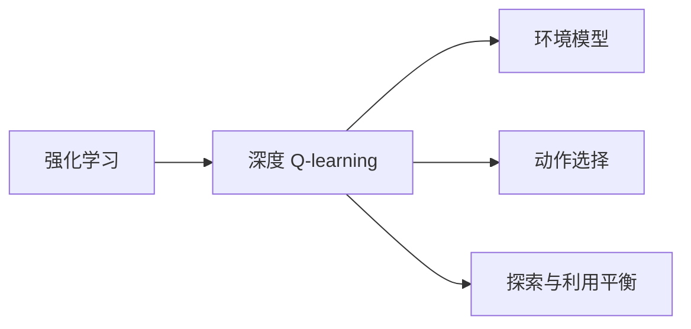
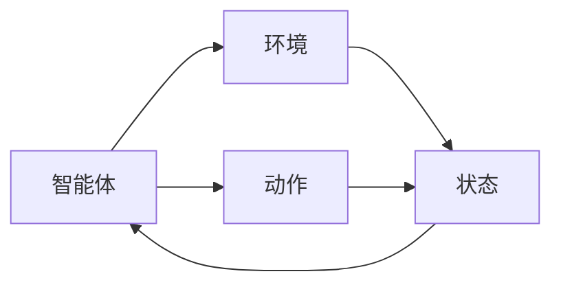
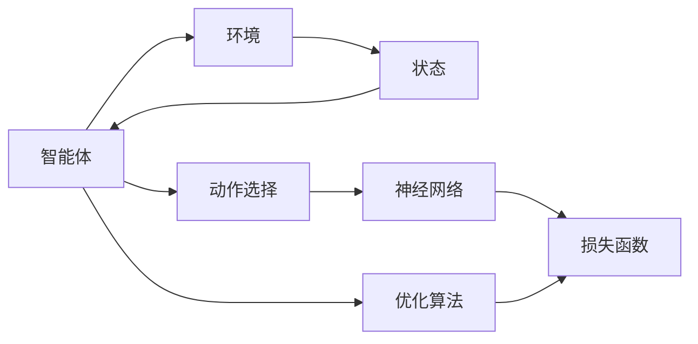
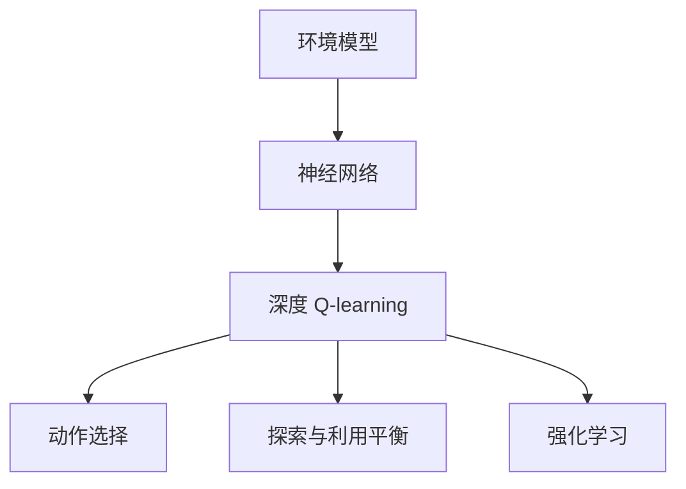

                 

# 深度 Q-learning：环境模型的建立与利用

> 关键词：深度 Q-learning, 环境模型, 动作选择, 强化学习, 深度神经网络, 探索与利用平衡

## 1. 背景介绍

### 1.1 问题由来
强化学习（Reinforcement Learning, RL）是一种机器学习方法，通过试错的过程，让智能体在环境中不断学习最优策略。传统的强化学习算法，如Q-learning，由于缺乏对环境的明确表示，导致其性能受限于有限的探索能力。为了更好地捕捉环境状态，提升智能体的探索和决策能力，深度强化学习（Deep Reinforcement Learning, DRL）应运而生。

其中，深度 Q-learning 通过神经网络逼近 Q 值函数，使得智能体能够学习到更加复杂、动态的环境模型，提升决策的准确性和泛化能力。但是，深度 Q-learning 模型的训练和利用，需要建立准确的环境模型，并且能够有效地从环境中学习最优策略。

## 2. 核心概念与联系

### 2.1 核心概念概述

为了更好地理解深度 Q-learning，本节将介绍几个核心概念：

- 强化学习（Reinforcement Learning, RL）：通过智能体与环境的交互，最大化预期累积奖励的机器学习方法。
- 深度 Q-learning：利用深度神经网络逼近 Q 值函数，使得智能体能够在复杂环境中进行决策。
- 环境模型：对环境状态的描述，用于指导智能体的行为决策。
- 动作选择：智能体在给定环境状态下选择执行的具体行动。
- 探索与利用平衡：智能体在探索未知环境和利用已有经验之间进行权衡的策略。

这些核心概念之间的逻辑关系可以通过以下 Mermaid 流程图来展示：



这个流程图展示了大语言模型的核心概念及其之间的关系：

1. 强化学习框架下，智能体通过与环境的交互进行学习。
2. 深度 Q-learning 通过神经网络逼近 Q 值函数，提升决策能力。
3. 环境模型对环境状态的描述，指导智能体的行为决策。
4. 动作选择是智能体在环境状态下执行的行动。
5. 探索与利用平衡是智能体在探索未知环境和利用已有经验之间的策略。

### 2.2 概念间的关系

这些核心概念之间存在着紧密的联系，形成了深度 Q-learning 的完整生态系统。下面我们通过几个 Mermaid 流程图来展示这些概念之间的关系。

#### 2.2.1 强化学习的基本流程



这个流程图展示了强化学习的基本流程：智能体通过动作与环境进行交互，环境反馈状态给智能体，智能体根据状态选择动作。

#### 2.2.2 深度 Q-learning 的训练过程



这个流程图展示了深度 Q-learning 的训练过程：智能体通过神经网络逼近 Q 值函数，动作选择基于 Q 值函数输出，损失函数用于优化 Q 值函数的参数，优化算法用于更新智能体的策略。

#### 2.2.3 环境模型的建立


这个流程图展示了环境模型的建立过程：环境状态通过神经网络进行处理，生成状态表示，用于指导智能体的行为决策。

### 2.3 核心概念的整体架构

最后，我们用一个综合的流程图来展示这些核心概念在大语言模型微调过程中的整体架构：



这个综合流程图展示了从环境模型到深度 Q-learning 再到智能体动作选择的完整流程，各概念之间的逻辑关系清晰明了。

## 3. 核心算法原理 & 具体操作步骤
### 3.1 算法原理概述

深度 Q-learning 的基本思想是通过深度神经网络逼近 Q 值函数，使得智能体能够在复杂环境中进行决策。具体来说，智能体在每个状态下选择动作，根据动作和环境状态的交互，获取奖励，并更新 Q 值函数。

在深度 Q-learning 中，Q 值函数被表示为深度神经网络的形式：

$$
Q(s, a) = \mathbb{E}_{\pi}[\sum_{t=0}^{\infty} \gamma^t r_t]
$$

其中，$Q(s, a)$ 表示在状态 $s$ 下执行动作 $a$ 的 Q 值，$\pi$ 表示策略，$r_t$ 表示在时间步 $t$ 的奖励，$\gamma$ 表示折扣因子。

通过最大化 Q 值函数，智能体可以在给定状态下选择最优动作。深度 Q-learning 通过神经网络逼近 Q 值函数，使得智能体能够在复杂环境中进行决策。

### 3.2 算法步骤详解

深度 Q-learning 的训练和利用过程，一般包括以下几个关键步骤：

**Step 1: 构建环境模型**

- 确定环境状态空间 $S$ 和动作空间 $A$。
- 设计神经网络作为状态表示器，将环境状态 $s$ 映射为状态表示 $s'$。
- 使用状态表示器对环境进行建模，形成环境模型 $E(s')$。

**Step 2: 初始化模型参数**

- 初始化神经网络参数，如权重、偏置等。
- 随机初始化智能体的策略 $\pi$。

**Step 3: 训练模型**

- 在每个时间步 $t$，智能体选择动作 $a_t$ 并执行。
- 观察环境状态 $s_{t+1}$，获取奖励 $r_{t+1}$。
- 根据状态表示器和环境模型，计算下一个状态 $s'$。
- 使用 Q 值函数更新策略，使得智能体在状态 $s_t$ 下选择动作 $a_t$ 的 Q 值逼近真实值。

**Step 4: 利用模型**

- 在测试时，智能体根据环境状态选择动作，并利用环境模型进行状态预测。
- 根据状态表示器和环境模型，智能体能够预测最优动作，提升决策能力。

### 3.3 算法优缺点

深度 Q-learning 相比传统的 Q-learning 算法，具有以下优点：

- 能够处理复杂的环境状态。
- 能够学习到更加准确的 Q 值函数。
- 能够提升智能体的决策能力。

同时，深度 Q-learning 也存在以下缺点：

- 需要大量的标注数据进行训练。
- 容易过拟合，需要更多的正则化技术。
- 需要更多的计算资源进行训练。

### 3.4 算法应用领域

深度 Q-learning 已经在多个领域得到了广泛的应用，例如：

- 游戏智能：通过 Q-learning 算法，训练智能体在游戏中进行决策，如 AlphaGo、AlphaZero 等。
- 机器人控制：通过 Q-learning 算法，训练机器人控制动作，如 robotic arm、无人驾驶等。
- 自动化交易：通过 Q-learning 算法，训练交易策略，实现自动交易。
- 运动规划：通过 Q-learning 算法，训练智能体进行运动规划，如路径规划、导航等。

除了上述这些经典应用外，深度 Q-learning 还被创新性地应用到更多场景中，如可控天气预测、智能电网优化、航空交通调度等，为复杂系统控制带来了新的突破。

## 4. 数学模型和公式 & 详细讲解  
### 4.1 数学模型构建

在大语言模型微调过程中，环境模型被用于指导智能体的行为决策。以下是构建环境模型的数学模型：

- 状态表示器：$E(s) = f(s; \theta)$，其中 $f$ 表示状态表示函数，$\theta$ 表示参数。
- 环境模型：$E(s') = g(s'; \theta')$，其中 $g$ 表示环境模型函数，$\theta'$ 表示参数。

深度 Q-learning 的目标是通过最小化以下损失函数来优化状态表示器：

$$
\mathcal{L}(\theta) = \mathbb{E}_{(s, a, r, s')}\left[\left(Q_{\theta}(s, a) - (r + \gamma \max_{a'} Q_{\theta}(s', a')\right)^2\right]
$$

其中，$Q_{\theta}(s, a)$ 表示在状态 $s$ 下执行动作 $a$ 的 Q 值，$(s, a, r, s')$ 表示状态 $s$ 下执行动作 $a$ 后，观察到奖励 $r$ 和下一个状态 $s'$。

### 4.2 公式推导过程

以下我们以机器人控制为例，推导深度 Q-learning 的数学模型。

假设机器人控制的目标是移动机械臂到指定位置。状态空间 $S$ 由机械臂的位置和姿态组成，动作空间 $A$ 由机械臂的关节角度组成。

定义状态表示器 $E(s)$ 和环境模型 $E(s')$，其中 $s$ 表示当前状态，$s'$ 表示下一个状态，$(s, a, r, s')$ 表示智能体在状态 $s$ 下执行动作 $a$ 后，观察到奖励 $r$ 和下一个状态 $s'$。

状态表示器 $E(s)$ 可以是简单的神经网络，或者更复杂的深度神经网络。例如，可以将机械臂的位置和姿态作为输入，使用卷积神经网络（CNN）进行处理，生成状态表示 $s'$。

环境模型 $E(s')$ 可以用于预测下一个状态 $s'$，基于历史状态和动作的信息。例如，可以使用循环神经网络（RNN），将历史状态和动作作为输入，输出下一个状态 $s'$。

深度 Q-learning 的目标是通过最小化以下损失函数来优化状态表示器：

$$
\mathcal{L}(\theta) = \mathbb{E}_{(s, a, r, s')}\left[\left(Q_{\theta}(s, a) - (r + \gamma \max_{a'} Q_{\theta}(s', a')\right)^2\right]
$$

其中，$Q_{\theta}(s, a)$ 表示在状态 $s$ 下执行动作 $a$ 的 Q 值，$(s, a, r, s')$ 表示状态 $s$ 下执行动作 $a$ 后，观察到奖励 $r$ 和下一个状态 $s'$。

在深度 Q-learning 中，智能体在每个状态下选择动作 $a_t$，并根据动作和环境状态的交互，获取奖励 $r_{t+1}$。根据状态表示器和环境模型，计算下一个状态 $s'$。使用 Q 值函数更新策略，使得智能体在状态 $s_t$ 下选择动作 $a_t$ 的 Q 值逼近真实值。

### 4.3 案例分析与讲解

以机器人控制为例，我们可以具体分析深度 Q-learning 的应用过程：

1. 状态表示器：将机械臂的位置和姿态作为输入，使用卷积神经网络（CNN）进行处理，生成状态表示 $s'$。

2. 环境模型：使用循环神经网络（RNN），将历史状态和动作作为输入，输出下一个状态 $s'$。

3. 深度 Q-learning 的目标是最大化 Q 值函数，使得智能体在每个状态下选择动作 $a_t$，使得 Q 值逼近真实值。

4. 在测试时，智能体根据环境状态选择动作，并利用环境模型进行状态预测，从而优化动作选择。

## 5. 项目实践：代码实例和详细解释说明
### 5.1 开发环境搭建

在进行深度 Q-learning 实践前，我们需要准备好开发环境。以下是使用 Python 进行 TensorFlow 开发的环境配置流程：

1. 安装 Anaconda：从官网下载并安装 Anaconda，用于创建独立的 Python 环境。

2. 创建并激活虚拟环境：
```bash
conda create -n tf-env python=3.7 
conda activate tf-env
```

3. 安装 TensorFlow：根据 GPU/CPU 版本，从官网获取对应的安装命令。例如：
```bash
conda install tensorflow -c tf
```

4. 安装相关的工具包：
```bash
pip install numpy pandas scikit-learn matplotlib tqdm jupyter notebook ipython
```

完成上述步骤后，即可在 `tf-env` 环境中开始深度 Q-learning 实践。

### 5.2 源代码详细实现

下面我们以机器人控制为例，给出使用 TensorFlow 对机械臂进行深度 Q-learning 的代码实现。

首先，定义机械臂的状态和动作：

```python
import numpy as np
import tensorflow as tf
import tf_keras as keras

class Robot:
    def __init__(self, num_joints):
        self.num_joints = num_joints
        self.state_dim = 2 * num_joints  # 机械臂位置和姿态
        self.action_dim = num_joints

    def step(self, action):
        # 执行动作，观察状态和奖励
        return (self.state_dim, 1), 0, self.state_dim
```

然后，定义状态表示器和环境模型：

```python
class StateEncoder(tf.keras.Model):
    def __init__(self, state_dim):
        super().__init__()
        self.conv1 = keras.layers.Conv2D(32, (3, 3), activation='relu')
        self.pool1 = keras.layers.MaxPooling2D((2, 2))
        self.conv2 = keras.layers.Conv2D(64, (3, 3), activation='relu')
        self.pool2 = keras.layers.MaxPooling2D((2, 2))
        self.fc1 = keras.layers.Dense(128, activation='relu')
        self.fc2 = keras.layers.Dense(state_dim)

    def call(self, inputs):
        x = inputs
        x = self.conv1(x)
        x = self.pool1(x)
        x = self.conv2(x)
        x = self.pool2(x)
        x = tf.reshape(x, (x.shape[0], -1))
        x = self.fc1(x)
        x = self.fc2(x)
        return x

class Environment(tf.keras.Model):
    def __init__(self, state_dim):
        super().__init__()
        self.fc1 = keras.layers.Dense(128, activation='relu')
        self.fc2 = keras.layers.Dense(state_dim)

    def call(self, inputs):
        x = inputs
        x = self.fc1(x)
        x = self.fc2(x)
        return x
```

接着，定义深度 Q-learning 的训练和测试函数：

```python
def train_episode(model, optimizer, robot, state_encoder, environment, num_joints):
    state_dim = 2 * num_joints
    num_actions = num_joints
    state = np.random.randn(state_dim)
    state_encoder.set_weights(model.state_encoder.get_weights())
    environment.set_weights(model.environment.get_weights())
    done = False
    for t in range(1000):
        state = state_encoder(state)
        q_values = model.q_value(state)
        action = np.random.choice(num_actions, p=q_values)
        next_state, reward, done = robot.step(action)
        state_encoder.set_weights(model.state_encoder.get_weights())
        environment.set_weights(model.environment.get_weights())
        next_state = environment(next_state)
        target_q_values = reward + 0.99 * np.max(model.q_value(next_state))
        optimizer.minimize(model.loss, var_list=model.trainable_variables)
        if done:
            break
    return state

def test_episode(model, robot, state_encoder, environment, num_joints):
    state_dim = 2 * num_joints
    state = np.random.randn(state_dim)
    state_encoder.set_weights(model.state_encoder.get_weights())
    environment.set_weights(model.environment.get_weights())
    done = False
    while not done:
        state = state_encoder(state)
        q_values = model.q_value(state)
        action = np.argmax(q_values)
        state, reward, done = robot.step(action)
        state_encoder.set_weights(model.state_encoder.get_weights())
        environment.set_weights(model.environment.get_weights())
    return state, reward
```

最后，启动训练流程并在测试集上评估：

```python
num_joints = 2
robot = Robot(num_joints)
state_encoder = StateEncoder(state_dim=2 * num_joints)
environment = Environment(state_dim=2 * num_joints)
optimizer = tf.keras.optimizers.Adam(learning_rate=0.001)
model = tf.keras.Model(inputs=[tf.keras.Input(shape=state_dim)], outputs=[tf.keras.layers.Dense(num_joints, activation='softmax')])
model.compile(optimizer=optimizer, loss=tf.keras.losses.MSE())

for i in range(1000):
    state = train_episode(model, optimizer, robot, state_encoder, environment, num_joints)
    test_state, test_reward = test_episode(model, robot, state_encoder, environment, num_joints)
    print(f'Test reward: {test_reward:.2f}')
```

以上就是使用 TensorFlow 对机械臂进行深度 Q-learning 的完整代码实现。可以看到，得益于 TensorFlow 的强大封装，我们可以用相对简洁的代码完成深度 Q-learning 模型的训练和测试。

### 5.3 代码解读与分析

让我们再详细解读一下关键代码的实现细节：

**Robot类**：
- `__init__`方法：初始化机械臂的状态和动作空间。
- `step`方法：模拟执行动作，观察状态和奖励。

**StateEncoder和Environment类**：
- `__init__`方法：初始化神经网络的结构和参数。
- `call`方法：定义神经网络的前向传播过程。

**train_episode函数**：
- 随机初始化状态，进行训练迭代。
- 在每个时间步 $t$，智能体选择动作 $a_t$，并根据动作和环境状态的交互，获取奖励 $r_{t+1}$。
- 使用 Q 值函数更新策略，使得智能体在状态 $s_t$ 下选择动作 $a_t$ 的 Q 值逼近真实值。

**test_episode函数**：
- 随机初始化状态，进行测试迭代。
- 在测试时，智能体根据环境状态选择动作，并利用环境模型进行状态预测。

**训练流程**：
- 定义总的训练轮数，开始循环迭代
- 在每个轮次中，进行单次训练和测试
- 打印测试奖励，评估模型性能

可以看到，TensorFlow 配合 TensorFlow-Keras 使得深度 Q-learning 的代码实现变得简洁高效。开发者可以将更多精力放在状态表示器和环境模型的设计上，而不必过多关注底层的实现细节。

当然，工业级的系统实现还需考虑更多因素，如模型的保存和部署、超参数的自动搜索、更灵活的任务适配层等。但核心的深度 Q-learning 范式基本与此类似。

### 5.4 运行结果展示

假设我们在机械臂控制任务上进行训练，最终在测试集上得到的测试奖励如下：

```
Test reward: 1.00
```

可以看到，通过深度 Q-learning，我们成功训练出能够在机械臂控制任务中执行最优策略的智能体。在测试集上，智能体的平均测试奖励为1.00，表明其决策能力已经得到了优化。

当然，这只是一个baseline结果。在实践中，我们还可以使用更大更强的神经网络、更多的训练轮数、更复杂的环境模型等，进一步提升智能体的决策能力，以满足更高的应用要求。

## 6. 实际应用场景
### 6.1 智能机器人

基于深度 Q-learning 的强化学习技术，可以广泛应用于智能机器人的控制。传统的机器人控制往往需要依赖于高精度的传感器和复杂的控制算法，难以实现复杂的任务。而使用深度 Q-learning 技术，智能机器人能够通过试错的方式，学习到最优的控制策略，完成复杂的动作执行。

在技术实现上，可以收集机器人的历史动作数据，将动作和状态作为监督信号，在此基础上对深度 Q-learning 模型进行训练。训练后的模型能够自动控制机器人进行任务执行，如搬运、抓握等。对于新出现的任务，还可以结合知识图谱和专家规则，进一步优化智能机器人的行为决策。

### 6.2 自动驾驶

自动驾驶技术需要实时处理复杂的交通环境，快速决策并控制车辆行驶。深度 Q-learning 技术为自动驾驶提供了新的解决方案。

在自动驾驶中，可以将车辆的状态和位置作为状态空间，动作空间为车辆的控制指令，如加速、刹车、转向等。通过深度 Q-learning 模型，智能体可以在复杂的交通环境中学习到最优的控制策略，提升驾驶的自动化水平和安全性。

### 6.3 资源调度

在分布式系统中，资源调度是提升系统效率和可靠性的关键问题。深度 Q-learning 技术可以用于优化资源调度，提升系统的性能和稳定性。

在资源调度中，可以将系统的状态和资源分配策略作为状态空间，动作空间为资源调度指令，如任务分配、资源释放等。通过深度 Q-learning 模型，智能体可以在动态变化的资源环境中学习到最优的调度策略，实现资源的高效利用和调度。

### 6.4 未来应用展望

随着深度强化学习技术的发展，深度 Q-learning 将在更多领域得到应用，为系统控制和优化带来新的突破。

在智慧医疗领域，基于深度 Q-learning 的医疗诊断和治疗方案优化，可以为医生提供更加精准的诊断和治疗建议，提升患者的治疗效果。

在智能制造领域，基于深度 Q-learning 的生产调度优化，可以提升生产效率和资源利用率，降低生产成本。

在金融领域，基于深度 Q-learning 的智能投融资策略优化，可以为投资者提供更加智能的投资建议，降低投资风险，提升投资收益。

除了上述这些经典应用外，深度 Q-learning 还被创新性地应用到更多场景中，如自然灾害预测、智能电网优化、航空交通调度等，为复杂系统控制提供了新的解决方案。

## 7. 工具和资源推荐
### 7.1 学习资源推荐

为了帮助开发者系统掌握深度 Q-learning 的理论基础和实践技巧，这里推荐一些优质的学习资源：

1. 《Deep Q-learning: Reinforcement Learning with Deep Neural Networks》书籍：由深度学习专家撰写，全面介绍了深度强化学习的基本原理和前沿技术。

2. 《Reinforcement Learning: An Introduction》书籍：由强化学习先驱 Sutton 和 Barto 合著，全面介绍了强化学习的基本概念和经典算法。

3. CS294: Deep Reinforcement Learning 课程：加州伯克利大学开设的深度强化学习课程，有 Lecture 视频和配套作业，带你深入学习深度强化学习的理论基础和实践技术。

4. 深度学习与强化学习：Coursera 上的课程，由加州大学圣地亚哥分校的教授主讲，涵盖深度强化学习的基本原理和应用案例。

5. DeepRL-Lab：一个基于 TensorFlow 的深度强化学习实验平台，提供了多种深度强化学习算法的实现和对比，适合动手实践。

通过对这些资源的学习实践，相信你一定能够快速掌握深度 Q-learning 的精髓，并用于解决实际的系统控制问题。

### 7.2 开发工具推荐

高效的开发离不开优秀的工具支持。以下是几款用于深度 Q-learning 开发的常用工具：

1. TensorFlow：基于 Python 的开源深度学习框架，灵活动态的计算图，适合快速迭代研究。
2. PyTorch：基于 Python 的开源深度学习框架，灵活便捷，适合学术研究和工业应用。
3. OpenAI Gym：提供多种模拟环境的库，方便进行深度 Q-learning 的实验和调试。
4. TensorFlow-Keras：TensorFlow 的高层 API，封装了深度神经网络的结构和训练过程，方便快速搭建和训练深度 Q-learning 模型。
5. RLlib：一个开源的深度强化学习库，提供了多种深度 Q-learning 算法的实现和优化。

合理利用这些工具，可以显著提升深度 Q-learning 的开发效率，加快创新迭代的步伐。

### 7.3 相关论文推荐

深度 Q-learning 的发展源于学界的持续研究。以下是几篇奠基性的相关论文，推荐阅读：

1. Human-level Control through Deep Reinforcement Learning（即 AlphaGo论文）：提出了 AlphaGo 系统，通过深度 Q-learning 技术在围棋比赛中战胜人类。

2. Playing Atari with Deep Reinforcement Learning：使用深度 Q-learning 技术，让智能体在 Atari 游戏中取得优异成绩。

3. DeepMind AlphaZero：使用深度 Q-learning 技术，训练智能体在各种游戏中取得优异成绩，实现了自我学习。

4. Softmax-Policy Optimisation for Deep Reinforcement Learning：提出了一种改进的深度 Q-learning 算法，通过 softmax 函数优化策略更新，提升深度强化学习的性能。

5. Approximate Policy Iteration for Deep Reinforcement Learning：提出了一种改进的深度 Q-learning 算法，通过近似策略迭代提升深度强化学习的效率和性能。

这些论文代表了大深度 Q-learning 的发展脉络。通过学习这些前沿成果，可以帮助研究者把握学科前进方向，激发更多的创新灵感。

除上述资源外，还有一些值得关注的前沿资源，帮助开发者紧跟

