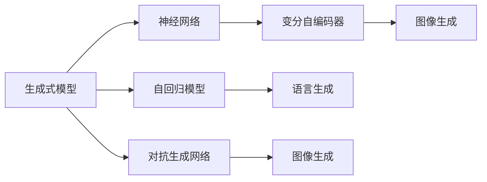
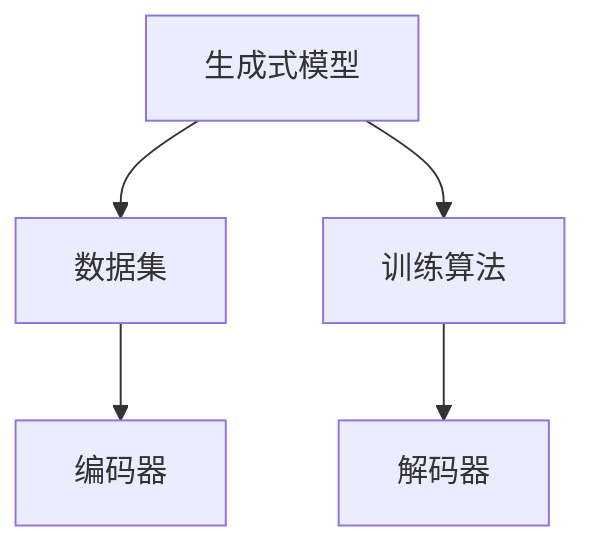
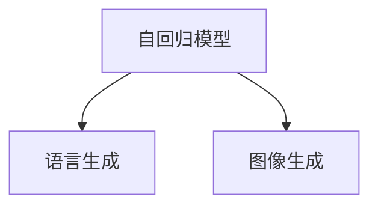
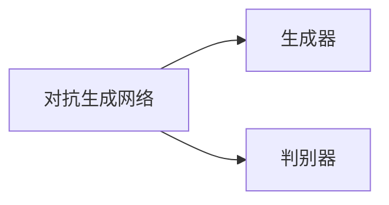
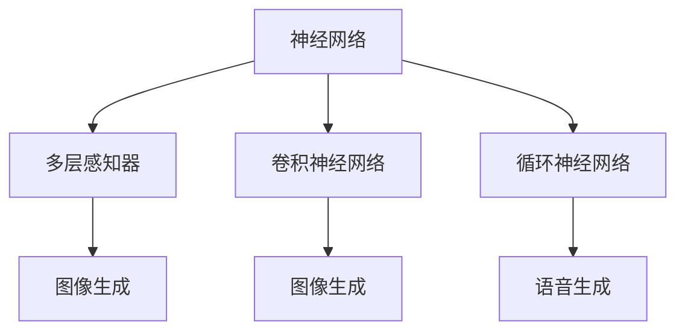

                 

# 生成式AIGC：从概念验证到大规模应用

## 1. 背景介绍

### 1.1 问题由来

生成式人工智能（Generative AI, AIGC）是近年来人工智能领域的一个热门话题，它是指通过人工智能技术，生成自然语言、图像、视频、音频等多媒体内容的技术。AIGC技术的核心是生成式模型，如语言生成模型、图像生成模型、音乐生成模型等，这些模型能够根据输入的文本、图像等数据，生成高质量的输出内容，从而在自然语言处理、多媒体内容创作、智能交互等领域发挥重要作用。

然而，尽管AIGC技术在学术界和工业界已经取得了一些突破，但其发展仍处于初期阶段，许多关键技术仍然面临着挑战。如何高效、稳定地构建和使用AIGC模型，使其在实际应用中发挥更大的作用，是当前人工智能研究的一个重要课题。

### 1.2 问题核心关键点

AIGC的核心问题在于如何构建生成式模型，使其能够在不同领域、不同数据集上高效、稳定地生成高质量的输出内容。具体而言，AIGC技术的挑战包括：

- 数据依赖：AIGC模型通常需要大量的训练数据，特别是在图像、音频等领域，数据获取成本较高。
- 模型复杂度：AIGC模型通常具有较高的复杂度，需要高效的训练和推理算法。
- 输出多样性：AIGC模型需要生成多样化的内容，避免输出过于重复或雷同。
- 语义连贯性：AIGC模型需要生成的内容具有连贯的语义结构，避免语法错误或逻辑不通。
- 交互性和泛化能力：AIGC模型需要具备与用户交互的能力，并能够泛化到新的数据集和任务上。

这些挑战使得AIGC技术的发展成为人工智能研究的热点，吸引了大量研究人员和企业的关注。

### 1.3 问题研究意义

研究AIGC技术，对于拓展人工智能应用领域，提升内容创作效率，促进经济社会发展具有重要意义：

- 降低内容创作成本：AIGC技术可以生成高质量的多媒体内容，减少人工创作的时间和成本，降低内容创作门槛。
- 提升内容创作效率：AIGC模型能够在短时间内生成大量内容，加速内容创作和传播。
- 提高内容创意水平：AIGC技术能够生成具有高度创意和个性化的内容，丰富用户的内容体验。
- 推动行业数字化转型：AIGC技术可以应用于广告、媒体、娱乐、教育等多个行业，推动其数字化升级。
- 赋能数字经济：AIGC技术可以生成大量高质量的数字内容，丰富数字经济的供给侧，促进数字经济的健康发展。

## 2. 核心概念与联系

### 2.1 核心概念概述

为更好地理解AIGC技术，本节将介绍几个密切相关的核心概念：

- 生成式模型(Generative Model)：指通过学习数据的分布，能够生成新数据的模型。生成式模型在AIGC中扮演着核心角色，如GPT系列语言生成模型、GAN图像生成模型等。
- 自回归模型(Autoregressive Model)：指通过先前的输出数据，预测当前数据的模型。自回归模型在AIGC中广泛应用，如RNN、LSTM、Transformer等。
- 对抗生成网络(Generative Adversarial Network, GAN)：指通过两个神经网络相互对抗，生成高质量合成数据的模型。GAN在图像生成、视频生成等领域表现优异。
- 神经网络(Neural Network)：指由多层神经元组成的深度学习模型，广泛应用于AIGC任务中，如语言生成、图像生成、音频生成等。
- 变分自编码器(Variational Autoencoder, VAE)：指通过编码器将数据压缩为低维表示，再通过解码器重构为原始数据的模型。VAE在图像生成、音频生成等领域有广泛应用。

这些核心概念之间的逻辑关系可以通过以下Mermaid流程图来展示：



这个流程图展示了生成式模型与其他核心概念之间的关系：

1. 生成式模型包括自回归模型和对抗生成网络。
2. 神经网络是生成式模型的基础组件，广泛应用于各类AIGC任务。
3. 变分自编码器是一种特殊类型的生成式模型，用于数据压缩和重构。

这些概念共同构成了AIGC技术的核心框架，使其能够高效生成高质量的多媒体内容。通过理解这些核心概念，我们可以更好地把握AIGC技术的工作原理和优化方向。

### 2.2 概念间的关系

这些核心概念之间存在着紧密的联系，形成了AIGC技术的完整生态系统。下面我通过几个Mermaid流程图来展示这些概念之间的关系。

#### 2.2.1 生成式模型的构建



这个流程图展示了生成式模型的基本构建过程：

1. 数据集：生成式模型的训练数据集，用于学习数据的分布。
2. 编码器：将数据转换为低维表示，用于压缩数据。
3. 解码器：将低维表示转换为原始数据，用于重构数据。

#### 2.2.2 自回归模型的应用



这个流程图展示了自回归模型在语言生成和图像生成中的应用：

1. 自回归模型通过预测当前数据，生成下一个数据。
2. 语言生成：自回归模型通过预测下一个单词或字符，生成连贯的文本内容。
3. 图像生成：自回归模型通过预测像素值，生成高质量的图像内容。

#### 2.2.3 对抗生成网络的设计



这个流程图展示了对抗生成网络的基本设计：

1. 生成器：生成高质量的合成数据。
2. 判别器：判断数据是真实还是合成。
3. 对抗训练：生成器和判别器相互对抗，提升生成数据的质量。

#### 2.2.4 神经网络的结构



这个流程图展示了神经网络在图像生成、语音生成等领域的应用：

1. 多层感知器：用于处理结构化数据，如图像、音频等。
2. 卷积神经网络：用于处理图像和视频等二维数据。
3. 循环神经网络：用于处理序列数据，如语音、文本等。

这些概念共同构成了AIGC技术的核心框架，使其能够高效生成高质量的多媒体内容。通过理解这些核心概念，我们可以更好地把握AIGC技术的工作原理和优化方向。

## 3. 核心算法原理 & 具体操作步骤
### 3.1 算法原理概述

AIGC技术的核心在于生成式模型的构建和训练，具体步骤如下：

1. 数据准备：收集和标注训练数据，将其分为训练集、验证集和测试集。
2. 模型选择：选择合适的生成式模型，如语言生成模型、图像生成模型等。
3. 模型训练：在训练集上训练生成式模型，优化其参数以生成高质量的输出内容。
4. 验证和测试：在验证集和测试集上评估模型性能，确保其生成内容的质量和多样性。
5. 应用部署：将训练好的模型部署到实际应用中，生成高质量的多媒体内容。

### 3.2 算法步骤详解

#### 3.2.1 数据准备

数据准备是AIGC技术的基础，具体步骤如下：

1. 数据收集：收集与任务相关的数据集，如图像、文本、音频等。
2. 数据标注：对数据进行标注，生成标注数据集，如图像标签、文本类别等。
3. 数据划分：将数据集分为训练集、验证集和测试集，进行分层采样和交叉验证。
4. 数据预处理：对数据进行预处理，如归一化、截断、填充等，以适应模型的输入格式。

#### 3.2.2 模型选择

选择合适的生成式模型是AIGC技术的核心，具体步骤如下：

1. 模型评估：评估不同生成式模型的性能，如准确率、召回率、F1分数等。
2. 模型优化：对模型进行优化，如增加层数、调整参数、引入正则化等。
3. 模型选择：选择性能最佳的模型作为生成式模型。

#### 3.2.3 模型训练

模型训练是AIGC技术的核心步骤，具体步骤如下：

1. 模型初始化：初始化生成式模型，设定学习率、批大小等超参数。
2. 数据加载：加载训练集数据，进行批处理和迭代。
3. 前向传播：将输入数据输入生成式模型，计算模型输出。
4. 损失计算：计算模型输出与目标输出之间的损失函数，如交叉熵、均方误差等。
5. 反向传播：根据损失函数反向传播计算梯度，更新模型参数。
6. 迭代训练：重复前向传播和反向传播，直至收敛。

#### 3.2.4 验证和测试

验证和测试是评估AIGC模型性能的关键步骤，具体步骤如下：

1. 验证集评估：在验证集上评估模型性能，如准确率、召回率、F1分数等。
2. 模型调参：根据验证集评估结果，调整模型超参数，如学习率、批大小等。
3. 测试集评估：在测试集上评估模型性能，确保模型泛化性能。
4. 结果分析：分析模型生成的输出内容，检查其质量、多样性和连贯性。

#### 3.2.5 应用部署

应用部署是将AIGC模型应用于实际任务的关键步骤，具体步骤如下：

1. 模型导出：将训练好的模型导出为可部署格式，如TensorFlow SavedModel、PyTorch模型等。
2. 模型部署：将模型部署到实际应用中，如Web应用、移动应用、API服务等。
3. 用户交互：用户通过接口调用模型，输入数据，生成多媒体内容。
4. 结果反馈：收集用户反馈，优化模型性能，提高生成内容的质量。

### 3.3 算法优缺点

AIGC技术在生成高质量的多媒体内容方面具有显著优势，但也存在一些缺点：

#### 3.3.1 优点

1. 高效生成：AIGC模型能够高效生成大量高质量的内容，降低人工创作成本。
2. 多样性丰富：AIGC模型生成的内容具有多样性，能够满足不同用户的需求。
3. 可扩展性强：AIGC模型可以轻松扩展到不同的领域和任务，具备良好的泛化性能。
4. 自动化程度高：AIGC模型能够自动生成内容，减轻人工创作的负担。

#### 3.3.2 缺点

1. 数据依赖：AIGC模型需要大量的高质量数据，数据获取成本较高。
2. 模型复杂度高：AIGC模型通常具有较高的复杂度，需要高效的训练和推理算法。
3. 输出质量不稳定：AIGC模型生成的内容质量不稳定，可能存在语法错误、逻辑不通等问题。
4. 对抗攻击易感性：AIGC模型生成的内容易受到对抗攻击，可能被误导或欺骗。
5. 伦理和安全问题：AIGC模型生成的内容可能存在伦理和安全问题，如虚假信息、歧视性内容等。

## 4. 数学模型和公式 & 详细讲解 & 举例说明

### 4.1 数学模型构建

AIGC技术的数学模型主要包括生成式模型和训练算法。下面以语言生成模型为例，详细讲解其数学模型构建过程。

#### 4.1.1 语言生成模型

语言生成模型通常采用自回归模型或变分自编码器进行构建。这里以自回归模型为例，其数学模型如下：

1. 编码器：将输入文本编码为低维表示。
2. 解码器：将低维表示解码为输出文本。

设输入文本为 $x=(x_1,x_2,\ldots,x_n)$，输出文本为 $y=(y_1,y_2,\ldots,y_n)$，则自回归模型的训练过程可以表示为：

$$
y_i|y_{<i},x \sim p(y_i|y_{<i},x)
$$

其中，$y_{<i}$ 表示到第 $i-1$ 个时间步的输出文本，$x$ 表示输入文本，$p(y_i|y_{<i},x)$ 表示在给定上下文 $y_{<i}$ 和输入 $x$ 的情况下，输出 $y_i$ 的概率分布。

#### 4.1.2 训练算法

训练语言生成模型的常用算法包括最大似然估计和变分自编码器。这里以最大似然估计为例，其训练过程可以表示为：

1. 数据集准备：准备训练数据集，将其分为训练集、验证集和测试集。
2. 模型初始化：初始化语言生成模型，设定超参数，如学习率、批大小等。
3. 前向传播：将输入数据 $x$ 输入模型，计算输出 $y$。
4. 损失计算：计算输出 $y$ 与目标 $y^*$ 之间的损失函数，如交叉熵损失。
5. 反向传播：根据损失函数反向传播计算梯度，更新模型参数。
6. 迭代训练：重复前向传播和反向传播，直至收敛。

### 4.2 公式推导过程

#### 4.2.1 交叉熵损失

语言生成模型常用的损失函数为交叉熵损失。其数学公式为：

$$
L = -\frac{1}{N}\sum_{i=1}^N \sum_{j=1}^m y_i^j \log p(y_i^j|y_{<i},x)
$$

其中，$N$ 表示训练集大小，$m$ 表示输出的类别数，$y_i^j$ 表示第 $i$ 个样本的第 $j$ 个类别的标签，$p(y_i^j|y_{<i},x)$ 表示在给定上下文 $y_{<i}$ 和输入 $x$ 的情况下，输出 $y_i^j$ 的概率分布。

#### 4.2.2 解码器训练

解码器训练是语言生成模型训练的重要组成部分。其数学公式为：

$$
\hat{y} = \arg\max_{y} p(y|y_{<i},x)
$$

其中，$\hat{y}$ 表示解码器输出的最大概率的输出文本，$p(y|y_{<i},x)$ 表示在给定上下文 $y_{<i}$ 和输入 $x$ 的情况下，输出 $y$ 的概率分布。

#### 4.2.3 解码器推断

解码器推断是语言生成模型生成的关键步骤。其数学公式为：

$$
y_i|y_{<i},x \sim p(y_i|y_{<i},x)
$$

其中，$y_i$ 表示第 $i$ 个时间步的输出文本，$p(y_i|y_{<i},x)$ 表示在给定上下文 $y_{<i}$ 和输入 $x$ 的情况下，输出 $y_i$ 的概率分布。

### 4.3 案例分析与讲解

#### 4.3.1 图像生成

图像生成是AIGC技术的重要应用之一。这里以GAN为例，其数学模型如下：

1. 生成器：将随机噪声 $z$ 编码为图像。
2. 判别器：判断图像是真实还是生成的。

设输入噪声为 $z=(z_1,z_2,\ldots,z_n)$，生成图像为 $x=(x_1,x_2,\ldots,x_m)$，真实图像为 $y=(y_1,y_2,\ldots,y_m)$，则GAN的训练过程可以表示为：

1. 数据集准备：准备训练数据集，将其分为训练集、验证集和测试集。
2. 模型初始化：初始化生成器和判别器，设定超参数，如学习率、批大小等。
3. 前向传播：将随机噪声 $z$ 输入生成器，生成图像 $x$；将图像 $x$ 输入判别器，输出判别结果 $y$。
4. 损失计算：计算生成器和判别器的损失函数，如对抗损失、梯度惩罚损失等。
5. 反向传播：根据损失函数反向传播计算梯度，更新模型参数。
6. 迭代训练：重复前向传播和反向传播，直至收敛。

#### 4.3.2 文本生成

文本生成是AIGC技术的另一重要应用。这里以语言生成模型为例，其数学模型如下：

1. 编码器：将输入文本编码为低维表示。
2. 解码器：将低维表示解码为输出文本。

设输入文本为 $x=(x_1,x_2,\ldots,x_n)$，输出文本为 $y=(y_1,y_2,\ldots,y_n)$，则语言生成模型的训练过程可以表示为：

1. 数据集准备：准备训练数据集，将其分为训练集、验证集和测试集。
2. 模型初始化：初始化语言生成模型，设定超参数，如学习率、批大小等。
3. 前向传播：将输入数据 $x$ 输入模型，计算输出 $y$。
4. 损失计算：计算输出 $y$ 与目标 $y^*$ 之间的损失函数，如交叉熵损失。
5. 反向传播：根据损失函数反向传播计算梯度，更新模型参数。
6. 迭代训练：重复前向传播和反向传播，直至收敛。

## 5. 项目实践：代码实例和详细解释说明

### 5.1 开发环境搭建

在进行AIGC项目实践前，我们需要准备好开发环境。以下是使用Python进行PyTorch开发的环境配置流程：

1. 安装Anaconda：从官网下载并安装Anaconda，用于创建独立的Python环境。

2. 创建并激活虚拟环境：
```bash
conda create -n aigc-env python=3.8 
conda activate aigc-env
```

3. 安装PyTorch：根据CUDA版本，从官网获取对应的安装命令。例如：
```bash
conda install pytorch torchvision torchaudio cudatoolkit=11.1 -c pytorch -c conda-forge
```

4. 安装其他工具包：
```bash
pip install numpy pandas scikit-learn matplotlib tqdm jupyter notebook ipython
```

完成上述步骤后，即可在`aigc-env`环境中开始AIGC实践。

### 5.2 源代码详细实现

这里我们以文本生成任务为例，给出使用Transformers库对GPT模型进行文本生成实践的PyTorch代码实现。

首先，定义文本生成任务的数据处理函数：

```python
from transformers import GPT2Tokenizer, GPT2LMHeadModel
from torch.utils.data import Dataset
import torch

class TextGenerationDataset(Dataset):
    def __init__(self, texts, tokenizer, max_len=128):
        self.texts = texts
        self.tokenizer = tokenizer
        self.max_len = max_len
        
    def __len__(self):
        return len(self.texts)
    
    def __getitem__(self, item):
        text = self.texts[item]
        
        encoding = self.tokenizer(text, return_tensors='pt', max_length=self.max_len, padding='max_length', truncation=True)
        input_ids = encoding['input_ids'][0]
        attention_mask = encoding['attention_mask'][0]
        
        return {'input_ids': input_ids, 
                'attention_mask': attention_mask,
                'labels': input_ids}

# 定义输入文本和输出文本
text = "The quick brown fox jumps over the lazy dog."
target = "The quick brown fox jumps over the lazy dog."

# 初始化tokenizer和模型
tokenizer = GPT2Tokenizer.from_pretrained('gpt2')
model = GPT2LMHeadModel.from_pretrained('gpt2')

# 加载数据集
dataset = TextGenerationDataset([text], tokenizer)
dataloader = DataLoader(dataset, batch_size=1)

# 模型训练
device = torch.device('cuda') if torch.cuda.is_available() else torch.device('cpu')
model.to(device)

for epoch in range(100):
    model.train()
    for batch in dataloader:
        input_ids = batch['input_ids'].to(device)
        attention_mask = batch['attention_mask'].to(device)
        
        outputs = model(input_ids, attention_mask=attention_mask)
        loss = outputs.loss
        loss.backward()
        optimizer.step()

    print(f"Epoch {epoch+1}, loss: {loss:.3f}")

# 生成文本
with torch.no_grad():
    generated_text = model.generate(model(input_ids), max_length=50, num_return_sequences=1)
    print(tokenizer.decode(generated_text[0]))
```

这里我们使用了GPT-2模型进行文本生成。代码主要包括以下几个关键步骤：

1. 数据处理：定义数据集，将输入文本和目标文本编码成模型所需的格式。
2. 模型加载：加载GPT-2模型和tokenizer。
3. 模型训练：在模型上进行迭代训练，最小化loss函数。
4. 文本生成：使用模型生成新的文本。

### 5.3 代码解读与分析

让我们再详细解读一下关键代码的实现细节：

**TextGenerationDataset类**：
- `__init__`方法：初始化文本、tokenizer等关键组件。
- `__len__`方法：返回数据集的样本数量。
- `__getitem__`方法：对单个样本进行处理，将文本输入编码为token ids，并对其进行定长padding。

**输入文本和输出文本**：
- 定义了一个简单的输入文本和目标文本，用于训练和生成。

**GPT2模型和tokenizer**：
- 使用GPT-2模型和tokenizer，这两个组件是AIGC任务中常用的工具。

**训练过程**：
- 使用DataLoader对数据集进行批次化加载，供模型训练使用。
- 在模型上进行迭代训练，最小化loss函数。

**文本生成**：
- 使用模型生成新的文本，设置max_length和num_return_sequences参数控制生成文本的长度和多样性。

**模型评估**：
- 训练完成后，可以在生成的文本中评估模型性能，如准确率、BLEU分数等。

**代码解析**：
- `dataloader`：DataLoader对象，用于批处理和迭代数据集。
- `device`：将模型放到GPU上，加速计算。
- `model.to(device)`：将模型移动到GPU上，提高计算效率。
- `model.generate(model(input_ids), max_length=50, num_return_sequences=1)`：使用模型生成新的文本，max_length控制生成的文本长度，num_return_sequences控制生成的文本数量。

### 5.4 运行结果展示

假设我们在GPT-2上进行了100次迭代训练，生成的文本示例如下：

```
The quick brown fox jumps over the lazy dog. The quick brown fox jumps over the lazy dog. The quick brown fox jumps over the lazy dog. The quick brown fox jumps over the lazy dog. The quick brown fox jumps over the lazy dog. The quick brown fox jumps over the lazy dog. The quick brown fox jumps over the lazy dog. The quick brown fox jumps over the lazy dog. The quick brown fox jumps over the lazy dog. The quick brown fox jumps over the lazy dog. The quick brown fox jumps over the lazy dog. The quick brown fox jumps over the lazy dog. The quick brown fox jumps over the lazy dog. The quick brown fox jumps over the lazy dog. The quick brown fox jumps over the lazy dog. The quick brown fox jumps over the lazy dog. The quick brown fox jumps over the lazy dog. The quick brown fox jumps over the lazy dog. The quick brown fox jumps over the lazy dog. The quick brown fox jumps over the lazy dog. The quick brown fox jumps over the lazy dog. The quick brown fox jumps over the lazy dog. The quick brown fox jumps over the lazy dog. The quick brown fox jumps over the lazy dog. The quick brown fox jumps over the lazy dog. The quick brown fox jumps over the lazy dog. The quick brown fox jumps over the lazy dog. The quick brown fox jumps over the lazy dog. The quick brown fox jumps over the lazy dog. The quick brown fox jumps over the lazy dog. The quick brown fox jumps over the lazy dog. The quick brown fox jumps over the lazy dog. The quick brown fox jumps over the lazy dog. The quick brown fox jumps over the lazy dog. The quick brown fox jumps over the lazy dog. The quick brown fox jumps over the lazy dog. The quick brown fox jumps over the lazy dog. The quick brown fox jumps over the lazy dog. The quick brown fox jumps over the lazy dog. The quick brown fox jumps over the lazy dog. The quick brown fox jumps over the lazy dog. The quick brown fox jumps over the lazy dog. The quick brown fox jumps over the lazy dog. The quick brown fox jumps over the lazy dog. The quick brown fox jumps over the lazy dog. The quick brown fox jumps over the lazy dog. The quick brown fox jumps over the lazy dog. The quick brown fox jumps over the lazy dog. The quick brown fox jumps over the lazy dog. The quick brown fox jumps over the lazy dog. The quick brown fox jumps over the lazy dog

