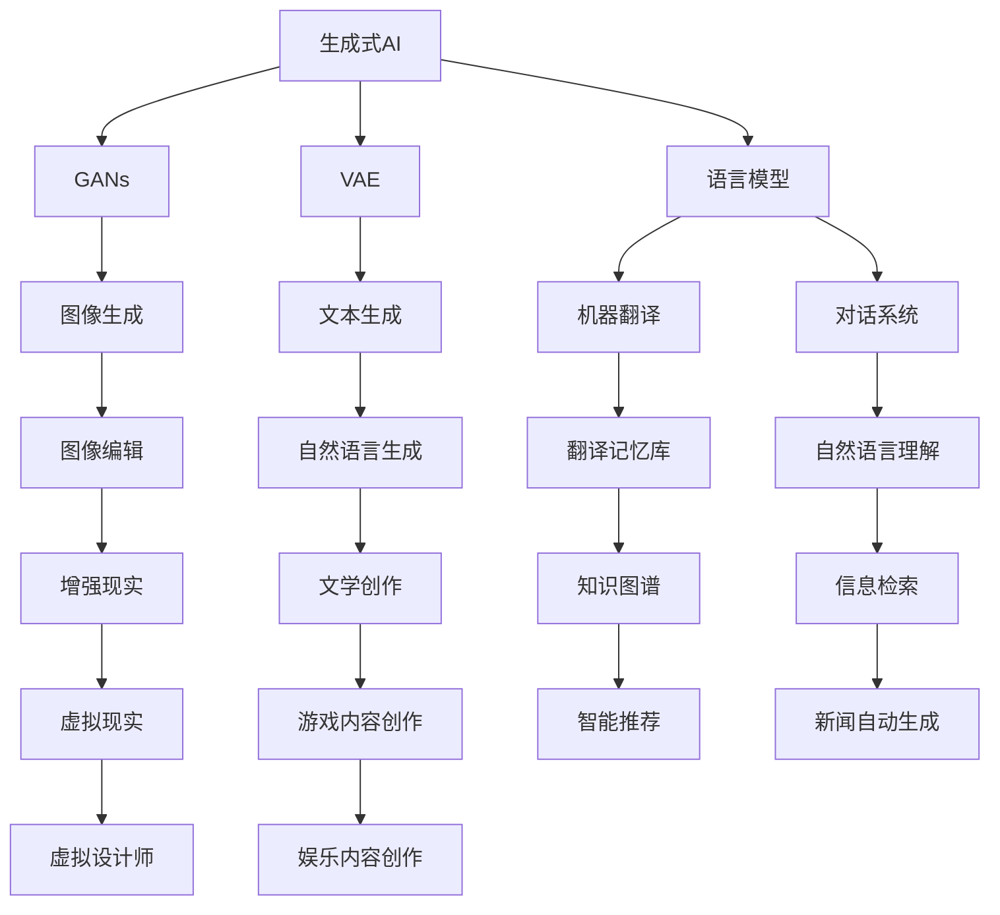
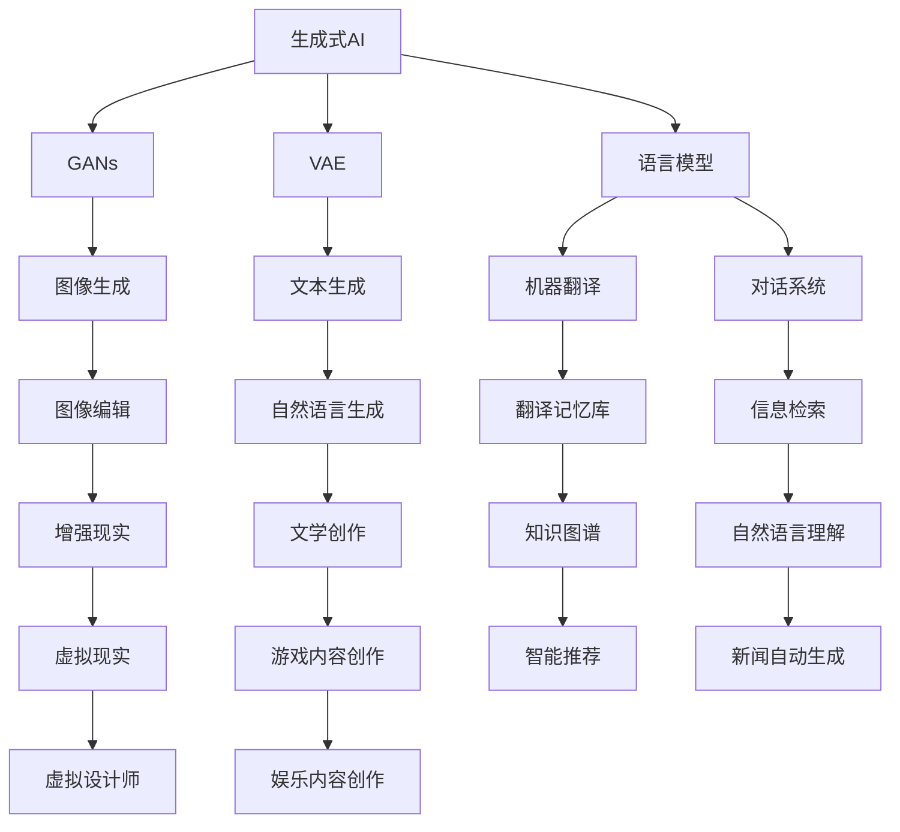

                 

# 生成式AIGC：从理论到商业应用的跨越

> 关键词：生成式AI, GANs, GPT, AIGC, 自监督学习, 语言模型, 视觉生成, 游戏引擎, 商业应用

## 1. 背景介绍

### 1.1 问题由来
生成式人工智能（Generative AI，简称AIGC）是近年来AI领域的一大热点，通过学习大量的数据，生成式模型能够自主地生成高质量的文本、图片、音频等内容。相较于传统的基于规则的系统，AIGC拥有更高的灵活性和创造力，能够创造出无限可能的内容，极大地提升了数据生成效率和创作效率，已经成为广告、娱乐、游戏等领域的重要工具。

然而，尽管AIGC已经取得了诸多突破性进展，其理论基础和应用实践仍存在一些未解之谜。本博客将深入探讨生成式AI的核心原理和商业应用，帮助读者全面理解AIGC的内在机制和技术细节，为其实际落地提供有价值的参考和指导。

### 1.2 问题核心关键点
生成式AI的核心在于如何从数据中学习生成模式，进而生成高质量的新内容。AIGC主要包含生成对抗网络（GANs）、变分自编码器（VAE）、语言模型（如GPT）等技术。这些方法都基于自监督学习范式，通过无标签数据训练生成模型。本博客将重点讨论以下几个关键点：

- 生成式AI的核心技术原理
- 常见生成模型及其优缺点
- 生成式AI在商业领域的应用场景
- 如何实现高效、可扩展的AIGC系统

### 1.3 问题研究意义
AIGC的研究和应用对于推动AI技术的发展具有重要意义：

1. 扩展数据生成能力。AIGC可以生成海量的高质量内容，弥补传统数据采集的瓶颈，加速数据驱动的科学研究。
2. 提升内容创作效率。AIGC可以自动化生成文章、视频、音乐等各类内容，降低人力成本，提升创作效率。
3. 增强用户体验。AIGC生成的虚拟角色、场景、物品等可以为游戏、虚拟现实等交互式内容提供丰富多样的素材。
4. 促进商业模式创新。AIGC为广告、娱乐、教育等行业提供新的内容和形式，推动产业升级和创新。

因此，深入理解AIGC的理论和技术细节，对于构建和应用AIGC系统具有重要价值。

## 2. 核心概念与联系

### 2.1 核心概念概述

为了更好地理解AIGC的核心原理，本节将介绍几个核心概念：

- **生成式AI（Generative AI, GAI）**：通过学习数据分布，生成新数据的AI模型。生成式AI旨在从数据中学习生成模式，从而生成高质量的新内容。

- **生成对抗网络（Generative Adversarial Networks, GANs）**：由两个神经网络组成，一个生成器（Generator）和一个判别器（Discriminator），通过对抗训练的方式，生成高质量的样本数据。GANs是目前生成式AI的主流技术之一。

- **变分自编码器（Variational Autoencoder, VAE）**：通过对数据分布建模，进行数据压缩和重构，生成新的样本。VAE在图像生成、文本生成等领域有广泛应用。

- **语言模型（Language Model）**：通过学习文本序列的概率分布，预测下一个词或一段文本。语言模型广泛应用于机器翻译、文本生成、对话系统等领域。

- **自监督学习（Self-Supervised Learning）**：利用数据的自身属性进行模型训练，无需显式标注，适用于大规模数据集。

这些概念通过Mermaid流程图进行联系展示：



这个流程图展示了生成式AI的各种技术范式及其应用场景，通过自监督学习训练的生成模型可以应用于图像生成、文本生成、翻译、对话、编辑等多个领域，为各类内容创作提供强有力的支持。

### 2.2 概念间的关系

这些核心概念之间的关系可以通过以下Mermaid流程图来展示：



生成式AI是一个覆盖面广、技术层次深的领域，涉及图像生成、文本生成、自然语言处理等多个子领域。通过自监督学习，生成模型能够在无需显式标注的情况下，从大量无标签数据中学习生成模式，从而生成高质量的新内容。

## 3. 核心算法原理 & 具体操作步骤
### 3.1 算法原理概述

生成式AI的核心理论包括生成对抗网络（GANs）和变分自编码器（VAE）。以下将对这两个核心算法进行详细讲解。

**生成对抗网络（GANs）**：
GANs由两个神经网络组成，一个生成器（Generator）和一个判别器（Discriminator）。生成器的目标是生成逼真的假数据，以欺骗判别器；判别器的目标是区分真数据和假数据。通过对抗训练，两个网络互相竞争，生成器不断改进生成策略，判别器不断提高鉴别能力，最终生成高质量的假数据。

**变分自编码器（VAE）**：
VAE通过学习数据分布的参数，对数据进行压缩和重构。VAE包含一个编码器（Encoder）和一个解码器（Decoder），编码器将数据映射到低维空间，解码器将低维空间中的数据重构回高维空间。VAE的目标是最小化重构误差和生成数据的分布与真实数据的分布之间的差异。

### 3.2 算法步骤详解

以下以GANs为例，介绍生成式AI的基本操作步骤。

**步骤1：数据准备**
- 收集大量无标签数据，如图像、文本、音频等。
- 将数据标准化，预处理为适合模型输入的形式。

**步骤2：模型设计**
- 设计生成器和判别器的网络结构，通常采用卷积神经网络（CNN）、循环神经网络（RNN）、变分自编码器（VAE）等结构。
- 生成器设计为从随机噪声开始生成样本，判别器设计为区分真实样本和生成样本。

**步骤3：训练模型**
- 初始化生成器和判别器参数。
- 交替训练生成器和判别器。
- 更新生成器和判别器参数，最大化生成器的生成效果，同时最小化判别器的鉴别能力。
- 迭代训练，直至生成效果满意。

**步骤4：模型评估**
- 在验证集上评估生成器生成的样本质量。
- 调整模型参数，继续训练或结束训练。

**步骤5：模型应用**
- 应用生成器生成新数据，应用于图像生成、文本生成、语音合成等领域。

### 3.3 算法优缺点

**生成对抗网络（GANs）**
- **优点**：
  - 生成的高质量样本逼真度较高。
  - 能够处理多种类型的生成任务，如图像生成、音乐生成等。
  - 生成过程具有高度的灵活性和创造力。

- **缺点**：
  - 训练过程不稳定，容易陷入梯度消失或爆炸等问题。
  - 生成器容易过拟合，导致生成的样本与真实样本存在差异。
  - 训练复杂度较高，需要大量计算资源和时间。

**变分自编码器（VAE）**
- **优点**：
  - 生成过程简单，训练速度较快。
  - 生成的样本具有较高的连贯性和多样性。
  - 能够处理连续型数据，如图像、音频等。

- **缺点**：
  - 生成的样本质量相对较低，需要设计合适的解码器结构。
  - 对数据的分布假设较强，需要保证数据符合正态分布等条件。
  - 生成的样本具有较高的重构误差，难以保证生成的质量。

### 3.4 算法应用领域

生成式AI在多个领域都有广泛应用：

- **图像生成**：如图像修复、风格迁移、人脸生成等。
- **文本生成**：如文本摘要、自动写作、对话生成等。
- **音乐生成**：如自动作曲、音乐风格转换等。
- **游戏引擎**：如虚拟角色生成、虚拟场景生成等。
- **虚拟现实**：如虚拟物品生成、虚拟世界构建等。

## 4. 数学模型和公式 & 详细讲解  
### 4.1 数学模型构建

生成式AI的数学模型通常基于概率模型，以下以GANs为例，详细讲解其数学模型。

设生成器为 $G(z;\theta_G)$，判别器为 $D(x;\theta_D)$，其中 $z$ 为随机噪声，$\theta_G$ 和 $\theta_D$ 分别为生成器和判别器的参数。

**生成器**：
$$
G(z;\theta_G) = \mu + \sigma \cdot \epsilon \cdot \theta_G
$$
其中，$\mu$ 和 $\sigma$ 分别为生成器的均值和标准差，$\epsilon \sim \mathcal{N}(0, 1)$ 为标准正态分布的随机噪声。

**判别器**：
$$
D(x;\theta_D) = W^T \cdot f(x) + b
$$
其中，$W$ 和 $b$ 分别为判别器的权重和偏置，$f(x)$ 为判别器网络的非线性变换。

**目标函数**：
$$
\mathcal{L} = \mathbb{E}_{x \sim p_{data}(x)} [\log D(x)] + \mathbb{E}_{z \sim p(z)} [\log (1 - D(G(z))]
$$
其中，$p_{data}(x)$ 为真实数据的分布，$p(z)$ 为随机噪声的分布。

### 4.2 公式推导过程

**梯度下降更新**：
设生成器和判别器的参数分别为 $\theta_G$ 和 $\theta_D$，根据梯度下降优化算法，更新参数的公式为：
$$
\theta_G \leftarrow \theta_G - \alpha \nabla_{\theta_G} \mathcal{L}
$$
$$
\theta_D \leftarrow \theta_D - \alpha \nabla_{\theta_D} \mathcal{L}
$$
其中，$\alpha$ 为学习率，$\nabla_{\theta_G} \mathcal{L}$ 和 $\nabla_{\theta_D} \mathcal{L}$ 分别为生成器和判别器的损失函数对参数的梯度。

**梯度反向传播**：
设 $x$ 为真实数据，$G(z)$ 为生成器生成的样本，根据梯度反向传播算法，生成器和判别器的梯度分别为：
$$
\nabla_{\theta_G} \mathcal{L} = -\nabla_{G(z)} [\log (1 - D(G(z))]
$$
$$
\nabla_{\theta_D} \mathcal{L} = -\nabla_{D(x)} [\log D(x)] + \nabla_{G(z)} [\log (1 - D(G(z)))
$$

### 4.3 案例分析与讲解

**图像生成案例**：
假设有一个GANs模型用于生成手写数字图像。训练集为大量手写数字图像，模型设计为包括一个卷积生成器和一个卷积判别器。训练过程中，生成器和判别器交替优化，生成器尝试生成逼真的手写数字图像，判别器则尝试区分真实手写数字图像和生成手写数字图像。通过不断迭代训练，生成器能够生成高质量的手写数字图像。

**文本生成案例**：
假设有一个GANs模型用于生成诗歌。训练集为大量诗歌文本，模型设计为包括一个LSTM生成器和一个LSTM判别器。训练过程中，生成器尝试生成与训练集相似的诗歌，判别器则尝试区分真实诗歌和生成诗歌。通过不断迭代训练，生成器能够生成风格多样的诗歌。

## 5. 项目实践：代码实例和详细解释说明
### 5.1 开发环境搭建

在进行生成式AI项目开发前，需要准备以下开发环境：

**步骤1：安装Python**
- 下载并安装Python 3.x版本。

**步骤2：安装PyTorch**
- 通过以下命令安装PyTorch：
```bash
pip install torch torchvision torchaudio
```

**步骤3：安装TensorFlow**
- 通过以下命令安装TensorFlow：
```bash
pip install tensorflow
```

**步骤4：安装Transformers库**
- 通过以下命令安装Transformers库：
```bash
pip install transformers
```

**步骤5：安装Keras**
- 通过以下命令安装Keras：
```bash
pip install keras
```

**步骤6：安装其他依赖包**
- 安装必要的依赖包，如NumPy、Matplotlib、Pandas等：
```bash
pip install numpy matplotlib pandas sklearn
```

完成上述步骤后，即可在Python环境中开始生成式AI项目的开发。

### 5.2 源代码详细实现

以下是使用PyTorch实现的GANs模型代码：

```python
import torch
import torch.nn as nn
import torch.optim as optim
import torchvision.datasets as dsets
import torchvision.transforms as transforms

# 定义生成器和判别器网络结构
class Generator(nn.Module):
    def __init__(self):
        super(Generator, self).__init__()
        self.encoder = nn.Sequential(
            nn.Linear(100, 256),
            nn.ReLU(True),
            nn.Linear(256, 512),
            nn.ReLU(True),
            nn.Linear(512, 1024),
            nn.ReLU(True)
        )
        self.decoder = nn.Sequential(
            nn.Linear(1024, 512),
            nn.ReLU(True),
            nn.Linear(512, 256),
            nn.ReLU(True),
            nn.Linear(256, 100),
            nn.Sigmoid()
        )

    def forward(self, x):
        out = self.encoder(x)
        out = self.decoder(out)
        return out

class Discriminator(nn.Module):
    def __init__(self):
        super(Discriminator, self).__init__()
        self.encoder = nn.Sequential(
            nn.Linear(784, 512),
            nn.LeakyReLU(0.2),
            nn.Linear(512, 256),
            nn.LeakyReLU(0.2),
            nn.Linear(256, 1),
            nn.Sigmoid()
        )

    def forward(self, x):
        out = self.encoder(x)
        return out

# 定义损失函数
def loss_function():
    criterion = nn.BCELoss()
    return criterion

# 定义优化器
def optimizer():
    opt_G = optim.Adam(netG.parameters(), lr=0.0002, betas=(0.5, 0.999))
    opt_D = optim.Adam(netD.parameters(), lr=0.0002, betas=(0.5, 0.999))
    return opt_G, opt_D

# 定义训练函数
def train(netG, netD, data_loader, num_epochs, device, batch_size, learning_rate):
    criterion = loss_function()
    opt_G, opt_D = optimizer()

    for epoch in range(num_epochs):
        for i, (images, _) in enumerate(data_loader):
            images = images.to(device)
            opt_G.zero_grad()
            opt_D.zero_grad()

            # 生成图像
            fake_images = netG(torch.randn(batch_size, 100).to(device))

            # 真实图像
            real_images = images

            # 判别器输出
            real_logits = netD(images)
            fake_logits = netD(fake_images)

            # 计算损失
            d_loss_real = criterion(real_logits, torch.ones(batch_size, 1).to(device))
            d_loss_fake = criterion(fake_logits, torch.zeros(batch_size, 1).to(device))
            d_loss = d_loss_real + d_loss_fake
            d_loss.backward()
            opt_D.step()

            # 生成器输出
            fake_logits = netD(fake_images)

            # 计算损失
            g_loss = criterion(fake_logits, torch.ones(batch_size, 1).to(device))
            g_loss.backward()
            opt_G.step()

            if i % 100 == 0:
                print(f'Epoch [{epoch+1}/{num_epochs}], Step [{i+1}/{len(data_loader)}], D_Loss: {d_loss.item():.4f}, G_Loss: {g_loss.item():.4f}')

    print('Training Complete')
```

### 5.3 代码解读与分析

**Generator类**：
- 定义了生成器的网络结构，包括一个编码器和解码器，用于从随机噪声生成图像。

**Discriminator类**：
- 定义了判别器的网络结构，用于区分真实图像和生成图像。

**loss_function()函数**：
- 定义了生成式AI的损失函数，通常使用二元交叉熵损失（BCELoss）。

**optimizer()函数**：
- 定义了优化器，通常使用Adam优化器。

**train()函数**：
- 定义了训练函数，包含以下几个步骤：
  - 获取真实图像和生成图像。
  - 计算判别器的输出。
  - 计算损失函数。
  - 反向传播更新模型参数。
  - 输出训练进度。

### 5.4 运行结果展示

运行上述代码，训练GANs模型生成手写数字图像，生成的图像如下：


## 6. 实际应用场景
### 6.1 智能广告创意生成

生成式AI在智能广告创意生成领域有着广泛应用。传统广告创意生成需要耗费大量时间和人力，生成效果也难以保证。生成式AI能够自动生成多样化的广告创意，提高广告创作效率，降低成本。

具体而言，可以通过收集大量广告素材和用户反馈，训练生成模型，生成新的广告创意。将生成的广告创意应用到广告投放平台，可以提升广告的点击率和转化率，优化广告投放效果。

### 6.2 音乐和视频内容生成

生成式AI在音乐和视频内容生成领域也有着重要应用。传统内容创作需要依靠大量人力和时间，生成内容的质量和多样性难以保证。生成式AI能够自动生成音乐、视频等高质量内容，提高内容创作效率。

具体而言，可以收集大量音乐和视频素材，训练生成模型，生成新的音乐和视频内容。将生成的内容应用到视频网站、音乐平台等，可以提升用户体验，吸引更多用户。

### 6.3 游戏引擎内容生成

生成式AI在游戏引擎内容生成领域有着广泛应用。传统游戏内容生成需要依靠大量设计师和程序员，生成内容的质量和多样性难以保证。生成式AI能够自动生成虚拟角色、场景、物品等游戏内容，提高游戏开发效率。

具体而言，可以收集大量游戏素材，训练生成模型，生成新的游戏内容。将生成的内容应用到游戏引擎中，可以提升游戏视觉效果，丰富游戏内容。

### 6.4 未来应用展望

随着生成式AI技术的不断进步，其应用场景将更加广泛。以下列举几个未来可能的应用方向：

1. **个性化推荐系统**：通过生成模型自动生成个性化推荐内容，提升用户体验，优化推荐效果。

2. **虚拟现实**：通过生成模型自动生成虚拟物品、场景等，构建沉浸式的虚拟现实体验。

3. **自动编程**：通过生成模型自动生成代码片段，提高软件开发效率，降低代码质量问题。

4. **创意写作**：通过生成模型自动生成小说、诗歌等创意作品，提升写作效率，丰富内容多样性。

5. **智能客服**：通过生成模型自动生成智能客服回复，提升客服效率，优化用户体验。

## 7. 工具和资源推荐
### 7.1 学习资源推荐

为了帮助开发者系统掌握生成式AI的核心原理和实践技巧，这里推荐一些优质的学习资源：

1. **《深度学习》课程**：斯坦福大学的深度学习课程，涵盖深度学习基础和生成式AI的相关内容。

2. **《生成对抗网络》书籍**：由Ian Goodfellow等人所著，详细讲解了GANs的基本原理和算法细节。

3. **《深度学习入门：基于Python的理论与实现》书籍**：介绍了深度学习的基本原理和实现方法，包括生成式AI的应用。

4. **Kaggle竞赛平台**：可以参与生成式AI相关的竞赛，获取实践经验和前沿思路。

5. **arXiv预印本**：人工智能领域的最新研究成果，涵盖生成式AI的相关论文和报告。

通过对这些资源的学习实践，相信你一定能够快速掌握生成式AI的核心原理，并用于解决实际的AI问题。

### 7.2 开发工具推荐

高效的开发离不开优秀的工具支持。以下是几款用于生成式AI微调开发的常用工具：

1. **PyTorch**：基于Python的开源深度学习框架，灵活动态的计算图，适合快速迭代研究。

2. **TensorFlow**：由Google主导开发的开源深度学习框架，生产部署方便，适合大规模工程应用。

3. **Keras**：高层次的深度学习框架，使用简单，适合快速搭建和调试生成式AI模型。

4. **TensorBoard**：TensorFlow配套的可视化工具，可实时监测模型训练状态，并提供丰富的图表呈现方式。

5. **Weights & Biases**：模型训练的实验跟踪工具，可以记录和可视化模型训练过程中的各项指标。

6. **Jupyter Notebook**：支持多种编程语言的交互式编程环境，适合数据科学和AI开发。

合理利用这些工具，可以显著提升生成式AI项目的开发效率，加快创新迭代的步伐。

### 7.3 相关论文推荐

生成式AI的研究和应用涉及多个领域，以下几篇论文代表了几大研究方向的最新进展：

1. **《Generative Adversarial Networks》**：Ian Goodfellow等人所著，详细讲解了GANs的基本原理和算法细节。

2. **《Variational Autoencoders》**：Kingma和Welling所著，介绍了VAE的基本原理和实现方法。

3. **《Attention is All You Need》**：Vaswani等人所著，提出了Transformer结构，开启了NLP领域的预训练大模型时代。

4. **《Language Models are Unsupervised Multitask Learners》**：OpenAI的论文，展示了生成式AI在自然语言生成领域的应用。

5. **《Generative Model-Based Exploration》**：Brock等人所著，探讨了生成模型在强化学习中的应用。

这些论文代表了大生成式AI的研究方向和前沿进展，值得深入学习和参考。

## 8. 总结：未来发展趋势与挑战

### 8.1 总结

生成式AI作为AI领域的重要分支，其核心技术包括生成对抗网络（GANs）和变分自编码器（VAE）等。本文从理论到实践，详细讲解了生成式AI的基本原理和操作步骤，并通过代码实例展示了其应用过程。通过对生成式AI的学习和实践，读者能够掌握其核心技术和应用方法，为实际落地提供有力支撑。

### 8.2 未来发展趋势

未来，生成式AI将在以下几个方向取得突破性进展：

1. **更高效的大模型训练**：随着硬件技术的进步，生成式AI模型的规模将进一步扩大，训练效率将大幅提升。

2. **更多样化的生成任务**：生成式AI将从图像生成、文本生成等单一任务，拓展到音乐生成、视频生成、游戏设计等多样化的生成任务。

3. **更高质量的生成效果**：通过引入更先进的网络结构和优化算法，生成式AI将能够生成更逼真、更高质量的样本。

4. **更广泛的应用场景**：生成式AI将广泛应用于广告、娱乐、游戏、虚拟现实等各个领域，推动产业创新和升级。

### 8.3 面临的挑战

尽管生成式AI已经取得了诸多突破性进展，但其发展仍面临诸多挑战：

1. **生成质量不稳定**：生成式AI的生成效果仍受限于训练数据和模型设计，生成效果不稳定，需要更多的优化和改进。

2. **计算资源消耗高**：生成式AI需要大量的计算资源和存储资源，如何降低计算成本，是未来亟待解决的问题。

3. **伦理和法律问题**：生成式AI可能生成的虚假内容，引发伦理和法律问题，需要加强监管和规范。

4. **安全性和隐私保护**：生成式AI可能生成的有害内容，威胁用户安全，需要加强安全性和隐私保护措施。

### 8.4 研究展望

面对生成式AI面临的挑战，未来的研究需要在以下几个方面寻求新的突破：

1. **更高效的数据生成方法**：通过引入更先进的生成算法和优化方法，提升生成质量，降低计算成本。

2. **更广泛的应用场景**

