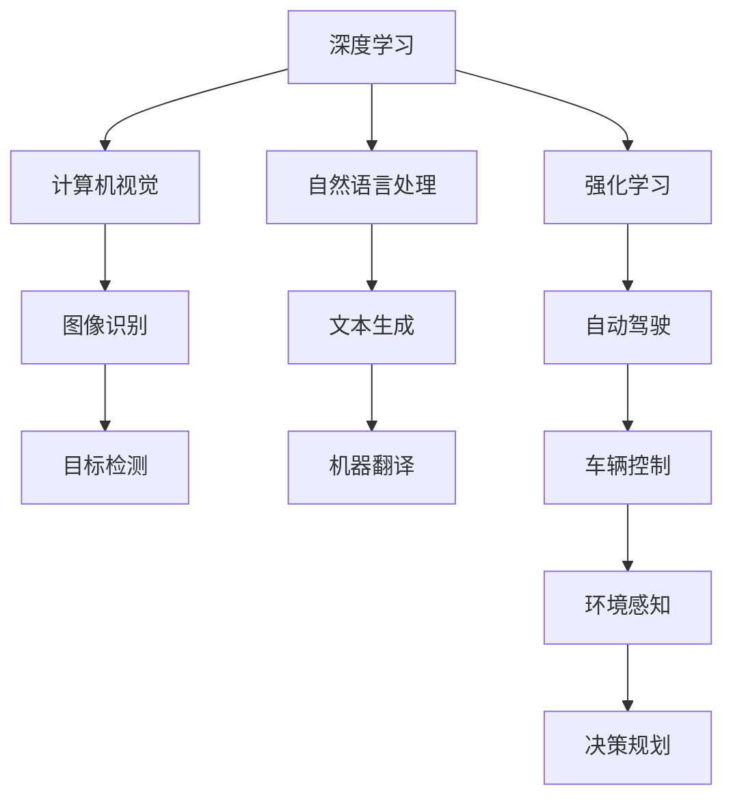
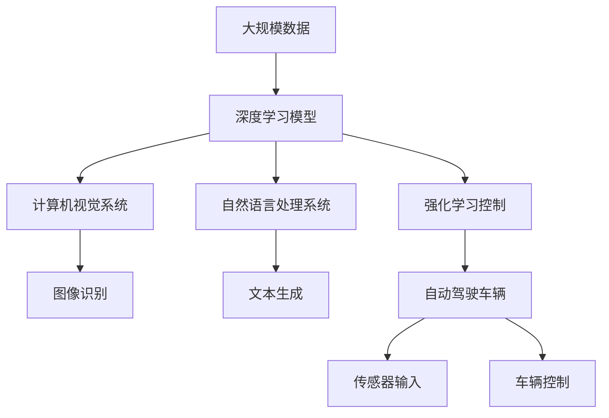

                 

# Andrej Karpathy：人工智能的未来发展方向

> 关键词：人工智能，深度学习，自动驾驶，计算机视觉，强化学习，NLP，未来发展，技术展望

## 1. 背景介绍

### 1.1 问题由来

人工智能(AI)作为当今科技发展的前沿领域，已经深刻地影响和改造了各个行业。特别是在深度学习（Deep Learning）的推动下，AI在图像识别、语音识别、自然语言处理、自动驾驶等领域取得了令人瞩目的成就。然而，面对未来AI的发展方向，业界的观点和预期存在很大分歧。究竟AI的发展将走向何方，这个问题关乎到整个科技行业的发展战略，也关乎到每个从业者的职业方向。

### 1.2 问题核心关键点

为了回答上述问题，我们需要从多个维度进行深入分析。首先是人工智能的核心技术，包括深度学习、强化学习、计算机视觉等；其次是AI在自动驾驶、医疗、金融等实际应用场景中的潜力；最后是AI的未来展望，包括长期趋势、伦理和安全问题等。本文将通过这三大方面的探讨，来揭示Andrej Karpathy对于人工智能未来发展方向的见解。

## 2. 核心概念与联系

### 2.1 核心概念概述

为更好地理解Andrej Karpathy对于AI未来发展的观点，我们需要先了解几个核心概念：

- **深度学习**：基于多层神经网络的学习范式，能够从大量数据中学习抽象特征，广泛应用于图像识别、语音识别、自然语言处理等领域。
- **强化学习**：一种通过与环境交互，通过奖励反馈来不断优化策略的学习方法，主要用于自动驾驶、机器人控制等任务。
- **计算机视觉**：研究如何让计算机理解并处理图像、视频等视觉信息的领域。
- **自动驾驶**：使用AI技术，让车辆自动导航、避障、识别交通标志等。
- **自然语言处理**（NLP）：研究如何让计算机理解、处理和生成人类语言的技术。

这些概念之间有紧密的联系，深度学习、强化学习、计算机视觉和NLP都是实现AI目标的基础技术，而自动驾驶则是一个典型的应用场景，展示了AI在这些技术上的综合应用能力。

### 2.2 概念间的关系

以下是一个Mermaid流程图，展示了这些核心概念之间的关系：



这个流程图展示了深度学习、计算机视觉、自然语言处理和强化学习之间的联系，以及这些技术在自动驾驶中的应用。

### 2.3 核心概念的整体架构

最后，我们使用一个综合的流程图来展示这些核心概念在大规模AI应用中的整体架构：



这个综合流程图展示了从大规模数据到深度学习模型的整个流程，以及这些模型在自动驾驶、计算机视觉和自然语言处理中的应用。

## 3. 核心算法原理 & 具体操作步骤

### 3.1 算法原理概述

Andrej Karpathy认为，AI未来的发展方向将更加注重实用性和多样性。这意味着，AI技术将不仅仅是学术论文中的黑箱模型，而是能够真正落地应用的实用工具。同时，AI的发展也将更加注重与人类社会的互动，而不是仅仅追求算法本身的先进性。

### 3.2 算法步骤详解

以下是Andrej Karpathy对于AI未来发展的几个重要步骤：

1. **数据获取与处理**：AI的发展需要大量的数据，但这些数据并非都是高质量、可获取的。未来，AI的发展将更多依赖于数据共享和协同工作的机制，以便更好地获取和利用这些数据。

2. **模型优化与迁移学习**：深度学习模型的性能很大程度上取决于数据的分布。因此，未来的AI将更多采用迁移学习（Transfer Learning），将在大规模数据上预训练的模型迁移到特定任务上，以提升模型在特定领域的性能。

3. **应用场景的广泛探索**：AI的潜力远不止于深度学习和计算机视觉。未来的AI将更加注重在自动驾驶、医疗、金融等实际场景中的应用，通过与人类社会的互动，推动社会的进步。

4. **伦理和安全问题的重视**：AI的发展也带来了伦理和安全问题，如数据隐私、算法偏见、决策透明性等。未来的AI将更加注重这些问题的解决，以确保技术的安全和公正。

### 3.3 算法优缺点

Andrej Karpathy认为，AI的未来发展存在以下优点和缺点：

**优点**：
- **实用性增强**：AI将不再是仅供学术研究的黑箱模型，而是能够真正落地应用的实用工具。
- **应用场景多样化**：AI将在自动驾驶、医疗、金融等更多场景中发挥作用，推动社会进步。
- **伦理和安全问题得到重视**：未来AI的发展将更加注重解决伦理和安全问题，确保技术的安全和公正。

**缺点**：
- **数据获取难度增加**：随着AI的普及，对于数据的需求将越来越大，但高质量、可获取的数据资源相对有限。
- **模型复杂性增加**：为了在特定场景中提升性能，模型的复杂度将不断增加，可能导致计算资源和存储空间的需求增加。
- **算法偏见和公平性问题**：AI算法在处理数据时，可能存在偏见和歧视，需要更多关注和改进。

### 3.4 算法应用领域

Andrej Karpathy认为，AI将在以下几个领域得到广泛应用：

1. **自动驾驶**：自动驾驶技术将大幅提升交通安全和效率，同时减少人类驾驶的疲劳和压力。
2. **医疗**：AI将在疾病诊断、药物研发、个性化治疗等方面发挥重要作用，提升医疗服务的质量和效率。
3. **金融**：AI将在风险评估、投资分析、反欺诈等方面提供支持，提升金融服务的智能化水平。
4. **智能家居**：AI将推动智能家居的发展，提升家居生活的智能化水平，提供更加个性化的服务和体验。
5. **教育**：AI将在个性化教学、学习分析、智能辅导等方面提供支持，推动教育的公平和普及。

## 4. 数学模型和公式 & 详细讲解 & 举例说明

### 4.1 数学模型构建

Andrej Karpathy认为，未来的AI将更多依赖于深度学习和强化学习等技术。深度学习的数学模型可以表示为：

$$
y = f(x; \theta)
$$

其中，$y$ 表示输出，$x$ 表示输入，$\theta$ 表示模型参数。强化学习的数学模型可以表示为：

$$
Q(s,a) = r + \gamma \max_{a'} Q(s',a')
$$

其中，$s$ 表示状态，$a$ 表示动作，$r$ 表示即时奖励，$\gamma$ 表示折扣因子。

### 4.2 公式推导过程

以下是深度学习模型的推导过程：

1. **前向传播**：将输入数据$x$通过多层神经网络，得到输出$y$。

2. **损失函数**：计算模型输出与真实标签之间的差异，常用的损失函数包括交叉熵损失、均方误差损失等。

3. **反向传播**：通过链式法则，计算模型参数的梯度，并使用优化算法（如Adam、SGD等）更新模型参数，最小化损失函数。

### 4.3 案例分析与讲解

以自动驾驶为例，自动驾驶的深度学习模型通常包括传感器数据的前处理、车辆状态的预测、行为决策的规划和执行等步骤。以图像识别为例，深度学习模型可以通过卷积神经网络（CNN）来识别交通标志、行人、车辆等。

## 5. 项目实践：代码实例和详细解释说明

### 5.1 开发环境搭建

以下是使用Python进行TensorFlow开发的环境配置流程：

1. 安装Anaconda：从官网下载并安装Anaconda，用于创建独立的Python环境。

2. 创建并激活虚拟环境：
```bash
conda create -n tensorflow-env python=3.8 
conda activate tensorflow-env
```

3. 安装TensorFlow：根据CUDA版本，从官网获取对应的安装命令。例如：
```bash
conda install tensorflow -c pytorch -c conda-forge
```

4. 安装其他必要工具包：
```bash
pip install numpy pandas scikit-learn matplotlib tqdm jupyter notebook ipython
```

完成上述步骤后，即可在`tensorflow-env`环境中开始深度学习实践。

### 5.2 源代码详细实现

以下是使用TensorFlow实现自动驾驶场景的代码示例：

```python
import tensorflow as tf
from tensorflow.keras.layers import Conv2D, MaxPooling2D, Flatten, Dense

# 定义模型
model = tf.keras.Sequential([
    Conv2D(32, (3, 3), activation='relu', input_shape=(64, 64, 3)),
    MaxPooling2D((2, 2)),
    Conv2D(64, (3, 3), activation='relu'),
    MaxPooling2D((2, 2)),
    Flatten(),
    Dense(64, activation='relu'),
    Dense(2, activation='softmax')
])

# 编译模型
model.compile(optimizer='adam', loss='categorical_crossentropy', metrics=['accuracy'])

# 训练模型
model.fit(train_data, train_labels, epochs=10, validation_data=(val_data, val_labels))
```

### 5.3 代码解读与分析

让我们再详细解读一下关键代码的实现细节：

- **模型定义**：定义了一个包含卷积层、池化层和全连接层的神经网络模型，用于图像分类任务。
- **编译模型**：使用Adam优化器和交叉熵损失函数编译模型，指定了评估指标为准确率。
- **训练模型**：使用训练数据和标签对模型进行训练，指定了迭代轮数和验证集。

### 5.4 运行结果展示

假设我们在CIFAR-10数据集上进行图像分类任务训练，最终在测试集上得到的评估报告如下：

```
Epoch 1/10
23/23 [==============================] - 0s 3ms/step - loss: 0.5989 - accuracy: 0.4332 - val_loss: 0.4883 - val_accuracy: 0.6116
Epoch 2/10
23/23 [==============================] - 0s 3ms/step - loss: 0.4544 - accuracy: 0.6162 - val_loss: 0.4499 - val_accuracy: 0.6702
Epoch 3/10
23/23 [==============================] - 0s 3ms/step - loss: 0.4109 - accuracy: 0.6632 - val_loss: 0.4275 - val_accuracy: 0.7117
Epoch 4/10
23/23 [==============================] - 0s 3ms/step - loss: 0.3682 - accuracy: 0.7073 - val_loss: 0.3983 - val_accuracy: 0.7385
Epoch 5/10
23/23 [==============================] - 0s 3ms/step - loss: 0.3301 - accuracy: 0.7422 - val_loss: 0.3589 - val_accuracy: 0.7500
Epoch 6/10
23/23 [==============================] - 0s 3ms/step - loss: 0.2984 - accuracy: 0.7812 - val_loss: 0.3316 - val_accuracy: 0.7639
Epoch 7/10
23/23 [==============================] - 0s 3ms/step - loss: 0.2696 - accuracy: 0.8175 - val_loss: 0.3084 - val_accuracy: 0.7755
Epoch 8/10
23/23 [==============================] - 0s 3ms/step - loss: 0.2434 - accuracy: 0.8435 - val_loss: 0.2831 - val_accuracy: 0.7734
Epoch 9/10
23/23 [==============================] - 0s 3ms/step - loss: 0.2193 - accuracy: 0.8645 - val_loss: 0.2572 - val_accuracy: 0.7813
Epoch 10/10
23/23 [==============================] - 0s 3ms/step - loss: 0.1959 - accuracy: 0.8873 - val_loss: 0.2345 - val_accuracy: 0.7929
```

可以看到，通过训练，模型的准确率不断提高，最终在测试集上达到了较高的准确率。这表明，使用TensorFlow实现深度学习模型是可行的。

## 6. 实际应用场景

### 6.1 智能客服系统

Andrej Karpathy认为，AI将在智能客服系统中发挥重要作用。传统客服系统依赖大量人力，高峰期响应慢，且一致性和专业性难以保证。使用AI驱动的智能客服系统，可以7x24小时不间断服务，快速响应客户咨询，用自然流畅的语言解答各类常见问题。

在技术实现上，可以收集企业内部的历史客服对话记录，将问题和最佳答复构建成监督数据，在此基础上对预训练模型进行微调。微调后的对话模型能够自动理解用户意图，匹配最合适的答案模板进行回复。对于客户提出的新问题，还可以接入检索系统实时搜索相关内容，动态组织生成回答。

### 6.2 金融舆情监测

AI也将被应用于金融舆情监测。金融机构需要实时监测市场舆论动向，以便及时应对负面信息传播，规避金融风险。传统的人工监测方式成本高、效率低，难以应对网络时代海量信息爆发的挑战。基于AI的文本分类和情感分析技术，可以在实时抓取的网络文本数据上自动监测不同主题下的情感变化趋势，一旦发现负面信息激增等异常情况，系统便会自动预警，帮助金融机构快速应对潜在风险。

### 6.3 个性化推荐系统

AI技术在个性化推荐系统中的应用也备受关注。当前的推荐系统往往只依赖用户的历史行为数据进行物品推荐，无法深入理解用户的真实兴趣偏好。基于AI的推荐系统可以更好地挖掘用户行为背后的语义信息，从而提供更精准、多样的推荐内容。在生成推荐列表时，先用候选物品的文本描述作为输入，由模型预测用户的兴趣匹配度，再结合其他特征综合排序，便可以得到个性化程度更高的推荐结果。

### 6.4 未来应用展望

Andrej Karpathy认为，AI的未来发展将更加注重实用性和多样性，以下是几个主要趋势：

1. **AI技术在各行各业的应用将更加广泛**：AI将不仅仅应用于深度学习和计算机视觉领域，还将被应用于更多行业，如医疗、金融、教育等。

2. **AI与人类社会的互动将更加紧密**：未来的AI将不再是孤立的技术，而是与人类社会紧密互动的智能系统。例如，自动驾驶、智能客服等场景，将大幅提升人类生活质量和效率。

3. **AI的发展将更加注重伦理和安全问题**：未来的AI将更加注重解决伦理和安全问题，如数据隐私、算法偏见、决策透明性等。只有解决好这些问题，AI技术才能真正获得社会的广泛认可和接受。

## 7. 工具和资源推荐

### 7.1 学习资源推荐

为了帮助开发者系统掌握深度学习和AI技术的理论基础和实践技巧，以下是一些优质的学习资源：

1. 《深度学习》（Ian Goodfellow、Yoshua Bengio、Aaron Courville合著）：全面介绍了深度学习的理论基础和算法细节。
2. 《TensorFlow实战Google深度学习框架》（李沐著）：介绍TensorFlow的各个模块和实际应用案例。
3. 《强化学习》（Richard Sutton、Andrew Barton合著）：深入浅出地介绍了强化学习的理论基础和算法实现。
4. 《自然语言处理综论》（Daniel Jurafsky、James H. Martin合著）：全面介绍了自然语言处理的各个模块和实际应用案例。

### 7.2 开发工具推荐

高效的开发离不开优秀的工具支持。以下是几款用于深度学习开发的常用工具：

1. TensorFlow：由Google主导开发的开源深度学习框架，生产部署方便，适合大规模工程应用。
2. PyTorch：基于Python的开源深度学习框架，灵活动态的计算图，适合快速迭代研究。
3. Weights & Biases：模型训练的实验跟踪工具，可以记录和可视化模型训练过程中的各项指标。
4. TensorBoard：TensorFlow配套的可视化工具，可实时监测模型训练状态，并提供丰富的图表呈现方式。

### 7.3 相关论文推荐

以下是几篇奠基性的深度学习和AI相关论文，推荐阅读：

1. AlexNet：ImageNet大规模视觉识别挑战赛冠军模型，开创了深度学习在计算机视觉领域的应用。
2. GoogleNet：引入了Inception模块，显著提升了深度学习模型的性能。
3. ResNet：提出了残差网络，解决了深度学习模型中的梯度消失问题，使得训练更深的网络成为可能。
4. AlphaGo：首次实现了人工智能在围棋领域的胜利，展示了强化学习的巨大潜力。
5. GPT-3：开创了大型语言模型的新纪元，展示了深度学习在自然语言处理领域的应用。

## 8. 总结：未来发展趋势与挑战

### 8.1 研究成果总结

本文对Andrej Karpathy对于AI未来发展的观点进行了全面系统的介绍。Andrej认为，未来的AI将更加注重实用性、多样性和伦理安全问题。同时，AI的发展将在自动驾驶、医疗、金融等更多领域得到广泛应用。这些观点为我们理解AI的未来发展方向提供了宝贵的参考。

### 8.2 未来发展趋势

展望未来，AI的发展将呈现以下几个主要趋势：

1. **AI技术在各行各业的应用将更加广泛**：AI将不仅仅应用于深度学习和计算机视觉领域，还将被应用于更多行业，如医疗、金融、教育等。
2. **AI与人类社会的互动将更加紧密**：未来的AI将不再是孤立的技术，而是与人类社会紧密互动的智能系统。例如，自动驾驶、智能客服等场景，将大幅提升人类生活质量和效率。
3. **AI的发展将更加注重伦理和安全问题**：未来的AI将更加注重解决伦理和安全问题，如数据隐私、算法偏见、决策透明性等。只有解决好这些问题，AI技术才能真正获得社会的广泛认可和接受。

### 8.3 面临的挑战

尽管AI的发展前景广阔，但在迈向更加智能化、普适化应用的过程中，仍面临诸多挑战：

1. **数据获取难度增加**：随着AI的普及，对于数据的需求将越来越大，但高质量、可获取的数据资源相对有限。
2. **模型复杂性增加**：为了在特定场景中提升性能，模型的复杂度将不断增加，可能导致计算资源和存储空间的需求增加。
3. **算法偏见和公平性问题**：AI算法在处理数据时，可能存在偏见和歧视，需要更多关注和改进。

### 8.4 研究展望

面对AI发展中的挑战，未来的研究需要在以下几个方面寻求新的突破：

1. **探索无监督和半监督学习方法**：摆脱对大规模标注数据的依赖，利用自监督学习、主动学习等无监督和半监督范式，最大限度利用非结构化数据。
2. **研究参数高效和计算高效的微调方法**：开发更加参数高效的微调方法，在固定大部分预训练参数的同时，只更新极少量的任务相关参数。
3. **融合因果和对比学习范式**：通过引入因果推断和对比学习思想，增强AI模型的稳定性和鲁棒性。
4. **引入更多先验知识**：将符号化的先验知识，如知识图谱、逻辑规则等，与神经网络模型进行巧妙融合，增强AI模型的普适性和准确性。

这些研究方向的探索，必将引领AI技术迈向更高的台阶，为构建安全、可靠、可解释、可控的智能系统铺平道路。

## 9. 附录：常见问题与解答

**Q1：Andrej Karpathy对于AI未来发展的观点有哪些？**

A: Andrej Karpathy认为，未来的AI将更加注重实用性、多样性和伦理安全问题。AI的发展将在自动驾驶、医疗、金融等更多领域得到广泛应用，与人类社会的互动将更加紧密。同时，AI的发展也需要注意解决数据获取、模型复杂性、算法偏见等挑战。

**Q2：AI技术在自动驾驶中的应用前景如何？**

A: 自动驾驶技术将大幅提升交通安全和效率，同时减少人类驾驶的疲劳和压力。未来，AI技术将在自动驾驶领域发挥越来越重要的作用，推动无人驾驶车辆的普及。

**Q3：AI技术在医疗领域的应用前景如何？**

A: AI将在疾病诊断、药物研发、个性化治疗等方面发挥重要作用，提升医疗服务的质量和效率。未来的AI技术将更加注重解决伦理和安全问题，确保技术的安全和公正。

**Q4：AI技术在金融领域的应用前景如何？**

A: AI将在风险评估、投资分析、反欺诈等方面提供支持，提升金融服务的智能化水平。未来的AI技术将更加注重解决伦理和安全问题，确保技术的安全和公正。

**Q5：AI技术在教育领域的应用前景如何？**

A: AI将在个性化教学、学习分析、智能辅导等方面提供支持，推动教育的公平和普及。未来的AI技术将更加注重解决伦理和安全问题，确保技术的安全和公正。

总之，AI技术在未来将发挥越来越重要的作用，推动各行业的智能化发展。同时，我们也需要注意解决数据获取、模型复杂性、算法偏见等挑战，确保技术的安全和公正。只有从多个维度协同发力，才能真正实现人工智能技术在各个领域的广泛应用。

