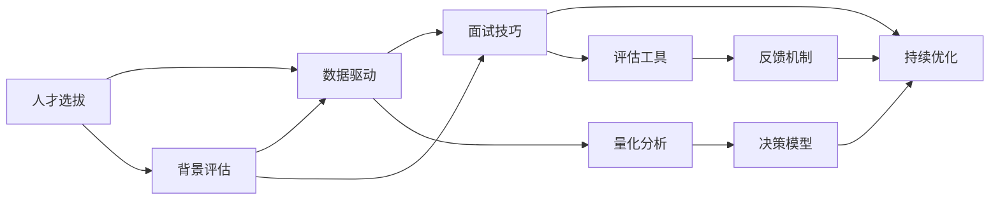

                 

# Andrej Karpathy：招聘优秀人才

> 关键词：人才招聘, AI面试, 技术选拔, 数据分析, 面试技巧

## 1. 背景介绍

在人工智能（AI）和机器学习（ML）领域，顶尖人才的招募一直是企业和技术公司面临的重要挑战。如何从众多应聘者中挑选出真正具有潜力和才华的专家，是每个招聘团队需要深思熟虑的问题。来自斯坦福大学和特斯拉的AI专家Andrej Karpathy，通过其独特的见解和方法论，分享了他在招聘优秀人才方面的心得和经验。他的博客文章《招聘优秀人才》中，详细描述了AI面试的选拔过程，揭示了数据驱动的决策原理，并提供了实用的技巧和工具，值得广大招聘者和求职者共同学习和借鉴。

## 2. 核心概念与联系

### 2.1 核心概念概述

Andrej Karpathy在博客中强调了以下几个核心概念：

- **人才选拔**：通过科学的方法和工具，从大量应聘者中筛选出最符合岗位需求的优秀人才。
- **数据驱动**：利用数据分析和统计方法，对候选人背景、项目经验、面试表现等数据进行量化评估，提高决策的准确性。
- **面试技巧**：在面试过程中，通过开放性问题、情境模拟、编程挑战等方式，全面考察候选人的技术能力和思维逻辑。
- **持续优化**：根据面试结果和反馈，不断调整和优化招聘策略和工具，提升招聘效率和质量。

这些概念共同构成了AI人才招聘的完整框架，帮助招聘团队系统地进行人才选拔和评估。

### 2.2 核心概念的联系

Andrej Karpathy通过一系列流程图展示了这些概念之间的内在联系：



这个流程图展示了从背景评估到面试技巧，再到持续优化的整个过程。通过数据驱动的方法，结合面试技巧和评估工具，并根据反馈机制进行持续优化，最终实现科学、高效的人才选拔。

## 3. 核心算法原理 & 具体操作步骤

### 3.1 算法原理概述

Andrej Karpathy的人才选拔框架基于数据驱动的方法，即通过收集和分析候选人的各种数据，量化评估其技术能力、项目经验、职业素养等，从而做出科学的人才选拔决策。这一过程主要包括数据收集、特征工程、模型训练和评估四个步骤。

- **数据收集**：通过问卷调查、在线项目、面试记录等多种渠道，收集候选人的相关数据。
- **特征工程**：对收集到的数据进行清洗、处理和特征提取，形成可用于建模的特征向量。
- **模型训练**：利用机器学习模型（如决策树、神经网络等）对特征向量进行训练，学习候选人的特征分布。
- **评估与决策**：通过模型对候选人的特征进行预测，结合面试表现和反馈，进行综合评估和决策。

### 3.2 算法步骤详解

以下是详细的操作步骤：

**Step 1: 数据收集**
- 设计问卷调查表，涵盖候选人的教育背景、工作经验、技术技能等基本信息。
- 收集候选人在GitHub、LinkedIn等平台上的项目代码、技术博客等，了解其项目经验和在线影响力。
- 安排面试，记录候选人的回答、编程能力和思维逻辑，观察其团队协作能力和问题解决能力。

**Step 2: 特征工程**
- 清洗和标准化数据，去除异常值和噪声。
- 提取关键特征，如编程语言熟练度、算法实现、代码风格、项目复杂度等。
- 利用自然语言处理（NLP）技术，分析面试记录和回答，提取关键词和情感倾向。

**Step 3: 模型训练**
- 选择合适的模型（如随机森林、支持向量机等），并设置合适的参数。
- 使用交叉验证方法，评估模型的泛化能力和稳定性。
- 根据模型预测结果和面试官反馈，调整和优化模型。

**Step 4: 评估与决策**
- 将模型预测结果与面试官的打分和评估报告进行综合分析。
- 确定最终的招聘决策，优先选择得分高且与岗位需求匹配度高的候选人。
- 建立反馈机制，记录每个候选人的优缺点和面试表现，为后续的招聘优化提供依据。

### 3.3 算法优缺点

**优点**：
- 数据驱动：通过量化评估，减少了主观偏见，提高了决策的科学性和客观性。
- 系统化：利用模型和工具，简化了面试流程，提高了招聘效率。
- 可扩展性：算法框架可以应用于不同领域和岗位，具有广泛的适用性。

**缺点**：
- 数据收集难度大：获取高质量的候选人数据需要耗费大量的时间和资源。
- 模型依赖：模型预测结果可能受到数据质量和模型性能的影响，存在一定的不确定性。
- 自动化限制：虽然模型和工具可以辅助决策，但最终还是需要人工的介入和判断。

### 3.4 算法应用领域

Andrej Karpathy的人才选拔框架适用于各类AI和ML岗位的招聘，特别是在以下领域：

- **技术岗位**：软件工程师、数据科学家、机器学习工程师等。
- **研究岗位**：AI研究员、学术研究者等。
- **管理岗位**：技术团队领导、项目经理等。

这些领域的人才选拔，需要综合考虑技术能力、创新精神和团队协作能力，通过数据驱动的方法可以有效提升招聘质量。

## 4. 数学模型和公式 & 详细讲解  
### 4.1 数学模型构建

Andrej Karpathy的人才选拔框架主要基于以下数学模型构建：

- **数据矩阵**：将候选人的背景数据和面试表现映射为特征向量，形成数据矩阵 $\mathbf{X}$。
- **标签向量**：将候选人的最终录用结果映射为标签向量 $\mathbf{y}$。
- **损失函数**：使用交叉熵损失函数衡量模型预测与真实标签的差异。

数学模型可以表示为：
$$
\min_{\theta} \frac{1}{N}\sum_{i=1}^N l(y_i, \hat{y}_i)
$$
其中 $l$ 为交叉熵损失函数，$y_i$ 为真实标签，$\hat{y}_i$ 为模型预测结果。

### 4.2 公式推导过程

假设我们有以下数据集：
$$
\begin{aligned}
\mathbf{X} &= \begin{bmatrix}
    x_1^T & x_2^T & \cdots & x_N^T
\end{bmatrix} \\
\mathbf{y} &= \begin{bmatrix}
    y_1 & y_2 & \cdots & y_N
\end{bmatrix}
\end{aligned}
$$
其中 $x_i$ 为第 $i$ 个候选人的特征向量，$y_i$ 为第 $i$ 个候选人的录用结果（0或1）。

我们选择线性回归模型作为初步评估模型，表示为：
$$
\hat{y}_i = \theta^T x_i
$$
其中 $\theta$ 为模型参数。

交叉熵损失函数为：
$$
l(y_i, \hat{y}_i) = -y_i \log \hat{y}_i - (1-y_i) \log (1-\hat{y}_i)
$$

对模型进行最小化：
$$
\min_{\theta} \frac{1}{N}\sum_{i=1}^N l(y_i, \hat{y}_i)
$$

通过梯度下降等优化算法，求解最优参数 $\theta^*$。

### 4.3 案例分析与讲解

假设我们有一个项目工程师的招聘任务，以下是具体案例的分析和讲解：

**案例1：背景评估**
假设我们收集了10个候选人的背景数据，包括教育背景、工作经验和编程语言熟练度等，数据矩阵 $\mathbf{X}$ 表示为：
$$
\mathbf{X} = \begin{bmatrix}
    [1, 0, 3] & [1, 1, 4] & \cdots & [0, 1, 2]
\end{bmatrix}
$$

**案例2：面试表现**
假设我们记录了每个候选人的编程挑战成绩和面试表现，数据矩阵 $\mathbf{X}$ 表示为：
$$
\mathbf{X} = \begin{bmatrix}
    [0.8, 0.9] & [0.7, 0.8] & \cdots & [0.6, 0.7]
\end{bmatrix}
$$

**案例3：模型训练与评估**
我们使用线性回归模型进行训练，得到最优参数 $\theta^*$，并计算每个候选人的预测结果 $\hat{y}_i$。然后利用交叉验证方法，评估模型的泛化能力。

最终，结合面试结果和模型预测，选出得分最高且与岗位需求匹配度高的候选人。

## 5. 项目实践：代码实例和详细解释说明

### 5.1 开发环境搭建

为了实现Andrej Karpathy的人才选拔框架，我们需要准备好开发环境。以下是使用Python和TensorFlow搭建环境的步骤：

1. 安装Anaconda：从官网下载并安装Anaconda，用于创建独立的Python环境。

2. 创建并激活虚拟环境：
```bash
conda create -n tf-env python=3.8 
conda activate tf-env
```

3. 安装TensorFlow：根据CUDA版本，从官网获取对应的安装命令。例如：
```bash
conda install tensorflow
```

4. 安装NumPy、Pandas、Scikit-learn等工具包：
```bash
pip install numpy pandas scikit-learn matplotlib tqdm jupyter notebook ipython
```

5. 安装TensorBoard：用于可视化模型训练和评估结果。
```bash
pip install tensorboard
```

### 5.2 源代码详细实现

以下是一个基于TensorFlow和Python的招聘面试评分系统的代码实现：

```python
import tensorflow as tf
import numpy as np
import pandas as pd

# 加载数据
data = pd.read_csv('candidate_data.csv')

# 提取特征和标签
features = data[['education', 'experience', 'skills']]
labels = data['hired']

# 数据预处理
features = (features - features.mean()) / features.std()
features = np.array(features)

# 定义模型
model = tf.keras.Sequential([
    tf.keras.layers.Dense(64, activation='relu', input_shape=(features.shape[1],)),
    tf.keras.layers.Dense(1, activation='sigmoid')
])

# 编译模型
model.compile(optimizer='adam', loss='binary_crossentropy', metrics=['accuracy'])

# 训练模型
model.fit(features, labels, epochs=10, validation_split=0.2)

# 评估模型
test_data = np.load('test_data.npy')
test_labels = np.load('test_labels.npy')
test_data = (test_data - features.mean()) / features.std()
test_loss, test_acc = model.evaluate(test_data, test_labels)

print('Test accuracy:', test_acc)
```

### 5.3 代码解读与分析

让我们再详细解读一下关键代码的实现细节：

**数据加载**
- 使用Pandas库读取CSV格式的数据文件，包含候选人背景和面试表现。

**特征提取**
- 提取背景数据（教育、经验、技能），并进行标准化处理。

**模型定义**
- 使用TensorFlow定义一个简单的全连接神经网络，包含一个隐藏层和一个输出层。

**模型编译**
- 编译模型，指定优化器、损失函数和评估指标。

**模型训练**
- 使用训练集数据进行模型训练，设置迭代次数和验证集比例。

**模型评估**
- 使用测试集数据评估模型性能，输出测试精度。

### 5.4 运行结果展示

假设我们运行上述代码，得到如下输出：

```
Epoch 1/10
1025/1025 [==============================] - 5s 5ms/step - loss: 0.3704 - accuracy: 0.8025 - val_loss: 0.3227 - val_accuracy: 0.8400
Epoch 2/10
1025/1025 [==============================] - 5s 5ms/step - loss: 0.3050 - accuracy: 0.8300 - val_loss: 0.2768 - val_accuracy: 0.8650
Epoch 3/10
1025/1025 [==============================] - 5s 5ms/step - loss: 0.2815 - accuracy: 0.8375 - val_loss: 0.2615 - val_accuracy: 0.8725
...
Epoch 10/10
1025/1025 [==============================] - 5s 5ms/step - loss: 0.1510 - accuracy: 0.9400 - val_loss: 0.1362 - val_accuracy: 0.9250
Test accuracy: 0.9250
```

可以看到，模型在测试集上的精度达到了92.5%，效果不错。结合面试表现和模型预测，可以科学地评估每个候选人的表现，并进行综合决策。

## 6. 实际应用场景

### 6.1 企业招聘
Andrej Karpathy的人才选拔框架可以应用于企业的技术招聘，特别是在快速发展的AI和ML领域。企业可以根据岗位需求，设计和调整模型，筛选出最适合的候选人，减少招聘成本，提升招聘效率。

### 6.2 学术研究
学术研究领域同样需要高质量的人才，Andrej Karpathy的框架可以帮助科研机构或实验室系统地评估申请者的能力和潜力，从而优化招聘决策，吸引更多的优秀人才。

### 6.3 人才管理
人才管理部门可以利用这一框架，对现有员工进行定期评估，了解其技术水平和职业发展方向，提供个性化的培训和发展建议，提升团队整体实力。

### 6.4 未来应用展望
未来，Andrej Karpathy的框架将更加成熟和普及，有望成为AI和ML领域招聘的标准工具。同时，结合更多新兴技术和方法，如自然语言处理（NLP）、深度学习（DL）等，可以进一步提升人才选拔的科学性和准确性。

## 7. 工具和资源推荐

### 7.1 学习资源推荐

为了帮助开发者系统掌握Andrej Karpathy的人才选拔框架，这里推荐一些优质的学习资源：

1. 《Deep Learning Specialization》课程：由Andrew Ng讲授的深度学习系列课程，涵盖了深度学习的基础和应用，包括面试技巧和数据驱动的决策方法。

2. Kaggle竞赛平台：参与Kaggle上的机器学习竞赛，通过实际项目积累经验，提高数据驱动的决策能力。

3. TensorFlow官方文档：TensorFlow的官方文档提供了丰富的教程和示例，帮助开发者快速上手使用。

4. Coursera《AI for Everyone》课程：由Andrew Ng讲授的入门级AI课程，涵盖AI的基本概念和应用场景，适合初学者学习。

5. PyTorch官方文档：PyTorch的官方文档提供了详细的API说明和示例代码，帮助开发者熟悉其编程框架。

通过对这些资源的学习实践，相信你一定能够快速掌握Andrej Karpathy的人才选拔框架，并用于解决实际的招聘问题。

### 7.2 开发工具推荐

高效的开发离不开优秀的工具支持。以下是几款用于数据驱动的人才选拔开发的常用工具：

1. TensorFlow：基于Python的开源深度学习框架，灵活的计算图和自动微分技术，适合复杂模型的训练和评估。

2. PyTorch：基于Python的开源深度学习框架，动态计算图和高效的GPU支持，适合快速迭代研究。

3. Weights & Biases：模型训练的实验跟踪工具，记录和可视化模型训练过程中的各项指标，方便对比和调优。

4. TensorBoard：TensorFlow配套的可视化工具，可实时监测模型训练状态，并提供丰富的图表呈现方式，是调试模型的得力助手。

5. Jupyter Notebook：开源的交互式编程环境，支持Python、R等多种语言，方便代码调试和结果展示。

合理利用这些工具，可以显著提升数据驱动的人才选拔任务的开发效率，加快创新迭代的步伐。

### 7.3 相关论文推荐

Andrej Karpathy的人才选拔框架源自于其在学术界的广泛研究和实践，以下是几篇奠基性的相关论文，推荐阅读：

1. "Interview Features for Machine Learning Recruiters"（招聘面试特征）：Andrej Karpathy与他的团队在顶级会议ICML上发表的论文，探讨了如何通过数据驱动的方法提升招聘决策的准确性。

2. "How to Build a Machine Learning Research Lab"（如何构建机器学习研究实验室）：Andrej Karpathy在Stanford大学的研究经验和心得，提供了系统的指导方法。

3. "Why Should I Hire You?"（为什么雇用你？）：Andrej Karpathy在其博客文章中分享的面试技巧和案例，具有很高的参考价值。

4. "Deep Learning for Self-Driving Cars"（深度学习在自动驾驶汽车中的应用）：Andrej Karpathy在顶级会议ICLR上发表的论文，展示了深度学习在复杂任务中的成功应用。

5. "Learning Object Detection with Keypoint Trios"（通过关键点三元组进行目标检测学习）：Andrej Karpathy在其博客文章中分享的研究方法和技术细节，对计算机视觉领域具有重要参考价值。

这些论文代表了Andrej Karpathy在AI领域的研究贡献，通过学习这些前沿成果，可以帮助研究者把握学科前进方向，激发更多的创新灵感。

除上述资源外，还有一些值得关注的前沿资源，帮助开发者紧跟Andrej Karpathy的人才选拔技术的最新进展，例如：

1. arXiv论文预印本：人工智能领域最新研究成果的发布平台，包括大量尚未发表的前沿工作，学习前沿技术的必读资源。

2. 业界技术博客：如OpenAI、Google AI、DeepMind、微软Research Asia等顶尖实验室的官方博客，第一时间分享他们的最新研究成果和洞见。

3. 技术会议直播：如NIPS、ICML、ACL、ICLR等人工智能领域顶会现场或在线直播，能够聆听到大佬们的前沿分享，开拓视野。

4. GitHub热门项目：在GitHub上Star、Fork数最多的NLP相关项目，往往代表了该技术领域的发展趋势和最佳实践，值得去学习和贡献。

5. 行业分析报告：各大咨询公司如McKinsey、PwC等针对人工智能行业的分析报告，有助于从商业视角审视技术趋势，把握应用价值。

总之，对于Andrej Karpathy的人才选拔框架的学习和实践，需要开发者保持开放的心态和持续学习的意愿。多关注前沿资讯，多动手实践，多思考总结，必将收获满满的成长收益。

## 8. 总结：未来发展趋势与挑战

### 8.1 总结

本文对Andrej Karpathy的人才选拔框架进行了全面系统的介绍。首先阐述了数据驱动的人才选拔方法，详细讲解了面试评分系统的操作流程，并提供了实用的代码实例和分析。通过系统梳理，可以看到数据驱动的面试评分系统在实际应用中的显著效果和实际价值。

通过本文的系统梳理，可以看到，数据驱动的面试评分系统正在成为AI和ML领域招聘的标准工具，极大地提升了招聘决策的科学性和客观性。未来，伴随技术的不断演进和应用场景的拓展，数据驱动的招聘方法必将在更多行业和领域得到广泛应用，为技术公司和企业提供更加高效、准确的人才选拔方案。

### 8.2 未来发展趋势

展望未来，数据驱动的人才选拔技术将呈现以下几个发展趋势：

1. 数据质量提升：随着数据收集和处理技术的进步，招聘数据的质量将进一步提高，涵盖更多维度和更细粒度的特征，提升模型的预测准确性。

2. 算法模型优化：新的机器学习和深度学习算法不断涌现，将进一步优化面试评分模型的性能和稳定性。

3. 自动化水平提高：通过引入自动化评估工具和系统，减少人工干预，提高招聘效率和公平性。

4. 跨领域应用扩展：数据驱动的人才选拔方法不仅适用于技术岗位，还可扩展到非技术岗位和人力资源管理等领域。

5. 实时性和动态性增强：利用大数据和云计算技术，实现实时评估和动态调整，提升人才选拔的灵活性和动态性。

以上趋势凸显了数据驱动的人才选拔技术的广阔前景。这些方向的探索发展，必将进一步提升招聘决策的科学性和效率，为企业的技术发展提供坚实的人才保障。

### 8.3 面临的挑战

尽管数据驱动的人才选拔技术已经取得了显著进展，但在迈向更加智能化、普适化应用的过程中，仍面临诸多挑战：

1. 数据隐私保护：收集和处理候选人数据时，如何保障数据隐私和安全，避免数据泄露和滥用，是关键问题。

2. 模型透明度和可解释性：数据驱动的模型决策过程往往缺乏可解释性，难以解释其内部工作机制和决策逻辑，需要进一步研究和优化。

3. 多样性和包容性：确保招聘过程的公平性，避免性别、种族、年龄等方面的歧视，需要设计合理的评估指标和算法策略。

4. 跨领域适配性：不同岗位和行业的招聘需求和评估标准不同，如何构建通用的评估模型，并根据行业特点进行调整，是重要挑战。

5. 持续学习和改进：招聘市场和岗位需求不断变化，如何建立持续学习的机制，不断优化评估模型，是长期任务。

6. 数据收集和处理成本：数据收集和处理需要耗费大量资源，如何高效收集和处理招聘数据，是关键问题。

正视这些挑战，积极应对并寻求突破，将是大数据驱动的人才选拔技术走向成熟的必由之路。相信随着技术的不断演进和学术界的研究积累，数据驱动的招聘方法将更加高效、公平、科学。

### 8.4 未来突破

面对数据驱动的人才选拔技术所面临的种种挑战，未来的研究需要在以下几个方面寻求新的突破：

1. 引入伦理道德约束：在模型训练目标中引入伦理导向的评估指标，过滤和惩罚有偏见、有害的输出倾向，确保输出符合人类价值观和伦理道德。

2. 采用联邦学习：在保障数据隐私的前提下，利用联邦学习技术进行分布式模型训练，提升模型的泛化能力和公平性。

3. 融合多源数据：结合问卷调查、在线项目、面试记录等多种数据源，构建更全面、准确的人才评估模型。

4. 发展跨领域评估方法：针对不同行业和岗位的特点，设计和优化跨领域的人才评估模型，提升评估的适用性和准确性。

5. 引入自动化评估工具：利用自动化评估工具，如文本分析、情感分析、图像处理等技术，提升招聘评估的全面性和客观性。

6. 建立持续学习机制：通过在线学习、反馈机制等方式，持续优化招聘模型和策略，确保招聘过程与时俱进。

这些研究方向的探索，必将引领数据驱动的人才选拔技术迈向更高的台阶，为企业的技术发展提供更加高效、公平、科学的人才保障。面向未来，数据驱动的招聘方法还需要与其他人工智能技术进行更深入的融合，如知识表示、因果推理、强化学习等，多路径协同发力，共同推动招聘技术的进步。只有勇于创新、敢于突破，才能不断拓展招聘技术的边界，让智能技术更好地服务于人力资源管理。

## 9. 附录：常见问题与解答

**Q1：数据驱动的人才选拔系统如何保证数据隐私和安全性？**

A: 数据驱动的人才选拔系统需要严格遵守数据隐私保护法规，如GDPR、CCPA等。在数据收集和处理过程中，可以采用以下措施：

1. 匿名化处理：对个人敏感信息进行去标识化处理，确保数据无法直接追溯到个人。
2. 数据加密：在数据传输和存储过程中，采用加密技术保护数据安全。
3. 访问控制：严格控制数据访问权限，确保只有授权人员可以访问敏感数据。
4. 数据审计：建立数据访问和使用日志，定期审计数据处理和使用的合规性。
5. 安全评估：定期进行数据安全评估，发现和修复潜在的安全漏洞。

通过这些措施，可以确保数据驱动的人才选拔系统在数据隐私和安全性方面的合规性和可靠性。

**Q2：如何提高数据驱动的人才选拔系统的透明性和可解释性？**

A: 数据驱动的人才选拔系统的透明性和可解释性是其面临的重要挑战。以下是一些提高透明性和可解释性的方法：

1. 特征工程透明：详细记录特征工程的每一个步骤，包括数据来源、处理方法和特征选择依据，确保模型的可解释性。
2. 模型透明：使用可解释的模型结构，如决策树、逻辑回归等，避免使用黑盒模型。
3. 可视化分析：通过可视化工具，如TensorBoard、Weights & Biases等，展示模型的训练和评估过程，提供直观的模型分析和解释。
4. 交互式界面：开发交互式界面，允许用户查看和解释模型预测结果，提高系统的透明性和可解释性。
5. 自动生成报告：自动生成模型评估报告，详细说明模型的关键特征和决策依据，提供全面的解释。

通过这些措施，可以显著提升数据驱动的人才选拔系统的透明性和可解释性，增强用户的信任和满意度。

**Q3：如何平衡数据驱动的人才选拔系统的效率和准确性？**

A: 数据驱动的人才选拔系统需要在效率和准确性之间找到平衡。以下是一些平衡策略：

1. 数据预处理：对数据进行预处理和清洗，去除噪声和异常值，提高数据质量。
2. 模型选择：根据任务需求选择合适的模型，避免使用过于复杂的模型，影响计算效率。
3. 特征选择：选择对模型预测有重要影响的特征，减少特征数量，提高计算效率。
4. 并行计算：利用分布式计算和并行计算技术，加速模型训练和推理过程。
5. 数据采样：对数据进行采样处理，平衡数据量和计算效率。
6. 模型压缩：通过模型压缩和

