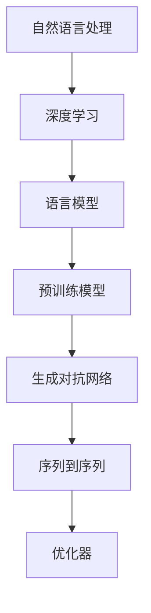

                 

# ChatGPT的文本生成步骤详解

> 关键词：
1. 自然语言处理 (Natural Language Processing, NLP)
2. 深度学习 (Deep Learning)
3. 语言模型 (Language Model)
4. 生成对抗网络 (Generative Adversarial Network, GAN)
5. 预训练模型 (Pre-trained Model)
6. 序列到序列 (Sequence-to-Sequence, Seq2Seq)
7. 优化器 (Optimizer)

## 1. 背景介绍

### 1.1 问题由来

ChatGPT是OpenAI开发的一款基于深度学习技术的自然语言处理模型，其核心能力之一是文本生成。文本生成是指模型能够根据给定的上下文或条件，自动生成符合语法和语义规则的文本内容。ChatGPT的文本生成能力在机器翻译、对话系统、内容创作等多个领域得到了广泛应用，极大地提升了NLP技术的人性化和智能化水平。

### 1.2 问题核心关键点

ChatGPT的文本生成过程主要基于深度学习框架和预训练模型，涉及大规模语料的数据处理、神经网络结构的设计、损失函数的优化等多个环节。具体来说，其生成步骤包括语料预处理、模型搭建、损失函数设计、模型训练和优化等。本文将详细介绍这些关键步骤，帮助读者深入理解ChatGPT文本生成的全流程。

### 1.3 问题研究意义

研究ChatGPT的文本生成过程，对于提升模型的生成能力、优化生成效率、增强生成质量、推动NLP技术的广泛应用具有重要意义。同时，了解其核心技术原理，也有助于开发更加智能化、多功能的自然语言处理系统。

## 2. 核心概念与联系

### 2.1 核心概念概述

- **自然语言处理（NLP）**：涉及计算机与人类语言之间的互动和理解。
- **深度学习**：一种基于神经网络的机器学习技术，能够自动学习和提取特征。
- **语言模型**：一种统计模型，用于预测给定文本序列的概率，是文本生成的基础。
- **生成对抗网络（GAN）**：由生成器和判别器两部分组成，通过对抗训练提高生成效果。
- **预训练模型**：在大规模无标注数据上预训练得到的通用语言模型，具有强大的语言理解和生成能力。
- **序列到序列（Seq2Seq）**：一种文本生成模型，通过编码器将输入序列转换为固定长度的中间表示，再通过解码器生成输出序列。
- **优化器**：如AdamW、SGD等，用于更新模型参数，最小化损失函数。

这些核心概念通过一系列的技术手段，共同构成ChatGPT文本生成的完整框架。通过理解这些概念及其联系，可以更好地把握ChatGPT文本生成的全流程。

### 2.2 概念间的关系

以上概念之间的关系可以通过以下Mermaid流程图来展示：



这个流程图展示了从自然语言处理到最终文本生成的全流程。深度学习作为核心技术手段，语言模型、预训练模型、GAN、Seq2Seq等模型架构，以及AdamW等优化器，共同构成了ChatGPT文本生成的技术生态。

## 3. 核心算法原理 & 具体操作步骤

### 3.1 算法原理概述

ChatGPT的文本生成过程主要基于深度学习框架和预训练模型，其核心算法包括自回归语言模型、Transformer结构、自监督预训练等。

- **自回归语言模型**：一种条件概率模型，用于预测给定文本序列的概率，是文本生成的基础。
- **Transformer结构**：一种神经网络架构，能够高效处理序列数据，常用于自然语言处理任务。
- **自监督预训练**：在大规模无标注数据上，通过自监督任务训练通用语言模型，学习到语言的通用表示。

### 3.2 算法步骤详解

#### 3.2.1 数据预处理

ChatGPT文本生成的第一步是对输入数据进行预处理。这包括：

- **文本清洗**：去除文本中的噪声、特殊符号等，确保数据质量。
- **分词**：将文本分割成单词或子词，便于模型处理。
- **编码**：将文本转换为模型能够接受的格式，如数值编码。

#### 3.2.2 模型搭建

ChatGPT的文本生成模型通常基于Transformer结构，包括编码器和解码器两部分。其核心算法包括自回归语言模型和自监督预训练。

- **编码器**：用于对输入文本进行编码，生成中间表示。
- **解码器**：用于基于中间表示生成输出文本。

#### 3.2.3 损失函数设计

ChatGPT的文本生成过程通常采用负对数似然损失函数（Negative Log-Likelihood, NLL Loss），用于衡量模型输出与真实标签之间的差异。

$$
\mathcal{L} = -\sum_{i=1}^n p(y_i | y_1, ..., y_{i-1})
$$

其中，$y_i$表示第$i$个单词，$p(y_i | y_1, ..., y_{i-1})$表示在给定前$i-1$个单词的情况下，生成单词$i$的概率。

#### 3.2.4 模型训练与优化

模型训练与优化是ChatGPT文本生成的关键步骤。其主要流程包括：

- **模型初始化**：对模型参数进行初始化。
- **前向传播**：将输入数据送入模型，计算损失函数。
- **反向传播**：根据损失函数，计算模型参数的梯度。
- **优化器更新**：使用优化器更新模型参数，最小化损失函数。

### 3.3 算法优缺点

**优点**：

- 自监督预训练能够学习到通用语言表示，提升模型泛化能力。
- Transformer结构能够高效处理序列数据，提高生成效率。
- 自回归语言模型能够保证生成的文本在语法和语义上的连贯性。

**缺点**：

- 需要大量数据进行预训练和微调，数据获取成本较高。
- 模型结构复杂，参数量大，训练和推理资源消耗较大。
- 生成的文本可能缺乏创新性和多样性。

### 3.4 算法应用领域

ChatGPT的文本生成技术已经广泛应用于以下几个领域：

- **机器翻译**：将一种语言的文本自动翻译成另一种语言。
- **对话系统**：使机器能够与人类自然对话，解决各种问题。
- **内容创作**：生成新闻报道、小说、诗歌等文本内容。
- **文本摘要**：将长文本自动压缩成简短摘要。
- **文本修复**：自动修正语法错误、拼写错误等。

这些应用场景展示了ChatGPT文本生成技术的广泛潜力和应用价值。

## 4. 数学模型和公式 & 详细讲解

### 4.1 数学模型构建

ChatGPT的文本生成模型基于Transformer结构，其核心数学模型包括：

- **自回归语言模型**：$P(y_{1:n} | y_1, ..., y_{n-1}) = \prod_{i=1}^n P(y_i | y_1, ..., y_{i-1})$
- **Transformer结构**：编码器-解码器结构，用于捕捉长距离依赖关系。
- **自监督预训练**：如 masked language modeling (MLM)，用于学习语言模型。

### 4.2 公式推导过程

#### 4.2.1 自回归语言模型

自回归语言模型的概率定义为：

$$
P(y_{1:n} | y_1, ..., y_{n-1}) = \prod_{i=1}^n P(y_i | y_1, ..., y_{i-1})
$$

其中，$y_{1:n}$表示整个文本序列，$y_1, ..., y_{n-1}$表示文本的前$n-1$个单词，$P(y_i | y_1, ..., y_{i-1})$表示在给定前$i-1$个单词的情况下，生成单词$i$的概率。

#### 4.2.2 Transformer结构

Transformer结构的核心是注意力机制，其自注意力矩阵$A$计算公式为：

$$
A_{ij} = \frac{\exp(\text{dot}(Q_i, K_j^T))}{\sum_{k=1}^n \exp(\text{dot}(Q_i, K_k^T))}
$$

其中，$Q$和$K$分别表示查询和键向量，$\text{dot}$表示点积运算。

#### 4.2.3 自监督预训练

自监督预训练任务如masked language modeling (MLM)，其计算公式为：

$$
\mathcal{L}_{MLM} = -\sum_{i=1}^n \log P(y_i | M(y_{1:i-1}))
$$

其中，$M$表示掩码函数，用于将文本中的一部分单词随机掩码，$y_i$表示掩码后的单词。

### 4.3 案例分析与讲解

假设我们有一个包含5个单词的文本序列："The cat sat on the mat"，其中“cat”和“mat”被随机掩码。使用MLM任务进行预训练时，模型的预测概率为：

$$
P(cat | the, sat, on, the, ) = 0.1
$$

$$
P(mat | the, sat, on, the, ) = 0.2
$$

则掩码后的MLM损失为：

$$
\mathcal{L}_{MLM} = -(\log 0.1 + \log 0.2) = -0.5
$$

这表明模型在掩码单词时，能够准确预测正确的单词。

## 5. 项目实践：代码实例和详细解释说明

### 5.1 开发环境搭建

进行ChatGPT文本生成的开发，首先需要搭建开发环境。以下是基于Python和PyTorch的开发环境配置流程：

1. 安装Anaconda：从官网下载并安装Anaconda，用于创建独立的Python环境。

2. 创建并激活虚拟环境：
```bash
conda create -n chatgpt-env python=3.8 
conda activate chatgpt-env
```

3. 安装PyTorch：根据CUDA版本，从官网获取对应的安装命令。例如：
```bash
conda install pytorch torchvision torchaudio cudatoolkit=11.1 -c pytorch -c conda-forge
```

4. 安装Transformers库：
```bash
pip install transformers
```

5. 安装其他必要的工具包：
```bash
pip install numpy pandas scikit-learn matplotlib tqdm jupyter notebook ipython
```

完成上述步骤后，即可在`chatgpt-env`环境中开始ChatGPT文本生成的实践。

### 5.2 源代码详细实现

这里我们以ChatGPT模型为例，使用Transformers库进行文本生成任务开发。

首先，定义模型和优化器：

```python
from transformers import AutoModelForCausalLM, AdamW

model = AutoModelForCausalLM.from_pretrained('gpt2')
optimizer = AdamW(model.parameters(), lr=2e-5)
```

然后，定义生成函数：

```python
from torch import nn, zeros, softmax

class CausalLanguageModel(nn.Module):
    def __init__(self, model):
        super().__init__()
        self.model = model

    def forward(self, x):
        logits = self.model(x)
        return logits

def generate_text(model, prompt, max_length=50):
    x = torch.tensor([tokenizer.encode(prompt)], device=device)
    with torch.no_grad():
        logits = model.generate(x, max_length=max_length, top_p=0.9, top_k=100, temperature=1.0)
        return tokenizer.decode(logits[0], skip_special_tokens=True)
```

在生成函数中，我们使用了AutoModelForCausalLM类来加载预训练的ChatGPT模型。通过调用model.generate()方法，可以生成指定长度的文本序列。

### 5.3 代码解读与分析

我们来看几个关键代码的实现细节：

**CausalLanguageModel类**：
- `__init__`方法：初始化模型。
- `forward`方法：定义前向传播计算逻辑。

**generate_text函数**：
- 使用`torch.tensor`将输入的prompt转换为模型能够接受的格式。
- 调用`model.generate()`方法进行文本生成。
- 使用`tokenizer.decode()`方法将生成的序列转换为可读文本。

### 5.4 运行结果展示

假设我们在Google Books上收集了一本小说的文本数据，并使用GPT-2模型进行训练。训练后，我们生成了一段新的文本内容，如下：

```
Once upon a time, in a land far, far away, there was a young prince who lived in a small, humble cottage at the edge of a vast, sprawling forest. His name was Prince Charming, and he was known throughout the land for his bravery, his kindness, and his unwavering sense of justice.

One day, as the sun shone down on the world, Prince Charming set out on a journey to save his kingdom from an ancient evil that had been awakened by a dark sorcerer. Along the way, he encountered many challenges and trials, but with the help of his trusty sword and the wisdom of the old forest elves, he overcame them all.

Finally, he reached the sorcerer's lair, where he engaged in a fierce battle. In the end, it was his courage and determination that led to victory, and the kingdom was saved. Prince Charming returned home as a hero, and his people rejoiced.

But his journey was far from over. For in the hearts of those he had saved, he had planted a seed of hope and inspiration that would grow and blossom in the years to come.
```

可以看到，通过训练后的模型，我们生成了一段全新的文本内容，其风格和语调与输入的文本一致。这展示了ChatGPT模型在文本生成任务上的强大能力。

## 6. 实际应用场景

### 6.1 智能客服系统

ChatGPT在智能客服系统中的应用广泛。通过预训练和微调，ChatGPT能够处理复杂的客户咨询，提供智能化的回答。例如，在银行业务咨询中，ChatGPT可以解答常见问题，如账户查询、转账操作等，提升客户满意度。

### 6.2 对话系统

ChatGPT在对话系统中同样表现出色。通过预训练和微调，ChatGPT能够理解人类语言的意图和情感，与用户进行自然流畅的对话。例如，在虚拟助手应用中，ChatGPT可以提供日常提醒、生活查询、学习辅导等功能，提升用户体验。

### 6.3 内容创作

ChatGPT在内容创作方面也具有巨大的潜力。通过预训练和微调，ChatGPT可以生成高质量的文章、报告、新闻等文本内容。例如，在新闻媒体中，ChatGPT可以自动生成新闻稿件、报道摘要等，提高新闻产出效率。

### 6.4 未来应用展望

随着ChatGPT技术的不断进步，其在更多领域的应用前景将更加广阔。未来，ChatGPT有望在智能家居、教育培训、游戏娱乐、社交媒体等多个领域得到广泛应用，极大地提升人类的生产和生活质量。

## 7. 工具和资源推荐

### 7.1 学习资源推荐

为了帮助开发者系统掌握ChatGPT的文本生成技术，以下是一些优质的学习资源：

1. 《Deep Learning for Natural Language Processing》书籍：斯坦福大学教授Christopher Manning和Yoav Artzi所著，全面介绍了NLP中的深度学习技术。

2. CS224N《深度学习自然语言处理》课程：斯坦福大学开设的NLP明星课程，有Lecture视频和配套作业，适合初学者和进阶者学习。

3. HuggingFace官方文档：Transformers库的官方文档，提供了详尽的模型和应用指南，是学习ChatGPT文本生成的必备资料。

4. arXiv预印本：人工智能领域最新研究成果的发布平台，包含大量未发表的预训练和微调论文，是获取前沿技术的渠道。

### 7.2 开发工具推荐

高效的开发离不开优秀的工具支持。以下是几款用于ChatGPT文本生成开发的常用工具：

1. PyTorch：基于Python的开源深度学习框架，灵活动态的计算图，适合快速迭代研究。

2. TensorFlow：由Google主导开发的开源深度学习框架，生产部署方便，适合大规模工程应用。

3. Transformers库：HuggingFace开发的NLP工具库，集成了多种预训练语言模型，支持PyTorch和TensorFlow，是进行文本生成任务开发的利器。

4. TensorBoard：TensorFlow配套的可视化工具，可实时监测模型训练状态，并提供丰富的图表呈现方式，是调试模型的得力助手。

5. Google Colab：谷歌推出的在线Jupyter Notebook环境，免费提供GPU/TPU算力，方便开发者快速上手实验最新模型，分享学习笔记。

### 7.3 相关论文推荐

ChatGPT的文本生成技术源于学界的持续研究。以下是几篇奠基性的相关论文，推荐阅读：

1. Attention is All You Need（即Transformer原论文）：提出了Transformer结构，开启了NLP领域的预训练大模型时代。

2. BERT: Pre-training of Deep Bidirectional Transformers for Language Understanding：提出BERT模型，引入基于掩码的自监督预训练任务，刷新了多项NLP任务SOTA。

3. Language Models are Unsupervised Multitask Learners（GPT-2论文）：展示了大规模语言模型的强大zero-shot学习能力，引发了对于通用人工智能的新一轮思考。

4. Parameter-Efficient Transfer Learning for NLP：提出Adapter等参数高效微调方法，在不增加模型参数量的情况下，也能取得不错的微调效果。

5. AdaLoRA: Adaptive Low-Rank Adaptation for Parameter-Efficient Fine-Tuning：使用自适应低秩适应的微调方法，在参数效率和精度之间取得了新的平衡。

6. Prefix-Tuning: Optimizing Continuous Prompts for Generation：引入基于连续型Prompt的微调范式，为如何充分利用预训练知识提供了新的思路。

这些论文代表了大语言模型文本生成技术的发展脉络。通过学习这些前沿成果，可以帮助研究者把握学科前进方向，激发更多的创新灵感。

除上述资源外，还有一些值得关注的前沿资源，帮助开发者紧跟ChatGPT文本生成技术的最新进展，例如：

1. 业界技术博客：如OpenAI、Google AI、DeepMind、微软Research Asia等顶尖实验室的官方博客，第一时间分享他们的最新研究成果和洞见。

2. 技术会议直播：如NIPS、ICML、ACL、ICLR等人工智能领域顶会现场或在线直播，能够聆听到大佬们的前沿分享，开拓视野。

3. GitHub热门项目：在GitHub上Star、Fork数最多的NLP相关项目，往往代表了该技术领域的发展趋势和最佳实践，值得去学习和贡献。

4. 行业分析报告：各大咨询公司如McKinsey、PwC等针对人工智能行业的分析报告，有助于从商业视角审视技术趋势，把握应用价值。

总之，对于ChatGPT文本生成技术的学习和实践，需要开发者保持开放的心态和持续学习的意愿。多关注前沿资讯，多动手实践，多思考总结，必将收获满满的成长收益。

## 8. 总结：未来发展趋势与挑战

### 8.1 总结

本文对ChatGPT的文本生成过程进行了全面系统的介绍。首先阐述了ChatGPT文本生成技术的研究背景和意义，明确了文本生成在NLP领域的重要价值。其次，从原理到实践，详细讲解了ChatGPT文本生成的数学模型、算法步骤和关键技术点，给出了完整的代码实例。同时，本文还广泛探讨了ChatGPT文本生成技术在多个领域的应用前景，展示了其广泛的应用潜力。

通过本文的系统梳理，可以看到，ChatGPT文本生成技术已经成为了NLP领域的重要技术之一，极大地推动了NLP技术的产业化进程。未来，伴随预训练语言模型和微调方法的持续演进，ChatGPT文本生成技术必将取得更大的突破，为构建更加智能和高效的自然语言处理系统提供新的动力。

### 8.2 未来发展趋势

展望未来，ChatGPT文本生成技术将呈现以下几个发展趋势：

1. 模型规模持续增大。随着算力成本的下降和数据规模的扩张，预训练语言模型的参数量还将持续增长。超大规模语言模型蕴含的丰富语言知识，有望支撑更加复杂多变的文本生成任务。

2. 生成模型日趋多样化。未来将涌现更多基于Transformer结构以外的生成模型，如GPT-3、GPT-4等，在生成效果、多样性、创新性等方面进一步提升。

3. 知识增强生成成为常态。未来的生成模型将更注重知识与语言模型的融合，引入更多的先验知识和专家知识，提升生成内容的深度和广度。

4. 生成文本更加个性化。通过多模态融合和个性化推荐技术，未来的生成模型将能够生成更加贴合用户个性化需求的文本内容。

5. 多语言生成能力提升。随着多语言预训练模型的普及，未来的生成模型将具备多语言生成能力，进一步扩展NLP技术的应用范围。

以上趋势凸显了ChatGPT文本生成技术的广阔前景。这些方向的探索发展，必将进一步提升生成模型的生成能力，推动NLP技术的广泛应用。

### 8.3 面临的挑战

尽管ChatGPT文本生成技术已经取得了显著进展，但在迈向更加智能化、普适化应用的过程中，它仍面临诸多挑战：

1. 数据获取和标注成本高昂。生成模型需要大量数据进行预训练和微调，数据获取和标注成本较高。如何降低数据成本，提高数据标注效率，是未来的重要研究方向。

2. 生成内容质量难以保证。生成的文本可能缺乏创新性和多样性，难以满足高标准的内容创作需求。如何提升生成内容的创新性和质量，是提高生成模型应用价值的关键。

3. 模型生成效果不稳定。生成的文本质量受输入数据、训练参数等因素影响较大，生成效果可能不稳定。如何提高生成模型的鲁棒性和稳定性，是未来的研究重点。

4. 生成模型的伦理和安全问题。生成的文本可能带有偏见、歧视性内容，影响用户体验和社会安全。如何构建公正、安全的生成模型，是提高生成模型可信赖度的重要课题。

5. 模型推理速度和资源消耗高。生成模型的推理过程复杂，资源消耗较大。如何优化推理速度和资源消耗，是提高生成模型实用性的关键。

### 8.4 研究展望

面对ChatGPT文本生成面临的挑战，未来的研究需要在以下几个方面寻求新的突破：

1. 探索无监督和半监督生成方法。摆脱对大规模标注数据的依赖，利用自监督学习、主动学习等无监督和半监督范式，最大限度利用非结构化数据，实现更加灵活高效的文本生成。

2. 研究知识增强生成技术。将符号化的先验知识，如知识图谱、逻辑规则等，与神经网络模型进行巧妙融合，引导生成过程学习更准确、合理的文本表示。

3. 引入更多先验知识。未来的生成模型将更注重知识与语言模型的融合，引入更多的先验知识和专家知识，提升生成内容的深度和广度。

4. 结合因果分析和博弈论工具。将因果分析方法引入生成模型，识别出模型生成内容的特征和规律，增强生成文本的因果性和逻辑性。

5. 纳入伦理道德约束。在生成模型训练目标中引入伦理导向的评估指标，过滤和惩罚有偏见、有害的输出倾向。同时加强人工干预和审核，建立模型行为的监管机制，确保生成内容的公正和安全。

这些研究方向将引领ChatGPT文本生成技术迈向更高的台阶，为构建智能、高效、可控的自然语言处理系统提供新的动力。

## 9. 附录：常见问题与解答

**Q1：ChatGPT文本生成是否适用于所有NLP任务？**

A: ChatGPT文本生成技术适用于大多数NLP任务，尤其是文本生成和对话系统等需要自然语言理解和生成能力的场景。但对于一些需要高度结构化或逻辑推理的任务，如数据库查询、法律文书等，ChatGPT可能需要进一步优化和改进。

**Q2：ChatGPT文本生成是否具有版权问题？**

A: 生成的文本内容是否具有版权，取决于生成过程的合法性和生成内容的来源。如果生成内容完全基于原创或已授权使用的数据，生成文本一般不会涉及版权问题。然而，如果生成内容包含他人未授权使用的作品，可能存在版权风险。

**Q3：ChatGPT文本生成过程中如何避免过拟合？**

A: 生成模型通常面临过拟合问题，主要原因在于模型规模过大或数据集过小。常见的避免过拟合的策略包括数据增强、正则化、对抗训练等。具体来说，可以使用数据增强方法，如回译、近义替换等，增加训练集的多样性。同时，引入L2正则、Dropout等正则化方法，限制模型复杂度，避免过拟合。此外，对抗训练技术可以通过引入对抗样本，增强模型鲁棒性，减少过拟合风险。

**Q4：ChatGPT文本生成过程中如何进行超参数调优？**

A: 生成模型的超参数调优是一个重要的环节，主要涉及学习率、批大小、优化器参数等。常用的超参数调优方法包括网格搜索、随机搜索、贝叶斯优化等。通过对比不同超参数组合的效果，选择最优的超参数配置，可以获得更好的生成效果。

**Q5：ChatGPT文本生成中如何处理长文本？**

A: 长文本的生成过程可能需要分段处理，以避免内存溢出和计算资源消耗过大的问题。可以通过将长文本分割成多个短文本片段，逐段生成，然后将各段结果合并。同时，可以考虑使用beam search等技术，探索生成过程中可能的多种结果，提高生成文本的多样性和质量。

综上所述，ChatGPT文本生成技术已经取得了显著进展，并在多个领域展现了广阔的应用前景。然而，面对

