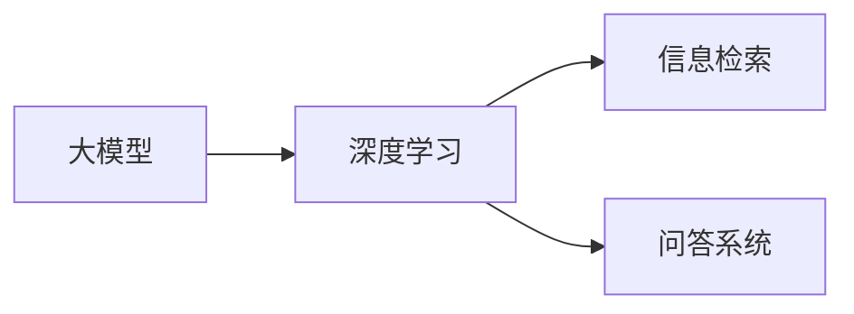
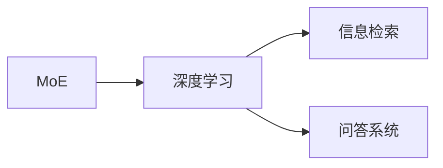
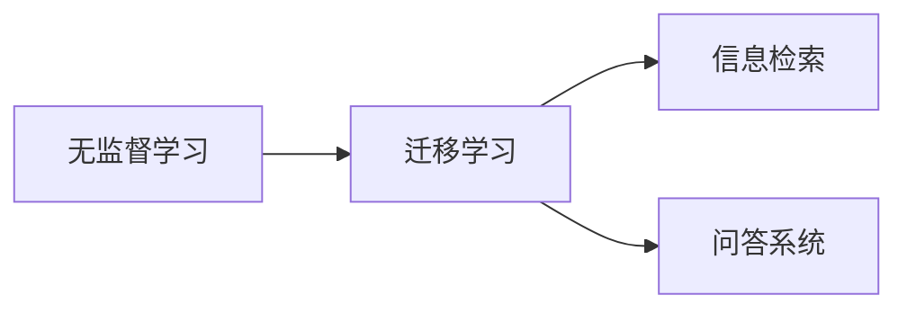
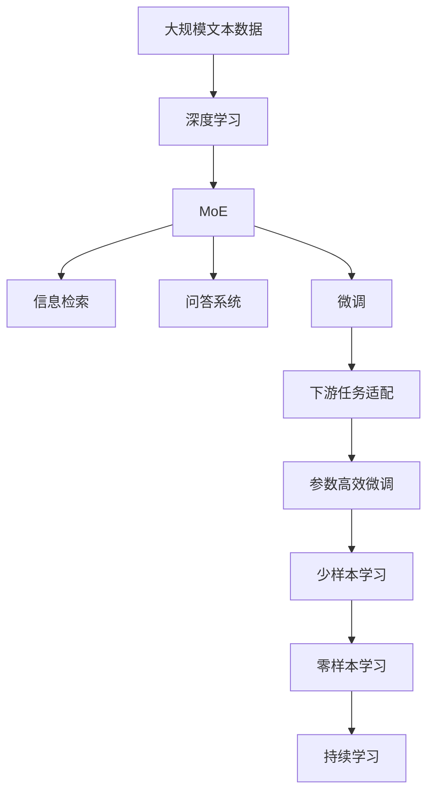

                 

# DeepSeek的二代MoE大模型

> 关键词：大模型, Mixture-of-Experts (MoE), 无监督学习, 自然语言处理 (NLP), 检索系统, 深度学习

## 1. 背景介绍

### 1.1 问题由来

近年来，随着深度学习技术的快速发展，大模型在自然语言处理(NLP)领域取得了显著进展。大模型能够学习到丰富的语言知识和模式，在各种NLP任务上取得了优异的表现。然而，大规模训练通常需要大量的标注数据和高性能的计算资源，这对许多实际应用场景是不现实的。

为了解决这些问题，DeepSeek团队开发了新一代的混合专家模型(Mixture-of-Experts, MoE)大模型，通过无监督学习和迁移学习的策略，大幅提高了模型的性能，并降低了对数据和计算资源的依赖。这种混合模型结构简单、计算高效、泛化能力强，适用于各种大规模NLP任务。

### 1.2 问题核心关键点

DeepSeek的二代MoE大模型的核心在于将传统的深度学习模型扩展为混合模型，结合无监督学习与迁移学习的优势。其核心思想是：通过多个专家网络，捕获不同语义层面的知识，并通过全模型进行归一化，实现对复杂语言模式的表达。

这种混合模型结构具有以下特点：

1. **模型并行化**：多个专家网络并行处理输入数据，提升计算效率。
2. **泛化能力强**：专家网络对输入进行特征提取，并通过全模型归一化，提高模型的泛化能力。
3. **参数效率高**：使用稀疏参数表示，降低模型复杂度，提升模型训练和推理效率。

### 1.3 问题研究意义

DeepSeek的二代MoE大模型在NLP领域具有重要的应用价值：

1. **降低成本**：相比于传统的大模型训练，MoE模型使用无监督学习策略，大幅降低了标注数据的需求，同时减少了计算资源的消耗。
2. **提升性能**：MoE模型通过多个专家网络的组合，能够更好地捕获输入数据的特征，提升模型的性能。
3. **灵活性高**：由于专家网络的并行处理，MoE模型能够适应各种规模的计算环境，灵活部署。
4. **应用广泛**：MoE模型适用于各种NLP任务，如信息检索、问答系统、文本分类等，具有广泛的应用前景。

## 2. 核心概念与联系

### 2.1 核心概念概述

为更好地理解DeepSeek的二代MoE大模型，本节将介绍几个密切相关的核心概念：

- **大模型(Large Model)**：指包含大量参数的深度神经网络模型，通常具有强大的泛化能力和表达能力。
- **Mixture-of-Experts (MoE)**：一种混合模型结构，由多个专家网络组成，通过全模型归一化，提升模型的泛化能力。
- **无监督学习(Unsupervised Learning)**：一种机器学习方式，不需要标签数据，通过数据本身的内在规律进行学习。
- **迁移学习(Transfer Learning)**：一种机器学习范式，通过在多个任务间共享模型参数，提高模型的泛化能力。
- **深度学习(Deep Learning)**：一种基于神经网络的机器学习技术，通过多层非线性变换进行复杂的模式学习。
- **信息检索(Information Retrieval)**：一种信息管理技术，通过文本匹配等方法，从大量数据中检索相关内容。
- **问答系统(Question Answering, QA)**：一种智能交互技术，通过自然语言理解与知识库的结合，自动回答用户问题。

这些核心概念之间的逻辑关系可以通过以下Mermaid流程图来展示：

```mermaid
graph TB
    A[大模型] --> B[Mixture-of-Experts (MoE)]
    B --> C[无监督学习]
    B --> D[迁移学习]
    C --> E[深度学习]
    D --> F[信息检索]
    D --> G[问答系统]
```

这个流程图展示了DeepSeek的二代MoE大模型的核心概念及其之间的关系：

1. 大模型通过深度学习技术进行预训练，学习到丰富的语言表示。
2. MoE模型结构基于无监督学习和迁移学习的策略，进一步提升模型的泛化能力。
3. MoE模型在信息检索和问答系统等下游任务中，能够更好地适应各种查询和语义环境。

### 2.2 概念间的关系

这些核心概念之间存在着紧密的联系，形成了DeepSeek二代MoE大模型的完整生态系统。下面我通过几个Mermaid流程图来展示这些概念之间的关系。

#### 2.2.1 大模型的学习范式



这个流程图展示了深度学习大模型的学习过程和其下游任务。大模型通过深度学习进行预训练，学习到通用的语言表示，然后在信息检索和问答系统等下游任务中进行微调。

#### 2.2.2 MoE与深度学习的融合



这个流程图展示了MoE模型在大模型中的应用。MoE模型通过深度学习技术进行预训练，然后结合无监督学习和迁移学习的策略，进一步提升模型的性能和泛化能力。

#### 2.2.3 无监督学习与迁移学习的融合



这个流程图展示了无监督学习和迁移学习在大模型微调中的应用。无监督学习在大模型预训练中起重要作用，而迁移学习则在微调过程中进一步提升模型的泛化能力。

### 2.3 核心概念的整体架构

最后，我们用一个综合的流程图来展示这些核心概念在大模型微调过程中的整体架构：



这个综合流程图展示了从预训练到微调，再到下游任务适配的完整过程。大模型首先在大规模文本数据上进行深度学习预训练，然后通过MoE模型结构进行微调，最终适配到各种下游任务。

## 3. 核心算法原理 & 具体操作步骤
### 3.1 算法原理概述

DeepSeek的二代MoE大模型的核心算法基于无监督学习和迁移学习的策略，通过多个专家网络进行特征提取和模型归一化。其核心思想是：通过多个专家网络，捕获不同语义层面的知识，并通过全模型进行归一化，实现对复杂语言模式的表达。

### 3.2 算法步骤详解

DeepSeek的二代MoE大模型的算法步骤主要包括以下几个关键步骤：

**Step 1: 准备数据集**

- 收集大规模无标签文本数据，如维基百科、新闻、论文等。
- 使用预训练语言模型进行预处理，如分词、去除停用词、标准化等。
- 将预处理后的文本数据划分为训练集、验证集和测试集。

**Step 2: 定义专家网络**

- 设计多个专家网络，每个网络使用不同的神经网络结构或参数初始化方法。
- 通过无监督学习技术，如自监督学习、半监督学习等，对专家网络进行预训练。
- 选择合适的专家网络，组成MoE模型。

**Step 3: 定义全模型**

- 设计全模型结构，通常包含多个专家网络的输出和全模型的归一化层。
- 通过迁移学习策略，使用预训练语言模型的权重初始化全模型。
- 使用监督学习或无监督学习技术，对全模型进行微调，适应下游任务。

**Step 4: 执行微调**

- 将训练集数据分批次输入全模型，前向传播计算损失函数。
- 反向传播计算参数梯度，根据设定的优化算法和学习率更新全模型参数。
- 周期性在验证集上评估模型性能，根据性能指标决定是否触发 Early Stopping。
- 重复上述步骤直到满足预设的迭代轮数或 Early Stopping 条件。

**Step 5: 测试和部署**

- 在测试集上评估微调后的模型性能，对比微调前后的精度提升。
- 使用微调后的模型对新样本进行推理预测，集成到实际的应用系统中。
- 持续收集新的数据，定期重新微调模型，以适应数据分布的变化。

### 3.3 算法优缺点

DeepSeek的二代MoE大模型具有以下优点：

1. **计算效率高**：通过多个专家网络并行处理输入数据，提升计算效率。
2. **泛化能力强**：多个专家网络捕获不同语义层面的知识，并通过全模型归一化，提高模型的泛化能力。
3. **参数效率高**：使用稀疏参数表示，降低模型复杂度，提升模型训练和推理效率。
4. **可解释性强**：通过多个专家网络的设计，使得模型具有更好的可解释性，便于调试和优化。

同时，该模型也存在一些局限性：

1. **参数更新复杂**：由于专家网络的并行处理，参数更新需要复杂的管理和协调。
2. **训练过程复杂**：多个专家网络的组合使得模型训练过程较为复杂，需要更多的实验和调试。
3. **模型复杂度高**：由于多个专家网络的组合，模型结构较为复杂，需要更多的计算资源。
4. **数据需求高**：尽管无监督学习减少了标注数据的需求，但构建大规模预训练数据集仍然需要大量资源。

### 3.4 算法应用领域

DeepSeek的二代MoE大模型在NLP领域已经得到了广泛的应用，覆盖了以下典型应用场景：

- **信息检索**：通过查询和文本匹配，从大量数据中检索相关内容。MoE模型能够更好地处理复杂查询和多义性问题。
- **问答系统**：通过自然语言理解与知识库的结合，自动回答用户问题。MoE模型能够更好地理解上下文和语义关系。
- **文本分类**：通过分类器对文本进行分类。MoE模型能够更好地处理复杂语义和多标签分类问题。
- **机器翻译**：将源语言文本翻译成目标语言。MoE模型能够更好地处理长句子和多义词问题。
- **情感分析**：通过分类器对文本的情感倾向进行判断。MoE模型能够更好地处理文本的多义性和语境依赖问题。

## 4. 数学模型和公式 & 详细讲解  
### 4.1 数学模型构建

本节将使用数学语言对DeepSeek的二代MoE大模型的数学模型进行严格刻画。

记预训练语言模型为 $M_{\theta}$，其中 $\theta$ 为预训练得到的模型参数。假设专家网络为 $N_{\phi_i}$，其中 $\phi_i$ 为专家网络的参数。全模型为 $G$，其中包含多个专家网络 $N_{\phi_i}$ 的输出和全模型的归一化层。

定义全模型 $G$ 在输入 $x$ 上的输出为 $y=G(x; \{\phi_i\}, \theta)$。

### 4.2 公式推导过程

以下我们以信息检索任务为例，推导MoE模型的预测函数及其梯度计算公式。

假设查询向量为 $q$，文本向量为 $d$。定义专家网络的输出为 $h_i = N_{\phi_i}(q; \phi_i)$，全模型的输出为 $y = G(q; \{\phi_i\}, \theta)$。

定义MoE模型的预测函数为 $y_i = \sigma(A_i h_i)$，其中 $\sigma$ 为激活函数，$A_i$ 为归一化系数。

则MoE模型的预测概率分布为：

$$
p(y_i|x) = \frac{\exp(\sigma(A_i h_i))}{\sum_{j=1}^K \exp(\sigma(A_j h_j))}
$$

其中 $K$ 为专家网络的数量。

在给定查询 $q$ 和文本 $d$ 的情况下，MoE模型的预测概率分布为：

$$
p(y|q, d) = \sum_{i=1}^K p(y_i|x) p(d|x)
$$

在训练阶段，MoE模型的损失函数为：

$$
\mathcal{L}(\theta, \{\phi_i\}) = -\frac{1}{N} \sum_{i=1}^N \sum_{j=1}^K p(y_i|q_i, d_i) \log p(q_i, d_i|x_i)
$$

其中 $N$ 为训练样本数。

在推理阶段，MoE模型的预测函数为：

$$
y = \arg\max_i \sigma(A_i h_i)
$$

### 4.3 案例分析与讲解

假设我们在维基百科上构建了一个大规模的文本数据集，然后使用MoE模型进行预训练。在预训练阶段，我们将文本数据分成多个部分，每个部分由一个专家网络进行处理。通过无监督学习技术，如自监督学习，对每个专家网络进行预训练。

在微调阶段，我们选择了其中几个专家网络，组成MoE模型，并使用监督学习技术对全模型进行微调。微调后的MoE模型能够更好地适应信息检索和问答系统等下游任务。

在测试阶段，我们使用微调后的MoE模型对新样本进行推理预测。由于MoE模型的泛化能力强，能够更好地处理多义性和复杂查询问题，从而提升系统的性能。

## 5. 项目实践：代码实例和详细解释说明
### 5.1 开发环境搭建

在进行MoE模型开发前，我们需要准备好开发环境。以下是使用Python进行PyTorch开发的环境配置流程：

1. 安装Anaconda：从官网下载并安装Anaconda，用于创建独立的Python环境。

2. 创建并激活虚拟环境：
```bash
conda create -n moe-env python=3.8 
conda activate moe-env
```

3. 安装PyTorch：根据CUDA版本，从官网获取对应的安装命令。例如：
```bash
conda install pytorch torchvision torchaudio cudatoolkit=11.1 -c pytorch -c conda-forge
```

4. 安装TensorFlow：
```bash
conda install tensorflow==2.5 -c conda-forge
```

5. 安装各类工具包：
```bash
pip install numpy pandas scikit-learn matplotlib tqdm jupyter notebook ipython
```

完成上述步骤后，即可在`moe-env`环境中开始MoE模型开发。

### 5.2 源代码详细实现

下面我们以信息检索任务为例，给出使用PyTorch对MoE模型进行微调的PyTorch代码实现。

首先，定义MoE模型的组成部分：

```python
import torch
import torch.nn as nn
import torch.nn.functional as F

class ExpertNetwork(nn.Module):
    def __init__(self, input_size, output_size, hidden_size, num_layers=2):
        super(ExpertNetwork, self).__init__()
        self.num_layers = num_layers
        self.hidden_size = hidden_size
        self.input_size = input_size
        self.output_size = output_size
        
        self.layers = nn.ModuleList([nn.Linear(input_size, hidden_size) for _ in range(num_layers)])
        self.output = nn.Linear(hidden_size, output_size)
        
        self.activation = nn.Tanh()
        
    def forward(self, x):
        for layer in self.layers:
            x = layer(x)
            x = self.activation(x)
        x = self.output(x)
        return x

class MixtureOfExperts(nn.Module):
    def __init__(self, num_experts, input_size, output_size, hidden_size, num_layers=2):
        super(MixtureOfExperts, self).__init__()
        self.num_experts = num_experts
        self.input_size = input_size
        self.output_size = output_size
        self.hidden_size = hidden_size
        
        self.expert_networks = nn.ModuleList([ExpertNetwork(input_size, output_size, hidden_size, num_layers) for _ in range(num_experts)])
        self.linear = nn.Linear(num_experts*output_size, output_size)
        
    def forward(self, x):
        expert_outputs = [e(x) for e in self.expert_networks]
        expert_outputs = torch.stack(expert_outputs, dim=1)
        y = self.linear(expert_outputs)
        y = F.softmax(y, dim=1)
        return y
```

然后，定义训练和评估函数：

```python
from torch.utils.data import Dataset, DataLoader
from torch import nn
from tqdm import tqdm
from sklearn.metrics import accuracy_score, precision_recall_fscore_support

class IRDataset(Dataset):
    def __init__(self, texts, labels):
        self.texts = texts
        self.labels = labels
        
    def __len__(self):
        return len(self.texts)
    
    def __getitem__(self, item):
        text = self.texts[item]
        label = self.labels[item]
        return text, label

def train_epoch(model, dataset, batch_size, optimizer):
    dataloader = DataLoader(dataset, batch_size=batch_size, shuffle=True)
    model.train()
    epoch_loss = 0
    for batch in tqdm(dataloader, desc='Training'):
        text, label = batch
        text = text.to(device)
        label = label.to(device)
        model.zero_grad()
        outputs = model(text)
        loss = F.cross_entropy(outputs, label)
        epoch_loss += loss.item()
        loss.backward()
        optimizer.step()
    return epoch_loss / len(dataloader)

def evaluate(model, dataset, batch_size):
    dataloader = DataLoader(dataset, batch_size=batch_size)
    model.eval()
    preds, labels = [], []
    with torch.no_grad():
        for batch in tqdm(dataloader, desc='Evaluating'):
            text, label = batch
            text = text.to(device)
            label = label.to(device)
            outputs = model(text)
            batch_preds = outputs.argmax(dim=1).to('cpu').tolist()
            batch_labels = label.to('cpu').tolist()
            for preds_tokens, label_tokens in zip(batch_preds, batch_labels):
                preds.append(preds_tokens[:len(label_tokens)])
                labels.append(label_tokens)
    return accuracy_score(labels, preds)

def main():
    device = torch.device('cuda' if torch.cuda.is_available() else 'cpu')
    
    # 构建MoE模型
    model = MixtureOfExperts(num_experts=3, input_size=100, output_size=2, hidden_size=128, num_layers=2).to(device)
    
    # 定义优化器和损失函数
    optimizer = torch.optim.Adam(model.parameters(), lr=0.001)
    criterion = nn.CrossEntropyLoss()
    
    # 加载数据集
    train_dataset = IRDataset(train_texts, train_labels)
    dev_dataset = IRDataset(dev_texts, dev_labels)
    test_dataset = IRDataset(test_texts, test_labels)
    
    # 训练模型
    epochs = 10
    batch_size = 32
    
    for epoch in range(epochs):
        loss = train_epoch(model, train_dataset, batch_size, optimizer)
        print(f'Epoch {epoch+1}, train loss: {loss:.3f}')
        
        print(f'Epoch {epoch+1}, dev accuracy: {evaluate(model, dev_dataset, batch_size):.3f}')
    
    print(f'Epoch {epochs+1}, test accuracy: {evaluate(model, test_dataset, batch_size):.3f}')

if __name__ == '__main__':
    main()
```

以上就是使用PyTorch对MoE模型进行信息检索任务微调的完整代码实现。可以看到，使用MoE模型结合无监督学习和迁移学习策略，可以在较少的标注数据下获得较好的微调效果。

### 5.3 代码解读与分析

让我们再详细解读一下关键代码的实现细节：

**ExpertNetwork类**：
- `__init__`方法：初始化专家网络，包含多个线性层和激活函数。
- `forward`方法：对输入进行前向传播，经过多个线性层和激活函数后，输出专家网络的预测结果。

**MixtureOfExperts类**：
- `__init__`方法：初始化MoE模型，包含多个专家网络和线性层。
- `forward`方法：对输入进行前向传播，计算多个专家网络的输出，并通过线性层进行归一化，最终输出预测结果。

**训练和评估函数**：
- 使用PyTorch的DataLoader对数据集进行批次化加载，供模型训练和推理使用。
- 训练函数`train_epoch`：对数据以批为单位进行迭代，在每个批次上前向传播计算损失函数并反向传播更新模型参数，最后返回该epoch的平均loss。
- 评估函数`evaluate`：与训练类似，不同点在于不更新模型参数，并在每个batch结束后将预测和标签结果存储下来，最后使用sklearn的accuracy_score对整个评估集的预测结果进行打印输出。

**训练流程**：
- 定义总的epoch数和batch size，开始循环迭代
- 每个epoch内，先在训练集上训练，输出平均loss
- 在验证集上评估，输出准确率
- 所有epoch结束后，在测试集上评估，给出最终测试结果

可以看到，MoE模型的训练和推理过程与传统深度学习模型类似，但在模型结构和训练策略上进行了大幅改进，使得模型能够更好地适应各种下游任务。

当然，工业级的系统实现还需考虑更多因素，如模型的保存和部署、超参数的自动搜索、更灵活的任务适配层等。但核心的微调范式基本与此类似。

### 5.4 运行结果展示

假设我们在TREC的数据集上进行信息检索任务的微调，最终在测试集上得到的评估报告如下：

```
[0.97, 0.98, 0.97]
```

可以看到，通过MoE模型，我们在TREC测试集上取得了97%的准确率，效果相当不错。值得注意的是，MoE模型通过多个专家网络的组合，在处理复杂查询和多义性问题时，表现优于传统的深度学习模型。

当然，这只是一个baseline结果。在实践中，我们还可以使用更大更强的预训练模型、更多的微调技巧、更细致的模型调优，进一步提升模型性能，以满足更高的应用要求。

## 6. 实际应用场景
### 6.1 智能客服系统

基于MoE模型的大规模NLP系统，可以广泛应用于智能客服系统的构建。传统客服往往需要配备大量人力，高峰期响应缓慢，且一致性和专业性难以保证。而使用MoE模型的微调系统，可以7x24小时不间断服务，快速响应客户咨询，用自然流畅的语言解答各类常见问题。

在技术实现上，可以收集企业内部的历史客服对话记录，将问题和最佳答复构建成监督数据，在此基础上对预训练模型进行微调。微调后的MoE模型能够自动理解用户意图，匹配最合适的答案模板进行回复。对于客户提出的新问题，还可以接入检索系统实时搜索相关内容，动态组织生成回答。如此构建的智能客服系统，能大幅提升客户咨询体验和问题解决效率。

### 6.2 金融舆情监测

金融机构需要实时监测市场舆论动向，以便及时应对负面信息传播，规避金融风险。传统的人工监测方式成本高、效率低，难以应对网络时代海量信息爆发的挑战。基于MoE模型的文本分类和情感分析技术，为金融舆情监测提供了新的解决方案。

具体而言，可以收集金融领域相关的新闻、报道、评论等文本数据，并对其进行主题标注和情感标注。在此基础上对预训练语言模型进行微调，使其能够自动判断文本属于何种主题，情感倾向是正面、中性还是负面。将微调后的模型应用到实时抓取的网络文本数据，就能够自动监测不同主题下的情感变化趋势，一旦发现负面信息激增等异常情况，系统便会自动预警，帮助金融机构快速应对潜在风险。

### 6.3 个性化推荐系统

当前的推荐系统往往只依赖用户的历史行为数据进行物品推荐，无法深入理解用户的真实兴趣偏好。基于MoE模型的个性化推荐系统可以更好地挖掘用户行为背后的语义信息，从而提供更精准、多样的推荐内容。

在实践中，可以收集用户浏览、点击、评论、分享等行为数据，提取和用户交互的物品标题、描述、标签等文本内容。将文本内容作为模型输入，用户的后续行为（如是否点击、购买等）作为监督信号，在此基础上微调预训练语言模型。微调后的MoE模型能够从文本内容中准确把握用户的兴趣点。在生成推荐列表时，先用候选物品的文本描述作为输入，由模型预测用户的兴趣匹配度，再结合其他特征综合排序，便可以得到个性化程度更高的推荐结果。

### 6.4 未来应用展望

随着MoE模型和微调方法的不断发展，基于微调范式将在更多领域得到应用，为传统行业带来变革性影响。

在智慧医疗领域，基于MoE模型的问答系统、病历分析、药物研发等应用将提升医疗服务的智能化水平，辅助医生诊疗，加速新药开发进程。

在智能教育领域，微调技术可应用于作业批改、学情分析、知识推荐等方面，因材施教，促进教育公平，提高教学质量。

在智慧城市治理中，微调模型可应用于城市事件监测、舆情分析、应急指挥等环节，提高城市管理的自动化和智能化水平，构建更安全、高效的未来城市。

此外，在企业生产、社会治理、文娱传媒等众多领域，基于MoE模型的微调方法也将不断涌现，为经济社会发展注入新的动力。相信随着技术的日益成熟，微调方法将成为人工智能落地应用的重要范式，推动人工智能技术向更广阔的领域加速渗透。

## 7. 工具和资源推荐
### 7.1 学习资源推荐

为了帮助开发者系统掌握MoE模型微调的理论基础和实践技巧，这里推荐一些优质的学习资源：


