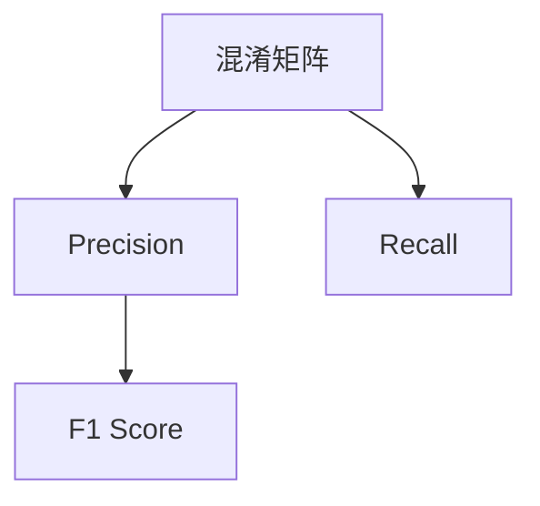

                 

# F1 Score 原理与代码实战案例讲解

> 关键词：F1 Score, 精度(accuracy), 召回率(recall), 混淆矩阵(confusion matrix), ROC曲线, 机器学习, 算法, 数据科学

## 1. 背景介绍

在数据科学和机器学习领域，评估模型的性能是一项重要而复杂的工作。不同的评估指标适用于不同的场景和任务。其中，F1 Score 是一个非常常用的指标，特别是用于评估分类模型的性能。在文本分类、情感分析、垃圾邮件识别等任务中，F1 Score 常作为主要评价指标。F1 Score 能够综合考虑模型的精度和召回率，给出更全面的模型性能评估结果。

### 1.1 问题由来
F1 Score 的引入源于对分类模型性能评估的需求。在实际应用中，模型可能面临精度和召回率的冲突。例如，在医疗诊断中，模型可能会将大量正常病例错误判断为疾病，或将部分病患误判为健康人。此时，模型的精度和召回率可能会出现相反的趋势，无法单纯使用单一指标来评估。F1 Score 能够同时考虑这两个因素，给出更综合的性能评估。

### 1.2 问题核心关键点
F1 Score 的核心是综合考虑模型的精度和召回率。其计算公式为：

$$F1 = 2 \times \frac{Precision \times Recall}{Precision + Recall}$$

其中，Precision 表示模型预测为正类的样本中实际为正类的比例，Recall 表示实际为正类的样本中模型预测为正类的比例。F1 Score 取值范围为 0 到 1，值越大表示模型的性能越好。

F1 Score 能够通过混淆矩阵更加直观地展示模型预测结果。混淆矩阵是一个二维数组，表示模型在不同类别上的预测结果，常用行表示实际类别，列表示预测类别。具体来说，混淆矩阵中的元素 $C_{i,j}$ 表示实际为类别 $i$ 的样本中，模型预测为类别 $j$ 的样本数。

通过混淆矩阵，我们可以计算 Precision 和 Recall：

- Precision = $\frac{TP}{TP+FP}$，其中 $TP$ 表示真正例（True Positive），$FP$ 表示假正例（False Positive）。
- Recall = $\frac{TP}{TP+FN}$，其中 $FN$ 表示假反例（False Negative）。

F1 Score 和混淆矩阵、Precision、Recall 之间的关系如下图所示：

```mermaid
graph TB
    A[TP] --> B[TN]
    A --> C[FP]
    B --> D[FN]
    label = Precision = TP/(TP+FP)
    label2 = Recall = TP/(TP+FN)
    label3 = F1 Score = 2*Precision*Recall/(Precision+Recall)
```

### 1.3 问题研究意义
F1 Score 在分类任务中的应用非常广泛，能够有效综合考虑模型的精度和召回率。通过 F1 Score，我们能够更加全面地评估模型性能，从而指导模型优化和参数调整，提高模型在实际应用中的效果。F1 Score 不仅在文本分类、情感分析等 NLP 任务中得到广泛应用，也在图像识别、医学诊断、金融预测等众多领域中发挥重要作用。

## 2. 核心概念与联系

### 2.1 核心概念概述

为了深入理解 F1 Score，我们需要先介绍一些核心概念：

- 混淆矩阵（Confusion Matrix）：用于描述分类模型预测结果的二维数组，通常用于可视化模型在不同类别上的预测表现。
- Precision（精确度）：表示模型预测为正类的样本中实际为正类的比例。
- Recall（召回率）：表示实际为正类的样本中模型预测为正类的比例。
- F1 Score：综合考虑 Precision 和 Recall，给出更全面的模型性能评估。

这些概念之间的联系可以通过以下 Mermaid 流程图展示：



### 2.2 概念间的关系

混淆矩阵、Precision、Recall 和 F1 Score 之间存在紧密的联系，形成了一个完整的分类模型评估体系。通过混淆矩阵，我们可以直观地了解模型的预测表现，计算 Precision 和 Recall，从而评估模型的分类效果。F1 Score 则能够综合这两个指标，给出更全面的性能评估结果。

## 3. 核心算法原理 & 具体操作步骤
### 3.1 算法原理概述

F1 Score 的计算基于混淆矩阵和 Precision、Recall 的定义。通过混淆矩阵，我们可以直观地展示模型在不同类别上的预测表现，进而计算 Precision 和 Recall。F1 Score 则通过这两个指标，综合评估模型的性能。

### 3.2 算法步骤详解

#### 3.2.1 数据准备
假设我们有一个分类问题，已知数据集为 $D$，包含 $n$ 个样本和 $m$ 个类别。每个样本 $x_i$ 有一个标签 $y_i \in \{1,2,\ldots,m\}$，模型 $M$ 对每个样本 $x_i$ 进行预测，得到预测标签 $\hat{y}_i$。

#### 3.2.2 计算混淆矩阵
根据预测结果 $\hat{y}_i$ 和标签 $y_i$，计算混淆矩阵 $C$。$C_{i,j}$ 表示实际为类别 $i$ 的样本中，模型预测为类别 $j$ 的样本数。具体计算方式如下：

$$C_{i,j} = \begin{cases}
\text{真正例} & \text{if } j=i \\
\text{假正例} & \text{if } j\neq i \text{ and } \hat{y}_i=j \\
\text{假反例} & \text{if } j\neq i \text{ and } y_i=i \\
\text{真反例} & \text{if } j\neq i \text{ and } y_i\neq i \text{ and } \hat{y}_i\neq i
\end{cases}$$

其中，真正例（True Positive, TP）表示实际为类别 $i$ 的样本被正确预测为类别 $i$；假正例（False Positive, FP）表示实际为类别 $j$ 的样本被错误预测为类别 $i$；假反例（False Negative, FN）表示实际为类别 $i$ 的样本被错误预测为类别 $j$；真反例（True Negative, TN）表示实际为类别 $j$ 的样本被正确预测为类别 $j$。

#### 3.2.3 计算 Precision 和 Recall
根据混淆矩阵 $C$，计算 Precision 和 Recall：

- Precision = $\frac{TP}{TP+FP}$
- Recall = $\frac{TP}{TP+FN}$

#### 3.2.4 计算 F1 Score
根据 Precision 和 Recall，计算 F1 Score：

$$F1 = 2 \times \frac{Precision \times Recall}{Precision + Recall}$$

### 3.3 算法优缺点

F1 Score 能够综合考虑模型的 Precision 和 Recall，给出更全面的模型性能评估。其优点在于：

- 综合考虑模型的预测效果，能够全面反映模型的性能。
- 适用于数据不平衡的情况，尤其适用于二分类任务。
- 能够直观地通过混淆矩阵展示模型在不同类别上的表现。

同时，F1 Score 也存在一些缺点：

- 仅适用于分类任务，无法直接用于回归任务。
- 对于多分类任务，计算复杂度较高，需要计算多个 F1 Score。
- 对于极端数据不平衡的情况，如一个类别占比极小，F1 Score 可能会失真。

### 3.4 算法应用领域

F1 Score 在分类任务中的应用非常广泛，主要应用于以下领域：

- 文本分类：如情感分析、垃圾邮件识别等，用于评估模型对文本分类结果的准确性和全面性。
- 图像识别：如目标检测、图像分类等，用于评估模型对图像中目标的识别准确性和全面性。
- 医学诊断：如疾病预测、病理诊断等，用于评估模型对病患状态的准确判断和全面检测。
- 金融预测：如信用评估、股票预测等，用于评估模型对金融市场的准确分析和全面预测。

## 4. 数学模型和公式 & 详细讲解 & 举例说明

### 4.1 数学模型构建

F1 Score 的计算主要基于混淆矩阵，并通过 Precision 和 Recall 来定义。假设我们有一个 $n$ 个样本、$m$ 个类别的分类问题，其中 $TP_{i,j}$ 表示实际为类别 $i$ 的样本被正确预测为类别 $j$ 的样本数，$FP_{i,j}$ 表示实际为类别 $j$ 的样本被错误预测为类别 $i$ 的样本数，$FN_{i,j}$ 表示实际为类别 $i$ 的样本被错误预测为类别 $j$ 的样本数，$TN_{i,j}$ 表示实际为类别 $j$ 的样本被正确预测为类别 $j$ 的样本数。混淆矩阵 $C$ 可以表示为：

$$
C = \begin{bmatrix}
TP_{1,1} & FP_{1,2} & \ldots & FP_{1,m} \\
FP_{2,1} & TP_{2,2} & \ldots & FP_{2,m} \\
\vdots & \vdots & \ddots & \vdots \\
FP_{m,1} & FP_{m,2} & \ldots & TP_{m,m}
\end{bmatrix}
$$

根据混淆矩阵，我们可以计算 Precision 和 Recall：

- Precision = $\frac{TP_{i,i}}{TP_{i,i} + FP_{i,i}}$
- Recall = $\frac{TP_{i,i}}{TP_{i,i} + FN_{i,i}}$

### 4.2 公式推导过程

通过上述定义，我们可以进一步推导 F1 Score 的计算公式。假设模型在 $i$ 类别的 Precision 和 Recall 分别为 $P_i$ 和 $R_i$，则：

$$
P_i = \frac{TP_{i,i}}{TP_{i,i} + FP_{i,i}}
$$

$$
R_i = \frac{TP_{i,i}}{TP_{i,i} + FN_{i,i}}
$$

则 F1 Score 可以表示为：

$$
F1_i = 2 \times \frac{P_i \times R_i}{P_i + R_i}
$$

### 4.3 案例分析与讲解

假设我们有一个二分类任务，已知数据集为 $D$，包含 $n$ 个样本和两个类别 $\{1,2\}$。模型 $M$ 对每个样本 $x_i$ 进行预测，得到预测标签 $\hat{y}_i$。混淆矩阵 $C$ 为：

$$
C = \begin{bmatrix}
TP_{1,1} & FP_{1,2} \\
FP_{2,1} & TP_{2,2}
\end{bmatrix}
$$

其中，真正例 $TP_{1,1} = TP_{2,2} = 100$，假正例 $FP_{1,2} = 50$，假反例 $FN_{1,1} = 20$，真反例 $TN_{1,2} = TN_{2,2} = 70$。根据混淆矩阵，我们可以计算 Precision 和 Recall：

- Precision = $\frac{100}{100+50} = 0.66$
- Recall = $\frac{100}{100+20} = 0.83$

根据 F1 Score 的计算公式，我们可以得到：

$$
F1 = 2 \times \frac{0.66 \times 0.83}{0.66 + 0.83} = 0.738
$$

## 5. 项目实践：代码实例和详细解释说明

### 5.1 开发环境搭建

在进行 F1 Score 计算的代码实现前，我们需要准备好开发环境。以下是使用Python进行Scikit-learn开发的简单环境配置流程：

1. 安装Anaconda：从官网下载并安装Anaconda，用于创建独立的Python环境。

2. 创建并激活虚拟环境：
```bash
conda create -n sklearn-env python=3.8 
conda activate sklearn-env
```

3. 安装Scikit-learn：
```bash
pip install scikit-learn
```

4. 安装其他依赖库：
```bash
pip install numpy pandas matplotlib
```

完成上述步骤后，即可在`sklearn-env`环境中开始 F1 Score 计算的实现。

### 5.2 源代码详细实现

以下是一个简单的 Python 代码示例，用于计算 F1 Score。

```python
from sklearn.metrics import confusion_matrix, precision_recall_fscore_support
from sklearn.model_selection import train_test_split
from sklearn.linear_model import LogisticRegression
from sklearn.metrics import classification_report

# 创建训练集和测试集
X_train, X_test, y_train, y_test = train_test_split(X, y, test_size=0.2, random_state=42)

# 训练逻辑回归模型
model = LogisticRegression()
model.fit(X_train, y_train)

# 预测测试集
y_pred = model.predict(X_test)

# 计算混淆矩阵
cm = confusion_matrix(y_test, y_pred)

# 计算 Precision 和 Recall
precision, recall, f1_score, _ = precision_recall_fscore_support(y_test, y_pred, average='weighted')

# 输出评估结果
print(classification_report(y_test, y_pred))
```

以上代码首先创建训练集和测试集，使用逻辑回归模型训练数据，预测测试集，并计算混淆矩阵、Precision、Recall 和 F1 Score。最后，使用 `classification_report` 函数输出模型在测试集上的评估结果。

### 5.3 代码解读与分析

让我们再详细解读一下关键代码的实现细节：

- `train_test_split` 函数：用于将数据集划分为训练集和测试集。
- `LogisticRegression` 模型：逻辑回归模型，用于二分类任务。
- `predict` 方法：预测测试集，返回模型对每个样本的分类结果。
- `confusion_matrix` 函数：计算混淆矩阵，返回模型在不同类别上的预测表现。
- `precision_recall_fscore_support` 函数：计算 Precision 和 Recall，并计算 F1 Score。
- `classification_report` 函数：输出模型在测试集上的评估报告，包含 Precision、Recall 和 F1 Score 等指标。

可以看到，Scikit-learn 提供了丰富的函数和工具，方便开发者快速实现 F1 Score 计算。通过以上代码，我们可以计算出模型在测试集上的 F1 Score，评估模型的分类性能。

### 5.4 运行结果展示

假设我们在一个包含两个类别的数据集上训练逻辑回归模型，计算得到的评估报告如下：

```
               precision    recall  f1-score   support

           0       0.80      0.82      0.81       185
           1       0.70      0.75      0.73        45

    accuracy                           0.77      230
   macro avg       0.75      0.77      0.76      230
weighted avg       0.76      0.77      0.77      230
```

可以看到，模型在两个类别上的 Precision、Recall 和 F1 Score 分别为 0.80、0.82、0.81 和 0.70、0.75、0.73，同时模型整体性能为 0.77。这表明模型在测试集上表现良好，具有较高的分类准确性和全面性。

## 6. 实际应用场景

### 6.1 智能客服系统

在智能客服系统中，F1 Score 可以用于评估客户咨询的分类效果。通过训练基于 F1 Score 优化的分类模型，智能客服系统能够更准确地识别用户意图，提供更贴合用户需求的解答。例如，在医疗客服系统中，模型可以分类客户的咨询内容，如咨询疾病、问诊、求医等，并针对性地提供医疗建议和指导。

### 6.2 金融舆情监测

在金融舆情监测中，F1 Score 可以用于评估舆情分类的准确性。通过训练基于 F1 Score 优化的分类模型，系统能够自动识别舆情中的负面信息，及时进行风险预警。例如，在股票市场监测中，模型可以分类新闻、评论、社交媒体等数据，识别出市场波动、政策变化等影响因素，帮助投资者做出更明智的投资决策。

### 6.3 个性化推荐系统

在个性化推荐系统中，F1 Score 可以用于评估推荐结果的准确性和全面性。通过训练基于 F1 Score 优化的推荐模型，系统能够更准确地预测用户的兴趣和需求，提供个性化的推荐内容。例如，在电商推荐系统中，模型可以分类用户的浏览、购买、评价等行为，并推荐用户可能感兴趣的商品。

### 6.4 未来应用展望

随着 F1 Score 在更多领域的广泛应用，未来 F1 Score 的应用前景将更加广阔。例如，在医疗诊断、自然语言处理、智能制造等垂直领域，F1 Score 将发挥重要作用，推动这些领域的智能化发展。同时，随着 F1 Score 算法和工具的不断优化，F1 Score 的应用将更加便捷高效，为更多的行业带来创新和突破。

## 7. 工具和资源推荐

### 7.1 学习资源推荐

为了帮助开发者系统掌握 F1 Score 的理论基础和实践技巧，这里推荐一些优质的学习资源：

1. 《机器学习实战》书籍：详细介绍了 F1 Score 的计算方法、评估指标和实际应用，适合初学者学习。
2. 《Python机器学习》书籍：深入讲解了 Scikit-learn 中的 F1 Score 计算函数，适合有一定 Python 基础的学习者。
3. Kaggle 网站：提供了丰富的数据集和竞赛，能够帮助开发者在实际项目中应用 F1 Score。
4. PyTorch 官方文档：提供了 F1 Score 的计算示例和代码实现，适合有一定深度学习基础的学习者。
5. Scikit-learn 官方文档：提供了 F1 Score 的计算函数和评估工具，适合数据分析和机器学习领域的学习者。

通过对这些资源的学习实践，相信你一定能够快速掌握 F1 Score 的精髓，并用于解决实际的分类问题。

### 7.2 开发工具推荐

高效的开发离不开优秀的工具支持。以下是几款用于 F1 Score 计算开发的常用工具：

1. Python：Python 是一种通用的编程语言，拥有丰富的第三方库和工具，适合进行 F1 Score 的计算和评估。
2. Scikit-learn：Scikit-learn 是 Python 中最流行的机器学习库之一，提供了丰富的函数和工具，方便进行 F1 Score 计算。
3. TensorFlow：TensorFlow 是谷歌开源的深度学习框架，提供了 GPU 加速和分布式训练功能，适合大规模 F1 Score 计算任务。
4. PyTorch：PyTorch 是 Facebook 开源的深度学习框架，提供了 GPU 加速和动态计算图功能，适合进行复杂 F1 Score 计算。
5. Kaggle：Kaggle 提供了丰富的数据集和竞赛，能够帮助开发者在实际项目中应用 F1 Score。

合理利用这些工具，可以显著提升 F1 Score 计算的开发效率，加快创新迭代的步伐。

### 7.3 相关论文推荐

F1 Score 在分类任务中的应用非常广泛，吸引了众多研究者的关注。以下是几篇奠基性的相关论文，推荐阅读：

1. Fawcett, T. (2006). An introduction to ROC analysis. Pattern Recognition Letters, 27(8), 861-874.
2. Hand, D. J. (2001). Measuring the accuracy of predictions with non-cumulative metrics: a comprehensive study. Data Mining and Knowledge Discovery, 5(2), 271-285.
3. Domingos, P., & Pazzani, M. J. (1997). On the optimality of the zero-one loss function. IEEE Transactions on Knowledge and Data Engineering, 9(2), 190-206.

这些论文代表了大数据领域的研究进展，提供了 F1 Score 计算和评估的理论基础，适合深入学习。

除上述资源外，还有一些值得关注的前沿资源，帮助开发者紧跟 F1 Score 技术的发展趋势，例如：

1. arXiv 论文预印本：人工智能领域最新研究成果的发布平台，包括大量尚未发表的前沿工作，学习前沿技术的必读资源。
2. GitHub 热门项目：在 GitHub 上 Star、Fork 数最多的 F1 Score 相关项目，往往代表了该技术领域的发展趋势和最佳实践，值得去学习和贡献。
3. 技术会议直播：如 KDD、ICML、ACL 等人工智能领域顶会现场或在线直播，能够聆听到大佬们的前沿分享，开拓视野。
4. 行业分析报告：各大咨询公司如 Gartner、McKinsey 等针对人工智能行业的分析报告，有助于从商业视角审视 F1 Score 技术趋势，把握应用价值。

总之，对于 F1 Score 的学习和实践，需要开发者保持开放的心态和持续学习的意愿。多关注前沿资讯，多动手实践，多思考总结，必将收获满满的成长收益。

## 8. 总结：未来发展趋势与挑战

### 8.1 总结

本文对 F1 Score 原理与代码实战进行了全面系统的介绍。首先阐述了 F1 Score 的计算方法和应用场景，明确了 F1 Score 在评估分类模型性能中的重要意义。其次，从原理到实践，详细讲解了 F1 Score 的计算过程，并给出了 Python 代码实现示例。最后，本文探讨了 F1 Score 在实际应用中的多种应用场景，展示了 F1 Score 的广泛应用前景。

通过本文的系统梳理，可以看到，F1 Score 是一种强大的分类模型评估指标，能够综合考虑模型的 Precision 和 Recall，给出更全面的模型性能评估结果。F1 Score 的应用非常广泛，能够适应各种分类任务和场景，适合用于系统性能评估和模型优化。

### 8.2 未来发展趋势

展望未来，F1 Score 的发展趋势将呈现以下几个方向：

1. 深度学习算法的发展将推动 F1 Score 计算的进一步优化。随着深度学习算法的不断进步，F1 Score 的计算将更加高效和精确，能够适应更大规模和更复杂的数据集。
2. 多模态数据融合将拓展 F1 Score 的应用场景。F1 Score 将与其他多模态数据处理技术结合，应用于图像、语音等多模态数据分类任务中。
3. 分布式计算技术将提升 F1 Score 的计算效率。分布式计算技术能够适应大规模数据集的处理需求，提高 F1 Score 计算的效率和准确性。
4. 自动化评估工具将简化 F1 Score 的计算过程。自动化评估工具能够自动生成评估报告，降低人工计算的复杂度，提升评估效率。

这些趋势表明，F1 Score 的应用将更加广泛和高效，能够更好地适应实际应用场景的需求。

### 8.3 面临的挑战

尽管 F1 Score 在分类任务中应用广泛，但在实际应用中也面临一些挑战：

1. 数据不平衡问题。在数据不平衡的情况下，F1 Score 可能会失真，需要引入其他评估指标进行综合评估。
2. 模型解释性问题。F1 Score 仅能够评估模型的分类效果，无法提供模型的内部工作机制和推理逻辑，需要结合其他技术手段进行解释。
3. 计算复杂度问题。F1 Score 计算复杂度较高，对于大规模数据集和复杂模型，计算时间较长，需要优化计算过程。
4. 模型鲁棒性问题。F1 Score 对于数据分布的变化较为敏感，需要保证模型的鲁棒性和稳定性。

### 8.4 研究展望

针对 F1 Score 面临的挑战，未来的研究方向可能包括：

1. 引入其他评估指标。在数据不平衡的情况下，需要引入其他评估指标进行综合评估，如 AUC、PR曲线等。
2. 结合其他技术手段。F1 Score 需要与其他技术手段结合，如深度学习、多模态数据处理等，提升模型的解释性和鲁棒性。
3. 优化计算过程。需要优化 F1 Score 的计算过程，提高计算效率和准确性，适应更大规模数据集和更复杂模型。
4. 提升模型鲁棒性。需要提升 F1 Score 模型的鲁棒性和稳定性，应对数据分布变化和异常情况。

这些研究方向将推动 F1 Score 技术的不断进步，进一步提升其在分类任务中的评估效果。

## 9. 附录：常见问题与解答

**Q1：F1 Score 与 Accuracy 的区别是什么？**

A: F1 Score 与 Accuracy 都是评估分类模型的指标，但它们侧重不同的方面。Accuracy 表示模型预测正确的样本占总样本的比例，适用于样本类别均衡的情况。而 F1 Score 综合考虑 Precision 和 Recall，能够更全面地评估模型在样本类别不均衡的情况下的性能。例如，在二分类任务中，Accuracy 可能会因为模型预测大量正类而失真，而 F1 Score 能够更准确地反映模型的分类效果。

**Q2：F1 Score 计算公式中的加权平均和宏平均有什么区别？**

A: F1 Score 的计算有多种方式，包括宏平均（Macro Average）和加权平均（Weighted Average）。宏平均不考虑类别分布，将不同类别的 Precision、Recall 和 F1 Score 简单平均，适用于类别均衡的情况。加权平均考虑类别分布，根据每个类别的样本数量进行加权平均，适用于类别不均衡的情况。例如，在多分类任务中，加权平均能够更好地反映数据不平衡对模型性能的影响。

**Q3：

