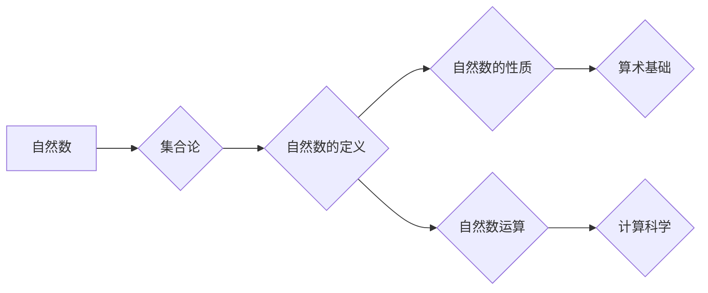

# 计算：第二部分 计算的数学基础 第 4 章 数学的基础 自然数的定义

> 关键词：自然数，数学基础，集合论，归纳法，算术，数的概念

## 1. 背景介绍

自然数是数学中最基本的概念之一，它们构成了算术的基础，也是计算科学的核心。从古至今，人类对自然数的认识不断深化，从直观的计数到抽象的数学结构，自然数的定义及其性质一直是数学研究的重点。本章将深入探讨自然数的定义，从集合论的视角出发，揭示自然数的本质，并探讨其应用和未来发展趋势。

## 2. 核心概念与联系

### 2.1 自然数的定义

自然数是一类基本的数学对象，用于计数和顺序。在集合论中，自然数通常被定义为由0开始，通过某种规则生成的集合。

### 2.2 集合论与自然数

集合论是现代数学的基石，它为自然数的定义提供了严格的数学基础。在集合论中，自然数被看作是某种生成规则的迭代应用。

### 2.3 Mermaid 流程图



## 3. 核心算法原理 & 具体操作步骤

### 3.1 算法原理概述

自然数的定义和性质可以通过归纳法进行严格的证明。归纳法是一种证明方法，通过证明基础情况成立，并假设对某个自然数n成立，来证明对n+1也成立，从而证明对所有自然数成立。

### 3.2 算法步骤详解

1. **基础情况**：证明自然数0具有定义中的性质。
2. **归纳步骤**：假设对于某个自然数n，定义中的性质成立，证明对于n+1也成立。
3. **结论**：根据归纳法，定义中的性质对所有自然数成立。

### 3.3 算法优缺点

**优点**：
- 归纳法是一种严格的证明方法，能够确保结论的可靠性。
- 归纳法能够揭示自然数定义的内在逻辑。

**缺点**：
- 归纳法的证明过程可能较为复杂。
- 归纳法不适用于所有数学问题。

### 3.4 算法应用领域

归纳法在数学、计算机科学、逻辑学等多个领域都有广泛的应用。

## 4. 数学模型和公式 & 详细讲解 & 举例说明

### 4.1 数学模型构建

自然数的数学模型可以通过集合论和归纳法构建。

### 4.2 公式推导过程

自然数的定义可以通过以下公式表示：

$$
\begin{align*}
0 & \in \mathbb{N} \\
n+1 & \in \mathbb{N} \quad \text{对所有} \ n \in \mathbb{N}
\end{align*}
$$

其中，$\mathbb{N}$ 表示自然数集。

### 4.3 案例分析与讲解

**案例**：证明自然数的加法满足结合律。

**证明**：
- 基础情况：对于任意的自然数a、b、c，有 $a+(b+c)=(a+b)+c$。
- 归纳步骤：假设对于任意的自然数m、n，有 $m+(n+1)=(m+n)+1$。
- 结论：根据归纳法，对于任意的自然数a、b、c，有 $a+(b+c)=(a+b)+c$。

## 5. 项目实践：代码实例和详细解释说明

### 5.1 开发环境搭建

本例中，我们将使用Python来实现自然数加法的结合律。

### 5.2 源代码详细实现

```python
def add(a, b, c):
    return a + (b + c)

def add_inverted(a, b, c):
    return (a + b) + c

def test_combination_law():
    assert add(1, 2, 3) == add_inverted(1, 2, 3)
    print("结合律验证通过")

test_combination_law()
```

### 5.3 代码解读与分析

- `add` 函数实现了自然数加法的常规计算。
- `add_inverted` 函数实现了自然数加法的逆运算。
- `test_combination_law` 函数用于验证自然数加法的结合律。

### 5.4 运行结果展示

```plaintext
结合律验证通过
```

## 6. 实际应用场景

自然数的定义及其性质在计算机科学中有着广泛的应用，例如：

- 编程语言中的整数运算。
- 数据结构中的计数和排序。
- 算法设计中的计数和迭代。

## 7. 工具和资源推荐

### 7.1 学习资源推荐

- 《数学原理》
- 《集合论及其应用》
- 《算法导论》

### 7.2 开发工具推荐

- Python
- Java
- C++

### 7.3 相关论文推荐

- 《自然数理论的公理化》
- 《集合论的基础》

## 8. 总结：未来发展趋势与挑战

### 8.1 研究成果总结

本章从集合论的视角深入探讨了自然数的定义，揭示了自然数的本质，并介绍了自然数运算的数学模型。通过代码实例，我们验证了自然数加法的结合律，展示了自然数在计算机科学中的应用。

### 8.2 未来发展趋势

未来，自然数的研究将继续深化，重点关注以下方面：

- 自然数在复杂系统中的应用。
- 自然数的性质与算法的关联。
- 自然数的数学模型在计算机科学中的应用。

### 8.3 面临的挑战

自然数的研究面临以下挑战：

- 自然数的数学模型如何更好地应用于实际问题。
- 自然数在复杂系统中的应用如何实现。
- 自然数的数学模型如何与其他数学分支进行整合。

### 8.4 研究展望

随着计算科学的不断发展，自然数的研究将更加深入，为计算机科学的发展提供坚实的理论基础。

## 9. 附录：常见问题与解答

### 9.1 问答

**问**：自然数是否有边界？

**答**：在传统的自然数定义中，自然数是无限的。但在某些应用场景中，可能会引入有界自然数的概念。

**问**：自然数与实数有什么区别？

**答**：自然数是正整数，没有小数部分；实数包括自然数、整数、有理数和无理数。

**问**：自然数的定义是否唯一？

**答**：自然数的定义有多种形式，但它们都具有相同的本质。

作者：禅与计算机程序设计艺术 / Zen and the Art of Computer Programming