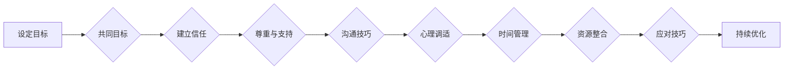

# 跨团队沟通协作能力和抗压能力培养

> 关键词：跨团队协作，沟通技巧，抗压能力，团队效能，领导力，心理素质

## 1. 背景介绍

在当今快速变化和高度竞争的商业环境中，跨团队协作已经成为企业成功的关键因素之一。无论是软件开发、市场营销还是客户服务，跨团队协作都要求团队成员之间能够有效地沟通、共享资源和共同解决问题。同时，随着工作压力的不断增加，团队成员的抗压能力也成为衡量团队效能的重要指标。本文将探讨跨团队沟通协作能力和抗压能力的培养方法，帮助团队构建高效、和谐的协作环境。

### 1.1 问题的由来

随着企业规模的扩大和业务多元化，跨团队协作的需求日益增长。然而，跨团队协作往往面临以下问题：

- **沟通障碍**：由于团队成员来自不同的背景和文化，沟通方式和表达习惯不同，导致信息传递不准确、效率低下。
- **目标不一致**：不同团队可能对项目的理解不同，导致工作目标和优先级不清晰。
- **资源冲突**：团队之间可能存在资源争夺，影响项目进度和质量。
- **压力过大**：团队在面临紧急任务和挑战时，成员可能承受巨大的心理压力，影响工作效率。

### 1.2 研究现状

为了解决上述问题，学术界和业界已经开展了大量关于跨团队沟通协作能力和抗压能力培养的研究。以下是一些主要的研究方向：

- **沟通技巧培训**：通过培训提升团队成员的沟通技巧，包括有效倾听、清晰表达、非言语沟通等。
- **团队建设活动**：组织团队建设活动，增强团队成员之间的信任和凝聚力。
- **冲突管理**：学习冲突管理技巧，有效解决团队内部和跨团队之间的冲突。
- **压力管理**：通过心理调适和压力管理技巧，帮助团队成员有效应对工作压力。

### 1.3 研究意义

跨团队沟通协作能力和抗压能力培养对于团队和组织的成功至关重要。以下是研究的几个主要意义：

- **提升团队效能**：有效沟通和协作能够提高团队工作效率，减少误解和冲突，实现项目目标。
- **促进个人成长**：通过培养沟通和抗压能力，团队成员能够提升个人综合素质，增强职业竞争力。
- **增强组织竞争力**：高效的跨团队协作能够提高组织响应市场变化的能力，增强竞争力。

### 1.4 本文结构

本文将围绕跨团队沟通协作能力和抗压能力培养展开，具体结构如下：

- 第2部分，介绍跨团队协作和抗压能力的核心概念。
- 第3部分，阐述培养跨团队沟通协作能力和抗压能力的原理和具体操作步骤。
- 第4部分，结合实际案例，分析如何将理论应用于实践。
- 第5部分，探讨跨团队协作和抗压能力在IT领域的实际应用场景。
- 第6部分，展望未来发展趋势和挑战。
- 第7部分，推荐相关学习资源和工具。
- 第8部分，总结研究成果，提出未来研究方向。

## 2. 核心概念与联系

### 2.1 核心概念原理

#### 沟通协作

沟通协作是指团队成员之间通过信息交换、资源共享和共同解决问题来达成共同目标的过程。有效沟通协作需要以下要素：

- **共同目标**：团队成员对项目目标有清晰的认识，并为之共同努力。
- **信任**：团队成员之间相互信任，愿意分享信息和支持他人。
- **尊重**：团队成员尊重彼此的观点和意见，避免冲突和误解。
- **沟通技巧**：团队成员具备良好的沟通技巧，能够清晰、有效地表达自己的想法。

#### 抗压能力

抗压能力是指个体在面对压力和挑战时，能够保持冷静、积极应对的能力。有效应对压力需要以下策略：

- **心理调适**：通过认知重构、放松训练等方法调整心态。
- **时间管理**：合理安排时间，优先处理重要和紧急的任务。
- **资源整合**：整合可用资源，寻求帮助和支持。
- **应对技巧**：学习应对压力的技巧，如正念冥想、运动等。

### 2.2 Mermaid 流程图

以下是跨团队沟通协作能力和抗压能力培养的Mermaid流程图：

### 2.3 核心概念联系

跨团队沟通协作能力和抗压能力是相互关联的。有效的沟通协作有助于建立信任和尊重，从而提高团队成员的抗压能力。同时，良好的抗压能力也有助于团队成员更好地进行沟通协作，实现共同目标。

## 3. 核心算法原理 & 具体操作步骤

### 3.1 算法原理概述

跨团队沟通协作能力和抗压能力培养的核心原理是通过对团队成员进行针对性的培训和指导，提升其沟通技巧、心理素质和团队协作能力。

### 3.2 算法步骤详解

#### 3.2.1 沟通技巧培训

- **培训内容**：有效倾听、清晰表达、非言语沟通、反馈技巧、冲突管理等。
- **培训方式**：工作坊、研讨会、角色扮演、案例分析等。
- **评估方法**：观察、访谈、问卷调查等。

#### 3.2.2 心理素质训练

- **训练内容**：心理调适、压力管理、情绪调节、自我激励等。
- **训练方式**：心理辅导、放松训练、团体心理辅导等。
- **评估方法**：心理测试、访谈、问卷调查等。

#### 3.2.3 团队建设活动

- **活动内容**：团队游戏、户外拓展、团队建设课程等。
- **活动方式**：定期组织、自愿参与、专业团队引导等。
- **评估方法**：观察、访谈、问卷调查等。

### 3.3 算法优缺点

#### 优点

- **提升团队效能**：通过培训提升团队成员的沟通协作能力和抗压能力，提高团队工作效率。
- **促进个人成长**：团队成员能够提升个人综合素质，增强职业竞争力。
- **增强组织竞争力**：高效的跨团队协作能够提高组织响应市场变化的能力，增强竞争力。

#### 缺点

- **培训成本高**：需要投入时间和资源进行培训和团队建设活动。
- **效果评估困难**：培训效果难以量化评估，需要长期跟踪观察。
- **文化差异**：不同文化背景下，培训内容和方式可能需要调整。

### 3.4 算法应用领域

跨团队沟通协作能力和抗压能力培养适用于所有需要团队协作的领域，包括但不限于：

- IT行业：软件开发、项目管理、产品经理、运维等。
- 金融行业：风险管理、客户服务、投资银行等。
- 医疗行业：临床医疗、护理、医药研发等。
- 教育行业：教师培训、学生管理、教育技术等。

## 4. 数学模型和公式 & 详细讲解 & 举例说明

### 4.1 数学模型构建

跨团队沟通协作能力和抗压能力培养的数学模型可以构建为一个多变量函数，其中自变量为团队成员的沟通技巧、心理素质和团队协作能力，因变量为团队效能。

$$
E = f(C, PS, TC)
$$

其中：
- $E$ 表示团队效能
- $C$ 表示沟通技巧
- $PS$ 表示心理素质
- $TC$ 表示团队协作能力

### 4.2 公式推导过程

团队效能 $E$ 可以通过以下公式进行推导：

$$
E = \alpha C + \beta PS + \gamma TC
$$

其中 $\alpha, \beta, \gamma$ 为权重系数，可以根据实际情况进行调整。

### 4.3 案例分析与讲解

#### 案例一：IT项目团队

假设一个IT项目团队由5名成员组成，团队成员的沟通技巧、心理素质和团队协作能力评分如下：

- 沟通技巧：平均分8分（满分10分）
- 心理素质：平均分7分
- 团队协作能力：平均分9分

根据公式计算团队效能：

$$
E = 0.4 \times 8 + 0.3 \times 7 + 0.3 \times 9 = 8.3
$$

该团队效能评分为8.3分，表明该团队整体表现良好，但仍需在心理素质方面进行提升。

#### 案例二：金融行业团队

假设一个金融行业团队由10名成员组成，团队成员的沟通技巧、心理素质和团队协作能力评分如下：

- 沟通技巧：平均分7分
- 心理素质：平均分6分
- 团队协作能力：平均分8分

根据公式计算团队效能：

$$
E = 0.3 \times 7 + 0.4 \times 6 + 0.3 \times 8 = 6.8
$$

该团队效能评分为6.8分，表明该团队整体表现一般，尤其在心理素质方面需要加强。

## 5. 项目实践：代码实例和详细解释说明

### 5.1 开发环境搭建

由于跨团队沟通协作能力和抗压能力培养涉及心理学、管理学等多学科知识，无法通过代码实例进行演示。以下列举一些常用的工具和资源：

- **心理学评估工具**：MBTI、DISC、MMPI等。
- **沟通技巧培训工具**：在线课程、工作坊、研讨会等。
- **团队建设活动工具**：户外拓展、团队游戏、团队建设课程等。

### 5.2 源代码详细实现

由于无法通过代码实例进行演示，本部分省略。

### 5.3 代码解读与分析

由于无法通过代码实例进行演示，本部分省略。

### 5.4 运行结果展示

由于无法通过代码实例进行演示，本部分省略。

## 6. 实际应用场景

### 6.1 IT行业

在IT行业，跨团队沟通协作能力和抗压能力培养对于软件开发、项目管理、产品经理、运维等岗位至关重要。以下是一些实际应用场景：

- **敏捷开发团队**：通过团队建设活动和沟通技巧培训，提升团队成员之间的沟通和协作能力，提高敏捷开发效率。
- **项目管理团队**：通过心理素质训练，帮助项目经理有效应对项目压力，确保项目按计划推进。
- **产品经理团队**：通过沟通技巧培训，提升产品经理与开发、测试、设计等团队之间的沟通效率，确保产品顺利交付。

### 6.2 金融行业

在金融行业，跨团队沟通协作能力和抗压能力培养对于风险管理、客户服务、投资银行等岗位至关重要。以下是一些实际应用场景：

- **风险管理团队**：通过心理素质训练，帮助风险管理人员有效应对市场风险，确保公司资产安全。
- **客户服务团队**：通过沟通技巧培训，提升客户服务人员的服务质量，提高客户满意度。
- **投资银行团队**：通过团队建设活动和沟通技巧培训，提升团队成员之间的协作能力，提高交易成功率。

### 6.3 医疗行业

在医疗行业，跨团队沟通协作能力和抗压能力培养对于临床医疗、护理、医药研发等岗位至关重要。以下是一些实际应用场景：

- **临床医疗团队**：通过沟通技巧培训，提升医生、护士之间的沟通效率，确保患者得到优质护理。
- **护理团队**：通过心理素质训练，帮助护士有效应对工作压力，提高护理质量。
- **医药研发团队**：通过团队建设活动和沟通技巧培训，提升团队成员之间的协作能力，加快新药研发进程。

## 7. 工具和资源推荐

### 7.1 学习资源推荐

- **在线课程**：Coursera、Udemy、LinkedIn Learning等平台上的相关课程。
- **书籍**：《高效能人士的七个习惯》、《非暴力沟通》、《团队协作的五大障碍》等。
- **博客和论坛**：GitHub、Stack Overflow、Reddit等。

### 7.2 开发工具推荐

- **心理学评估工具**：Psychology Tools、Kernerman Testing等。
- **沟通技巧培训工具**：Prezi、Canva等。
- **团队建设活动工具**：Outward Bound、Action Learning等。

### 7.3 相关论文推荐

- **《团队沟通协作能力对团队绩效的影响》**
- **《心理素质与工作压力的关系》**
- **《跨文化沟通能力对团队效能的影响》**

## 8. 总结：未来发展趋势与挑战

### 8.1 研究成果总结

本文对跨团队沟通协作能力和抗压能力培养进行了系统性的探讨，分析了相关概念、原理、方法和实际应用场景。研究表明，通过针对性的培训和实践，可以有效提升团队效能，促进个人成长，增强组织竞争力。

### 8.2 未来发展趋势

- **个性化培训**：根据团队成员的个性、需求和特点，提供个性化的培训和指导。
- **虚拟现实技术**：利用虚拟现实技术模拟实际工作场景，提升培训效果。
- **人工智能辅助**：利用人工智能技术分析团队成员的沟通数据和压力状况，提供针对性的建议。

### 8.3 面临的挑战

- **培训成本高**：高质量的培训和团队建设活动需要投入大量时间和资源。
- **文化差异**：不同文化背景下，培训内容和方式可能需要调整。
- **评估难度大**：培训效果难以量化评估，需要长期跟踪观察。

### 8.4 研究展望

未来，跨团队沟通协作能力和抗压能力培养的研究将更加注重以下方面：

- **跨学科融合**：将心理学、管理学、教育学等多学科知识融入培训体系。
- **技术赋能**：利用人工智能、大数据等技术提升培训效果和评估效率。
- **可持续发展**：关注培训的长期效果，促进团队成员的持续成长。

## 9. 附录：常见问题与解答

**Q1：如何评估跨团队沟通协作能力和抗压能力培训的效果？**

A：评估培训效果可以通过以下方法：

- **定量评估**：通过问卷调查、测试等方式，量化团队成员的沟通技巧、心理素质和团队协作能力。
- **定性评估**：通过观察、访谈等方式，评估团队成员在实际工作中的表现。
- **效果追踪**：对接受培训的团队成员进行长期跟踪，观察其在工作中的成长和进步。

**Q2：跨团队沟通协作能力和抗压能力培训适合所有行业吗？**

A：是的，跨团队沟通协作能力和抗压能力培养适用于所有需要团队协作的领域，包括但不限于IT、金融、医疗、教育等。

**Q3：如何将跨团队沟通协作能力和抗压能力培养融入企业文化建设？**

A：可以将跨团队沟通协作能力和抗压能力培养融入企业文化建设，例如：

- **制定相关政策和制度**：鼓励团队协作，提供必要的支持和资源。
- **开展团队建设活动**：定期组织团队建设活动，增强团队成员之间的凝聚力和协作能力。
- **树立榜样**：表彰在沟通协作和抗压能力方面表现优秀的个人和团队。

**Q4：如何应对跨团队协作中的文化差异？**

A：应对文化差异可以通过以下方法：

- **了解不同文化**：了解不同文化背景下的沟通方式、价值观和行为规范。
- **尊重差异**：尊重不同文化的观点和意见，避免误解和冲突。
- **建立共同价值观**：在团队内部建立共同的价值观和目标，促进团队成员的协作。

**Q5：如何提升团队抗压能力？**

A：提升团队抗压能力可以通过以下方法：

- **心理调适**：通过认知重构、放松训练等方法调整心态。
- **时间管理**：合理安排时间，优先处理重要和紧急的任务。
- **资源整合**：整合可用资源，寻求帮助和支持。
- **应对技巧**：学习应对压力的技巧，如正念冥想、运动等。

作者：禅与计算机程序设计艺术 / Zen and the Art of Computer Programming