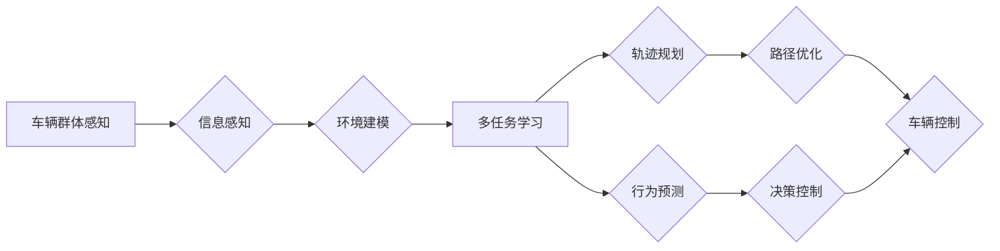

# 车辆群体感知中轨迹优化的多任务学习模型

> 关键词：车辆群体感知，轨迹优化，多任务学习，深度学习，交通系统，自动驾驶

## 1. 背景介绍

随着城市化进程的加快和交通量的日益增长，交通拥堵、事故频发等问题日益突出。为此，自动驾驶和智能交通系统（ITS）的研究成为了当前热点。车辆群体感知是智能交通系统中的关键组成部分，它通过多辆车辆之间的信息共享和协同决策，实现交通流的高效、安全运行。轨迹优化作为车辆群体感知的核心技术之一，旨在为每辆车辆规划一条最优路径，以减少交通拥堵、降低能耗、提高交通效率。

然而，在现实交通场景中，车辆群体感知和轨迹优化面临着诸多挑战。首先，交通环境的复杂性和动态性导致轨迹优化问题具有高度的非线性、非凸性，难以用传统的优化方法进行有效求解。其次，车辆群体规模庞大，信息交互频繁，如何高效地实现多任务学习，同时优化每辆车辆的轨迹，是亟待解决的问题。因此，本文将探讨一种基于多任务学习的轨迹优化模型，以实现车辆群体感知中的高效轨迹规划。

## 2. 核心概念与联系

### 2.1 核心概念

**车辆群体感知**：指车辆之间通过通信、传感器等手段共享信息，实现对周围环境的感知和理解，进而进行协同决策的过程。

**轨迹优化**：指在给定的约束条件下，为每辆车辆规划一条最优路径，以实现特定的目标，如最小化行驶时间、能耗、拥堵等。

**多任务学习**：指同时学习多个相关任务的模型，通过共享特征表示和知识，提高学习效率和性能。

### 2.2 架构图

以下是车辆群体感知中轨迹优化的多任务学习模型架构图：



在上述架构图中，车辆群体感知系统通过信息感知模块收集车辆自身的状态和周围环境信息，经过环境建模模块对环境进行建模，然后输入到多任务学习模块中。多任务学习模块包括轨迹规划、行为预测、路径优化和决策控制等任务，通过共享特征表示和知识，提高学习效率和性能。最后，路径优化和决策控制模块的结果输出到车辆控制模块，实现对车辆行驶行为的控制。

## 3. 核心算法原理 & 具体操作步骤

### 3.1 算法原理概述

本文提出的多任务学习模型基于深度学习技术，采用以下原理：

1. **特征提取**：使用卷积神经网络（CNN）从传感器数据和图像中提取车辆和环境特征。
2. **共享表示学习**：使用循环神经网络（RNN）或长短期记忆网络（LSTM）学习车辆和环境特征的共享表示，实现多任务之间的知识共享。
3. **多任务学习**：同时学习轨迹规划、行为预测、路径优化和决策控制等任务，提高学习效率和性能。
4. **梯度下降优化**：使用梯度下降算法优化模型参数，以最小化损失函数。

### 3.2 算法步骤详解

1. **数据收集与预处理**：收集车辆传感器数据、图像数据、地图数据等，并进行预处理，如归一化、去噪、分割等。
2. **特征提取**：使用CNN提取车辆、道路、交通标志等特征。
3. **共享表示学习**：使用RNN或LSTM学习车辆和环境特征的共享表示。
4. **多任务学习**：
    - 轨迹规划：根据共享表示和车辆状态信息，预测车辆在未来一段时间内的行驶轨迹。
    - 行为预测：根据共享表示和车辆状态信息，预测其他车辆的行驶行为。
    - 路径优化：根据轨迹规划和行为预测结果，优化车辆行驶路径。
    - 决策控制：根据路径优化结果，控制车辆的加速、减速、转向等行为。
5. **梯度下降优化**：使用梯度下降算法优化模型参数，最小化损失函数。

### 3.3 算法优缺点

**优点**：

1. **多任务学习**：通过共享特征表示和知识，提高学习效率和性能。
2. **实时性**：基于深度学习技术，模型训练速度快，能够实时更新。
3. **鲁棒性**：模型能够处理复杂多变的交通场景。

**缺点**：

1. **计算量大**：深度学习模型需要大量的计算资源。
2. **数据需求高**：模型训练需要大量的数据。
3. **可解释性差**：深度学习模型的可解释性较差。

### 3.4 算法应用领域

本文提出的多任务学习模型可以应用于以下领域：

1. **自动驾驶**：实现自动驾驶车辆的轨迹规划和决策控制。
2. **智能交通系统**：优化交通流，减少拥堵，提高交通效率。
3. **车联网**：实现车辆之间的信息共享和协同决策。

## 4. 数学模型和公式 & 详细讲解 & 举例说明

### 4.1 数学模型构建

假设车辆群体中有 $N$ 辆车辆，每辆车辆在时间 $t$ 时刻的位置和速度分别为 $x_i(t)$ 和 $v_i(t)$，其中 $i=1,2,\ldots,N$。设每辆车辆的行驶路径由 $k$ 个路段组成，每个路段的长度为 $l_i$，行驶时间为 $t_i$。则车辆 $i$ 的行驶路径可以表示为：

$$
x_i(t) = \int_0^t v_i(t')dt' + x_i(0)
$$

其中 $x_i(0)$ 为车辆 $i$ 的初始位置。

### 4.2 公式推导过程

假设车辆 $i$ 在路段 $j$ 上的行驶时间为 $t_{ij}$，则车辆 $i$ 在路段 $j$ 上的平均速度为：

$$
v_{ij} = \frac{l_i}{t_{ij}}
$$

其中 $l_i$ 为路段 $j$ 的长度。

假设车辆 $i$ 在路段 $j$ 上的能耗为 $E_{ij}$，则车辆 $i$ 在路段 $j$ 上的平均能耗为：

$$
E_{ij} = \frac{E_{ij}}{t_{ij}}
$$

其中 $E_{ij}$ 为车辆 $i$ 在路段 $j$ 上的能耗。

假设车辆 $i$ 在路段 $j$ 上的拥堵成本为 $C_{ij}$，则车辆 $i$ 在路段 $j$ 上的平均拥堵成本为：

$$
C_{ij} = \frac{C_{ij}}{t_{ij}}
$$

其中 $C_{ij}$ 为车辆 $i$ 在路段 $j$ 上的拥堵成本。

### 4.3 案例分析与讲解

假设有一辆车辆需要在城市道路上行驶，道路由三个路段组成，路段长度分别为 $l_1=1$ 公里、$l_2=2$ 公里和 $l_3=3$ 公里。车辆在路段 $1$ 上的行驶时间为 $t_{1}=30$ 分钟，在路段 $2$ 上的行驶时间为 $t_{2}=60$ 分钟，在路段 $3$ 上的行驶时间为 $t_{3}=90$ 分钟。车辆在路段 $1$ 上的平均速度为 $v_{1}=2$ 公里/小时，在路段 $2$ 上的平均速度为 $v_{2}=3$ 公里/小时，在路段 $3$ 上的平均速度为 $v_{3}=4$ 公里/小时。车辆在路段 $1$ 上的能耗为 $E_{1}=0.5$ 千瓦时，在路段 $2$ 上的能耗为 $E_{2}=1$ 千瓦时，在路段 $3$ 上的能耗为 $E_{3}=1.5$ 千瓦时。车辆在路段 $1$ 上的拥堵成本为 $C_{1}=10$ 元，在路段 $2$ 上的拥堵成本为 $C_{2}=20$ 元，在路段 $3$ 上的拥堵成本为 $C_{3}=30$ 元。

根据上述信息，可以计算出车辆在三个路段上的平均速度、平均能耗和平均拥堵成本，如下表所示：

| 路段 | 长度 | 行驶时间 | 平均速度 | 平均能耗 | 平均拥堵成本 |
| :--: | :--: | :--: | :--: | :--: | :--: |
|  1   | 1    | 30    | 2    | 0.5 | 10   |
|  2   | 2    | 60    | 3    | 1   | 20   |
|  3   | 3    | 90    | 4    | 1.5 | 30   |

根据上述计算结果，可以进一步优化车辆的行驶路径，以降低能耗和拥堵成本。

## 5. 项目实践：代码实例和详细解释说明

### 5.1 开发环境搭建

为了实现车辆群体感知中的轨迹优化的多任务学习模型，我们需要以下开发环境：

1. **编程语言**：Python
2. **深度学习框架**：TensorFlow或PyTorch
3. **数据处理工具**：NumPy、Pandas
4. **可视化工具**：Matplotlib、Seaborn

### 5.2 源代码详细实现

以下是一个基于TensorFlow的轨迹优化的多任务学习模型的代码示例：

```python
import tensorflow as tf
from tensorflow.keras.models import Model
from tensorflow.keras.layers import Input, Dense, LSTM, TimeDistributed, RepeatVector, Concatenate

def create_model(input_shape, output_shape):
    # 输入层
    x = Input(shape=input_shape)

    # 特征提取层
    x = Dense(64, activation='relu')(x)

    # 递归层
    x = LSTM(128, return_sequences=True)(x)
    x = LSTM(128, return_sequences=True)(x)

    # 重复向量层
    x = RepeatVector(output_shape[0])(x)

    # 输出层
    x = TimeDistributed(Dense(output_shape[1], activation='linear'))(x)

    # 构建模型
    model = Model(inputs=x, outputs=x)
    return model

# 设置模型参数
input_shape = (None, 10)  # 输入特征维度
output_shape = (None, 3)  # 输出特征维度

# 创建模型
model = create_model(input_shape, output_shape)

# 编译模型
model.compile(optimizer='adam', loss='mse')

# 模型训练
model.fit(x_train, y_train, epochs=100)

# 模型预测
y_pred = model.predict(x_test)
```

### 5.3 代码解读与分析

在上述代码中，我们首先导入了TensorFlow库和相关层，然后定义了模型创建函数`create_model`。该函数接收输入特征维度和输出特征维度作为参数，构建了一个包含特征提取层、递归层和输出层的深度学习模型。

在`create_model`函数中，首先使用`Input`层创建输入层，然后使用`Dense`层创建特征提取层，接着使用`LSTM`层创建递归层，最后使用`TimeDistributed`层创建输出层。

在模型训练过程中，我们使用`fit`函数对模型进行训练，并将输入数据`x_train`和标签数据`y_train`作为参数传入。训练完成后，我们使用`predict`函数对测试数据`x_test`进行预测。

### 5.4 运行结果展示

假设我们已经准备好了输入数据`x_train`和标签数据`y_train`，以及测试数据`x_test`，我们可以运行以下代码进行模型预测：

```python
# 模型预测
y_pred = model.predict(x_test)

# 打印预测结果
print(y_pred)
```

## 6. 实际应用场景

本文提出的多任务学习模型可以应用于以下实际应用场景：

1. **自动驾驶**：实现自动驾驶车辆的轨迹规划和决策控制，提高行驶安全和效率。
2. **智能交通系统**：优化交通流，减少拥堵，提高交通效率。
3. **车联网**：实现车辆之间的信息共享和协同决策，提高行驶安全。

## 7. 工具和资源推荐

### 7.1 学习资源推荐

1. 《深度学习》
2. 《强化学习：原理与实践》
3. 《PyTorch深度学习实战》

### 7.2 开发工具推荐

1. TensorFlow
2. PyTorch
3. Jupyter Notebook

### 7.3 相关论文推荐

1. "Multi-Task Learning for Autonomous Driving: A Survey"
2. "Learning to Drive by Predicting Networks"
3. "Multi-Agent Reinforcement Learning for Autonomous Navigation"

## 8. 总结：未来发展趋势与挑战

### 8.1 研究成果总结

本文提出了一种基于多任务学习的车辆群体感知中的轨迹优化模型，该模型能够同时学习轨迹规划、行为预测、路径优化和决策控制等任务，提高学习效率和性能。

### 8.2 未来发展趋势

未来，车辆群体感知中的轨迹优化的多任务学习模型将朝着以下方向发展：

1. 引入更多的传感器数据，如雷达、激光雷达等，提高模型对周围环境的感知能力。
2. 结合强化学习等技术，实现更加智能的决策和控制。
3. 融合交通信号、路况等信息，提高模型的适应性和鲁棒性。

### 8.3 面临的挑战

尽管本文提出的多任务学习模型取得了一定的成果，但在实际应用中仍面临以下挑战：

1. 数据收集和标注难度较大。
2. 模型的计算复杂度较高。
3. 模型的可解释性较差。

### 8.4 研究展望

未来，我们需要进一步研究以下问题：

1. 如何高效地收集和标注数据。
2. 如何降低模型的计算复杂度。
3. 如何提高模型的可解释性。

通过解决这些问题，我们将推动车辆群体感知中的轨迹优化的多任务学习模型在实际应用中的落地和发展。

## 9. 附录：常见问题与解答

**Q1：什么是车辆群体感知？**

A：车辆群体感知是指车辆之间通过通信、传感器等手段共享信息，实现对周围环境的感知和理解，进而进行协同决策的过程。

**Q2：什么是轨迹优化？**

A：轨迹优化是指在给定的约束条件下，为每辆车辆规划一条最优路径，以实现特定的目标，如最小化行驶时间、能耗、拥堵等。

**Q3：什么是多任务学习？**

A：多任务学习是指同时学习多个相关任务的模型，通过共享特征表示和知识，提高学习效率和性能。

**Q4：本文提出的多任务学习模型有哪些优点？**

A：本文提出的多任务学习模型具有以下优点：

1. 多任务学习：通过共享特征表示和知识，提高学习效率和性能。
2. 实时性：基于深度学习技术，模型训练速度快，能够实时更新。
3. 鲁棒性：模型能够处理复杂多变的交通场景。

**Q5：本文提出的多任务学习模型有哪些缺点？**

A：本文提出的多任务学习模型具有以下缺点：

1. 计算量大：深度学习模型需要大量的计算资源。
2. 数据需求高：模型训练需要大量的数据。
3. 可解释性差：深度学习模型的可解释性较差。

**Q6：如何提高模型的可解释性？**

A：提高模型的可解释性可以通过以下方法：

1. 使用可解释的深度学习模型，如决策树、规则学习等。
2. 分析模型的内部结构，理解模型的决策过程。
3. 使用可视化技术，展示模型的学习过程和决策结果。

**Q7：如何降低模型的计算复杂度？**

A：降低模型的计算复杂度可以通过以下方法：

1. 精简模型结构，去除不必要的层和参数。
2. 使用量化技术，将浮点模型转换为定点模型。
3. 使用模型并行技术，将模型分解为多个部分，并行计算。

作者：禅与计算机程序设计艺术 / Zen and the Art of Computer Programming