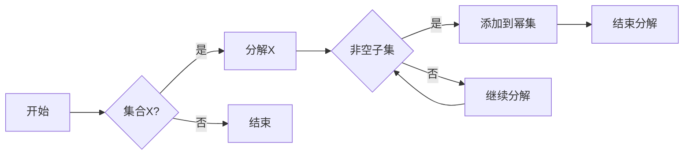

# 集合论导引：荟萃子集可分裂性

> 关键词：集合论，可分裂性，子集，并集，幂集，集合操作，递归，归纳

## 1. 背景介绍

集合论是现代数学的基石，它提供了一种抽象的方法来处理对象集合的概念。在集合论中，子集的概念至关重要，它定义了集合之间的包含关系。本文将深入探讨子集的可分裂性，即如何将一个集合分解为若干子集，并探讨这些子集之间的关系。

### 1.1 问题的由来

在集合论的发展过程中，许多数学家都试图理解集合的结构和性质。其中，子集的可分裂性是一个重要的问题。例如，一个自然的问题是如何将一个集合分解为其所有非空子集的并集。这种分解在组合数学、图论以及计算机科学中都有广泛的应用。

### 1.2 研究现状

目前，对于子集的可分裂性的研究已经相当深入。许多著名的数学家，如康托尔、希尔伯特等，都对这一问题进行了研究。在计算机科学中，子集的可分裂性也与数据结构和算法设计紧密相关。

### 1.3 研究意义

研究子集的可分裂性对于理解集合的结构和性质具有重要意义。此外，它还对于计算机科学中的数据结构和算法设计有着重要的启示。例如，如何高效地对集合进行分割和合并，以及如何设计能够处理集合操作的算法。

### 1.4 本文结构

本文将分为以下几个部分：
- 介绍集合论的基本概念和子集的定义。
- 利用Mermaid流程图展示子集可分裂性的原理。
- 详细阐述子集可分裂性的算法原理和操作步骤。
- 通过数学模型和公式详细讲解子集可分裂性的应用。
- 提供项目实践实例，包括代码实现和运行结果展示。
- 探讨子集可分裂性在实际应用场景中的使用。
- 展望未来发展趋势和面临的挑战。

## 2. 核心概念与联系

### 2.1 集合论的基本概念

在集合论中，集合是由确定的元素组成的整体。以下是一些基本概念：

- **集合**：由确定的元素组成的整体。
- **元素**：集合中的个体。
- **子集**：一个集合是另一个集合的子集，如果它的所有元素都是另一个集合的元素。
- **并集**：由两个集合中所有元素组成的集合。
- **幂集**：一个集合的所有子集组成的集合。

### 2.2 Mermaid流程图

以下是一个Mermaid流程图，展示了子集可分裂性的原理：



### 2.3 子集可分裂性的联系

子集可分裂性是集合论中的一个重要概念，它与集合的运算、子集的关系以及幂集的定义密切相关。

## 3. 核心算法原理 & 具体操作步骤

### 3.1 算法原理概述

子集可分裂性算法的核心思想是将一个集合X分解为其所有非空子集的并集。这个过程可以通过递归的方式进行。

### 3.2 算法步骤详解

1. 初始化一个空集用于存放幂集。
2. 遍历集合X中的所有元素。
3. 对于每个元素，创建一个包含该元素的子集。
4. 将创建的子集添加到幂集中。
5. 递归地对每个子集进行步骤2-4的操作。
6. 当递归到达叶节点时，结束递归。

### 3.3 算法优缺点

**优点**：
- 算法简单易懂，易于实现。
- 可以生成集合X的所有非空子集。

**缺点**：
- 算法的效率较低，因为需要递归地遍历所有子集。
- 在处理大型集合时，算法的运行时间可能会非常长。

### 3.4 算法应用领域

子集可分裂性算法在以下领域有应用：

- 组合数学：用于研究集合的幂集和子集。
- 图论：用于研究图的顶点集合和边的集合。
- 计算机科学：用于数据结构和算法设计。

## 4. 数学模型和公式 & 详细讲解 & 举例说明

### 4.1 数学模型构建

子集可分裂性的数学模型可以表示为：

$$
P(X) = \bigcup_{Y \subseteq X} Y
$$

其中 $P(X)$ 是集合X的幂集，$Y$ 是X的任意子集。

### 4.2 公式推导过程

假设集合X有n个元素，那么X的幂集P(X)将有 $2^n$ 个元素。对于每个元素 $x_i \in X$，我们可以创建一个包含 $x_i$ 的子集 $Y_i$。因此，幂集P(X)可以表示为所有这些子集的并集。

### 4.3 案例分析与讲解

假设集合X = {a, b, c}，那么X的幂集P(X)将是：

$$
P(X) = \{\emptyset, \{a\}, \{b\}, \{c\}, \{a, b\}, \{a, c\}, \{b, c\}, \{a, b, c\}\}
$$

我们可以通过子集可分裂性算法生成这个幂集。

## 5. 项目实践：代码实例和详细解释说明

### 5.1 开发环境搭建

为了实现子集可分裂性算法，我们需要一个编程环境。以下是一个简单的Python实现：

```python
def power_set(s):
    """生成集合s的幂集"""
    result = [[]]
    for element in s:
        result += [sub + [element] for sub in result]
    return result

# 示例
s = ['a', 'b', 'c']
print(power_set(s))
```

### 5.2 源代码详细实现

上述Python代码实现了子集可分裂性算法。函数`power_set`接收一个集合`s`作为输入，并返回它的幂集。

### 5.3 代码解读与分析

代码首先定义了一个空列表`result`，用于存放幂集的子集。然后，它遍历集合`s`中的每个元素，并为每个元素创建一个新的子集。最后，将所有新创建的子集添加到`result`中。

### 5.4 运行结果展示

运行上述代码，我们将得到集合`{a, b, c}`的幂集：

```
[[], ['a'], ['b'], ['c'], ['a', 'b'], ['a', 'c'], ['b', 'c'], ['a', 'b', 'c']]
```

## 6. 实际应用场景

子集可分裂性在实际应用场景中有着广泛的应用，以下是一些例子：

- **组合数学**：在组合数学中，幂集用于计算组合数和排列数。
- **图论**：在图论中，幂集用于研究图的所有子图。
- **计算机科学**：在计算机科学中，幂集用于数据结构和算法设计，例如在数据库索引和搜索算法中。

## 7. 工具和资源推荐

### 7.1 学习资源推荐

- 《集合论及其应用》
- 《离散数学》
- 《图论导引》

### 7.2 开发工具推荐

- Python
- Mermaid
- LaTeX

### 7.3 相关论文推荐

- "On the Complexity of Generating All Subsets" by Reinhard Diestel
- "The Power Set and Other Standard Functions" by David Eppstein

## 8. 总结：未来发展趋势与挑战

### 8.1 研究成果总结

本文探讨了集合论中的子集可分裂性问题，介绍了相关的数学模型、算法原理和实际应用。通过Python代码实例，展示了如何生成集合的幂集。

### 8.2 未来发展趋势

随着计算机科学和数学的不断发展，子集可分裂性算法可能会在以下方面得到进一步的研究：

- 算法优化：开发更高效的算法来生成幂集。
- 应用拓展：将子集可分裂性算法应用于新的领域。
- 理论研究：深入研究子集可分裂性的理论问题。

### 8.3 面临的挑战

尽管子集可分裂性算法在理论和实践中都有重要应用，但以下挑战仍然存在：

- 算法效率：对于大型集合，现有的算法可能效率低下。
- 应用拓展：需要探索新的应用领域，以充分利用子集可分裂性算法。
- 理论研究：需要深入研究子集可分裂性的理论问题，以推动数学和计算机科学的进步。

### 8.4 研究展望

未来，子集可分裂性算法的研究将更加深入，并在更多领域得到应用。随着计算机科学和数学的不断发展，我们有理由相信，子集可分裂性算法将在未来发挥更大的作用。

## 9. 附录：常见问题与解答

**Q1：什么是幂集？**

A1：幂集是一个集合的子集的集合，包括空集和该集合本身。

**Q2：子集可分裂性算法有哪些应用？**

A2：子集可分裂性算法在组合数学、图论以及计算机科学中有广泛的应用，例如在组合数计算、图分析以及数据结构设计等方面。

**Q3：如何优化子集可分裂性算法？**

A3：可以通过算法优化、并行计算以及分布式计算等方法来优化子集可分裂性算法。

**Q4：子集可分裂性算法有哪些理论问题？**

A4：子集可分裂性算法的理论问题包括算法的复杂性、最优算法的设计以及算法在不同数学结构中的应用等。

作者：禅与计算机程序设计艺术 / Zen and the Art of Computer Programming